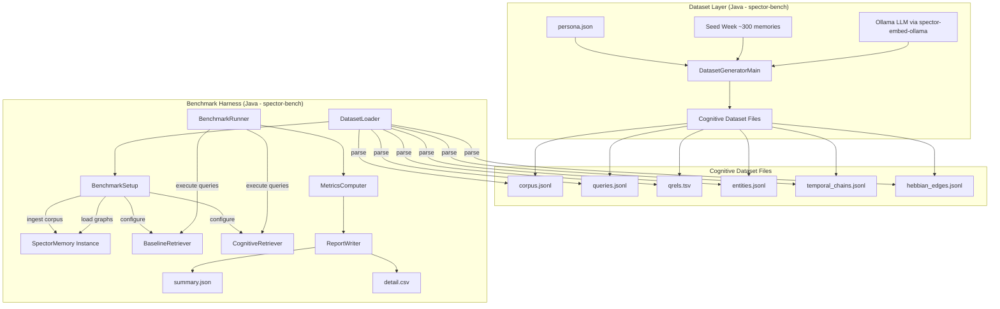
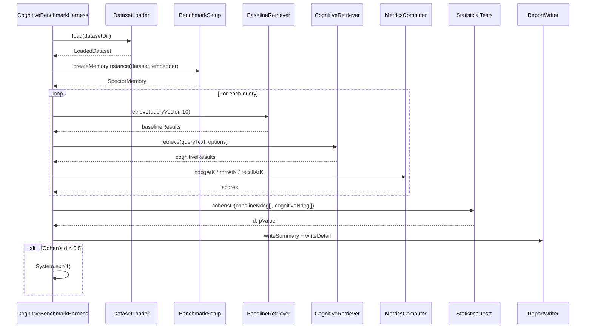

# Design Document: Cognitive Memory Benchmark

## Overview

This design specifies the architecture and implementation of a comprehensive cognitive memory benchmark framework for Spector Memory. The system consists of three major subsystems:

1. **Cognitive Benchmark Dataset** — A BEIR-inspired dataset format extended with cognitive annotations (valence, importance, synaptic tags, temporal chains, entity relations, Hebbian edges, arousal) that exercises all Spector Memory subsystems.
2. **Benchmark Harness** — A Java-based test execution engine (in `spector-bench`) that loads the dataset, runs queries against both a baseline (vector-only) retriever and the full cognitive retrieval pipeline, computes IR metrics (nDCG@10, MRR@10, Recall@10), and produces comparative reports.
3. **Dataset Generation Pipeline** — A Java pipeline using the existing `spector-embed-ollama` module to expand a hand-crafted seed dataset (~300 memories) into a full-scale corpus (2000+ memories) grounded in a realistic user persona.

The benchmark quantitatively demonstrates that the 6-phase fused cognitive scoring pipeline (CognitiveScorer) outperforms vanilla semantic (vector-only) search, measured via Cohen's d ≥ 0.5 on per-query nDCG@10 differences.

### Key Design Decisions

| Decision | Rationale |
|----------|-----------|
| Extend BEIR format rather than invent new | Familiar to IR community; existing tooling interoperates |
| Place harness in `spector-bench` module | Existing module with JMH, Jackson, full memory dependency |
| Use JSONL for corpus/queries/entities/edges | Streaming parse, no memory spike for 2000+ records |
| TSV for qrels | Standard BEIR/TREC format, simple to generate and parse |
| RecallMode.OBSERVE for all benchmark queries | Prevents habituation/LTP side effects from polluting metric runs |
| Cohen's d ≥ 0.5 as minimum pass threshold | Medium effect size per Cohen (1988); meaningful practical difference |
| Java generator pipeline in spector-bench | Shares domain models (MemoryType, EntityType, RelationType, CognitiveProfile, SynapticTagEncoder); single Maven build system; reuses spector-embed-ollama REST client; validation shares DatasetLoader code |
| Persona-grounded generation | Ensures temporal and emotional coherence across thousands of memories |

## Architecture

### High-Level System Diagram



### Module Placement

```
spector-bench/
├── src/main/java/com/spectrayan/spector/bench/
│   └── cognitive/
│       ├── CognitiveBenchmarkHarness.java      # Main entry point
│       ├── DatasetLoader.java                  # JSONL/TSV parsing
│       ├── BenchmarkSetup.java                 # Memory instance setup
│       ├── BaselineRetriever.java              # Vector-only scorer
│       ├── CognitiveRetriever.java             # Full pipeline wrapper
│       ├── MetricsComputer.java                # nDCG, MRR, Recall@K
│       ├── StatisticalTests.java               # Cohen's d, paired t-test
│       ├── ReportWriter.java                   # JSON + CSV output
│       └── model/                              # Dataset POJOs
│           ├── BenchmarkCorpusRecord.java
│           ├── BenchmarkQuery.java
│           ├── RelevanceJudgment.java
│           ├── EntityRelation.java
│           ├── TemporalChainDef.java
│           └── HebbianEdgeDef.java
└── src/test/java/com/spectrayan/spector/bench/
    └── cognitive/
        ├── DatasetLoaderTest.java
        ├── MetricsComputerTest.java
        ├── BaselineRetrieverTest.java
        ├── ScoringPipelineValidationTest.java
        └── CognitiveBenchmarkIntegrationTest.java

datasets/
└── cognitive-benchmark/
    ├── persona.json
    ├── corpus.jsonl
    ├── queries.jsonl
    ├── qrels.tsv
    ├── entities.jsonl
    ├── temporal_chains.jsonl
    └── hebbian_edges.jsonl

spector-bench/src/main/java/com/spectrayan/spector/bench/cognitive/generator/
├── DatasetGeneratorMain.java        # Main entry point with CLI args
├── GeneratorConfig.java             # Configuration record
├── PersonaLoader.java               # Persona loading/validation
├── ConversationGenerator.java       # LLM conversation generation via spector-embed-ollama
├── CognitiveAnnotator.java          # Cognitive metadata annotation via LLM
├── GraphBuilder.java                # Entity/Hebbian/Temporal graph construction
├── QueryGenerator.java              # Query + qrels generation
├── DatasetValidator.java            # Cross-file consistency checks
└── OllamaCompletionClient.java      # Ollama chat/completion client with retry (wraps spector-embed-ollama or direct HTTP for chat completions)
```

## Components and Interfaces

### 1. DatasetLoader

Parses all dataset files into typed Java records. Validates referential integrity on load.

```java
public final class DatasetLoader {

    public record LoadedDataset(
        List<BenchmarkCorpusRecord> corpus,
        List<BenchmarkQuery> queries,
        Map<String, Map<String, Integer>> qrels, // queryId -> {corpusId -> grade}
        List<EntityRelation> entityRelations,
        List<TemporalChainDef> temporalChains,
        List<HebbianEdgeDef> hebbianEdges,
        PersonaDef persona
    ) {}

    /**
     * Loads the complete dataset from a directory.
     * @param datasetDir path to directory containing all dataset files
     * @return parsed and validated dataset
     * @throws DatasetValidationException if referential integrity fails
     */
    public LoadedDataset load(Path datasetDir) { ... }
}
```

### 2. BenchmarkSetup

Bootstraps a `SpectorMemory` instance populated with the benchmark corpus. Configures graphs (Hebbian, Temporal, Entity) from dataset definitions.

```java
public final class BenchmarkSetup implements AutoCloseable {

    /**
     * Creates a fully-populated memory instance from the dataset.
     * Uses RecallMode.OBSERVE to prevent state mutations during benchmarking.
     */
    public SpectorMemory createMemoryInstance(LoadedDataset dataset, 
                                              EmbeddingProvider embedder) { ... }

    /**
     * Populates the HebbianGraph from hebbian_edges.jsonl definitions.
     */
    void loadHebbianEdges(HebbianGraph graph, List<HebbianEdgeDef> edges,
                          Map<String, Integer> idToSlot) { ... }

    /**
     * Populates the TemporalChain from temporal_chains.jsonl definitions.
     */
    void loadTemporalChains(TemporalChain chain, List<TemporalChainDef> chains,
                            Map<String, Integer> idToSlot) { ... }

    /**
     * Populates the EntityGraph from entities.jsonl definitions.
     */
    void loadEntityGraph(EntityGraph graph, List<EntityRelation> relations,
                         List<BenchmarkCorpusRecord> corpus) { ... }
}
```

### 3. BaselineRetriever

A minimal retriever that scores corpus memories using **only** L2 vector distance converted to similarity, without any cognitive scoring phases.

```java
public final class BaselineRetriever {

    /**
     * Retrieves top-K results using pure vector similarity.
     * similarity = 1.0 / (1.0 + L2_distance)
     * No tag gating, no valence filter, no importance weighting, no graph augmentation.
     */
    public List<ScoredResult> retrieve(float[] queryVector, int topK) { ... }

    public record ScoredResult(String memoryId, float score) {}
}
```

### 4. CognitiveRetriever

Wraps the full `RecallPipeline` with `RecallMode.OBSERVE` to prevent side effects during benchmarking.

```java
public final class CognitiveRetriever {

    /**
     * Executes recall through the full 6-phase scoring pipeline + graph augmentation.
     * Uses RecallMode.OBSERVE to prevent habituation/LTP mutations.
     */
    public List<ScoredResult> retrieve(String queryText, RecallOptions options) { ... }

    /**
     * Builds RecallOptions from a BenchmarkQuery's cognitive profile and filters.
     */
    RecallOptions buildOptions(BenchmarkQuery query) { ... }
}
```

### 5. MetricsComputer

Computes standard IR evaluation metrics from ranked result lists against ground-truth relevance judgments.

```java
public final class MetricsComputer {

    /** Computes nDCG@K with graded relevance (0-3 scale). */
    public double ndcgAtK(List<String> rankedIds, Map<String, Integer> qrels, int k) { ... }

    /** Computes MRR@K (reciprocal rank of first relevant result). */
    public double mrrAtK(List<String> rankedIds, Map<String, Integer> qrels, int k) { ... }

    /** Computes Recall@K (proportion of relevant docs in top-K). */
    public double recallAtK(List<String> rankedIds, Map<String, Integer> qrels, int k) { ... }
}
```

### 6. StatisticalTests

Performs statistical significance testing on per-query metric differences.

```java
public final class StatisticalTests {

    /** Computes Cohen's d effect size for paired samples. */
    public static double cohensD(double[] baseline, double[] cognitive) { ... }

    /** Computes p-value from a paired t-test. */
    public static double pairedTTestPValue(double[] baseline, double[] cognitive) { ... }
}
```

### 7. ReportWriter

Produces the summary JSON and per-query detail CSV output files.

```java
public final class ReportWriter {

    public record BenchmarkReport(
        Instant timestamp,
        int corpusSize,
        int queryCount,
        RetrieverMetrics baselineMetrics,
        RetrieverMetrics cognitiveMetrics,
        SubsystemContributions subsystemContributions,
        Map<String, Double> perProfileNdcg,
        WinTieLoss winTieLoss,
        double cohensD,
        double pValue,
        double avgLatencyMs
    ) {}

    public record RetrieverMetrics(double ndcg10, double mrr10, double recall10, 
                                    double avgLatencyMs) {}

    public record SubsystemContributions(double hebbian, double temporal, double entity,
                                          double importance, double valence, double tagGating) {}

    public record WinTieLoss(int wins, int ties, int losses) {}

    /** Writes summary.json */
    public void writeSummary(Path outputDir, BenchmarkReport report) { ... }

    /** Writes detail.csv with per-query breakdown */
    public void writeDetail(Path outputDir, List<QueryResult> results) { ... }
}
```

### Component Interaction Sequence



## Data Models

### Dataset File Schemas

#### corpus.jsonl — Each line:
```json
{
  "id": "mem-001",
  "text": "Had a great debugging session today, finally found the race condition in the payment service.",
  "title": "Debugging Race Condition",
  "synaptic_tags": ["debugging", "payments", "concurrency"],
  "valence": 45,
  "importance": 6.5,
  "arousal": 120,
  "session_id": "session-2025-06-15-work",
  "timestamp_ms": 1750003200000,
  "entity_mentions": [
    {"name": "payment service", "type": "SOFTWARE"},
    {"name": "Alice", "type": "PERSON"}
  ],
  "memory_type": "EPISODIC",
  "recall_count": 2
}
```

#### queries.jsonl — Each line:
```json
{
  "id": "q-001",
  "text": "What was the concurrency bug I fixed recently?",
  "cognitive_profile": "DEBUGGING",
  "synaptic_filter_tags": ["debugging", "concurrency"],
  "min_valence": null,
  "max_valence": -10,
  "expected_subsystem": "TAG_GATING",
  "temporal_hint": "RECENT"
}
```

#### qrels.tsv:
```
query_id	corpus_id	relevance_grade
q-001	mem-001	3
q-001	mem-042	2
q-001	mem-099	1
```

#### entities.jsonl — Each line:
```json
{
  "from_entity": {"name": "Alice", "type": "PERSON"},
  "to_entity": {"name": "payment service", "type": "SOFTWARE"},
  "relation_type": "WORKS_ON",
  "source_memory_ids": ["mem-001", "mem-015", "mem-022"]
}
```

#### temporal_chains.jsonl — Each line:
```json
{
  "session_id": "session-2025-06-15-work",
  "ordered_memory_ids": ["mem-098", "mem-099", "mem-001", "mem-002"]
}
```

#### hebbian_edges.jsonl — Each line:
```json
{
  "memory_id_a": "mem-001",
  "memory_id_b": "mem-015",
  "co_activation_count": 7
}
```

#### persona.json:
```json
{
  "name": "Jordan Chen",
  "age": 32,
  "occupation": "Senior Software Engineer",
  "interests": ["distributed systems", "running", "cooking", "sci-fi novels", "guitar"],
  "life_context": "Works at a mid-size fintech startup, lives with partner Sam and a cat named Byte. Recently promoted to tech lead. Training for a half-marathon.",
  "personality_traits": ["analytical", "introverted", "curious", "detail-oriented", "empathetic"],
  "companion_relationship": "Has been using OpenClaw as a daily companion for 6 months. Shares work frustrations, personal wins, health tracking, and creative ideas."
}
```

### Java Model Records

```java
// Dataset model records in com.spectrayan.spector.bench.cognitive.model

public record BenchmarkCorpusRecord(
    String id,
    String text,
    String title,
    List<String> synapticTags,
    byte valence,
    float importance,
    int arousal,          // unsigned 0-255
    String sessionId,
    long timestampMs,
    List<EntityMention> entityMentions,
    MemoryType memoryType,
    int recallCount
) {}

public record EntityMention(String name, String type) {}

public record BenchmarkQuery(
    String id,
    String text,
    CognitiveProfile cognitiveProfile,
    List<String> synapticFilterTags,
    Byte minValence,      // nullable
    Byte maxValence,      // nullable
    String expectedSubsystem,
    String temporalHint   // RECENT, OLD, or null
) {}

public record RelevanceJudgment(String queryId, String corpusId, int grade) {}

public record EntityRelation(
    EntityMention fromEntity,
    EntityMention toEntity,
    String relationType,
    List<String> sourceMemoryIds
) {}

public record TemporalChainDef(String sessionId, List<String> orderedMemoryIds) {}

public record HebbianEdgeDef(String memoryIdA, String memoryIdB, int coActivationCount) {}

public record PersonaDef(
    String name, int age, String occupation,
    List<String> interests, String lifeContext,
    List<String> personalityTraits, String companionRelationship
) {}
```

### Metrics Output Schema (summary.json)

```json
{
  "timestamp": "2025-07-15T14:30:00Z",
  "corpus_size": 2150,
  "query_count": 200,
  "baseline_metrics": {
    "ndcg_at_10": 0.412,
    "mrr_at_10": 0.385,
    "recall_at_10": 0.340,
    "avg_latency_ms": 2.1
  },
  "cognitive_metrics": {
    "ndcg_at_10": 0.687,
    "mrr_at_10": 0.621,
    "recall_at_10": 0.580,
    "avg_latency_ms": 4.8
  },
  "subsystem_contributions": {
    "hebbian_pct": 12.5,
    "temporal_pct": 8.3,
    "entity_pct": 9.1,
    "importance_pct": 22.4,
    "valence_pct": 15.7,
    "tag_gating_pct": 31.0
  },
  "per_profile_ndcg": {
    "BALANCED": 0.72,
    "DEBUGGING": 0.81,
    "EXPLORING": 0.65
  },
  "win_tie_loss": {"wins": 165, "ties": 12, "losses": 23},
  "cohens_d": 0.82,
  "p_value": 0.00001
}
```

## Low-Level Design

### MetricsComputer — IR Metric Algorithms

```java
public final class MetricsComputer {

    /**
     * nDCG@K: Normalized Discounted Cumulative Gain
     * 
     * DCG@K = Σ_{i=1}^{K} (2^{rel_i} - 1) / log2(i + 1)
     * IDCG@K = DCG@K for the ideal ranking (sorted by relevance desc)
     * nDCG@K = DCG@K / IDCG@K
     * 
     * Graded relevance: 0=irrelevant, 1=marginal, 2=relevant, 3=highly relevant
     */
    public double ndcgAtK(List<String> rankedIds, Map<String, Integer> qrels, int k) {
        int limit = Math.min(k, rankedIds.size());
        double dcg = 0.0;
        for (int i = 0; i < limit; i++) {
            int rel = qrels.getOrDefault(rankedIds.get(i), 0);
            dcg += (Math.pow(2, rel) - 1) / log2(i + 2); // i+2 because log2(1+1)
        }

        // IDCG: sort all relevance grades descending, compute DCG
        List<Integer> idealRels = qrels.values().stream()
            .sorted(Comparator.reverseOrder())
            .limit(k)
            .toList();
        double idcg = 0.0;
        for (int i = 0; i < idealRels.size(); i++) {
            idcg += (Math.pow(2, idealRels.get(i)) - 1) / log2(i + 2);
        }

        return idcg == 0 ? 0.0 : dcg / idcg;
    }

    /**
     * MRR@K: Mean Reciprocal Rank (first relevant result with grade >= 1)
     */
    public double mrrAtK(List<String> rankedIds, Map<String, Integer> qrels, int k) {
        int limit = Math.min(k, rankedIds.size());
        for (int i = 0; i < limit; i++) {
            if (qrels.getOrDefault(rankedIds.get(i), 0) >= 1) {
                return 1.0 / (i + 1);
            }
        }
        return 0.0;
    }

    /**
     * Recall@K: fraction of relevant documents appearing in top-K
     */
    public double recallAtK(List<String> rankedIds, Map<String, Integer> qrels, int k) {
        long totalRelevant = qrels.values().stream().filter(r -> r >= 1).count();
        if (totalRelevant == 0) return 0.0;

        int limit = Math.min(k, rankedIds.size());
        long retrieved = 0;
        for (int i = 0; i < limit; i++) {
            if (qrels.getOrDefault(rankedIds.get(i), 0) >= 1) {
                retrieved++;
            }
        }
        return (double) retrieved / totalRelevant;
    }

    private static double log2(double x) {
        return Math.log(x) / Math.log(2);
    }
}
```

### StatisticalTests — Effect Size and Significance

```java
public final class StatisticalTests {

    /**
     * Cohen's d for paired samples:
     * d = mean(differences) / stdev(differences)
     * 
     * Thresholds: small=0.2, medium=0.5, large=0.8
     */
    public static double cohensD(double[] baseline, double[] cognitive) {
        assert baseline.length == cognitive.length;
        int n = baseline.length;
        double[] diffs = new double[n];
        double mean = 0.0;
        for (int i = 0; i < n; i++) {
            diffs[i] = cognitive[i] - baseline[i];
            mean += diffs[i];
        }
        mean /= n;

        double variance = 0.0;
        for (double d : diffs) {
            variance += (d - mean) * (d - mean);
        }
        variance /= (n - 1);
        double stdev = Math.sqrt(variance);

        return stdev == 0 ? 0.0 : mean / stdev;
    }

    /**
     * Paired t-test p-value using t-distribution approximation.
     * t = mean(diffs) / (stdev(diffs) / sqrt(n))
     * df = n - 1
     */
    public static double pairedTTestPValue(double[] baseline, double[] cognitive) {
        int n = baseline.length;
        double[] diffs = new double[n];
        double mean = 0.0;
        for (int i = 0; i < n; i++) {
            diffs[i] = cognitive[i] - baseline[i];
            mean += diffs[i];
        }
        mean /= n;

        double variance = 0.0;
        for (double d : diffs) {
            variance += (d - mean) * (d - mean);
        }
        variance /= (n - 1);
        double stdev = Math.sqrt(variance);
        double se = stdev / Math.sqrt(n);
        double t = se == 0 ? 0 : mean / se;

        // Approximate two-tailed p-value using Welch-Satterthwaite
        // For large n (≥30), use normal approximation
        return 2.0 * (1.0 - normalCdf(Math.abs(t)));
    }

    /** Standard normal CDF approximation (Abramowitz & Stegun). */
    private static double normalCdf(double x) {
        double t = 1.0 / (1.0 + 0.2316419 * x);
        double d = 0.3989422804014327; // 1/sqrt(2*pi)
        double prob = d * Math.exp(-x * x / 2.0) *
            (t * (0.3193815 + t * (-0.3565638 + t * (1.781478 + t * (-1.821256 + t * 1.330274)))));
        return 1.0 - prob;
    }
}
```

### BaselineRetriever — Vector-Only Scoring

```java
public final class BaselineRetriever {

    private final MemorySegment corpusSegment;
    private final CognitiveRecordLayout layout;
    private final int recordCount;
    private final float[] calibrationMins;
    private final float[] calibrationScales;

    /**
     * Scores all records using ONLY Phase 5 (L2 distance → similarity).
     * No tag gating, no valence filter, no importance, no decay, no graphs.
     * 
     * similarity = 1.0 / (1.0 + L2_distance)
     */
    public List<ScoredResult> retrieve(float[] queryVector, int topK) {
        PriorityQueue<ScoredResult> heap = new PriorityQueue<>(topK + 1,
            Comparator.comparingDouble(ScoredResult::score));

        int stride = layout.stride();
        for (int i = 0; i < recordCount; i++) {
            long offset = (long) i * stride;

            // Skip tombstoned records (fair comparison — dead records excluded in both)
            byte flags = corpusSegment.get(ValueLayout.JAVA_BYTE, offset + OFFSET_FLAGS);
            if ((flags & 0x01) != 0) continue;

            float l2dist = SimilarityFunction.EUCLIDEAN.computeQuantizedFromSegment(
                queryVector, corpusSegment, layout.vectorOffset(offset),
                calibrationMins, calibrationScales, layout.quantizedVecBytes());

            float similarity = 1.0f / (1.0f + l2dist);

            if (heap.size() < topK) {
                heap.offer(new ScoredResult(getMemoryId(i), similarity));
            } else if (similarity > heap.peek().score()) {
                heap.poll();
                heap.offer(new ScoredResult(getMemoryId(i), similarity));
            }
        }

        List<ScoredResult> results = new ArrayList<>(heap);
        results.sort(Comparator.comparingDouble(ScoredResult::score).reversed());
        return results;
    }
}
```

### CognitiveRetriever — Full Pipeline Wrapper

```java
public final class CognitiveRetriever {

    private final SpectorMemory memory;

    /**
     * Builds RecallOptions from a BenchmarkQuery, always using OBSERVE mode.
     */
    RecallOptions buildOptions(BenchmarkQuery query) {
        RecallOptions.Builder builder = RecallOptions.builder()
            .topK(10)
            .recallMode(RecallMode.OBSERVE)  // No side effects
            .profile(query.cognitiveProfile());

        if (!query.synapticFilterTags().isEmpty()) {
            builder.synapticFilter(query.synapticFilterTags().toArray(String[]::new));
        }
        if (query.minValence() != null) {
            builder.minValence(query.minValence());
        }
        if (query.maxValence() != null) {
            builder.maxValence(query.maxValence());
        }
        return builder.build();
    }

    public List<ScoredResult> retrieve(String queryText, BenchmarkQuery query) {
        RecallOptions options = buildOptions(query);
        List<CognitiveResult> results = memory.recall(queryText, options);
        return results.stream()
            .map(r -> new ScoredResult(r.id(), r.score()))
            .toList();
    }
}
```

### Subsystem Contribution Detection

```java
/**
 * Determines which subsystem(s) contributed to a result being in the
 * cognitive top-10 but NOT in the baseline top-10.
 */
public enum ContributingSubsystem {
    HEBBIAN_GRAPH,
    TEMPORAL_CHAIN,
    ENTITY_GRAPH,
    IMPORTANCE_DECAY,
    VALENCE_FILTER,
    TAG_GATING;

    /**
     * For a result in cognitive top-10 but absent from baseline top-10,
     * determines the contributing subsystem by checking:
     * 1. Is the memory reachable via Hebbian edges from a baseline seed? → HEBBIAN
     * 2. Is the memory in the temporal chain of a baseline seed? → TEMPORAL
     * 3. Is the memory linked via entity graph to a baseline seed? → ENTITY
     * 4. Does the memory have high importance that compensated for low similarity? → IMPORTANCE
     * 5. Would the memory have been filtered by valence in baseline? → VALENCE
     * 6. Was the memory gated in via tag matching? → TAG_GATING
     */
    public static Set<ContributingSubsystem> detect(
        String memoryId,
        Set<String> baselineTop10,
        HebbianGraph hebbian,
        TemporalChain temporal,
        EntityGraph entity,
        ScoreBreakdown breakdown) { ... }
}
```

### Dataset Generation Pipeline (Java) — Key Algorithms

```java
// DatasetGeneratorMain.java - Main orchestration

public final class DatasetGeneratorMain {

    public static void main(String[] args) {
        GeneratorConfig config = GeneratorConfig.fromArgs(args);
        OllamaCompletionClient ollama = new OllamaCompletionClient(
            config.ollamaUrl(), config.modelName(), config.maxRetries());
        PersonaDef persona = PersonaLoader.load(config.personaPath());
        List<BenchmarkCorpusRecord> approvedCorpus = config.approvedPath() != null
            ? new DatasetLoader().loadCorpus(config.approvedPath())
            : List.of();

        generate(config, ollama, persona, approvedCorpus);
    }

    static void generate(GeneratorConfig config, OllamaCompletionClient ollama,
                         PersonaDef persona, List<BenchmarkCorpusRecord> approvedCorpus) {

        // Phase 1: Load seed or approved corpus as base
        List<BenchmarkCorpusRecord> baseMemories = approvedCorpus.isEmpty()
            ? DatasetLoader.loadSeedCorpus(config.seedPath())
            : approvedCorpus;

        // Phase 2: Generate daily conversations for observation window
        ConversationGenerator convGen = new ConversationGenerator(ollama, persona);
        List<BenchmarkCorpusRecord> newMemories = new ArrayList<>();
        for (int day = 0; day < config.numDays(); day++) {
            List<BenchmarkCorpusRecord> dayMemories =
                convGen.generateDay(day, concat(baseMemories, newMemories));
            newMemories.addAll(dayMemories);
        }

        // Phase 3: Generate biographical/historical memories
        List<BenchmarkCorpusRecord> bioMemories =
            convGen.generateBiographical(concat(baseMemories, newMemories));
        List<BenchmarkCorpusRecord> allMemories =
            concat(baseMemories, newMemories, bioMemories);

        // Phase 4: Annotate cognitive metadata
        CognitiveAnnotator annotator = new CognitiveAnnotator(ollama, persona);
        List<BenchmarkCorpusRecord> annotated = annotator.annotateAll(allMemories);

        // Phase 5: Build graph structures
        GraphBuilder graphBuilder = new GraphBuilder();
        List<EntityRelation> entities = graphBuilder.buildEntityGraph(annotated);
        List<TemporalChainDef> temporal = graphBuilder.buildTemporalChains(annotated);
        List<HebbianEdgeDef> hebbian = graphBuilder.buildHebbianEdges(annotated);

        // Phase 6: Generate queries + relevance judgments
        QueryGenerator queryGen = new QueryGenerator(ollama, persona);
        QueryGenerator.QueriesAndQrels result =
            queryGen.generate(annotated, entities, temporal, hebbian);

        // Phase 7: Validate consistency
        DatasetValidator validator = new DatasetValidator();
        validator.validate(annotated, result.queries(), result.qrels(),
                          entities, temporal, hebbian);

        // Write output files
        DatasetWriter.write(config.outputDir(), annotated, result.queries(),
                           result.qrels(), entities, temporal, hebbian, persona);
    }
}
```

## Correctness Properties

*A property is a characteristic or behavior that should hold true across all valid executions of a system — essentially, a formal statement about what the system should do. Properties serve as the bridge between human-readable specifications and machine-verifiable correctness guarantees.*

### Property 1: Dataset Format Round-Trip

*For any* valid `BenchmarkCorpusRecord`, `BenchmarkQuery`, `EntityRelation`, `TemporalChainDef`, or `HebbianEdgeDef`, serializing it to JSONL and then parsing it back SHALL produce a record equivalent to the original.

**Validates: Requirements 1.1, 1.2, 1.4, 1.5, 1.6**

### Property 2: Referential Integrity Detection

*For any* dataset with injected referential integrity violations (dangling query_id in qrels, non-existent corpus_id in temporal chains, self-loop in hebbian edges, missing entity references), the `DatasetLoader` validator SHALL detect and report every violation without false negatives.

**Validates: Requirements 1.3, 1.5, 1.6, 18.7**

### Property 3: Baseline Retriever Strict Ordering by Distance

*For any* corpus of memory records and any query vector, the `BaselineRetriever` SHALL return results strictly ordered by ascending L2 distance (equivalently, descending similarity = 1/(1+d)), with no other signal affecting rank order.

**Validates: Requirements 2.2**

### Property 4: IR Metrics Bounds and Perfect-Ranking Identity

*For any* ranked result list and any relevance judgment map, nDCG@K ∈ [0, 1], MRR@K ∈ [0, 1], and Recall@K ∈ [0, 1]. Furthermore, *for any* ideal ranking (results sorted by descending relevance grade), nDCG@K SHALL equal 1.0.

**Validates: Requirements 2.3**

### Property 5: Win/Tie/Loss Partition Completeness

*For any* collection of per-query nDCG deltas (cognitive minus baseline), the count of wins (delta > 0.001) plus ties (|delta| ≤ 0.001) plus losses (delta < −0.001) SHALL equal the total number of queries.

**Validates: Requirements 2.4**

### Property 6: Tombstone Exclusion Invariant

*For any* query and *any* corpus memory with its tombstone flag set (flags bit 0 = 1), that memory SHALL never appear in the scoring pipeline results regardless of vector similarity, importance, or recall count.

**Validates: Requirements 3.1, 8.1**

### Property 7: Synaptic Tag Containment Gating

*For any* query with a non-zero synaptic tag mask and *any* corpus memory in the result set, the containment property `(record_tags & query_mask) == query_mask` SHALL hold. Conversely, *for any* corpus memory where containment fails, that memory SHALL NOT appear in results.

**Validates: Requirements 3.2, 13.2**

### Property 8: Valence Range Filtering

*For any* query specifying a valence range [min_valence, max_valence] and *any* corpus memory in the result set, the memory's valence SHALL satisfy `min_valence ≤ valence ≤ max_valence`.

**Validates: Requirements 3.3, 10.1, 10.2**

### Property 9: Importance Pre-Screen Exclusion

*For any* corpus memory with importance below the profile's minImportance threshold, OR with importance < 1.0 AND adjustedBucket == MAX_BUCKET(11) AND not pinned AND resolved, that memory SHALL be excluded from scoring results.

**Validates: Requirements 3.4**

### Property 10: Fused Scoring Formula Correctness

*For any* valid scoring inputs (alpha, beta, L2_distance, strictnessCoefficient, importance, decayBucket, arousal), the `CognitiveScorer` SHALL compute `finalScore = (alpha × (1/(1 + L2 × strictness)) + beta × importance × min(1.0, DECAY_BUCKETS[adjustedBucket] × arousalModifier)) × (1 + tagOverlap × tagRelevanceBoost)`.

**Validates: Requirements 3.5**

### Property 11: LTP Reconsolidation Bucket Shift

*For any* rawBucket ∈ [0, 11] and recallCount ≥ 0, `adjustForReconsolidation(rawBucket, recallCount)` SHALL equal `rawBucket >> min(recallCount, 5)`, always producing a value ∈ [0, rawBucket].

**Validates: Requirements 3.6, 12.2**

### Property 12: Result Ordering and Bounds Invariant

*For any* query execution returning N results, the results SHALL be sorted in strictly descending score order, all scores SHALL be > 0.0, and N SHALL be ≤ topK.

**Validates: Requirements 3.7**

### Property 13: Importance Dominance (Equal Similarity)

*For any* two corpus memories with identical vector distance to the query but differing importance scores (imp_A > imp_B), and a profile with beta > 0, the higher-importance memory SHALL rank above the lower-importance memory.

**Validates: Requirements 4.1, 4.3**

### Property 14: Hebbian Edge Bidirectional Loading

*For any* valid hebbian edge definition (memory_id_a, memory_id_b, co_activation_count), after loading into the `HebbianGraph`, both `graph.neighbors(a)` SHALL contain b AND `graph.neighbors(b)` SHALL contain a, with weight derived from co_activation_count.

**Validates: Requirements 5.1**

### Property 15: Hebbian Spreading Activation Attenuation

*For any* seed result in the top-K and *any* Hebbian neighbor within 2 hops, the neighbor's score boost SHALL be attenuated by `hebbianBoostFactor^hop_distance` (0.3 per hop), producing 0.3× at 1 hop and 0.09× at 2 hops.

**Validates: Requirements 5.2**

### Property 16: Temporal Chain Doubly-Linked List Integrity

*For any* temporal chain definition with ordered_memory_ids [m0, m1, ..., mn], after loading into `TemporalChain`, `next(mi) == m(i+1)` and `prev(m(i+1)) == mi` for all i ∈ [0, n-1].

**Validates: Requirements 6.1**

### Property 17: Temporal Adjacency Attenuation

*For any* seed result that is part of a temporal chain, memories up to 3 hops forward SHALL receive `temporalForwardFactor^hop` attenuation (0.8× per hop), and memories up to 3 hops backward SHALL receive `temporalBackwardFactor^hop` attenuation (0.7× per hop).

**Validates: Requirements 6.2**

### Property 18: Entity Graph Typed Edge Loading

*For any* entity relation definition, after loading into `EntityGraph`, a typed edge matching the specified `relationType` SHALL exist between the from_entity and to_entity nodes.

**Validates: Requirements 7.1**

### Property 19: Entity Graph Traversal Attenuation

*For any* query mentioning an entity present in the `EntityGraph`, traversal up to 2 hops SHALL include memories linked to discovered entities with `entityHopAttenuation^hop` score boost (0.25× per hop).

**Validates: Requirements 7.2**

### Property 20: Suppression Set Exclusion and Restoration

*For any* memory ID added to the `SuppressionSet`, that memory SHALL be excluded from all subsequent recall results. After unsuppression, that memory SHALL be eligible for recall again.

**Validates: Requirements 8.2, 8.4**

### Property 21: Arousal-Modulated Decay Ordering

*For any* two corpus memories with equal age, importance, and vector similarity but different arousal values (arousal_A > arousal_B), the higher-arousal memory SHALL rank above the lower-arousal memory due to slower decay.

**Validates: Requirements 10.3, 12.4**

### Property 22: Cognitive Profile Valence and Type Constraints

*For any* query executed with the DEBUGGING profile, all results SHALL have valence ≤ -10. *For any* query executed with the DEFAULT_MODE_NETWORK profile, all results SHALL have memoryType ∈ {SEMANTIC, PROCEDURAL}.

**Validates: Requirements 11.2, 11.4**

### Property 23: HYPERFOCUS Zero-Decay and Pure Similarity

*For any* query executed with HYPERFOCUS profile and a non-zero synaptic tag mask, scoring SHALL use alpha=1.0, beta=0.0, and memories matching the focus mask SHALL have decay clamped to 1.0 (bucket=0).

**Validates: Requirements 11.3**

### Property 24: Partial Results nDCG Computation

*For any* result set with fewer than K results (due to filtering), nDCG SHALL be computed using only the returned results without penalizing empty positions — IDCG is computed over min(K, |relevant_docs|) positions.

**Validates: Requirements 11.7**

### Property 25: Recency Dominance (Equal Similarity, Importance, Recall Count)

*For any* two corpus memories with identical vector similarity, importance, and recall count but different timestamps, the more recent memory SHALL rank higher.

**Validates: Requirements 12.1**

### Property 26: Zeigarnik Decay Clamp

*For any* corpus memory with the unresolved flag (bit 5 = 0 in flags byte, not pinned), the decay bucket SHALL be clamped to 0, making it score as if perpetually fresh regardless of actual age.

**Validates: Requirements 12.3**

### Property 27: Bloom Filter Determinism

*For any* set of synaptic tag strings, `SynapticTagEncoder.encode()` SHALL always produce the same 64-bit value — the encoding is a pure, deterministic function of the input tags.

**Validates: Requirements 13.1**

### Property 28: Bloom Filter False Positive Rate Bound

*For any* corpus of memories with ≤ 10 synaptic tags per record, the empirical false positive rate of the Bloom filter containment check SHALL be less than 0.5%.

**Validates: Requirements 13.3**

### Property 29: Tag Overlap Ratio Formula

*For any* record_tags and query_mask bit patterns, the tag overlap ratio SHALL equal `Integer.bitCount(record_tags & query_mask) / Integer.bitCount(query_mask)`.

**Validates: Requirements 13.4**

### Property 30: Consolidation Preserves Non-Pruned Memories

*For any* corpus, after sleep consolidation, all non-tombstoned and non-pruned memories SHALL remain retrievable with unchanged scores (within floating-point epsilon).

**Validates: Requirements 14.2**

### Property 31: Habituation Score Attenuation

*For any* memory recalled N times in sequence, its score SHALL be attenuated by `habituation_rate^(N-1)` (default: 0.85^(N-1)) relative to its initial score.

**Validates: Requirements 15.1, 15.2**

### Property 32: Incremental Generation Preservation

*For any* approved corpus used as input to incremental generation, all memory records in the approved corpus SHALL appear unchanged (byte-identical) in the expanded output.

**Validates: Requirements 18.9**

### Scoring Formula Validation Test Structure

For Requirement 3 (6-Phase Pipeline Validation), the benchmark creates controlled scenarios where each phase is independently exercised:

```java
/**
 * Validates each phase of CognitiveScorer independently.
 * Uses synthetic records with known properties to verify phase behavior.
 */
public class ScoringPipelineValidationTest {

    /**
     * Phase 1: Tombstone exclusion.
     * Creates 2 records — identical except one is tombstoned.
     * Verifies tombstoned record never appears in results.
     */
    @Test void tombstoneExclusion() { ... }

    /**
     * Phase 2: Tag gating.
     * Creates records with known Bloom filter encodings.
     * Verifies containment: (record_tags & query_mask) == query_mask
     */
    @Test void tagGatingContainment() { ... }

    /**
     * Phase 3: Valence filtering.
     * Creates records spanning valence -128 to +127.
     * Verifies only records within [min, max] pass.
     */
    @Test void valenceRangeFiltering() { ... }

    /**
     * Phase 4: Importance pre-screen + decay bucket MAX exclusion.
     * Verifies old + low-importance + resolved + unpinned = excluded.
     */
    @Test void importanceDecayPreScreen() { ... }

    /**
     * Phase 5: L2 distance computation.
     * Known vectors with precomputed distances.
     */
    @Test void vectorDistanceComputation() { ... }

    /**
     * Phase 6: Fused score formula.
     * alpha×sim + beta×imp×decay with known inputs.
     */
    @Test void fusedScoreFormula() { ... }
}
```


## Error Handling

### Dataset Loading Errors

| Error Condition | Behavior | Recovery |
|-----------------|----------|----------|
| Missing dataset file (corpus.jsonl, queries.jsonl, etc.) | Throw `DatasetValidationException` with file name | Abort benchmark with clear message |
| Malformed JSON line in JSONL file | Log line number and content, throw `DatasetParseException` | Abort — partial data would corrupt metrics |
| Referential integrity violation (dangling ID) | Collect all violations, throw `DatasetValidationException` with full list | Report all violations (not just first), abort |
| Corpus record with out-of-range field (e.g., importance > 10.0) | Clamp to valid range, log warning | Continue with clamped value |
| Empty corpus or empty queries file | Throw `DatasetValidationException` | Abort — cannot compute metrics on empty data |
| Unknown CognitiveProfile name in query | Default to BALANCED, log warning | Continue with fallback profile |
| Unknown MemoryType in corpus record | Throw `DatasetParseException` | Abort — MemoryType affects tier routing |
| Unknown RelationType in entities.jsonl | Default to OTHER, log warning | Continue with fallback type |

### Benchmark Execution Errors

| Error Condition | Behavior | Recovery |
|-----------------|----------|----------|
| Embedding provider unavailable | Throw `BenchmarkSetupException` | Abort with message indicating embedding service needed |
| Out of memory during corpus ingestion | Catch `OutOfMemoryError`, log corpus size | Abort with recommendation to reduce corpus or increase heap |
| Embedding dimension mismatch | Throw `IllegalStateException` at setup | Abort — vectors must be same dimension as index |
| Cohen's d < 0.5 | Log failure message, exit with status code 1 | CI pipeline detects non-zero exit |
| nDCG below regression threshold | Log regression message, exit with status code 2 | CI pipeline detects regression |
| NaN/Infinity in metric computation | Replace with 0.0, log warning | Continue — NaN typically means division by zero (no relevant docs) |
| Timeout on single query (> 30 seconds) | Log query ID, skip, mark as failed | Continue with remaining queries, note skipped count in report |

### Dataset Generation Errors (Java)

| Error Condition | Behavior | Recovery |
|-----------------|----------|----------|
| Ollama endpoint unreachable | Retry 3× with exponential backoff (2, 4, 8s) | After 3 failures: save partial output, exit non-zero |
| LLM returns invalid JSON | Retry with rephrased prompt (up to 2 retries) | After failures: skip that memory, log warning |
| Generated memory violates schema | Auto-repair (clamp values, truncate text) | If unrepairable: skip, log warning |
| Validation detects inconsistencies | Write validation error report | Exit non-zero without writing final output files |
| Persona file missing or invalid | Throw immediately, no generation attempted | User must fix persona before running |
| Approved corpus file corrupted | Throw immediately, refuse to overwrite | Protect approved data from corruption |
| Disk full during output | Catch IOException, log status | Exit non-zero, partial files may exist |

### Error Code Taxonomy

```java
public enum BenchmarkExitCode {
    SUCCESS(0),
    EFFECT_SIZE_INSUFFICIENT(1),    // Cohen's d < 0.5
    NDCG_REGRESSION(2),             // Below regression threshold
    DATASET_VALIDATION_FAILED(3),   // Referential integrity or schema errors
    SETUP_FAILED(4),                // Embedding unavailable, OOM, etc.
    PARTIAL_EXECUTION(5);           // Some queries failed/timed out

    private final int code;
    BenchmarkExitCode(int code) { this.code = code; }
    public int code() { return code; }
}
```

## Testing Strategy

### Testing Approach Overview

The cognitive memory benchmark is tested using a **dual testing approach**:

1. **Property-based tests** (via [jqwik](https://jqwik.net/) 1.9.x) — Verify universal properties across generated inputs with minimum 100 iterations per property.
2. **Example-based unit tests** (JUnit Jupiter + AssertJ) — Verify specific scenarios, edge cases, integration points, and output format correctness.

### Property-Based Testing Configuration

- **Library**: jqwik 1.9.x (Java property-based testing framework)
- **Minimum iterations**: 100 per property test
- **Tagging convention**: Each property test annotated with:
  ```java
  // Feature: cognitive-memory-benchmark, Property {N}: {title}
  ```
- **Generator strategy**: Custom `Arbitrary<>` providers for `BenchmarkCorpusRecord`, `BenchmarkQuery`, `HebbianEdgeDef`, etc.

### Property Tests (Properties 1–32)

Each correctness property from the design maps to a single property-based test:

| Property | Test Class | Key Generator |
|----------|-----------|---------------|
| 1: Dataset Round-Trip | `DatasetRoundTripPropertyTest` | `Arbitrary<BenchmarkCorpusRecord>`, `Arbitrary<BenchmarkQuery>` |
| 2: Referential Integrity | `ReferentialIntegrityPropertyTest` | `Arbitrary<LoadedDataset>` with injected violations |
| 3: Baseline Ordering | `BaselineRetrieverPropertyTest` | `Arbitrary<float[]>` query vectors, `Arbitrary<List<float[]>>` corpus |
| 4: Metrics Bounds | `MetricsComputerPropertyTest` | `Arbitrary<List<String>>` ranked IDs, `Arbitrary<Map<String,Integer>>` qrels |
| 5: Win/Tie/Loss Partition | `WinTieLossPropertyTest` | `Arbitrary<double[]>` nDCG pairs |
| 6: Tombstone Exclusion | `TombstoneExclusionPropertyTest` | Synthetic off-heap segments with tombstone flags |
| 7: Tag Containment | `TagGatingPropertyTest` | `Arbitrary<Long>` tag masks |
| 8: Valence Filtering | `ValenceFilterPropertyTest` | `Arbitrary<Byte>` valence values, ranges |
| 9: Importance Pre-Screen | `ImportancePreScreenPropertyTest` | `Arbitrary<Float>` importance, `Arbitrary<Integer>` buckets |
| 10: Fused Score Formula | `FusedScoreFormulaPropertyTest` | `Arbitrary<Float>` alpha/beta/L2/importance/decay |
| 11: LTP Reconsolidation | `ReconsolidationPropertyTest` | `Arbitrary<Integer>` rawBucket ∈ [0,11], recallCount ∈ [0,1000] |
| 12: Result Ordering | `ResultOrderingPropertyTest` | Queries against populated memory instances |
| 13: Importance Dominance | `ImportanceDominancePropertyTest` | Pairs of records with identical vectors but different importance |
| 14–19: Graph Properties | `GraphLoadingPropertyTest`, `GraphTraversalPropertyTest` | Graph topology generators |
| 20: Suppression | `SuppressionPropertyTest` | Random memory IDs + suppression/unsuppression cycles |
| 21: Arousal Ordering | `ArousalOrderingPropertyTest` | Pairs with identical properties except arousal |
| 22–23: Profile Constraints | `CognitiveProfilePropertyTest` | Queries with each profile |
| 24: Partial nDCG | `PartialNdcgPropertyTest` | Short result lists (1–9 items) |
| 25: Recency Dominance | `RecencyPropertyTest` | Pairs with identical properties except timestamp |
| 26: Zeigarnik Clamp | `ZeigarnickPropertyTest` | Records with unresolved flag |
| 27: Bloom Determinism | `BloomDeterminismPropertyTest` | `Arbitrary<List<String>>` tag sets |
| 28: Bloom FP Rate | `BloomFalsePositivePropertyTest` | 10,000+ random tag set pairs |
| 29: Tag Overlap Ratio | `TagOverlapPropertyTest` | `Arbitrary<Long>` mask pairs |
| 30: Consolidation Preservation | `ConsolidationPropertyTest` | Memory instances with known content |
| 31: Habituation Attenuation | `HabituationPropertyTest` | Repeated query executions |
| 32: Incremental Preservation | `IncrementalGenerationPropertyTest` | Known approved corpus + expansion |

### Example-Based Unit Tests

| Test | What It Verifies |
|------|------------------|
| `DatasetLoaderTest.validPersonaParsing()` | persona.json schema (Req 1.7) |
| `DatasetLoaderTest.invalidPersonaMissingFields()` | Rejection of incomplete persona |
| `MetricsComputerTest.knownNdcgValues()` | nDCG computation against hand-verified examples |
| `ReportWriterTest.summaryJsonSchema()` | Report has all required fields (Req 16.1) |
| `ReportWriterTest.csvColumns()` | CSV has correct columns (Req 16.2) |
| `ReportWriterTest.stdoutFormat()` | One-line summary format (Req 16.3) |
| `StatisticalTestsTest.knownCohensD()` | Cohen's d with known inputs |
| `BenchmarkHarnessTest.exitCodeOnLowEffectSize()` | Exit code 1 when Cohen's d < 0.5 (Req 2.6) |
| `BenchmarkHarnessTest.exitCodeOnRegression()` | Exit code 2 on nDCG regression (Req 16.4) |
| `ConsolidationTest.tombstoneRatioTrigger()` | 30% tombstone ratio triggers rebuild (Req 14.1) |
| `ConsolidationTest.lowImportancePruning()` | Low-importance unretrieved marked for pruning (Req 14.3) |

### Integration Tests

| Test | What It Verifies | Gate |
|------|------------------|------|
| `CognitiveBenchmarkIntegrationTest.fullRunSmallDataset()` | End-to-end harness with 50-memory mini-dataset | Always |
| `CognitiveBenchmarkIntegrationTest.baselineVsCognitiveComparison()` | Cognitive outperforms baseline on mini-dataset | Always |
| `CognitiveBenchmarkIntegrationTest.allProfilesProduceDifferentResults()` | Profile diversity assertion (Req 11.6) | Always |
| `DatasetGeneratorIntegrationTest.seedExpansion()` | Java generator pipeline produces valid dataset | OLLAMA_LIVE gate |
| `DatasetGeneratorIntegrationTest.incrementalGeneration()` | Incremental mode preserves approved corpus | OLLAMA_LIVE gate |

### Test Infrastructure

- **Mini-dataset**: A 50-memory, 20-query dataset checked into `src/test/resources/cognitive-benchmark-mini/` for fast CI tests (no embedding service required — pre-computed embeddings stored inline)
- **OLLAMA_LIVE gate**: Integration tests requiring Ollama are gated behind `@EnabledIf` annotation (same pattern as existing E2E tests)
- **Off-heap test helpers**: Utility methods in `spector-test-support` for creating synthetic `MemorySegment` instances with controlled cognitive headers
- **Custom jqwik Arbitraries**: Shared generators for `BenchmarkCorpusRecord`, `BenchmarkQuery`, tag masks, valence ranges, etc.

### CI Integration

```yaml
# In .github/workflows/ci.yml
- name: Run Cognitive Benchmark Property Tests
  run: mvn test -pl spector-bench -Dtest="*PropertyTest" --no-transfer-progress

- name: Run Cognitive Benchmark Unit Tests  
  run: mvn test -pl spector-bench -Dtest="*Test,!*PropertyTest,!*IntegrationTest" --no-transfer-progress

- name: Run Cognitive Benchmark (Full Dataset)
  if: github.event_name == 'schedule'  # Nightly only
  run: mvn exec:exec -pl spector-bench -Dexec.mainClass="com.spectrayan.spector.bench.cognitive.CognitiveBenchmarkHarness"
```
