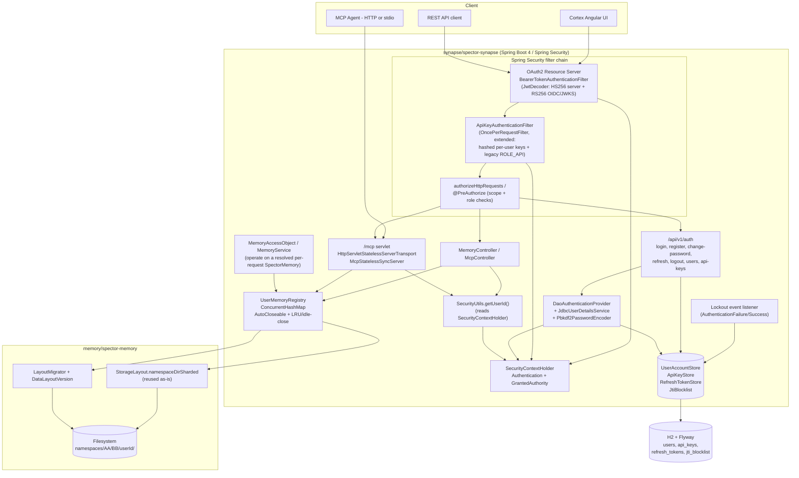
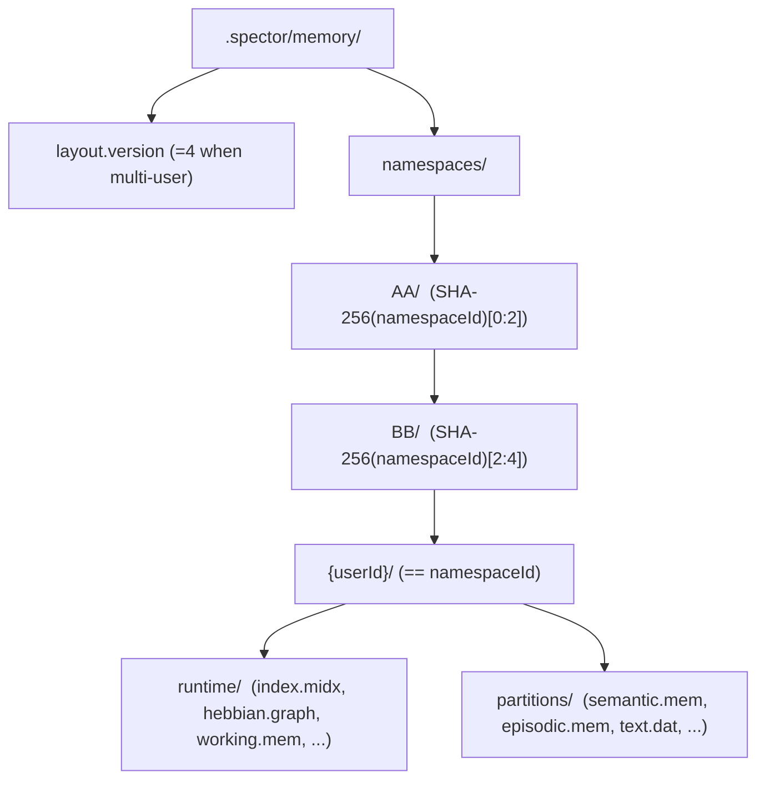
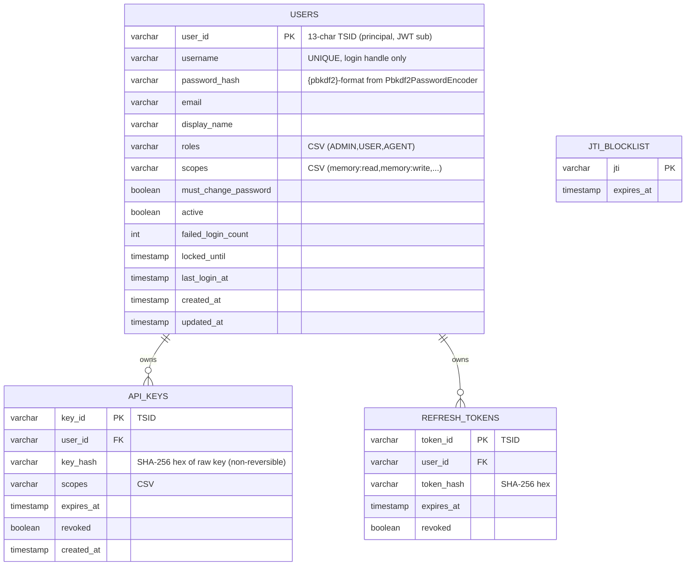

# Design Document: Multi-User Support with Authentication and Per-User Data Isolation

## Overview

This feature adds first-class **multi-user** support to the OSS Spector server: authenticated
identities, scope/role-based authorization, and **complete per-user data isolation** at the
filesystem, memory-routing, REST, and MCP-tool layers. Spector OSS is **single-tenant,
multi-user** — there is no organization/tenant boundary; the isolation boundary is the individual
authenticated user.

Today the OSS gateway (`synapse/spector-synapse`) behaves as a single shared workspace:
`SecurityUtils.getUserId()` is hardcoded to `"default"`, `ApiKeyAuthenticationFilter` validates a
single global API key and grants `ROLE_API`, and `MemoryAccessObject` holds one shared
`SpectorMemory` instance (injected via `ObjectProvider<SpectorMemory>`) for every caller.
`MemoryService.remember(...)` dispatches the actual write on
`CompletableFuture.runAsync(..., virtualThreadExecutor)`. MCP tools already *declare*
`namespace`/`workspace_id`/`agent_id` parameters, but every client shares one memory space.

The design builds **entirely on the Spring Security stack that is already present** in
`spector-synapse` (`config/SecurityConfig.java` with `@EnableWebSecurity` + `SecurityFilterChain`,
`security/ApiKeyAuthenticationFilter.java` as an `OncePerRequestFilter`, and
`security/SecurityUtils.java`). No new security primitives are introduced into
`nucleus/spector-commons`. Two facts drove every decision below:

1. **Spring Security is already wired in `spector-synapse`.** Identity, scopes, password hashing,
   JWT decoding, and authorization are all expressed with Spring Security building blocks
   (`Authentication`/`GrantedAuthority` via `SecurityContextHolder`, `Pbkdf2PasswordEncoder`,
   OAuth2 Resource Server `JwtDecoder`, `UserDetailsService` + `DaoAuthenticationProvider`,
   `authorizeHttpRequests`/`@PreAuthorize`). We extend the existing `ApiKeyAuthenticationFilter`
   rather than inventing a custom SPI.
2. **OSS already has H2 + Spring `JdbcClient` + Flyway + HikariCP** (`config/FlywayConfig.java`,
   migrations under `src/main/resources/db/migration`, config via `config/SynapseProperties.java`).
   User, API-key, refresh-token, and JTI storage reuse this stack rather than introducing new
   persistence.

The feature is **off by default** (`spector.auth.enabled=false`), preserving the current single
shared `SpectorMemory` and the existing single shared-key `ROLE_API` behavior **exactly**. When
enabled, identity is derived from validated credentials and drives a deterministic filesystem path
so that no user can ever read or resolve another user's data.

## Goals and Non-Goals

**Goals**
- Authenticate REST and MCP-over-HTTP requests through Spring Security using four surfaces:
  built-in username/password (login endpoint → server-issued JWT), server-issued JWT (HS256),
  per-user API keys, and **external OIDC** (RS256 validated via JWKS).
- Derive an isolated memory workspace (`SpectorMemory`) per authenticated user, routed by a
  deterministic, single-level sharded path that reuses the existing
  `StorageLayout.namespaceDirSharded(...)` helper.
- Enforce isolation at four boundaries: filesystem (sharded per-user directories), memory routing
  (per-user instance registry resolved on the request thread), REST
  (`authorizeHttpRequests`/`@PreAuthorize` scope checks), and MCP tools (namespace derived from the
  authenticated identity, **never** from client-supplied params).
- Preserve OSS backward compatibility: single shared memory + single shared-key `ROLE_API` when
  auth is disabled, anonymous fallback, and an idempotent, versioned migration path.
- Honor all repo tech constraints: JDK 25 + preview, never `synchronized`, never `System.out`,
  secrets via `${env:VAR}`, `AutoCloseable` for the memory registry, zero-alloc hot paths.

**Non-Goals**
- Multi-tenancy / organizations. Spector OSS is single-tenant; there is no tenant tier, no
  `tenants` table, and no tenant foreign keys.
- SAML SSO (left as a future extension).
- KMS/BYOK envelope encryption of data-at-rest.
- Horizontal clustering of the auth store (single H2/JDBC node, as today).
- A dedicated user-administration UI beyond what Cortex consumes over REST.

## Terminology

| Term | Meaning |
|------|---------|
| User | The single isolation boundary. A principal identified by a 13-char **TSID** (`user_id`). `username` is a login handle only — never used in paths, JWT `sub`, or foreign keys. |
| Namespace | A user's isolated memory workspace, named `{userId}` (the TSID itself is the namespace name), resolved to a single-level sharded directory. |
| Authentication | The Spring Security `Authentication` bound to `SecurityContextHolder` for the current request; its principal name is the `userId` (TSID) and its `GrantedAuthority` set carries roles/scopes. |
| Anonymous | No authenticated `Authentication` (auth disabled, or credentials absent on a public path). Falls back to the single shared memory. |
| Scope | Fine-grained permission expressed as a `GrantedAuthority`, e.g. `SCOPE_memory:read`, `SCOPE_memory:write`. Roles use the `ROLE_` prefix (`ROLE_ADMIN`, `ROLE_USER`, `ROLE_API`). |
| Sub-scoping | Client-supplied `namespace`/`workspace_id`/`agent_id` MCP params — treated as hints *within* the authenticated user's namespace, never able to cross to another user. |

## Architecture

### Module Placement

The strict layered architecture (`nucleus` → `memory`/`engine` peers → `synapse` → `cortex`) is
respected. **Everything auth-related lives in `synapse/spector-synapse`.** Nothing new goes into
`nucleus/spector-commons`. The per-user sharded path reuses the existing
`memory/spector-memory` `StorageLayout` helper (no source changes needed there beyond confirming
`namespaceDirSharded`).

| Concern | Module | Rationale |
|---------|--------|-----------|
| `SecurityConfig` (filter chain, `JwtDecoder` beans, `authorizeHttpRequests`, `Pbkdf2PasswordEncoder`, `DaoAuthenticationProvider`, `UserDetailsService`), extended `ApiKeyAuthenticationFilter`, `SecurityUtils` (rewritten to read `SecurityContextHolder`), `AuthController`, `UserAccountStore`/`JdbcUserDetailsService`, `ApiKeyStore`, `RefreshTokenStore`, `JtiBlocklist`, lockout event listener, `UserMemoryRegistry`, Flyway migration, `spector.auth.*` config | `synapse/spector-synapse` | Spring Security + Spring MVC + H2/JDBC/Flyway all already live here. This is where HTTP auth, DB persistence, and per-request memory resolution belong. |
| Single-level per-user sharded path resolution | `memory/spector-memory` (`StorageLayout.namespaceDirSharded` — **already present**, reused as-is) | Path resolution belongs with the storage-layout single source of truth. |
| **Nothing** | `nucleus/spector-commons` | No `AuthContext`, `AuthContextHolder`, `Authenticator` SPI, `SpectorScopes`/`SpectorRoles`, or custom PBKDF2 are added. Identity/scopes flow through Spring Security's `Authentication`. |

No new Maven module is required; the change is additive within `spector-synapse` and reuses the
existing `spector-memory` `StorageLayout`. `memory` and `engine` remain independent peers (neither
learns about auth), and Cortex depends only on synapse REST.

### System Component Diagram



### Request Authentication Flow

```mermaid
sequenceDiagram
    participant C as Client
    participant RS as OAuth2 Resource Server (JwtDecoder)
    participant AK as ApiKeyAuthenticationFilter
    participant AZ as authorizeHttpRequests / @PreAuthorize
    participant SC as SecurityContextHolder
    participant H as Controller / MCP tool (request thread)
    participant REG as UserMemoryRegistry

    C->>RS: HTTP request (Authorization: Bearer <jwt> or X-API-Key)
    alt auth disabled (spector.auth.enabled=false)
        RS->>AK: pass through
        AK->>SC: legacy single shared key -> ROLE_API (if matches)
        AK->>H: proceed (single shared SpectorMemory)
    else Bearer JWT present
        RS->>RS: JwtDecoder selects HS256 (server iss) or RS256 (OIDC JWKS)
        alt valid, unexpired
            RS->>SC: set Authentication(principal=userId, SCOPE_* authorities)
        else invalid/expired
            RS-->>C: 401
        end
        RS->>AK: continue
    else X-API-Key present
        AK->>AK: SHA-256(key) lookup in api_keys (per user)
        alt valid & not revoked/expired
            AK->>SC: set Authentication(principal=userId, authorities)
        else legacy shared key & auth disabled
            AK->>SC: ROLE_API (backward compat)
        end
    end
    AK->>AZ: authorization check for path/method
    alt authorized
        AZ->>H: invoke on request thread
        H->>REG: resolveForCurrentRequest() -> reads SecurityContextHolder (REQUEST THREAD)
        REG-->>H: per-user SpectorMemory (or shared fallback if anonymous)
        Note over H,REG: async writes CLOSE OVER the resolved instance;\nSecurityContextHolder is NOT read inside the async task
        H-->>C: response (only this user's data)
    else denied
        AZ-->>C: 401 / 403
    end
```

### Filesystem Isolation Layout

Reuses `StorageLayout.namespaceDirSharded(basePath, namespaceId)` with
`namespaceId = userId` (the TSID itself is the namespace name). The memory persistence root
(`spector.memory.persistence-path`, effectively `dataDir`) is the data root. When auth is enabled,
each user's data lives under a **single-level** per-user shard (`namespaces/AA/BB/{userId}/`);
when disabled, the existing flat layout is used unchanged. There is **no `tenants/XX/YY/...`
tier**.



`namespaceId` is `SHA-256`-hashed and the first two byte-pairs of the hex digest (`AA/BB`) form two
directory levels (256 buckets each = 65,536 buckets) to prevent `readdir()` degradation at millions
of users. The per-user directory contents match the existing `StorageLayout` (`runtime/` +
`partitions/`), so a per-user `SpectorMemory` is just a normal memory instance rooted at that path.

## Components and Interfaces

### SecurityConfig (synapse/spector-synapse, `config/`)

**Purpose**: single Spring Security composition root. Extends today's `@EnableWebSecurity` +
`SecurityFilterChain` config.

**Responsibilities**:
- Register the extended `ApiKeyAuthenticationFilter` (as today, before
  `UsernamePasswordAuthenticationFilter`).
- Configure the **OAuth2 Resource Server** with a `JwtDecoder`: one decoder for server-issued
  **HS256** access tokens (shared secret), plus **RS256 JWKS** validation for external OIDC. A
  composite/`AuthenticationManagerResolver` (or issuer-based `JwtIssuerAuthenticationManagerResolver`)
  routes by `iss`.
- Expose a `Pbkdf2PasswordEncoder` bean (configurable iterations, built-in constant-time compare)
  and a `DaoAuthenticationProvider` backed by `JdbcUserDetailsService`.
- Express authorization with `authorizeHttpRequests(...)` (public paths permitted; `/api/**` and
  `/mcp` requiring authentication when `spector.auth.enabled=true`) and method security
  `@PreAuthorize` for scope/role-gated endpoints.
- When `spector.auth.enabled=false`: keep today's behavior — `permitAll` and the legacy shared-key
  `ROLE_API` path.

### SecurityUtils (synapse/spector-synapse, `security/`, rewritten)

**Purpose**: resolve the current principal from Spring Security instead of a hardcoded `"default"`.

**Responsibilities**:
- `getUserId()` returns the authenticated principal's TSID (the `Authentication` name); returns
  `"default"` (anonymous) when there is no non-anonymous `Authentication` or when auth is disabled.
- `getScopes()`/`hasScope(...)` read `GrantedAuthority` values.
- `getTenantId()` is either removed or retained returning a fixed `"default"` for source
  compatibility — it carries no isolation meaning in OSS.

```java
// synapse/spector-synapse : com.spectrayan.spector.synapse.security
public final class SecurityUtils {
    private SecurityUtils() {}

    /** Authenticated principal TSID, or "default" when anonymous / auth disabled. */
    public static String getUserId();

    /** Scope authorities (e.g. "memory:read") stripped of the SCOPE_ prefix; empty if anonymous. */
    public static Set<String> getScopes();

    public static boolean hasScope(String scope);
    public static boolean isAuthenticated();     // non-null, non-anonymous Authentication

    /** Retained for source compatibility only; always "default" (OSS is single-tenant). */
    public static String getTenantId();
}
```

### JdbcUserDetailsService + UserAccountStore (synapse/spector-synapse, `security/`)

**Purpose**: JDBC-backed `UserDetailsService` for `DaoAuthenticationProvider`, plus the account
lifecycle store. Backed by the existing H2 datasource via `JdbcClient`.

**Responsibilities**:
- `JdbcUserDetailsService.loadUserByUsername(username)` returns a Spring Security `UserDetails`
  whose `getUsername()` **is the TSID** principal name (not the login handle), whose password is
  the stored `{pbkdf2}`-format hash, whose authorities are the user's roles/scopes, and whose
  `isAccountNonLocked()` reflects `locked_until`.
- `UserAccountStore`: `createUser`, `changePassword`, `forceResetPassword`, `findByUsername`,
  `findByUserId`, `listUsers`, `deactivateUser`, `seedDefaultAdmin`, and lockout counters
  (`recordFailure`/`recordSuccess`). Hashing is delegated to the injected `Pbkdf2PasswordEncoder`
  — no hand-rolled PBKDF2 or `MessageDigest.isEqual`.

### Extended ApiKeyAuthenticationFilter (synapse/spector-synapse, `security/`)

**Purpose**: the existing `OncePerRequestFilter` is extended to validate hashed **per-user** API
keys while preserving the legacy single shared-key path.

**Responsibilities**:
- Extract the key from `Authorization: Bearer <key>` or `X-API-Key: <key>` (unchanged).
- When `spector.auth.enabled=true`: compute `SHA-256(rawKey)`, look up a non-revoked, non-expired
  row in `api_keys`, and on match set an `Authentication` (`UsernamePasswordAuthenticationToken`)
  whose principal is the owning `userId` and whose authorities are the key's scopes.
- When `spector.auth.enabled=false`: keep today's behavior — if the key equals the configured
  shared key, set `ROLE_API` (full backward compatibility).
- Never log raw keys.

### JwtDecoder configuration (OAuth2 Resource Server)

**Purpose**: validate Bearer tokens for two issuers without a custom authenticator.

**Responsibilities**:
- **Server HS256**: a `NimbusJwtDecoder` built from the symmetric `spector.auth.jwt.secret`,
  validating `iss` (server) and expiry; authorities mapped from a `scope`/`roles` claim.
- **External OIDC RS256**: a JWKS-backed `NimbusJwtDecoder` from `spector.auth.oidc.jwks-url`,
  validating `iss == spector.auth.oidc.issuer` and expiry. Enabled only when `jwks-url` is set.
- A `JwtIssuerAuthenticationManagerResolver` (or composite `JwtDecoder`) selects by `iss`. The JWT
  `sub` claim is the user TSID (never the username).

### AuthController (synapse/spector-synapse, `/api/v1/auth`)

**Purpose**: identity lifecycle over REST for Cortex and API clients.

**Endpoints**: `POST /login` (username/password → server-issued HS256 JWT + refresh token via the
`AuthenticationManager`/`DaoAuthenticationProvider`), `POST /register` (scope-gated),
`POST /change-password`, `POST /refresh`, `POST /logout` (adds JWT `jti` to `jti_blocklist`),
`GET /users` / `PUT /users/{id}` (`@PreAuthorize("hasRole('ADMIN')")`), `POST /api-keys` /
`DELETE /api-keys/{id}` (per-user key issuance; raw key shown once).

### Account-lockout listener (synapse/spector-synapse, `security/`)

**Purpose**: enforce lockout using Spring Security events rather than custom filter logic.

**Responsibilities**: an `ApplicationListener` for `AuthenticationFailureBadCredentialsEvent`
increments `failed_login_count` and sets `locked_until = now + lockout.minutes` at
`lockout.max-attempts` (default 5 → 15 min, configurable); an `AuthenticationSuccessEvent` listener
resets the counter and clears the lock. `UserDetails.isAccountNonLocked()` (evaluated by
`DaoAuthenticationProvider`) blocks authentication while locked.

### UserMemoryRegistry (synapse/spector-synapse, `memory/`)

**Purpose**: replace the single shared `SpectorMemory` with a per-user cache, resolved on the
request thread.

**Responsibilities**: hold a `ConcurrentHashMap<String userId, SpectorMemory>`, lazily building
each instance rooted at the user's sharded namespace dir; expose
`resolveForCurrentRequest()` which reads `SecurityContextHolder` **on the calling (request)
thread**; return the existing single shared instance when auth is disabled or the principal is
anonymous; implement `AutoCloseable` to close all instances on shutdown; enforce an LRU/idle-close
bound so many users do not exhaust off-heap memory.

## Data Models

### Relational schema (H2, Flyway migration `V2__multi_user_auth.sql`)

There is **no `tenants` table and no tenant foreign keys**. The schema is `users`, `api_keys`,
`refresh_tokens`, `jti_blocklist` only.



**Validation / isolation rules**
- Every user-scoped read filters by the authenticated principal `userId` (from
  `SecurityContextHolder`), never by client input.
- `username` is globally unique; it never appears in `user_id`, the JWT `sub`, API-key hashes, or
  filesystem paths.
- API keys and refresh tokens are stored as **SHA-256 hashes**; raw values are shown once on
  creation and are not recoverable from storage.
- `password_hash` is the `Pbkdf2PasswordEncoder` `{pbkdf2}`-prefixed encoding; the raw password is
  never persisted or logged.

### Config parameters (`spector.auth.*`)

Bound as a new `AuthProperties` sub-record on the existing
`@ConfigurationProperties(prefix = "spector")` `SynapseProperties` record. **No tenant keys.**
Secrets use `${env:VAR}` per repo policy.

| Key | Default | Meaning |
|-----|---------|---------|
| `spector.auth.enabled` | `false` | Master switch. `false` = single shared memory + legacy shared-key `ROLE_API` (today's behavior). |
| `spector.auth.jwt.secret` | `${env:SPECTOR_AUTH_JWT_SECRET}` | HS256 signing/validation secret for server-issued tokens. **Never** literal in YAML. |
| `spector.auth.jwt.ttl` | `1h` | Server access-token lifetime. |
| `spector.auth.refresh.ttl` | `30d` | Refresh-token lifetime. |
| `spector.auth.oidc.jwks-url` | `` (empty) | External IdP JWKS endpoint. Non-empty ⇒ RS256 OIDC validation is enabled. |
| `spector.auth.oidc.issuer` | `` (empty) | Expected `iss` for external OIDC tokens. |
| `spector.auth.default-admin.password` | `${env:SPECTOR_ADMIN_PASSWORD}` | Seed admin password; must-change on first login. |
| `spector.auth.pbkdf2.iterations` | `310000` | `Pbkdf2PasswordEncoder` iteration count (configurable; OWASP-2024 baseline). |
| `spector.auth.lockout.max-attempts` | `5` | Consecutive failures before lockout. |
| `spector.auth.lockout.minutes` | `15` | Lockout duration. |
| `spector.auth.public-paths` | `/actuator/health,/api/docs` | Paths that bypass authentication. |

The existing `${env:VAR}` interpolation keeps secrets out of committed YAML.

## Low-Level Design

All code is Java 25 (with `--enable-preview`). No `synchronized`; concurrency uses
`ConcurrentHashMap` and `ReentrantLock`/`StampedLock`. No `System.out`; SLF4J only. The
`UserMemoryRegistry` is `AutoCloseable`. BSL headers match existing `spector-synapse` files.
Signatures below are the implementable contracts.

### SecurityConfig — filter chain, JwtDecoder beans, authorization

```java
// synapse/spector-synapse : com.spectrayan.spector.synapse.config
@Configuration
@EnableWebSecurity
@EnableMethodSecurity            // enables @PreAuthorize
public class SecurityConfig {

    @Bean SecurityFilterChain filterChain(HttpSecurity http,
                                           ApiKeyAuthenticationFilter apiKeyFilter,
                                           AuthProperties auth) throws Exception;

    @Bean Pbkdf2PasswordEncoder passwordEncoder(AuthProperties auth);   // iterations from config

    @Bean UserDetailsService userDetailsService(JdbcClient jdbc);        // JdbcUserDetailsService

    @Bean DaoAuthenticationProvider daoAuthProvider(UserDetailsService uds,
                                                    Pbkdf2PasswordEncoder enc);

    @Bean JwtDecoder serverJwtDecoder(AuthProperties auth);              // HS256 from secret
    @Bean @ConditionalOnProperty("spector.auth.oidc.jwks-url")
          JwtDecoder oidcJwtDecoder(AuthProperties auth);                // RS256 via JWKS
    @Bean AuthenticationManagerResolver<HttpServletRequest> jwtResolver(...); // route by iss
}
```

**Function: `filterChain(...)`**
- **Preconditions**: `AuthProperties` bound; `apiKeyFilter` is a Spring bean.
- **Postconditions**:
  - When `auth.enabled() == false`: authorization is `permitAll` and the legacy shared-key
    `ROLE_API` path in `ApiKeyAuthenticationFilter` remains active — behavior is byte-for-byte
    today's behavior.
  - When `auth.enabled() == true`: `publicPaths` are `permitAll`; `/api/**` and `/mcp` require an
    authenticated `Authentication`; OAuth2 Resource Server is enabled with the issuer-routing
    `JwtDecoder`; `apiKeyFilter` is added before `UsernamePasswordAuthenticationFilter`; session is
    stateless; CSRF disabled (stateless, cookie-less).
  - Method-security (`@PreAuthorize`) is active for scope/role-gated controller methods.
- **Loop invariants**: N/A.

### SecurityUtils — principal from SecurityContextHolder

**Function: `getUserId()`**
- **Preconditions**: none (callable from any thread; reads the thread's `SecurityContext`).
- **Postconditions**: returns the `Authentication` name (user TSID) when a non-anonymous
  `Authentication` is bound; otherwise returns `"default"`. Pure read, no side effects.

```pascal
ALGORITHM getUserId()
OUTPUT: userId : String  (never null)
BEGIN
  auth <- SecurityContextHolder.getContext().getAuthentication()
  IF auth = NULL OR NOT auth.isAuthenticated()
     OR auth INSTANCEOF AnonymousAuthenticationToken THEN
    RETURN "default"
  END IF
  RETURN auth.getName()          // == user TSID (never the login username)
END
```

### JdbcUserDetailsService + UserAccountStore — Pbkdf2, lockout

```java
// synapse/spector-synapse : com.spectrayan.spector.synapse.security
public class JdbcUserDetailsService implements UserDetailsService {
    public JdbcUserDetailsService(JdbcClient jdbc);
    @Override public UserDetails loadUserByUsername(String username); // principal name == user_id
}

public class UserAccountStore {
    public UserAccountStore(JdbcClient jdbc, Pbkdf2PasswordEncoder encoder, AuthProperties auth);

    public void seedDefaultAdmin(String defaultPassword);
    public String createUser(String username, String plainPassword, String email,
                             String displayName, Set<String> roles, Set<String> scopes,
                             boolean mustChangePassword);   // returns generated user_id (TSID)
    public boolean changePassword(String username, String oldPw, String newPw);
    public boolean forceResetPassword(String userId, String newPw);
    public Optional<UserRow> findByUsername(String username);
    public Optional<UserRow> findByUserId(String userId);
    public List<UserRow> listUsers();
    public void recordFailure(String userId);   // increments; locks at threshold (monotonic)
    public void recordSuccess(String userId);   // resets counter, clears lock, sets last_login_at
}
```

**Function: `loadUserByUsername(username)`**
- **Preconditions**: `jdbc` open; `username` non-null.
- **Postconditions**: returns a `UserDetails` where `getUsername() == user_id` (TSID),
  `getPassword()` is the stored `{pbkdf2}` hash, `getAuthorities()` are `ROLE_*` + `SCOPE_*` from
  the row, `isEnabled() == active`, and `isAccountNonLocked() == (locked_until == null ||
  locked_until <= now)`. Throws `UsernameNotFoundException` when absent. The raw password is never
  read here (comparison is delegated to `DaoAuthenticationProvider` + `Pbkdf2PasswordEncoder`).

**Function: `createUser(...)`**
- **Preconditions**: `username` unique; `plainPassword` non-blank.
- **Postconditions**: persists a new row with `user_id = TsidGenerator.generate()`,
  `password_hash = encoder.encode(plainPassword)` (salted PBKDF2 via `Pbkdf2PasswordEncoder`),
  `failed_login_count = 0`, `locked_until = null`. Returns the generated `user_id`. The plaintext
  password is neither persisted nor logged.

**Function: `login(username, plainPassword)` (in AuthController via AuthenticationManager)**
- **Preconditions**: `AuthenticationManager` wired to `DaoAuthenticationProvider`.
- **Postconditions**: delegates verification to Spring Security — success **iff** the user exists,
  is enabled, is account-non-locked, and `Pbkdf2PasswordEncoder.matches(plainPassword, storedHash)`
  is true (built-in constant-time compare). On success emits an HS256 JWT with `sub = user_id` and
  a `scope`/`roles` claim, plus a refresh token; on failure a uniform `401` (no user enumeration)
  and the failure event drives lockout.

```pascal
ALGORITHM login(username, plainPassword)
OUTPUT: {accessToken, refreshToken} | 401
BEGIN
  TRY
    authentication <- authenticationManager.authenticate(
                        new UsernamePasswordAuthenticationToken(username, plainPassword))
    // DaoAuthenticationProvider checked: active, non-locked, Pbkdf2 matches
  CATCH (AuthenticationException e)                       // BadCredentials, Locked, Disabled
    // AuthenticationFailure event -> lockout listener increments/locks (monotonic)
    RETURN 401 "Invalid credentials"                      // uniform; no enumeration
  END TRY
  // AuthenticationSuccess event -> resets counter, clears lock, sets last_login_at
  userId <- authentication.getName()
  access <- signHs256({ sub: userId, scope: scopesOf(authentication), exp: now + jwt.ttl },
                      auth.jwt.secret)
  refresh <- issueRefreshToken(userId)                    // store SHA-256 hash only
  RETURN { access, refresh }
END
```

**Function: `recordFailure(userId)` / lockout monotonicity**
- **Postconditions**: `failed_login_count += 1`; if the new count `>= lockout.max-attempts`,
  `locked_until = now + lockout.minutes`. A failure never *clears* an existing lock (monotonic
  while locked). `recordSuccess` (only reachable when not locked) resets the counter to 0, clears
  `locked_until`, and sets `last_login_at = now`.

### Extended ApiKeyAuthenticationFilter — hashed per-user keys + legacy path

**Function: `doFilterInternal(req, res, chain)`**
- **Preconditions**: registered before `UsernamePasswordAuthenticationFilter` (as today); only
  acts on paths starting with `/api/` or `/mcp` (unchanged skip logic).
- **Postconditions**:
  - `auth.enabled() == false`: if the extracted key equals the configured shared key, bind
    `UsernamePasswordAuthenticationToken("api-client", null, [ROLE_API])` (today's exact behavior);
    otherwise proceed unauthenticated.
  - `auth.enabled() == true`: compute `SHA-256(rawKey)`; if a non-revoked, non-expired `api_keys`
    row matches, bind an `Authentication` whose principal is the owning `userId` and whose
    authorities are the key's `SCOPE_*`; otherwise leave the context unauthenticated (downstream
    authorization yields 401/403).
  - Raw keys are never logged. Always calls `chain.doFilter`.
- **Loop invariants**: N/A.

```pascal
ALGORITHM doFilterInternal(req, res, chain)
BEGIN
  path <- req.requestURI
  IF NOT (path startsWith "/api/" OR path startsWith "/mcp") THEN
    chain.doFilter(req, res); RETURN
  END IF
  rawKey <- extractApiKey(req)          // Authorization: Bearer <k> | X-API-Key: <k>
  IF rawKey != NULL THEN
    IF NOT auth.enabled() THEN
      IF rawKey = props.apiKey() THEN
        setAuthentication("api-client", [ROLE_API])     // legacy backward-compat
      END IF
    ELSE
      hash <- sha256Hex(rawKey)
      row  <- apiKeyStore.findActiveByHash(hash)        // not revoked, not expired
      IF row != NULL THEN
        setAuthentication(row.userId, scopeAuthorities(row.scopes))
      END IF
    END IF
  END IF
  chain.doFilter(req, res)
END
```

### UserMemoryRegistry — per-user SpectorMemory, request-thread resolution

```java
// synapse/spector-synapse : com.spectrayan.spector.synapse.memory
@Component
public final class UserMemoryRegistry implements AutoCloseable {

    public UserMemoryRegistry(ObjectProvider<SpectorMemory> sharedProvider,  // today's shared bean
                              SynapseProperties props,
                              AuthProperties auth);

    /** Resolve on the REQUEST THREAD from SecurityContextHolder. Never call from an async task. */
    public SpectorMemory resolveForCurrentRequest();

    /** Explicit resolution by principal (for tests / non-servlet callers). */
    public SpectorMemory resolveFor(String userId);

    @Override public void close();   // closes every cached per-user SpectorMemory
}
```

**Function: `resolveForCurrentRequest()`**
- **Preconditions**: called on the request/servlet thread (so `SecurityContextHolder` is populated
  by the filter chain). Runtime shared memory bean available.
- **Postconditions**:
  - When `auth.enabled() == false` or the principal is anonymous (`userId == "default"`): returns
    the single shared `SpectorMemory` (identical to today's behavior).
  - When authenticated: returns exactly one cached `SpectorMemory` per `userId`, lazily built
    rooted at `StorageLayout.namespaceDirSharded(basePath, userId)`. The returned
    instance is a **pure function of the authenticated `userId`**; client-supplied
    `namespace`/`workspace_id`/`agent_id` never change which user's memory is returned.
  - No cross-user instance is ever returned.
- **Loop invariants**: N/A (cache is `ConcurrentHashMap.computeIfAbsent`; LRU eviction closes the
  evicted instance).

```pascal
ALGORITHM resolveForCurrentRequest()
OUTPUT: SpectorMemory
BEGIN
  IF NOT auth.enabled() THEN RETURN sharedMemory END IF
  userId <- SecurityUtils.getUserId()          // reads SecurityContextHolder on REQUEST THREAD
  IF userId = "default" THEN RETURN sharedMemory END IF
  namespaceId <- userId                        // identity-derived (TSID), NOT client-supplied
  RETURN cache.computeIfAbsent(userId, k -> {
      dir <- StorageLayout.namespaceDirSharded(basePath, namespaceId)
      RETURN DefaultSpectorMemory.builder()
                 .persistence(dir)
                 .dimensions(runtimeDimensions())
                 .embeddingProvider(runtimeEmbedder())
                 ... // same builder settings the shared bean uses today
                 .build()
  })
END
```

### Request-thread capture into async writes (MemoryService / MemoryAccessObject rework)

The critical propagation rule: **resolve the caller's `SpectorMemory` on the request thread, then
close over that resolved instance in the async lambda.** `SecurityContextHolder` is thread-bound
and is *not* propagated onto the `virtualThreadExecutor` task, so it must **never** be read inside
the async body.

Rework: `MemoryAccessObject` no longer holds a single injected `SpectorMemory`; its data-access
methods accept the resolved instance (e.g. `remember(SpectorMemory mem, id, text, ...)`).
`MemoryService.remember(...)` resolves once on the request thread and captures the reference.

**Function: `MemoryService.remember(request)`**
- **Preconditions**: invoked on the servlet request thread.
- **Postconditions**: the `SpectorMemory` used by the async write is exactly the one resolved for
  the request's authenticated principal; two concurrent requests from different users write to
  their own instances; when auth is disabled/anonymous, the shared instance is used (today's
  behavior). The async task performs no `SecurityContextHolder` access.

```pascal
ALGORITHM remember(request)                          // runs on REQUEST THREAD
BEGIN
  validate(request)
  mem <- userMemoryRegistry.resolveForCurrentRequest()   // CAPTURE on request thread
  taskId <- tsid.generate()
  finalId <- effectiveId(request)
  CompletableFuture.runAsync(() -> {                     // async: closes over `mem`
      // MUST NOT touch SecurityContextHolder here
      mao.remember(mem, finalId, request.text(), tier, source, hints, tags)
      publish(taskId, finalId)
  }, virtualThreadExecutor)
  RETURN AcceptedResponse.forRemember(taskId, finalId)
END
```

### MCP tool isolation (namespace derived from identity)

Real OSS MCP wiring (no `SpectorMcpServer.buildMcpServer(...)` or
`SpectorToolRegistry.createAll(...)` exist): `config/McpServerConfig.java` registers an
`HttpServletStatelessServerTransport` servlet at `/mcp` and builds an `McpStatelessSyncServer` from
the synapse `agent/ToolRegistry`; each tool is a `com.spectrayan.spector.mcp.tools.McpToolHandler`
invoked as `mcpTool.execute(null, args)`. `mcp/McpController.java` exposes REST `/api/v1/mcp/...`.

- **HTTP MCP (`/mcp` servlet)**: the tool executes **synchronously on the servlet request thread**
  (`transport → SyncToolSpecification lambda → mcpTool.execute`). The tool resolves the caller's
  memory via `UserMemoryRegistry.resolveForCurrentRequest()` on that thread, so it routes to the
  authenticated user's namespace. The `ApiKeyAuthenticationFilter` already matches `/mcp`, so the
  `SecurityContext` is populated before the servlet runs.
- **stdio MCP (standalone `spector-mcp`)**: there is no HTTP request and no `SecurityContext` ⇒
  anonymous ⇒ single shared/flat memory (single-user, unchanged).
- **Client-supplied `namespace`/`workspace_id`/`agent_id`**: treated as sub-scoping hints *within*
  the authenticated user's namespace, or ignored — they can never widen scope to another user. The
  effective root is always `namespaceDirSharded(basePath, getUserId())`.

### Data-layout versioning and migration (memory/spector-memory)

```java
// memory/spector-memory : com.spectrayan.spector.memory
public final class DataLayoutVersion {
    public static final int CURRENT = 4;               // multi-user per-user layout
    public static final int LEGACY_FLAT = 0;
    public static int read(Path dataRoot);             // reads layout.version, 0 if absent
    public static void write(Path dataRoot, int v);
    public static boolean isLegacyFlat(Path dataRoot);
}

public final class LayoutMigrator {
    /** Idempotent, versioned relocation of a flat layout into the default user's namespace. */
    public static void migrateIfNeeded(Path dataRoot, String defaultUserId);
}
```

**Function: `migrateIfNeeded(dataRoot, defaultUserId)`**
- **Preconditions**: `dataRoot` readable/writable; invoked only when `spector.auth.enabled=true`
  (when disabled, the flat layout is left untouched).
- **Postconditions (idempotent)**: if `read(dataRoot) >= CURRENT`, no-op. Otherwise the existing
  flat `runtime/` + `partitions/` are relocated under
  `namespaces/AA/BB/{defaultUserId}/` (where `AA/BB` derive from
  `SHA-256(defaultUserId)`), and `layout.version` is set to `CURRENT`. Running it twice
  equals running it once; the version never decreases; original data is not deleted until the new
  layout is verified.
- **Loop invariants**: while copying partition files, every already-copied file remains
  byte-identical to its source.

## Correctness Properties

Stated for property-based testing (universal quantification). The property-based test library is
**jqwik** (JVM property testing, integrated with the existing JUnit 5 reactor). Each property is
linked to the acceptance criteria it validates via a `Validates: Requirements X.Y` line (populated
from the finalized requirements and tasks).

### Property 1: Per-user filesystem isolation (no overlap / no traversal)
`∀ u1 ≠ u2: namespaceDirSharded(base, u1) ≠ namespaceDirSharded(base, u2)`, and
neither resolved path is an ancestor of the other; and `∀ u: namespaceDirSharded(base, u)`
is a descendant of `base` (no `..` escape). Any `userId` producing a `namespaceId` that contains
`/`, `\`, or `.` is rejected before resolution.

**Validates: Requirements 8.1, 8.2, 8.3, 8.4**

### Property 2: Path determinism / purity
`∀ u: namespaceDirSharded(base, u)` called repeatedly (in any registry state, any thread
interleaving) returns equal `Path` values and performs no filesystem mutation.

**Validates: Requirements 8.8**

### Property 3: Routing isolation under adversarial client input
`∀ authenticated userId, ∀ client-supplied namespace/workspace_id/agent_id:
resolveForCurrentRequest()` routes to `namespaceDirSharded(base, userId)`. User A supplying
user B's `namespace`/`workspace_id`/`agent_id` still reads/writes only A's memory (data written as
A is never retrievable as B).

**Validates: Requirements 9.3, 11.2, 11.3**

### Property 4: Auth invariant on protected paths
`∀ request on a non-public path (auth enabled): SecurityContextHolder` holds a non-anonymous
`Authentication` observed downstream **iff** the resource server / API-key filter accepted valid,
unexpired credentials satisfying the route authorization; otherwise the response is 401/403 and the
downstream handler is never invoked.

**Validates: Requirements 6.1, 6.3, 6.4**

### Property 5: Password round-trip via Pbkdf2PasswordEncoder
`∀ password p: encoder.matches(p, encoder.encode(p)) == true`, and `∀ p ≠ p':
encoder.matches(p', encoder.encode(p)) == false`. `encode` is salted (two encodes of the same
password differ) while `matches` remains correct.

**Validates: Requirements 14.2, 14.3, 14.4**

### Property 6: Lockout monotonicity
`∀ user u: after ≥ lockout.max-attempts consecutive failed logins, login(u, correctPassword)` is
rejected (account locked) until `locked_until` elapses; a failed attempt never clears an existing
lock; a success within an unlocked window resets `failed_login_count` to 0.

**Validates: Requirements 2.5, 13.1, 13.2, 13.3, 13.4, 13.5**

### Property 7: API-key hash non-reversibility
`∀ raw key k: only SHA-256(k)` is persisted; the stored `api_keys.key_hash` never equals `k`, and
validation succeeds **iff** `SHA-256(presented) == stored hash` for a non-revoked, non-expired row.

**Validates: Requirements 15.1, 15.3, 5.3**

### Property 8: TSID / PII avoidance
`∀ created user: user_id` is a valid 13-char TSID and the `username` string never appears in
`namespaceDirSharded(...)` output, the JWT `sub` claim, API-key hashes, or any foreign key.

**Validates: Requirements 16.1, 16.2**

### Property 9: Sharding well-formedness
`∀ id: the two shard segments of namespaceDirSharded(base, id)` each match `^[0-9a-f]{2}$` and equal
the first and second byte-pairs of `SHA-256(id)` hex (`SHARD_HEX_DIGITS=2`, `SHARD_LEVELS=2`).

**Validates: Requirements 8.7**

### Property 10: Migration idempotency & monotonicity
`∀ dataRoot: migrateIfNeeded(migrateIfNeeded(dataRoot)) == migrateIfNeeded(dataRoot)` (same final
tree and version), and `read(dataRoot)` after migration is `≥` its prior value and never decreases.

**Validates: Requirements 17.4, 17.5**

## Error Handling

| Scenario | Condition | Response | Recovery |
|----------|-----------|----------|----------|
| Missing credentials on protected path | no `Authorization`/`X-API-Key` (auth enabled) | `401 {"error":"Authentication required"}` | authenticate via `/api/v1/auth/login` |
| Invalid credentials | JWT invalid / API key unknown / bad password | `401 {"error":"Invalid credentials"}` | re-authenticate |
| Expired token | `JwtDecoder` expiry validation fails | `401 {"error":"Token expired"}` | refresh via `/api/v1/auth/refresh` |
| Insufficient scope | `authorizeHttpRequests` / `@PreAuthorize` denies | `403 {"error":"Forbidden"}` | request elevated scope/role |
| Account locked | `isAccountNonLocked() == false` | `401` (generic, no user enumeration) | wait `lockout.minutes` or admin `forceResetPassword` |
| Invalid namespace segment | `userId` yields an unsafe `namespaceId` | `400` / `IllegalArgumentException` | reject; log at DEBUG without echoing the raw value |
| DB unavailable | SQL exception in stores / `UserDetailsService` | authentication fails ⇒ `401`; error logged via SLF4J | retry after datasource recovers |

Failures never leak whether a username exists (uniform `401`), never log secrets or raw API keys,
and never fall back to a *different* user's data — on any resolution error the request fails closed.

## Testing Strategy

**Unit tests (JUnit 5 + AssertJ + Mockito)**
- `UserAccountStore` / `JdbcUserDetailsService`: create/find/change-password/lockout counters
  against an in-memory H2 datasource; `Pbkdf2PasswordEncoder` encode/matches.
- Extended `ApiKeyAuthenticationFilter`: legacy shared-key `ROLE_API` path (auth disabled) vs
  hashed per-user lookup (auth enabled), via `MockHttpServletRequest`/`MockFilterChain`.
- `SecurityUtils`: anonymous → `"default"`, authenticated → principal TSID, scope extraction.
- `UserMemoryRegistry`: anonymous → shared instance, authenticated → cached per-user instance,
  adversarial client namespace ignored; `close()` closes all instances.
- Lockout event listener: failure increments/locks at threshold, success resets.

**Property-based tests (jqwik)** — one property per numbered correctness property above.
- **Library**: jqwik (integrates with JUnit 5 already in the reactor).
- Generators: valid/invalid `userId`/namespace strings, passwords, failure sequences, raw API keys,
  and flat-layout fixtures for migration.

**Integration tests (`-Psynapse`, Spring Boot test slice)**
- End-to-end: login → JWT → memory write as user A → recall as user B returns nothing (isolation).
- Request-thread capture: concurrent `remember` from two authenticated users land in distinct
  per-user instances (async writes use the captured instance, not `SecurityContextHolder`).
- MCP-over-HTTP: authenticated `remember`/`recall` route to the caller's namespace; two users'
  tool calls never cross. stdio MCP falls back to shared memory.
- External OIDC: an RS256 token from a stub JWKS is accepted; wrong-issuer/expired rejected.
- Flyway `V2__multi_user_auth.sql` applies cleanly on a fresh H2 file; `LayoutMigrator` relocates a
  seeded flat tree only when auth is enabled and is idempotent.

## Performance Considerations

- `namespaceDirSharded` is allocation-light (one SHA-256 per call); resolved instances are cached
  in `UserMemoryRegistry`, so hot paths avoid re-hashing and per-request instance construction
  after warm-up (respects the zero-alloc-hot-path guideline).
- Per-user `SpectorMemory` instances are lazily built and cached; an LRU cap with idle-close
  (`AutoCloseable`) bounds off-heap usage under many users.
- `Pbkdf2PasswordEncoder` at the configured iteration count is intentionally costly on the login
  path only (not per request). JWT decode and API-key SHA-256 lookup are cheap per request.
- Request-thread capture avoids any `SecurityContext` propagation cost onto virtual-thread tasks.

## Security Considerations

- **Hashing**: Spring Security `Pbkdf2PasswordEncoder` (configurable iterations via
  `spector.auth.pbkdf2.iterations`, built-in constant-time comparison, salted). No hand-rolled
  PBKDF2 or `MessageDigest.isEqual`.
- **JWT**: OAuth2 Resource Server `JwtDecoder` — HS256 for server-issued tokens, RS256/JWKS for
  external OIDC — with `iss`/expiry validation. No custom JWT authenticator or key provider.
- **PII avoidance**: TSID `user_id` is the principal and JWT `sub`; `username` is a login handle
  only, never in paths/tokens/FKs.
- **Secrets**: `spector.auth.jwt.secret` and `default-admin.password` via `${env:VAR}`; never
  committed. API keys and refresh tokens stored as SHA-256 hashes; `jti_blocklist` revokes tokens
  on logout/refresh.
- **Fail-closed**: any auth/resolution error denies access and never routes to another user.
- **Network exposure note**: when `spector.auth.enabled=false` (the default), the server is
  effectively single-user/unauthenticated (legacy shared-key `ROLE_API`) — operators exposing it
  beyond localhost must enable auth. This is surfaced in config docs and a startup WARN log.
- **Injection**: all DB access uses parameterized `JdbcClient` statements.

## Dependencies

- Existing OSS stack (all already present): Spring Boot 4.1, **Spring Security** (`SecurityConfig`,
  `ApiKeyAuthenticationFilter`, `SecurityUtils`), Spring MVC, H2, HikariCP, Flyway, Spring JDBC
  (`JdbcClient`), Jackson 3.x, SLF4J/Logback.
- Spring Security OAuth2 Resource Server (`spring-boot-starter-oauth2-resource-server`) for
  `JwtDecoder`/JWKS — added to `spector-synapse` only. `NimbusJwtDecoder` (Nimbus JOSE, pulled in
  transitively) for HS256/RS256.
- Spring Security crypto `Pbkdf2PasswordEncoder`.
- Core: `java.security` (SHA-256 for API-key/refresh hashing, `SecureRandom`), `HexFormat`. No
  `synchronized`, no `System.out`.
- Reuses without modification: `StorageLayout.namespaceDirSharded` (single-level per-user
  sharding), `TsidGenerator`, `MemoryService`/`MemoryAccessObject` (reworked to accept a resolved
  `SpectorMemory`), the `/mcp` `McpServerConfig` + `ToolRegistry` wiring.

## Integration Points Summary (verified against the OSS repo)

| Existing OSS element | File | Change |
|----------------------|------|--------|
| `SecurityUtils.getUserId()` → `"default"` | `synapse/.../security/SecurityUtils.java` | Rewrite to read `SecurityContextHolder` `Authentication` (principal TSID); fall back to `"default"` when anonymous/auth disabled. `getTenantId()` removed or fixed `"default"`. |
| `ApiKeyAuthenticationFilter` (single shared key → `ROLE_API`) | `synapse/.../security/ApiKeyAuthenticationFilter.java` | Extend to validate SHA-256 hashed per-user keys from `api_keys` and set the owning user's `Authentication` when auth enabled; keep the legacy shared-key `ROLE_API` path when auth disabled. |
| `SecurityConfig.filterChain` (`@EnableWebSecurity`, `authorizeHttpRequests`, `addFilterBefore`) | `synapse/.../config/SecurityConfig.java` | Add `Pbkdf2PasswordEncoder`, `JdbcUserDetailsService` + `DaoAuthenticationProvider`, OAuth2 Resource Server `JwtDecoder` beans (HS256 + RS256/JWKS), `@EnableMethodSecurity`, and scope/role `authorizeHttpRequests` gated on `spector.auth.enabled`. |
| Single shared `SpectorMemory` via `ObjectProvider<SpectorMemory>` | `synapse/.../memory/MemoryAccessObject.java` | Add `UserMemoryRegistry`; DAO methods take a resolved `SpectorMemory`; keep the shared instance as the anonymous fallback. |
| `MemoryService.remember(...)` → `CompletableFuture.runAsync(..., virtualThreadExecutor)` | `synapse/.../memory/MemoryService.java` | Resolve the per-user `SpectorMemory` on the request thread and **close over** it in the async lambda; never read `SecurityContextHolder` in the async task. |
| `McpServerConfig` (`HttpServletStatelessServerTransport` at `/mcp`, `McpStatelessSyncServer` from `ToolRegistry`, `mcpTool.execute(null, args)`) | `synapse/.../config/McpServerConfig.java` | Tools resolve the user's memory on the servlet request thread via `UserMemoryRegistry`; stdio has no context → shared memory. |
| `McpController` REST `/api/v1/mcp/...` | `synapse/.../mcp/McpController.java` | Executes on the request thread with the bound `Authentication`. |
| `StorageLayout.namespaceDirSharded(basePath, namespaceId)` | `memory/spector-memory/.../StorageLayout.java` | Reused as-is with `namespaceId = userId` (the TSID itself is the namespace name; no source change). |
| `FlywayConfig` + `db/migration` | `synapse/.../config/FlywayConfig.java` | Add `V2__multi_user_auth.sql` (`users`, `api_keys`, `refresh_tokens`, `jti_blocklist` — no `tenants`). |
| `SynapseProperties` (`@ConfigurationProperties("spector")` record) | `synapse/.../config/SynapseProperties.java` | Add an `AuthProperties auth` sub-record for `spector.auth.*` (no tenant keys). |
