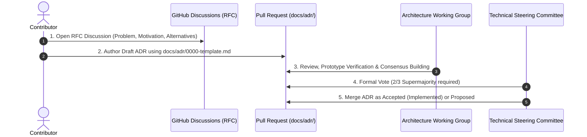

# Contributing to Spector ⚡

Thank you for your interest in contributing to Spector! We welcome contributions of all kinds — code, docs, tests, benchmarks, and ideas. **AI-assisted PRs are welcome! 🤖**

## Table of Contents

- [Code of Conduct](#code-of-conduct)
- [Project Governance](#project-governance)
- [Developer Certificate of Origin (DCO 1.1) & Licensing](#developer-certificate-of-origin-dco-11--licensing)
- [Architectural Changes (ADRs & RFCs)](#architectural-changes-adrs--rfcs)
- [Getting Started](#getting-started)
- [Development Setup](#development-setup)
- [Troubleshooting First-Time Setup](#troubleshooting-first-time-setup)
- [Making Changes](#making-changes)
- [Coding Standards](#coding-standards)
- [License Headers](#license-headers)
- [Testing Expectations](#testing-expectations)
- [Pull Request Process](#pull-request-process)
- [Reporting Issues](#reporting-issues)

## Code of Conduct

This project adheres to the [Contributor Covenant Code of Conduct](CODE_OF_CONDUCT.md). By participating, you are expected to uphold this code. Please report unacceptable behavior to [support@spectrayan.com](mailto:support@spectrayan.com).

## Project Governance

Spector is an open-source, community-driven project governed under Linux Foundation / AAIF open governance standards. We operate with transparent, vendor-neutral meritocracy:
- Community roles: **Project Lead**, **Technical Lead**, **Architecture Working Group (AWG)**, **Technical Steering Committee (TSC)**, **Maintainers**, **Committers / Reviewers**, and **Contributors**.
- We maintain a **4-tier Contributor Ladder** providing clear advancement paths from first-time contributor to committer, maintainer, and TSC member.
- Decision mechanics follow lazy consensus (72h default), simple majority for operational appointments/deprecations, and 2/3 TSC supermajority for architectural changes.
- For complete details on roles, review authorities, and voting mechanics, see [GOVERNANCE.md](GOVERNANCE.md).

## Developer Certificate of Origin (DCO 1.1) & Licensing

Spector uses the standard **Developer Certificate of Origin (DCO 1.1)**. All modules, client SDKs, tooling, and connectors across the repository are licensed under the **Apache License 2.0**.

### DCO 1.1 Sign-Off Requirement

All commits must include a `Signed-off-by` line certifying compliance with the Developer Certificate of Origin (DCO 1.1). Use the `-s` flag when committing:

```bash
git commit -s -m "feat(core): add new SIMD kernel"
```

This appends:
```
Signed-off-by: Your Name <your.email@example.com>
```

> **Note:** Pull requests containing commits without a valid DCO sign-off will not be merged.

## Getting Started

1. **Fork** the repository on GitHub
2. **Clone** your fork locally
3. **Create a branch** for your change
4. **Make your changes** with appropriate tests
5. **Submit a pull request**

### Good First Areas

Not sure where to start? Here are beginner-friendly contribution areas:

- 📖 **Documentation improvements** — fix typos, improve examples, add diagrams
- 🧪 **Additional test coverage** — especially edge cases in `spector-core` and `spector-index`
- 🧬 **New embedding providers** — implement the `EmbeddingProvider` SPI for a new service
- 🖥️ **CLI enhancements** — add new commands or improve output formatting in `spector-cli`
- 🌱 **Spring AI adapter extensions** — improve the Spring AI integration in `spector-spring`
- 📊 **Benchmark scenarios** — add new benchmark cases to `spector-bench`
- 🧠 **Synapse agent tools** — add new agent tools or connector templates to `spector-synapse`
- 🎨 **Cortex UI components** — build Angular 22 signal-based components for `spector-cortex`

## Development Setup

### Prerequisites

| Tool | Version | Notes |
|------|---------|-------|
| JDK  | 25+     | OpenJDK with Vector API incubator support |
| Maven | 3.9+   | For multi-module reactor build |
| Git  | 2.40+   | Version control |

### First-Time Setup

```bash
# Clone your fork
git clone https://github.com/<your-username>/spector.git
cd spector

# Verify JDK 25+ is installed
java -version

# Build the project (core modules only)
mvn clean compile

# Run the test suite (212 tests)
mvn test

# Run the server (optional)
mvn exec:java -pl spector-node -Dexec.mainClass="com.spectrayan.spector.server.SpectorNode"
```

### Building Synapse

The `spector-synapse` module is gated behind a Maven profile and is **not built by default**. To build synapse:

```bash
# Build core + synapse
mvn clean compile -Psynapse

# Run synapse tests only
mvn test -pl spector-synapse -Psynapse

# Full verify including synapse
mvn verify -Psynapse
```

> **Note:** You must build core modules first (or use the full reactor with `-Psynapse`) since synapse depends on `spector-engine`, `spector-memory`, and other core modules.


## Troubleshooting First-Time Setup

### Building from the Repository Root

Always run builds from the repository root so Maven can build and cache all local modules before compiling dependent modules.

For example:

```bash
mvn clean install -Psynapse -DskipTests
```

Building from the project root ensures modules such as `spector-test-support` are available locally before other modules attempt to resolve them.

### Common Errors

| Error | Cause | Solution |
|-------|-------|----------|
| Missing local module dependencies | The project was built from a submodule instead of the repository root. | Run `mvn clean install -Psynapse -DskipTests` from the repository root. |


### SIMD Verification

Spector uses the Java Vector API for SIMD acceleration. Verify your system supports it:

```bash
# Check SIMD capability
java --add-modules jdk.incubator.vector -cp spector-core/target/classes \
  com.spectrayan.spector.core.SimdCapability
```

Expected output includes your hardware's SIMD width (e.g., `S_256_BIT` for AVX2).

### Running Tests

```bash
# Full test suite
mvn test

# Single module
mvn test -pl spector-core

# Single test class
mvn test -pl spector-core -Dtest=DotProductTest
```

## Architectural Changes (ADRs & RFCs)

Spector maintains an active catalog of **Architecture Decision Records (ADRs)** located in `docs/adr/`. Any proposal that substantially alters the architecture, memory model, compute layer, or public API contract must complete our formal Request for Comments (RFC) and ADR process before code implementation begins.

### When is an ADR Required?

An ADR is **mandatory** for changes that:
1. **Alter Memory or Storage Layouts**: Introduce or modify zero-copy off-heap Panama FFM memory layouts (`Arena`, `MemorySegment`), bundle kernels (`PartitionBundle`, `RuntimeBundle`, `EngramLayout`), or WAL replay mechanisms (`spector-memory`).
2. **Introduce Compute or SIMD Kernels**: Modify compute SPIs (`spector-core`), Panama Vector API implementations (`spector-cpu`), or GPU hardware kernels (`spector-gpu`).
3. **Change Cognitive Memory Semantics**: Modify the 4-tier cognitive memory model (Working, Episodic, Semantic, Procedural), Hebbian co-activation networks, or fused scoring pipelines.
4. **Impact Distributed Architecture**: Change cell clustering protocols, topology discovery, state replication, or disaster recovery mechanics (`spector-cluster`).
5. **Break Public APIs**: Introduce backwards-incompatible API changes or deprecate core interfaces.
6. **Add Major Dependencies**: Introduce substantial external libraries affecting runtime footprint or supply chain security.

Routine bug fixes, documentation updates, internal refactoring, and performance optimizations that preserve existing interfaces and memory layouts do **not** require an ADR.

### The RFC & ADR Lifecycle



The RFC & ADR lifecycle proceeds through 5 steps:

1. **Step 1 — Open an RFC Discussion**:
   - Start a discussion on [GitHub Discussions](https://github.com/spectrayan/spector/discussions) under the **Architecture** category.
   - Articulate the problem statement, motivations, technical trade-offs, and alternative approaches considered.
   - Solicit community, Committer, and Maintainer feedback for at least 7 calendar days.

2. **Step 2 — Draft the ADR**:
   - Copy the official template: [`docs/adr/0000-template.md`](docs/adr/0000-template.md).
   - Assign the next sequential ADR number (e.g., `docs/adr/0038-my-feature.md`).
   - Populate standard metadata headers:
     - `Status`: `Proposed`
     - `Date`: `YYYY-MM-DD`
     - `Authors`: Contributor name(s) & Spector Architecture Working Group
     - `Deciders`: Spector Technical Steering Committee (TSC)
     - `Supersedes` / `Superseded By`: Reference relevant ADRs or `None`
     - `Last Verified`: Current date

3. **Step 3 — Submit Pull Request**:
   - Open a pull request against `docs/adr/` with the label `type:adr`.
   - Link the RFC Discussion in the pull request description (`Discussion / RFC: #___`).

4. **Step 4 — Architecture Working Group (AWG) Review**:
   - The Architecture Working Group and Maintainers evaluate the design against zero-GC, Panama FFM, and SIMD constraints, verifying prototypes and micro-benchmarks.

5. **Step 5 — TSC Supermajority Vote**:
   - The Technical Steering Committee (TSC) votes on the record. Approval requires a **2/3 supermajority** per [GOVERNANCE.md](GOVERNANCE.md).
   - Upon acceptance, the ADR is marked `Accepted (Implemented)` once verified against `main`, or `Proposed` if queued for upcoming milestones, and indexed in the MkDocs portal.

## Making Changes

### Branch Naming

Use descriptive branch names with a type prefix:

```
feat/add-quantization-support
fix/hnsw-concurrent-insert-race
perf/simd-avx512-unroll-loop
refactor/storage-arena-lifecycle
docs/api-usage-examples
```

### Commit Messages

Follow [Conventional Commits](https://www.conventionalcommits.org/):

```
feat(core): add AVX-512 double-pump dot product kernel
fix(index): prevent HNSW neighbor list corruption under concurrent insert
perf(storage): use bulk MemorySegment.copy for vector reads
refactor(query): extract RRF into standalone utility class
docs: add benchmark results to README
```

**Format:** `<type>(<scope>): <description>`

| Type | Purpose |
|------|---------|
| `feat` | New feature |
| `fix` | Bug fix |
| `perf` | Performance improvement |
| `refactor` | Code restructuring (no behavior change) |
| `docs` | Documentation only |
| `test` | Adding or updating tests |
| `chore` | Build, CI, tooling changes |

## Coding Standards

### Java

- **Java 25** — use records, sealed classes, pattern matching, switch expressions
- **Vector API** — always use `FloatVector.SPECIES_PREFERRED`, never hardcode lane widths
- **Panama FFM** — use `Arena.ofShared()` for concurrent access, `Arena.ofConfined()` for single-thread
- **Virtual Threads** — use `ReentrantLock` instead of `synchronized` to avoid pinning
- **Testing** — all new features require unit tests; use JUnit 5 + AssertJ
- **Javadoc** — all public classes and methods must have Javadoc comments

### Performance

- **No allocations in hot paths** — reuse buffers, use slice-based APIs with offset+length
- **Branchless SIMD** — use `VectorMask` for tail handling, never scalar fallback
- **Benchmark before/after** — performance PRs must include JMH results

### Architecture

- **Module boundaries** — respect the dependency graph; no circular dependencies
- **Interface-first** — add interfaces before implementations for pluggability
- **Zero-copy** — prefer `MemorySegment` slices over array copies

## License Headers

All source files (`.java`, `.ts`, `.js`, `.py`) must include a license header. The build enforces this automatically — `mvn compile` will fail if any file is missing a header.

### Which license applies?

All modules in the repository are licensed under the **Apache License 2.0**. All source files use the standard Apache 2.0 header template (`src/license/apache2-header.txt`).

### Auto-fix missing headers

Don't worry about writing headers by hand. Run this command and the correct header is added automatically:

```bash
mvn license:format
```

> **Tip:** Running `mvn compile` (or `mvn install`) will catch missing headers before you push — the license check runs as the very first build step.

### What happens in CI?

- **Same-repo PRs** (maintainer branches): CI will auto-commit the fix for you.
- **Fork PRs** (external contributors): CI will post a comment with the exact command to run.

You can always avoid this by running `mvn license:format` locally before pushing.

## Testing Expectations

Testing is a core quality gate in Spector. Because our components deal with off-heap native memory (Panama FFM), vector hardware intrinsics (SIMD), and concurrent event loops, rigorous test coverage is essential.

### Test Categories

| Category | Scope | Framework | Requirement |
|:---|:---|:---|:---|
| **Unit Tests** | Module-level correctness, boundary checks | JUnit 5 + AssertJ | Required for all new classes and bug fixes |
| **Property Tests** | Algorithm invariants, persistence round-trips | jqwik | Required for index algorithms, binary codecs, and layout serializers |
| **Integration Tests** | Cross-module flows, Spring AI, MCP server | JUnit 5 (`spector-test-support`) | Required for end-to-end pathways and REST/SSE gateways |
| **Microbenchmarks** | Hot-path throughput, latency, GC overhead | OpenJDK JMH (`spector-bench`) | Required for any performance-sensitive PR or SIMD kernel |

### Running the Test Suites

```bash
# Run unit tests across the reactor
mvn test

# Run tests for a specific module
mvn test -pl spector-core

# Run a specific test class
mvn test -pl spector-core -Dtest=DotProductTest

# Run with full synapse profile
mvn test -Psynapse
```

## Pull Request Process

1. **Ensure your branch is up to date** with `main`
2. **Verify DCO 1.1 sign-off** — all commits must be signed with `git commit -s`
3. **Format license headers** — run `mvn license:format` locally
4. **All tests pass** — verify locally with `mvn test`; CI will re-verify on push
5. **Fill out the PR template** — complete `.github/pull_request_template.md` including ADR and Discussion references
6. **Link related issues** — use `Closes #123` or `Fixes #456`
7. **Code review & approval** — reviewed and approved by a Maintainer or Committer per [GOVERNANCE.md](GOVERNANCE.md)
8. **Squash merge** — PRs are squash-merged to preserve clean, linear git history

### PR Checklist

- [ ] My commits include a valid DCO 1.1 sign-off (`git commit -s`)
- [ ] License headers are formatted on all source files (`mvn license:format`)
- [ ] Code adheres to project style, Java 25 idioms, and Panama FFM / SIMD guidelines
- [ ] Tests added/updated covering changed behavior and edge cases (`mvn test`)
- [ ] Public classes and methods include clear Javadoc
- [ ] If this PR introduces an architectural change, the corresponding ADR is referenced (`Implements ADR: ADR-____`)
- [ ] No hardcoded secrets, tokens, or credentials
- [ ] JMH benchmarks included (if performance-related)

## Reporting Issues

### Bug Reports

Use the [Bug Report template](https://github.com/spectrayan/spector/issues/new?template=bug_report.md) and include:

- Steps to reproduce
- Expected vs actual behavior
- JDK version and SIMD capability output
- Relevant logs or stack traces

### Feature Requests

Use the [Feature Request template](https://github.com/spectrayan/spector/issues/new?template=feature_request.md) and describe:

- The problem you're trying to solve
- Your proposed solution
- Any alternatives you've considered

## Questions?

- **General questions:** Open a [Discussion](https://github.com/spectrayan/spector/discussions)
- **Bug reports:** Open an [Issue](https://github.com/spectrayan/spector/issues)
- **Security vulnerabilities:** See [SECURITY.md](SECURITY.md)
- **Email:** [developer@spectrayan.com](mailto:developer@spectrayan.com)

---

Thank you for contributing to Spector! ⚡ Every contribution — no matter how small — makes a difference.
