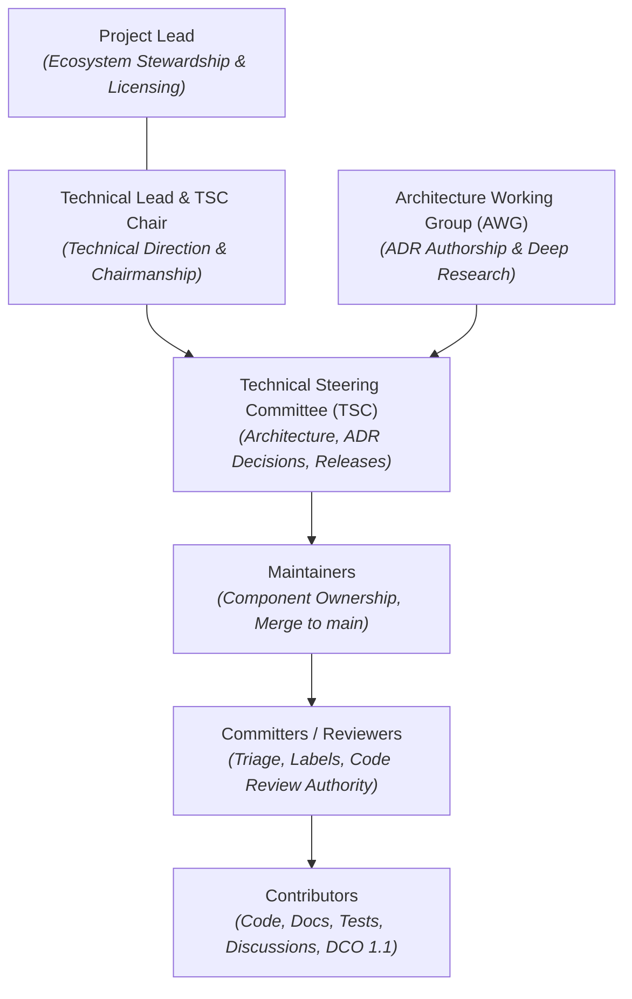
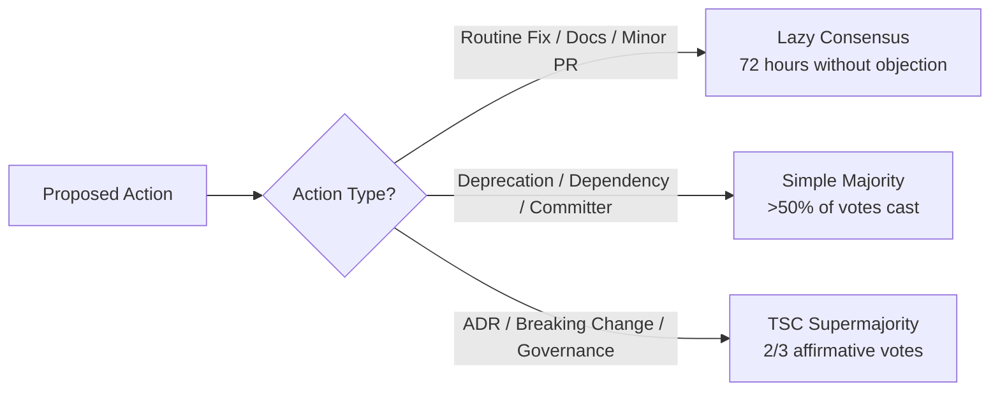

# Project Governance

This document establishes the open-source governance model for the **Spector** project, adhering to Linux Foundation and AI & Data / AAIF open governance standards. Spector is an open-source, community-driven project governed through transparent, vendor-neutral meritocracy.

---

## 1. Principles & Values

The Spector project is guided by the following core values:

- **Openness & Transparency**: Technical roadmap planning, architectural debates, decision records, and release schedules are conducted in public forums (GitHub Issues, Discussions, and Pull Requests).
- **Meritocracy & Inclusivity**: Influence and review authority are earned through sustained technical contributions, high engineering standards, and constructive peer collaboration.
- **Vendor Neutrality**: The project is governed independently of commercial affiliations. Technical direction serves the long-term health of the open-source software ecosystem.
- **Strictly Open-Source Roles**: Governance relies on established open-source roles (*Project Lead*, *Technical Lead*, *Architecture Working Group*, *Technical Steering Committee*, *Maintainers*, *Committers*, and *Contributors*). Corporate titles (such as CEO, CTO, Product Owner, or VP) play no role in project decision-making.
- **Psychological Safety**: All participants must treat one another with respect and abide by our [Code of Conduct](CODE_OF_CONDUCT.md).

---

## 2. Governance Structure & Roles



The governance hierarchy is structured into the following defined roles:

### 2.1 Project Lead
- Oversees project health, ecosystem partnerships, trademark and license stewardship, and institutional sponsor alignment.
- Works in tandem with the Technical Lead to sponsor the Technical Steering Committee (TSC).
- Mediates community disputes when escalated through formal governance processes.

### 2.2 Technical Lead
- Sets overall technical direction across the reactor modules (`nucleus`, `memory`, `synapse`, `bench`).
- Serves as the Chair of the Technical Steering Committee (TSC).
- Coordinates cross-cutting initiatives and breaks technical deadlocks when required.

### 2.3 Architecture Working Group (AWG)
- A cross-functional group of experienced maintainers and domain specialists focused on core architectural challenges:
  - Java Panama Foreign Function & Memory (FFM) off-heap layouts.
  - SIMD vector acceleration and hardware kernel kernels (`jdk.incubator.vector`).
  - Off-heap zero-copy memory layouts, bundle kernels, and memory recycling.
  - Biologically-inspired cognitive memory algorithms and mathematical kernels.
  - Distributed cell clustering, consensus, and disaster recovery.
- Authors and vets Architecture Decision Records (ADRs) and Requests for Comments (RFCs).

### 2.4 Technical Steering Committee (TSC)
- The principal technical governing authority of the project.
- Responsibilities:
  - Final decision authority on Architecture Decision Records (ADRs).
  - Approving breaking changes and public API deprecations.
  - Release governance, versioning milestones, and release train schedules.
  - Security vulnerability disclosures and incident oversight.
  - Amendments to project governance and policies.
  - Appointing new Maintainers and TSC members.
- Chaired by the Technical Lead with Project Lead sponsorship.

### 2.5 Maintainers
- Domain leads who have demonstrated technical leadership and deep expertise in one or more subsystems (`nucleus`, `memory`, `synapse`, `bench`, `cortex`).
- Responsibilities:
  - Write and merge authority on branches and pull requests to `main`.
  - Reviewing code for correctness, security, performance, and style.
  - Subsystem release candidate validation.
  - Mentoring newcomers and nominating active contributors to Committer / Reviewer status.

### 2.6 Committers / Reviewers
- Active community members with sustained contributions (minimum 3 merged PRs) granted elevated community rights:
  - Issue triage and label management (e.g., `good first issue`, `type:bug`, `area:*`).
  - Formal code review authority (LGTM / Approvals).
  - Guiding new contributors through the contribution workflow.

### 2.7 Contributors
- Anyone who interacts with the project by reporting bugs, suggesting features, participating in discussions, authoring documentation, or submitting pull requests under the Developer Certificate of Origin (DCO 1.1).

---

## 3. The 4-Tier Contributor Ladder

Spector provides a transparent ladder for advancement within the project:

| Tier | Role | Scope & Authority | Qualification Criteria | Nomination & Approval Process |
|:---|:---|:---|:---|:---|
| **Tier 1** | **Contributor** | Open issues, PRs, docs, discussions; community code reviews | Open to all; sign-off commits per DCO 1.1 (`git commit -s`) | None (self-onboarding) |
| **Tier 2** | **Committer / Reviewer** | Issue triage, label assignment, formal PR code review authority | Minimum **3 merged PRs** demonstrating code quality, familiarity with architectural principles, and constructive code review etiquette | Nominated by any Maintainer; approved by simple majority vote of Maintainers |
| **Tier 3** | **Maintainer** | Subsystem stewardship, merge rights to `main`, branch management, release cuts | Sustained high-quality contributions over 3+ months, domain ownership of a subsystem, mentoring contributors | Nominated by any Maintainer; approved by simple majority vote of the TSC |
| **Tier 4** | **Technical Steering Committee (TSC)** | Architectural stewardship, final ADR approval, security advisories, release authorization | Exceptional cross-reactor architectural leadership, sustained stewardship in AWG, deep strategic engagement | Nominated by any TSC member; approved by **2/3 supermajority vote** of the TSC |

### Immediate Eligibility for Committer / Reviewer Status
In recognition of outstanding contributions to Spector:
- **Timothy Kim ([@timothytkim](https://github.com/timothytkim))** has authored 5 merged pull requests spanning vector index diagnostics (#936), kernel documentation (#939), provider architecture (#878), cognitive neuroscience taxonomy (#904), and Prometheus metrics observability (#920). Timothy Kim is explicitly recognized as **immediately eligible** for Tier 2 Committer / Reviewer appointment.

### Stepping Down & Emeritus Status
Community members may step down from Maintainer or TSC roles at any time:
- Maintainers or TSC members inactive for more than 6 months without notice may be transitioned to **Emeritus** status by the TSC.
- Emeritus members remain permanently honored in [ACKNOWLEDGMENTS.md](ACKNOWLEDGMENTS.md) and may request reactivation via a simple majority vote of the TSC.

---

## 4. Decision-Making & Voting Mechanics

The project uses three tiers of decision-making depending on the scope of the change:



### 4.1 Lazy Consensus (Default)
Lazy consensus is the standard operating model for daily engineering activities:
- Applies to: Bug fixes, performance optimizations, documentation updates, test enhancements, and non-breaking feature additions.
- Process: The change is submitted as a GitHub Pull Request. If at least one Committer or Maintainer approves and no objections are raised within **72 hours**, the proposal is deemed accepted.

### 4.2 Simple Majority (>50%)
A simple majority of votes cast by eligible voters is required for:
- Deprecating existing public APIs (with minimum one release cycle advance notice).
- Introducing or upgrading third-party library dependencies.
- Appointing new Committers / Reviewers (voted by Maintainers).
- Appointing new Maintainers (voted by TSC).

### 4.3 Two-Thirds (2/3) Supermajority of the TSC
A 2/3 affirmative supermajority of the Technical Steering Committee is required for:
- Accepting or superseding Architecture Decision Records (ADRs).
- Breaking architectural changes or backwards-incompatible API removals.
- Modifying licensing terms or license header requirements.
- Amending this `GOVERNANCE.md` document.
- Appointing new TSC members or removing members for Code of Conduct violations.

### 4.4 Voting Process & Deadlocks
- Votes are called on GitHub Discussions or Pull Requests with a minimum duration of **7 calendar days**.
- Quorum is achieved when at least 50% of eligible voters cast a ballot.
- In the event of an unbroken tie, the **Technical Lead & TSC Chair** casts the tie-breaking vote.

---

## 5. Architectural Governance (ADRs & RFCs)

Any change meeting any of the following criteria requires an **Architecture Decision Record (ADR)**:
1. Introduction of new storage bundle layouts, on-disk formats, or off-heap arena lifecycles.
2. Changes to SIMD computation SPIs or Panama Vector APIs.
3. Modifications to cognitive memory tiers (Working, Episodic, Semantic, Procedural) or scoring pipelines.
4. Distributed clustering protocols, cell discovery, or state replication engines.
5. Public API breaking changes or removal of previously deprecated features.

### The RFC & ADR Lifecycle:
1. **RFC Discussion**: Open a GitHub Discussion under the `Architecture` category detailing the problem, motivations, and trade-offs.
2. **Draft ADR**: Author a draft ADR in markdown following `docs/adr/0000-template.md`.
3. **Pull Request**: Open a pull request against `docs/adr/` labeled `type:adr`.
4. **AWG & Maintainer Review**: The Architecture Working Group and Maintainers review the proposal, debate alternatives, and test prototypes.
5. **TSC Vote**: Upon completion of review, the TSC conducts a formal vote requiring a **2/3 supermajority** to mark the ADR as `Accepted (Implemented)` or `Proposed`.

---

## 6. Developer Certificate of Origin (DCO 1.1)

To ensure copyright integrity without imposing onerous corporate legal agreements, Spector adopts the standard **Developer Certificate of Origin (DCO 1.1)**.

Every contributor certifies that they authored or have permission to submit the code by including a signed-off line in their commit messages:

```bash
git commit -s -m "feat(index): implement AVX-512 distance metric"
```

Which produces:
```
Signed-off-by: Full Name <contributor@example.com>
```

PRs lacking DCO sign-offs cannot be merged into `main`.

---

## 7. Security Vulnerability Reporting

Security is paramount in an AI memory backbone handling sensitive agent contexts. Security disclosures must follow the coordinated process outlined in [SECURITY.md](SECURITY.md):
- Security issues must **not** be reported on public GitHub issues.
- Reports should be submitted privately via GitHub Security Advisories or emailed to `security@spectrayan.com`.
- The TSC Security Taskforce will acknowledge receipt within 24 hours and issue fixes under an embargoed advisory until patches are released.

---

## 8. Amendments to Governance

This governance charter may be amended by opening a Pull Request modifying `GOVERNANCE.md`. Amendments require:
1. Formal public announcement on GitHub Discussions for at least 14 calendar days.
2. Review and consensus within the Architecture Working Group.
3. A **2/3 supermajority affirmative vote** of the Technical Steering Committee (TSC).
