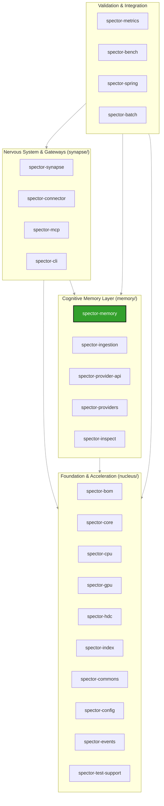

# Spector Project Context

Welcome to the **Spector** repository context guide. This document serves as the high-level onboarding and architectural blueprint for Spector, a state-of-the-art cognitive memory backbone combining dense vector similarity, SIMD-accelerated BM25 text matching, SPLADE sparse retrieval, Hebbian graph structures, and biologically-inspired cognitive memory tiers. It acts as the "bridge" linking the actual source code with our agent rules, skills, and workflows.

---

## 1. Vision & Core Value Proposition

Traditional vector databases are simple document-matching engines. They perform static similarity searches on static embeddings with high latency, large GC overhead, and zero contextual awareness.

Spector reimagines search by mimicking biological cognitive structures:
*   **Volatile & Permanent Tiers**: Working Memory (Prefrontal Cortex) acts as a volatile circular buffer, while Episodic/Semantic layers represent permanent memory storage.
*   **Fused Scoring**: Instead of plain similarity, Spector evaluates `Similarity × Importance × Temporal Decay` in a single pass.
*   **Synaptic Gating**: Uses a 64-bit inline Bloom filter (Synaptic Tags) to eliminate 99% of candidate records before doing vector computations.
*   **Zero-GC Performance**: Built on off-heap Panama FFM and SIMD Vector APIs, processing 1M memories in under **0.13ms**.

---

## 2. Technology Stack & JVM Configuration

The Spector codebase relies on a bleeding-edge Java tech stack, taking full advantage of modern JVM capabilities:

| Technology Domain | Technology / Library | Version / Specs | Purpose |
|---|---|---|---|
| **Core Runtime** | OpenJDK 25 | JDK 25 (with Preview & Incubator) | Panama FFM, SIMD Vector API, Virtual Threads |
| **Build System** | Apache Maven | 22-module Maven Reactor | Modular builds, reproducible JAR outputs |
| **API Gateways** | Armeria / Javalin | Armeria 1.39.1 / Javalin 6.6.0 | Unified gRPC & HTTP on a single port (Netty-backed) |
| **JSON Parser** | Jackson | Jackson 3.x (BOM Jackson 2.x) | Fast off-heap compatible serialization/deserialization |
| **Observability** | Micrometer | 1.14.5 (Core & Prometheus) | Sub-microsecond metrics tracking |
| **Model Context** | Anthropic MCP Java SDK | 2.0.0-M3 (Official) | Native integration with Model Context Protocol |
| **Testing** | JUnit 5 / AssertJ / Mockito | JUnit 5.11.4 / AssertJ 3.27.3 | Fluent assertions and concurrent testing frameworks |
| **Micro-benchmarking** | OpenJDK JMH | 1.37 | Microsecond-accurate performance testing for hot paths |

### JVM Execution Flags
Because of the heavy dependency on Panama FFM and SIMD Vector APIs, compiler and surefire execution requires these exact JVM arguments:
```bash
--add-modules jdk.incubator.vector \
--enable-preview \
--enable-native-access=ALL-UNNAMED \
--add-opens java.base/java.lang=ALL-UNNAMED \
--add-opens java.base/java.lang.reflect=ALL-UNNAMED
```

---

## 3. Module & Layer Architecture

Spector is organized as a strict layered architecture to prevent circular dependencies and maintain clean boundaries:



### Module Responsibilities

1.  **Foundation & Acceleration Layer (`nucleus/`)**
    *   `spector-bom`: Central bill of materials POM defining module dependency constraints.
    *   `spector-commons`: Central utilities, concurrent queues, standard exceptions, and `ErrorCode` enum registry.
    *   `spector-core`: Compute SPIs (Similarity, HNSW, SVASQ, MaxSim) and vector quantization algorithms.
    *   `spector-cpu`: Java 25 Panama Vector SIMD hardware-accelerated kernels.
    *   `spector-gpu`: Java 25 Panama FFM + CUDA GPU hardware-accelerated kernels.
    *   `spector-hdc`: Hyperdimensional computing vector algebra.
    *   `spector-index`: Distance indexes (in-memory HNSW, SpectorIndex, BM25, Splade).
    *   `spector-config`: Central configuration manager (`SpectorConfigFactory.java`, `SpectorProperties.java`).
    *   `spector-events`: Decoupled telemetry event bus (`TelemetryBus`, `TelemetryScope`).
    *   `spector-test-support`: Test fixtures, mocks, and integration test base classes.
2.  **Cognitive Memory Layer (`memory/`)**
    *   `spector-memory`: Off-heap biologically-inspired 4-tier cognitive memory (Working, Episodic, Semantic, Procedural), Bundle Kernel (`PartitionBundle`, `RuntimeBundle`), Hebbian co-activation graph, and multi-stage recall pipeline.
    *   `spector-provider-api`: Model-agnostic LLM and text-to-vector embedding SPI.
    *   `spector-providers`: Concrete implementations connecting to Ollama, OpenAI, Google, Anthropic, and ONNX.
    *   `spector-ingestion`: Document chunking, multi-modal sensory extractors, and ingestion routing.
    *   `spector-inspect`: Binary inspection utility for partition and runtime bundles.
    *   `spector-metrics`: Micrometer and Prometheus observability instrumentation.
3.  **Nervous System & Gateways (`synapse/`)**
    *   `spector-synapse`: Unified API gateway, Spring Boot 4 / Armeria REST/SSE server, and agentic chat graph.
    *   `spector-connector`: Enterprise data connectors powered by Apache Camel.
    *   `spector-mcp`: Model Context Protocol server exposing Spector memory via STDIO/SSE.
    *   `spector-cli`: Multi-function CLI executable (`spectorctl`) and standalone MCP runner packaged into fat `spector.jar`.
    *   `spector-spring`: Spring AI VectorStore integration starter.
    *   `spector-batch`: Batch migration engine.
4.  **Performance & Benchmarks (`bench/`)**
    *   `spector-bench`: JMH micro-benchmarks and end-to-end cognitive memory evaluation harness.

---

## 4. Architectural Guidelines & Concurrency Rules

*   **Virtual Threads Safe Concurrency**: Spector is built on virtual threads. Never use the `synchronized` keyword (which pins carrier threads). Use `ReentrantLock`, `StampedLock`, or non-pinning concurrency utilities.
*   **Platform-Agnostic SIMD**: Lane widths cannot be hardcoded (e.g., AVX-512 vs. AVX2). Use `FloatVector.SPECIES_PREFERRED` inside `spector-core`, `spector-cpu`, `spector-index`, or `spector-memory`.
*   **Bundle Kernel Architecture**: Storage and persistence are encapsulated within `spector-memory` using zero-copy Panama FFM memory layouts (`PartitionBundle`, `RuntimeBundle`, `CognitiveRecordLayout`). Vector indexes are managed in-memory by `spector-index`.
*   **Structured Concurrency**: Centralized in `ConcurrentTasks` (`spector-commons`) with automatic fallback to classic virtual thread executors via `-Dspector.concurrency.structured=false`.

---

## 5. Quick Directory Map

*   **Runtime Config**: `spector-local.yml` (overrides default options).
*   **On-Disk Storage**: `.spector/` (ignored via `.gitignore` - do not delete or commit).
*   **Biologically-Inspired Design**: `spector-memory/RnD/` holds raw design math for cognitive memory mechanisms.
*   **Documentation Site**: `docs/` (built via MkDocs Material: `python -m mkdocs build --clean`).
