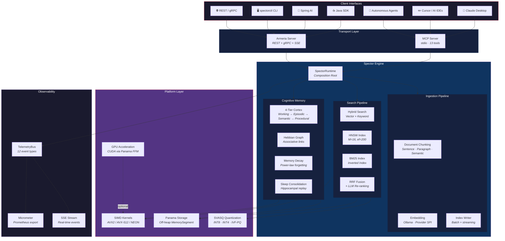
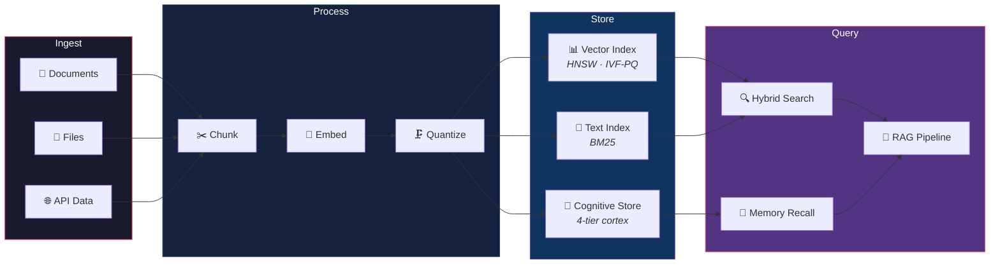
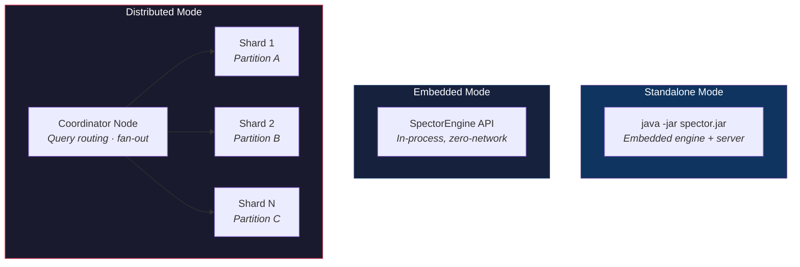
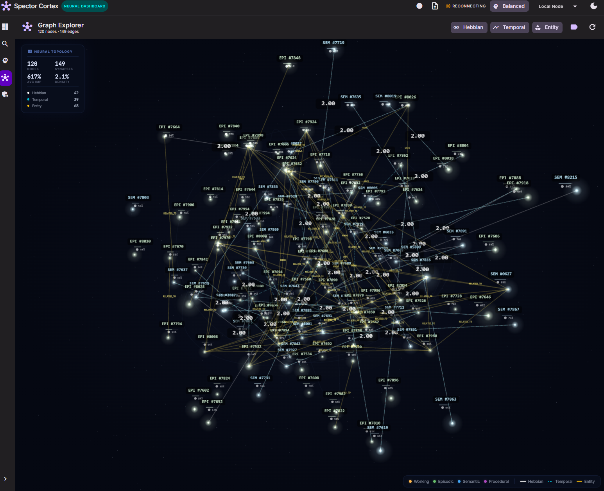
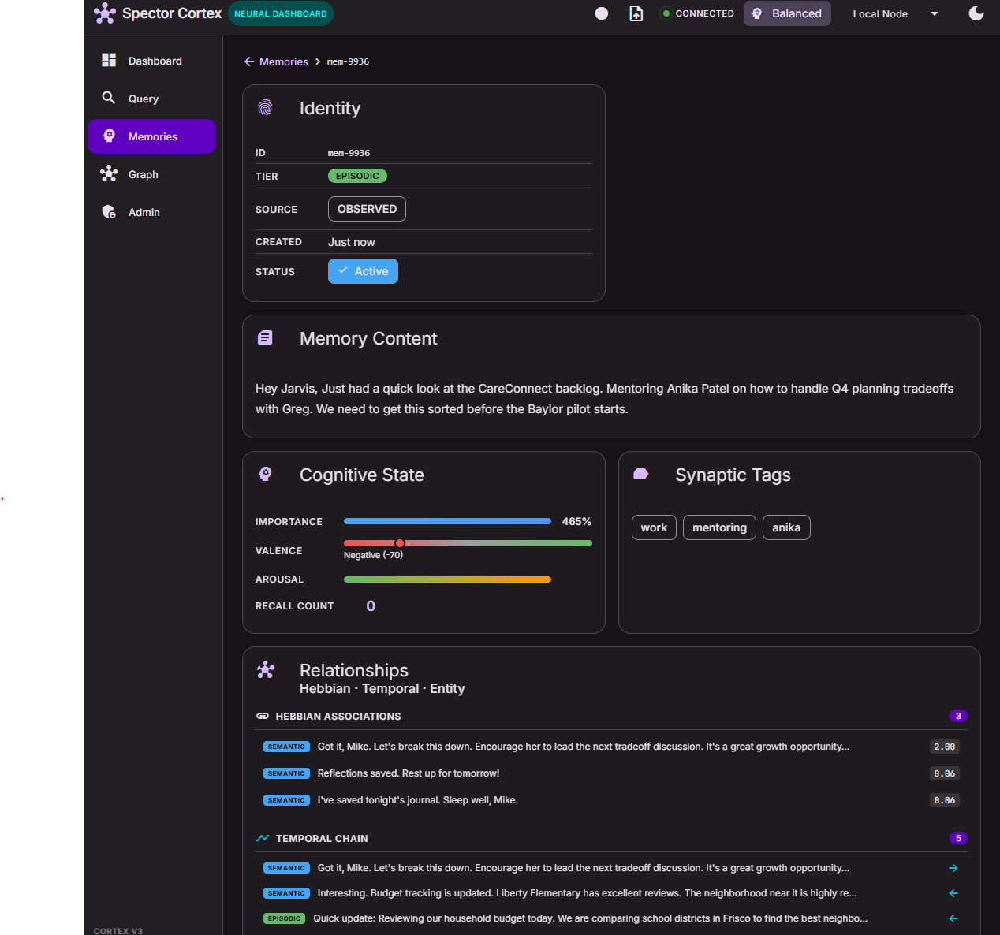

<p align="center">
  
</p>

<p align="center">
  <strong>The Zero-Overhead, Agent-Ready AI Memory Backbone.</strong>
</p>

<p align="center">
  <a href="LICENSE"></a>
  <a href="https://openjdk.org/"></a>
  <a href="https://github.com/spectrayan/spector/actions"></a>
  <a href="spector-mcp/"></a>
  <a href="https://spectrayan.github.io/spector/"></a>
  <a href="https://deepwiki.com/spectrayan/spector"></a>
</p>

---

Legacy search engines bolted vectors onto text databases. **Spector** is designed from the ground up for modern AI — leveraging Java Project Panama to achieve C++ bare-metal SIMD speeds natively, with a built-in MCP server that turns any AI agent into a search-powered reasoning machine.

---

## System Architecture



### Data Flow



### Deployment Topology



---

## 🧠 Cognitive Memory — AI Agents That Actually Remember

Spector Memory is a **biologically-inspired cognitive memory engine** that gives AI agents the ability to **remember**, **forget**, **consolidate**, and **associate** — with microsecond latency and zero garbage collection pressure.

| Capability | What it does |
|:---|:---|
| 🧠 **4-Tier Cortex** | Working → Episodic → Semantic → Procedural memory |
| ⚡ **0.13ms recall** at 1M memories | 15× faster than the 2ms target (vs. 50–200ms for Mem0/Letta/Zep) |
| 🔗 **Fused SIMD Scoring** | Similarity × importance × decay in a single pass — no truncation trap |
| 🛏️ **Sleep Consolidation** | Hippocampus-inspired pruning and partition rebuild |
| 😱 **Emotional Valence** | Amygdala-driven positive/negative/neutral tagging |
| 🚫 **Zero GC** | 100% off-heap Panama storage (≤0.01% overhead measured) |

> 📖 **[Full Cognitive Memory Documentation →](https://spectrayan.github.io/spector/memory/)**

---

## ✨ Key Capabilities

| Capability | Technology | Performance |
|:---|:---|:---|
| 🤖 **Agent-Native (MCP)** | Model Context Protocol · 13 tools · stdio | Claude · Cursor · autonomous agents |
| ⚡ **SIMD Search** | Java Vector API (AVX2/AVX-512/NEON) | 88µs p50 · 61K QPS |
| 🧊 **Off-Heap Storage** | Panama MemorySegment · zero-copy I/O | 0.01% GC overhead |
| 🗜️ **Quantization** | SVASQ-8/4 · IVF-PQ · FWHT rotation | 4–32× compression · 99.5% recall |
| 🔍 **Hybrid Search** | HNSW + BM25 + RRF + LLM re-ranking | Sub-ms latency |
| 🖥️ **GPU Acceleration** | CUDA via Panama FFM | Optional · zero-copy transfer |
| 📦 **Flexible Deployment** | Embedded JAR · Standalone · Distributed | Zero to cluster in one config |

---

## 📸 Demo

<p align="center">
  <a href="docs/screenshots/spector-cortex-neural-graph.mp4">
    
  </a>
  <br />
  <sub>🎥 <a href="docs/screenshots/spector-cortex-neural-graph.mp4">Watch the Neural Graph in action →</a></sub>
</p>

<details open>
<summary><b>📊 Dashboard — 12+ live cognitive panels</b></summary>
<p align="center">
  
</p>
Real-time scoring pipeline, SIMD lanes, decay curves, vector space, Hebbian graph, cognitive profiles, live metrics — all rendered with Three.js, Canvas 2D, and Angular Signals.
</details>

<details>
<summary><b>🌌 Graph Explorer — 3D neural galaxy</b></summary>
<p align="center">
  
</p>
Interactive 3D graph with glowing star nodes, Hebbian/temporal/entity edges, fly-to navigation, and real-time topology stats.
</details>

<details>
<summary><b>🧠 Memory Table — browse & manage memories</b></summary>
<p align="center">
  
</p>
Full CRUD with tier filtering, importance bars, valence indicators, synaptic tags, recall counts, and bulk actions.
</details>

<details>
<summary><b>🔬 Memory Detail — deep cognitive inspection</b></summary>
<p align="center">
  
</p>
Identity, cognitive state (importance/valence/arousal), synaptic tags, and full relationship graph (Hebbian associations, temporal chains, entity links).
</details>

---

## 🚀 Quick Start

**Prerequisites:** JDK 25+, Maven 3.9+

```bash
git clone https://github.com/spectrayan/spector.git
cd spector
mvn clean test                                        # Build & run all 685+ tests
mvn package -pl spector-dist -am -DskipTests          # Build the distribution JAR
```

**Start the MCP server** (for AI agents):

```bash
java --add-modules jdk.incubator.vector \
  --enable-native-access=ALL-UNNAMED --enable-preview \
  -jar spector-dist/target/spector.jar \
  --config spector.yml
```

**Claude Desktop config** — add to `claude_desktop_config.json`:

```json
{
  "mcpServers": {
    "spector": {
      "command": "java",
      "args": [
        "--add-modules", "jdk.incubator.vector",
        "--enable-native-access=ALL-UNNAMED",
        "--enable-preview",
        "-jar", "/path/to/spector-dist/target/spector.jar",
        "--config", "/path/to/spector.yml"
      ]
    }
  }
}
```

> 📖 **[Full Quick Start Guide →](https://spectrayan.github.io/spector/getting-started/quickstart/)** · **[Configuration Reference →](https://spectrayan.github.io/spector/configuration/parameters/)**

---

## 📊 Benchmarks

All numbers measured on Intel Core Ultra 9 285K, Java 25, AVX2 256-bit.

| Benchmark | Result | Notes |
|:---|:---|:---|
| Vector search p50 | **88–143µs** | 10K–100K docs, HNSW M=16 |
| Cognitive recall at 1M | **0.13ms p50** | 15× better than 2ms target |
| Peak QPS (16 threads) | **61,011** | Concurrent vectorSearch |
| GC overhead | **0.01%** | 1 pause / 100K searches |
| vs. Python MCP servers | **23–113× faster** | In-process SIMD, zero network |

> 📖 **[Full Benchmark Report →](https://spectrayan.github.io/spector/deep-dives/real-embedding-benchmarks/)** · **[Performance Tuning →](https://spectrayan.github.io/spector/operations/performance-tuning/)**

---

## 📖 Documentation

| I want to... | Start here |
|:---|:---|
| **Use Spector** | [Quick Start](https://spectrayan.github.io/spector/getting-started/quickstart/) · [Installation](https://spectrayan.github.io/spector/getting-started/installation/) · [Configuration](https://spectrayan.github.io/spector/configuration/parameters/) |
| **Connect an AI agent** | [MCP Server Guide](https://spectrayan.github.io/spector/sdk-usage/mcp-server/) · [Claude Desktop Config](#claude-desktop-config) |
| **Add cognitive memory** | [Memory Overview](https://spectrayan.github.io/spector/memory/) · [Getting Started](https://spectrayan.github.io/spector/memory/getting-started/) · [Use Cases](https://spectrayan.github.io/spector/memory/use-cases/) |
| **Use the Java SDK** | [Java SDK Guide](https://spectrayan.github.io/spector/sdk-usage/java-client/) · [Spring AI Integration](https://spectrayan.github.io/spector/sdk-usage/spring-ai/) |
| **Deploy to production** | [Docker Deployment](deploy/docker/) · [Performance Tuning](https://spectrayan.github.io/spector/operations/performance-tuning/) |
| **Extend with Enterprise** | [Spector Enterprise](https://github.com/spectrayan/spector-enterprise) — LLM providers, Cortex dashboard, data connectors |

> 📖 **[Full Documentation →](https://spectrayan.github.io/spector/)**

---

## 🤝 Contributing

We welcome contributions of all kinds — code, docs, tests, benchmarks, and ideas!

- 🐛 **Found a bug?** → [Open an Issue](https://github.com/spectrayan/spector/issues/new?template=bug_report.md)
- 💡 **Have an idea?** → [Start a Discussion](https://github.com/spectrayan/spector/discussions)
- 🔧 **Want to contribute code?** → See [CONTRIBUTING.md](CONTRIBUTING.md)
- 🤖 **AI-assisted PRs welcome!**

---

## ⭐ Star History

[](https://star-history.com/#spectrayan/spector&Date)

---

## 📄 License

This repository uses a **split licensing model**:

- **`spector-memory`** — [Business Source License 1.1](spector-memory/LICENSE) (transitions to Apache 2.0 on May 27, 2030)
- **All other modules** — [Apache License 2.0](LICENSE)

For branding and trademark guidelines, see the [NOTICE](NOTICE) file.

## 🔒 Security

See [SECURITY.md](SECURITY.md) for our security policy and vulnerability reporting.

## 🙏 Acknowledgments

See [ACKNOWLEDGMENTS.md](ACKNOWLEDGMENTS.md) for credits to the cognitive science researchers, open-source frameworks, and AI coding tools that made Spector possible.

---

<p align="center"><strong>Built with ⚡ by <a href="https://www.spectrayan.com/">Spectrayan</a></strong></p>
