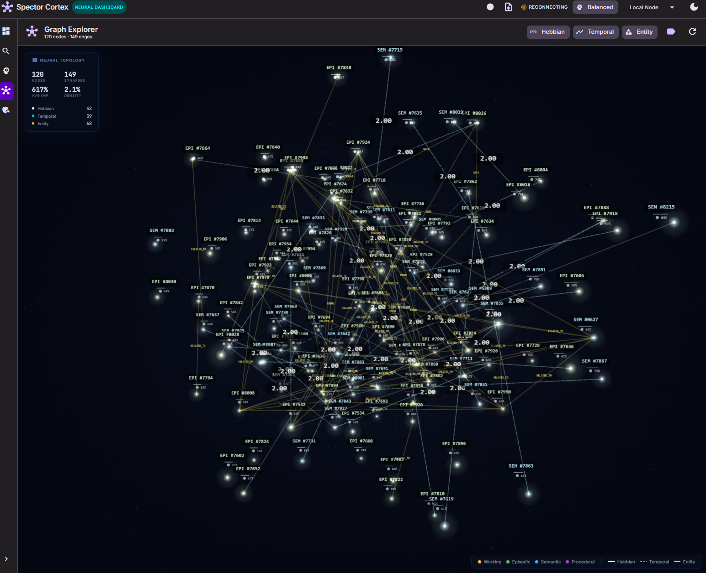
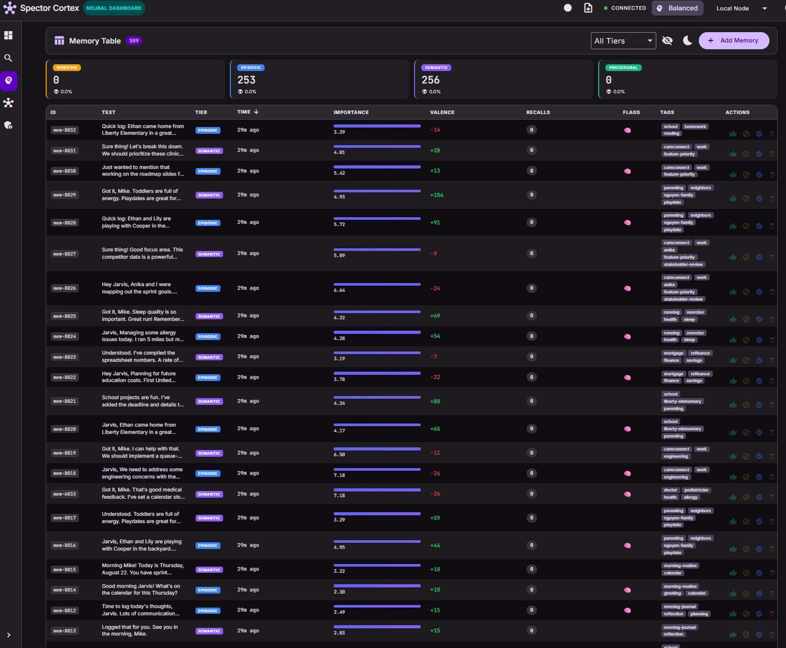
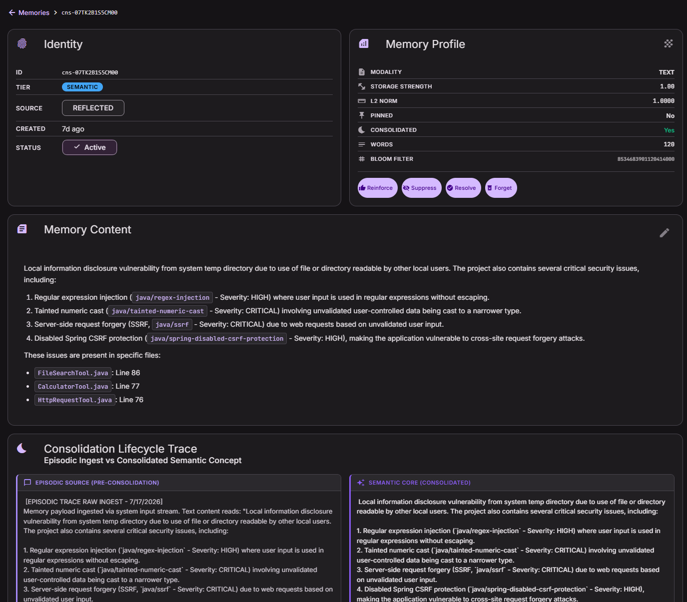

<p align="center">
  <picture>
    <source media="(prefers-color-scheme: dark)" srcset="docs/docs/assets/spector-logo-full-dark.png">
    <source media="(prefers-color-scheme: light)" srcset="docs/docs/assets/spector-logo-full-light.png">
    
  </picture>
</p>

<p align="center">
  <strong>The Zero-Overhead, Agent-Ready AI Memory Backbone.</strong>
</p>

<p align="center">
  <a href="LICENSE"></a>
  <a href="https://openjdk.org/"></a>
  <a href="https://pypi.org/project/spector-client/"></a>
  <a href="https://www.npmjs.com/package/@spectrayan/spector-client"></a>
  <a href="https://github.com/spectrayan/spector/pkgs/container/spector"></a>
  <a href="https://github.com/spectrayan/spector/actions"></a>
  <a href="https://spectrayan.github.io/spector/"></a>
</p>

---

Legacy AI stacks bolt memory onto stateless vector databases — storage without cognition. **Spector** is a cognitive memory backbone for modern AI agents: it remembers, forgets, consolidates, and **forms associations** across a biologically-inspired memory graph — Hebbian co-activation, temporal chains, and event-episode hyperedges — then retrieves with fused semantic and hybrid scoring at sub-millisecond latency. Connect any AI agent through the built-in **MCP server**, call it over **REST/gRPC**, drive it from the **Python or TypeScript SDKs**, or embed it directly in the JVM. Every user, agent, or tenant is physically isolated in its own on-disk namespace — true data separation, not a shared-store filter. Under the hood, Java Project Panama and the Vector API deliver C++-class SIMD speed with zero garbage-collection pressure.

---

## ⚡ 30-Second Quickstart

Connect an agent, install an SDK, or launch a local node in seconds:

### 1. Zero-Install MCP Server (for AI Agents)
Run instantly via NPX — connects to a running local Synapse daemon on `:7070` if healthy, or automatically downloads `spector.jar` to run an embedded ONNX memory kernel (requires OpenJDK 25+):
```bash
npx -y @spectrayan/spector mcp
```

### 2. Client SDKs (Zero Java Required)
Interact with Spector over HTTP / SSE from your language of choice:

**Python:**
```bash
pip install spector-client
```
```python
from spector_client import SpectorClient, MemoryTier

client = SpectorClient.builder().with_rest("http://localhost:7070").build()
client.memory.remember(
    text="User prefers concise answers and dark mode",
    tier=MemoryTier.SEMANTIC,
    tags=["preferences", "ui"],
)
memories = client.memory.recall("user preferences", top_k=3)
```

**TypeScript / Node.js:**
```bash
npm install @spectrayan/spector-client
```
```typescript
import { SpectorClient, MemoryTier } from '@spectrayan/spector-client';

const client = SpectorClient.createDefault('http://localhost:7070');
await client.memory.remember({
  text: 'User prefers concise answers and dark mode',
  tier: MemoryTier.SEMANTIC,
  tags: ['preferences', 'ui'],
});
const memories = await client.memory.recall('user preferences', { topK: 3 });
```

### 3. Instant Local Server (Docker Compose)
```bash
docker compose up -d                        # Core engine (:7070) + Cortex Neural Dashboard (:7700)
docker compose --profile embeddings up -d   # Adds local Ollama container for embeddings
```

### 4. Standalone One-Line Installers
```bash
# Linux / macOS (POSIX)
curl -fsSL https://raw.githubusercontent.com/spectrayan/spector/main/scripts/install.sh | sh

# Windows (PowerShell)
irm https://raw.githubusercontent.com/spectrayan/spector/main/scripts/install.ps1 | iex

# Homebrew (macOS / Linux)
brew tap spectrayan/spector https://github.com/spectrayan/spector
brew install spector

# Scoop (Windows)
scoop install https://raw.githubusercontent.com/spectrayan/spector/main/packaging/scoop/spector.json
```

---

## 🤖 Instant AI Agent Setup

Connect Spector to your favorite AI coding assistant or desktop agent in seconds:

### Claude Desktop
Add to `claude_desktop_config.json`:
```json
{
  "mcpServers": {
    "spector": {
      "command": "npx",
      "args": ["-y", "@spectrayan/spector", "mcp"]
    }
  }
}
```

### Cursor
Add to `.cursor/mcp.json`:
```json
{
  "mcpServers": {
    "spector": {
      "command": "npx",
      "args": ["-y", "@spectrayan/spector", "mcp"]
    }
  }
}
```

### Windsurf
Add to `~/.codeium/windsurf/mcp_config.json`:
```json
{
  "mcpServers": {
    "spector": {
      "command": "npx",
      "args": ["-y", "@spectrayan/spector", "mcp"]
    }
  }
}
```

### Claude Code CLI
```bash
claude mcp add spector -- npx -y @spectrayan/spector mcp
```

---

## 📐 Mathematical Foundation

Spector Cognitive Memory is built on a mathematically rigorous foundation modeling biological memory encoding and retrieval dynamics.

### Ingestion: **Remember**

When a new memory $m$ is ingested, Spector initializes its state vector with fused importance scoring:

$$\mathbf{S}_m(t_0) = \langle \vec{v}_m, \text{Bloom}(T_m), V_m, I_m(t_0), R_m(t_0) \rangle$$

$$\text{where } I_m(t_0) = \omega_s \cdot \left(1 - e^{-\lambda \cdot \|\vec{v}_m - \vec{\mu}_t\|^2}\right) + \omega_p \cdot \text{Salience}(m)$$

📖 **[Read the Ingestion Mathematics deep-dive &rarr;](https://spectrayan.com/blog/mathematics-of-ai-memory-ingestion-remember-pipeline)**

### Retrieval: **Recall**

Recall dynamically decays importance over time using Bjork & Bjork retrieval strength dynamics and applies emotional valence state-dependent constraints in a single SIMD pass:

$$\text{FusedScore}(m, \vec{q}) = \left[ \alpha \cdot \text{Cos}(\vec{q}, \vec{v}_m) + \beta \cdot I_m(t) \cdot e^{-\delta \cdot \frac{t - t_m}{R_m(t)}} + \gamma \cdot \frac{|\text{Bloom}(T_q) \cap \text{Bloom}(T_m)|}{\text{BitCount}(\text{Bloom}(T_q))} \right] \cdot \left( 1.0 - \eta \cdot \frac{|V_q - V_m|}{255} \right)$$

📖 **[Read the Retrieval Mathematics deep-dive &rarr;](https://spectrayan.com/blog/mathematics-of-ai-memory-retrieval-recall-pipeline)**

---

## System Architecture & Data Flow

Spector is structured around a modular, biologically-inspired architecture designed to bridge low-level bare-metal SIMD operations with high-level agent orchestration:
*   **Nucleus (Foundation)**: Core configurations, off-heap storage layouts (Panama MemorySegment), and standard utilities.
*   **Memory (Cognitive Engine)**: The flagship hybrid retrieval and cognitive memory system combining dense vector, sparse (SPLADE/Li-LSR), keyword (BM25), 3-layer cognitive graph, and sleep consolidation pipelines.
*   **Synapse (Gateway & APIs)**: Spring Boot entry points, Armeria-based REST/gRPC gateways, and stdio/HTTP Model Context Protocol (MCP) servers.
*   **Cortex (UI)**: Three.js and Angular-powered neural dashboard for real-time visualization of memory graphs, decay, and search metrics.

For a comprehensive analysis of the system architecture, data flows, thread scheduling model, and detailed Mermaid diagrams, see the **[Architecture Overview Docs](https://spectrayan.github.io/spector/architecture/overview/)**.

---

## 🤖 MCP-Native — Built for AI Agents

Spector is an **MCP-native cognitive memory** — not an afterthought adapter. The MCP server runs **in-process** with the memory system (zero network, zero serialization), giving agents direct SIMD-accelerated access to 16 tools across memory storage, recall, and introspection.

### Why MCP-Native Matters

| | Spector (MCP-native) | Typical MCP adapter |
|:---|:---|:---|
| **Architecture** | Memory + MCP in one JVM | Python wrapper → HTTP → DB |
| **Memory recall** | **Ultra-low latency** (fused scoring) | 50–200ms (Mem0/Letta/Zep) |
| **Tools** | **16** (cognitive memory tools) | 3–5 basic CRUD |
| **Cognitive features** | Decay, Hebbian, consolidation, valence | Key-value store |
| **GC pressure** | **Zero** (Panama off-heap) | Full GC overhead |

---

## 🧠 Cognitive Memory — AI Agents That Actually Remember

Spector Memory is a **biologically-inspired cognitive memory system** that gives AI agents the ability to **remember**, **forget**, **consolidate**, and **associate** — with microsecond latency and zero garbage collection pressure.

| Capability | What it does |
|:---|:---|
| 🧠 **4-Tier Cortex** | Working → Episodic → Semantic → Procedural memory |
| ⚡ **Ultra-Fast Recall** | Sub-millisecond in-process execution (vs. 50–200ms for Mem0/Letta/Zep) |
| 🔗 **Fused SIMD Scoring** | Similarity × importance × decay in a single pass — no truncation trap |
| 🛏️ **Sleep Consolidation** | Hippocampus-inspired pruning and partition rebuild |
| 😱 **Emotional Valence** | Amygdala-driven positive/negative/neutral tagging |
| 🚫 **Zero GC** | 100% off-heap Panama storage (≤0.01% overhead measured) |

> 📖 **[Full Cognitive Memory Documentation →](https://spectrayan.github.io/spector/memory/)**

---

## ✨ Key Capabilities

| Capability | What makes it different |
|:---|:---|
| 🧠 **Cognitive memory tiers** | Working → Episodic → Semantic → Procedural, with decay, consolidation, and emotional valence — memory that behaves like memory, not a key-value store |
| 🔗 **Associative memory graphs** | Hebbian co-activation, temporal chains, and event-episode hyperedges — recall surfaces what's *related*, not just what matches |
| 🤖 **In-process MCP server** | Cognitive tools over stdio + Streamable HTTP — agents call memory directly, zero network hops |
| ⚡ **Fused SIMD scoring** | Similarity × importance × decay in one pass — ultra-fast in-process fused recall |
| 🔍 **Hybrid retrieval** | Dense + sparse + late-interaction reranking, fused with RRF, with graceful degradation |
| 🔒 **Physical namespace isolation** | Every user, agent, or tenant's memory lives in its own on-disk directory tree — true data separation, not a logical filter — hash-sharded to millions of namespaces, encrypted at rest (AES-256-GCM) |
| 🧊 **Zero-GC off-heap storage** | 100% off-heap via Panama — ~0.01% GC overhead measured |
| 🗜️ **Quantization** | SVASQ-8/4 + IVF-PQ — 4–32× compression at ~99.5% recall |
| 🖥️ **GPU acceleration** | Optional CUDA via Panama FFM, zero-copy transfer |
| 📦 **Flexible deployment** | Embedded JAR, standalone, or distributed |

---

## 📸 Demo

<p align="center">
  <a href="https://spectrayan.com/docs/cortex#-neural-graph-in-action">
    
  </a>
  <br />
  <sub>🎥 <a href="https://spectrayan.com/docs/cortex#-neural-graph-in-action">Watch the Neural Graph in action →</a></sub>
</p>

<details open>
<summary><b>📊 Dashboard — 12+ live cognitive panels</b></summary>
<p align="center">
  
</p>
Real-time scoring pipeline, SIMD lanes, decay curves, vector space, Hebbian graph, cognitive profiles, live metrics — all rendered with Three.js, Canvas 2D, and Angular Signals.
</details>

<details>
<summary><b>🌌 Graph Explorer — 3D neural galaxy</b></summary>
<p align="center">
  
</p>
Interactive 3D graph with glowing star nodes, Hebbian/temporal/entity edges, fly-to navigation, and real-time topology stats.
</details>

<details>
<summary><b>🧠 Memory Table — browse & manage memories</b></summary>
<p align="center">
  
</p>
Full CRUD with tier filtering, importance bars, valence indicators, synaptic tags, recall counts, and bulk actions.
</details>

<details>
<summary><b>🔬 Memory Detail — deep cognitive inspection</b></summary>
<p align="center">
  
</p>
Identity, cognitive state (importance/valence/arousal), synaptic tags, and full relationship graph (Hebbian associations, temporal chains, entity links).
</details>

---

## 🛠️ Building From Source (Engine Contributors)

**Prerequisites:** OpenJDK 25+, Maven 3.9+

```bash
git clone https://github.com/spectrayan/spector.git
cd spector
mvn clean test                                             # Build reactor & run tests
mvn package -pl synapse/spector-cli -am -DskipTests        # Package standalone spector.jar
```

**Launch the standalone engine:**
```bash
java --add-modules jdk.incubator.vector \
  --enable-native-access=ALL-UNNAMED --enable-preview \
  -jar synapse/spector-cli/target/spector.jar doctor
```

> 📖 **[Full Developer Guide →](https://spectrayan.github.io/spector/getting-started/developer-guide/)** · **[Configuration Reference →](https://spectrayan.github.io/spector/configuration/parameters/)**

---

## 📊 Benchmarks

All numbers measured on Intel Core Ultra 9 285K, Java 25, AVX2 256-bit.

| Benchmark | Result | Notes |
|:---|:---|:---|
| Vector search p50 | **88–143µs** | 10K–100K docs, HNSW M=16 |
| Cognitive recall | **Ultra-low latency** | Hardware-accelerated in-process SIMD |
| Peak QPS (16 threads) | **61,011** | Concurrent vectorSearch |
| GC overhead | **0.01%** | 1 pause / 100K searches |
| vs. Python MCP servers | **23–113× faster** | In-process SIMD, zero network |

> 📖 **[Full Benchmark Report →](https://spectrayan.github.io/spector/deep-dives/real-embedding-benchmarks/)** · **[Performance Tuning →](https://spectrayan.github.io/spector/operations/performance-tuning/)**

---

## 📖 Documentation

| I want to... | Start here |
|:---|:---|
| **Get started in 30 seconds** | [Quick Start](https://spectrayan.github.io/spector/getting-started/quickstart/) · [Installation Guide](https://spectrayan.github.io/spector/getting-started/installation/) |
| **Connect an AI agent** | [MCP Server Setup](https://spectrayan.github.io/spector/sdk-usage/mcp-server/) · [Claude & Cursor Guide](#-instant-ai-agent-setup) |
| **Use client SDKs** | [TypeScript SDK](https://spectrayan.github.io/spector/sdk-usage/typescript-sdk/) · [Python SDK](https://spectrayan.github.io/spector/sdk-usage/python-sdk/) · [Java SDK](https://spectrayan.github.io/spector/sdk-usage/java-client/) · [Spring AI](https://spectrayan.github.io/spector/sdk-usage/spring-ai/) |
| **Explore cognitive memory** | [Memory Overview](https://spectrayan.github.io/spector/memory/) · [Cognitive Profiles](https://spectrayan.github.io/spector/memory/cognitive-profiles/) · [Scoring Pipeline](https://spectrayan.github.io/spector/memory/scoring-pipeline/) |
| **Deploy to production** | [Docker & Compose](https://spectrayan.github.io/spector/deployment/docker/) · [Kubernetes Helm](https://spectrayan.github.io/spector/deployment/helm/) · [Terraform Cloud](https://spectrayan.github.io/spector/deployment/terraform/) |
| **Contribute to Spector** | [Developer Guide](https://spectrayan.github.io/spector/getting-started/developer-guide/) · [Contributing Guide](CONTRIBUTING.md) |

> 📖 **[Full Documentation Portal →](https://spectrayan.github.io/spector/)**

---

## 🤝 Contributing

We welcome contributions of all kinds — code, docs, tests, benchmarks, and ideas!

- 🐛 **Found a bug?** → [Open an Issue](https://github.com/spectrayan/spector/issues/new?template=bug_report.md)
- 💡 **Have an idea?** → [Start a Discussion](https://github.com/spectrayan/spector/discussions)
- 🔧 **Want to contribute code?** → See [CONTRIBUTING.md](CONTRIBUTING.md)
- 🤖 **AI-assisted PRs welcome!**

---

## ⭐ Star History

[](https://star-history.com/#spectrayan/spector&Date)

---

## 📄 License

This repository uses a **split licensing model**:

- **`spector-memory`** — [Business Source License 1.1](memory/spector-memory/LICENSE) (transitions to Apache 2.0 on May 27, 2030)
- **`spector-cortex`** — [Business Source License 1.1](cortex/spector-cortex/LICENSE) (transitions to Apache 2.0 on July 6, 2030)
- **`spector-synapse`** — [Business Source License 1.1](synapse/spector-synapse/LICENSE) (transitions to Apache 2.0 on July 6, 2030)
- **Client SDKs, Tooling & Connectors** — [Apache License 2.0](LICENSE) (`spector-client` for Python, `@spectrayan/spector-client` for TypeScript/Node.js, Java client SDK, Spring AI starter, Helm chart, Terraform modules, and CLI)

> [!NOTE]
> **Plain-English Licensing Summary**:
> - **100% Free**: Free for testing, education, personal projects, internal business workflows, and agent development.
> - **Client Libraries & Connectors**: Client SDKs and integration libraries are **100% Apache 2.0**.
> - **Source Available**: Full source code for the core cognitive memory engine and UI is open and auditable under BSL 1.1, automatically converting to Apache 2.0.
> - **Commercial SaaS**: Only offering Spector as a managed, competitive commercial database-as-a-service requires a commercial license. Using Spector as the memory backend for your own agents, applications, or company products is completely free.


For branding and trademark guidelines, see the [NOTICE](NOTICE) file.

## 🔒 Security

See [SECURITY.md](SECURITY.md) for our security policy and vulnerability reporting.

## 🙏 Acknowledgments

See [ACKNOWLEDGMENTS.md](ACKNOWLEDGMENTS.md) for credits to the cognitive science researchers, open-source frameworks, and AI coding tools that made Spector possible.

---

<p align="center"><strong>Built with ⚡ by <a href="https://www.spectrayan.com/">Spectrayan</a></strong></p>
