# Spector Project Roadmap

> **Public 6–12 Month Strategic & Architectural Roadmap**  
> For the comprehensive module-by-module technical backlog, see [docs/roadmap.md](docs/roadmap.md).

---

## 🎯 Vision & AAIF Alignment

Spector is the zero-overhead, open-source cognitive memory backbone for autonomous AI agents. As part of our alignment with the **Agentic AI Foundation (AAIF)** under the Linux Foundation, Spector is engineered to provide a vendor-neutral, hardware-accelerated memory substrate that interoperates seamlessly with agent runtimes (Goose, OpenClaw, LangChain4j, Claude Code, Cursor) via open standards like Model Context Protocol (MCP) and Agent-to-Agent (A2A) protocols.

```mermaid
flowchart LR
    subgraph AgenticEcosystem ["Agentic Ecosystem (AAIF)"]
        Goose["Goose / Block"]
        OpenClaw["OpenClaw"]
        ClaudeCode["Claude Code / IDEs"]
        CustomAgents["Custom A2A Agents"]
    end

    subgraph InteropLayer ["Open Interoperability"]
        MCP["Model Context Protocol (stdio / SSE / Streamable HTTP)"]
        A2A["Agent-to-Agent Protocol (A2A)"]
        OpenAPI["OpenAPI 3.1 REST & gRPC"]
    end

    subgraph SpectorCore ["Spector Core (Apache 2.0)"]
        Pathways["6 Cognitive Pathways\n(Remember · Recall · Reflect · Wander · Dream · Express)"]
        Kernel["Off-Heap Panama FFM Mmap Slab"]
        SIMD["Java 25 Vector API & Symmetric HAL"]
    end

    AgenticEcosystem --> InteropLayer
    InteropLayer --> SpectorCore
```

---

## 📅 Milestones (6–12 Month Horizon)

### Q4 2026: Foundation Harmonization & v1.0 GA Preparation
- [x] **100% Apache 2.0 Licensing**: Harmonize all core modules (`spector-memory`, `spector-synapse`, `spector-cortex`) to Apache 2.0 for AAIF compliance.
- [x] **Open Community Governance**: Adopt Linux Foundation / AAIF meritocratic governance, 4-tier contributor ladder, and DCO 1.1 sign-off (`GOVERNANCE.md`).
- [x] **Living ADR Framework**: Codify 80+ standardized Architectural Decision Records covering all cognitive pathways, memory layouts, and provider SPIs (`docs/adr/`).
- [ ] **Automated Supply Chain Security**: Integrate automated CycloneDX 1.6 aggregate SBOM generation and OpenSSF Best Practices badging.
- [ ] **Maven Central Distribution**: Migrate artifact deployment from GitHub Packages to Sonatype Central / Maven Central repository.

### Q1 2027: Agent Runtimes & AAIF Protocol Interoperability
- [x] **OpenClaw Integration**: First-class long-term memory provider for OpenClaw autonomous agents via MCP stdio/HTTP transport (`plugins/openclaw`).
- [ ] **Native Goose Extension**: Dedicated AAIF Goose toolkit extension enabling instant context hydration, working memory, and sleep consolidation in Goose sessions.
- [ ] **Streamable HTTP MCP Transport**: Upgrade MCP server implementation (`spector-mcp`) from legacy stdio/SSE to modern streamable HTTP and WebSocket transports.
- [ ] **A2A Memory Sharing Fabric**: Implement federated engram sharing and selective epistemic boundary filtering between cooperating agents.

### Q2 2027: Hardware Acceleration & Edge Deployment
- [ ] **Project Panama Symmetric HAL GA**: Finalize zero-overhead off-heap abstraction (`spector-cpu`, `spector-gpu`) using JDK 25 Foreign Function & Memory (FFM) API.
- [ ] **Apple Silicon & ARM64 NEON Optimization**: Native hardware-intrinsic vector kernels delivering sub-millisecond 6-phase scoring on edge devices (M-series, Graviton).
- [ ] **Distributed Cell Clustering (Cell HA)**: Finalize sticky-sharded namespace ownership and consensus leasing coordinator (`spector-cluster`).

### Q3 2027: Advanced Cognitive Science & Self-Model (AISME)
- [ ] **Closed-Loop Epistemic Learning**: Active Inference Self-Model Engine (AISME Phase 8) updating posterior belief models based on agent action feedback.
- [ ] **Log-Sum-ReLU Modern Hopfield Associative Memory**: Dense associative memory indexing for instant pattern completion under noisy sensory input.
- [ ] **Continuous Self-Dynamics**: Homeostatic regulation and automated sleep-consolidation daemon executing dreaming and counterfactual replay during agent idle windows.

---

## 🤝 How to Participate

We welcome contributions from agent developers, cognitive scientists, and systems engineers:
- Review our [Contributing Guide](CONTRIBUTING.md) and [Governance Charter](GOVERNANCE.md).
- Explore good starter issues in our [GitHub Issue Tracker](https://github.com/spectrayan/spector/issues?q=is%3Aissue+is%3Aopen+label%3A%22good+first+issue%22).
- Propose new features or architectural modifications through our [RFC / ADR Process](docs/adr/0000-template.md).
