# Spector Project Roadmap

> **Public 6–12 Month Strategic & Architectural Roadmap**  
> For the comprehensive module-by-module technical backlog, see [docs/roadmap.md](docs/roadmap.md).

---

## 🎯 Vision & Ecosystem Alignment

Spector is a zero-overhead, open-source cognitive memory engine for autonomous AI agents. It is a vendor-neutral, hardware-accelerated memory layer that interoperates with agent runtimes (Goose, OpenClaw, LangChain4j, Claude Code, Cursor) over Model Context Protocol (MCP) and, where relevant, Agent-to-Agent (A2A).

```mermaid
flowchart LR
    subgraph AgenticEcosystem ["Agentic Ecosystem"]
        Goose["Goose / Block"]
        OpenClaw["OpenClaw"]
        ClaudeCode["Claude Code / IDEs"]
        CustomAgents["Custom A2A Agents"]
    end

    subgraph InteropLayer ["Open Interoperability"]
        MCP["Model Context Protocol (stdio / SSE / Streamable HTTP)"]
        A2A["Agent-to-Agent Protocol (A2A)"]
        OpenAPI["OpenAPI 3.1 REST & gRPC"]
    end

    subgraph SpectorCore ["Spector Core (Apache 2.0)"]
        Pathways["6 Cognitive Pathways\n(Remember · Recall · Reflect · Wander · Dream · Express)"]
        Kernel["Off-Heap Panama FFM Mmap Slab"]
        SIMD["Java 25 Vector API & Symmetric HAL"]
    end

    AgenticEcosystem --> InteropLayer
    InteropLayer --> SpectorCore
```

---

## 📅 Milestones (6–12 Month Horizon)

### Q4 2026: Foundation Hardening & v1.0 GA Preparation
- [x] **100% Apache 2.0 Licensing**: All core Java modules harmonized to Apache 2.0. Cortex TypeScript header batch fix pending.
- [x] **Open Community Governance**: Meritocratic 4-tier contributor ladder, DCO 1.1 sign-off (`GOVERNANCE.md`).
- [x] **Living ADR Framework**: 85 standardized Architecture Decision Records covering all cognitive pathways, memory layouts, and provider SPIs.
- [x] **MEL Phase 1 — Memory Engine Language**: Diagnostic REPL with 6 statement types (`REMEMBER`, `RECALL`, `CONSOLIDATE`, `FORGET`, `EXPLAIN RECALL`, `INTROSPECT`), recursive-descent parser, sealed AST, and engine evaluator.
- [ ] **MEL Phase 2**: Advanced cognitive verbs (`REHEARSE`, `ASSOCIATE`, `DREAM`) + `spector mel` CLI subcommand.
- [ ] **Automated Supply Chain Security**: CycloneDX 1.6 aggregate SBOM generation and OpenSSF Best Practices badging.
- [ ] **Maven Central Distribution**: Migrate artifact deployment from GitHub Packages to Sonatype Central.
- [ ] **GPU Kernel Dispatch**: Ship CUDA compute kernels for batch cosine similarity (Panama FFM bridge is implemented).

### Q1 2027: Agent Runtimes & Protocol Interoperability
- [x] **OpenClaw Integration**: First-class long-term memory provider for OpenClaw autonomous agents via MCP stdio/HTTP transport (`plugins/openclaw`).
- [ ] **Native Goose Extension**: Dedicated Goose toolkit extension enabling instant context hydration, working memory, and sleep consolidation.
- [ ] **Streamable HTTP MCP Transport**: Upgrade MCP server from legacy stdio/SSE to modern streamable HTTP and WebSocket transports.
- [ ] **A2A Memory Sharing Fabric**: Federated engram sharing and selective epistemic boundary filtering between cooperating agents.

### Q2 2027: Hardware Acceleration & Edge Deployment
- [ ] **Project Panama Symmetric HAL GA**: Finalize zero-overhead off-heap abstraction (`spector-cpu`, `spector-gpu`) using JDK 25 FFM API.
- [ ] **Apple Silicon & ARM64 NEON Optimization**: Native hardware-intrinsic vector kernels for sub-millisecond 6-phase scoring on edge devices (M-series, Graviton).
- [ ] **Cell HA GA**: Production graduation of distributed cell clustering with full replication and failover.

### Q3 2027: Platform Upgrades & Cognitive Science
- [ ] **JDK 27 Intermediate Upgrade**: Toolchain bump enabling Project Valhalla value class candidates. 22 `@ValueCandidate` records already certified on `epic/802-jdk27-upgrade`.
- [ ] **Angular 23 LTS Upgrade**: Migrate Cortex frontend from Angular 22 to Angular 23 LTS (releases June 2027, 24-month support window).
- [ ] **AISME Phase 8 — Closed-Loop Epistemic Learning**: Active Inference Self-Model Engine updating posterior belief models based on agent action feedback.
- [ ] **Modern Hopfield Associative Memory**: Log-Sum-ReLU dense associative indexing for instant pattern completion under noisy input.
- [ ] **Continuous Self-Dynamics**: Homeostatic regulation and automated dreaming daemon during agent idle windows.

### Sep 2027: JDK 29 LTS
- [ ] **JDK 29 LTS Upgrade**: Next OpenJDK Long-Term Support release. Full Valhalla value classes, finalized Vector API, and next-gen Panama FFM. Hot-path records migrate to `value class`.

---

## 🤝 How to Participate

We welcome contributions from agent developers, cognitive scientists, and systems engineers:
- Review our [Contributing Guide](CONTRIBUTING.md) and [Governance Charter](GOVERNANCE.md).
- Explore good starter issues in our [GitHub Issue Tracker](https://github.com/spectrayan/spector/issues?q=is%3Aissue+is%3Aopen+label%3A%22good+first+issue%22).
- Propose new features or architectural modifications through our [RFC / ADR Process](docs/adr/0000-template.md).
