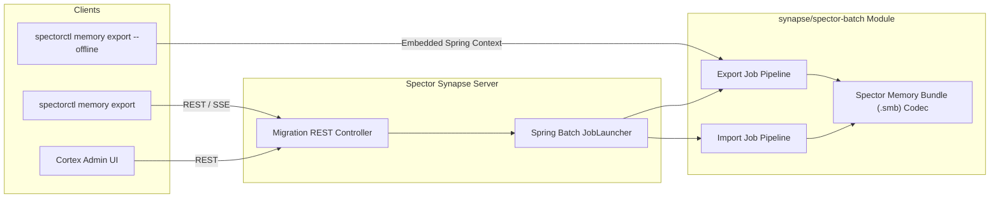

# ADR-0006-B: Spector Memory Import & Export Pipeline

| Field | Value |
|:---|:---|
| **Status** | Accepted (Implemented) |
| **Date** | 2026-08-13 |
| **Authors** | Spector Maintainers & Architecture Working Group |
| **Deciders** | Spector Technical Steering Committee (TSC) |
| **Supersedes** | None |
| **Superseded By** | None |
| **Last Verified** | 2026-09-16 (Verified against `main`) |

---

- **Status**: Accepted
- **Date**: 2026-08-13
- **Authors**: Technical Lead, Architecture Working Group (Systems Architecture)
- **Deciders**: Project Lead (Bharat), Technical Lead, @titan
- **Target Module**: `synapse/spector-batch`, `synapse/spector-synapse`, `synapse/spector-cli`

---

## 1. Context & Problem Statement

Spector Memory stores complex cognitive state, including:
- Memory text contents, tags, key-values, metadata, salience scores, decay values, importance estimates
- High-dimensional vector embeddings (HNSW indices & raw float arrays)
- Cognitive hypergraphs (entities, hyperedges, Hebbian synapse weights)
- Biological subsystem states (Hippocampus, Amygdala, Insula, Dopamine levels)
- Encrypted storage partition keys, headers, and transactional WAL files

As Spector Memory evolves, schemas, index layouts, vector dimensions, and biological model configurations change across releases (e.g. V1.0.0 to V2.0.0). To enable zero-downtime migrations, disaster recovery, cloud backups, and offline data transfer, Spector requires a high-throughput, chunk-oriented **Import & Export Pipeline**.

Per Project Lead feedback:
1. The batch module must reside in **`synapse/spector-batch`**.
2. Exports MUST be comprehensive, capturing ALL memory text, tags, key-values, hypergraph edges, vectors, keys, and biological states.

Key constraints & requirements:
1. **High Volume & Memory Efficiency**: Processing millions of vectors and memory nodes must not cause JVM Out-Of-Memory (OOM) errors. Chunking and streaming are required.
2. **Multi-Interface Access**: Pipelines must be runnable via **Synapse REST/gRPC APIs** (for live online backups) and via **CLI (`spectorctl`)** (for offline maintenance, air-gapped restores, and scripted administration).
3. **Execution Integrity**: Operations must support progress monitoring, checkpointing, cancellation, and partial resume on failure.
4. **CLI Responsiveness**: Routine CLI usage (`spectorctl status`, `spectorctl version`) must remain sub-100ms and must not pay a 2–3s Spring Boot startup penalty.

---

## 2. Decision

### 2.1 Spring Batch Engine Location & Scoping
We will locate the batch engine in **`synapse/spector-batch`**.

- **Chunk Processing**: `ItemReader`, `ItemProcessor`, and `ItemWriter` abstractions stream nodes, memory texts, tags, vectors, and graph edges in configurable chunk sizes (default 1,000 items/chunk).
- **Execution Persistence**: `JobRepository` backed by H2 (in-memory or file-based for CLI) or Spring JDBC tracks job step progress, execution parameters, and failure checkpoints.

### 2.2 Dual-Mode CLI Architecture (Picocli + Spring Boot Integration)
We adopt a **Dual-Mode CLI Architecture**:

1. **Online Mode (Default)**:
   - `spectorctl memory export` connects to `spector-synapse` REST API (`/api/v1/migration/export`).
   - Synapse executes the Spring Batch job asynchronously.
   - `spectorctl` streams progress via Server-Sent Events (SSE) or polls job execution status. Startup time remains <100ms.
2. **Offline / Standalone Mode (`--offline`)**:
   - `spectorctl memory export --offline` launches an embedded Spring Batch context directly inside the CLI using `picocli-spring-boot-starter`.
   - Used for air-gapped environments or emergency disaster recovery when Synapse is down.

### 2.3 Spector Memory Bundle (`.smb`) Comprehensive Container Format
Exports will be archived into a compressed `.smb` (`tar.zst`) bundle:
- `manifest.json`: Schema version, entity count, vector dimensions, partition maps, CRC32 checksums.
- `nodes/chunk-*.jsonl.zst`: Full memory items (node IDs, text, tags, key-values, salience, importance, decay).
- `vectors/vectors-*.bin`: Raw float arrays and vector index metadata.
- `graph/edges.jsonl.zst`: Full hypergraph connections, relation attributes, and Hebbian weights.
- `subsystems/state.json`: Biological subsystem parameters (Hippocampus, Amygdala, Insula, Dopamine levels).
- `security/keys.json`: Encryption key references & header metadata.

---

## 3. System Topology & Data Flow

---

## 4. Consequences & Trade-Offs

### Positive
- **Scalability**: Chunked streaming prevents OOM when exporting/importing gigabytes of vector & graph data.
- **Completeness**: Guarantees zero data loss across migrations (texts, tags, graphs, vectors, keys).
- **Fast CLI UX**: Online CLI commands launch instantly (<100ms) by delegating heavy lifting to Synapse REST API.
- **Clean Subsystem Organization**: `synapse/spector-batch` centralizes batch jobs alongside Synapse runtime components.
