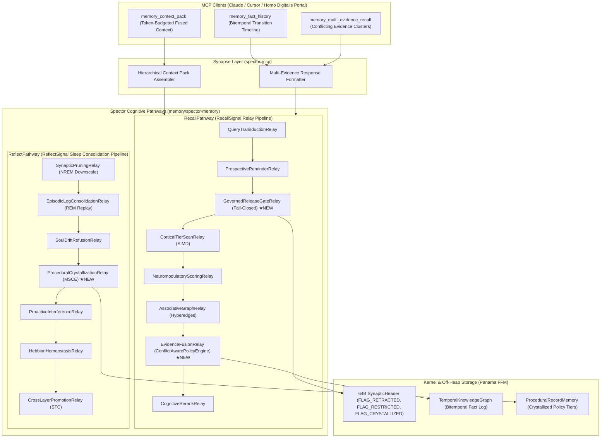
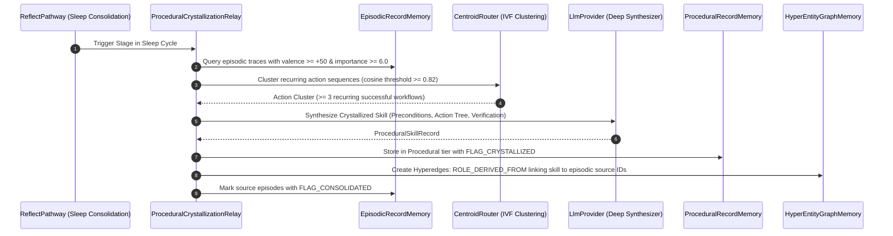

# ADR-0008: Cognitive Substrate Evolution (TANGLE, GPM, MSCE)

| Field | Value |
|:---|:---|
| **Status** | Accepted (Implemented) |
| **Date** | 2026-08-20 |
| **Authors** | Spector Maintainers & Architecture Working Group |
| **Deciders** | Spector Technical Steering Committee (TSC) |
| **Supersedes** | None |
| **Superseded By** | None |
| **Last Verified** | 2026-09-16 (Verified against `main`) |

---

**Document ID**: `ADR-2026-008`  
**Status**: `PROPOSED`  
**Authors**: Architecture Working Group (Systems Architecture), Technical Lead (CTO & Chief Technical Officer)  
**Stakeholder**: Bharat (CEO)  
**Target Repositories**: [`spectrayan/spector`](https://github.com/spectrayan/spector), [`spectrayan/homo-digitalis`](https://github.com/spectrayan/homo-digitalis)  
**Related Documents**: `RnD/features-08-21-2026.md` (`features-08-21-2026.md`), `RnD/deep-research-grok-features-homo-digitalis-2026-08-21.md` (`deep-research-grok-features-homo-digitalis-2026-08-21.md`), `RnD/homo-digitalis-consciousness-continuity-architecture.md` (`homo-digitalis-consciousness-continuity-architecture.md`)

---

## 1. Context and Architectural Evolution

Spector Memory has recently transitioned its internal execution engines to the **Composable Cognitive Pathway & Synaptic Relay Framework** ([`RecallPathway`](file:///d:/git/spector/memory/spector-memory/src/main/java/com/spectrayan/spector/memory/RecallPathway.java), [`RememberPathway`](file:///d:/git/spector/memory/spector-memory/src/main/java/com/spectrayan/spector/memory/RememberPathway.java), and [`ReflectPathway`](file:///d:/git/spector/memory/spector-memory/src/main/java/com/spectrayan/spector/memory/ReflectPathway.java)). The legacy monolithic `RecallPipeline` and standalone `ReflectDaemon` have been fully superseded by dynamic, observable multi-relay pipelines.

For autonomous agents and digital persona continuity systems (**Homo Digitalis**), existing memory engines in the AI industry suffer from four fatal flaws:

1. **Forced-Monotonicity & Flattening of Contradictions:** Commodity vector databases and RAG frameworks force a single "winner" or overwrite historical facts upon collision. A human being's worldview, moral positions, and habits evolve non-linearly across decades (e.g. youthful ambition vs. elder contentment). Forcing a single fact destroys the nuanced temporal arc of identity.
2. **Ungoverned Persistent Leaks & Lack of Provenance:** Memories stored in vector databases lack source-bound provenance and fail-closed release gates. Retracted claims, unverified third-party gossip, or sealed confidential journals can be resurrected during recall, violating posthumous consent and grief boundaries.
3. **Absence of Procedural Habit Learning:** Existing systems treat procedural memory as static prompt strings or hardcoded tool definitions. They lack a biological Basal Ganglia mechanism that observes successful episodic actions and crystallizes them into executable behavioral heuristics and decision reflexes.
4. **Context Assembly Latency & Fragmentation:** MCP memory clients must perform 3–5 round-trip network/tool calls over HTTP to fetch episodic, semantic, graph, and working memory, incurring 150–400ms latency. Real-time voice-to-voice intergenerational dialogue requires total recall assembly under 5ms.

This ADR defines the end-to-end architecture across **Spector Cognitive Pathways** (`memory/spector-memory`) and **Spector MCP Server** (`synapse/spector-mcp`) to resolve all four flaws.

---

## 2. Decision Summary & Pathway Architecture

We will integrate the four capabilities directly into the **Cognitive Pathway & Synaptic Relay Framework**:



> **Note:** Both pathway diagrams above are simplified to highlight new relays (★NEW). The full `RecallPathway` contains 14 relays (see [`RecallPathwayFactory.java`](file:///d:/git/spector/memory/spector-memory/src/main/java/com/spectrayan/spector/memory/recall/relay/RecallPathwayFactory.java)); the full `ReflectPathway` contains 10 relays (see [`ReflectPathwayFactory.java`](file:///d:/git/spector/memory/spector-memory/src/main/java/com/spectrayan/spector/memory/reflect/relay/ReflectPathwayFactory.java)).

---

## 3. Detailed Architectural Specifications

### 3.1 Decision 1: Multi-Evidence Reconstruction & Conflict-Aware Action Policy (TANGLE)

#### Component Design: `ConflictAwarePolicyEngine` & `EvidenceFusionRelay`
Integrated into [`RecallPathway`](file:///d:/git/spector/memory/spector-memory/src/main/java/com/spectrayan/spector/memory/RecallPathway.java), the engine calculates the **Epistemic Entropy** of conflicting claims across bitemporal valid-time intervals.

1. **Evidence Grouping**: For a queried entity or predicate relation, inspect active, superseded, and asserted facts in `TemporalKnowledgeGraph`.
2. **Entropy & Conflict Classification**:
   - `SUPERSEDED_TEMPORAL`: Direct factual transition where $t_{\text{valid\_to}}(F_1) \le t_{\text{valid\_from}}(F_2)$ with explicit temporal boundary.
   - `CONTEXT_PARTITIONED`: Conflicting facts bound to distinct domain tags or interpersonal contexts (e.g. `work` vs `family`).
   - `IRREDUCIBLE_CONTRADICTION`: Conflicting facts sharing temporal and contextual boundaries with overlapping confidence $|\text{Conf}(F_1) - \text{Conf}(F_2)| < \delta_{\text{ambiguity}}$.
3. **Action Policy Assignment**:
   - `PRESENT_ALTERNATIVES`: Return full timeline distribution.
   - `ASK_CLARIFYING_QUESTION`: Return formulated clarifying prompt when confidence entropy is high.
   - `ABSTAIN`: When all evidence confidence falls below the reliability threshold $\theta_{\text{min}}$.

```java
public record EvidenceDistribution(
    String subject,
    String predicate,
    FactSnapshot activeConsensusFact,
    List<FactSnapshot> competingHypotheses,
    ConflictType conflictType,
    ConflictActionPolicy recommendedPolicy,
    String clarificationPrompt
) {}

public enum ConflictType {
    NONE,
    SUPERSEDED_TEMPORAL,
    CONTEXT_PARTITIONED,
    IRREDUCIBLE_CONTRADICTION,
    UNDERDETERMINED
}

public enum ConflictActionPolicy {
    ACCEPT_WINNER,
    PRESENT_ALTERNATIVES,
    ASK_CLARIFYING_QUESTION,
    ABSTAIN
}
```

---

### 3.2 Decision 2: Governed Persistent Memory (GPM) with Fail-Closed Claims

#### Off-Heap Header Extensions
In [`SynapticHeaderConstants.java`](file:///d:/git/spector/memory/spector-memory/src/main/java/com/spectrayan/spector/memory/kernel/layout/SynapticHeaderConstants.java), we utilize the consolidation & governance flags byte (offset 34) and reserved padding (offset 61-63):

```
Offset 34 (Consolidation & Governance Flags — renamed from "Consolidation Flags"):
  bit 0: FLAG_CONTRADICTED     (0x01) — Contradicted loser fact [existing]
  bit 1: FLAG_RETRACTED        (0x02) — Legally / explicitly expunged (fail-closed)
  bit 2: FLAG_UNVERIFIED       (0x04) — Ingested from untrusted source (trust < 0.5)
  bit 3: FLAG_RESTRICTED       (0x08) — RBAC / grief / posthumous sealed claim
  bit 4: FLAG_CRYSTALLIZED     (0x10) — Synthesized procedural skill record
  bits 5-7: reserved for future use
```

> **Rationale for co-locating governance flags at offset 34:** The entire 64B header occupies a single cache line, so reading offset 34 has zero additional cost once the line is loaded (which always happens because offset 1 `flags` is the first hot-path check). Using the existing byte avoids expanding header size or consuming the 3 reserved padding bytes at offset 61-63, which remain available for future header version upgrades.

#### Fail-Closed Pathway Relay: `GovernedReleaseGateRelay`
Inside [`RecallPathway`](file:///d:/git/spector/memory/spector-memory/src/main/java/com/spectrayan/spector/memory/RecallPathway.java), candidate records are screened by `GovernedReleaseGateRelay` after `ProspectiveReminderRelay` and before `CorticalTierScanRelay` (i.e., governance gating occurs before any vector/SIMD scoring):
```java
public final class GovernedReleaseGateRelay implements SynapticRelay<RecallSignal> {
    @Override
    public RelayResult execute(RecallSignal signal) {
        // Phase 1c: Screen records against off-heap retraction & RBAC flags
        var iterator = signal.candidateIterator();
        while (iterator.hasNext()) {
            var candidate = iterator.next();
            byte govFlags = candidate.segment().get(ValueLayout.JAVA_BYTE, candidate.offset() + OFFSET_CONSOLIDATION_FLAGS);
            if ((govFlags & FLAG_RETRACTED) != 0) {
                iterator.remove(); // Fail-closed drop
                continue;
            }
            if ((govFlags & FLAG_RESTRICTED) != 0 && !signal.hasAccess(candidate)) {
                signal.auditLogger().logAccessDenied(candidate.id(), signal.agentId(), "RBAC_RESTRICTED");
                iterator.remove(); // Fail-closed drop
            }
        }
        return RelayResult.CONTINUE;
    }
}
```

---

### 3.3 Decision 3: Procedural Skill Crystallization from Episodic Traces (MSCE)

#### Algorithmic Flow in `ReflectPathway`
In [`ReflectPathway`](file:///d:/git/spector/memory/spector-memory/src/main/java/com/spectrayan/spector/memory/ReflectPathway.java), we add a dedicated `ProceduralCrystallizationRelay` between `SoulDriftRefusionRelay` and `ProactiveInterferenceRelay` (i.e., after soul axiom re-anchoring but before interference resolution):



#### Skill Record Layout in `ProceduralRecordMemory`
Each crystallized skill record contains:
- `Trigger Pattern Embedding`: Vector encoding of the problem/query that activates this heuristic.
- `Action Policy & Rules`: Executable or structured reasoning prompt template.
- `Reliability Score`: Initialized to $0.80$, modulated dynamically via `memory_reinforce(skillId, +/-valence)`.
- `Applicability Bounds`: Preconditions and forbidden contexts.

---

### 3.4 Decision 4: Zero-Latency In-Process Hierarchical Context Packs (MCP)

#### MCP Tool Contract: `memory_context_pack`
Single atomic call to retrieve an end-to-end fused context pack formatted directly for LLM context windows.

```json
{
  "name": "memory_context_pack",
  "description": "Sub-millisecond hierarchical memory context pack assembly fusing Working, Episodic, Semantic, Procedural, and Graph context within a strict token budget. Essential for real-time persona dialogue and high-throughput agent execution.",
  "parameters": {
    "type": "object",
    "properties": {
      "query": { "type": "string", "description": "Active conversational turn or task prompt" },
      "token_budget": { "type": "integer", "default": 3000, "description": "Maximum token budget for assembled memory" },
      "profile": { "type": "string", "default": "BALANCED", "description": "Cognitive profile preset (e.g. BALANCED, RECALLING, THE_EXECUTOR)" },
      "persona_id": { "type": "string", "description": "Persona identifier for sovereign RBAC and identity gating" },
      "as_of": { "type": "string", "description": "ISO-8601 timestamp for temporal projection" },
      "conflict_mode": { "type": "string", "enum": ["MULTI_EVIDENCE", "HIGHEST_CONFIDENCE", "FAIL_CLOSED"], "default": "MULTI_EVIDENCE" }
    },
    "required": ["query"]
  }
}
```

#### Assembled Context Pack Structure
```markdown
# === SPECTOR COGNITIVE CONTEXT PACK ===
## 1. ACTIVE WORKING INTENT & SCRATCHPAD
- [Turn State]: Goal: Discuss 2026 startup founding risks with granddaughter Maya.

## 2. PROCEDURAL HEURISTICS & INTERACTION CADENCE (Basal Ganglia)
- [Skill #P-882]: "Mentoring young family members on high-uncertainty career choices"
  - Policy: Validate anxiety first -> Relate personal failure in 2026 -> Highlight learning over status.
  - Reliability: 0.94 | Valence: +85 (Warmth/Empathy)

## 3. CORE SEMANTIC FACTS & MORAL AXIOMS (Neocortex)
- [Fact #S-104]: Founded first deep-tech lab in Austin, June 2026.
- [Axiom #S-019]: "Regret of inaction compounds faster than pain of failure." (Strength: 9.8)

## 4. CHRONO-EPISODIC MEMORIES & ANECDOTES (Hippocampus)
- [Episode #E-9421 (2026-03-12)]: Kitchen table discussion; calculating 8-month savings runway with spouse; overwhelming fear paired with stubborn optimism.

## 5. MULTI-EVIDENCE TRANSITIONS & CONFLICTS
- [Belief Transition #T-082]: Career Focus
  - Age 25-38: "Relentless 80-hour sprint is the only path to mastery."
  - Age 48+: "Sustainable energy and deep family connection outperform manic overwork."
```

---

## 4. Consequences and Trade-offs

### Positive
- **Native Alignment with Spector Pathways:** Directly leverages `RecallPathway` and `ReflectPathway` composable relays with zero legacy pipeline coupling.
- **Complete Elimination of Persona Flattening:** Preserves lifelong human growth, phase transitions, and moral nuances for *Homo Digitalis*.
- **Sub-5ms End-to-End Context Assembly:** Enables fluid, natural real-time voice-to-voice seances.
- **Enterprise-Grade Provenance & GDPR Compliance:** Zero unauthorized memory resurrection or data leakage.
- **Zero-GC & Off-Heap Safety:** Built natively on Java 25 Panama `MemorySegment` and AVX-512 SIMD.

### Negative & Mitigations
- **ReflectPathway Stage Duration:** Mining episodic chains for procedural skills requires LLM synthesis during sleep consolidation.
  - *Mitigation:* Relayed with `ErrorPolicy.DEGRADE_GRACEFULLY` and triggered only on dense, high-valence clusters ($\ge 3$ traces, $\text{valence} \ge +50$).
- **Context Pack Token Overhead:** Hierarchical packs could exceed budget if unconstrained.
  - *Mitigation:* Strict greedy knapsack allocation based on SIMD fused score: Working ($20\%$) $\to$ Procedural ($25\%$) $\to$ Semantic ($30\%$) $\to$ Episodic ($25\%$).

---

## 5. Alternatives Considered

| Alternative | Pros | Cons | Rejection Rationale |
|:---|:---|:---|:---|
| **1. Standard Graph-RAG (Cognee / Mem0 approach)** | Uses off-the-shelf Python libraries (NetworkX, LanceDB). | 50–500ms multi-DB query latency, high GC pressure, forces winner fact. | Unacceptable for sub-200ms real-time voice seance; destroys temporal nuance. |
| **2. Client-Side Context Fusion** | Keeps Spector MCP tools atomic and minimal. | Client must make 4–5 sequential tool calls over network; fragmented prompt formatting. | High latency tax (150–400ms); unreliable prompt structuring across different LLMs. |
| **3. Static Tool-Use for Procedural Memory** | Simple to configure; hardcoded in Python/JSON. | Cannot learn or evolve from live agent experience; cannot capture personal human reflexes. | Fails the core requirement of digital persona replication (Dimension 7 & 8). |

---

## 6. Implementation Phasing & Work Breakdown

| Phase | Milestone | Primary Modules | Estimated Duration | Lead |
|:---|:---|:---|:---|:---|
| **Phase 1** | Zero-Latency MCP Context Packs & Multi-Evidence Tools | `synapse/spector-mcp`, `memory/spector-memory` | 1.5 Sprints | @forge, @titan |
| **Phase 2** | GovernedReleaseGateRelay (GPM) & EvidenceFusionRelay (TANGLE) in `RecallPathway` | `memory/spector-memory`, `nucleus/spector-storage` | 2 Sprints | @titan, @sentinel |
| **Phase 3** | ProceduralCrystallizationRelay (MSCE) in `ReflectPathway` | `memory/spector-memory` | 2.5 Sprints | @titan, @forge |

---

*Approved by Technical Lead & Architecture Working Group (Systems Architecture) — Spectrayan Neural Directorate.*
