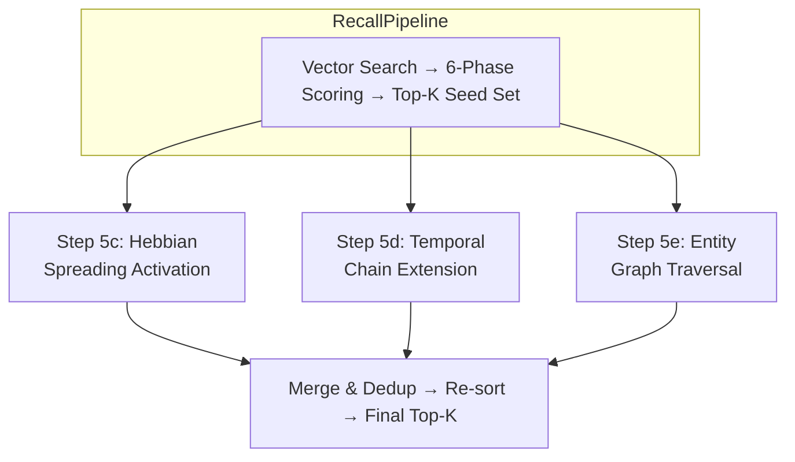
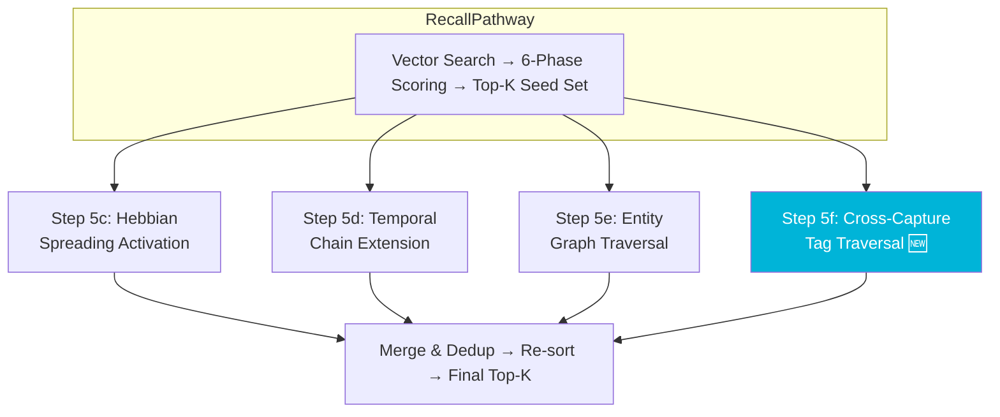

# ADR-0009-RND: Cross-Capture Graph & CoActivation Kernel

| Field | Value |
|:---|:---|
| **Status** | Accepted (Implemented) |
| **Date** | 2026-08-23 |
| **Authors** | Spector Maintainers & Architecture Working Group |
| **Deciders** | Spector Technical Steering Committee (TSC) |
| **Supersedes** | None |
| **Superseded By** | None |
| **Last Verified** | 2026-09-16 (Verified against `main`) |

---

**Document ID**: `RND-2026-011`
**Date**: 2026-08-23
**Authors**: Technical Lead, Architecture Working Group (Systems Architecture)
**Status**: Approved
**ADR**: [ADR-0009](0009-RND-011-cross-capture-graph-coactivation-kernel.md)
**GitHub Issues**: [#449](https://github.com/spectrayan/spector/issues/449), New (Cross-Capture Graph)

---

## 1. Overview

This design combines two related efforts into a single coherent workstream:

1. **Cross-Capture Graph** — A new (4th) cognitive graph layer enabling tag co-occurrence traversal during recall, inspired by Synaptic Tagging and Capture (STC) neuroscience
2. **CoActivation Kernel Honesty** — Giving `CoActivationRecordMemory` an honest `MemoryShape.HASHTABLE` instead of the `stride=1` hack (#449)

Both converge on `CoActivationRecordMemory` and should be implemented together to avoid double-migration.

---

## 2. Architecture Context

### 2.1 Current 3-Layer Cognitive Graph



### 2.2 Proposed 4-Layer Cognitive Graph



---

## 3. Component Design

### 3.1 MemoryShape.HASHTABLE (New Shape)

**File**: `com.spectrayan.spector.memory.kernel.MemoryShape`

```java
// Append HASHTABLE at ordinal 8 (after INSULAR at 7)
HASHTABLE  // 8: Compound open-addressing hash-table stores
```

**Rationale**: `CoActivationRecordMemory` is not a record array — it's a compound structure of two open-addressing hash tables. `MemoryShape.RECORD` is semantically wrong. A dedicated shape honestly describes the on-disk format.

### 3.2 AbstractHashTableMemory<L>

**New file**: `com.spectrayan.spector.memory.kernel.shape.AbstractHashTableMemory<L>`

A new base class for hash-table-backed memory stores:

```java
public abstract class AbstractHashTableMemory<L extends MemoryLayout>
        extends AbstractMemory<L> {

    @Override
    public final MemoryShape shape() {
        return MemoryShape.HASHTABLE;
    }

    /**
     * Returns a sub-slice of the data region for the table at the given index.
     * Index 0 = pair table, Index 1 = edge table (for CoActivation).
     */
    protected MemorySegment tableSegment(int tableIndex, long offset, long size) {
        return segment().asSlice(dataOffset() + offset, size);
    }
}
```

### 3.3 CoActivationLayout v3

**File**: `com.spectrayan.spector.memory.kernel.layout.CoActivationLayout`

Promote from stub to real descriptor:

```java
public final class CoActivationLayout implements MemoryLayout {
    private static final int LAYOUT_ID = 0x434F4158; // 'COAX'
    private static final int VERSION = 3;

    // Sub-table dimensions (bytes per slot)
    public static final int SUB_HEADER_BYTES = 8;    // pairCap(4B) + edgeCap(4B)
    public static final int PAIR_SLOT_BYTES  = 32;   // hashA(8) + hashB(8) + count(4) + flags(4) + pad(8)
    public static final int EDGE_SLOT_BYTES  = 40;   // src(8) + tgt(8) + weight(4) + pad(4) + lastMs(8) + actCnt(4) + flags(4)

    @Override public int layoutId()      { return LAYOUT_ID; }
    @Override public int schemaVersion() { return VERSION; }
    @Override public int recordStride()  { return 1; }  // Preserved for header compat
    @Override public boolean crcEnabled() { return false; }
    @Override public String name()       { return "CoActivationLayout"; }

    // ── Sub-table offset computation ──

    public int pairTableOffset() {
        return SUB_HEADER_BYTES;
    }

    public int edgeTableOffset(int pairCapacity) {
        return SUB_HEADER_BYTES + pairCapacity * PAIR_SLOT_BYTES;
    }

    public int totalDataBytes(int pairCapacity, int edgeCapacity) {
        return SUB_HEADER_BYTES
             + pairCapacity * PAIR_SLOT_BYTES
             + edgeCapacity * EDGE_SLOT_BYTES;
    }
}
```

### 3.4 CoActivationRecordMemory Refactor

**File**: `com.spectrayan.spector.memory.hebbian.CoActivationRecordMemory`

Key changes:

```
BEFORE: extends AbstractRecordMemory<CoActivationLayout>
AFTER:  extends AbstractHashTableMemory<CoActivationLayout>
```

- Remove all inherited `read(recordId, ...)` / `write(recordId, ...)` calls (none are used)
- Hardcoded offset calculations (`MemoryHeader.HEADER_BYTES + 8 + 32*pairCap + 40*edgeCap`) → delegate to `CoActivationLayout.edgeTableOffset(pairCap)` etc.
- Save/load writes `MemoryShape.HASHTABLE` ordinal into header instead of `MemoryShape.RECORD`

### 3.5 Cross-Capture Graph — Tag → Memory Inverted Index

**New structure within CoActivationRecordMemory**:

```java
/**
 * In-memory inverted index: tag hash → set of memory slot indices.
 * Populated during ingestion (RememberPathway) and rebuilt during
 * ReflectPathway consolidation cycles.
 *
 * Memory budget: ~2-5 MB at 100K memories with avg 8 tags each.
 */
private final ConcurrentHashMap<Long, IntArrayList> tagToMemoryIndex = new ConcurrentHashMap<>();
```

**Methods**:

```java
/** Record that memory at slotIndex carries this tag. */
public void indexMemoryTag(long tagHash, int slotIndex);

/** Remove a memory from the index (tombstoned/pruned). */
public void deindexMemory(int slotIndex);

/** Find top-N co-occurring tags for the given tag. */
public List<TagNeighbor> traverseRelatedTags(long tagHash, int maxNeighbors);

/** Find memory slot indices carrying the given tag. */
public int[] findMemoriesByTag(long tagHash, int limit);

/** Cross-capture traversal: from query tags, find related tags, then memories. */
public List<CrossCaptureCandidate> crossCaptureTraversal(
        Collection<String> queryTags, int maxTagNeighbors, int maxMemories);
```

**Record types**:

```java
public record TagNeighbor(long tagHash, String tagName, int coOccurrenceCount, float stdpWeight) {}

public record CrossCaptureCandidate(int memorySlotIndex, String viaTag, float score) {}
```

### 3.6 Recall Pipeline Integration — Step 5f

**File**: `RecallPathway` (or `RecallPipeline` legacy)

After Step 5e (Entity Graph Traversal), add:

```java
// Step 5f: Cross-Capture Tag Graph Traversal
if (coActivation != null && queryTags != null && !queryTags.isEmpty()) {
    List<CrossCaptureCandidate> tagCandidates = coActivation.crossCaptureTraversal(
            queryTags,
            /* maxTagNeighbors */ 5,
            /* maxMemoriesPerTag */ 10
    );
    for (CrossCaptureCandidate candidate : tagCandidates) {
        if (!resultSet.contains(candidate.memorySlotIndex())) {
            float attenuatedScore = candidate.score() * CROSS_CAPTURE_ATTENUATION;
            if (attenuatedScore >= graphExpansionThreshold) {
                resultSet.add(candidate.memorySlotIndex(), attenuatedScore);
            }
        }
    }
}
```

**Constants**:
- `CROSS_CAPTURE_ATTENUATION = 0.25f` (same order as entity graph, intentionally conservative to start)
- `CROSS_CAPTURE_FAN_FACTOR = 1/√(tagDegree)` (ACT-R spreading activation dilution)

### 3.7 Ingestion Integration — RememberPathway

During `SynapticTagTransductionRelay` (or after it), add the inverted index update:

```java
// After synaptic tag encoding, index each tag for Cross-Capture Graph
for (String tag : extractedTags) {
    long tagHash = hashTag(tag);
    coActivation.indexMemoryTag(tagHash, memorySlotIndex);
}
```

---

## 4. Migration Strategy

### 4.1 On-Disk Format Detection

```
Read MemoryHeader → check shape ordinal:
  - ordinal 0 (RECORD) + layoutId 0x434F4158 → legacy CoActivation v2
  - ordinal 8 (HASHTABLE) + layoutId 0x434F4158 → new CoActivation v3
```

### 4.2 v2 → v3 Migration

1. Read v2 data (pair table + edge table) using existing `migrateLegacy()` flow
2. Rebuild inverted index from scratch by scanning all memory headers for their synaptic tags
3. Write v3 with `MemoryShape.HASHTABLE` + `schemaVersion=3`

### 4.3 Golden-File Testing

Before any code changes:
1. Capture a snapshot of the current `coactivation.dat` binary from production data
2. Write a test that loads this golden file and asserts all pair/edge data is preserved
3. Write a test that loads the golden file through the v2→v3 migration path and asserts identical data

---

## 5. Performance Budget

| Operation | Target | Basis |
|:---|:---|:---|
| Tag lookup (inverted index) | < 1 µs | ConcurrentHashMap.get() |
| Co-occurrence top-N query | < 50 µs | OffHeapPairTable scan, N=5 |
| Cross-Capture traversal (5 tags × 5 neighbors × 10 memories) | < 500 µs | 250 memory lookups |
| Memory overhead (inverted index) | 2-5 MB at 100K memories | ~800K entries × 8B avg |
| Ingestion overhead (index update) | < 10 µs per memory | 8 tags × ConcurrentHashMap.put() |

---

## 6. Inverted Index Maintenance

| Event | Action |
|:---|:---|
| **Ingestion** (RememberPathway) | Add memory to index for each tag |
| **Tombstone** (delete/prune) | Remove memory from index for each tag |
| **Reflect cycle** (ReflectPathway) | Full index rebuild from scanning all live memory headers |
| **Checkpoint** | Persist inverted index to bundle CHECKPOINT region |
| **Startup** | Rebuild from memory headers (or load from checkpoint) |

---

## 7. File Inventory

### Modified Files

| File | Change |
|:---|:---|
| `MemoryShape.java` | Add `HASHTABLE` at ordinal 8 |
| `CoActivationLayout.java` | Promote to real descriptor (v3), add sub-table offset methods |
| `CoActivationRecordMemory.java` | Change base class, add inverted index, add traversal methods, update save/load |
| `RecallPathway.java` (or `RecallPipeline.java`) | Add Step 5f: Cross-Capture traversal |
| `RememberPathway.java` / `SynapticTagTransductionRelay.java` | Index memory tags during ingestion |
| `CognitiveGraphFacade.java` | Expose Cross-Capture traversal to higher layers |
| `CognitiveGraphBuilder.java` | Wire CoActivation traversal into graph build |
| `CheckpointDaemon.java` | Persist inverted index during checkpoint |

### New Files

| File | Purpose |
|:---|:---|
| `AbstractHashTableMemory.java` | New kernel base class for hash-table-backed stores |
| `CrossCaptureTraversalTest.java` | Property-based tests for tag graph traversal |
| `CoActivationMigrationV3Test.java` | Golden-file migration test |

---

## 8. Neuroscience Reference

This design is grounded in peer-reviewed neuroscience:

| Mechanism | Biological Basis | Spector Implementation |
|:---|:---|:---|
| **Cross-Tagging** (Sajikumar & Frey, 2004) | Tagged synapses on the same neuron share PRPs across pathways | `OffHeapPairTable` co-occurrence edges traversed during recall |
| **Memory Co-allocation** (Cai et al., 2016) | Temporally proximate events co-allocated to overlapping neuronal populations | Tag → Memory inverted index finds memories sharing tags |
| **Dendritic Clustering** (Govindarajan et al., 2006) | Co-tagged synapses cluster on dendrites for efficient PRP sharing | Co-occurrence count as edge weight prioritizes strongly clustered tags |
| **STDP Prediction** (Bi & Poo, 1998) | Spike-timing dependent plasticity creates directed predictive associations | `OffHeapEdgeTable` STDP directed edges |
| **ACT-R Spreading Activation** (Anderson, 1993) | Activation spreads inversely proportional to fan-out | `1/√(degree)` fan-factor attenuation on high-degree tags |
