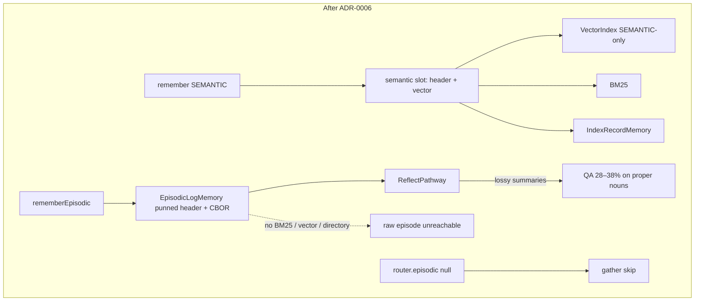
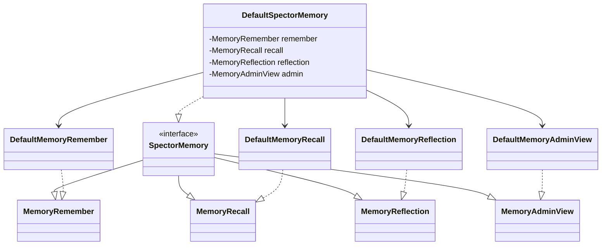
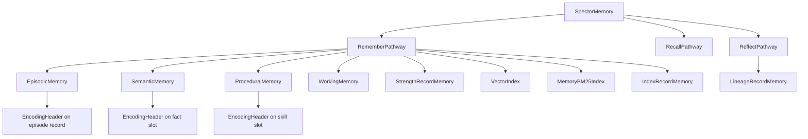
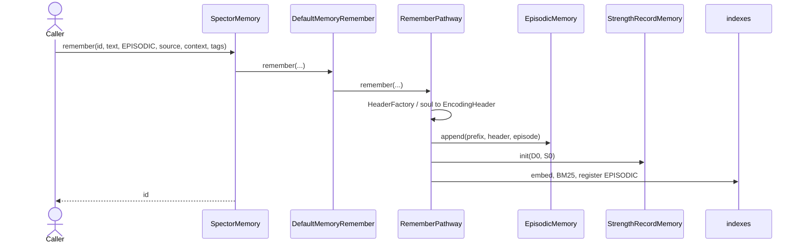
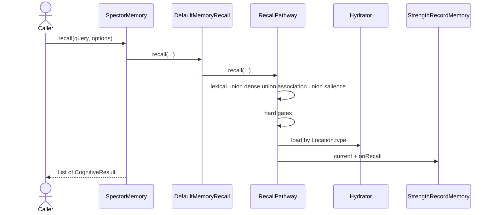
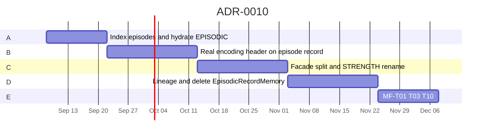

# ADR-0010: Single Engram, Four Stores Storage Architecture

| Field | Value |
|:---|:---|
| **Status** | Accepted (Implemented) |
| **Date** | 2026-09-03 |
| **Authors** | Spector Maintainers & Architecture Working Group |
| **Deciders** | Spector Technical Steering Committee (TSC) |
| **Supersedes** | None |
| **Superseded By** | None |
| **Last Verified** | 2026-09-16 (Verified against `main`) |

---

**One identity per memory. Four tier stores. Encoding header on the record. Strength in its own region. No second write universe.**

---

## 1. Decision

1. Treat every durable memory as one **engram**: id + `MemoryType` + encoding header + payload + location. Faces (text, vector, strength, associations) are projections of that id. They must not be independently authoritative (MF-001 NF0 / M1).
2. Keep **four stores**, one payload schema each. Do **not** put facts and skills in the conversation file.
   - `EpisodicMemory` — episodes (rename of `EpisodicLogMemory`)
   - `SemanticMemory` — facts
   - `ProceduralMemory` — skills
   - `WorkingMemory` — evictable thoughts
3. Place the **encoding header** on the record itself (episode prefix or fact/skill slot). Do not invent `HEADER_SLAB` as a source of truth. A derived header scan file is allowed later if walks show up in p99.
4. Keep **strength** (`D`, `S`, use counts) off the episode record. Rename `RegionId.AUDIT` → `RegionId.STRENGTH` (keep numeric id 4) and `AuditRecordMemory` → `StrengthRecordMemory`.
5. One write verb: `SpectorMemory.remember(..., MemoryType.EPISODIC, ...)`. `rememberEpisodic(...)` becomes a compatibility default that fills `IngestionContext` and calls the same `RememberPathway`.
6. Do **not** add `MemoryEngine`. Split `DefaultSpectorMemory` by **delegation** onto `DefaultMemoryRemember`, `DefaultMemoryRecall`, `DefaultMemoryReflection`, `DefaultMemoryAdminView`. Pathways stay the implementation; `RecallPipeline` stays deprecated.
7. Do **not** replace Panama with a document database. JSON/CBOR is the episode **payload codec**, not the query engine.

---

## 2. Why

ADR-0006 correctly introduced a variable-length conversation store. The cutover stopped halfway.



That is also an MF-001 miss: turns lack a real encoding header (NF6 / M3), HNSW can disagree with the episode store on existence (NF0 / M1), and cosine-only nomination cannot recover proper nouns (M2).

---

## 3. Alignment with MF-001

Physical layout is not the model (MF-001 §12). This ADR is a realization of the algebra on the existing substrate.

| MF-001 | Realization |
|---|---|
| \(T = (\mathrm{id},\ \mathrm{tier},\ \mathrm{payload},\ \mathrm{header},\ \mathrm{loc})\) | `MemoryId` + `MemoryType` + payload + `EncodingHeader` + `Location` |
| NF0 / M1 single engram | Existence = tier store and not tombstoned. Rebuild indexes from stores |
| NF1 / M3 header completeness | Encoding header on every durable record |
| NF2 / M8 lineage | `LineageRecordMemory` (or `PROVENANCE_LOG` if it already holds parents) |
| NF3 / M10 isolation | Unchanged: one partition + runtime bundle per rememberer |
| NF6 emotional completeness | Episodes get \(I\), valence, arousal at `remember` |
| NF7 source honesty | `source` on the encoding header; default recall gates `SIMULATED` |
| M2 guaranteed access | `RecallPathway` unions lexical, dense, association, salience |
| M4 physical independence | Callers use `SpectorMemory` / ids / `MemoryType`, never offsets |
| M5 tier physics | Four stores, same header type, distinct physics |
| M7 forgetting | `StrengthRecordMemory` holds \(D\)/\(S\); `forget` does not lower \(S\) |
| M9 reconsolidate | `RecallPathway` updates \(D\); payload rewrite only via reconsolidate + lineage |

Working memory remains NF6-exempt.

---

## 4. Public API — no new facade

```text
SpectorMemory
  extends MemoryRemember
  extends MemoryRecall
  extends MemoryReflection
  extends MemoryAdminView
```

```text
spectorMemory.remember(id, text, MemoryType.EPISODIC, source, context, tags);
spectorMemory.recall(query, options);
```

Role, session, sequence belong on `IngestionContext` / episode payload.



Java cannot extend two impl classes. `DefaultSpectorMemory` **delegates**. It owns cortex lifetime (stores, indexes, soul) and passes those into the four constructors. Callers still depend on `SpectorMemory`.

Pathways, not pipelines:

```text
MemoryRemember   → RememberPathway
MemoryRecall     → RecallPathway
MemoryReflection → ReflectPathway / DreamPathway
```

`RecallPipeline` remains deprecated.

---

## 5. Stores and header placement



### Episode record (header rides the store)

```text
+0    WalkPrefix         32B   id, time, payloadBytes, checksum
+32   EncodingHeader     64B   I, valence, arousal, tags, source, flags
+96   episode payload    N     codec-hidden (CBOR or packed)
next  = 96 + N
```

This is not a cognitive record (header + vector). The vector stays in the vector index / slab. Strength stays in `RegionId.STRENGTH`.

### Fact / skill slots

Keep fixed-stride packing inside `SemanticMemory` / `ProceduralMemory`. Encoding header at byte 0 of the slot. Inline vectors may remain until a later shared-slab pass.

### Accessors

| Store | Accessor | Address |
|---|---|---|
| `EpisodicMemory` | `EpisodicMemoryHeaderAccessor` | `recordOffset + WalkPrefix.SIZE` |
| `SemanticMemory` | `SemanticMemoryHeaderAccessor` | `slot * stride` |
| `ProceduralMemory` | `ProceduralMemoryHeaderAccessor` | `slot * stride` |

One `EncodingHeaderLayout` (today `HeaderLayout64` / V2). Javadoc on the accessors states the fields; javadoc on the store states that semantic payload is a fact and procedural payload is a skill.

No `HEADER_SLAB` region as the home of the header. Optional later: a derived scan projection rebuilt from episode records, same status as BM25.

---

## 6. Strength region

Today’s `RegionId.AUDIT` (id 4) + `AuditRecordMemory` is the strength face (ADR-0028): \(S\), \(D\), recall counts, last use, ACT-R.

| Today | This ADR |
|---|---|
| `RegionId.AUDIT` | `RegionId.STRENGTH` (id **4** unchanged) |
| `AuditRecordMemory` | `StrengthRecordMemory` |
| `AuditRecordLayout` | `StrengthRecordLayout` |

Encoding identity does not move here. `PROVENANCE_LOG` (26) stays a different region.

---

## 7. Lineage

`LineageRecordMemory`. Prefer existing `RegionId.PROVENANCE_LOG` if it already stores parent ids; otherwise add `RegionId.LINEAGE`.

`ReflectPathway` writes `MemoryType.SEMANTIC` + `MemorySource.DISTILLED` and a lineage row. Parent episodes stay recallable.

---

## 8. Write and recall





Hydration:

```text
EPISODIC    → EpisodicMemory.read(loc)
SEMANTIC    → SemanticMemory.read(loc)
PROCEDURAL  → ProceduralMemory.read(loc)
WORKING     → WorkingMemory.read(loc)
```

`DenseRelay` must not drop `type != SEMANTIC`. Never `semantic.readHeader(episodeOffset)`.

Salience over episodes walks `EncodingHeader` at `recordOffset + 32`. Arousal is not a cue filter; it only slows decay of \(D\).

---

## 9. Kernel impact

The kernel already has `RECORD`, `APPEND`, `GRAPH`, `BUNDLE`. This ADR changes contracts, not primitives.

**Keep:** `Memory`, `AbstractMemory`, SMKM `MemoryHeader`, `MemoryShape`, `MemoryId`, bundle machinery, `IdentityBundle`, `kernel.codec`, graph layouts, `IndexRecordMemory`.

**Change:**

| Type | Change |
|---|---|
| `RegionId` | Rename `AUDIT` → `STRENGTH`. Add `LINEAGE` only if provenance cannot hold parents. Do not put vectors in `EPISODIC` |
| `EpisodicLogMemory` | Rename `EpisodicMemory`. Append `WalkPrefix + EncodingHeader + payload` |
| `EpisodicLogLayout` / `EpisodicFieldAccessor` | Split into `WalkPrefix`, `EncodingHeaderLayout`, `EpisodeCodec`, `EpisodicMemoryHeaderAccessor` |
| `HeaderLayout64` / V2 | Become / wrap `EncodingHeaderLayout` |
| `CognitiveMemoryRouter` | Stop mapping `EPISODIC` to a nullable legacy slab. Expose the four stores |
| `PostIngestSync` | Body of `RememberPathway` after append; allow `EPISODIC` into vector + directory |
| `SemanticRecallStrategy` | Becomes a `DenseRelay` inside `RecallPathway`; type-aware hydrate |
| `TierScanStrategy` | Must not return on `episodic() == null` in log mode |
| `DefaultSpectorMemory` | Delegate to four ISP impls |

**Add:** `WalkPrefix`, `EpisodeCodec`, store-named header accessors, `StrengthRecordMemory` (rename), `LineageRecordMemory`, `DefaultMemoryRemember`, `DefaultMemoryRecall`, `DefaultMemoryReflection`, `DefaultMemoryAdminView`.

**Remove after dual-read:** `EpisodicRecordMemory`, production writes through punned `EpisodicFieldAccessor`, `offset/164` graphSlot fallbacks.

---

## 10. What this ADR rejects

- Mongo / Postgres / JSON as the SIMD record or the source of truth for \(D/S/I\)
- One shared file that stores facts and skills beside episodes
- `TraceKind` (TURN/FACT/SKILL) on the episode file
- `HEADER_SLAB` as an authoritative store
- Inlining episode vectors after variable payload
- Putting \(D\)/\(S\) on the episode record
- A new `MemoryEngine` interface
- `rememberEpisode(...)` as a second persistence universe
- Using `ReflectPathway` as search
- Shared BM25/HNSW across rememberers (M10 / MF-T10)

---

## 11. Phased cutover



| Phase | Work | Exit |
|---|---|---|
| **A** | `RememberPathway` for `EPISODIC`: decoded text to BM25, embed to vector index, `IndexRecordMemory.register(EPISODIC)`, write real \(I\)/valence/arousal. `RecallPathway` hydrates episodes from `EpisodicMemory`. Stop skipping log-mode partitions | Townsend / Vertex / Prentice raw-hit@15 before `reflect()` |
| **B** | New episodes: `WalkPrefix + EncodingHeader + payload`. `EpisodicFieldAccessor` read-only | No production punned writes |
| **C** | Split `DefaultSpectorMemory`. Rename `AUDIT` → `STRENGTH` | Facade is delegation-only; id 4 still maps |
| **D** | `LineageRecordMemory` on consolidate. Delete `EpisodicRecordMemory`. Kill `offset/164` | NF2/M8 green |
| **E** | MF-T01, T03, T10; source gate; monotonic \(S\) | Fixtures pass without flattening \(I\)/valence |

---

## 12. Risks

| Risk | Mitigation |
|---|---|
| Bundle rename of AUDIT | Enum name only; id 4 unchanged; codec accepts old logs |
| Dual-write latency | Same embed as today; extra copies, not extra embeds |
| Shared ANN mixes facts and episodes | Type-aware hydrate + over-fetch; split ANN only if p99 requires |
| Relays still call `episodic() == null` | Inventory `isEpisodicLogMode()` before deleting the legacy slab |
| Facade split misses a method | Generate delegates from `SpectorMemory`; parity test against current `DefaultSpectorMemory` |
| Benchmark inflation | Never ingest gold episodes as `SEMANTIC`-only; report hit@15 and QA separately |

---

## 13. Acceptance

- `remember(..., EPISODIC, ...)` writes episode payload, encoding header, strength row (\(D_0,S_0\)), and directory loc
- No encoding-header byte is used as role, session, token count, or body length
- `RecallPathway` nominates from at least lexical, dense, and salience
- `EPISODIC` hits hydrate from `EpisodicMemory`, not the semantic slot
- `ReflectPathway` writes distilled children with lineage and does not erase parents
- Dream/simulate cannot mint `source=experienced`
- `forget` does not decrease \(S\)
- `DefaultSpectorMemory` does not contain remember/recall scoring logic
- `EpisodicRecordMemory` has zero production callers before deletion
- MF-T01 / T03 / T10 run without flattening \(I\)/valence

---

## 14. First PR (Phase A)

1. `RememberPathway`: on `MemoryType.EPISODIC`, extract text, BM25, embed, `vectorIndex.add`, `IndexRecordMemory.register(EPISODIC)`.
2. Persist \(I\), valence, arousal on the episode (real header bytes, even if prefix is still transitional).
3. `RecallPathway` / dense relay: `loc.type == EPISODIC` → `EpisodicMemory.read` + header accessor.
4. Stop `return` when `router.episodic() == null` in log mode.
5. Benchmark: keyword queries hit raw episode text before `reflect()`.

Do not wait on the facade split, the STRENGTH rename, or `LineageRecordMemory` for Phase A.

---

## 15. Open questions

- Fact vectors stay inline in the semantic slot, or join a shared vector slab later?
- Lineage in `PROVENANCE_LOG` vs new `LINEAGE` region?
- Derived episode-header scan file only after measuring walk cost?
- How much of `SpectorMemoryAdmin` moves with `DefaultMemoryAdminView` in the same PR as the remember/recall split?

Physical design remains outside MF-001. This ADR succeeds if the algebra closes on `SpectorMemory` and a live episode cannot vanish because the first index was the wrong one.
