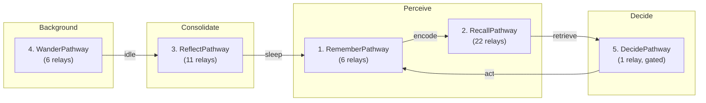

# ADR-0020-S: AISME Completeness Verification Report

| Field | Value |
|:---|:---|
| **Status** | Accepted (Implemented) |
| **Date** | 2026-08-23 |
| **Authors** | Spector Maintainers & Architecture Working Group |
| **Deciders** | Spector Technical Steering Committee (TSC) |
| **Supersedes** | None |
| **Superseded By** | None |
| **Last Verified** | 2026-09-16 (Verified against `main`) |

---

> **Audit Date**: 2026-08-22  
> **Auditor**: @forge (cross-referenced against original Grok gap analysis + Jarvis TSC Review)  
> **Verdict**: ✅ **AISME is fully implemented across all 11 phases**

---

## Phase-by-Phase Status

| Phase | Name | Status | Key Components |
|:---:|:---|:---:|:---|
| 1 | Homeostatic Affective Core | ✅ DONE | `HomeostaticCore`, `AffectiveResonanceScorer`, `InteroceptiveState` |
| 2 | Free-Energy Guided Recall (FEGR) | ✅ DONE | `MentalStateTracker`, `FreeEnergyCalculator`, `GenerativeSelfModel`, `MentalStatePosterior` |
| 3 | Modern Hopfield Associative Memory | ✅ DONE | `ContinuousHopfieldNetwork`, `HopfieldKernel` |
| 4 | Neural Manifold Distance | ✅ DONE | `PersonalMetricTensor`, `CognitiveManifold`, `NeuralManifoldDistance` |
| 5 | Predictive Coding + Narrative Self + Global Workspace | ✅ DONE | `PredictiveCodingNetwork`, `NarrativeSelfEngine`, `GlobalWorkspace` |
| 6 | Consciousness Continuity (Φ_CC / IIT) | ✅ DONE | `ConsciousnessContinuityEvaluator`, `IntegratedInformationKernel` |
| 7 | End-to-end Wiring & Config | ✅ DONE | `AismeConfig`, `AismeBuilder`, `AismeBundle`, `AismeProperties` |
| 8 | Closing the Active Perception Loop | ✅ DONE | `EpistemicLearningRelay` (updates beliefs + homeostasis post-recall) |
| 9 | Generative Counterfactuals & Prior Plasticity | ✅ DONE | `ConstructiveSimulationRelay`, `SoulDriftRefusionRelay` |
| 10 | DMN Background Daemon & Longitudinal Φ_CC | ✅ DONE | `WanderPathway` (6 relays), `DmnSpontaneousDaemon`, `ContinuityRecordMemory` |
| 11 | Expected Free Energy (G) Policy Engine | ✅ DONE | `DecidePathway`, `PolicyInferenceEngine`, `ExpectedFreeEnergyKernel`, multi-soul `SoulContext` |

---

## Inventory Summary

| Category | Count | Details |
|:---|:---:|:---|
| **AISME Core Classes** | 44 | Spanning config, continuity, dmn, fegr, homeostasis, hopfield, manifold, narrative, pcmn, phi, policy, workspace, relay |
| **SIMD Kernels** | 6 | `ExpectedFreeEnergyKernel`, `FreeEnergyKernel`, `HopfieldKernel`, `IntegratedInformationKernel`, `NeuralManifoldDistance`, `PredictiveCodingKernel` |
| **Test Classes** | 32 | Across all AISME subsystems |
| **ADRs** | 6 | ADR-0014 through ADR-0019 |
| **Config Properties** | 50+ | `MEMORY_AISME_*` constants in `SpectorPropertyConstants` |

---

## 5 Canonical Cognitive Pathways

| # | Pathway | Biological Analog | Relay Count |
|:---:|:---|:---|:---:|
| 1 | **RememberPathway** | Hippocampal encoding | 6 |
| 2 | **RecallPathway** | Active retrieval + inference | 22 |
| 3 | **ReflectPathway** | Sleep consolidation (REM/NREM) | 11 |
| 4 | **WanderPathway** | Default Mode Network | 6 |
| 5 | **DecidePathway** | Prefrontal decision circuit | 1 |

**Total: 46 synaptic relays** across 5 canonical pathways.

---

## Original Gap Analysis → Resolution

| Gap (from Grok Analysis) | Resolution |
|:---|:---|
| `HomeostaticCore.step()` never called → frozen emotional state | ✅ Fixed: `EpistemicLearningRelay` calls `homeostaticCore.step()` after every recall cycle |
| Priors never update → frozen generative model | ✅ Fixed: `SoulDriftRefusionRelay` adapts prior mean during sleep; `EpistemicLearningRelay` updates posterior |
| No policy inference → agent can't decide | ✅ Fixed: `DecidePathway` with `PolicyInferenceEngine` + Boltzmann softmax selection |
| No DMN background processing | ✅ Fixed: `WanderPathway` + `DmnSpontaneousDaemon` |
| No longitudinal identity tracking | ✅ Fixed: `ContinuityRecordMemory` + mmap `CONTINUITY` region |
| Single soul type (AgentSoul only) | ✅ Fixed: `ExpectedFreeEnergyCalculator` evaluates against full `SoulContext` hierarchy |

---

## Only Remaining Future Work

> [!NOTE]
> The only implicit gap from the original roadmap is a **human evaluation harness** (multi-generational conversational testing) — this is an external testing framework outside the core `spector` library, not an AISME architectural gap.

**AISME is architecturally complete.** 🎉
