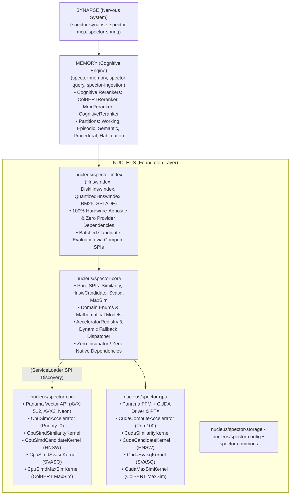

# ADR-0021: Nucleus Symmetric Hardware Abstraction Layer (HAL)

| Field | Value |
|:---|:---|
| **Status** | Accepted (Implemented) |
| **Date** | 2026-08-24 |
| **Authors** | Spector Maintainers & Architecture Working Group |
| **Deciders** | Spector Technical Steering Committee (TSC) |
| **Supersedes** | None |
| **Superseded By** | None |
| **Last Verified** | 2026-09-16 (Verified against `main`) |

---

## 1. Context

Spector is a high-performance cognitive memory and vector search architecture written in Java 25. The system performs high-throughput vector arithmetic, approximate nearest-neighbor (ANN) graph traversal, late-interaction token scoring (MaxSim), and asymmetric quantized distance calculations across heterogenous hardware platforms (CPUs with AVX-512/Neon and GPUs with CUDA).

## 2. Problem Statement

Prior to this architectural change, Spector suffered from severe hardware coupling and architectural asymmetry:

1. **Asymmetric Hardware Coupling in `spector-core`**: `nucleus/spector-core` contained both domain abstractions and low-level CPU SIMD vector implementations using the Panama Vector API (`jdk.incubator.vector`). This forced all downstream modules depending on `spector-core` to inherit incubator module requirements, violating the principle of a stable, portable foundation core.
2. **Orphan GPU Acceleration Kernels**: `nucleus/spector-gpu` contained specialized kernels (`CudaHnswKernel`, `CudaSvasqKernel`, `CudaMaxSimKernel`) that were disconnected from indexing classes (`AbstractHnswIndex`, `QuantizedHnswIndex`) and cognitive rerankers (`ColBERTReranker`).
3. **Scalar Candidate Evaluation in HNSW Traversal**: `AbstractHnswIndex.searchLayer()` evaluated unvisited neighbor candidates one-by-one in a scalar loop rather than dispatching batched candidate sets to SIMD or GPU.
4. **Module Misplacement & Provider Leak in `spector-index`**: `spector-index` resided under `memory/` and inherited a dependency on `spector-provider-api` solely because `ColBERTReranker` combined text token encoding with MaxSim late-interaction scoring in the same class.

## 3. Decision Drivers

- **Dependency Inversion Principle (DIP)**: High-level indexing and memory modules must depend on pure abstractions (SPIs), not on CPU SIMD or GPU CUDA implementations.
- **Single Responsibility Principle (SRP)**:
  - `spector-core` owns contracts, math formulations, cognitive abstractions, and registry routing.
  - `spector-cpu` owns CPU SIMD vector execution (AVX-512, AVX2, ARM Neon) via Java 25 Panama Vector API.
  - `spector-gpu` owns GPU CUDA execution (PTX kernels, Panama FFM, VRAM manager).
  - `spector-index` owns graph topologies, disk paging, and ANN data structures (HNSW, IVF, BM25, SPLADE), residing purely in `nucleus/`.
  - `spector-memory` owns cognitive memory models, episodic/semantic/procedural partitions, and high-level reranker pipelines (`ColBERTReranker`, `MmrReranker`, `CognitiveReranker`).
- **Interface Segregation Principle (ISP)**: Separate compute capabilities into fine-grained SPI interfaces (`SimilarityKernel`, `HnswCandidateKernel`, `SvasqDistanceKernel`, `QuantizedDistanceKernel`, `MaxSimKernel`).
- **Strict Downward Layering**: $\text{Synapse} \longrightarrow \text{Memory} \longrightarrow \text{Nucleus}$. No module in `nucleus/` may depend on `memory/` or `synapse/`.
- **Zero-Exception Degradation**: Runtime failures or hardware absence on GPU must transparently fall back to CPU SIMD with zero latency penalty or user disruption.
- **Platform Independence**: Standard Java SE compilation for `spector-core` without mandatory incubator compiler flags.

## 4. Considered Options

### Option 1: Status Quo (Keep SIMD in `spector-core`, GPU in `spector-gpu`, Index in `memory/`)
- **Description**: Maintain existing package placement without introducing new SPI abstractions.
- **Advantages**: No new modules required.
- **Disadvantages**: `spector-core` remains polluted with incubator vector code; GPU HNSW/SVASQ kernels remain orphans; non-symmetric architecture; `spector-index` incorrectly depends on `spector-provider-api`.

### Option 2: Merge `spector-index` into `spector-cpu`
- **Description**: Combine indexing structures and CPU vector code into a unified engine module.
- **Advantages**: Reduces total reactor module count by 1.
- **Disadvantages**: Severe SRP violation. Conflates graph algorithms with CPU vector intrinsics. Makes HNSW index unable to run cleanly on GPU without depending on CPU SIMD module.

### Option 3: Symmetric Nucleus HAL with Dedicated `spector-cpu`, `nucleus/spector-index`, and Cognitive Reranker Extraction (Selected)
- **Description**: Establish pure SPIs in `spector-core`, place hardware implementations into symmetric `spector-cpu` and `spector-gpu` peer modules, relocate `spector-index` to `nucleus/`, and split `ColBERTReranker` into hardware MaxSim SPI and memory reranker.
- **Advantages**: 100% pure standard Java `spector-core`; symmetric accelerator discovery via `ServiceLoader`; clean downward layering.
- **Disadvantages**: Increases total module count in reactor.

## 5. Decision Outcome

**Chosen Option**: Option 3 (Symmetric Nucleus HAL).

### 5.1 Module Layering Matrix



### 5.2 Compute Kernel SPI Definitions (`spector-core`)

All compute kernels extend the `ComputeKernel` marker interface:

```java
package com.spectrayan.spector.core.spi;

public interface ComputeKernel {}
```

#### `SimilarityKernel` (Pairwise & Batch Dense Distance)
```java
public interface SimilarityKernel extends ComputeKernel {
    float cosineSimilarity(float[] a, float[] b);
    float dotProduct(float[] a, float[] b);
    float euclideanDistance(float[] a, float[] b);
    void cosineSimilarityBatch(float[] query, float[][] vectors, float[] outScores);
    void dotProductBatch(float[] query, float[][] vectors, float[] outScores);
    void euclideanDistance(float[] query, float[][] vectors, float[] outDistances);
}
```

#### `HnswCandidateKernel` (Batch Neighbor Evaluation in Graph Traversal)
```java
public interface HnswCandidateKernel extends ComputeKernel {
    void evaluateCandidates(
        float[] query,
        float[] candidateVectorsFlat,
        int candidateCount,
        int dimensions,
        SimilarityFunction function,
        float[] outScores
    );
}
```

#### `SvasqDistanceKernel` (Asymmetric Quantized FWHT Distance)
```java
public interface SvasqDistanceKernel extends ComputeKernel {
    void computeDistances(
        float[] rotatedQuery,
        byte[] quantizedVectorsFlat,
        float[] codebookScales,
        int vectorCount,
        int dimensions,
        float[] outDistances
    );
}
```

#### `MaxSimKernel` (ColBERT Late-Interaction Token Scoring)
```java
public interface MaxSimKernel extends ComputeKernel {
    float maxSim(float[][] queryTokens, float[][] docTokens);
    void maxSimBatch(float[][] queryTokens, float[][][] docTokensBatch, float[] outScores);
}
```

### Positive Consequences
- **Architectural Cleanliness**: `spector-core` is 100% standard Java 25 without incubator compiler flags.
- **Strict Downward Layering**: `nucleus/spector-index` only depends on `nucleus/*` modules; zero leakage of provider APIs into the foundation layer.
- **Orphan Kernels Resolved**: CUDA kernels for HNSW, SVASQ, and MaxSim are directly wired to index traversal and reranking pipelines.
- **MaxSim Acceleration**: ColBERT token late-interaction is accelerated on both CPU SIMD and CUDA GPU.
- **Safe Fallback**: Zero downtime or exceptions on machines without CUDA GPUs.

### Negative Consequences & Trade-offs
- Total module count in `nucleus/` increases to accommodate `nucleus/spector-cpu` and `nucleus/spector-index`.
- Relocation of `ColBERTReranker` requires updated import statements in `spector-memory` recall pipelines.

## 6. Pros and Cons of the Options

| Option | Pros | Cons |
|:---|:---|:---|
| **Option 1: Status Quo** | Zero new modules | Core polluted with vector incubator, GPU kernels disconnected, index misplaced |
| **Option 2: Merge Index & CPU** | Reduces module count | Severe SRP violation, couples graph structures to CPU vector intrinsics |
| **Option 3: Symmetric HAL** | Pure standard Java core, symmetric peer plugins, clean layering | Modest increase in reactor module count |

## 7. Implementation Plan

1. **Phase 1**: Define `ComputeKernel` and SPI interfaces in `nucleus/spector-core/spi`.
2. **Phase 2**: Implement `nucleus/spector-cpu` with Panama Vector API implementations.
3. **Phase 3**: Connect `nucleus/spector-gpu` CUDA kernels to SPI interfaces.
4. **Phase 4**: Move `spector-index` to `nucleus/` and extract text tokenization from `ColBERTReranker` into `memory/spector-memory`.
5. **Phase 5**: Wire dynamic fallback in `AcceleratorRegistry` and verify with unit and benchmark suites.

## 8. Code Reference & Verification

- **Primary Module(s)**: `nucleus/spector-core`, `nucleus/spector-cpu`, `nucleus/spector-gpu`, `nucleus/spector-index`, `memory/spector-memory`
- **Key Packages**: `com.spectrayan.spector.core.spi`, `com.spectrayan.spector.index`, `com.spectrayan.spector.gpu.kernel`
- **Classes**: `ComputeKernel.java`, `SimilarityKernel.java`, `HnswCandidateKernel.java`, `SvasqDistanceKernel.java`, `MaxSimKernel.java`, `AbstractHnswIndex.java`
- **Verification Tests**: `AcceleratorRegistryTest.java`, `HnswCandidateKernelTest.java`, `MaxSimKernelTest.java`
