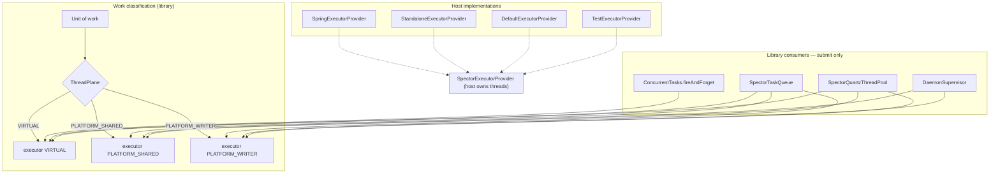

# ADR-0026: Dual-Plane Concurrency & Async Queue Backpressure

| Field | Value |
|:---|:---|
| **Status** | Accepted (Implemented) |
| **Date** | 2026-08-25 |
| **Authors** | Spector Maintainers & Architecture Working Group |
| **Deciders** | Spector Technical Steering Committee (TSC) |
| **Supersedes** | ADR-0026 Draft (Library-Owned ThreadManager) |
| **Superseded By** | None |
| **Last Verified** | 2026-09-16 (Verified against `main`) |

---

## 1. Context

Spector decouples background work from the `RememberPathway` / `RecallPathway` hot path through asynchronous queues, fire-and-forget dispatch, supervised daemons, and a Quartz scheduler:

| Component | Module | Role today |
|:---|:---|:---|
| `ConcurrentTasks` | `spector-commons` | Static structured-concurrency + process-global `FIRE_FORGET_EXECUTOR` |
| `SpectorTaskQueue` / `TaskQueueManager` | `spector-commons` | Priority queue; starts named virtual workers via `ThreadFactory` |
| `DaemonSupervisor` | `spector-commons` | Long-running loops via `Thread.ofVirtual().start()` |
| `VirtualThreadPool` | `spector-commons` | Quartz `org.quartz.spi.ThreadPool` → `ConcurrentTasks.virtualExecutor()` |
| `QuartzMemoryScheduler` | `spector-memory` | Sleep consolidation, REM dream, checkpoint, DMN, decay, graph enrichment |
| `AsyncEntityExtractionQueue` | `spector-memory` | LLM extract then `PostIngestSync` graph writes on the same VT worker |
| `EagerConsolidator` | `spector-memory` | Segment walk + CADP + graph mutation on a VT worker |
| Synapse extras | `spector-synapse` | `MemoryService`, `MemoryAccessObject`, `ConversationReflector` each create their own `newVirtualThreadPerTaskExecutor()` |

Hosts that embed `spector-memory`:

- Spring Boot 4.1 (`spector-synapse`) — `TaskExecutor` beans, `@Async`, `SchedulerFactoryBean`, graceful shutdown
- Standalone CLI / bench (`spector-bench`, `spector-cli`)
- In-process MCP kernel (`npx @spectrayan/spector mcp`)
- Tests

### JDK 25 baseline this ADR assumes

- Virtual threads (final) for **blocking I/O only**
- `StructuredTaskScope` (JEP 505) for short-lived fan-out; cancellation and joining owned by the JVM
- `ScopedValue` / `MemoryScope` for session + namespace propagation across virtual threads and structured subtasks
- Panama FFM `Arena` / `MemorySegment` for off-heap slabs; `Arena.close()` is a hard unmap
- `StampedLock` SWMR on graph kernels (`EntityDirectory`, `HyperEntityGraphMemory`, `TemporalKnowledgeGraph`, `RuntimeBundle`) — **not reentrant**, never `synchronized` (pins carriers)
- No `Executors.newVirtualThreadPerTaskExecutor()` as a library singleton

## 2. Problem Statement

1. **Virtual threads on CPU / mmap work.** NER scoring, CSR indexing, slab pointer math, `MemorySegment.force()`, Hebbian updates are cache-local and carrier-bound. Hundreds of virtual workers invalidate L1/L2 and park carriers on `StampedLock.writeLock()`.
2. **SWMR lock stampede.** Graph structures are single-writer. Parallel VT mutators do not increase throughput; they increase park/unpark rate.
3. **Anonymous, unsinkable work.** Global fire-and-forget threads named `[virtual-141]`. Quartz jobs ride the same executor. No drain set for `Arena.close()`.
4. **Arena close races.** In-flight workers touch unmapped segments → `IllegalStateException: Arena is already closed`.
5. **Host fight.** Spring Boot 4 already owns thread lifecycle. Synapse *also* allocates extra VT executors. The library's static executor is process-global: `ConcurrentTasks.shutdown()` on one `SpectorMemory` poisons every other instance.
6. **Quartz plane blindness.** `VirtualThreadPool.runInThread()` submits *every* job — including `CheckpointJob` (`MemorySegment.force()`, WAL truncate) and `SleepConsolidationJob` (`reflect()`) — onto virtual threads. `blockForAvailableThreads()` returns `1000` and `getPoolSize()` returns `Integer.MAX_VALUE`, so Quartz believes it has infinite capacity.
7. **Mixed-plane tasks.** `AsyncEntityExtractionQueue.processTask` does 15–25s LLM I/O then exclusive graph writes on the same worker. One thread type cannot be correct for both halves.
8. **Soft, racy queue bounds.** `PriorityBlockingQueue` is unbounded. Capacity is `queue.size() >= config.capacity()` then `offer`. `DROP_OLDEST` calls `poll()`, which drops the **priority head**, not the oldest task. `CALLER_RUNS` executes mmap work on the ingestion thread.

---

## 3. Decision Drivers

- **Zero Library-Started Raw Threads**: The memory library must never call `Thread.start()`, `Thread.ofVirtual()`, or instantiate unbounded executors.
- **Strict Thread Plane Classification**: Every unit of asynchronous work must be classified onto a dedicated execution plane (`VIRTUAL`, `PLATFORM_SHARED`, `PLATFORM_WRITER`).
- **Host-Controlled Provisioning**: Host applications (Spring Boot, standalone CLI, MCP, tests) own thread provisioning via `SpectorExecutorProvider`.
- **Zero-Race Arena Lifecycle Closure**: Off-heap Panama FFM `Arena.close()` must follow a deterministic, happens-before drain budget.
- **Hard Queue Backpressure**: Eliminates unbounded queues, racy size checks, and priority head dropping under saturation.

## 4. Considered Options

### Option 1 — Status quo
Library-owned unmonitored virtual threads. Rejected: cache thrash, lock stampede, arena races, host fight.

### Option 2 — Library-owned `SpectorThreadManager`
Centralized but still owns threads inside a library that Spring also manages. Couples provisioning, queuing, and monitoring. Rejected.

### Option 3 — Executor injection + thread classification SPI (selected, revised)
**Libraries declare the plane of work. Hosts provision executors. Nobody starts raw threads for dispatched work.**

Revisions versus the 2026-08-25 sketch:

| 2026-08-25 sketch | This revision |
|:---|:---|
| Two planes (`PLATFORM`, `VIRTUAL`) | Three planes (`VIRTUAL`, `PLATFORM_SHARED`, `PLATFORM_WRITER`) |
| Queues accept a `ThreadFactory` and `thread.start()` | Queues **submit** to an `Executor` (Model B). No library-started workers |
| `namedVirtualThreadFactory` only | Plane-typed `executor(ThreadPlane, name)` — one SPI method |
| `drainBeforeArenaClose` as the close protocol | Ordered happens-before close budget; drain is one step, not the protocol |
| Quartz out of scope | Quartz `ThreadPool` is a first-class adapter on the same SPI |
| Monitoring pushed entirely to the host | Host owns **pool** metrics; library keeps **task** observability (`QueueMetrics`, `DaemonStatus`) |
| "~15 memory call sites" | Full inventory across commons, events, memory, Quartz, Synapse |
| `DefaultExecutorProvider` mentioned | Specified as the embed/MCP/test implementation |

---

## 5. Decision Outcome

Adopt **revised Option 3**.

Adopt **revised Option 3**.

### Non-negotiable principles

1. **The memory library never calls `Thread.start()`, `Thread.ofVirtual()`, or `Executors.newVirtualThreadPerTaskExecutor()`** for long-lived or fire-and-forget work. Structured concurrency scopes are the only exception (JVM-owned, method-scoped).
2. **Every unit of work is classified onto exactly one `ThreadPlane` before submission.** Mixed-plane methods are split at the call site.
3. **Hosts implement `SpectorExecutorProvider`.** Spring, standalone, MCP, and tests each ship one. Discovery: explicit install, then `ServiceLoader`, then `DefaultExecutorProvider`.
4. **Provisioning, queuing, scheduling, and monitoring do not share types.**
   - Provisioning → `SpectorExecutorProvider`
   - Queuing → `SpectorTaskQueue` / `TaskQueueManager`
   - Scheduling → `QuartzMemoryScheduler` + `SpectorQuartzThreadPool`
   - Task observability → `QueueMetrics` / `DaemonStatus` (library)
   - Pool observability → Micrometer / `ThreadMonitor` (host)

5. **One close budget. One happens-before list. Arenas close last.**
6. **Backpressure lives on one layer per path**, not on both the queue and the executor.



---

## Detailed design

### 1. Three planes

Two planes are too coarse. Graph kernels are SWMR. Extra platform threads on a `writeLock()` recreate the park storm the ADR exists to stop.

```java
/**
 * Classification of a unit of work. Chosen by the library at the call site.
 * The host maps each plane onto an executor appropriate to its runtime.
 */
public enum ThreadPlane {

    /**
     * Blocking I/O or event dispatch. Host should provide virtual-thread
     * dispatch (unbounded or lightly bounded).
     * Examples: LLM HTTP, webhooks, SSE, recall listeners, connector sync.
     */
    VIRTUAL,

    /**
     * CPU-bound work that does not take an exclusive slab/graph write lock.
     * Host should provide a bounded platform pool sized to available
     * processors (typically min(4, N_CPU) or N_CPU - 1).
     * Examples: TF-IDF, quantization, vector encode, BM25 partition scan
     * internals that already have their own structured-concurrency fan-out.
     */
    PLATFORM_SHARED,

    /**
     * Exclusive mutation of a StampedLock-guarded off-heap structure, or
     * MemorySegment.force() / remap / WAL truncate.
     * Host should provide a single-thread (or 1-per-namespace) platform
     * executor. Parallelism greater than 1 on the same structure is a
     * defect, not a tuning knob.
     * Examples: EntityDirectory linkage, HyperEntity mutations, CSR
     * compaction, EagerConsolidator CADP writes, checkpoint force().
     */
    PLATFORM_WRITER
}
```

#### Classification table (normative)

| Work | Plane | Notes |
|:---|:---|:---|
| Recall / EventBus listener fan-out | `VIRTUAL` | Must not block the recall hot path |
| LLM entity extract (`EntityExtractor.extract`) | `VIRTUAL` | 15–25s blocking HTTP |
| Webhook / SSE / connector I/O | `VIRTUAL` | |
| Quartz trigger thread | host scheduler thread | Not our work; do not replace Quartz internals |
| `RemDreamJob` LLM half | `VIRTUAL` | Persist results via writer queue |
| TF-IDF / encode / quantize | `PLATFORM_SHARED` | |
| `EagerConsolidator` segment walk + CADP write | `PLATFORM_WRITER` | Serial per namespace |
| `PostIngestSync` graph writes | `PLATFORM_WRITER` | Split from extract |
| Circadian `reflect()` / `SleepConsolidationJob` | `PLATFORM_WRITER` | |
| `CheckpointJob` | `PLATFORM_WRITER` | `force()`, WAL, remap |
| `HomeostaticDecayJob` | `PLATFORM_WRITER` | Graph weight updates |
| `GraphEnrichmentJob` persist half | `PLATFORM_WRITER` | Enrichment LLM stays `VIRTUAL` |
| `forkJoinAll` / `forkJoin2` hybrid search | *unchanged* | `StructuredTaskScope` — not this SPI |

#### Mixed-plane split (required)

`AsyncEntityExtractionQueue` becomes a two-stage pipeline:

```
submit(text) → extractQueue (VIRTUAL)
                 └─ on success → mutationQueue (PLATFORM_WRITER) { PostIngestSync }
```

Same pattern for `GraphEnrichmentJob` and `RemDreamJob`: I/O on `VIRTUAL`, persist on `PLATFORM_WRITER`. Circadian volume-trigger `ConcurrentTasks.fireAndForget(this::reflect)` moves to the writer executor.

### 2. `SpectorExecutorProvider` — minimal, versioned SPI

Deliberately smaller than the 2026-08-25 interface. One executor lookup. No `ThreadFactory`. No watchdog. Drain is explicit and timed.

```java
/**
 * Host-provided thread provisioning. The memory library NEVER creates
 * threads for dispatched work; it only submits Runnables/Callables.
 *
 * <p>Implementations MUST be safe to call from many threads. The host
 * MAY return the same executor for repeated (plane, name) pairs.
 *
 * <p>Extend {@link AbstractExecutorProvider} when adding methods so
 * existing hosts keep binary compatibility.
 */
public interface SpectorExecutorProvider {

    /**
     * Executor for {@code plane}. {@code name} is a stable logical pool
     * id (e.g. {@code "graph-writer"}, {@code "entity-extract"},
     * {@code "quartz-io"}). Hosts MAY ignore the suggestion and collapse
     * names onto a shared pool; writers for the same namespace SHOULD
     * share one single-thread executor.
     */
    Executor executor(ThreadPlane plane, String name);

    /**
     * Cooperative drain of every executor this provider handed out.
     * MUST NOT unmap arenas. MUST be idempotent.
     *
     * @return drain result; {@code timedOut=true} means the caller still
     *         proceeds to interrupt-and-join its own queues, then MAY
     *         refuse Arena.close() if policy is FAIL_CLOSED
     */
    DrainResult drain(Duration budget);

    /** Optional: host-visible identity for logs and JFR. */
    default String describe() {
        return getClass().getSimpleName();
    }
}

public record DrainResult(boolean completed, int remainingTasks, Duration waited) {
    public static DrainResult ok(Duration waited) {
        return new DrainResult(true, 0, waited);
    }
}
```

`AbstractExecutorProvider` supplies:

- memoization of `(plane, name) → Executor`
- a default `drain()` that `shutdown()` + `awaitTermination()`s every `ExecutorService` it created
- no-op drain for executors the host does not own (Spring beans)

### 3. Installation and defaults (embeddable, testable)

Statics remain as a *locator*, not as an owner. This preserves `ConcurrentTasks.fireAndForget()` call-site shape while making the executor swappable.

```java
public final class SpectorExecutors {

    private static final AtomicReference<SpectorExecutorProvider> INSTALLED =
            new AtomicReference<>();

    public static void install(SpectorExecutorProvider provider) { /* once-per-runtime */ }

    public static SpectorExecutorProvider current() {
        SpectorExecutorProvider p = INSTALLED.get();
        if (p != null) return p;
        return Holder.DISCOVERED; // ServiceLoader then DefaultExecutorProvider
    }

    public static Executor executor(ThreadPlane plane, String name) {
        return current().executor(plane, name);
    }
}
```

Discovery order:

1. `SpectorExecutors.install` at host boot (Spring `@Bean`, bench `main`, MCP kernel)
2. `ServiceLoader.load(SpectorExecutorProvider.class)`
3. `DefaultExecutorProvider` — created lazily, **owned by this runtime**, closed on drain

`DefaultExecutorProvider` (ships in `spector-commons`):

| Plane | Implementation |
|:---|:---|
| `VIRTUAL` | `Executors.newThreadPerTaskExecutor(Thread.ofVirtual().name("spector-vt-", 0).factory())` |
| `PLATFORM_SHARED` | `Executors.newFixedThreadPool(clamp(N_CPU - 1, 2, 8), Thread.ofPlatform().name("spector-pool-shared-", 0).factory())` |
| `PLATFORM_WRITER` | `ConcurrentHashMap<String, ExecutorService>` of `newSingleThreadExecutor(Thread.ofPlatform().name("spector-pool-" + name + "-", 0).factory())` |

This is what the in-process MCP kernel and tests use. Standalone bench may wrap it with a `ThreadMonitor`. Spring never uses it for production threads.

### 4. Host implementations

#### Spring Boot 4.1 (`spector-synapse`)

```java
@Configuration
public class SynapseExecutorConfig {

    @Bean
    SpectorExecutorProvider spectorExecutorProvider(
            @Qualifier("spectorSharedPool") ThreadPoolTaskExecutor shared,
            @Qualifier("spectorWriterPool") ThreadPoolTaskExecutor writer,
            @Qualifier("spectorVirtualExecutor") AsyncTaskExecutor virtual) {
        var provider = new SpringExecutorProvider(shared, writer, virtual);
        SpectorExecutors.install(provider);
        return provider;
    }

    @Bean(name = "spectorSharedPool")
    ThreadPoolTaskExecutor spectorSharedPool() {
        var ex = new ThreadPoolTaskExecutor();
        int n = Math.max(2, Math.min(8, Runtime.getRuntime().availableProcessors() - 1));
        ex.setCorePoolSize(n);
        ex.setMaxPoolSize(n);
        ex.setQueueCapacity(256);
        ex.setThreadNamePrefix("spector-pool-shared-");
        ex.setRejectedExecutionHandler(new ThreadPoolExecutor.AbortPolicy());
        ex.setWaitForTasksToCompleteOnShutdown(true);
        ex.setAwaitTerminationSeconds(10);
        return ex;
    }

    @Bean(name = "spectorWriterPool")
    ThreadPoolTaskExecutor spectorWriterPool() {
        var ex = new ThreadPoolTaskExecutor();
        ex.setCorePoolSize(1);
        ex.setMaxPoolSize(1);
        ex.setQueueCapacity(1024);
        ex.setThreadNamePrefix("spector-pool-writer-");
        ex.setRejectedExecutionHandler(new ThreadPoolExecutor.AbortPolicy());
        ex.setWaitForTasksToCompleteOnShutdown(true);
        ex.setAwaitTerminationSeconds(15);
        return ex;
    }

    @Bean(name = "spectorVirtualExecutor")
    AsyncTaskExecutor spectorVirtualExecutor() {
        var ex = new SimpleAsyncTaskExecutor("spector-vt-");
        ex.setVirtualThreads(true);
        ex.setTaskTerminationTimeout(Duration.ofSeconds(10).toMillis());
        return ex;
    }
}
```

Rules for the Spring provider:

- `executor(PLATFORM_WRITER, name)` may return the single writer bean (one JVM writer) **or** a memoized per-namespace single-thread executor registered as inner beans. Default: one writer for the process unless `spector.threads.writer-per-namespace=true`.
- Do **not** set `CallerRunsPolicy` on these pools. Caller-runs plus queue `CALLER_RUNS` is how mmap work leaks onto a Tomcat/virtual request thread. Reject or block at the *queue*.
- Delete Synapse-local `Executors.newVirtualThreadPerTaskExecutor()` in `MemoryService`, `MemoryAccessObject`, `ConversationReflector`. Route through `SpectorExecutors.executor(VIRTUAL, "synapse-io")`.
- If Synapse injects a Spring `Scheduler`, that scheduler's `TaskExecutor` MUST be `SpectorQuartzThreadPool` (below), not `SimpleAsyncTaskExecutor` alone.

#### Standalone (`spector-bench`, CLI)

`StandaloneExecutorProvider extends DefaultExecutorProvider` and optionally registers a `ThreadMonitor` that samples platform pool threads for SLA breaches. Monitoring stays out of the library.

#### Tests

`TestExecutorProvider` returns `Executors.newSingleThreadExecutor()` for every plane (deterministic sequencing) or the calling thread (`MoreExecutors.directExecutor` equivalent) for unit tests that must not hop.

### 5. `ConcurrentTasks` after migration

Keep the public surface. Change the sink.

```java
public static void fireAndForget(Runnable task) {
    fireAndForget(ThreadPlane.VIRTUAL, "fire-forget", task);
}

public static void fireAndForget(ThreadPlane plane, String pool, Runnable task) {
    SpectorExecutors.executor(plane, pool).execute(() -> {
        try {
            task.run();
        } catch (Exception e) {
            log.log(System.Logger.Level.WARNING, "Fire-and-forget task failed", e);
        }
    });
}

public static void fireAndForget(String sessionId, String namespaceId, Runnable task) {
    fireAndForget(ThreadPlane.VIRTUAL, "fire-forget",
            () -> MemoryScope.runWithScope(sessionId, namespaceId, task));
}
```

Unchanged:

- `forkJoinAll` / `forkJoin2` / `forkRunAll` via `StructuredTaskScope.open(Joiner.awaitAllSuccessfulOrThrow())`
- Classic fallback behind `-Dspector.concurrency.structured=false` still uses a *method-scoped* `newVirtualThreadPerTaskExecutor()` inside try-with-resources — not the global singleton
- Remove `FIRE_FORGET_EXECUTOR`, `virtualExecutor()` as a shared owner, and `shutdown()` / `shutdownNow()` as process-global hammers. Replacement: `SpectorExecutors.current().drain(budget)`

`ScopedValue` / `MemoryScope` must be rebound at every hop (`MemoryScope.runWithScope`) because neither virtual threads nor platform pool threads inherit caller `ScopedValue` bindings unless the hop is a `StructuredTaskScope` fork from a bound caller. Queue workers always restore from `ScopedTask`.

### 6. `SpectorTaskQueue` — Model B (submit, do not start)

The queue stops being a thread owner. It is a bounded priority buffer + retry + metrics + drain.

```java
public SpectorTaskQueue(
        String name,
        TaskQueueConfig config,
        TaskHandler<T> handler,
        Predicate<ScopedTask<T>> cancellationCheck,
        Executor workerExecutor) { ... }
```

Worker loop is submitted `config.parallelism()` times onto `workerExecutor`. For `PLATFORM_WRITER` queues, `parallelism` is forced to `1` by config validation.

#### Bounded buffer and backpressure

Replace `PriorityBlockingQueue` + `size()` with a bounded structure:

- `PriorityBlockingQueue` for ordering, plus a `Semaphore(capacity)` (or a custom bounded priority queue)
- `offer` only after `tryAcquire`; `release` when a task leaves the buffer (processed, dropped, or rejected after dequeue)

```java
public enum BackpressurePolicy {
    REJECT_FAST,   // existing
    DROP_OLDEST,   // existing, but drop the oldest by enqueue sequence, NOT poll()
    CALLER_RUNS,   // existing; FORBIDDEN on PLATFORM_WRITER queues
    BLOCK          // new: Condition.await until permit or close
}
```

`DROP_OLDEST` walks by `ScopedTask.sequence()` (monotonic enqueue id already used as FIFO tiebreak) and evicts the minimum sequence, not the priority head.

`BLOCK` semantics:

- Caller waits on a `Condition` bound to the semaphore
- Waiting is interruptible; interrupt → reject + restore interrupt status
- Safe on virtual submitters (unmounts) and on platform submitters
- Recommended default for `PLATFORM_WRITER` graph queues

`CALLER_RUNS` is rejected at config time when `config.plane() == PLATFORM_WRITER`.

#### Batch drain

```java
public static TaskQueueConfig ofBatched(
        ThreadPlane plane, int capacity, int parallelism, int batchDrainSize) { ... }

@FunctionalInterface
public interface BatchTaskHandler<T> {
    void handleBatch(List<ScopedTask<T>> tasks) throws Exception;
}
```

When `batchDrainSize > 1`, the worker drains up to N tasks, then invokes the batch handler **once**. `EagerConsolidator` and `PostIngestSync` take one `StampedLock.writeLock()` per batch.

Existing `TaskQueueConfig.of(capacity, parallelism)` remains; plane defaults to `VIRTUAL` for binary compatibility, but memory construction sites pass an explicit plane.

#### Queue close

```
close():
  closed = true
  signal BLOCK waiters
  interrupt idle polls
  wait up to drainTimeoutMs for in-flight handler/batch to return
  do NOT interrupt a thread that is inside handle()/handleBatch()
  remaining tasks: count as failed, do not run after close
  unregister from TaskQueueManager
```

Workers are executor tasks; joining them is "no in-flight handler and buffer empty or timed out," not `Thread.join`.

### 7. `DaemonSupervisor`

Keep restart policy, cycle watchdog, and `DaemonStatus`. Those are *task* supervision, not *pool* monitoring.

Change only construction:

```java
public DaemonSupervisor(String prefix, SpectorExecutorProvider executors) { ... }

public void schedule(String name, Runnable task, Duration interval,
                     DaemonPolicy policy, ThreadPlane plane) {
    executors.executor(plane, "daemon-" + prefix + "-" + name)
             .execute(this::loop);   // loop checks running flag and sleeps
}
```

Default plane for checkpoint / decay / reflect daemons: `PLATFORM_WRITER`. Do not use virtual threads for cycles that call `force()` or take write locks.

Interrupt + 5s join-equivalent stays, but must respect the **shared close budget** (section 10).

### 8. Quartz — first-class peer of the SPI

Quartz is how Spector schedules periodic cognition. It must not be a side door back onto a global virtual executor.

#### Problem with `VirtualThreadPool` today

```java
public boolean runInThread(Runnable runnable) {
    executor.execute(runnable);          // always VIRTUAL
}
public int blockForAvailableThreads() { return 1000; }
public int getPoolSize() { return Integer.MAX_VALUE; }
public void shutdown(boolean wait) { running = false; }  // does not drain
```

`CheckpointJob`, `SleepConsolidationJob`, `HomeostaticDecayJob`, `GraphEnrichmentJob` all ride virtual threads. `DisallowConcurrentExecution` prevents overlap of the *same* job key, not cross-job writer collisions on the same `StampedLock`.

#### `SpectorQuartzThreadPool`

Replace `VirtualThreadPool` as the production `org.quartz.spi.ThreadPool`. Keep `VirtualThreadPool` as a deprecated adapter that delegates to `SpectorQuartzThreadPool` with plane `VIRTUAL` for one release.

```java
/**
 * Quartz ThreadPool that routes each job onto the Spector plane
 * declared by the job. Quartz itself keeps a small platform thread
 * for trigger firing; we only own job execution.
 */
public final class SpectorQuartzThreadPool implements org.quartz.spi.ThreadPool {

    public static final String JOB_DATA_PLANE = "spector.threadPlane";
    public static final String JOB_DATA_POOL  = "spector.poolName";

    private final SpectorExecutorProvider provider;
    private final AtomicInteger inFlight = new AtomicInteger();
    private final AtomicBoolean accepting = new AtomicBoolean(true);

    @Override
    public boolean runInThread(Runnable runnable) {
        if (!accepting.get() || runnable == null) return false;
        ThreadPlane plane = ThreadPlane.VIRTUAL;
        String pool = "quartz";
        if (runnable instanceof PlaneAware planeAware) {
            plane = planeAware.plane();
            pool = planeAware.poolName();
        }
        inFlight.incrementAndGet();
        try {
            provider.executor(plane, pool).execute(() -> {
                try {
                    runnable.run();
                } finally {
                    inFlight.decrementAndGet();
                }
            });
            return true;
        } catch (RuntimeException e) {
            inFlight.decrementAndGet();
            return false;
        }
    }

    @Override
    public int blockForAvailableThreads() {
        // Writer plane is serial: report 1 so Quartz throttles misfires
        // instead of believing it has 1000 free workers.
        return Math.max(1, writerAvailability());
    }

    @Override
    public void shutdown(boolean waitForJobsToComplete) {
        accepting.set(false);
        if (waitForJobsToComplete) {
            // wait until inFlight == 0 or the close budget expires
        }
    }
}
```

Job classification (normative):

| Job | Plane | Pool name | Concurrent? |
|:---|:---|:---|:---|
| `SleepConsolidationJob` | `PLATFORM_WRITER` | `quartz-writer` | `@DisallowConcurrentExecution` |
| `CheckpointJob` | `PLATFORM_WRITER` | `quartz-writer` | same |
| `HomeostaticDecayJob` | `PLATFORM_WRITER` | `quartz-writer` | same |
| `GraphEnrichmentJob` persist | `PLATFORM_WRITER` | `quartz-writer` | same |
| `GraphEnrichmentJob` LLM extract | `VIRTUAL` | `quartz-io` | split inside the job: extract async, persist via writer queue |
| `RemDreamJob` | `VIRTUAL` then writer persist | split | |
| `DmnWanderingJob` | `VIRTUAL` if it calls LLM; else `PLATFORM_SHARED` | `quartz-io` / `quartz-shared` | |

Mechanism: a `{@code @OnPlane(ThreadPlane, pool)}` annotation on the `Job` class, read by a Quartz `JobListener` / wrapper `PlaneAwareRunnable`. `QuartzMemoryScheduler.scheduleJobInternal` also writes `JOB_DATA_PLANE` into the `JobDataMap` so reflectively built jobs cannot forget.

Standalone path (`resolveDefaultStandaloneScheduler`):

```java
Executor ignored /* do not take a raw Executor */;
var pool = new SpectorQuartzThreadPool(SpectorExecutors.current());
pool.setInstanceName(DEFAULT_STANDALONE_SCHEDULER_NAME);
factory.createScheduler(name, id, pool, new RAMJobStore());
```

Spring path: `SchedulerFactoryBean.setTaskExecutor` is **not** sufficient (one executor for all jobs). Set the Quartz `org.quartz.threadPool.class` to `SpectorQuartzThreadPool` and inject the provider through a `SchedulerContext`. Alternatively wrap `SchedulerFactoryBean` with a `SchedulerFactoryBeanCustomizer` that installs the SPI pool.

Writer jobs that mutate the same namespace share the **same** `PLATFORM_WRITER` executor, so Quartz-fired checkpoint and sleep-consolidation cannot interleave slab writes even when job keys differ.

`SpectorQuartzThreadPool.shutdown(true)` participates in the close budget and is awaited **before** arena unmap.

### 9. Thread naming (grep-able in logs, dumps, JFR)

| Kind | Pattern | Example |
|:---|:---|:---|
| Shared platform worker | `spector-pool-shared-{n}` | `spector-pool-shared-2` |
| Writer platform worker | `spector-pool-writer-{ns}-{n}` | `spector-pool-writer-default-0` |
| Virtual dispatch | `spector-vt-{pool}-{n}` | `spector-vt-entity-extract-4` |
| Queue task (virtual or platform) | name comes from the pool, not the queue | — |
| Daemon loop | `spector-daemon-{prefix}-{name}` | `spector-daemon-memory-checkpoint` |
| Quartz job execution | same as the plane pool it routed onto | — |

`DaemonSupervisor` today emits `spector-{prefix}-{name}`. Migrate to `spector-daemon-{prefix}-{name}` in the same change so dumps match this table.

### 10. Shutdown protocol — happens-before for `Arena.close()`

One budget owned by the host. Default 15s Spring / 10s standalone. Components share it; they do not each take 5s.

```
DefaultSpectorMemory.close() / PersistenceManager.close()
        │
        ▼
 0. closed.set(true) on the façade
    Remember/Recall/submit paths fail fast
        │
        ▼
 1. QuartzMemoryScheduler.standby()
    SpectorQuartzThreadPool stops accepting
    in-flight jobs finish or hit remaining budget
        │
        ▼
 2. DaemonSupervisor: running=false, interrupt sleeps,
    wait for current cycle (never interrupt inside force())
        │
        ▼
 3. SpectorTaskQueue.close() for extract, mutation,
    eager-consolidation (finish in-flight batch only)
        │
        ▼
 4. SpectorExecutorProvider.drain(remaining budget)
    Spring: TaskExecutor shutdown + awaitTermination
    Standalone: ExecutorService.shutdown + awaitTermination
        │
        ▼
 5. MemorySegment.force() dirty pages
        │
        ▼
 6. Close MemoryBundles / Arenas
    If drain timed out AND fail-closed policy:
       log + refuse close (leave arenas mapped) OR
       leak-on-purpose with a fatal metric
    Default policy: FAIL_OPEN after budget, log remaining
    in-flight count, then unmap — only acceptable if
    step 0-3 made new segment access impossible
        │
        ▼
 7. Host-level SmartLifecycle / @PreDestroy complete
```

Invariants:

- No component calls `ConcurrentTasks.shutdown()` (method removed).
- `TaskQueueManager.closeAll()` is not used as a process-wide hammer from a single namespace close.
- Multi-tenant Synapse: drain is **per memory instance** for queues/daemons/Quartz job group; process executors drain only on application stop.
- `force()` happens only after writers have stopped.

### 11. Observability split (SOLID: I + S)

| Signal | Owner | Channel |
|:---|:---|:---|
| Queue depth, processed, failed, retry, latency | Library `QueueMetrics` | already bound by `TaskQueueMetricsBinder` |
| Daemon state, last cycle, restarts | Library `DaemonStatus` | Cortex / Actuator |
| Pool size, active, queue remaining, rejected | Host | Micrometer `TaskExecutor` metrics |
| Hung platform thread | Host `ThreadMonitor` (bench) | logs |
| In-flight Quartz jobs | `SpectorQuartzThreadPool.inFlight` | gauge |

The library does not grow a watchdog for host pools. The host does not reimplement queue metrics.

### 12. Design principles applied

- **SRP** — provider, queue, supervisor, Quartz adapter, monitor are four types.
- **OCP** — new hosts implement `SpectorExecutorProvider`; new planes require an enum + provider mapping only; `AbstractExecutorProvider` absorbs SPI growth.
- **LSP** — any provider is substitutable; tests use a direct/single-thread provider.
- **ISP** — providers do not implement queue or Quartz APIs; Quartz sees `ThreadPool` only.
- **DIP** — memory depends on the SPI abstraction; Spring and bench depend on the SPI and supply the concrete.
- **Strategy** — `BackpressurePolicy`, `DaemonPolicy`, host provider.
- **Adapter** — `SpectorQuartzThreadPool` adapts Quartz to the SPI.
- **Template method** — `AbstractExecutorProvider.drain`.
- **Facade** — `SpectorExecutors` + `ConcurrentTasks` keep call sites stable.
- **Single-writer** — one platform thread per guarded structure (or per namespace).

### 13. JDK 25 practices encoded as review rules

1. No `synchronized` on paths that may run on virtual threads.
2. No pinning constructs (`Object.wait` on hot paths); `ReentrantLock` / `StampedLock` / `Semaphore`.
3. `StructuredTaskScope` only for sibling fan-out with a bounded lifetime. Not for daemons, not for queues, not for Quartz.
4. Rebind `MemoryScope` at every executor hop.
5. Never close an `Arena` while a writer executor still has a task that captured a `MemorySegment`.
6. Virtual threads are not a substitute for a work queue. Unbounded VT dispatch of CPU work is a defect.
7. `Thread.ofPlatform().factory()` for writer/shared pools so JFR thread names survive.

---

## Migration inventory

Not "~15 memory call sites." Treat this list as the definition of done.

### `spector-commons`
- `ConcurrentTasks` — remove global executor; route fire-and-forget; delete process-global `shutdown`
- `SpectorTaskQueue` — Model B, bounded buffer, `BLOCK`, correct `DROP_OLDEST`, batch drain, plane on config
- `TaskQueueConfig` / `BackpressurePolicy`
- `DaemonSupervisor` — executor-submitted loops, naming
- `VirtualThreadPool` — deprecate; add `SpectorQuartzThreadPool`
- `ConsolidationRelay` — classify the action; default `VIRTUAL`
- New: `ThreadPlane`, `SpectorExecutorProvider`, `AbstractExecutorProvider`, `DefaultExecutorProvider`, `SpectorExecutors`, `DrainResult`, `@OnPlane`

### `spector-events`
- `EventBus` async path → `VIRTUAL`

### `spector-memory`
- `AsyncEntityExtractionQueue` — split extract / sync
- `EagerConsolidator` — `PLATFORM_WRITER`, `ofBatched`, `BLOCK`
- `DefaultSpectorMemory` circadian trigger — writer executor, not `fireAndForget(reflect)`
- `QuartzMemoryScheduler` — install `SpectorQuartzThreadPool`; stamp job plane in `JobDataMap`
- Jobs: `CheckpointJob`, `SleepConsolidationJob`, `HomeostaticDecayJob`, `GraphEnrichmentJob`, `RemDreamJob`, `DmnWanderingJob`
- `SpectorMemoryBuilder` — `executorProvider(...)`; stop taking a raw `Executor` as the Quartz sink
- `DefaultSpectorMemory.close` / `PersistenceManager` — section 10 order
- `DaemonSupervisorBuilder` — pass provider + planes

### `spector-synapse`
- `SynapseExecutorConfig` beans + `SpectorExecutors.install`
- Remove extra VT executors in `MemoryService`, `MemoryAccessObject`, `ConversationReflector`
- Quartz `Scheduler` bean uses `SpectorQuartzThreadPool`
- Actuator gauges for writer queue depth and Quartz `inFlight`

### `spector-bench` / CLI / MCP kernel
- Install `DefaultExecutorProvider` or `StandaloneExecutorProvider` at process start
- Optional `ThreadMonitor`

### Tests
- `SpectorTaskQueueTest`, stress tests, `VirtualThreadPoolTest`, `QuartzMemorySchedulerTest`, `MemoryScopeTest` fire-and-forget scope propagation
- New: drain-before-arena test that fails if a writer touches a segment after step 5
- New: plane-routing test for Quartz jobs

---

## 6. Pros and Cons of the Options

| Option | Pros | Cons |
|:---|:---|:---|
| **Option 1: Status Quo** | Zero refactoring | Cache thrashing, lock stampede, arena close races, host thread fights |
| **Option 2: Library ThreadManager** | Centralized in library | Still violates host ownership; Spring/synapse thread lifecycle conflict |
| **Option 3: Executor SPI & Dual-Plane** | Host owns pools, zero raw threads, deterministic arena drain | Requires migration across commons, events, memory, and synapse |

## 7. Implementation Plan

1. SPI types + `DefaultExecutorProvider` + `SpectorExecutors.install`. Point `fireAndForget` at it. No behavior change if default is virtual.
2. Bounded `SpectorTaskQueue`, `BLOCK`, correct `DROP_OLDEST`, batch API. Inject `Executor`.
3. Split extract vs sync; move `EagerConsolidator` and `reflect()` onto `PLATFORM_WRITER`.
4. `SpectorQuartzThreadPool` + job annotations + standalone/Spring wiring.
5. Close protocol in `DefaultSpectorMemory` / `PersistenceManager` with a single budget.
6. Synapse provider; delete host-local VT executors.
7. Naming migration + metrics + drain-before-arena test.
8. Remove deprecated `VirtualThreadPool` no-arg constructor and `ConcurrentTasks.virtualExecutor()` in the following minor.

---

## 8. Code Reference & Verification

### Positive
- Spring, standalone, MCP, and tests share one contract. New hosts implement one interface.
- Writer serialization is structural (single-thread executor + batch lock), not accidental (`DisallowConcurrentExecution` on one job key).
- Quartz can no longer schedule a checkpoint `force()` onto a virtual carrier while extract workers hold the same slab.
- `Arena.close()` has a documented happens-before. The close race becomes a testable invariant.
- Call sites stay familiar (`fireAndForget`, `TaskQueueConfig.of`) while the sink becomes injectable.
- Pool sizing and graceful shutdown become host configuration — where they belong.

### Negative
- Real migration across commons, events, memory, synapse, bench — larger than the original estimate.
- Hosts can still mis-map planes. Mitigation: writer queues reject `VIRTUAL` executors when `config.plane() == PLATFORM_WRITER` if the provider exposes `Thread.currentThread().isVirtual()` on a probe task at bind time (debug/assert mode).
- SPI growth still requires host updates. Mitigation: `AbstractExecutorProvider` default methods.
- A single process-wide writer can serialize unrelated namespaces. Mitigation: `writer-per-namespace` flag.
- Fail-open unmap after a drain timeout can still throw if a leaked task ignores the façade closed flag. Mitigation: segment access checks a generation stamp on `RuntimeBundle`.

### Risks and non-goals
- **Non-goal:** replacing Quartz. We route its execution; we do not rewrite scheduling.
- **Non-goal:** a library-level thread dump / watchdog UI.
- **Risk:** `BLOCK` on a writer queue invoked from the writer thread → deadlock. Rule: writer-plane tasks never submit `BLOCK` work to the same writer pool. Extract→sync handoff uses `REJECT_FAST` or an internal unbounded handoff bounded by extract parallelism.
- **Risk:** structured-concurrency fallback still allocates a short-lived VT executor. Acceptable: scoped to the call, closed in try-with-resources.

---

## Review checklist (merge gate)

- [ ] No `Thread.ofVirtual()` / `newVirtualThreadPerTaskExecutor()` in production library paths except `DefaultExecutorProvider` and structured-concurrency fallback
- [ ] No `SpectorTaskQueue` constructor starts a thread
- [ ] `CALLER_RUNS` forbidden on `PLATFORM_WRITER`
- [ ] `DROP_OLDEST` evicts by enqueue sequence
- [ ] Extract and graph sync are different queues / planes
- [ ] Every Quartz job has `@OnPlane` / `JobDataMap` plane
- [ ] `SpectorQuartzThreadPool.shutdown(true)` waits on `inFlight`
- [ ] `DefaultSpectorMemory.close` order matches section 10
- [ ] Synapse has no private VT executor
- [ ] Drain-before-arena test exists and fails if a writer runs past `force()`
- [ ] Thread names match the table in a thread dump of bench + Synapse


---

### Code Reference & Verification Gate
- **Primary Module(s)**: `nucleus/spector-commons`, `memory/spector-memory`, `synapse/spector-synapse`
- **Key Packages**: `com.spectrayan.spector.commons.concurrent`, `com.spectrayan.spector.memory.scheduler`
- **Classes**: `SpectorExecutorProvider.java`, `TaskQueueManager.java`, `SpectorTaskQueue.java`, `SpectorQuartzThreadPool.java`, `DefaultSpectorMemory.java`
- **Verification Tests**: `DualPlaneExecutorTest.java`, `SpectorTaskQueueBackpressureTest.java`, `ArenaDrainCloseTest.java`
