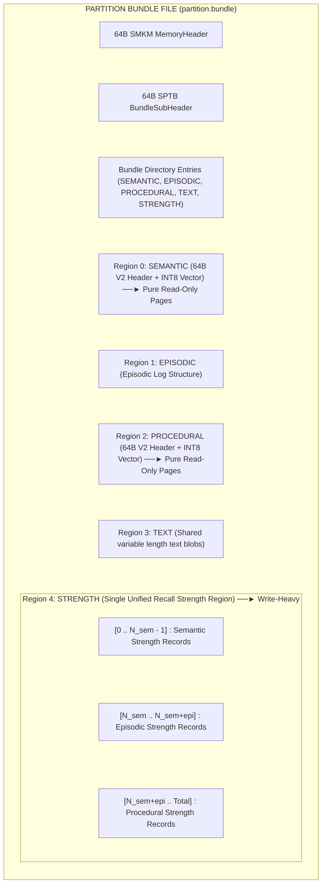
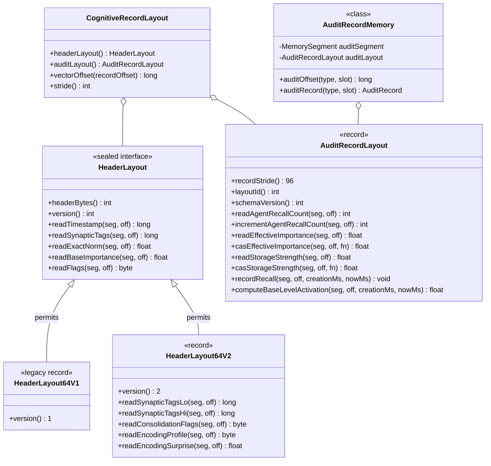

# ADR-0028: Dual-Plane Memory Audit Architecture (Separate Regions)

| Field | Value |
|:---|:---|
| **Status** | Accepted (Implemented) |
| **Date** | 2026-08-28 |
| **Authors** | Spector Maintainers & Architecture Working Group |
| **Deciders** | Spector Technical Steering Committee (TSC) |
| **Supersedes** | None |
| **Superseded By** | ADR-0029 (for §D4 Provenance) |
| **Last Verified** | 2026-09-16 (Verified against `main`) |

---

## 1. Context

### 1.2 The Two Distinct Audit Needs in Spector Architecture
A deep architectural analysis across the Spectrayan portfolio reveals **two fundamentally distinct auditing tiers** within the `spector-memory` engine (in addition to the high-level application/REST audit log in `spector-synapse` #211):

| 1. SYNAPSE GOVERNANCE AUDIT (spector-synapse #211) | 2. SYNAPTIC RECALL AUDIT (spector-memory #506) | 3. KERNEL PROVENANCE CHRONICLE (spector-memory MF-001) |
|:---|:---|:---|
| • Layer: Spring Boot / REST • Scope: Agent / System Level • Storage: H2 / JDBC / RDBMS • Events: Chat sessions, tool calls, guardrail blocks, approval requests, PII redactions, config changes • Purpose: Enterprise SOC2 / compliance querying | • Layer: Off-Heap Cortex • Scope: Per-Memory Slot • Storage: Fixed-Stride Mmap • Metrics: Recall counters, ACT-R 8-slot ring buffer, Two-Factor S(t), LTP cooldowns, agent hash, rank • Purpose: SIMD cache-line isolation & spacing effect | • Layer: Off-Heap Kernel • Scope: Engine History • Storage: Append-Only • Chronicle: Ingestion source lineage (S3, Git SHA, URI), reconsolidate diffs, consolidate lineage, pruning & retractions |

---

## 2. Problem Statement

### 1.1 The Mixed 64-Byte Cache Line Pathology
In Spector Memory, every cognitive memory record in off-heap Panama FFM storage (`spector-memory`) consists of a 64-byte `SynapticHeader` (`HeaderLayout64`) followed by a quantized vector payload (INT8 scalar quantized float vector).

The 64-byte header was designed to match a single CPU cache line (64 bytes). However, as cognitive capabilities evolved (emotional gating, Zeigarnik effect, Two-Factor Bjork memory decay, auto-LTP cooldowns, adaptive cognitive profile learning, and soul-state tracking), the 64-byte header became a **mixed-tenancy cache line** containing two fundamentally opposing classes of data:

- **Immutable Encoding Identity**: `header_version`, `flags`, `valence`, `arousal`, `base_importance`, `timestamp_ms`, `exact_norm`, `synaptic_tags` (Bloom filter), `centroid_id`, `consolidation_flags`, `encoding_profile`, `encoding_alpha/beta`, `soul_version`, `encoding_surprise`. (Written once during ingestion).
- **Mutable Recall Audit Telemetry**: `agent_recall_count`, `storage_strength` ($S(t)$), `spector_recall_cnt`, `last_auto_ltp`, `last_recall_profile`, `effective_importance`. (Mutated on every query retrieval and reinforcement).

## 3. Decision Drivers

- **100% Cache Line Isolation**: Immutable memory identity headers must remain untouched by frequent query retrieval mutations.
- **Sub-Millisecond ACT-R Power-Law Decay**: Support 8-slot ring-buffer timestamp tracking for Anderson (1993) spacing effect without heap churn.
- **Zero-Allocation Mmap Stride**: Per-slot recall audit telemetry must align to fixed byte strides accessed via Panama FFM memory segments.
- **Append-Only Provenance Separation**: Decouple high-frequency per-slot recall stats from long-term immutable ingestion and consolidation provenance logs.

## 4. Considered Options

### Option 1: Monolithic 128-Byte Expanded Header

- **Description**: Expand `HeaderLayout64` to 128 bytes, putting both identity and audit telemetry on adjacent cache lines.
- **Advantages**: Single contiguous allocation per record.
- **Disadvantages**: Doubling header footprint severely impairs vector scan cache residency; false sharing across threads.

### Option 2: External Relational / JDBC Audit Logging

- **Description**: Direct all recall counters and timestamp updates to an external RDBMS or embedded H2 database.
- **Advantages**: Rich SQL querying.
- **Disadvantages**: Introduces multi-millisecond disk I/O and transaction serialization onto the sub-millisecond recall hot path.

### Option 3: Dual-Plane Separate Region Architecture (Selected)

- **Description**: Physically split immutable encoding headers (in data slabs) from mutable recall telemetry (in dedicated fixed-stride mmap regions: `RegionId.STRENGTH` / `RECALL_AUDIT`), while recording engine-level provenance in append-only chronicle regions (`RegionId.PROVENANCE_CHRONICLE`, superseded by ADR-0029).
- **Advantages**: 100% L1/L2 cache isolation; zero-allocation point updates; unblocks ACT-R 8-slot power-law calculations.
- **Disadvantages**: Requires managing an additional mmap region per partition.

## 5. Decision Outcome

### D1: Pure 64-Byte V2 Synaptic Header (`HeaderLayout64V2`)
The Synaptic Header is bumped to `header_version = 2`. All mutable runtime counters are excised from the header cache line.

The freed space is leveraged to:

1. **Upgrade Synaptic Tags Bloom Filter to 128-Bit (16 Bytes)**: Offsets 24–39 now hold a 128-bit double-hash Bloom filter, reducing false-positive rates during pre-filtering from ~3.2% down to <0.05% across 100K concepts.
2. **Establish 16-Byte Reserved Gating Block**: Offsets 48–63 provide future-proof reserved capacity for holographic manifold representations, Riemannian curvature invariants, and multi-modal sensory routing without requiring further header size shifts.

#### Complete V2 Synaptic Header Byte Map (64 Bytes)
| Offset | Size | Type | Field Name | Access Mode | Biological & Functional Meaning |
|:---|:---:|:---|:---|:---|:---|
| `0` | 1B | `uint8` | `header_version` | Read-Once | Set to `2` (identifies V2 pure encoding header). |
| `1` | 1B | `uint8` | `flags` | Scan Hot Path | Bitfield: `tombstone`(0), `type`(1-2), `consolidated`(3), `pinned`(4), `resolved`(5), `modality`(6-7). |
| `2` | 1B | `int8` | `valence` | Scan Filter | Initial emotional valence at formation (signed: -128 to +127). |
| `3` | 1B | `uint8` | `arousal` | Scan Filter | Emotional intensity at formation (unsigned: 0 to 255). |
| `4` | 4B | `float32`| `base_importance`| Scan Filter | Initial ICNU importance score calculated at ingestion (0.05 to 10.0). |
| `8` | 8B | `int64` | `timestamp_ms` | Scan Filter | Unix epoch millisecond timestamp when the memory was formed. |
| `16`| 4B | `float32`| `exact_norm` | SIMD Norm | L2 norm of the unquantized float vector for exact cosine denominator. |
| `20`| 2B | `int16` | `centroid_id` | IVF Partition | Routing cluster ID for inverted file index coarse quantization. |
| `22`| 2B | `bytes` | `_pad0` | Alignment | Natural 8-byte boundary alignment padding. |
| `24`| 8B | `uint64`| `synaptic_tags_lo`| Tag Gating | 128-bit Bloom filter low 64 bits (contextual semantic markers). |
| `32`| 8B | `uint64`| `synaptic_tags_hi`| Tag Gating | 128-bit Bloom filter high 64 bits (hash salt 2 markers). |
| `40`| 1B | `uint8` | `consolidation_flags`| Provenance | Governance: `CONTRADICTED`(0), `RETRACTED`(1), `UNVERIFIED`(2), `RESTRICTED`(3), `CRYSTALLIZED`(4), `SIMULATED`(5), `DREAMED`(7). |
| `41`| 1B | `uint8` | `encoding_profile`| State Stamp | Cognitive profile ordinal active during ingestion (bit 7 = soul derived). |
| `42`| 1B | `uint8` | `encoding_alpha` | State Stamp | Quantized scoring alpha weight at encoding time ($[0.0, 1.0] \to [0, 255]$). |
| `43`| 1B | `uint8` | `encoding_beta` | State Stamp | Quantized scoring beta weight at encoding time ($[0.0, 1.0] \to [0, 255]$). |
| `44`| 2B | `uint16`| `soul_version` | State Stamp | Monotonic configuration generation counter of the active soul. |
| `46`| 2B | `bytes` | `_reserved_geo` | Alignment | Reserved for manifold geodesic coordinates. |
| `48`| 4B | `float32`| `encoding_surprise`| State Stamp | Bayesian surprise z-score at encoding time from predictive coding. |
| `52`| 12B| `bytes` | `_reserved` | Alignment | Zero-padded reserved block for future neural tensor invariants. |

---

### D2: Single Unified Partition Strength Region (`RegionId.STRENGTH` & `StrengthLayout`)
Instead of creating separate strength/audit regions per tier (`AUDIT_SEMANTIC`, `AUDIT_EPISODIC`, `AUDIT_PROCEDURAL`), `PartitionBundle` allocates **a single unified `RegionId.STRENGTH(4)` region** (originally named `RegionId.AUDIT(4)` in initial design; renamed to `RegionId.STRENGTH` to disambiguate recall strength and retention telemetry from operational execution auditing).

> [!NOTE]
> **Diagnostic CLI (`spector-inspect`) Drift**: For on-disk backward compatibility, `StrengthLayout.LAYOUT_ID` remains pinned to `0x41554454` (`'AUDT'`), while `RegionId(4)` is `STRENGTH`. Consequently, `spector-inspect bundle` displays `Region ID: STRENGTH` alongside `Layout ID: 0x41554454 ("TDUA" / 'AUDT')`.

#### Architectural Design of Unified Strength Space:

1. **Memory Type Ordinal Embedded**: The `StrengthLayout` embeds the `memoryType` ordinal (2 bits in `audit_flags`), matching the memory type bits in `SynapticHeaderConstants.FLAG_TYPE_MASK`.
2. **Cumulative Slot Indexing**: The total capacity of the strength region equals $C_{\text{total}} = C_{\text{semantic}} + C_{\text{episodic}} + C_{\text{procedural}}$. Addressing is computed by cumulative tier base offsets:
   $$\text{strengthOffset}(\text{tier}, \text{slot}) = (\text{tierBaseSlot}(\text{tier}) + \text{slot}) \times \text{recordStride}$$

3. **Parity with Text Region**: Just as `RegionId.TEXT` in `PartitionBundle` serves all tiers as a single shared text blob store, `RegionId.STRENGTH` serves all tiers as a single shared strength store.

#### Complete `AuditRecordLayout` Byte Map (96 Bytes, 32-Byte Aligned)
| Offset | Size | Type | Field Name | Atomic / Op | Purpose & Mathematical Model |
|:---|:---:|:---|:---|:---|:---|
| `0` | 1B | `uint8` | `audit_flags` | Plain Set | Bit 0-1: `memory_type` ordinal (0=WORKING, 1=EPISODIC, 2=SEMANTIC, 3=PROCEDURAL). |
| `1` | 1B | `uint8` | `last_recall_profile`| Plain Set | CognitiveProfile ordinal used during last recall. |
| `2` | 1B | `int8` | `last_recall_valence`| Plain Set | Valence signal recorded during reinforcement. |
| `3` | 1B | `uint8` | `_pad0` | Alignment | Byte alignment. |
| `4` | 4B | `int32` | `agent_recall_count` | `VarHandle.getAndAdd` | Count of explicit agent reinforcements via `reinforce()`. |
| `8` | 4B | `int32` | `spector_recall_cnt` | `VarHandle.getAndAdd` | Count of passive auto-LTP retrievals via recall pipeline. |
| `12`| 4B | `float32`| `effective_importance`| `VarHandle.compareAndSet`| Mutable importance score updated by ICNU hint re-fusion. |
| `16`| 4B | `float32`| `storage_strength` | `VarHandle.compareAndSet`| Two-Factor Bjork $S(t) \in [1.0, 5.0]$, $\Delta S = s_{\text{gain}} \cdot (1 - R(t))$. |
| `20`| 4B | `uint32`| `last_agent_hash` | Plain Set | MurmurHash3 of the agent ID that performed the recall. |
| `24`| 8B | `int64` | `last_auto_ltp` | `Volatile Write` | Epoch millisecond of the most recent auto-LTP cooldown. |
| `32`| 8B | `int64` | `last_recall_ts` | `Volatile Write` | Epoch millisecond of the most recent query retrieval. |
| `40`| 32B| `int32[8]`| `act_r_ring_buffer`| `Volatile CAS` | Ring buffer of 8 relative-second offsets for Anderson (1993) ACT-R. |
| `72`| 8B | `int64` | `reconsolidation_delta`| `CAS` | Micro-plasticity weight shift history. |
| `80`| 16B| `bytes` | `_reserved_telemetry`| Alignment | Future caller trace pointer / execution context ID. |

---

### D3: Full Anderson (1993) ACT-R 8-Slot Ring Buffer Engine
With 32 dedicated bytes in `AuditRecordLayout`, we expand the ACT-R ring buffer from a disabled 3-slot construct to an active **8-slot circular ring buffer**:

$$B_i = \ln \left( \sum_{j=1}^{8} t_j^{-d} \right)$$

where $t_j = \text{nowMs} - (\text{creationMs} + \Delta t_j \times 1000)$.

#### Evaluation:

- Stored as `uint32` seconds elapsed since `creationMs` ($\approx 136$ years range).
- Evaluated in $O(1)$ via precomputed decay table lookup (`DecayStrategy#ageToBucket`) and algebraic sigmoid normalization $\sigma(\ln x) = \frac{x}{x + 1}$ — zero `Math.pow`, zero `Math.log`, zero `Math.exp` at query time.

---

### D4: Kernel Provenance & Lineage Chronicle Region (`RegionId.PROVENANCE_LOG`)
To fulfill **MF-001 (Memory Model Algebra & Conformance Rules)** and **Issue #171 (Memory Lineage & Provenance)** at the storage layer:

1. **Dedicated Append-Only Region**: `RuntimeBundle` and `PartitionBundle` support `RegionId.PROVENANCE_LOG(26)`.
2. **Binary Provenance Record (`ProvenanceEntry`)**:
    - `timestamp_ms` (8B), `target_memory_id` (16B TSID), `operation_code` (1B: `INGEST`, `CONSOLIDATE`, `RECONSOLIDATE`, `REINFORCE`, `FORGET`, `RETRACT`, `SIMULATE_COMMIT`).
    - `source_uri_hash` (8B), `parent_trace_count` (2B), `parent_trace_ids` (variable array of parent TSIDs collapsed during semantic reflection), `lineage_diff` (text/binary delta).

3. **Difference from `MemoryWal`**: While `MemoryWal` is a short-lived, rolling recovery log compacted during checkpoints, the `PROVENANCE_LOG` is an **immutable longitudinal audit chronicle** that guarantees full explainability: *"Why does the agent know this fact, which raw episodes were synthesized to form it, and when was it modified?"*

---

## 3. Class Hierarchy & SPI Contracts

---

## 6. Pros and Cons of the Options

| Option | Pros | Cons |
|:---|:---|:---|
| **Option 1: 128B Header** | Single region | False sharing, vector scan cache pollution |
| **Option 2: JDBC Logging** | SQL queries | 100× latency penalty on recall hot paths |
| **Option 3: Dual-Plane Regions** | Pristine cache isolation, zero GC, ACT-R power-law ready | Additional mmap region per partition |

## 7. Implementation Plan

1. **Phase 1**: Define `RegionId.STRENGTH` / `RecallAuditLayout` in `memory/spector-kernel`.
2. **Phase 2**: Migrate mutable telemetry fields out of `HeaderLayout64`.
3. **Phase 3**: Implement 8-slot timestamp ring buffer for ACT-R Bjork spacing decay.
4. **Phase 4**: Author `BundleMigrationCli` to migrate V1 shards to the dual-plane layout.
5. **Phase 5**: Superceded §D4 provenance chronicle via ADR-0029 (`LineageProvenanceRegion`).

## 8. Code Reference & Verification

### Positive

- **100% Cache Isolation**: Read-mostly encoding headers remain pristine in CPU caches during intense concurrent recall and reinforcement.
- **Unified Region Efficiency**: Exactly 1 strength region (`RegionId.STRENGTH`, formerly `RegionId.AUDIT`) per partition bundle simplifies directory structure, allocations, and OS paging.
- **Unblocks ACT-R Cognitive Modeling**: Provides 8 dedicated timestamp slots for full Anderson (1993) power-law decay and spacing effect calculations.
- **60× Higher Tag Filtering Precision**: 128-bit Bloom filter slashes false-positive candidate generation in large memory stores.
- **Full MF-001 Provenance Conformance**: Cleanly separates fast slot-indexed recall telemetry from long-term immutable provenance logs.

### Negative / Trade-Offs

- **Disk Footprint Growth**: +96 bytes per allocated record in the partition bundle (~91 MB per 1M records). Mitigated by fixed-size bundle provisioning and sparse allocation.
- **Migration Requirement**: Existing V1 persistent shards require a one-time migration step via `BundleMigrationCli`.

---

### Code Reference & Verification Gate

- **Primary Module(s)**: `memory/spector-kernel`, `memory/spector-memory`, `bench/spector-bench`
- **Key Packages**: `com.spectrayan.spector.kernel.layout`, `com.spectrayan.spector.memory.scheduler`
- **Classes**: `EncodingHeaderLayout.java`, `TaskRunAuditRecord.java`, `MindSpanStrengthAndAuditInspectionTest.java`
- **Verification Tests**: `EncodingHeaderLayoutTest.java`, `EncodingHeaderFieldsTest.java`
