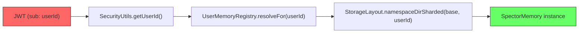
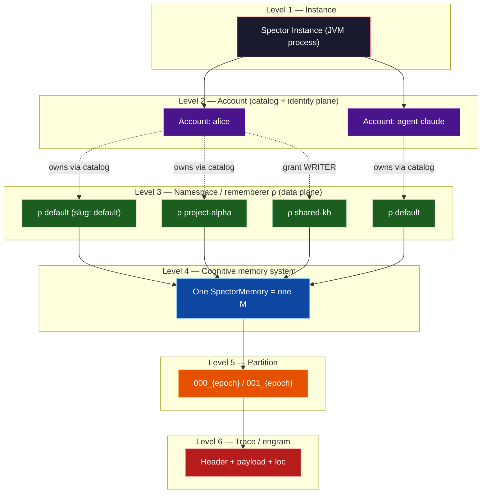

# ADR-0029-TIERS: Spector Memory Organization — 3-Plane Architecture (Catalog, Identity, Data)

| Field | Value |
|:---|:---|
| **Status** | Accepted (Implemented) |
| **Date** | 2026-08-30 |
| **Authors** | Spector Maintainers & Architecture Working Group |
| **Deciders** | Spector Technical Steering Committee (TSC) |
| **Supersedes** | ADR-0029 earlier drafts |
| **Superseded By** | None |
| **Last Verified** | 2026-09-16 (Verified against `main`) |

---

> **Author**: Technical Lead · **Date**: 2026-08-30 · **Status**: Proposal for TSC Review
> **ADR**: `adr-0029-spector-memory-organization-logical-tiers`
> **Supersedes**: Earlier drafts of this ADR (same number, same day)
>
> **Scope**: Organizational hierarchy for Spector Cognitive Memory from a single-namespace engine to enterprise. This revision separates three planes that the earlier drafts fused:
>
> 1. **Catalog plane** — principals, slugs, grants, org membership in the existing synapse JDBC/Flyway database (not JSON files)
> 2. **Identity plane** — soul stack in a small mmap bundle (not JSON-only, not inside `ρ`)
> 3. **Data plane** — the rememberer `ρ` (one `SpectorMemory`, one directory tree)

---

## 0. Invariants

These are not open questions. Implementation that violates them is out of spec.

1. **`ρ` = Namespace.** Account is a principal. Tenant is an organization. Grants are authorization. None of Account, Tenant, Grant, or Soul is part of memory state `M`.
2. **MF-001 NF3 / M10.** Persistence is shared-nothing per rememberer. A filter on a shared store is not isolation. Shared embedders and shared code are allowed. Shared traces are not.
3. **Slug ≠ directory name.** `namespaceId` is a globally unique immutable TSID and is the only identifier that names a data-plane directory. Slugs (`default`, `project-alpha`) are account-scoped aliases in the catalog.
4. **Three planes.** Catalog metadata lives in synapse JDBC. Identity lives in `identity.bundle`. Rememberers live in data-plane mmap trees. Kernel `NamespaceConfig` does not gain owner, grants, soul, or account fields.
5. **One engine per `ρ`.** The hot cache is keyed by `namespaceId` only. Two principals with grants on the same namespace share one mapped `SpectorMemory`. They do not each `build()` a writer on the same bundle.
6. **Client signals cannot widen a token.** JWT identifies the principal and an optional allow-set. Header, query, tool arg, and `namespace_switch` may only select inside that set. Fail `403`, never silent-fallback to `default`.
7. **`memory_recall` is one `M`.** Fan-out across rememberers is a different operation (`memory_federated_recall`), off by default, with an explicit budget. Scores from different `ρ` are not commensurate.
8. **No live-tree move.** Existing `namespaces/{shard}/{userId}/` directories *are* that account’s default rememberer. The catalog binds to them. Bundles are not relocated on first write.
9. **One primary soul per account, a stack of ancestor souls at bind.** `UserSoul` / `AgentSoul` is the account primary. `TenantSoul` and `OrgUnitSoul` compose at ingest/recall. A namespace never owns a `SoulContext`. Optional per-`ρ` bias is not a soul.
10. **Compose with floors, not last-write-wins.** Tenant compliance floors cannot be zeroed by user salience. Org expertise boosts. User persona modulates above the floor. Namespace bias is a soft tilt only.
11. **Two independent caps.** Catalog `maxNamespaces` limits rows. `maxHotNamespaces` limits mapped data-plane engines. Identity bundles are a third, cheaper FD class (one per hot account + one per hot tenant). Account *profile* sets the data-plane caps. Profile is packaging, not the identity model.
12. **Default rememberer is 1:1 with the account.** Every account has exactly one `DEFAULT` namespace. Its `namespaceId` equals `accountId` (legacy and new). Additional namespaces are optional context rememberers.
13. **Authorize regions by `RegionId`, never by offset/length.** Physical layout is private to the bundle wrapper. ABAC policies live in an external PDP. The in-process PEP caches decisions and never calls the auth server on the recall hot path.
14. **Trace grants ≠ soul grants.** `INJECT` on a soul region is not `READ` on any rememberer’s traces.
15. **Catalog is SQL, not JSON.** `AccountCatalog` is `JdbcAccountCatalog` on the existing H2 (OSS) / Postgres (enterprise) datasource. `account.json` / `slugs.json` / `grants.jsonl` are not a shipping target. `users.user_id` is `accountId`.

---

## 1. Problem Statement

Today namespace identity is fused with authentication identity:

```
JWT sub: "01JXYZ..." → userId → namespaceId → physical directory
```

`UserMemoryRegistry.resolveFor(userId)` builds exactly one `SpectorMemory` rooted at `StorageLayout.namespaceDirSharded(base, userId)` and documents a security property: client-supplied `namespace` / `workspace_id` / `agent_id` never change which memory is returned.

That 1:1 binding is the root cause. A single authenticated principal cannot own `work`, `personal`, and `project-alpha` as isolated rememberers; cannot share one rememberer with another principal; cannot lock an agent token to one project.

A second failure mode appeared in later drafts: putting soul, grants, and slugs *inside* the rememberer (or requiring a mapped `ρ` just to read `TenantSoul`). That spends the FD budget on identity and couples “who is scoring” to “what traces exist.”

This revision keeps 1:1 as the **default SKU** (every account still has exactly one `DEFAULT` `ρ`) and refuses 1:1 as the **architecture invariant**.

### Current flow



`userId` **is** `namespaceId`. No catalog. No slug. No grant. Soul is restored from that instance’s Insula region because instance ≡ person.

---

## 2. Organizational Levels

**“Tier” is reserved** for the four cognitive physics regimes in MF-001 and in `spector-memory` (Working, Episodic, Semantic, Procedural). Organizational containment is a **level** (or scope). Cognitive subsystems inside a namespace are not a containment level; they are documented in the memory architecture guides, not here.

### 2.1 Core — six levels



Dashed edges are catalog relations (ownership, grants). Solid edges below Level 3 are data-plane containment.

### 2.2 Enterprise — seven levels (+ optional OrgUnit)

Enterprise inserts **Tenant** between Instance and Account. Tenant is billing, KMS, residency, policy, and `TenantSoul`. It is not a brain region and it does not change the on-disk shape of a rememberer.

**OrgUnit** is catalog membership, not a persistence level. “Security audit” in a hospital is an org unit the account belongs to. It has an `OrgUnitSoul`. It is not a `ρ`.

```text
Instance
  └─ Tenant                 catalog + KMS + policy + TenantSoul
       └─ OrgUnit           catalog membership + OrgUnitSoul   (optional)
       └─ Account           catalog (principal) + primary soul
            └─ Grant        catalog (authz over a ρ or an identity region)
       └─ Namespace ρ       data plane (unchanged shape)
            └─ SpectorMemory
                 └─ Partition → Trace
```

### 2.3 Analogy (onboarding only — does not drive layout)

| Level | Database | Spector | MF-001 | Notes |
|:---:|:---|:---|:---|:---|
| 1 | Server | **Instance** | Process that owns the engine | Shared embedders and HAL are allowed |
| 2 | Role / login | **Account** | Principal, not `ρ` | JWT `sub` |
| — | Schema owner / org | **Tenant / OrgUnit** | Out of scope for `M` | Identity-plane souls live here |
| — | `GRANT` | **Grant** | Out of scope for `M` | Catalog + external PDP |
| 3 | Database | **Namespace** | Rememberer `ρ` | Isolation boundary |
| 4 | Storage engine | **SpectorMemory** | `M = (𝒯, 𝒜, Π, δ, ρ)` | One mapped engine per hot `ρ` |
| 5 | Partition | **Partition** | Physical independence (M4) | Existing `NNN_{epoch}` names stay |
| 6 | Row | **Trace / engram** | `T = (id, tier, payload, header, loc)` | Applications never see `loc` |

A Postgres schema is not a closed recall algebra. Do not design paths as if it were.

### 2.4 What lives at which scope

| State | Scope | Plane |
|---|---|---|
| Traces, WAL, graphs, indexes, partitions, daemons, kernel `namespace.json` | Namespace (`ρ`) | Data |
| Slug, type, status, description, catalog quotas, optional namespace *bias* | Namespace record | Catalog |
| Grants on traces; grants on identity regions | Catalog + external PDP | Catalog / auth |
| Primary soul, salience, AISME self-model, continuity | **Account** | Identity bundle |
| Tenant soul, compliance floors, org souls | **Tenant / OrgUnit** | Identity bundle |
| Active working set | **Session** | Request / MCP connection |
| Embedder, SIMD HAL, process lock | Instance | Process |
| KMS root, residency, legal-hold policy, audit sink | Tenant | Enterprise catalog |

Working *storage* may still occupy a region of `runtime.bundle`. The *active working set* for the current task is session-scoped so `namespace_switch` neither dumps the turn nor writes it into the wrong `ρ`. See §16.

---

## 2.5 Soul stack (identity rule)

Kernel fact, already shipped:

```text
SoulContext permits TenantSoul | OrgUnitSoul | AgentSoul | UserSoul
```

`SpectorMemoryBuilder` already takes a **primary** (`soul` / `agentSoul`) and a **stack** (`soulContexts`). AISME and `DreamPathway` consume both. `soulVersion` is stamped at encode so reflect can refusion when the stack that produced `I` has moved (`soulDriftRefusionEnabled`).

Identity is therefore already a list. This ADR says *where the list is stored* and *how it is assembled*. It does not add a fifth `SoulContext` called `NamespaceSoul`.

### 2.5.1 Who owns which soul

| Type | Lives on | Role in scoring |
|---|---|---|
| `TenantSoul` | Tenant identity bundle (`SOUL` + `POLICY`) | Floors and hard gates (`complianceRules`, `domainFocus`) |
| `OrgUnitSoul` | Tenant identity bundle directory entry | Additive expertise boost |
| `UserSoul` | Account identity bundle | Primary for humans — persona, salience |
| `AgentSoul` | Account identity bundle | Primary for agents — purpose, guardrails, emotional baseline |
| Namespace bias (optional) | Namespace *catalog* record, not `SoulContext` | Soft domain tilt for this `ρ` only |

```text
OSS individual
  stack   = [ UserSoul(alice) ]
  primary = alice
  bound ρ = default | project-alpha | personal-notes     ← traces only

Healthcare auditor
  stack   = [ TenantSoul(hospital), OrgUnitSoul(security-audit), UserSoul(auditor) ]
  primary = auditor
  bound ρ = patient-records | audit-findings | research   ← traces only
```

Switching `ρ` changes traces and optional bias. It does not change who is scoring.

### 2.5.2 Composition law (accumulate with floors)

Last-write-wins is forbidden for tenant policy.

| Layer | `I` / valence / arousal | Can the inner layer cancel it? |
|---|---|---|
| `TenantSoul` | Floors and hard gates | **No** |
| `OrgUnitSoul` | Additive expertise vs `identityEmbedding` | No vs tenant; yes vs sibling orgs |
| `UserSoul` / `AgentSoul` | Persona, salience, emotional baseline | Only above the tenant floor |
| Namespace bias | Soft domain tilt | Soft only; not a soul |

Worked ingest: “failed access review on Ward B.”

- Tenant: compliance tag → `I` floor high
- Org (security audit): expertise embedding aligns → boost
- User: this auditor’s salience → small extra
- `ρ = audit-findings`: optional bias toward control-failure tags → small extra

Header stores `I` plus `soulVersion = mix(tenant.ver, org.ver, user.ver)` so a later tenant rule change can trigger refusion. OSS individual: stack length 1, mix is identity, same code path.

Scoring math stays in `DefaultImportanceProvider` / AISME. This ADR only specifies **which** `SoulContext`s the builder receives.

### 2.5.3 Why soul is not stored in the rememberer

If `TenantSoul` lives in a tenant *data* `ρ` (or in Region 24 of every employee `ρ`):

- Scoring a `remember()` into `audit-findings` would mmap tenant `ρ` + org `ρ` + user `ρ` + target `ρ` (up to four engines, ~60 FDs) just to read identity.
- A grant on that tenant `ρ` would mean both “use hospital scoring floors” and “read hospital traces.” Those must not be the same permission.
- Sharing a knowledge-base `ρ` with a contractor would put the hospital soul in the same isolation unit as the traces.

Region 24 on `runtime.bundle` may remain allocated. After this ADR it is not authoritative. See §23.

### 2.5.4 Bind sequence (identity injection)

```text
authenticate → accountId, tenantId, orgUnitIds
select ρ
authorize TRACE grant on ρ
stack = identityPlane.soulsFor(tenantId, orgUnitIds, accountId)   # INJECT only
        # PEP checks identity-region grants; does not open any data-plane ρ
primary = account.soul
open ρ                               # one hot data-plane engine
inject stack + primary + account salience + optional namespace bias
remember / recall / dream use builder.soulContexts as they already do
self-model writes → account identity.bundle, never Region 24
tenant / org writes → tenant identity.bundle, never into ρ
```

Shared `ρ`: the trace store is shared; the stack is the *requester’s*. Two auditors from two orgs reading the same KB score with different org souls and the same tenant floor. That is correct.

Concurrent dreams on two of alice’s namespaces serialize self-model writes on the account identity lock. Trace writes stay per-`ρ` and do not take that lock.

### 2.5.5 One namespace per user is a SKU, not the fix

1:1 (`DEFAULT` only) is the right default product. It is a bad architecture invariant:

- Tags are not M10 isolation. Work and personal in one `M` share one graph, one decay clock, one dream.
- Sharing becomes all-or-nothing.
- Compliance delete / legal hold / restore cannot split work from personal.
- Agents serving many customers in one `ρ` mix those customers.

Soul stacking does **not** require N namespaces. N namespaces do **not** require N souls. Do not solve contamination by forcing humans to one folder, and do not solve soul drift by minting a soul per folder.

### 2.5.6 NamespaceBias × ICNU (C2)

`DefaultImportanceProvider` and ICNU weights stay kernel-pure. `NamespaceBias` never becomes an ICNU input and is not applied inside `SynapticTagTransductionRelay`.

At bind, synapse builds a **request-scoped salience overlay** and passes it through the existing `RememberPathway.setSalienceProfile` / recall salience hook:

```text
salience_bound = salience_account ⋉ bias_namespace

(A ⋉ B):
  interestDomains = unique(A.interestDomains ∪ B.domainFocus)
  for tag t in B.tagWeights:
      A.interestWeight[t] ← clamp(A.interestWeight[t] * (1 + B.tagWeights[t]), 0, 1)
```

`domainFocus` entries with no tag weight get interest weight `1.0` unless the account profile already set one (account wins on conflict for the same domain; bias may only *add* domains, not delete account domains).

One-liner Forge should implement:

```text
I_stored = I_ICNU(cue, soulStack, traces)           # unchanged provider
I_used   = clamp(I_stored * (1 + s_interest), 0, 1) # existing salience path
s_interest = salience_bound.score(cue.tags, cue.embedding)
```

Bias is therefore **an adjustment to the salience profile’s interest domains at bind time**, which already modulates post-ICNU `I_used`. It is not a second ICNU term and not a tag-transduction rewrite.

Rules:

- Overlay is request-scoped. It is **not** written back to the account `SALIENCE` region.
- Tenant POLICY floors apply to `I_stored` / hard gates *before* this multiplier. Bias cannot punch through a tenant floor (and cannot zero it).
- Empty bias ⇒ `salience_bound = salience_account`.
- Recall uses the same `salience_bound` so ingest and retrieve agree.

---

## 2.6 Account profiles (packaging, not identity)

`PrincipalKind` is `HUMAN | AGENT | SERVICE`. A **profile** assigns default quotas and feature flags. A tenant plan may raise them. A consumer SKU may hide the namespace selector. None of that changes §2.5.

| Profile | Who | `maxNamespaces` | `maxHotNamespaces` | Multi-namespace UX | Federation default | Sharing default |
|---|---|---|---|---|---|---|
| `HUMAN_SOLO` | OSS individual | **4** | 2 | on, selector visible | off | owner-only (no grant APIs) |
| `HUMAN_TEAM` | human in a tenant | **16** | 4 | on | off | grants on |
| `AGENT` | agent identity | **64** | 4 | on; tokens usually ns-locked | off | owner-only unless tenant policy |
| `SERVICE` | automation / integration | **256** or −1 | 8 | on | opt-in | grants on |
| `UNLIMITED` | ops / on-prem | −1 | process cap only | on | opt-in | grants on |

Recommended defaults for OSS: new human accounts are `HUMAN_SOLO` (4 contexts, 2 hot). That is enough for `default` + a few projects. It is **not** 1.

A `1 namespace` mode is a **SKU flag**, not an architecture:

```text
AccountFlags.multiNamespace   default true for every profile except an explicit consumer SKU
AccountFlags.sharing
AccountFlags.federation
```

If product later wants “personal Spector = one folder,” flip `multiNamespace=false` on `HUMAN_SOLO`. The catalog, data plane, and soul rule stay the same. Do not encode that SKU as `maxNamespaces=1` in the kernel.

`NamespaceType.DEFAULT` is unique per account. Creating a second `DEFAULT` is a catalog error. Context namespaces are `PROJECT`, `AGENT`, `SHARED`, or `ARCHIVE`.

---

## 3. Identifiers

Three identifiers, not two.

| ID | Form | Unique in | Mutable | Names a directory? |
|---|---|---|---|---|
| `accountId` | JWT `sub` TSID | instance (OSS) / tenant (enterprise) | no | Catalog + identity plane |
| `namespaceId` | TSID | instance (OSS) / **tenant** (enterprise) | no | **Yes** — OSS `namespaces/{shard}/{id}/`; enterprise via `namespaceRoot(tid, id)` |
| `slug` | `default`, `project-alpha` | `(accountId, slug)` | yes | **No** |

Resolution is always:

```text
(accountId, slug | namespaceId)  →  catalog  →  namespaceId  →  data-plane path  →  SpectorMemory
```

Two accounts may both use slug `default`. Their rememberers have different `namespaceId`s. Legacy users bind slug `default` to `namespaceId = accountId` so the directory that already exists under that TSID does not move.

### 3.1 Identifier grammar

Close the live mismatch (`StorageLayout.MAX_NAMESPACE_ID_LENGTH = 256` vs `NamespaceConfig.MAX_ID_LENGTH = 63`):

- **Slugs**: 1–63 chars, `^[A-Za-z0-9][A-Za-z0-9_-]*$`. No `.`, `/`, `\`, C0. This is the `NamespaceConfig.isValidSegment` rule, applied to slugs only.
- **TSIDs** (`accountId`, `namespaceId`, `tenantId`, `orgUnitId`): existing TSID alphabet, validated by `StorageLayout.validateNamespaceId` before any *data-plane* path is resolved.
- Logs, metrics, Quartz job names, cache keys, encryptor key ids for traces use `namespaceId` (enterprise FQN `tenantId/namespaceId`). Slugs are display and request input only.

Do not reuse the bare string `default` as both anonymous principal id (`UserMemoryRegistry.DEFAULT_USER_ID`) and a slug without a qualifier in logs: `acct:default` vs `slug:default` vs `ns:{tsid}`.

---

## 4. Three Planes

### 4.1 Why this split exists

- `SpectorNamespaceManager` and `NamespaceRegistry` already key live maps by a single `namespaceId`. Account-scoped slugs as directory names collide `default` across accounts and double-open shared namespaces.
- `StorageLayout.namespaceDirSharded` and `tenantNamespaceDirSharded` already exist. `ShardedNamespaceMigrator` already moved installations onto `namespaces/XX/YY/{id}/`. A second nesting under `accounts/.../namespaces/{slug}/` is another migration of live mmap files.
- Sharing a rememberer must not require reading or moving a tree out from under the owner’s account directory. Ownership is a catalog row. Bytes stay at `namespaceId`.
- Identity must be readable without mapping a rememberer. Putting `TenantSoul` in a data-plane `ρ` spends ~15 FDs per ancestor soul on every ingest.
- Synapse already has JDBC + Flyway + H2 (`spector-data/db/synapse`) for users, API keys, refresh tokens, credentials, routes, and analytics. Catalog rows belong in that database. A parallel JSON tree would be a second source of truth next to `users.user_id`.
- If grants and slugs live inside `runtime.bundle`’s sibling `namespace.json`, replacing the catalog later becomes a data-plane migration. Identity bundles stay mmap regardless.

### 4.2 Core layout

```text
basePath/                                # SPECTOR_DATA_DIR  (e.g. ./spector-data)
├── version                              # data-plane layout version
├── db/
│   └── synapse.mv.db                    # CATALOG + AUTH  (existing H2; Flyway)
├── accounts/                            # IDENTITY PLANE only
│   └── {aa}/{bb}/{accountId}/
│       └── identity.bundle              # UserSoul / AgentSoul + salience + continuity
├── tenants/                             # IDENTITY + POLICY (OSS single-tenant may omit)
│   └── {tt}/{uu}/{tenantId}/
│       └── identity.bundle              # TenantSoul + OrgUnitSoul directory
└── namespaces/                          # DATA PLANE  (unchanged root)
    └── {xx}/{yy}/{namespaceId}/
        ├── namespace.json               # kernel NamespaceConfig only
        ├── runtime/runtime.bundle
        ├── wal/
        └── partitions/
            └── {seq}_{epoch}/partition.bundle
```

Shard function for identity and data-plane trees remains SHA-256 prefix, 2 × 2 hex chars (65,536 buckets), already implemented.

`StorageLayout` additions are identity resolvers plus a data-plane resolver that **already exists**:

```text
accountIdentityBundle(base, accountId)       # identity plane
tenantIdentityBundle(base, tenantId)         # identity plane
namespaceDirSharded(base, namespaceId)       # data plane — EXISTING
```

Catalog paths are JDBC URLs, not `StorageLayout` helpers. Synapse already uses:

```text
jdbc:h2:file:${spector.data-dir}/db/synapse;DB_CLOSE_DELAY=-1;AUTO_SERVER=TRUE
```

There is no `accountNamespaceDir(base, accountId, slug)` for mmap data. That helper is how the previous draft fused the planes.

### 4.3 Enterprise layout

```text
dataRoot/
├── version
├── global/
│   ├── .keys/                           # tenant-wrapping KMS material
│   └── catalog/                         # unused if synapse JDBC is the catalog (preferred)
└── tenants/
    └── {tt}/{uu}/{tenantId}/
        ├── identity.bundle              # TenantSoul, POLICY, org souls
        ├── accounts/
        │   └── {aa}/{bb}/{accountId}/
        │       └── identity.bundle      # catalog rows live in JDBC, not here
        └── namespaces/                  # DATA PLANE (tenant-rooted, existing)
            └── {xx}/{yy}/{namespaceId}/
```

**Enterprise data plane is not flattened** to a global `dataRoot/namespaces/`. That picture is OSS-only (`basePath/namespaces/...`). Enterprise keeps the existing tenant-rooted resolver:

```text
EnterpriseDataLayout.namespaceRoot(tenantId, namespaceId)
  → tenants/{tt}/{uu}/{tenantId}/namespaces/{xx}/{yy}/{namespaceId}/
```

Callers never concatenate seven segments. `namespaceId` remains unique *within a tenant* (OSS: unique on the instance). The catalog row always stores `tenantId` + `namespaceId`.

KMS wrap id is `tenantId/namespaceId`, not bare `namespaceId`. Unwrapping a bundle: layout answers the path from `(tenantId, namespaceId)`; KMS answers the tenant KEK from `tenantId`; data DEK unwrap uses the TRACE grant for that pair. A globally unique TSID is allowed but not required; do not rely on “one TSID space across tenants” to find a file.

Encryption: data-plane key id = `namespaceId`. Identity-plane key id = `accountId` or `tenantId`. Sharing a project wraps the *data* key. It does not wrap the account soul. Protocol: §18 and §23.5.

Snapshots stay per rememberer: `basePath/snapshots/{namespaceId}/{snapshotId}/` (existing `StorageLayout.snapshotDir`). Backup / restore unit is `ρ`, never the account tree. Restoring one project must not restore another project’s traces or the account soul. Identity bundles are snapshotted separately, on demand.

### 4.4 Kernel `NamespaceConfig` stays stupid

Current record, unchanged:

```java
public record NamespaceConfig(
        String id,             // namespaceId (TSID), not a slug
        String displayName,
        long maxMemories,
        int maxPartitions,
        long maxStorageBytes,
        boolean readOnly
) {
    public static final NamespaceConfig DEFAULT =
            new NamespaceConfig("default", "Default Namespace", -1, -1, -1, false);
}
```

`ARCHIVE` in the catalog sets `readOnly = true` and tells the registry not to schedule daemons. It is not a new kernel field.

`SpectorNamespaceManager` continues to discover data-plane directories and enforce kernel quotas. It does not learn about accounts or souls. Discovery keys must be `namespaceId` (already true). Slug collision therefore cannot occur in the kernel map.

---

## 5. Catalog Types (synapse)

```java
public enum PrincipalKind { HUMAN, AGENT, SERVICE }

public enum AccountProfile { HUMAN_SOLO, HUMAN_TEAM, AGENT, SERVICE, UNLIMITED }

public record AccountFlags(
        boolean multiNamespace,        // SKU: hide selector when false
        boolean sharing,
        boolean federation
) {}

public record AccountQuotas(
        int maxNamespaces,
        int maxHotNamespaces,
        long maxTotalStorageBytes,
        long maxTotalMemories
) {}

public record Account(
        String id,
        PrincipalKind kind,
        AccountProfile profile,
        String displayName,
        AccountQuotas quotas,
        AccountFlags flags,
        String defaultNamespaceId,     // TSID; always == id for the DEFAULT ρ
        Instant createdAt
) {}

public enum NamespaceType { DEFAULT, PROJECT, AGENT, SHARED, ARCHIVE }

public enum NamespaceStatus { ACTIVE, TOMBSTONED, ARCHIVED, LEGAL_HOLD }

public record NamespaceRecord(
        String namespaceId,            // TSID
        String slug,                   // account-scoped
        String ownerAccountId,
        NamespaceType type,
        NamespaceStatus status,
        String displayName,
        String description,
        NamespaceBias bias,            // nullable; NOT a SoulContext
        Instant createdAt,
        Instant lastAccessedAt
) {}

public record NamespaceBias(
        List<String> domainFocus,
        Map<String, Float> tagWeights
) {}

public record OrgUnit(
        String orgUnitId,
        String tenantId,
        String name,
        List<String> memberAccountIds   // catalog is authoritative; see §15
) {}

public enum GrantRole { OWNER, ADMIN, WRITER, READER }

public enum GrantAction { READ, WRITE, ADMIN, INJECT }

public enum GrantObjectType { NAMESPACE, IDENTITY_BUNDLE, IDENTITY_REGION }

public enum PrincipalType { ACCOUNT, GROUP, SERVICE }

public record GrantConstraints(
        Set<String> tierMask,          // empty = all cognitive tiers
        String tagPrefix,              // nullable; restrict remember/recall tags
        Set<String> operations,        // nullable; subset of remember,recall,forget,...
        Set<String> regionIds          // nullable; IDENTITY_REGION only
) {}

public record Grant(
        String grantId,
        GrantObjectType objectType,
        String objectId,               // namespaceId | bundleId (accountId/tenantId)
        String principalId,
        PrincipalType principalType,
        GrantRole role,                // used when objectType == NAMESPACE
        Set<GrantAction> actions,      // used when objectType != NAMESPACE
        String grantedBy,
        Instant grantedAt,
        Instant expiresAt,             // nullable; null = no expiry
        GrantConstraints constraints   // nullable
) {}

public record RequestMemoryContext(
        String tenantId,               // nullable on OSS
        List<String> orgUnitIds,
        String accountId,
        String namespaceId,
        String slug,
        GrantRole role,
        Set<String> allowSet,          // from token; empty = all granted
        String sessionId,              // nullable; MCP connection id
        List<SoulContext> soulStack,   // assembled at bind; primary last
        SoulContext primarySoul
) {}
```

Phase 1 persists only implicit `OWNER` grants on the default `ρ` and implicit `INJECT` on the account’s own identity bundle. The `Grant` type ships in Phase 1 so Phase 5 does not migrate `namespace.json`.

Grant semantics:

- Exactly one `OWNER` per `ρ`. Ownership transfer is revoke+add under the account lock, not a directory move.
- `ADMIN` may mint/revoke grants except OWNER transfer.
- `expiresAt` in the past ⇒ treat as absent. Sweep is lazy on `authorize()` plus a catalog janitor.
- `GROUP` principals resolve through a tenant group directory (enterprise). OSS ignores `GROUP` rows.
- Constraints are intersected with the role (cannot grant `remember` to a `READER`).
- `INJECT` on `IDENTITY_REGION(SOUL)` does not imply `READ` on any `NAMESPACE`.
- Revoke of a trace grant does not delete traces. It drops authorization and, if encryption is on, unwraps the grantee’s copy of the data key (§18).

`LEGAL_HOLD` blocks physical GC. Default slug may be **reset**, never deleted.

Default identity grants (no extra rows):

| Subject | Object | Actions |
|---|---|---|
| account owner | own `identity.bundle` | READ, WRITE, ADMIN, INJECT |
| tenant member | tenant `identity.bundle` region `SOUL`, `POLICY` | **INJECT** only |
| org member | that org’s `SOUL` slice | INJECT |

### 5.1 AccountCatalog SPI

```java
public interface AccountCatalog {
    Account getOrCreateAccount(String accountId);
    Account getAccount(String accountId);

    NamespaceRecord createNamespace(String accountId, String slug, NamespaceType type);
    Optional<NamespaceRecord> resolve(String accountId, String slugOrId);
    List<NamespaceRecord> listAccessible(String accountId);   // owned + granted
    void setDefaultNamespace(String accountId, String namespaceId);

    void addGrant(Grant grant);
    void revokeGrant(String grantId);
    Optional<Grant> authorize(String accountId, String namespaceId, GrantRole minimum);
    boolean authorizeIdentity(String accountId, String bundleId, String regionId, GrantAction action);

    void tombstone(String accountId, String namespaceId);
    void recordAccess(String namespaceId);
}
```

Default implementation: `JdbcAccountCatalog` on the existing synapse `DataSource` (§5.2). No caller outside the catalog talks to JSON account files — those files are not shipped.

Identity *bytes* are not the catalog. They live in `identity.bundle` behind `IdentityBundle` (§23). The catalog only answers “may this principal INJECT this region?”

### 5.2 JDBC catalog (shipping implementation)

Synapse already paid for this stack (`pom.xml`: `spring-boot-starter-jdbc`, `h2`, `flyway-core`; `application.yml` datasource; migrations `V1`–`V5`; SQL under `sql/users`, `sql/auth`, `sql/credentials`, …). Catalog is Flyway `V6`, not a new database product.

```text
OSS          jdbc:h2:file:${spector.data-dir}/db/synapse
Enterprise   jdbc:postgresql://…     same migrations, same SPI
SQLite       not used — would be a third dialect next to H2 + Postgres
```

`users.user_id` (V3, 13-char TSID, JWT `sub`) **is** `accountId`. Do not create a parallel identity table. Extend `users` (or a 1:1 `accounts` row keyed by `user_id`) with profile / flags / default namespace.

```sql
-- V6__memory_catalog.sql  (illustrative)

ALTER TABLE users ADD COLUMN profile VARCHAR(32) NOT NULL DEFAULT 'HUMAN_SOLO';
ALTER TABLE users ADD COLUMN kind VARCHAR(16) NOT NULL DEFAULT 'HUMAN';
ALTER TABLE users ADD COLUMN flags VARCHAR(256) NOT NULL DEFAULT '{}';
ALTER TABLE users ADD COLUMN default_namespace_id VARCHAR(13);
ALTER TABLE users ADD COLUMN max_namespaces INT;
ALTER TABLE users ADD COLUMN max_hot_namespaces INT;
ALTER TABLE users ADD COLUMN membership_version BIGINT NOT NULL DEFAULT 0;

CREATE TABLE namespaces (
    namespace_id       VARCHAR(13)  NOT NULL,
    owner_account_id   VARCHAR(13)  NOT NULL,
    slug               VARCHAR(63)  NOT NULL,
    type               VARCHAR(16)  NOT NULL,
    status             VARCHAR(16)  NOT NULL,
    display_name       VARCHAR(255),
    description        VARCHAR(2048),
    bias_json          VARCHAR(4096),
    created_at         TIMESTAMP    NOT NULL,
    last_accessed_at   TIMESTAMP,
    PRIMARY KEY (namespace_id),
    CONSTRAINT uq_namespaces_owner_slug UNIQUE (owner_account_id, slug),
    CONSTRAINT fk_namespaces_owner FOREIGN KEY (owner_account_id) REFERENCES users (user_id)
);

CREATE TABLE grants (
    grant_id         VARCHAR(13)  NOT NULL,
    object_type      VARCHAR(32)  NOT NULL,   -- NAMESPACE | IDENTITY_BUNDLE | IDENTITY_REGION
    object_id        VARCHAR(64)  NOT NULL,
    principal_id     VARCHAR(13)  NOT NULL,
    principal_type   VARCHAR(16)  NOT NULL,
    role             VARCHAR(16),
    actions          VARCHAR(128),
    granted_by       VARCHAR(13)  NOT NULL,
    granted_at       TIMESTAMP    NOT NULL,
    expires_at       TIMESTAMP,
    revoked_at       TIMESTAMP,
    constraints_json VARCHAR(2048),
    PRIMARY KEY (grant_id)
);
CREATE INDEX idx_grants_object ON grants (object_type, object_id);
CREATE INDEX idx_grants_principal ON grants (principal_id);

CREATE TABLE org_units (
    org_unit_id  VARCHAR(13) NOT NULL,
    tenant_id    VARCHAR(13) NOT NULL,
    name         VARCHAR(255) NOT NULL,
    PRIMARY KEY (org_unit_id)
);

CREATE TABLE org_unit_members (
    org_unit_id  VARCHAR(13) NOT NULL,
    account_id   VARCHAR(13) NOT NULL,
    PRIMARY KEY (org_unit_id, account_id),
    CONSTRAINT fk_oum_org FOREIGN KEY (org_unit_id) REFERENCES org_units (org_unit_id),
    CONSTRAINT fk_oum_acct FOREIGN KEY (account_id) REFERENCES users (user_id)
);
```

Revoke is `UPDATE grants SET revoked_at = now()`. There is no `grants.jsonl` and no compaction protocol.

`authorize` / `listAccessible` / slug uniqueness are indexed SQL. PEP `membershipVersion` is `users.membership_version`, incremented on org-member change.

Test fakes may implement `AccountCatalog` in-memory. A file-backed catalog is not required for OSS.

---

## 6. Resolution

### 6.1 Chain

```text
1. Authenticate
     token.sub  → accountId
     token.tid? → tenantId
     token.org? → orgUnitIds
     token.ns / token.nsid → allow-set (optional lock)
2. Select (only inside the allow-set)
     HTTP:  X-Spector-Namespace  >  ?namespace=  >  account.defaultNamespaceId
     MCP:   tool.namespace       >  connection default  >  account.defaultNamespaceId
3. Authorize TRACE
     catalog.authorize(accountId, namespaceId, minimumRole)
4. Assemble soul stack
     identityPlane.soulsFor(tenant, orgs, account)   # PEP + cached PDP
5. Bind
     NamespaceRegistry.getOrOpen(namespaceId, () -> build(dir, soulStack))
```

Selection signals never beat the token allow-set. A namespace-locked agent token that names another slug returns `403 TokenNamespaceLocked`. A missing or tombstoned target returns `404` / `NamespaceTombstoned`, not `default`.

This preserves today’s security property in the only form that still makes sense once clients *are* allowed to name a namespace: **the client may narrow, never widen.**

### 6.2 Session default

`namespace_switch` sets the default on the **MCP session / SecurityContext**, not on a `ThreadLocal`. Synapse uses virtual threads and streamable HTTP; a carrier-thread local will leak across pooled workers and die across hops.

- Connection-scoped. Dies with the session.
- Does not persist unless the client calls `namespace_set_default` (catalog update of `account.defaultNamespaceId`).
- Does not apply to stateless REST (REST has no session default; header or account default only).

### 6.3 Registry

Replace `UserMemoryRegistry`’s 1:1 `userId → SpectorMemory` with a façade that:

1. Builds `RequestMemoryContext` via the chain above (including soul stack).
2. Calls existing `NamespaceRegistry.getOrOpen(namespaceId, opener)`.
3. Injects the stack + account salience into the instance (read-mostly).
4. Acquires a lease for the duration of the request.

Do not introduce `ConcurrentHashMap<accountId, Map<slug, SpectorMemory>>`. That double-maps a shared `ρ` and treats slugs as cache keys.

Reuse kernel lease-aware LRU (`DefaultSpectorMemory.hasActiveLeases()`). Synapse’s current last-resolve-time eviction has no lease check; aligning it is part of this ADR.

Caps:

| Cap | Default | Enforced at |
|---|---|---|
| `maxNamespaces` per account | 16 human / 64 agent | `AccountCatalog.createNamespace` |
| `maxHotNamespaces` per account | 4 | registry, before `getOrOpen` |
| `maxTotalInstances` process | keep `spector.auth.memory.max-instances` (512) | registry |
| Data-plane FD budget | existing `NamespaceRegistry` diagnostic (~15 FD / hot `ρ`) | process |
| Identity FD budget | 1 per hot account + 1 per hot tenant | identity cache |

Cold namespaces exist in the catalog and on disk. They are not mapped. Opening one when the hot cap is exhausted evicts an idle leased-zero instance or fails with `NamespaceHotCapExceeded`.

Quartz / reflect / dream jobs are addressed by `namespaceId`. Opening a `ρ` must not start an unsupervised daemon set if the process-wide daemon budget is exhausted.

---

## 7. Cross-rememberer operations

`memory_recall` remains `R(C, M)` over one `M`. A comma list or `"*"` on that tool is rejected.

Federated recall is a later, separate tool:

```text
memory_federated_recall
  namespaces: [slug | id, ...] | "granted"
  requires: account.quotas.federationEnabled
            AND each target ρ allows federation
  budget:   maxNamespaces, maxColdOpens, timeoutMs
  result:   hits annotated with namespaceId, slug, role
  merge:    per-ρ rank preserved; any global order is labeled heuristic
  failure:  partial (opened / skippedCold / denied)
```

No Hebbian / temporal / hyperedge walk across `ρ` (MF-001 NF4: association endpoints are traces in the same rememberer). Graph structure is not a join key.

This tool does not ship in the same phase as `namespace_switch`.

---

## 8. APIs

Keep `/api/v1`. Default-namespace fallback is real compatibility. A v2 bump is not justified.

### 8.1 REST (catalog)

| Method | Endpoint | Role | Notes |
|:---|:---|:---|:---|
| `GET` | `/api/v1/namespaces` | any | Owned + granted; catalog only, no mmap |
| `POST` | `/api/v1/namespaces` | owner-of-account | Body has `slug`, not `id` |
| `GET` | `/api/v1/namespaces/{slugOrId}` | READER+ | Stats from catalog counters; live stats only if hot |
| `PUT` | `/api/v1/namespaces/{slugOrId}` | ADMIN+ | Display name, type, description, bias |
| `DELETE` | `/api/v1/namespaces/{slugOrId}` | OWNER | Tombstone; default slug rejected |
| `POST` | `/api/v1/namespaces/{slugOrId}/reset` | OWNER | Allowed on default slug |
| `POST` | `/api/v1/namespaces/{slugOrId}/grants` | ADMIN+ | Phase 5; TRACE grants |
| `DELETE` | `/api/v1/namespaces/{slugOrId}/grants/{grantId}` | ADMIN+ | Phase 5 |
| `PUT` | `/api/v1/account/default-namespace` | OWNER | Persist session-less default |
| `GET` | `/api/v1/account/soul` | owner | Decoded primary soul DTO (copy, not a segment) |
| `PUT` | `/api/v1/account/soul` | owner | Writes account identity.bundle |

Memory endpoints unchanged in shape. They read `RequestMemoryContext`. Missing selector ⇒ account default `ρ`.

### 8.2 MCP tools

| Tool | Plane | Notes |
|---|---|---|
| `namespace_list` | catalog | |
| `namespace_create` | catalog | |
| `namespace_info` | catalog | |
| `namespace_switch` | session | Not durable |
| `namespace_set_default` | catalog | Durable |
| `namespace_delete` | catalog | Soft-delete |
| `namespace_grant` / `namespace_revoke` | catalog | Phase 5 |
| `soul_get` / `soul_set` | identity | Account primary only |

Existing memory tools gain an optional `namespace` argument (slug or id). Omitted ⇒ connection default ⇒ account default. They do not accept `"*"`.

---

## 9. Compatibility and migration

Existing on-disk rememberer:

```text
namespaces/{xx}/{yy}/{userId}/     # userId is the JWT sub TSID
```

On first authenticated request after upgrade:

1. `AccountCatalog.getOrCreateAccount(userId)` with profile from token / tenant default (`HUMAN_SOLO` on OSS)
2. If no slug map: insert `slug=default → namespaceId=userId`, `defaultNamespaceId=userId`, implicit OWNER grant
3. Data-plane path is the directory that already exists
4. If account `identity.bundle` has empty `SOUL` and the default data bundle has Region 24 bytes, copy them into the identity bundle (§23.6)
5. `SpectorMemory` opens exactly as `UserMemoryRegistry` does today, with stack length 1

**New accounts** use the same rule: `DEFAULT` rememberer is created with `namespaceId = accountId` at `namespaces/{shard}/{accountId}/`. Context namespaces always allocate a fresh TSID. No special case between “legacy” and “new” for the default `ρ`.

New *context* namespaces allocate a new TSID and create `namespaces/{shard}/{newId}/`. No bytes move from the default directory.

| Phase | Strategy |
|---|---|
| Detect | Catalog row missing but data-plane dir exists at `namespaceDirSharded(base, userId)` |
| Bind | Write catalog + identity bundle only |
| Dual-read of **data** | Not required |
| Dual-read of **catalog** | Missing catalog ⇒ bind on demand |
| CLI | Optional backfill of catalog rows for idle accounts |
| Deprecate | Nothing to deprecate on the data plane |

Catalog schema version is Flyway (`V6`, …). `basePath/version` records **data-plane** layout only. Do not bump it when a catalog column is added.

Auth disabled / anonymous principal continues to use the single shared `SpectorMemory` bean. Multi-namespace requires auth.

---

## 10. Decisions

| # | Decision |
|---|---|
| **Q1** | Slugs are account-scoped. `namespaceId` is globally unique and immutable. Data plane is `namespaces/{shard}/{namespaceId}/`. |
| **Q2** | Federated recall is off by default, a separate tool, with budgets. `memory_recall` stays one `ρ`. |
| **Q3** | `Grant` lives in the catalog from Phase 1 (OWNER + implicit INJECT). Grant/revoke APIs ship later. Kernel `NamespaceConfig` does not carry ACL. |
| **Q4** | Quota is an **account profile** (`HUMAN_SOLO` 4/2, `HUMAN_TEAM` 16/4, `AGENT` 64/4, `SERVICE` 256/8) plus process-wide 512 hot. Not `maxNamespaces = 1` for humans. Effective cap is `min(tenant, account, namespace)` (§17). |
| **Q5** | Soft-delete. Default slug cannot be deleted (reset only). `LEGAL_HOLD` blocks GC. Physical delete is retention/admin. |
| **Q6** | Token allow-set beats every client signal. |
| **Q7** | Hot cache keyed by `namespaceId`. One engine per `ρ`. |
| **Q8** | Primary soul on the account identity bundle. Ancestor souls on tenant/org identity bundles. Injected as `soulContexts` at bind. |
| **Q9** | No live-tree move. Catalog and identity plane are additive. |
| **Q10** | Session state is connection-scoped, not `ThreadLocal`. Stay on `/api/v1`. |
| **Q11** | A 1-namespace human SKU is `flags.multiNamespace=false`, not an identity rule. |
| **Q12** | Identity is an mmap bundle with regions, not a pile of long-lived JSON files and not a data-plane `ρ`. |
| **Q13** | Region authorization is ABAC on `(bundleId, RegionId, action)` via external PDP + in-process PEP cache. Never `(offset, length)`. |
| **Q14** | Composition law is accumulate-with-floors. Tenant POLICY cannot be zeroed by user salience. |
| **Q15** | `INJECT` ≠ `READ` traces. Soul grants and trace grants are different objects. |
| **Q16** | `NamespaceBias` is a bind-time salience overlay. ICNU is unchanged. Formula: §2.5.6. |
| **Q17** | Catalog org membership is authoritative. `token.org` only narrows. |
| **Q18** | Enterprise data plane stays tenant-rooted. KMS wrap id = `tenantId/namespaceId`. |
| **Q19** | REST bind is Filter + `RequestAttributes`, not `@RequestScope`, not `ThreadLocal`. |
| **Q20** | Catalog is `JdbcAccountCatalog` on the existing synapse datasource (H2 OSS / Postgres enterprise). No `account.json` / `slugs.json` / `grants.jsonl`. No SQLite. |

---

## 11. Impact

| Module | Change |
|---|---|
| `spector-memory` | `StorageLayout`: identity + existing data-plane helpers only (no catalog JSON paths). `NamespaceConfig` **unchanged**. Registry keeps `namespaceId` keys. Builder already accepts `soul` + `soulContexts` — synapse must pass them. Importance path must read the full stack (dream/AISME already do). |
| `spector-synapse` | `JdbcAccountCatalog` (Flyway `V6`) + `IdentityBundle` + `NamespaceResolver` + PEP cache. `UserMemoryRegistry` becomes a façade. `McpRequestMemory` holds `RequestMemoryContext` + leased engine on the connection, not `ThreadLocal`. Keys switch from `userId` to `namespaceId`. |
| MCP | Optional `namespace` on existing tools. New `namespace_*` and `soul_*` tools. No `"*"` on recall. |
| Enterprise | Same `JdbcAccountCatalog`, Postgres URL. Tenant/org identity bundles. External PDP. `EnterpriseDataLayout` answers identity + `namespaceRoot` only. |
| Cortex | Namespace selector bound to slugs; soul editor talks to `/account/soul`. |

### Backward compatibility

| Scenario | Behavior |
|---|---|
| Existing single-namespace user | Catalog bind `default → userId`. Same directory. Stack length 1. Zero API change. |
| MCP tools without `namespace` | Account default `ρ`. |
| REST without header | Account default `ρ`. |
| `spector.auth.enabled=false` | Shared bean, unchanged. |
| On-disk data bundles | Untouched. Region 24 copied once if sidecar empty. |

---

## 12. Phases

| Phase | Ship | Explicitly out |
|---|---|---|
| **0** | This ADR. Types. `AccountCatalog` SPI. Identity region enum. Failure codes. | `accountNamespaceDir` for data; offset-based PDP |
| **1** | Flyway `V6` + `JdbcAccountCatalog`. Bind legacy dirs. `resolve(account, slug)`. Hot cache by `namespaceId`. Implicit OWNER. | Tree move, grant APIs, federation, file JSON catalog |
| **2** | REST/MCP CRUD. Optional `namespace` arg. `namespace_switch` + `namespace_set_default`. | Sharing UI |
| **3** | Hot vs catalog caps. Lease eviction parity. Quartz / metrics FQN. | — |
| **4** | Account `identity.bundle` + Region 24 copy-once. Session working set. Replace `ThreadLocal CURRENT`. JWT `ns`/`nsid`. Stack length 1. | Tenant stack |
| **5** | Trace grant/revoke APIs, Cortex sharing. | Federation |
| **6** | Tenant/org identity bundles, PEP/PDP, `INJECT`, composition floors, Postgres URL + KMS, legal hold. | New on-disk `ρ` shape; second catalog implementation |
| **7** | `memory_federated_recall` with budgets | `"*"` on `memory_recall` |

Phase 1 is small only if Phase 0 refuses the tree move.

---

## 13. Verification

### Automated

- Catalog bind of a legacy `namespaces/{shard}/{userId}` dir: no copy, same inode.
- Two accounts with slug `default` resolve to different `namespaceId`s and different directories.
- Shared namespace (once grants exist): two principals, one `NamespaceRegistry` entry, one mmap writer.
- `StorageLayout.validateNamespaceId` still gates every data-plane path; slugs never reach it.
- Resolver: token allow-set vs header vs MCP arg vs connection default vs account default, including 403 on widen.
- Hot cap: fifth mapped `ρ` for a human account fails or evicts an idle instance; catalog create of a 17th row fails first.
- Tombstone stops bind; default slug `DELETE` rejected; `reset` allowed.
- `memory_recall` rejects `"*"`.
- Auth-disabled path still returns the shared bean.
- Cache key / Quartz name / encryptor id use `namespaceId` for traces, `accountId`/`tenantId` for identity.
- Two namespaces under one account share one account `identity.bundle` after bind; Region 24 on a context `ρ` is not authoritative.
- `namespace_switch` does not flush the session working set into the previous `ρ`.
- Locked token (`nsid` set) + header for another slug ⇒ 403.
- `min(tenant, account, namespace)` names the envelope that failed.
- New account default dir is `namespaces/{shard}/{accountId}/`.
- Scoring a remember does not increment data-plane hot count for tenant/org identity bundles.
- `INJECT` on tenant `SOUL` without a TRACE grant on any tenant `ρ` succeeds; dump of tenant traces fails.
- Tenant POLICY floor still applies when user salience is zero.
- PEP rejects `get_region_data(offset, length)` — that API does not exist.
- PDP is not invoked on the recall SIMD path when the decision cache is warm.
- Bias-only change does not alter `I_ICNU`; it alters `s_interest` on the existing salience path.
- Token `org` listing a unit the catalog does not contain is dropped; stack does not include that `OrgUnitSoul`.
- Enterprise open uses `namespaceRoot(tid, nsid)`, never `dataRoot/namespaces/{nsid}`.
- REST Filter `finally` releases the lease; a second concurrent REST request on another thread does not see the first request’s `ρ`.
- Revoke sets `grants.revoked_at`; `authorize` ignores that row. No jsonl file is created.

### Manual

- Staging: create `project-alpha`, remember in A, recall in B, confirm physical isolation under two TSID directories.
- MCP: `namespace_switch` then `memory_remember` without arg; new connection does not inherit the switch.
- Cortex: selector lists slugs; deleting `default` is disabled.
- Auditor fixture: same cue, two org units, different `I`, same tenant floor.

### Failure vocabulary

`NamespaceNotFound` · `NamespaceAccessDenied` · `NamespaceQuotaExceeded` · `NamespaceHotCapExceeded` · `NamespaceTombstoned` · `NamespaceLegalHold` · `FederationDisabled` · `TokenNamespaceLocked` · `DefaultNamespaceProtected` · `IdentityRegionDenied` · `SoulStackUnavailable`

“Fall back to `default`” is not a failure mode.

---

## 14. Failure vocabulary and bind observability

Failure codes (stable strings for REST/MCP):

`NamespaceNotFound` · `NamespaceAccessDenied` · `NamespaceQuotaExceeded` · `AccountQuotaExceeded` · `TenantQuotaExceeded` · `NamespaceHotCapExceeded` · `NamespaceTombstoned` · `NamespaceLegalHold` · `FederationDisabled` · `TokenNamespaceLocked` · `DefaultNamespaceProtected` · `IdentityRegionDenied` · `SoulStackUnavailable`

Metrics (keyed as specified):

| Metric | Key |
|---|---|
| `spector.namespace.bind` | `namespaceId`, `result` |
| `spector.identity.inject` | `bundleType` (account\|tenant\|org), `result` |
| `spector.pep.cache` | `hit`\|`miss`\|`stale` |
| `spector.catalog.grants` | `accountId`, `live` vs `revoked` counts |

§13 tests assert these codes. This section exists so numbering is contiguous; it is not a placeholder.

---

## 15. JWT claims

Synapse already takes identity from `sub`. Multi-namespace adds optional claims. Unknown claims are ignored.

| Claim | Required | Meaning |
|---|---|---|
| `sub` | yes | `accountId` (TSID) |
| `tid` | enterprise | `tenantId` |
| `org` | no | claimed org-unit ids; **narrowing allow-set only** — catalog membership is authoritative |
| `kind` | no | `HUMAN` / `AGENT` / `SERVICE`; default `HUMAN` |
| `profile` | no | catalog profile override at first seen; ignored after account exists |
| `ns` | no | allow-set of slugs this token may bind |
| `nsid` | no | allow-set of `namespaceId`s this token may bind |
| `scp` | no | scopes (`memory.read`, `memory.write`, `namespace.admin`, `soul.inject`, …) |

Rules:

- `ns` and `nsid` are intersected. Empty / absent = all namespaces the principal can `authorize()`.
- A locked token (`ns` or `nsid` present) cannot be widened by header, query, tool arg, or `namespace_switch`.
- `namespace_switch` to a slug outside the allow-set is `403 TokenNamespaceLocked` and does not change the connection default.
- Agent tokens issued for a project SHOULD set `nsid` to that one `ρ`. That is how an agent is scoped without a second login.
- Changing `kind` / `profile` on a later token does not rewrite a live account. Ops changes profile through the catalog.
- **Org membership (C4).** Catalog `OrgUnit.memberAccountIds` (enterprise group directory) is authoritative. `token.org` is an allow-set, same shape as `ns`/`nsid`:
  ```text
  orgUnitIds_effective = catalog.memberships(accountId) ∩ token.org
  ```
  Absent / empty `token.org` ⇒ all catalog memberships. A token cannot add an org the catalog does not list. A forged `org` claim that names a foreign unit is dropped, not honored. PEP cache key includes `orgUnitIds_effective` and `membershipVersion` (catalog). Membership edit increments `membershipVersion` and drops cached `INJECT` decisions for that account. JWT rotation without a catalog change does not require a PAP publish.

---

## 16. Session working set

MF-001 working tier is a hard-bounded volatile workspace. After this ADR it has two faces:

| Face | Where | Lifetime | Survives `namespace_switch`? |
|---|---|---|---|
| Active working set | session object on the MCP connection / request context | connection | **yes** — it is the current task |
| Working *store* (Region 10) | data-plane `runtime.bundle` of the bound `ρ` | durable with that `ρ` | no — that is project scratch |

Rules:

1. `remember(..., WORKING)` during a request writes the active set first. Promotion into the bound `ρ`’s Region 10 is explicit (`working_commit`) or happens on connection close if `session.commitWorkingOnClose=true` (default false).
2. `namespace_switch` does not flush the active set into the old `ρ` and does not load the new `ρ`’s Region 10 into the active set. The turn stays on the session.
3. A new MCP connection starts with an empty active set. It does not inherit another connection’s set.
4. REST has no session: `WORKING` writes go to the bound `ρ`’s Region 10, same as today.
5. Capacity remains the engine default (100). Eviction is FIFO on the active set.

`McpRequestMemory` today holds `ThreadLocal<SpectorMemory> CURRENT` and exposes `bindForCurrentRequest()` / `clear()` used in a try/finally from `McpServerConfig`. Replace that as follows — **no `ThreadLocal` for the engine or the slug** on either path (virtual threads and pooled carriers leak the wrong `ρ`).

| Path | Where `RequestMemoryContext` + leased `SpectorMemory` live | Bind | Clear |
|---|---|---|---|
| MCP (SSE / streamable HTTP) | Session map keyed by connection / session id (the MCP session object already exists) | On session init and on `namespace_switch` | Session teardown releases the lease. A message handler *looks up* the session; it does not bind a thread-local |
| Blocking REST (`@RestController`) | Spring `RequestAttributes` (`RequestContextHolder`), populated by a servlet `Filter` — **not** `@RequestScope` | Filter: authenticate → resolve → `authorize` → `getOrOpen` → lease → `RequestContextHolder.getRequestAttributes().setAttribute(...)` | Filter `finally`: release lease, `removeAttribute`. Same try/finally shape as today’s `bind`/`clear`, different holder |

`@RequestScope` is rejected: destruction is unreliable across async dispatch, SSE bridges, and error handlers; it also hides the lease in a proxy. The Filter + `RequestAttributes` pair is the precise REST replacement for `bindForCurrentRequest()` / `clear()`.

A shared `MemoryRequestBinder` does both:

```text
MemoryBinding bind(Authentication auth, Optional<String> selector)
void unbind(MemoryBinding binding)    // release lease only; do not close the engine
```

REST Filter and MCP session lifecycle both call it. Controllers / tools read `MemoryBinding` from `RequestAttributes` or from the MCP session — never from a `ThreadLocal`.

---

## 17. Quota composition

Every numeric cap has three possible envelopes. Missing envelope = unlimited.

```text
effective(x) = min_defined(tenant.x, account.x, namespace.x)
```

Evaluation order on write (`remember`, create namespace, map hot instance):

1. Namespace cap (kernel `NamespaceQuotas` — already enforced inside `SpectorMemory`)
2. Account cap (catalog)
3. Tenant cap (enterprise catalog)

First failure wins and names that envelope in the error (`NamespaceQuotaExceeded` vs `AccountQuotaExceeded` vs `TenantQuotaExceeded`). Hot-map cap is account+process only; a namespace cannot opt into more mapped engines than the account profile allows.

Storage and memory-count totals for an account are the sum of owned namespaces, not granted-in namespaces (the owner pays). Tenant totals sum owned accounts.

Identity bundles do not count against `maxHotNamespaces`. They have their own tiny cache (see §25).

---

## 18. Encryption and sharing (data plane)

Existing at-rest encryption (AES-256-GCM via `DataEncryptor`) stays. Key hierarchy after this ADR:

```text
tenant wrapping key     (enterprise KMS; OSS = process master)
  └─ data key[namespaceId]
        wrapped for owner
        wrapped for each live TRACE grant (granteeId, grantId)
  └─ identity key[accountId | tenantId]
        wrapped for owner
        optionally per-region DEK (SOUL, POLICY, …) — §23.5
```

- Trace encryptor key id is `namespaceId`, never slug, never `accountId`.
- Opening a `ρ` unwraps with the *requester’s* wrap. No TRACE grant ⇒ no unwrap ⇒ no mmap.
- `revokeGrant` on a namespace deletes the grantee wrap. It does not rotate the data key (traces stay readable by remaining holders). Optional `POST .../rotate-key` rewraps remaining holders; Phase 6.
- Revoke is authorization + wrap deletion. It is not a rewrite of `partition.bundle`.
- Account / tenant identity keys are independent. Sharing a project does not share the soul.

---

## 19. Catalog concurrency

Production catalog is JDBC. Isolation is the database transaction, not a file lock.

- One OWNER per `ρ`, slug unique per account, `default_namespace_id = accountId` for `DEFAULT` — enforced by constraints + app checks in `JdbcAccountCatalog`.
- `createNamespace` / `addGrant` / `tombstone` / `setDefault` run in a single transaction.
- Revoke: `UPDATE grants SET revoked_at = ?` (no append-only log, no compact).
- `authorize()` is a point lookup on `(object_type, object_id, principal_id)` excluding `revoked_at IS NOT NULL` and expired rows.
- Identity-bundle *bytes* still take a per-account file lock on write (`identity.bundle` is mmap, not a SQL BLOB). Catalog rows do not take that lock.
- Caffeine caches already configured (`user-accounts`, …) may cache `NamespaceRecord` / grant decisions. Invalidate on write; `membership_version` is the org-member cache breaker.

Janitor (process daemon, not per-`ρ`):

- mark expired grants (`expires_at < now()`)
- GC tombstoned data-plane dirs past retention, unless `LEGAL_HOLD`

In-memory `AccountCatalog` is allowed in unit tests. File JSON is not a supported runtime.

---

## 20. Rate limits and daemon budget

| Limit | Default | Keyed by |
|---|---|---|
| Recall / remember QPS | existing synapse limits | `accountId` |
| Federated recall | 1 in-flight per account; `maxColdOpens=2` | `accountId` |
| Namespace create | 10/min/account | `accountId` |
| Reflect / dream / checkpoint | existing daemon supervisor | `namespaceId` |
| Concurrent dreaming accounts | process cap (start at 8) | process |

Opening a `ρ` registers Quartz jobs as `jobIdentity = "{kind}:{namespaceId}"`. Duplicate open does not duplicate jobs. Evicting a hot instance unschedules that `namespaceId` if no lease remains. Account identity writes from dream take the account identity lock (§2.5) so two of alice’s namespaces cannot emit two souls.

---

## 21. Introspect and snapshots

`introspect` stays per-`ρ` (MF-001 M12). Catalog adds `account_introspect`: profile, flags, slug map, grant list, hot vs cold, identity soul version. Federated recall reports per-`ρ` introspect fragments plus a merge note; it does not invent a combined `D`/`S`.

Snapshots:

```text
basePath/snapshots/{namespaceId}/{snapshotId}/              # data plane, existing helper
basePath/accounts/{shard}/{accountId}/snapshots/{snapshotId}/identity.bundle
basePath/tenants/{shard}/{tenantId}/snapshots/{snapshotId}/identity.bundle
```

Restore of a context `ρ` never overwrites an identity bundle. Restore of the default `ρ` asks before replacing the account identity bundle.

---

## 22. What this ADR is not

- Not a catalog of data-plane bundle region ids, relay counts, or neuromodulator parameters. Those belong in memory architecture docs and will move when the bundle format moves (MF-001 §12: physical layout is not the model).
- Not a claim that a namespace is “the same brain in another room.” A namespace is another rememberer the same principal may use: separate `M`, separate graphs, separate decay clocks.
- Not a v2 wire protocol. Surface stays `/api/v1` plus optional fields.
- Not an OS-level `mprotect` scheme. Region RBAC is a PEP on `RegionId`, not a VMA per principal.

The product change is N rememberers per login. The architectural change is that the login is no longer the rememberer, the soul is not the rememberer, and neither catalog nor identity lives inside the data-plane mmap tree.

---

## 23. Identity plane — `identity.bundle`

### 23.1 Why a bundle, not JSON-on-every-request and not a `ρ`

JSON files (`insula.json`) are fine to *write rarely*. They are the wrong long-term container once salience, continuity, and policy sit next to soul: every field becomes another file or a rewrite of a growing document, and there is no reserved space for what comes next.

A data-plane `ρ` is the wrong container because opening it costs ~15 FDs and a full engine.

A small mmap bundle is the middle path: **one FD**, region directory, room to add regions, no rememberer.

### 23.2 Files

```text
accounts/{shard}/{accountId}/identity.bundle
tenants/{shard}/{tenantId}/identity.bundle
```

Org units are **directory entries inside the tenant bundle**, not one file per team.

### 23.3 `IdentityRegionId` (separate enum from data-plane `RegionId`)

| Id | Region | Typical owner | Contents |
|---|---|---|---|
| 0 | `HEADER` | engine | magic, version, region directory |
| 1 | `SOUL` | account or tenant | `UserSoul` / `AgentSoul` / `TenantSoul` |
| 2 | `SALIENCE` | account | `SalienceProfile` |
| 3 | `CONTINUITY` | account | identity trajectory |
| 4 | `POLICY` | tenant | compliance floors, domain focus |
| 5 | `ORG_DIR` | tenant | map `orgUnitId → {name, soulOffset, soulLen, version}` |
| 6–15 | reserved | — | later (feature flags, wrap table, …) |

`ORG_DIR` plus per-org soul slabs live in the same tenant file so “list orgs + inject three souls” is one map.

### 23.4 Public API (no offset leaks)

```java
public final class IdentityBundle implements AutoCloseable {
    public SoulContext injectSoul(Principal p, IdentityRegionId id);
    public Optional<SoulContext> injectOrgSoul(Principal p, String orgUnitId);
    public SalienceProfile salience(Principal p);
    public void writeSoul(Principal p, SoulContext soul);
    public void writeSalience(Principal p, SalienceProfile s);
    // package-private: MemorySegment regionSegment(...)
}
```

REST/MCP receive a DTO **copy**. In-process pathways after PEP receive decoded objects, not a `MemorySegment`. There is no `get_region_data(offset, length)`.

### 23.5 Per-region keys (optional, Phase 6)

```text
tenant KEK
  └─ identity DEK[bundle]
        └─ region DEK[SOUL]
        └─ region DEK[SALIENCE]
        └─ region DEK[POLICY]
```

v1 may use one DEK per bundle. Split to per-region DEK when a tenant soul must be injectable without readable salience, or when a dump of the map must not reveal POLICY to a subject who only has INJECT on SOUL.

Wrap `region DEK[SOUL]` only for subjects with INJECT or READ on that region. Revoke = delete wrap.

### 23.6 Migration from Region 24

On first bind of a default `ρ` whose bundle still has Insula bytes and whose account identity `SOUL` is empty: copy bundle → identity region, then stop treating Region 24 as authoritative. Non-default namespaces that happen to contain Insula bytes are not copied (they were never a person). A later kernel version may leave Region 24 allocated but empty; this ADR does not require a data-plane bundle-format bump.

### 23.7 Cache

Identity bundles are cached separately from `NamespaceRegistry`:

```text
IdentityCache keyed by bundleId (accountId or tenantId)
  maxHotAccounts    = 256   (process)
  maxHotTenants     = 32
  eviction          = idle, no lease from an in-flight request
```

They do **not** count against `maxHotNamespaces`. A remember into `audit-findings` maps at most: tenant identity + account identity + one `ρ`.

---

## 24. Region authorization (ABAC + PEP)

### 24.1 Prior art (what we copy, what we refuse)

No production database enforces RBAC on mmap byte ranges at the kernel/`PROT_*` layer. `mmap` is I/O. Authorization sits above it.

| System | Grain | Enforcement | Takeaway |
|---|---|---|---|
| Elasticsearch / OpenSearch | Index → document → **field** | Role query rewrite (DLS) + `_source` filter (FLS). Lucene still maps whole segments. | Index ≈ bundle, field ≈ `RegionId` |
| HBase | Table → **column family** → qualifier | ACL in a separate `_acl_` table; check on get/put | Family ≈ region; policy **outside** the file |
| MapR DB | Column family + field path | `perm(CF) ∧ perm(path)` | Same composition |
| RocksDB | Column family | Physical split, **no** RBAC per CF | Layout analog only |
| Linux VMA | Process address range | `mprotect` is process-wide | Cannot separate alice from bob in one JVM |

Elastic “ABAC on DLS” (role query templates + user attributes / `terms_set`) is the product analog: attributes on the subject, policy outside the index, decision compiled and cached, files fully mapped.

### 24.2 Resource identifier

```text
resource = {
  type:      "identity-region" | "memory-namespace",
  tenantId,
  bundleId,   // accountId or tenantId   (identity)
  regionId,   // IdentityRegionId enum     (identity)
  namespaceId //                             (data plane)
  action:    INJECT | READ | WRITE | ADMIN
}
```

`(offset, length)` is **not** a resource. Offsets move when a soul is rewritten or a reserved region grows. Layout must not become an ABI. A caller who can guess offsets must not walk adjacent regions.

### 24.3 Planes of ABAC

```text
PAP  (external auth server)   edit policies
PIP  (catalog)                subject attrs, org membership, token claims
PDP  (external auth server)   decide
PEP  (IdentityBundle / NamespaceRegistry wrapper, in-process)  enforce
```

Policies do **not** live in a bundle region. Grant *rows* used as PIP attributes may live in the catalog (`grants.jsonl` / DB). They do not live in the same mmap as `SOUL` (bootstrap + leakage of who else may INJECT). HBase keeps `_acl_` separate; so do we.

Example policies (Cedar / OPA / auth server — illustrative):

```text
permit INJECT on tenant.identity.SOUL
  when subject.tenantId == resource.bundleId;

permit INJECT on tenant.identity.POLICY
  when subject.tenantId == resource.bundleId;

permit INJECT on tenant.identity.ORG_SOUL
  when resource.orgId in subject.orgIds;

permit READ, WRITE, INJECT on account.identity.*
  when subject.accountId == resource.bundleId;

forbid WRITE on tenant.identity.POLICY
  unless subject.roles contains "tenant-admin";
```

### 24.4 Gatekeeper (PEP)

The application gatekeeper is correct **if** it keys on `RegionId`:

```text
caller → IdentityBundle.injectSoul(principal, RegionId)
       → PEP.authorize(principal, bundleId, regionId, INJECT)
       → cache hit ? slice-and-decode : fail closed
       → return SoulContext
```

Not:

```text
get_region_data(offset, length) → PDP(offset, length)   // rejected
```

Return types:

| Caller | Return |
|---|---|
| REST / MCP | DTO copy |
| In-process pathway after PEP | decoded object (or an authorized `asSlice` of that region only) |

Pathways never receive the raw bundle `MemorySegment`.

### 24.5 Decision cache (hot path)

A network PDP cannot sit on recall. Spector’s fused scorer is in-process SIMD.

```text
Control plane (rare): login, grant change, token mint
  → PDP.evaluate(subject, action, resource)
  → signed decision (TTL, policyVersion)
  → PEP cache

Data plane (every remember/recall/dream):
  → PEP.cache.lookup(principalId, bundleId, regionId, action, policyVersion)
  → hit: proceed
  → miss on SOUL/POLICY: fail closed or single refresh; never per-offset
```

Cache key: `(principalId, bundleId, regionId, action, policyVersion, membershipVersion)`.  
Invalidate on PAP publish (`policyVersion++`), on grant revoke, and on catalog org-membership edit (`membershipVersion++`).  
JWT `org` narrowing does not bump `membershipVersion`; it only changes the key’s `principal` allow-set at bind.  
This is the same idea as Elastic’s DLS bitset cache: compile once, reuse on the scan.

### 24.6 Data-plane region ABAC (later, coarser)

v1 grant on a `ρ` is the whole rememberer (`READ`/`WRITE` traces). Per-`RegionId` FLS on `runtime.bundle` (hide TEXT from a graph-only collaborator) is a later filter on the text resolver, not offset math, and not a PDP call per engram. A per-trace PDP would break MF-001 M2 unless the gate is already a header flag inside the fused scorer.

---

## 25. File-descriptor budget

The scarce resource is **mapped engines**, not catalog JSON.

| Object | FDs while hot | Counts toward `maxHotNamespaces`? |
|---|---|---|
| Data-plane `ρ` (`runtime.bundle` + partitions + WAL) | ~15 (existing diagnostic) | **Yes** |
| Account `identity.bundle` | 1 | No |
| Tenant `identity.bundle` | 1 | No |
| `account.json` / `slugs.json` / `grants.jsonl` | 0 held (open-parse-close) | No |

Auditor `remember` into `audit-findings` after this ADR:

```text
tenant identity.bundle     1 FD   (often already hot)
account identity.bundle    1 FD
audit-findings ρ          ~15 FD
```

Not four rememberers.

Process caps stay `spector.auth.memory.max-instances = 512` for data-plane engines. Identity cache caps are independent and small (§23.7).

Putting souls in ancestor namespaces to “avoid extra files” is the option that blows the FD budget.

---

## 26. Worked example — healthcare auditor

```text
Tenant     hospital              TenantSoul + POLICY (HIPAA floor)
OrgUnit    security-audit        OrgUnitSoul (expertise: access review)
Account    auditor               UserSoul + salience
ρ          audit-findings        traces only, optional bias
ρ          research              traces only
ρ          default               autobiographical, still no extra soul
```

Token: `sub=auditor`, `tid=hospital`, `org=[security-audit]`.

1. Select `audit-findings` (slug).
2. TRACE authorize: OWNER or WRITER on that `ρ`.
3. Identity PEP: INJECT tenant SOUL + POLICY, INJECT org SOUL, INJECT/READ own SOUL.
4. Open one `ρ`. Inject stack. Score “failed access review” with tenant floor + org boost + user modulation.
5. Contractor with TRACE READER on a shared KB and INJECT on tenant SOUL scores with hospital floors and cannot dump patient traces they were not granted.

That is the whole design in one fixture: three planes, one hot rememberer, ABAC on regions, floors that a persona cannot erase.

---

## 27. What changed in this revision

This section is the revision log for reviewers (Claude / Forge / CEO). It is not normative beyond the sections it points at.

### 2026-08-30 — Catalog is JDBC (this edit)

**Why.** Synapse already runs JDBC + Flyway + H2 (`spector-data/db/synapse`) with `users`, `api_keys`, `refresh_tokens`, credentials, routes, analytics (`V1`–`V5`). A file tree of `account.json` / `slugs.json` / `grants.jsonl` would be a second source of truth next to `users.user_id` (already JWT `sub` / `accountId`). Multi-tenant, API keys, audit, and observability were going to need SQL anyway. SQLite was rejected as a third dialect.

**Updated**

| Location | Change |
|---|---|
| Invariant 4, 15 | Catalog = synapse JDBC. JSON account files are not shipped. |
| §4.1–§4.3 | Disk layout drops catalog JSON. `db/synapse.mv.db` is the catalog. Only `identity.bundle` remains under `accounts/` and `tenants/`. |
| §5.1–§5.2 | `JdbcAccountCatalog` is the default. Flyway `V6` sketch: extend `users`, add `namespaces`, `grants`, `org_units`, `org_unit_members`. |
| §9 | Schema version is Flyway, not `basePath/version`. |
| §10 Q20 | New decision: H2 OSS / Postgres enterprise / no SQLite / no file catalog. |
| §11–§12 | Phase 1 ships JDBC, not files. Phase 6 is Postgres URL + KMS, not “introduce a DB.” |
| §13–§14 | Revoke = `revoked_at`. Dropped `GrantLogCompactFailed` and jsonl compact tests. |
| §19 | File-lock / jsonl compact protocol removed. Transactions + Caffeine invalidation. Identity bundle still file-locked on write. |
| §25 | Catalog JSON no longer appears in the FD table (it never needed held FDs; it is now not on disk at all). |

**Unchanged.** Data-plane mmap trees. `identity.bundle` regions and ABAC PEP. Soul stack and ICNU formula. REST Filter bind. Enterprise tenant-rooted `namespaceRoot`. `AccountCatalog` SPI shape.

### Earlier the same day (still in force)

| Topic | Where |
|---|---|
| Catalog ≠ data plane; no live-tree move | §0, §4, Q1, Q9 |
| Soul stack + floors; no `NamespaceSoul` | §2.5, Q8, Q14 |
| `NamespaceBias` × ICNU one-liner | §2.5.6, Q16 |
| Org membership: catalog authoritative, `token.org` narrows | §15, Q17 |
| Enterprise data plane tenant-rooted; KMS `tid/nsid` | §4.3, Q18 |
| REST = Filter + `RequestAttributes`; MCP = session map | §16, Q19 |
| Identity mmap + ABAC on `RegionId`, not offset | §23–§24, Q12–Q13 |
| C1–C6 answers (numbering, compaction-now-moot, …) | §14 and the table above |
