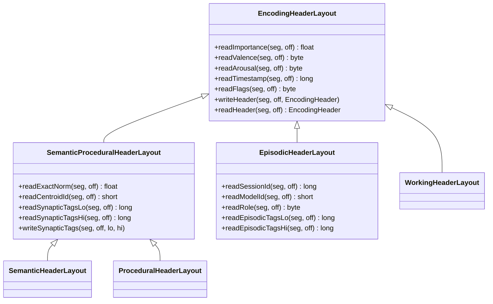
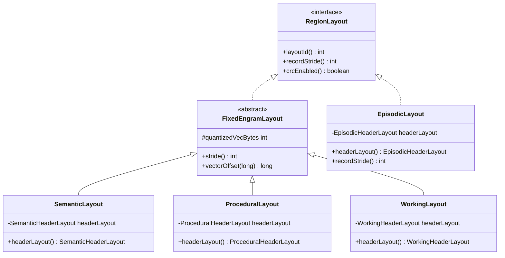
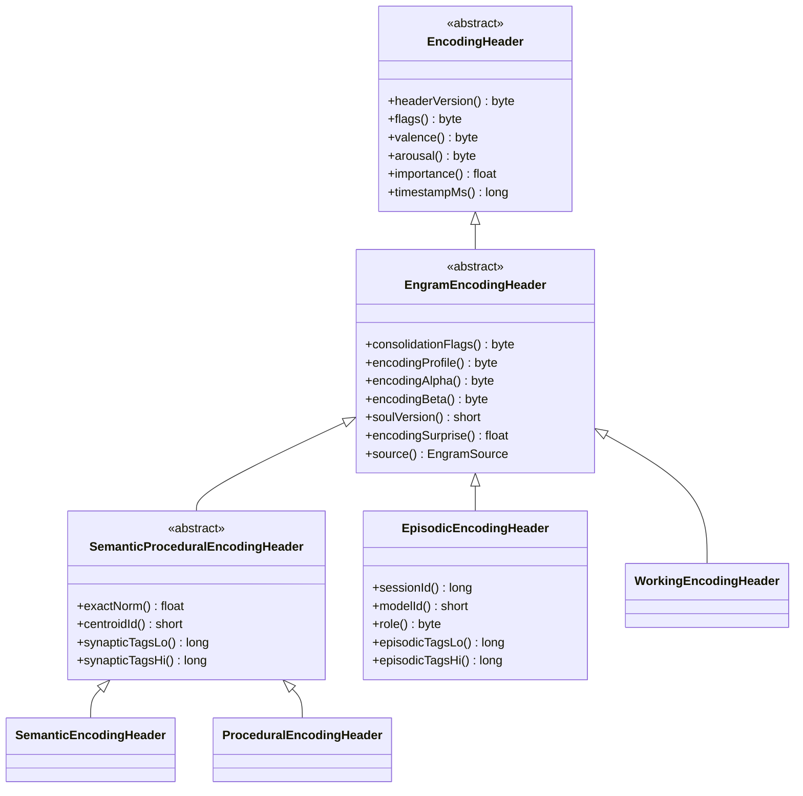
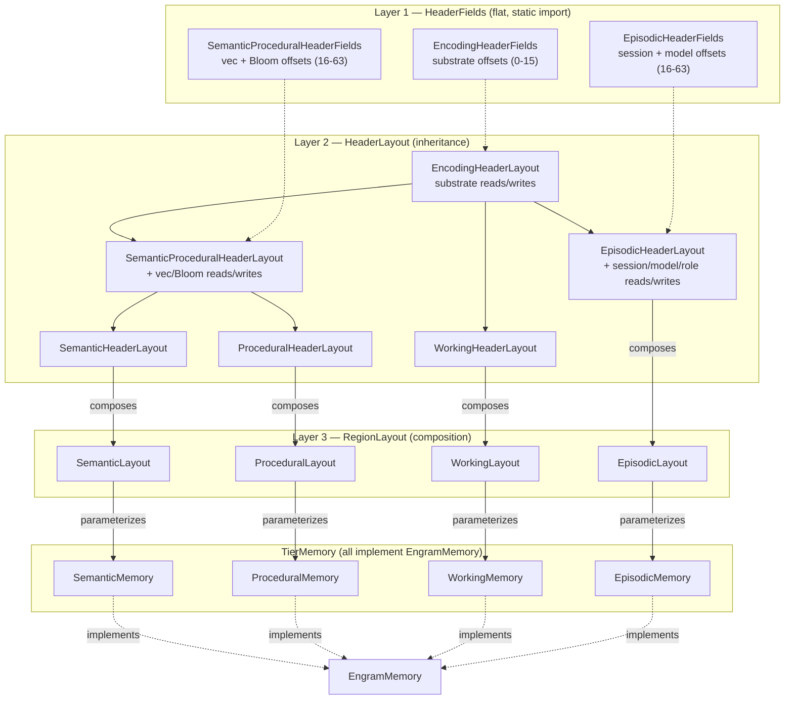

# ADR-0030: Unified Engram Encoding Header Architecture

| Field | Value |
|:---|:---|
| **Status** | Accepted (Implemented) |
| **Date** | 2026-09-04 |
| **Authors** | Spector Maintainers & Architecture Working Group |
| **Deciders** | Spector Technical Steering Committee (TSC) |
| **Supersedes** | None |
| **Superseded By** | None |
| **Last Verified** | 2026-09-16 (Verified against `main`) |

---

**All four memory types are engrams. One cognitive substrate. Dedicated per-tier header fields. No field punning.**

| Field | Value |
|---|---|
| **Status** | Proposed |
| **Date** | 4 September 2026 |
| **Author** | Solutions architecture review (Titan + Neuron) |
| **Supersedes** | Partial header design in `Episodic-Memory-and-Engram-Model.md` §5–§6 |
| **Related** | ADR-0010 (Single Engram, Four Stores) · ADR-0028 (Encoding/Audit Split) · `Episodic-Memory-and-Engram-Model.md` |
| **Companion spec** | [MF-001](https://github.com/spectrayan/memory-fundamentals) v1.0.0 |
| **Codebase** | `spectrayan/spector` · `memory/spector-memory` |
| **Branch** | `refactor/engram-layout-unification` |

---

## 1. Decision

1. **All four memory types — Episodic, Semantic, Procedural, Working — are engrams.** The engram is the fundamental unit of the memory model (MF-001 §4.2). Physical storage shape (fixed-stride vs append-only) does not determine cognitive identity.
2. **Expand the `EngramMemory` interface** so that all four tier stores implement it, regardless of their physical layout inheritance (`AbstractRecordMemory` vs `AbstractAppendMemory`). The name follows the existing `*Memory` naming convention (`SemanticMemory`, `ProceduralMemory`, `WorkingMemory`, `EpisodicMemory`).
3. **Share a common cognitive substrate** (18 bytes) within the existing 64-byte `EncodingHeader` across all four tiers. These fields have identical meaning and byte layout everywhere.
4. **Allow dedicated per-tier header fields** within the remaining header space. Semantic/Procedural/Working reuse the current `EncodingHeaderLayout` without change. Episodic gets an honest `EpisodicEncodingHeader` that maps its unique fields (session, model, role) into currently-reserved or currently-punned bytes.
5. **Eliminate field punning.** No encoding-header byte may be used as a different concept than its declared name. `synapticTags` is always a Bloom filter. `agentRecallCount` is never a model registry ID.

---

## 2. Problem Statement

### 2.1 The gap between design intent and implementation

The original design document (`Episodic-Memory-and-Engram-Model.md` §1–§2) correctly defines:

> *Engram = One stored memory (MF-001 "trace")*

and places all four memory types — Episodic, Semantic, Procedural, Working — as engrams with an `EncodingHeader`.

The implementation tells a different story:

```
AbstractMemory<L>  (kernel.shape)
├── AbstractRecordMemory<L>  (FIXED stride)
│   └── AbstractEngramMemory<EngramLayout>  (cortex)
│       ├── SemanticMemory
│       ├── ProceduralMemory
│       └── WorkingMemory
└── AbstractAppendMemory<L>  (VARIABLE stride)
    └── EpisodicMemory  ← NOT an Engram in the class hierarchy
```

`EpisodicMemory` cannot extend `AbstractEngramMemory` because that inherits from `AbstractRecordMemory` (fixed-stride), and episodic is variable-length append. This is correct at the *physical layout* level. But the class hierarchy conflates **physical shape** with **cognitive identity**.

### 2.2 Router split propagation

In `CognitiveMemoryRouter`:

```java
Map<MemoryType, EngramMemory> stores;   // Semantic, Procedural, Working
EpisodicMemory episodicStore;            // Held separately — different type
```

This split propagates throughout the codebase: recall pathway, reflect pathway, scan emitters, count methods — all special-case `MemoryType.EPISODIC`.

### 2.3 Field punning in the episodic header

The 64-byte `EncodingHeader` record is shared across all tiers, but episodic uses fields dishonestly:

| Header Field (Declared) | Semantic/Procedural Use | Episodic Use (Punned) |
|---|---|---|
| `synapticTags` (8B Bloom filter lo) | Contextual Bloom filter hash | `sessionId` (TSID) |
| `agentRecallCount` (2B recall counter) | Recall counter | `modelId` (registry ID) |

This means:
- `EpisodicHeaderAccessor.readSessionId()` reads from `OFFSET_SYNAPTIC_TAGS_LO`
- `EpisodicHeaderAccessor.readModelId()` reads from `OFFSET_RECALL_COUNT`
- A scan over `synapticTags` across all tiers returns garbage for episodic records
- A rename of `synapticTags` would break episodic session lookup

This violates MF-001 NF1 (Header Completeness) — the fields do not hold what they claim.

### 2.4 Missing dedicated episodic encoding header

The original design (§6) envisions three named accessors delegating to one `EncodingHeaderLayout`. This is correct for Semantic, Procedural, and Working where the field meanings genuinely match. But episodic needs additional fields that do not exist on the other tiers:

| Episodic-Only Field | Purpose |
|---|---|
| `sessionId` | Conversation session TSID |
| `modelId` | LLM model registry ID |
| `role` | Conversation role ordinal |
| `sequence` | Turn sequence within session |

These are currently split between the prefix (`WalkPrefix` holds sequence) and punned header bytes. They need an honest home.

---

## 3. Proposed Architecture

### 3.1 The `EngramMemory` interface

```java
/**
 * Unifying interface for all four tier stores.
 * Physical shape (fixed-stride or append-only) is an implementation
 * detail — cognitive identity is the contract.
 *
 * Every tier store is an engram store: it holds traces with
 * encoding headers, supports tombstoning, and participates in
 * the recall algebra.
 */
public interface EngramMemory {
    MemoryType type();
    int size();
    boolean isEmpty();
    EncodingHeader readHeader(long location);
    void tombstone(long location);
    boolean isTombstoned(long location);
}
```

**Key insight:** `EngramMemory` is the cognitive identity contract. `AbstractEngramMemory` and `AbstractAppendMemory` are physical layout strategies. Both implement `EngramMemory` but via different mechanical paths.

### 3.2 Router unification

```java
// BEFORE: split stores
Map<MemoryType, EngramMemory> stores;   // 3 tiers
EpisodicMemory episodicStore;            // separate

// AFTER: unified map
Map<MemoryType, EngramMemory> stores;     // all 4 tiers
```

The router can still downcast to `EpisodicMemory` when it needs append-specific methods (`appendTurn`, `unconsolidatedTurnOffsets`), but the default pathways (count, header read, tombstone, introspect) work uniformly.

### 3.3 The three-layer design

The header architecture is organized in three layers. Each tier is symmetric — no tier is more "engram" than another.

```
LAYER 1 — HeaderFields (constants, flat classes, no inheritance)
  "What byte offset is each field at?"

LAYER 2 — HeaderLayout (read/write methods, inheritance for method reuse)
  "Given a base address, how do I read/write the fields?"

LAYER 3 — RegionLayout (implements RegionLayout, composes a HeaderLayout)
  "What is the record shape? How does TierMemory access header I/O?"
  Parameterizes Memory<L> — the single entry point for all header access.
```

#### Design principle: Fields do not inherit, Layouts do

**Layer 1 (Fields)** — constants (`static final int`) are not polymorphic. Inheritance for constants creates a confusing "which parent does this constant come from?" chain. Instead, each tier declares only its own constants in a flat class. Callers use `static import` to mix substrate + tier-specific constants.

**Layer 2 (Layouts)** — methods benefit from reuse and override. `readImportance()` is real logic (segment access + offset math) that should not be duplicated. Inheritance is the right tool.

**Layer 3 (Region Layouts)** — each tier's `RegionLayout` holds its per-tier `HeaderLayout` via composition. `TierMemory` calls `this.layout().headerLayout().readXxx()`. This is the same pattern the current `EngramLayout` uses (it holds `EncodingHeaderLayout` via composition) — we extend it to all four tiers symmetrically.

### 3.4 Layer 1 — HeaderFields (constants, flat, `static import`)

```java
// Shared cognitive substrate — bytes 0–15 (all tiers)
public final class EncodingHeaderFields {
    public static final int OFFSET_HEADER_VERSION = 0;
    public static final int OFFSET_FLAGS          = 1;
    public static final int OFFSET_VALENCE        = 2;
    public static final int OFFSET_AROUSAL        = 3;
    public static final int OFFSET_IMPORTANCE     = 4;
    public static final int OFFSET_TIMESTAMP      = 8;
    public static final int HEADER_BYTES          = 64;
    // ... shared flags, masks
}

// Semantic + Procedural shared — bytes 16–63
public final class SemanticProceduralHeaderFields {
    public static final int OFFSET_EXACT_NORM        = 16;
    public static final int OFFSET_CENTROID_ID       = 20;
    public static final int OFFSET_SYNAPTIC_TAGS_LO  = 24;
    public static final int OFFSET_SYNAPTIC_TAGS_HI  = 32;
    // ... only vec/Bloom offsets
}

// Episodic only — bytes 16–63
public final class EpisodicHeaderFields {
    public static final int OFFSET_SESSION_ID        = 16;
    public static final int OFFSET_MODEL_ID          = 24;
    public static final int OFFSET_ROLE              = 26;
    public static final int OFFSET_EPISODIC_TAGS_LO  = 48;
    public static final int OFFSET_EPISODIC_TAGS_HI  = 56;
    // ... only episodic offsets
}
```

> [!IMPORTANT]
> You cannot reach `OFFSET_SYNAPTIC_TAGS_LO` from episodic code unless you deliberately import `SemanticProceduralHeaderFields` — which is an obvious code review red flag. The punning problem is eliminated structurally.

**No empty `SemanticHeaderFields` or `ProceduralHeaderFields` today.** They share `SemanticProceduralHeaderFields`. Create per-tier field classes only when a tier gets a unique constant.

### 3.5 Layer 2 — HeaderLayout (read/write methods, inheritance)



- `EncodingHeaderLayout` — reads/writes the 18-byte cognitive substrate. All tiers inherit this.
- `SemanticProceduralHeaderLayout` — adds vector/Bloom read/write methods. Uses `SemanticProceduralHeaderFields` constants via `static import`.
- `SemanticHeaderLayout` and `ProceduralHeaderLayout` — extend `SemanticProceduralHeaderLayout`. Currently empty; future-proofed for tier-specific methods.
- `EpisodicHeaderLayout` — adds session/model/role read/write methods. Uses `EpisodicHeaderFields` constants via `static import`.
- `WorkingHeaderLayout` — extends `EncodingHeaderLayout`. Currently empty; future-proofed.

### 3.6 Layer 3 — RegionLayout (per-tier, composes HeaderLayout)

Every tier gets its own `RegionLayout` that holds its per-tier `HeaderLayout` via composition. The old asymmetry (`EngramLayout` for 3 tiers, `EpisodeLayout` for 1) is replaced with four symmetric layouts:



| RegionLayout | Physical shape | HeaderLayout | Stride |
|---|---|---|---|
| `SemanticLayout` | Fixed (header + vector) | `SemanticHeaderLayout` | `64 + vecBytes` |
| `ProceduralLayout` | Fixed (header + vector) | `ProceduralHeaderLayout` | `64 + vecBytes` |
| `WorkingLayout` | Fixed (header + vector) | `WorkingHeaderLayout` | `64 + vecBytes` |
| `EpisodicLayout` | Variable (prefix + header + payload) | `EpisodicHeaderLayout` | `0` (variable) |

**`FixedEngramLayout`** is an abstract base for the three fixed-stride tiers. It provides shared stride calculation and vector offset math. The name describes the physical shape ("fixed-stride engram"), not cognitive identity — all four tiers are equally engrams.

#### How TierMemory accesses header I/O

```java
// Semantic — fixed stride, parameterized with SemanticLayout
SemanticMemory extends AbstractRecordMemory<SemanticLayout>
  → this.layout().headerLayout().readSynapticTags(seg, off)
  → this.layout().headerLayout().readImportance(seg, off)    // inherited

// Episodic — variable stride, SAME pattern
EpisodicMemory extends AbstractAppendMemory<EpisodicLayout>
  → this.layout().headerLayout().readSessionId(seg, off + PREFIX_BYTES)
  → this.layout().headerLayout().readImportance(seg, off + PREFIX_BYTES)  // inherited
```

Both call through `this.layout().headerLayout()`. The `EpisodicHeaderAccessor` static utility class is absorbed into `EpisodicHeaderLayout` — the accessor's address computation (+16 prefix) moves into the layout. One class fewer per tier.

### 3.7 Layered encoding header (on-disk format)

The 64-byte `EncodingHeader` is divided into two layers:

```
┌──────────────────────────────────────────────────────────────────┐
│                    64-BYTE ENCODING HEADER                       │
├──────────────────────────────────────────────────────────────────┤
│  LAYER 1: Cognitive Substrate (bytes 0–15, 18B)                 │
│  ────────────────────────────────────────────────                │
│   +0   1B  headerVersion     uint8    Always 2                  │
│   +1   1B  flags             uint8    Tombstone, type, pin, etc │
│   +2   1B  valence           int8     Emotional valence         │
│   +3   1B  arousal           uint8    Emotional arousal         │
│   +4   4B  importance        float32  ICNU base importance      │
│   +8   8B  timestampMs       int64    Encoding timestamp        │
│                                                                  │
│  These 18 bytes are IDENTICAL across all four tiers.             │
│  Every tier reads and writes them with the same semantics.       │
├──────────────────────────────────────────────────────────────────┤
│  LAYER 2: Tier-Specific Fields (bytes 16–63, 48B)               │
│  ────────────────────────────────────────────────                │
│  The remaining 48 bytes have tier-specific semantics.            │
│  See §3.8 and §3.9 for per-tier layouts.                        │
└──────────────────────────────────────────────────────────────────┘
```

#### Why 18 bytes for the cognitive substrate?

These are the fields that MF-001 requires on *every* trace for the fusion formula to execute:

| MF-001 Signal | Header Field | Offset | Size |
|---|---|---|---|
| Importance $I(T)$ | `importance` | +4 | 4B |
| Valence $V(T,C)$ | `valence` | +2 | 1B |
| Arousal $A_d(T)$ | `arousal` | +3 | 1B |
| Tombstone (hard gate) | `flags` | +1 | 1B |
| Source gate (NF7) | derived from `flags` | +1 | (shared) |
| Time window (hard gate) | `timestampMs` | +8 | 8B |
| Header version | `headerVersion` | +0 | 1B |

Total: 18 bytes. These fields participate in every recall across every tier and must have identical meaning everywhere.

### 3.8 Semantic / Procedural / Working header byte layout (unchanged)

```
Cognitive Substrate (0–15):
  +0   1B  headerVersion
  +1   1B  flags
  +2   1B  valence
  +3   1B  arousal
  +4   4B  importance
  +8   8B  timestampMs

Tier-Specific (16–63) — Semantic/Procedural/Working:
  +16  4B  exactNorm          float32  L2 norm of unquantized vector
  +20  2B  centroidId         int16    IVF partition cluster ID
  +22  2B  _pad0
  +24  8B  synapticTagsLo     uint64   128-bit Bloom filter low
  +32  8B  synapticTagsHi     uint64   128-bit Bloom filter high
  +40  1B  consolidationFlags uint8    Provenance flags
  +41  1B  encodingProfile    uint8    Cognitive state at ingestion
  +42  1B  encodingAlpha      uint8    Quantized alpha weight
  +43  1B  encodingBeta       uint8    Quantized beta weight
  +44  2B  soulVersion        uint16   Soul config generation
  +46  2B  _reservedGeo
  +48  4B  encodingSurprise   float32  Bayesian surprise z-score
  +52 12B  _reserved
```

These tiers genuinely use synaptic tags for Bloom filtering, exactNorm for vector retrieval, and centroidId for IVF routing. No change needed.

### 3.9 Episodic header byte layout (new, honest)

For episodic tier, the same 64 bytes are reinterpreted with honest field names:

```
Cognitive Substrate (0–15) — IDENTICAL to §3.8:
  +0   1B  headerVersion
  +1   1B  flags
  +2   1B  valence
  +3   1B  arousal
  +4   4B  importance
  +8   8B  timestampMs

Tier-Specific (16–63) — Episodic:
  +16  8B  sessionId          int64    Conversation session TSID
  +24  2B  modelId            int16    LLM model registry ID
  +26  1B  role               uint8    ConversationRole ordinal
  +27  1B  consolidationFlags uint8    Provenance flags
  +28  1B  encodingProfile    uint8    Cognitive state at ingestion
  +29  1B  encodingAlpha      uint8    Quantized alpha weight
  +30  1B  encodingBeta       uint8    Quantized beta weight
  +31  1B  _pad1
  +32  2B  soulVersion        uint16   Soul config generation
  +34  2B  _reservedGeo
  +36  4B  encodingSurprise   float32  Bayesian surprise z-score
  +40  4B  _reserved0
  +44  4B  _reserved1
  +48  8B  episodicTagsLo     uint64   Episode-scoped context tags
  +56  8B  episodicTagsHi     uint64   Episode-scoped context tags
```

**Key changes from the punned layout:**

| Before (Punned) | After (Honest) | Rationale |
|---|---|---|
| `synapticTags` offset stuffed with `sessionId` | `sessionId` at +16, explicitly named | No Bloom filter on episodes; session identity is the real need |
| `agentRecallCount` offset stuffed with `modelId` | `modelId` at +24, explicitly named | Recall count lives in `StrengthLayout` anyway |
| No role field | `role` at +26 | Was only in payload; now in header for gated scans |
| Shared fields (`consolidationFlags`, `encodingProfile`, etc.) | Same fields, shifted to accommodate episodic-specific ones | Cognitive substrate shared; tier-specific area reorganized |

### 3.10 Full class map

```
Layer 1 — HeaderFields (flat, no inheritance, static import)
  EncodingHeaderFields               substrate offsets (bytes 0–15)
  SemanticProceduralHeaderFields     vec + Bloom offsets (bytes 16–63)
  EpisodicHeaderFields               session + model + role offsets (bytes 16–63)

Layer 2 — HeaderLayout (inheritance for method reuse)
  EncodingHeaderLayout               substrate reads/writes
  ├── SemanticProceduralHeaderLayout + vec/Bloom reads/writes
  │   ├── SemanticHeaderLayout       (extends, currently empty)
  │   └── ProceduralHeaderLayout     (extends, currently empty)
  ├── EpisodicHeaderLayout           + session/model/role reads/writes
  └── WorkingHeaderLayout            (extends, currently empty)

Layer 3 — RegionLayout (composes per-tier HeaderLayout)
  FixedEngramLayout (abstract)       stride = 64 + vecBytes
  ├── SemanticLayout                 { SemanticHeaderLayout }
  ├── ProceduralLayout               { ProceduralHeaderLayout }
  └── WorkingLayout                  { WorkingHeaderLayout }
  EpisodicLayout                     { EpisodicHeaderLayout, variable stride }

Layer 4 — Value Objects (sealed hierarchy)
  EncodingHeader                     substrate fields
  └── EngramEncodingHeader           + consolidationFlags, soul, surprise, source
      ├── SemanticProceduralEncodingHeader  + exactNorm, centroidId, synapticTags
      │   ├── SemanticEncodingHeader
      │   └── ProceduralEncodingHeader
      ├── EpisodicEncodingHeader     + sessionId, modelId, role, episodicTags
      └── WorkingEncodingHeader      minimal

Memory<L> parameterization:
  SemanticMemory<SemanticLayout>     → this.layout().headerLayout().readXxx()
  ProceduralMemory<ProceduralLayout> → this.layout().headerLayout().readXxx()
  WorkingMemory<WorkingLayout>       → this.layout().headerLayout().readXxx()
  EpisodicMemory<EpisodicLayout>     → this.layout().headerLayout().readXxx()
```

---

## 4. Alignment with MF-001

### 4.1 Normal Forms

| Normal Form | Requirement | Status | How This ADR Satisfies |
|---|---|---|---|
| **NF0 — Single Engram** | Vector, document, header, graph of a trace have one identity | ✅ | `EngramMemory` makes all 4 tiers first-class engrams. No store can disagree on existence. |
| **NF1 — Header Completeness** | Every signal used in $s(T \mid C)$ is present on $T$ | ✅ | Cognitive substrate carries $I$, valence, arousal, timestamp, flags on every trace. Field punning eliminated — every field holds what it claims. |
| **NF2 — Lineage of Distillation** | Every distilled trace points at episodic sources | — | Unchanged; handled by `LineageRecordMemory` / `PROVENANCE_LOG`. |
| **NF3 — Rememberer Isolation** | Shared-nothing persistence per rememberer | — | Unchanged; one bundle per rememberer. |
| **NF4 — Association Well-formedness** | Every association endpoint is a live or tombstoned trace | — | Unchanged; graph references trace IDs. |
| **NF5 — Payload Honesty** | Reconsolidation preserves prior payload | — | Unchanged. |
| **NF6 — Emotional Completeness** | Every episodic, semantic, and procedural trace has defined valence, arousal, and importance | ✅ | Cognitive substrate places $I$, valence, arousal at bytes 2–7 on every durable trace. Working tier remains NF6-exempt. |
| **NF7 — Source Honesty** | Every durable trace has a source tag | ✅ | `source` encoded in `flags` (byte 1) or `consolidationFlags` — same location in all tiers. |

### 4.2 Twelve Rules

| Rule | Status | How This ADR Satisfies |
|---|---|---|
| **M0 — Engine** | — | Unchanged; native substrate. |
| **M1 — Engram** | ✅ | `EngramMemory` makes episodic a first-class engram, not a separate concept. Header + payload + associations are faces of one trace. |
| **M2 — No Truncation Trap** | — | Unchanged; fused scoring before top-$k$. |
| **M3 — Signal Integrity** | ✅ | All cognitive signals live on the header, not as optional metadata. No field punning means scanners read honest values. |
| **M4 — Physical Independence** | ✅ | Callers use `EngramMemory` / `MemoryType`, never byte offsets. Physical shape (record vs append) is hidden behind the interface. |
| **M5 — Tier Physics** | ✅ | Four stores, shared cognitive substrate, distinct tier-specific header fields and physics (capacity, durability, decay). |
| **M6–M12** | — | Unchanged by this ADR. |

### 4.3 Information Rule (MF-001 §4.2)

> *Every signal that can change recall — importance, valence, arousal, storage strength, decay state, tags, pin, tombstone, resolved status — lives on the trace or on an association the recall algebra is required to consult.*

The cognitive substrate places importance, valence, arousal, tombstone, pin, and resolved on the trace header. Storage strength and decay state live in `StrengthLayout` (a co-located region the recall algebra consults). Tags live on the tier-specific layer: Bloom filter for semantic/procedural, context tags for episodic. All signals are accounted for.

### 4.4 Trace Definition (MF-001 §4.2)

$$
T = (\text{id}, \text{tier}, \text{payload}, \text{header}, \text{loc})
$$

| Component | Realization (All 4 Tiers) |
|---|---|
| `id` | `MemoryId` (128-bit TSID) |
| `tier` | `MemoryType` enum: `EPISODIC`, `SEMANTIC`, `PROCEDURAL`, `WORKING` |
| `payload` | Episode (CBOR), Fact (text + vector), Skill (rules + vector), Thought (text) |
| `header` | 64-byte `EncodingHeader` — cognitive substrate + tier-specific fields |
| `loc` | `Location(type, partition, offset)` — callers never use this |

---

## 5. Physical Record Layouts

### 5.1 Episode record

```
+0    WalkPrefix         16B   id (TSID), sequence, checksum, magic ('EPIS')
+16   EncodingHeader     64B   Cognitive substrate + episodic-specific fields
+80   Episode payload    N     CBOR-encoded (role, text, sessionId echo, etc.)
─── next = 80 + N ───
```

Note: `sessionId` lives in the header at header-relative +16 (absolute record offset +32). It is *also* present in the CBOR payload for backward compatibility, but the header is the authoritative source for scan/filter operations.

### 5.2 Fact slot (Semantic)

```
+0    EncodingHeader     64B   Cognitive substrate + semantic-specific fields
+64   INT8 vector        Vb    Quantized embedding
─── stride = 64 + V ───
```

### 5.3 Skill slot (Procedural)

```
+0    EncodingHeader     64B   Cognitive substrate + procedural-specific fields
+64   INT8 vector        Vb    Quantized embedding
─── stride = 64 + V ───
```

### 5.4 Strength row (all tiers)

```
+0    StrengthRecord     NB    D, S, recallCount, lastUse, ACT-R
─── RegionId.STRENGTH ───
```

Strength is per-engram, keyed by slot/offset, shared across all tiers. Unchanged by this ADR.

---

## 6. Migration Path

### Phase 1: Per-tier RegionLayouts + `EngramMemory` interface (non-breaking)

1. Create `SemanticLayout`, `ProceduralLayout`, `WorkingLayout` as thin wrappers around the existing `EngramLayout` (compose it, delegate stride/vector). Each holds the current `EncodingHeaderLayout` via `headerLayout()`.
2. Create `FixedEngramLayout` abstract base for the three fixed-stride layouts. Move shared stride/vector logic there.
3. Update `EpisodicLayout` to hold an `EncodingHeaderLayout` via `headerLayout()` composition (same pattern as the fixed-stride layouts).
4. Reparameterize: `SemanticMemory<SemanticLayout>`, `ProceduralMemory<ProceduralLayout>`, `WorkingMemory<WorkingLayout>`.
5. Expand the `EngramMemory` interface so `EpisodicMemory` implements it.
6. Update `CognitiveMemoryRouter` to hold `Map<MemoryType, EngramMemory>` with all 4 entries.
7. Remove special-casing of `episodicStore` in `countFor()`, `totalCount()`, basic header reads.

### Phase 2: Per-tier HeaderLayouts + HeaderFields (non-breaking)

1. Create `SemanticProceduralHeaderFields` — extract vec/Bloom offset constants from `EncodingHeaderFields`.
2. Create `EpisodicHeaderFields` — define honest episodic-specific offset constants.
3. Create `SemanticProceduralHeaderLayout extends EncodingHeaderLayout` — move vec/Bloom read/write methods.
4. Create `SemanticHeaderLayout extends SemanticProceduralHeaderLayout` (empty).
5. Create `ProceduralHeaderLayout extends SemanticProceduralHeaderLayout` (empty).
6. Create `EpisodicHeaderLayout extends EncodingHeaderLayout` — absorb `EpisodicHeaderAccessor` methods.
7. Create `WorkingHeaderLayout extends EncodingHeaderLayout` (empty).
8. Update per-tier RegionLayouts to hold their specific HeaderLayout type.
9. Absorb `EpisodicHeaderAccessor` into `EpisodicHeaderLayout`. Mark `EpisodicHeaderAccessor` as `@Deprecated(forRemoval = true)`.

### Phase 3: Episodic header de-punning (breaking for on-disk format)

1. Write new episodic records with `sessionId` at honest offset +16 (header-relative), `modelId` at +24, `role` at +26.
2. Dual-read: detect `headerVersion` or magic to decide old-punned vs new-honest layout.
3. Old punned-field readers annotated `@Deprecated(forRemoval = true)`.
4. Deprecation window: **2 release versions**, then remove punned readers.

### Phase 4: Value object hierarchy + cleanup

1. Create `EncodingHeader` → `EngramEncodingHeader` → per-tier sealed class hierarchy.
2. Create `SemanticProceduralEncodingHeader` as shared base for `SemanticEncodingHeader` and `ProceduralEncodingHeader`.
3. Update `HeaderLayout.readHeader()` return types to per-tier value objects.
4. Delete deprecated `EpisodicHeaderAccessor`.
5. Delete old monolithic `EngramLayout` (replaced by `SemanticLayout` / `ProceduralLayout` / `WorkingLayout`).

---

## 7. What This ADR Rejects

- **A monolithic `EngramLayout` that excludes episodic.** The old naming (`EngramLayout` for 3 tiers, `EpisodeLayout` for 1) embeds the asymmetry we are fixing. Each tier gets its own symmetric `RegionLayout`.
- **A single `EncodingHeaderFields` class with all tiers' constants.** Monolithic constants allow cross-tier field access (the root cause of punning). Flat per-tier field classes with `static import` eliminate this structurally.
- **Separate Accessor classes (e.g. `EpisodicHeaderAccessor`).** The address computation (+16 prefix for episodic) is absorbed into the per-tier `HeaderLayout`. The accessor layer is unnecessary when each tier's `RegionLayout` composes its own `HeaderLayout`.
- **`KnowledgeEncodingHeader` naming.** "Knowledge" is too generic and collides with the knowledge graph. The shared Semantic + Procedural base is named `SemanticProceduralEncodingHeader` / `SemanticProceduralHeaderLayout` / `SemanticProceduralHeaderFields` — explicit and unambiguous.
- **Collapsing episodic into `AbstractEngramMemory`.** The physical shape difference (fixed-stride vs append-only) is real. The fix is an interface (`EngramMemory`), not forced inheritance.
- **Moving episodic fields to the payload only.** Fields that participate in scan/filter (session, model, role) must be in the header, not behind a CBOR decode.
- **A `HEADER_SLAB` region for episodic.** The header rides the episode record (ADR-0010 §5). A derived scan projection may be added later, but the record is the source of truth.
- **Changing the 64-byte header size.** The cache-line alignment constraint is load-bearing for scan throughput. All tiers carry full 64B headers, including working memory.
- **Inheritance for HeaderFields constants.** `static final int` is not polymorphic. Inheritance creates a confusing parent chain. Flat classes with `static import` are cleaner.

---

## 8. Acceptance Criteria

- [ ] `EngramMemory` interface exists; all four tier stores implement it
- [ ] `CognitiveMemoryRouter` holds a single `Map<MemoryType, EngramMemory>` (no separate `episodicStore` field)
- [ ] Per-tier `RegionLayout` classes: `SemanticLayout`, `ProceduralLayout`, `WorkingLayout`, `EpisodicLayout`
- [ ] `FixedEngramLayout` abstract base for the three fixed-stride layouts
- [ ] Old monolithic `EngramLayout` deleted (replaced by per-tier layouts)
- [ ] Per-tier `HeaderLayout` classes: `SemanticHeaderLayout`, `ProceduralHeaderLayout`, `WorkingHeaderLayout`, `EpisodicHeaderLayout`
- [ ] `SemanticProceduralHeaderLayout` shared base for `SemanticHeaderLayout` and `ProceduralHeaderLayout`
- [ ] Per-tier `HeaderFields` classes: `EncodingHeaderFields` (substrate), `SemanticProceduralHeaderFields` (vec/Bloom), `EpisodicHeaderFields` (session/model)
- [ ] `EpisodicHeaderAccessor` absorbed into `EpisodicHeaderLayout` and deleted
- [ ] No encoding-header byte is used for a concept other than its declared name
- [ ] `EpisodicHeaderLayout` reads `sessionId` from `EpisodicHeaderFields.OFFSET_SESSION_ID`, not `OFFSET_SYNAPTIC_TAGS`
- [ ] `EpisodicHeaderLayout` reads `modelId` from `EpisodicHeaderFields.OFFSET_MODEL_ID`, not `OFFSET_RECALL_COUNT`
- [ ] Cognitive substrate fields (importance, valence, arousal, timestamp, flags) are at identical byte offsets across all 4 tiers
- [ ] Dual-read supports both old punned and new honest episodic header formats
- [ ] Old punned-field readers annotated `@Deprecated(forRemoval = true)` with 2-version window
- [ ] All four tiers carry full 64B cache-aligned encoding header (including working memory)
- [ ] Episodic header includes 128-bit `episodicTags` context tags at offsets 48–63
- [ ] `EncodingHeader` value object hierarchy: `EncodingHeader` → `EngramEncodingHeader` → `SemanticProceduralEncodingHeader` / `EpisodicEncodingHeader` / `WorkingEncodingHeader`
- [ ] `SemanticEncodingHeader` and `ProceduralEncodingHeader` extend `SemanticProceduralEncodingHeader`
- [ ] All TierMemory classes access headers via `this.layout().headerLayout().readXxx()`
- [ ] All existing tests pass (1,680+) with no regression
- [ ] NF0, NF1, NF6, NF7, M1, M3, M5 compliance validated

---

## 9. Resolved Design Decisions

The following questions were raised during review and resolved by the CEO:

### 9.1 Working memory header — **Keep full 64B, cache-aligned**

Working memory carries the full 64-byte encoding header, same as all other tiers. Even though NF6 exempts working tier from emotional completeness, keeping a uniform 64B header:
- Maintains cache-line alignment across all tier scans
- Leaves room for future fields without a format migration
- Allows `EngramMemory.readHeader()` to return a uniform type

Unused fields in the working header are zero-filled. The contract is: every `EngramMemory` has a 64B header.

### 9.2 Episodic context tags — **Yes, add tags (same as Semantic/Procedural)**

Episodic traces get their own 128-bit context tags at offsets 48–63 (within the tier-specific area). These function as episodic context tags — enabling tag-based episodic filtering without CBOR payload decode. The field name is `episodicTags` (not `synapticTags`) to distinguish from the Bloom filter used by semantic/procedural tiers.

### 9.3 Per-tier design — **Fully per-tier at all layers**

Every tier gets its own dedicated classes at every layer:

- **HeaderFields** — flat constant classes, no inheritance. `EncodingHeaderFields` (substrate), `SemanticProceduralHeaderFields` (shared vec/Bloom), `EpisodicHeaderFields` (session/model). Create per-tier field classes only when a tier gets a unique constant.
- **HeaderLayout** — inheritance for method reuse. `SemanticHeaderLayout` and `ProceduralHeaderLayout` extend `SemanticProceduralHeaderLayout` (even if currently empty). `EpisodicHeaderLayout` and `WorkingHeaderLayout` extend `EncodingHeaderLayout`.
- **RegionLayout** — per-tier composition. `SemanticLayout`, `ProceduralLayout`, `WorkingLayout` extend `FixedEngramLayout`. `EpisodicLayout` stands alone. Each composes its own `HeaderLayout`.

The old `EpisodicHeaderAccessor` is absorbed into `EpisodicHeaderLayout`. The old monolithic `EngramLayout` is replaced by per-tier layouts. No separate accessor layer needed.

### 9.4 Backward compatibility — **2 versions, mark deprecated**

Dual-read support for the old punned episodic header is maintained for **2 release versions**. Punned-field readers (`readSessionId()` via `OFFSET_SYNAPTIC_TAGS`, `readModelId()` via `OFFSET_RECALL_COUNT`) are annotated `@Deprecated(forRemoval = true)` immediately and removed after the 2-version window.

### 9.5 EncodingHeader type hierarchy — **Split into per-tier value objects**

The flat `EncodingHeader` Java record is replaced with a sealed type hierarchy:



| Type | Layer | Contents |
|---|---|---|
| `EncodingHeader` | Cognitive substrate (18B) | `headerVersion`, `flags`, `valence`, `arousal`, `importance`, `timestampMs` |
| `EngramEncodingHeader` | + Shared encoding fields | + `consolidationFlags`, `encodingProfile`, `encodingAlpha`, `encodingBeta`, `soulVersion`, `encodingSurprise`, `source` |
| `SemanticProceduralEncodingHeader` | + Vector + Bloom fields | + `exactNorm`, `centroidId`, `synapticTagsLo`, `synapticTagsHi` |
| `SemanticEncodingHeader` | Semantic-specific | Extends `SemanticProceduralEncodingHeader` (may add future semantic-only fields) |
| `ProceduralEncodingHeader` | Procedural-specific | Extends `SemanticProceduralEncodingHeader` (may add future procedural-only fields) |
| `EpisodicEncodingHeader` | Episodic-specific | + `sessionId`, `modelId`, `role`, `episodicTagsLo`, `episodicTagsHi` |
| `WorkingEncodingHeader` | Working-specific | Extends `EngramEncodingHeader` (minimal; zero-filled tier-specific area) |

> [!NOTE]
> Java records cannot extend other records. These will be implemented as sealed abstract classes or sealed interfaces with concrete record implementations. The exact Java mechanism is a Phase 4 implementation decision.

---

## 10. Summary Diagram



Every tier is symmetric. Every tier is an engram. Physical shape (fixed vs variable stride) is an implementation detail of the `RegionLayout`, not a naming distinction. This ADR succeeds when every encoding-header byte honestly names its purpose, every tier accesses headers through the same `this.layout().headerLayout().readXxx()` pattern, and the recall algebra sees a single engram regardless of which tier store wrote it.
