```mermaid
flowchart TD
    subgraph Config_Resolution ["1. Bootstrap & Snapshot Generation"]
        Defaults["spector-defaults.yml"] --> Source["SpectorConfigSource"]
        Env["SPECTOR_* Env Vars"] --> Source
        SysProps["-Dspector.* SysProps"] --> Source
        Source --> Factory["SpectorConfigFactory"]
        Factory --> Root["SpectorProperties (Aggregate Root)"]
    end

    subgraph Aggregate_Subdomains ["2. Typed Aggregate Root Hierarchy"]
        Root --> Memory["MemoryProperties"]
        Root --> Provider["ProviderProperties"]
        Root --> Ingestion["IngestionProperties (crawler)"]
        Root --> Telemetry["TelemetryProperties (on root)"]
        Root --> Multimodal["MultimodalProperties (on root)"]
        Root --> Hardware["HardwareProperties (on root)"]
        Root --> Events["EventsProperties (on root)"]
        Root --> Concurrency["ConcurrencyProperties (on root)"]
        
        Memory --> Recall["RecallProperties"]
        Memory --> Remember["RememberProperties"]
        Memory --> Graph["GraphProperties"]
        Memory --> Circadian["CircadianProperties"]
        Memory --> Dream["DreamProperties"]
        Memory --> TwoFactor["TwoFactorProperties"]
        Memory --> Wal["WalProperties"]
        Memory --> Vacuum["VacuumProperties"]
        Memory --> Session["SessionProperties"]
        Memory --> Persistence["text/episodic segment sizes"]
    end

    subgraph Consumers ["3. Runtime Consumers (Receive POJOs, Zero SysProps)"]
        Root --> Builder["SpectorMemoryBuilder.fromProperties()"]
        Builder --> CircadianPolicy["CircadianPolicy.from(circadian)"]
        Builder --> DreamConfig["DreamConfig.from(dream)"]
        Builder --> TwoFactorConfig["TwoFactorConfig.from(twofactor)"]
        Builder --> Cortex["CognitiveCortexBuilder (segment sizes)"]
        Root --> Synapse["Synapse ConfigResolutionService (projected defaults)"]
        Root --> Providers["ParallelEmbeddingPipeline / LangChain4jHelper"]
        Root --> Bus["EventBus(asyncMode)"]
    end
```

# ADR-0031: Unified Configuration Architecture & Bypass Elimination

| Field | Value |
|:---|:---|
| **Status** | Accepted (Implemented) |
| **Date** | 2026-09-06 |
| **Authors** | Spector Maintainers & Architecture Working Group |
| **Deciders** | Spector Technical Steering Committee (TSC) |
| **Supersedes** | None |
| **Superseded By** | None |
| **Last Verified** | 2026-09-16 (Verified against `main`) |

---

## 1. Context

Configuration across Spector's 24 modules was unified under the aggregate root `SpectorProperties` and the loader seam `SpectorConfigSource` (PR #758), providing hierarchical loading from `spector-defaults.yml`, environment variables (`SPECTOR_*`), and system properties (`-Dspector.*`).

## 2. Problem Statement

Despite the introduction of `SpectorProperties`, an architectural audit across the 24 modules of Spector revealed three critical defects:

1. **Dual Defaulting & Disconnected Builders**:
   - `SpectorMemoryBuilder` declared 44 fields initialized to static constants (`DEFAULT_*`).
   - When instantiated via `SpectorMemoryBuilder.create()`, YAML configurations and environment variables were completely ignored unless `.fromProperties(SpectorProperties.load())` was manually called.
   - `MemoryProperties` omitted ~15 properties present in `spector-defaults.yml` (tier capacities, segment sizes, WAL chunk sizes, vacuum thresholds, and session buffers).
   - Sub-domains such as `DreamConfig` (22 parameters) and `TwoFactorConfig` (4 parameters) lacked POJO representation in `spector-config`, forcing runtime classes to fall back to hardcoded constants.

2. **Runtime System Property & Environment Variable Bypasses**:
   - 14 production locations directly accessed JVM system properties or environment variables post-bootstrap (`System.getProperty("spector.*")`, `Long.getLong("spector.*")`, `System.getenv(...)`).
   - Bypasses created an untracked, invisible configuration shadow plane inaccessible to telemetry and admin auditing.

3. **Synapse UI & Engine Disconnect**:
   - Synapse's `ConfigResolutionService.systemDefaults()` declared conflicting hardcoded defaults (`chunk-size: 800/100` vs memory engine's `2500/200`, `top-k: 5` vs engine's `10`).

## 3. Decision Drivers

- **Single Source of Truth**: `SpectorProperties.load()` and `SpectorConfigFactory.spectorProperties()` must serve as the exclusive, immutable configuration source.
- **Zero Runtime Bypasses**: Strictly prohibit post-bootstrap calls to `System.getProperty("spector.*")` or ad-hoc environment variables.
- **Config-Driven Default Builders**: `SpectorMemoryBuilder.create()` and `SpectorMemory.builder()` must automatically seed from `SpectorProperties.load()`.
- **Complete Aggregate Hierarchy**: Every configuration key in `spector-defaults.yml` must map to a typed JavaBean in `spector-config`.

## 4. Considered Options

### Option 1: Ad-Hoc Post-Bootstrap System Property Lookups
- **Description**: Allow components to read `-Dspector.*` properties whenever needed at runtime.
- **Advantages**: Easy to hack one-off toggles.
- **Disadvantages**: Creates untracked hidden state; untestable; breaks runtime telemetry and UI management.

### Option 2: Spring Boot `@ConfigurationProperties` Exclusively
- **Description**: Rely solely on Spring's dependency injection container.
- **Advantages**: Standard Spring idiom.
- **Disadvantages**: Inoperable in standalone CLI, embedded MCP server, lightweight unit tests, and non-Spring environments.

### Option 3: Standalone Aggregate Root `SpectorProperties` with Post-Bootstrap Sysprop Ban (Selected)
- **Description**: Load all sources at bootstrap into an immutable, typed `SpectorProperties` aggregate tree; pass typed POJOs to consumers; strictly enforce zero runtime bypasses via automated tests.
- **Advantages**: Deterministic; operates identically in Spring and non-Spring runtimes; zero configuration drift; verified by CI tests.
- **Disadvantages**: Requires comprehensive POJO modeling for all sub-domains.

## 5. Decision Outcome

**Chosen Option**: Option 3 (Standalone Aggregate Root with Zero Runtime Bypasses).

### Architectural Decisions:

#### D1: Single Source of Truth & Bootstrap Boundary
- `SpectorProperties.load()` and `SpectorConfigFactory.spectorProperties()` serve as the exclusive source of truth across all Spector modules.
- **Allowed**: `SpectorConfigSource` reading `-D` system properties and `SPECTOR_*` environment variables during initial snapshot assembly; standard JVM/OS inspections (`user.home`, `os.name`, `java.version`); Credential SPI resolving named secret references.
- **Prohibited**: Any component reading `System.getProperty("spector.*")`, `Integer.getInteger("spector.*")`, `Long.getLong("spector.*")`, `Boolean.getBoolean("spector.*")`, or ad-hoc environment variables after the configuration snapshot has been assembled.
- Enforced via an automated regression test (`PostBootstrapSyspropBanTest`) scanning production sources.

#### D2: Complete Aggregate Root & Sub-Domain Hierarchy
- Model all unmapped properties in `spector-defaults.yml` into typed JavaBeans under `com.spectrayan.spector.config.properties`:
  - `DreamProperties`: encapsulates all 22 generative dreaming parameters.
  - `TwoFactorProperties`: encapsulates Bjork & Bjork retrieval and storage strength parameters (`sGain`, `sMax`, `sExponent`, `enabled`).
  - `WalProperties`, `VacuumProperties`, `SessionProperties`.
  - `EventsProperties` (`async`), `ConcurrencyProperties` (`structured`), `HardwareProperties` (`gpuBatchThreshold`).
- Expand `MemoryProperties` to hold all tier capacities, segment sizes, and operational settings.
- Refactor `TelemetryProperties` to accept `SpectorConfigSource` rather than reading `-D` directly in its constructor.

#### D3: Config-Driven `SpectorMemoryBuilder`
- `SpectorMemoryBuilder.create()` and `SpectorMemory.builder()` seed configuration from `SpectorProperties.load()` by default.
- Provide `SpectorMemoryBuilder.createEmpty()` for minimal unseeded instances in unit testing.
- `SpectorMemoryBuilder.fromProperties(MemoryProperties)` and `fromProperties(SpectorProperties)` exhaustively copy all configuration fields.

#### D4: Elimination of Runtime Bypasses
- Replace `Long.getLong` in `CognitiveCortexBuilder`, `PartitionManager`, and `TextBlobMemory` with values passed from `SpectorMemoryBuilder` / `MemoryProperties`.
- Remove ad-hoc `geminiApiKey` fallback in `SpectorMemoryConfigurator`; rely strictly on canonical `props.provider().getGeneration().getApiKey()`.
- Replace `Boolean.getBoolean("spector.embedding.sequential")` in `ParallelEmbeddingPipeline` with `EmbeddingProperties.isSequential()`.
- Replace `System.getProperty("spector.ssl.insecure")` in `LangChain4jHelper` with `ProviderProperties.isSslInsecure()`.
- Provide `EventBus(boolean asyncMode)` constructor and wire from `EventsProperties.isAsync()`.

#### D5: Synapse UI Defaults Alignment
- Update Synapse's `ConfigResolutionService.systemDefaults()` to project defaults directly from `SpectorProperties.load()`.
- Align chunking (2500/200), RAG top-k (10), and provider settings between the frontend administration interface and the core memory engine.

### Positive Consequences
- **Determinism**: Configuration is fully inspectable, reproducible, and strictly bounded by the `SpectorProperties` snapshot.
- **Zero Configuration Drift**: Setting a property in YAML or via an environment variable reliably propagates to all subsystems.
- **Architectural Hygiene**: Complete elimination of hidden JVM system property backchannels and duplicate hardcoded magic constants.
- **Automated Guardrails**: CI fails if post-bootstrap `spector.*` system property lookups are reintroduced.

### Negative Consequences & Trade-offs
- Modest increase in POJO surface area within `spector-config`.
- Subsystems require explicit parameter or configuration injection.

## 6. Pros and Cons of the Options

| Option | Pros | Cons |
|:---|:---|:---|
| **Option 1: Runtime Lookups** | Easy quick hacks | Non-deterministic, untracked bypasses, untestable |
| **Option 2: Spring-Only Config** | Native Spring Boot DI | Fails in standalone CLI, MCP kernel, and lightweight tests |
| **Option 3: Aggregate Root** | 100% deterministic, runtime-agnostic, zero drift | Requires comprehensive POJO models |

## 7. Implementation Plan

1. **Phase 1**: Define `DreamProperties`, `TwoFactorProperties`, `WalProperties`, and expand `MemoryProperties`.
2. **Phase 2**: Eliminate runtime system property calls across cortex, partition, and provider modules.
3. **Phase 3**: Refactor `SpectorMemoryBuilder.create()` to seed from `SpectorProperties.load()`.
4. **Phase 4**: Add `PostBootstrapSyspropBanTest` to CI gate.

## 8. Code Reference & Verification

- **Primary Module(s)**: `nucleus/spector-config`, `memory/spector-memory`, `synapse/spector-synapse`
- **Key Packages**: `com.spectrayan.spector.config.properties`, `com.spectrayan.spector.memory.builder`
- **Classes**: `SpectorProperties.java`, `SpectorConfigSource.java`, `SpectorMemoryBuilder.java`, `MemoryProperties.java`, `DreamProperties.java`
- **Verification Tests**: `PostBootstrapSyspropBanTest.java`, `SpectorPropertiesLoadingTest.java`
