# ADR-0031: Unified Configuration Architecture & Bypass Elimination

| Field | Value |
|:---|:---|
| **Status** | Accepted (Implemented) |
| **Date** | 2026-09-06 |
| **Authors** | Spector Maintainers & Architecture Working Group |
| **Deciders** | Spector Technical Steering Committee (TSC) |
| **Supersedes** | None |
| **Superseded By** | None |
| **Last Verified** | 2026-09-16 (Verified against `main`) |

---

## Status
Accepted

## Date
2026-09-06

## Context

PR #758 established the aggregate root `SpectorProperties` and the loader seam (`SpectorConfigSource`), unifying the `recall` and `remember` sub-domain trees. However, an architectural audit across the 24 modules of Spector revealed three critical shortcomings that violate Spectrayan design principles:

1. **Dual Defaulting & Disconnected Builders**:
   - `SpectorMemoryBuilder` declared 44 fields initialized to static constants (`DEFAULT_*`) and sibling `*.DEFAULT` objects.
   - When instantiated via `SpectorMemoryBuilder.create()` or `SpectorMemory.builder()`, YAML configuration, profiles, and environment variables were completely ignored unless `.fromProperties(SpectorProperties.load())` was manually invoked.
   - `MemoryProperties` omitted ~15 properties present in `spector-defaults.yml` (such as tier capacities, segment sizes, WAL chunk sizes, vacuum thresholds, and session buffers). Consequently, `fromProperties(...)` could not hydrate them.
   - Sub-domains such as `DreamConfig` (22 parameters) and `TwoFactorConfig` (4 parameters) lacked POJO representation in `spector-config`, forcing runtime classes to hardcode fallback constants.

2. **Runtime System Property & Environment Variable Bypasses**:
   - 14 production locations directly accessed JVM system properties or environment variables post-bootstrap (`System.getProperty("spector.*")`, `Long.getLong("spector.*")`, `Boolean.getBoolean("spector.*")`, `System.getenv(...)`).
   - Notable bypasses included segment sizes in `CognitiveCortexBuilder`, `PartitionManager`, and `TextBlobMemory`; `geminiApiKey` fallback in `SpectorMemoryConfigurator`; `Boolean.getBoolean("spector.embedding.sequential")` in `ParallelEmbeddingPipeline`; `System.getProperty("spector.ssl.insecure")` in `LangChain4jHelper`; and `-D` reads in `TelemetryProperties` constructor.
   - These bypasses created a parallel, untracked configuration system invisible to telemetry, auditing, and UI reflection.

3. **Synapse UI & Engine Disconnect**:
   - Synapse's `ConfigResolutionService.systemDefaults()` declared its own hardcoded defaults (`chunk-size: 800/100` vs memory engine's `2500/200`, `top-k: 5` vs engine's `10`, and raw env names `SPECTOR_OLLAMA_MODEL`/`_BASE_URL`).
   - Consequently, user-facing administration interfaces and the core memory engine operated under conflicting assumptions on the same deployment.

---

## Architectural Decision

```mermaid
flowchart TD
    subgraph Config_Resolution ["1. Bootstrap & Snapshot Generation"]
        Defaults["spector-defaults.yml"] --> Source["SpectorConfigSource"]
        Env["SPECTOR_* Env Vars"] --> Source
        SysProps["-Dspector.* SysProps"] --> Source
        Source --> Factory["SpectorConfigFactory"]
        Factory --> Root["SpectorProperties (Aggregate Root)"]
    end

    subgraph Aggregate_Subdomains ["2. Typed Aggregate Root Hierarchy"]
        Root --> Memory["MemoryProperties"]
        Root --> Provider["ProviderProperties"]
        Root --> Ingestion["IngestionProperties (crawler)"]
        Root --> Telemetry["TelemetryProperties (on root)"]
        Root --> Multimodal["MultimodalProperties (on root)"]
        Root --> Hardware["HardwareProperties (on root)"]
        Root --> Events["EventsProperties (on root)"]
        Root --> Concurrency["ConcurrencyProperties (on root)"]
        
        Memory --> Recall["RecallProperties"]
        Memory --> Remember["RememberProperties"]
        Memory --> Graph["GraphProperties"]
        Memory --> Circadian["CircadianProperties"]
        Memory --> Dream["DreamProperties"]
        Memory --> TwoFactor["TwoFactorProperties"]
        Memory --> Wal["WalProperties"]
        Memory --> Vacuum["VacuumProperties"]
        Memory --> Session["SessionProperties"]
        Memory --> Persistence["text/episodic segment sizes"]
    end

    subgraph Consumers ["3. Runtime Consumers (Receive POJOs, Zero SysProps)"]
        Root --> Builder["SpectorMemoryBuilder.fromProperties()"]
        Builder --> CircadianPolicy["CircadianPolicy.from(circadian)"]
        Builder --> DreamConfig["DreamConfig.from(dream)"]
        Builder --> TwoFactorConfig["TwoFactorConfig.from(twofactor)"]
        Builder --> Cortex["CognitiveCortexBuilder (segment sizes)"]
        Root --> Synapse["Synapse ConfigResolutionService (projected defaults)"]
        Root --> Providers["ParallelEmbeddingPipeline / LangChain4jHelper"]
        Root --> Bus["EventBus(asyncMode)"]
    end
```

### D1: Single Source of Truth & Bootstrap Boundary
- `SpectorProperties.load()` and `SpectorConfigFactory.spectorProperties()` serve as the exclusive source of truth across all Spector modules.
- **Allowed**: `SpectorConfigSource` reading `-D` system properties and `SPECTOR_*` environment variables during initial snapshot assembly; standard JVM/OS inspections (`user.home`, `os.name`, `java.version`); Credential SPI resolving named secret references.
- **Prohibited**: Any component reading `System.getProperty("spector.*")`, `Integer.getInteger("spector.*")`, `Long.getLong("spector.*")`, `Boolean.getBoolean("spector.*")`, or ad-hoc environment variables after the configuration snapshot has been assembled.
- Enforced via an automated regression test (`PostBootstrapSyspropBanTest`) scanning production sources.

### D2: Complete Aggregate Root & Sub-Domain Hierarchy
- Model all unmapped properties in `spector-defaults.yml` into typed JavaBeans under `com.spectrayan.spector.config.properties`:
  - `DreamProperties`: encapsulates all 22 generative dreaming parameters.
  - `TwoFactorProperties`: encapsulates Bjork & Bjork retrieval and storage strength parameters (`sGain`, `sMax`, `sExponent`, `enabled`).
  - `WalProperties`, `VacuumProperties`, `SessionProperties`.
  - `EventsProperties` (`async`), `ConcurrencyProperties` (`structured`), `HardwareProperties` (`gpuBatchThreshold`).
- Expand `MemoryProperties` to hold all tier capacities (`workingCapacity`, `episodicPartitionCapacity`, `semanticCapacity`, `proceduralCapacity`, `entityGraphCapacity`, `pinnedQuota`), segment sizes (`textSegmentSize`, `episodicSegmentSize`), and operational settings (`checkpointIntervalSeconds`, `idStrategy`, `edgeImportance`).
- Hang `telemetry()`, `multimodal()`, `hardware()`, `events()`, and `concurrency()` directly off `SpectorProperties`.
- Refactor `TelemetryProperties` to accept `SpectorConfigSource` rather than reading `-D` directly in its constructor.

### D3: Config-Driven `SpectorMemoryBuilder`
- `SpectorMemoryBuilder.create()` and `SpectorMemory.builder()` seed configuration from `SpectorProperties.load()` by default.
- Provide `SpectorMemoryBuilder.createEmpty()` for minimal unseeded instances in unit testing.
- `SpectorMemoryBuilder.fromProperties(MemoryProperties)` and `fromProperties(SpectorProperties)` exhaustively copy all configuration fields:
  - `CircadianPolicy.from(properties.getCircadian())`
  - `DreamConfig.from(properties.getDream())`
  - `TwoFactorConfig.from(properties.getTwofactor())`
  - Capacities, persistence segment sizes, chunking, and embedding batch sizes.
- Expose typed getters on `SpectorMemoryBuilder` so downstream factories and builders (`CognitiveCortexBuilder`, `PartitionManagerBuilder`) obtain properties without querying system properties.

### D4: Elimination of Runtime Bypasses
- Replace `Long.getLong` in `CognitiveCortexBuilder`, `PartitionManager`, and `TextBlobMemory` with values passed from `SpectorMemoryBuilder` / `MemoryProperties`.
- Remove ad-hoc `geminiApiKey` / `GEMINI_API_KEY` fallback in `SpectorMemoryConfigurator`; rely strictly on canonical `props.provider().getGeneration().getApiKey()`.
- Replace `Boolean.getBoolean("spector.embedding.sequential")` in `ParallelEmbeddingPipeline` with `EmbeddingProperties.isSequential()`.
- Replace `System.getProperty("spector.ssl.insecure")` in `LangChain4jHelper` with `ProviderConfig.properties()` / `ProviderProperties.isSslInsecure()`.
- Provide `EventBus(boolean asyncMode)` constructor and wire from `EventsProperties.isAsync()`.
- Eliminate dead `ConfigResolutionService.envOr`.

### D5: Synapse UI Defaults Alignment
- Update Synapse's `ConfigResolutionService.systemDefaults()` to project defaults directly from `SpectorProperties.load()`.
- Align chunking (2500/200), RAG top-k (10), and provider settings between the frontend administration interface and the core memory engine.

---

## Consequences

### Positive
- **Determinism**: Configuration is fully inspectable, reproducible, and strictly bounded by the `SpectorProperties` snapshot.
- **Zero Configuration Drift**: Setting a property in YAML or via an environment variable reliably propagates to all subsystems (circadian daemons, dream engines, two-factor scoring, cortex partition stores, and UI defaults).
- **Architectural Hygiene**: Complete elimination of hidden JVM system property backchannels and duplicate hardcoded magic constants.
- **Automated Guardrails**: CI fails if post-bootstrap `spector.*` system property lookups are reintroduced into production code.

### Negative / Trade-offs
- Slight increase in POJO surface area within `spector-config`.
- Subsystem constructors that previously relied on static defaults require explicit parameter or configuration injection.
