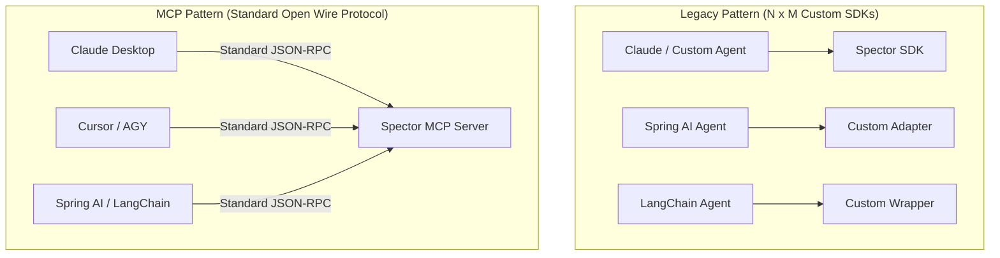

# ADR-0032-SDK: Client SDK Architecture, OpenAPI, and MCP Integration

| Field | Value |
|:---|:---|
| **Status** | Accepted (Implemented) |
| **Date** | 2026-09-06 |
| **Authors** | Spector Maintainers & Architecture Working Group |
| **Deciders** | Spector Technical Steering Committee (TSC) |
| **Supersedes** | None |
| **Superseded By** | None |
| **Last Verified** | 2026-09-16 (Verified against `main`) |

---

**Document ID**: `ADR-0032`  
**Status**: Proposed  
**Date**: 2026-09-06  
**Authors**: Technical Lead  
**Target Repositories**: `spectrayan/spector`, `spectrayan/coding-agents`, `spectrayan/RnD`  
**Related Issues**: [spectrayan/spector#738](https://github.com/spectrayan/spector/issues/738)

---

## 1. Context & Motivation

In [spectrayan/spector#738](https://github.com/spectrayan/spector/issues/738), Nova proposed creating a lightweight, zero-dependency Java/Kotlin Client SDK housed in `synapse/spector-client` to allow JVM applications to connect to Spector without pulling in the heavy engine dependencies (Lucene, vector incubator flags, Panama off-heap, Spring Boot runtime).

In response, Titan proposed an extensive hand-crafted custom Java SDK featuring:
1. Handwritten Java records for all requests and responses.
2. A custom `Transport` abstraction (`send(String operation, Object payload, Class<T> responseType)`).
3. Three distinct transports:
   - `RestTransport` (calling `/api/v1/memory/*` via `java.net.http.HttpClient`)
   - `McpTransport` (calling JSON-RPC 2.0 over HTTP/SSE)
   - `ProcessTransport` (launching `spector.jar` as a local child process via `ProcessBuilder`)

CEO Bharat raised two critical strategic questions:
1. **OpenAPI for REST SDKs**: Should we use OpenAPI (OpenAPI Generator) for all REST-based SDKs across languages instead of writing custom bespoke SDKs?
2. **MCP SDK Viability**: Does it make sense to build a client SDK for MCP at all? Aren't they supposed to be a drop-in / plug-and-play standard for agents?

This ADR formalizes the architectural decision on these questions for Spector and the broader Spectrayan portfolio.

---

## 2. Decision Summary

| Question | Architectural Decision | Rationale |
| :--- | :--- | :--- |
| **Should we build an SDK for MCP?** | **NO (Reject custom MCP Client SDK)** | MCP is an open wire protocol for AI agents. Agent hosts (Claude, Cursor, Antigravity, Spring AI) already contain generic MCP clients. A proprietary Spector MCP client SDK is an anti-pattern that violates the decoupling promise of MCP. Spector's MCP deliverable is the **MCP Server** (`spector-mcp`). |
| **Should we use OpenAPI for REST SDKs?** | **YES (Adopt OpenAPI-driven generation)** | Handcrafting SDKs across Java, Python, TypeScript, and Go produces severe maintenance debt and schema drift. OpenAPI 3.1 serves as the canonical contract, auto-generating client models and HTTP bindings across all languages. |
| **SDK Implementation Pattern** | **Option B: OpenAPI Core + Thin Ergonomic Facade** | Auto-generate all models, endpoints, and HTTP plumbing from OpenAPI, and wrap with an ultra-thin handwritten facade (~150–200 LOC per language) for developer delight and domain exception mapping. |
| **Local Subprocess Transport (`ProcessBuilder`)** | **REJECT as SDK Transport** | Spawning a JVM database/server as an unmonitored child process from a client library risks zombie processes, pipe deadlocks, and slow cold starts. Embedded usage in Java must use the in-process `spector-memory` library directly; out-of-process usage must connect to a running server daemon via REST. |

---

## 3. Deep-Dive: Why an "MCP Client SDK" is an Anti-Pattern

### 3.1 The Purpose and Topology of MCP
The Model Context Protocol (MCP) was designed by Anthropic and the open-source community to solve the **$M \times N$ integration problem** between AI agents and tools/data:



1. **Agents are already MCP Clients**: Claude Desktop, Cursor, Antigravity, OpenDevin, and agent SDKs (Spring AI, LangChain, Semantic Kernel) already implement generic MCP clients. They read configuration files (e.g. `claude_desktop_config.json`, `antigravity.json`) and dynamically discover tools (`tools/list`) and invoke them (`tools/call`).
2. **Proprietary MCP Client SDKs Break the Abstraction**: If Spector provides a proprietary `SpectorMcpClient` library, what is it for?
   - If an agent uses it, the agent is abandoning standard MCP discovery in favor of a vendor-locked library.
   - If a normal application (non-agent) uses it, the application is tunneling structured database operations through an untyped JSON-RPC `tools/call` envelope rather than using standard REST endpoints.
3. **Loss of HTTP Semantics**: Tunnelling application calls through MCP strips away HTTP status codes (404, 401, 429), path routing, standard HTTP caching, standard load balancers, rate limiters, and OpenAPI schema validation.

### 3.2 Verdict on MCP
- Spector **MUST NOT** build, publish, or maintain a proprietary "Spector MCP Client SDK".
- Spector's MCP responsibility is strictly **Server-Side**: provide a robust, high-performance, compliant **MCP Server** (`synapse/spector-mcp`) that any standard MCP host or agent can consume as a drop-in plugin.

---

## 4. Spector Client Consumption Matrix

To eliminate confusion across users and documentation, Spector defines three clean, mutually exclusive consumption tiers:

| Tier | Primary Target | Package / Artifact | Transport / Protocol | When to Use |
| :--- | :--- | :--- | :--- | :--- |
| **1. In-Process Embedded Engine** | Java / JVM high-performance apps | `com.spectrayan:spector-memory` | Direct In-Memory method calls (JNI / Panama FFM) | In-process apps needing sub-millisecond retrieval without network overhead or server management. |
| **2. Remote REST Service SDK** | Microservices, web backends, scripts (Java, Python, TS, Go, C#) | `com.spectrayan:spector-client`<br>`spector-client` (PyPI)<br>`@spectrayan/client` (npm) | HTTP / HTTPS (REST JSON) generated via OpenAPI 3.1 | Distributed architectures, multi-tenant services, and non-JVM or remote JVM applications. |
| **3. AI Agent Tool Plugin** | Autonomous agents, LLM tool-calling hosts | `synapse/spector-mcp` (Server) | JSON-RPC 2.0 via Stdio or SSE/HTTP | AI Agents (Claude, Cursor, AGY, Spring AI, AutoGen) requiring autonomous cognitive memory tools. **Zero client SDK required.** |

---

## 5. Design Options for REST Client SDKs

### Option 1: Pure OpenAPI Auto-Generation (Automated & Hands-Off)
- **Mechanism**:
  - `springdoc-openapi-starter-webmvc-ui` in `spector-synapse` generates `openapi.yaml`.
  - `openapi-generator-cli` runs during CI/CD to generate complete client libraries for Java (`java.net.http.HttpClient`), Python (`httpx`), and TypeScript (`fetch`).
  - Output is published directly to Maven Central, PyPI, and npm.
- **Strengths**:
  - 100% automated; zero code maintenance across all languages.
  - Covers all 40+ endpoints (Memory, Agents, Connectors, Namespaces, Config, System).
  - Guarantees zero schema drift between server and client.
- **Weaknesses**:
  - Raw generated methods can feel robotic (e.g. `api.apiV1MemoryRememberPost(request)`).
  - Exceptions are generic HTTP wrapper errors (`ApiException`).

### Option 2: OpenAPI Core + Thin Ergonomic Facade (Recommended) ⭐
- **Mechanism**:
  - OpenAPI generates all DTOs/records, JSON serialization, and underlying API client classes.
  - A small, handwritten facade layer (~150–200 LOC per language) provides a fluent, ergonomic interface:
    ```java
    // Java Developer Experience
    try (SpectorClient client = SpectorClient.builder()
            .endpoint("http://localhost:8080")
            .apiKey("sk-...")
            .build()) {
        
        String id = client.memory().remember("User prefers dark mode", List.of("ui", "preferences"));
        List<CognitiveResult> results = client.memory().recall("ui preferences");
    }
    ```
  - The facade catches generated `ApiException` and translates to clean domain exceptions (`MemoryNotFoundException`, `SpectorAuthException`).
  - Provides convenience overloads with sensible defaults.
- **Strengths**:
  - Eliminates 95% of maintenance toil (all models, endpoints, schemas auto-generated).
  - Delivers world-class developer ergonomics (fluent builders, idiomatic types, auto-closable).
  - Easy to maintain across Java, Python, and TypeScript because the facade is ultra-thin.
- **Weaknesses**:
  - Requires maintaining the thin facade wrapper across supported tier-1 languages.

### Option 3: Bespoke Hand-Crafted SDK (Titan's Proposal in #738)
- **Mechanism**:
  - Manually write all request/response models, custom `Transport` interfaces, custom HTTP dispatchers, and custom serialization in Java.
  - Repeat the entire manual process for Python, TypeScript, and Go.
- **Strengths**:
  - Full control over every line of Java code.
- **Weaknesses**:
  - Massive maintenance burden; extreme risk of schema drift.
  - Conflates REST, MCP, and Subprocess management.
  - Requires redundant manual work every time an endpoint or DTO field evolves.

---

## 6. Action Plan for Issue #738 and SDK Strategy

1. **Refocus Issue #738**:
   - Scope `synapse/spector-client` as an OpenAPI-driven Java Client SDK (Option 2: Generated Models + Fluent Facade).
   - Remove `McpTransport` and `ProcessTransport` from the issue scope.
2. **Standardize OpenAPI Spec in `spector-synapse`**:
   - Add `springdoc-openapi-starter-webmvc-ui` to `synapse/spector-synapse/pom.xml`.
   - Annotate key controllers with clean `@Operation(operationId = "...")` and `@Tag` descriptors.
   - Configure build plugin or CI step to emit `docs/openapi.yaml`.
3. **Align Python SDK (`sdks/python`)**:
   - Transition `sdks/python` from its legacy stdio `spector.jar` launcher to an OpenAPI-generated REST client targeting Spector Synapse.
   - Document standard MCP configuration for Python agent frameworks (e.g. LangChain, CrewAI) to connect to `spector-mcp` directly without the Python SDK.
4. **Publishing Pipeline**:
   - Create GitHub Actions workflow `.github/workflows/generate-sdks.yml` to trigger client generation whenever `openapi.yaml` changes.

---

## 7. Consequences & Trade-offs

### Positive
- **Single Source of Truth**: The REST API in `spector-synapse` is the authoritative specification for all client libraries.
- **Multi-Language Parity**: Java, Python, TypeScript, and Go SDKs stay synchronized automatically.
- **Clean Architectural Separation**: Clear distinction between embedded library (`spector-memory`), REST client SDK (`spector-client`), and agent MCP server (`spector-mcp`).
- **Zero Process Leakage**: No fragile child JVM orchestration in application code.

### Negative / Mitigation
- **Controller Annotation Hygiene**: Spring MVC controllers must maintain clean `@Operation` and schema annotations to ensure generated code has clean method names and types. (Mitigation: Enforce in code review via `@sentinel` and `@titan`).
- **Initial Setup**: Requires configuring `springdoc-openapi` and OpenAPI generator tooling in the build pipeline. (Mitigation: One-time DevOps investment by `@nexus` and `@forge`).
