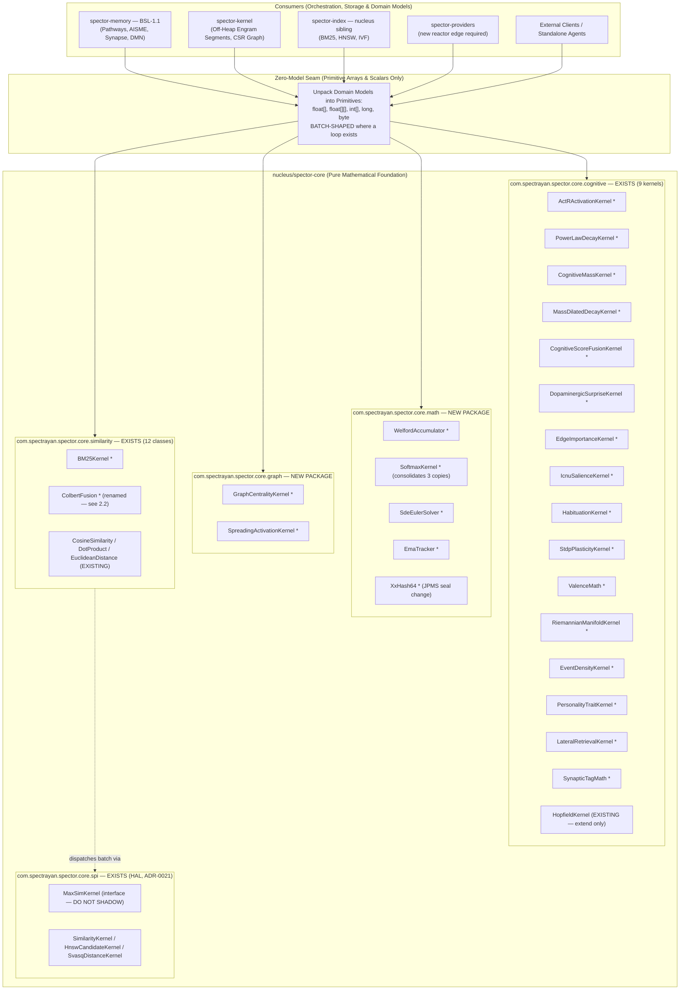

# ADR-0033: Decoupling Cognitive & Mathematical Kernels to Spector Core

| Field | Value |
|:---|:---|
| **Status** | Accepted (Implemented) |
| **Date** | 2026-09-08 |
| **Authors** | Spector Maintainers & Architecture Working Group |
| **Deciders** | Spector Technical Steering Committee (TSC) |
| **Supersedes** | ADR-0033 Draft (Rev 1) |
| **Superseded By** | None |
| **Last Verified** | 2026-09-16 (Verified against `main`) |

---

## 1. Context

Spector is a bio-computational cognitive memory engine designed to bring human-like episodic, semantic, working, and procedural memory to autonomous AI agents. To achieve high retrieval fidelity and biological validity, Spector implements a rich suite of mathematical formulations and computational neuroscience algorithms, including:
- **Anderson’s ACT-R Activation Dynamics** (base-level learning, power-law recency, spaced repetition, and associative fan effect)
- **Wixted & Bahrick Power-Law of Forgetting** with permastore floors and amygdala-mediated arousal decay resistance
- **Friston’s Variational Free Energy Principle** and Active Inference predictive coding
- **Bi & Poo’s Spike-Timing-Dependent Plasticity (STDP)** for causal and anti-causal synaptic weight adaptation
- **Modern Continuous Hopfield Energy Networks** (Log-Sum-Exp and Epanechnikov Log-Sum-ReLU kernels)
- **Robertson’s Okapi BM25 Ranking** and Khattab’s ColBERT MaxSim late-interaction token scoring
- **Wilson’s Algorithm for Random Spanning Trees** (loop-erased random walks) for topological bridge detection
- **Welford’s Numerically Stable Online Algorithm** for running variance, mean, and z-score surprise estimation
- **ADHD-Informed Sigmoid-Gated ICNU Salience** (Interest, Challenge, Novelty, Urgency)
- **Riemannian Manifold Metric Tensor Deformation** for subjective experiential curvature

## 2. Problem Statement

### 1.1 Architectural Anti-Patterns Surfaced in Code Audit

An architectural audit across the 25 modules of the Spector reactor revealed that these mathematical formulas have become **fragmented, duplicated, and tightly coupled** to memory storage models:

1. **Storage and Domain Model Infiltration into Pure Math**:
   Algorithms that are mathematically pure (ACT-R base-level activation, power-law decay, mass-dilated recency, STDP weight updates, edge importance scoring) cannot be invoked without a storage handle. The coupling is structural, not incidental: **all four methods of `ActRActivation` take `HeaderCursor` as their first parameter**, so the ACT-R equation cannot be evaluated against a plain `int[]` of relative-second timestamps. The off-heap reads themselves are one layer down, interleaved with the summation in `StrengthLayout.computeActRActivation` (`seg.get(ValueLayout.JAVA_INT, …)` inside the accumulation loop, `StrengthLayout.java:441`). `ActRActivation` itself never touches `MemorySegment` — it delegates to `cursor.computeActRActivation(...)`.

   Two incidental defects found in the same code and to be resolved during migration:
   - `ActRActivation.computeBaseLevelActivation` carries a **dead `decayExponent` parameter** (Javadoc: "unused, kept for API compatibility").
   - `computeDecayWithActR` branches on a `-1.0f` **sentinel** meaning "no recall history" (`actr >= 0`). Any array-based kernel must preserve this sentinel contract, along with the `relativeSeconds == 0` empty-slot convention and the `recallAgeMs <= 0 → 1000L` floor.

2. **Code Duplication Across Modules — a partially-completed extraction, not random drift**:
   Because foundational math utilities were placed in higher-level modules (`spector-memory`, `spector-kernel`), sibling packages could not access them without creating illegal upstream dependencies. In several cases a kernel-side copy **already exists** (Javadoc-stripped) but the original was never deleted and callers were never repointed. The work is therefore *finishing* a migration, not starting one.

   **Confirmed duplication clusters (12), by severity:**

   | # | Cluster | Copies | Evidence |
   |:--|:--|:--|:--|
   | D1 | **Scalar cosine similarity** | **5 in main source + 1 in bench**, none using `spector-core` | `DenseDerivedSparseProvider:139`, `SessionWriteBuffer:87`, `LateralInhibitionRelay:216`, `EntityDirectory:198`, `SalienceProfile:196`, `SpectorIndexLargeScaleBench:190` |
   | D2 | `Valence` | 2 (+1 variant) | `kernel.score.Valence`, `memory.neuromod.amygdala.Valence`; third `clamp` idiom in `MfValenceWindow:24` |
   | D3 | `BanditStats` / `RunningStats` | 2, bit-identical | `kernel.store.BanditStats`, `memory.cortex.adaptor.RunningStats` |
   | D4 | **Sigmoid** | 4, incl. the *same line copy-pasted twice inside one class* | `EdgeImportance.java:130` **and** `:196`; `SurpriseDetector:130`; collapsed form at `StrengthLayout:463` |
   | D5 | **Softmax** | 3, with **differing numerical-stability guarantees** | `TemperatureSoftmax:54` (max-shifted), `HopfieldKernel.softmax` (max-shifted), `PolicyInferenceEngine:95-107` (**no max-shift — latent overflow bug**) |
   | D6 | Dot product | 2, **differing error contracts** | `VectorSpaceProjectionService:248` truncates to `min(a.length,b.length)`; `Time2VecProjector.dot` throws |
   | D7 | Vector normalize | 1 hand-rolled | `VectorSpaceProjectionService:257` |
   | D8 | `clamp` idioms | ≥4 competing forms | nested `Math.max/min` vs `Math.clamp` vs inline literals |
   | D9 | Welford warm-up guard | magic `>= 20` hardcoded twice vs configurable once | `DefaultImportanceProvider:62,69`, `ImportanceEstimator:114` vs `SurpriseDetector.warmupSamples` |

   **Important qualifications discovered during verification:**
   - The two `Valence` copies are **logically byte-for-byte identical**. Both operate on **signed** `byte` (`-128..127`). There is no unsigned `0..255` valence variant — the unsigned value is *arousal* (`DecayStrategy.java:263`, `Byte.toUnsignedInt`). Their only real difference was the **license header**, which is why the extraction stalled (see §1.2).
   - `SalienceProfile:196` is **semantically different** — it assumes L2-normalised inputs and deliberately returns the raw dot product ("avoids the expensive magnitude computation"). It must **not** be collapsed into D1.
   - The five D1 copies have **mutually incompatible zero-guards** (`== 0` vs `<= 0.0f` vs `> 0`; some null-check, only one checks `length == 0`). Consolidation requires agreeing one documented contract first, and will change behaviour at the boundaries.
   - `spector-providers/pom.xml` has **no `spector-core` dependency**. `DenseDerivedSparseProvider` did not ignore an available utility — it could not see one. Fixing D1 there requires a **new reactor edge**, which is an architecture change, not a refactor.

   **Counter-examples to hold up as the target pattern** (already correct, single-source, multi-consumer — do not disturb):
   - `DecayStrategy.arousalModifier` (`DecayStrategy.java:263`) — one definition, reused by `CognitiveScoreFusion:94,103` and `CognitiveScoreVisitor:154`.
   - `WelfordStats.zScore` (`WelfordStats.java:85`) — one definition, six consumers.

3. **Allocation Overhead in Score-Modulation Hot Paths**:
   `TemperatureSoftmax.applySoftmaxTemperature(List<CognitiveResult>, float)` performs three passes over a `List` via `get(i)`. The dominant cost is **not** the `List` indirection:
   - Pass 2 calls `Math.exp`, a **non-vectorizable intrinsic**. Converting to `float[]` alone will *not* make HotSpot auto-vectorize this loop; explicit `VectorOperators.EXP` over `FloatVector` is required.
   - Pass 3 allocates a fresh 7-arg `ScoreBreakdown` **plus** a fresh 17-component `CognitiveResult` **per element**, then `results.set(i, …)`. This is the real cost and it violates the zero-allocation-in-hot-paths rule.
   - It also allocates `double[] expWeights = new double[n]` per call.

   Migration must therefore target **allocation elimination and an explicit vectorized exp**, not merely an array-shaped signature. Existing early-outs must be preserved: `size() <= 1`, the `|T - 1.0| < 1e-4` identity short-circuit (also gated in `TemperatureSoftmaxRelay:59`), and the `sumExp <= 0 || isNaN` bail-out. `TemperatureSoftmaxRelay` re-sorts after the call, so in-place mutation semantics must be preserved or the relay updated in the same commit.

4. **Inability to Reuse Cognitive Math Standalone**:
   External microservices, edge agents, and sibling repositories (`coding-agents`, `homo-digitalis`) cannot consume these algorithms without pulling in the entire off-heap `spector-kernel` and `spector-memory` reactor. Two constraints bound how far this goal can be met — see §5.3.

### 1.2 Licensing Decision (Project Lead — Project Lead)

`spector-core` is Apache 2.0. `spector-memory` is BSL-1.1 (own `LICENSE`, enforced by a `license-maven-plugin` override at `memory/spector-memory/pom.xml:126-153` pointing at `src/license/bsl-header.txt`). **Roughly 18 of the 34 catalogued algorithms currently carry BSL-1.1 headers**, including the flagship `CognitiveScoreFusion`, `SurpriseDetector`, `WelfordStats`, `IcnuWeights`, `HabituationPenalty`, `LateralEvaluator`, `TemperatureSoftmax`, `PersonalityTemperature`, `HomeostaticCore`, `ColBERTReranker`, `ManifoldConsolidator`, `EventDensityFilter`, and `ActRActivation`.

**Decision: the mathematical formulae and algorithms migrated by this ADR become Apache 2.0 on arrival in `spector-core`.** The differentiator is retained in the *orchestration* layers that stay BSL-1.1 — the cognitive pathways, AISME loop, consolidation scheduling, tier routing, off-heap engram layout, and the recall/dream/wander policy graphs in `spector-memory`. Published formulae with cited academic provenance are not the moat; the integrated system is.

**This decision is deliberate and must be recorded explicitly, because an unintended relicensing is already in flight and would otherwise be silently ratified by this ADR:**

- `memory/spector-kernel/pom.xml:3-6` carries a BSL-1.1 header comment, and the `sealed-kernel-module` spec declares the module BSL-1.1.
- However, that pom has **no `license-maven-plugin` override**, so the root pom's Apache licenseSet applies with `skipExistingHeaders=false`.
- Verified by grep across `memory/spector-kernel/src/main/java`: **`Business Source License 1.1` → 0 matches; Apache 2.0 → every file**, including `CoActivationMemory` (STDP), `CognitiveMass`, `DecayStrategy`, `EdgeImportance`, `BridgeDetector` (Wilson), `SynapticTagEncoder`, `HebbianGraphMemory`, `StrengthLayout`, and `module-info.java`.

**Mandatory prerequisite tasks (P0, must land before Phase 1):**

| # | Task | Owner |
|:--|:--|:--|
| L1 | Reconcile `memory/spector-kernel/pom.xml` — remove the stale BSL-1.1 comment and confirm Apache 2.0 as the intended license for the module, **or** add the BSL licenseSet override for the parts that must stay BSL. Decide once; do not leave the pom and the headers disagreeing. | Platform Engineer |
| L2 | Update the `sealed-kernel-module` spec, which currently states `memory/spector-kernel` is BSL-1.1, to match the outcome of L1. | Product Working Group |
| L3 | For each of the 18 BSL→Apache file moves, record the relicensing in the commit body (`Relicense: BSL-1.1 → Apache-2.0 per ADR-0033 §1.2`) so the provenance is auditable. | Developer |
| L4 | Confirm the BSL-1.1 Change Date clause (May 27, 2030) has no residual obligation for code relicensed early to a *more permissive* license. Apache 2.0 is the declared Change License, so early conversion is directionally consistent — but state it, do not assume it. | Technical Lead |

### 1.3 Corrections to Rev 1 (verified against `main`)

Rev 1 contained factual errors that materially under-scoped the work. Corrected here so implementers are not misled:

| Rev 1 claim | Verified reality |
|:--|:--|
| "no regression across the **1,083** existing test cases" | **~4,671 test methods across 697 test classes.** Off by ~4×. The regression surface is four times larger than planned for. |
| "audit across all **24** modules" | The default reactor lists **25** modules (`synapse/spector-synapse` also appears in the `synapse` profile, which is correct, not a duplicate). |
| `XxHash64` is a Phase 1 "zero-risk deduplication" | It lives at `memory/spector-kernel/.../kernel/util/XxHash64.java` — inside the **only JPMS-modularized module in the repo** — and `kernel.util` is **not exported** by `module-info.java`. Moving it is a seal change policed by `KernelSealRulesTest` and `KernelSealBoundaryTest`. Additionally, there is **exactly one copy in the entire repo**, so it is not a deduplication at all. See #31. |
| "Embedded inside `BM25Index.java`" / Phase 5 "Refactor **spector-memory** (…BM25Index…)" | Two distinct classes were conflated: `BM25Index` is in **`nucleus/spector-index`**, and `spector-memory` has a separate `MemoryBM25Index`. Both need work. See #28. |
| `ActRActivation` "directly reads off-heap ring buffer bytes" | It never touches `MemorySegment`; it delegates. The reads are in `StrengthLayout:441`. Coupling claim stands, wording did not. Corrected in §1.1(1). |
| The two `Valence` copies differ in signed/unsigned handling | They do not — both are signed `byte`. Corrected in §1.1(2). |
| `CognitiveScoreFusion` in `memory.score` | Actual package: `com.spectrayan.spector.memory.synapse.scan`. |
| §2.1 lists `spector-config` as a "higher-level module" | `spector-config` is in **`nucleus/`**, a sibling of `spector-core`, not above it. Same for `spector-index`, which is in `nucleus/` and **already depends on `spector-core`**. The ban still holds (core must not depend on either) but the layering wording was wrong. |
| "Interface exists in `core.spi.MaxSimKernel`" treated as a free namespace | Correct — and that is precisely why the proposed `core.similarity.MaxSimKernel` is a **collision**. See §2.2. |

**Target-module state, also verified:** `spector-core` is further along than Rev 1 assumed. `core.cognitive` already contains **9 SIMD kernels** (`BocpdKernel`, `CompositeImportanceKernel`, `ExpectedFreeEnergyKernel`, `FreeEnergyKernel`, `HopfieldKernel`, `IntegratedInformationKernel`, `LsrHopfieldKernel`, `NeuralManifoldDistance`, `PredictiveCodingKernel`); `core.similarity` contains 12 classes; `core.spi` contains the HAL. **Only `core.math` and `core.graph` are genuinely new packages.**

---

## 3. Decision Drivers

- **Mathematical Purity**: Cognitive equations (ACT-R, Wixted decay, Friston Free Energy, Hopfield energy) must be pure functions over primitives (`float[]`, `double[]`, `int[]`), completely decoupled from off-heap storage segments or domain handles.
- **Zero-Allocation Hot Paths**: Reranking, temperature softmax, and score fusion must operate in-place with zero heap allocations on high-frequency query paths.
- **Unified Reactor Placement**: Deduplicate 12 math clusters across the 25 modules into a single authoritative root foundation module (`nucleus/spector-core`).
- **Permissive Open-Source Licensing**: Mathematical formulations published in academic literature belong in the Apache 2.0 foundation (`spector-core`), while proprietary cognitive orchestration stays in `spector-memory` (BSL-1.1).

## 4. Considered Options

### Option 1: Status Quo (Monolithic Coupled Modules)
- **Description**: Keep mathematical utilities scattered across `spector-memory` and `spector-kernel`.
- **Advantages**: Avoids code movement and refactoring of call sites.
- **Disadvantages**: 12 confirmed duplication clusters; pure equations cannot be tested without off-heap Panama FFM slabs; sibling modules cannot reuse math.

### Option 2: Fine-Grained Micro-Libraries
- **Description**: Split math into multiple independent Maven modules (`spector-math-actr`, `spector-math-hopfield`, `spector-math-stats`).
- **Advantages**: Extreme modularity.
- **Disadvantages**: Maven reactor explosion; circular dependency management overhead.

### Option 3: Unified Decoupled Foundation in `nucleus/spector-core` (Selected)
- **Description**: Migrate all 34 pure mathematical and computational neuroscience algorithms into `nucleus/spector-core`, providing pure array-based signatures while higher-level modules retain storage cursor facades.
- **Advantages**: Single source of truth; zero GC allocations; headless unit testability; unblocks sibling repo reuse (`coding-agents`).
- **Disadvantages**: Requires coordinated migration across ~4,671 test methods and 25 reactor modules.

## 5. Decision Outcome



`*` = new type introduced by this ADR. Unmarked types already exist in `spector-core` on `main` and must be **extended or reused**, never shadowed.

### 2.1 Core Architectural Principles

1. **Principle 1: Absolute Zero Domain Model Infiltration into `spector-core`**:
   `spector-core` **MUST NOT** import any classes from `spector-kernel`, `spector-memory`, `spector-index`, `spector-config`, `spector-events`, or any `memory/`, `synapse/` module. (Note: `spector-config` and `spector-index` are `nucleus/` siblings, not higher layers — the ban is on *any* non-`commons` module dependency, in either direction of the diagram.) Every algorithm must accept strictly:
   - Scalar primitives: `float`, `double`, `int`, `long`, `byte`, `boolean`.
   - Primitive arrays: `float[]`, `double[]`, `float[][]`, `int[]`, `int[][]`, `long[]`, `byte[]`.
   - `SpectorValidationException` / `ErrorCode` from `spector-commons` (see §5.3 for the weight this carries).

   No enums, no records from upstream, no `MemorySegment`, no `List<T>` of domain types, no `Clock`, no `Random` field, no config object.

2. **Principle 2: Explicit Purity Classification — three tiers, each with a stated contract**:
   Rev 1 mandated "stateless pure static methods" and then specified signatures that violate it (`static void update(WelfordDistribution, double)` mutating an instance; a `budgetMs` time budget; Wilson's algorithm with no seed). Every kernel must now declare which tier it belongs to:

   | Tier | Contract | Applies to |
   |:--|:--|:--|
   | **T1 — Pure** | `public final class`, private ctor, static methods only. Deterministic. No clock, no RNG, no mutable state. Property-testable with `jqwik` without fixtures. | The large majority: #2, #3, #4, #6, #8, #9, #10, #11, #13, #15, #16, #17, #18, #19, #20, #21, #22, #23, #24, #26, #28, #29, #30, #31, #33, #34 |
   | **T2 — Immutable accumulator** | A `record` whose `update(...)` **returns a new instance**. Safe for concurrent reads; a read-modify-write across threads can lose updates and the caller must guard it. **Any clock value must be a `long nowMs` parameter — never `System.currentTimeMillis()` inside the kernel**, or the type is not deterministically testable. | #14 (`WelfordAccumulator`), #27 (`EmaTracker`) |
   | **T3 — Explicitly stochastic / bounded** | Deterministic *given a seed*. **MUST** take `long seed` and MUST NOT read a clock. A wall-clock work budget is a **scheduling concern and belongs in the caller**, not the kernel; express the bound as `maxWalkSteps`/`sampleCount` instead. | #12 (Wilson spanning trees), #25 (Euler-Maruyama — takes a caller-supplied `float[] stdNormalRandom`, so it is actually T1) |

   This is not pedantry: §5.1's claim that every formula becomes "deterministic and verifiable via property-based testing" is **false** for any kernel that reads a clock or an unseeded RNG. Classify first, then the test strategy follows.

3. **Principle 3: Honest Vectorization — batch-shaped seams where a loop exists, scalar where it does not**:
   Rev 1 claimed this work "unblocks full vectorization across AVX2, AVX-512, and ARM NEON." That is over-claimed and it drove a seam design that makes vectorization *harder*.

   **~26 of the 34 algorithms are scalar-in / scalar-out** — `fanFactor(int)`, `arousalModifier(byte)`, `computeMass(float,byte,float)`, `fastStorageBoost`, `computeDeltaWeight`, `penalty(int,float)`, `inhibitionOfReturn`, `linearModulate`, `updateEma`, `idf`, `scoreTerm`, `neighborOverlapBridgeScore`, `deriveBeta`, `zScoreToImportance`, `congruence`, and so on. **There is no loop in a `static float f(...)` to vectorize.** For these, the benefit is dedup, testability, and C2 inlinability — say that, and claim nothing more.

   **The design consequence is the important part.** Exposing a per-record scalar entry point and calling it inside a scan loop *prevents* batch SIMD permanently. Any kernel that will be invoked once per candidate during a scan **MUST additionally expose a batch form operating on struct-of-arrays**:

   ```java
   // Per-record form — permitted for correctness, clarity and unit testing
   static float computeFusedScore(float l2dist, long timestampMs, float mass, byte arousal, /* … */);

   // Batch form — REQUIRED for any kernel on a scan hot path. This is the seam
   // that AcceleratorRegistry / spector-cpu can later accelerate.
   static void computeFusedScores(float[] l2dists, long[] timestampsMs, float[] masses,
                                  byte[] arousals, float[] storageStrengths, int[] recallCounts,
                                  /* … */, long nowMs, float[] outScores, int count);
   ```

   Kernels **required** to ship a batch form: #34 (fusion), #21 (softmax), #28 (BM25 term scoring), #29 (MaxSim), #1 (ACT-R over a candidate set), #4/#7 (decay), #8 (mass), #13 (edge importance during pruning sweeps), #32 (manifold update).

   Where SIMD genuinely applies, use `SimdCapability.PREFERRED_SPECIES` (never a hardcoded lane width) with `SPECIES.loopBound(n)` main loop plus `SPECIES.indexInRange(i, n)` masked tail, matching the existing `CosineSimilarity` pattern. For `exp`-bearing loops (#21, #15) use `VectorOperators.EXP` explicitly — **`Math.exp` is a non-vectorizable intrinsic and array-shaping alone will not help**.

4. **Principle 4: Thin-Adapter Pattern in Upstream Modules**:
   Upstream classes in `spector-memory` and `spector-kernel` (`CognitiveScoreFusion`, `ActRActivation`, `DecayStrategy`, `SurpriseDetector`, `EdgeImportance`, etc.) remain as backward-compatible facades. They unpack headers, cursors and options, delegate the raw calculation to the `spector-core` kernel, and repackage into domain objects (`CognitiveResult`, `ScoredRecord`, `AttractorState`).

   Adapters are marked `@Deprecated(since = "<the release that lands the phase>", forRemoval = true)` with the replacement named in the Javadoc `@deprecated` tag. **Removal window: two minor releases**, tracked by a follow-up issue per phase. "One minor version" in Rev 1 was unactionable because no version was named.

5. **Principle 5: The Boundary Is Enforced by CI, Not by Prose** *(new)*:
   Principle 1 is currently unenforceable. Verified: the repo has **no `maven-enforcer-plugin`, no `bannedDependencies`, no checkstyle `import-control`**, and `spector-core` has **no ArchUnit test** (ArchUnit exists only in `spector-test-support`, `spector-kernel`, `spector-memory`, `spector-mcp`). Nothing stops the next PR from importing `spector-memory` into core.

   **Phase 1 must therefore deliver, as a gate on all later phases:**

   ```java
   // nucleus/spector-core/src/test/java/.../core/arch/CoreBoundaryRulesTest.java
   noClasses().that().resideInAPackage("com.spectrayan.spector.core..")
       .should().dependOnClassesThat()
       .resideInAnyPackage("..spector.kernel..", "..spector.memory..",
                           "..spector.index..", "..spector.config..",
                           "..spector.events..", "..spector.provider..");
   ```

   Plus `maven-enforcer-plugin` `bannedDependencies` on the `spector-core` module restricting compile-scope deps to `spector-commons` and `slf4j-api`.

   **Known trap — do not skip:** ArchUnit 1.4.0 **silently imported 0 classes** on Java 25 class-file major 69 (documented in `KernelNamingRulesTest`, issue #734). The new rule **must** carry the same "did we actually import any classes" assertion guard, or it will pass vacuously and provide false assurance.

6. **Principle 6: Behavioural Parity Is Proven, Not Assumed** *(new)*:
   §5.1's `jqwik` property tests verify the *new* kernel is internally self-consistent. They do **not** verify it matches the code being replaced. Every phase ships a **parity harness**: capture the current implementation's outputs over a fixed input corpus (including boundary and degenerate cases), then assert the migrated kernel is **bit-identical**, or record a signed-off epsilon and the reason.

   Known precision hazards already identified:
   - **`DenseDerivedSparseProvider` accumulates in `double`; `core.CosineSimilarity` accumulates in `float` SIMD lanes.** Swapping changes sparse term weights → changes `weightThreshold` filtering → **changes recall results**. This is not a drop-in; it needs golden-value re-baselining.
   - `PolicyInferenceEngine:95-107` has **no max-shift stabilization**. Consolidating it onto `SoftmaxKernel` is a **deliberate behaviour change that fixes a latent overflow bug** — call it out in the changelog rather than filing it as a refactor.
   - `StrengthLayout.computeActRActivation` conventions that must survive: `relativeSeconds == 0` means empty slot; `recallAgeMs` floors at `1000L`; the initial encoding bucket is added *after* the loop; `-1.0f` is the no-history sentinel.
   - The five D1 cosine copies have incompatible zero-guards; picking one contract changes behaviour at the degenerate boundary in the other four call sites.

---

### 2.2 Name Collisions with Existing `spector-core` Types — Resolutions

Rev 1's target names collide with types that already exist on `main`. Resolutions are binding:

| Rev 1 target | Conflict | Resolution |
|:--|:--|:--|
| `core.similarity.MaxSimKernel` (#29) | **`core.spi.MaxSimKernel` already exists** as the ColBERT SPI interface (ADR-0021 HAL). Two `MaxSimKernel` types in one artifact. Rev 1 also contradicted itself — the diagram said `MaxSimScorer`, §3.11 said `MaxSimKernel`. | Add `combineScores(...)` as a **`static` method on the existing `core.spi.MaxSimKernel` interface**, and place any additional non-SPI fusion helpers in a distinctly named `core.similarity.ColbertFusion`. Do not introduce a second `MaxSimKernel`. |
| `core.cognitive.HopfieldKernel.deriveBeta` (#23) | **`core.cognitive.HopfieldKernel` already exists** with `computePatternProjections`, `softmax(float[], float beta, float[])` and attractor convergence. | This is an **extension of an existing class**, not a migration. Add `deriveBeta` to it. Reclassify #23 in the roadmap accordingly. |
| `core.math.SoftmaxKernel` (#21) | Would become the **fourth** softmax alongside `HopfieldKernel.softmax`, `TemperatureSoftmax`, `PolicyInferenceEngine`. | `SoftmaxKernel` becomes the **single** implementation. `HopfieldKernel.softmax` is refactored to delegate to it (preserving its `beta`-scaled logit form). `TemperatureSoftmax` and `PolicyInferenceEngine` both repoint. Net type count goes **down**, not up. |
| SPI interface names in Rev 1 prose (`Similarity`, `HnswKernel`, `SvasqKernel`) | None of these exist. | Actual names are `SimilarityKernel`, `HnswCandidateKernel`, `SvasqDistanceKernel`. Scalar-pair similarity dispatch is via the `SimilarityFunction` **enum**, not an SPI interface. |

**Additional placement note:** `spector-core` has **no `module-info.java`** and does not itself declare `jdk.incubator.vector` — it inherits `--add-modules jdk.incubator.vector --enable-preview` from the root pom's compiler and surefire configuration. New kernels inherit the same arrangement; no per-module JPMS work is in scope here.

---

---

## Catalog of Migrated Algorithms

The following 34 algorithms are cataloged across 14 computational domains, defining their exact source location, mathematical formula, proposed core class, and parameterized signature.

**How to read this catalog (rev 2):**
- **Purity tier** (T1 / T2 / T3) is stated per §2.1 Principle 2 wherever the kernel is not trivially pure. It determines the test strategy.
- Entries marked **⚠** had their Rev 1 target or signature **changed** — either because the target name collides with an existing `spector-core` type (§2.2), or because the signature violated the purity contract it was filed under. Those changes are binding.
- Kernels on a scan hot path carry a **REQUIRED batch form** per §2.1 Principle 3. The per-record form remains for correctness and unit testing.
- All source locations below were verified against `main` on 2026-09-10. Rev 1 location errors are corrected in place; the full list of corrections is in §1.3.

### 3.1 Domain 1: ACT-R Activation & Spreading Dynamics (3 algorithms)

#### 1. ACT-R Base-Level Activation & Spaced Practice
- **Biological / Theoretical Foundation**: Anderson’s ACT-R declarative memory equation capturing recency, frequency, and spaced practice effects:
  $$B_i = \ln\left(\sum_{j=1}^n t_j^{-d}\right)$$
  Normalized via the algebraic sigmoid identity: $\sigma(B_i) = \frac{\text{sum}}{\text{sum} + 1.0f}$.
- **Current Location**: `ActRActivation.java` (all 4 methods take `HeaderCursor`; delegates only) & `StrengthLayout.java:435` (the actual off-heap read loop, `seg.get` at :441). `StrengthLayout.readActRTimestamps` (:414) **already** produces the `int[]`, so extraction is mechanically straightforward.
- **Core Target**: `com.spectrayan.spector.core.cognitive.ActRActivationKernel` — **Purity tier T1**
- **Core Method Signature**:
  ```java
  public static float computeBaseLevelActivation(long[] recallAgesMs, float decayExponent);
  public static float computeBucketActivation(int[] relativeSeconds, long creationMs, long nowMs, float[] decayBuckets);
  // REQUIRED batch form (Principle 3) — invoked once per candidate during scan
  public static void computeBucketActivations(int[][] relativeSeconds, long[] creationMs, long nowMs,
                                             float[] decayBuckets, float[] outActivations, int count);
  ```
- **Contracts that MUST be preserved (Principle 6)**: `relativeSeconds[i] == 0` means empty slot (skip, do not treat as age 0); `recallAgeMs <= 0` floors to `1000L`; the creation-time encoding bucket is added **after** the ring-buffer loop; return **`-1.0f`** when `validSlots == 0` — `computeDecayWithActR` branches on `actr >= 0` to choose between ACT-R and the `DecayStrategy.computeDecay` fallback.
- **Cleanup during migration**: drop the dead `decayExponent` parameter from the cursor-based adapter (Javadoc already marks it unused) — or wire it through properly. Do not carry a dead parameter into a new API.

#### 2. ACT-R Fan Effect & Semantic Dilution
- **Biological / Theoretical Foundation**: Anderson's associative fan effect; high-degree concept hubs dilute activation spreading:
  $$\text{fanFactor}(d) = \frac{1}{\sqrt{d}}$$
- **Current Location**: `CoActivationMemory.crossCaptureTraversal:723`.
- **Core Target**: `ActRActivationKernel.fanFactor(int degree)`
- **Core Method Signature**:
  ```java
  public static float fanFactor(int degree);
  ```

#### 3. Attenuated Spreading Activation Diffusion
- **Biological / Theoretical Foundation**: Collins & Loftus (1975) multi-hop semantic network spreading activation:
  $$W_h = W_0 \cdot \gamma^h \cdot \text{fanFactor}(d) \cdot \ln\left(1 + \frac{N}{d + 1}\right)$$
- **Current Location**: `HebbianGraphMemory.activateRecursive` and `CoActivationMemory.java:725`.
- **Core Target**: `com.spectrayan.spector.core.graph.SpreadingActivationKernel`
- **Core Method Signature**:
  ```java
  public static float compoundWeight(float baseWeight, int hopDepth, float perHopAttenuation, int degree, int corpusSize);
  ```

---

### 3.2 Domain 2: Temporal Decay, Forgetting & Reconsolidation (4 algorithms)

#### 4. Wixted Power-Law of Forgetting & Permastore Floor
- **Biological / Theoretical Foundation**: Wixted (2004) power-law forgetting curve $R(t) = a \cdot t^{-d}$ combined with Bahrick (1984) permastore floor $\max(\text{floor}, a \cdot t^{-d})$ quantized into 12 discrete logarithmic time buckets.
- **Current Location**: `DecayStrategy.java:89-159`.
- **Core Target**: `com.spectrayan.spector.core.cognitive.PowerLawDecayKernel`
- **Core Method Signature**:
  ```java
  public static float[] computeBuckets(float exponent, float floor);
  public static int ageToBucket(long creationMs, long nowMs);
  public static float computeDecay(long creationMs, long nowMs, float[] buckets);
  ```

#### 5. Long-Term Potentiation (LTP) Reconsolidation
- **Biological / Theoretical Foundation**: Memory retrieval triggers reconsolidation, exponentially shifting the effective perceived age through half-life doubling (`rawBucket >> min(recallCount, 5)`), with gentler linear shifts for passive auto-recall.
- **Current Location**: `DecayStrategy.adjustForReconsolidation` and `DecayStrategy.adjustForAutoRecall`.
- **Core Target**: `PowerLawDecayKernel.adjustForReconsolidation(int rawBucket, int recallCount)`
- **Core Method Signature**:
  ```java
  public static int adjustForReconsolidation(int rawBucket, int agentRecallCount);
  public static int adjustForAutoRecall(int currentBucket, int passiveRecallCount);
  ```

#### 6. Amygdala Arousal Decay Modulation
- **Biological / Theoretical Foundation**: McGaugh (2000) emotional modulation of consolidation; high emotional arousal slows decay rate by up to 65%.
- **Current Location**: `DecayStrategy.arousalModifier`.
- **Core Target**: `PowerLawDecayKernel.arousalModifier(byte arousal)`
- **Core Method Signature**:
  ```java
  public static float arousalModifier(byte arousal);
  public static float computeDecayWithArousal(long timestampMs, long nowMs, int recallCount, byte arousal, float[] buckets);
  ```

#### 7. Continuous Mass-Dilated Recency Decay (ADR-0031)
- **Biological / Theoretical Foundation**: Continuous log-recency decay inversely dilated by cognitive mass $M_i$:
  $$R_\lambda(\Delta t, M_i) = \frac{1}{1 + \frac{\lambda \cdot \ln(1 + \Delta t_{\text{days}})}{1 + M_i}} \cdot \text{arousalModifier}(A) \cdot \left(1 + 0.05 \cdot \min(N, 10)\right)$$
- **Current Location**: `CognitiveScoreFusion.computeMassDilatedDecay`.
- **Core Target**: `com.spectrayan.spector.core.cognitive.MassDilatedDecayKernel`
- **Core Method Signature**:
  ```java
  public static float compute(long timestampMs, long nowMs, float cognitiveMass, byte arousal, int recallCount, boolean zeroTimeDecay, float lambda);
  ```

---

### 3.3 Domain 3: Dynamic Cognitive Mass & Two-Factor Memory (2 algorithms)

#### 8. Dynamic Cognitive Mass Computation
- **Biological / Theoretical Foundation**: Relativistic information mass synthesising raw importance $I$, emotional arousal $A$, and consolidated storage strength $S$:
  $$M_i = \left(\frac{I_i}{10}\right) \cdot \left(1 + \frac{A_i \pmod{256}}{128}\right) \cdot S_i^{0.3}$$
- **Current Location**: `CognitiveMass.computeCognitiveMass` & `CognitiveScoreFusion.computeCognitiveMass`.
- **Core Target**: `com.spectrayan.spector.core.cognitive.CognitiveMassKernel`
- **Core Method Signature**:
  ```java
  public static float computeMass(float importance, byte arousal, float storageStrength);
  ```

#### 9. Fast Storage Strength Boost LUT (Bjork & Bjork)
- **Biological / Theoretical Foundation**: Bjork & Bjork (1992) New Theory of Disuse; precomputed 64-entry LUT for $S^{0.3}$ with linear interpolation, eliminating `Math.pow()` from scan hot-paths.
- **Current Location**: `CognitiveMass.fastStorageBoost`.
- **Core Target**: `CognitiveMassKernel.fastStorageBoost(float storageStrength, float exponent)`
- **Core Method Signature**:
  ```java
  public static float fastStorageBoost(float storageStrength, float exponent);
  ```

---

### 3.4 Domain 4: Synaptic Plasticity & Graph Centrality (3 algorithms)

#### 10. Bi-Exponential Spike-Timing-Dependent Plasticity (STDP)
- **Biological / Theoretical Foundation**: Bi & Poo (1998) asymmetric millisecond-scale plasticity:
  $$dW_{\text{causal}} = A_+ \cdot \exp\left(-\frac{\Delta t}{\tau_+}\right), \quad dW_{\text{anti}} = -A_- \cdot \exp\left(-\frac{\Delta t}{\tau_-}\right)$$
- **Current Location**: `CoActivationMemory.recordSequentialActivation:474-478`.
- **Core Target**: `com.spectrayan.spector.core.cognitive.StdpPlasticityKernel`
- **Core Method Signature**:
  ```java
  public static float computeDeltaWeight(long dtMs, float aPlus, float aMinus, float tauPlus, float tauMinus);
  public static float updateWeight(float currentWeight, float deltaWeight, float minWeight, float maxWeight);
  ```

#### 11. Heuristic Neighbor Overlap Bridge Centrality
- **Biological / Theoretical Foundation**: Jaccard-like structural edge centrality:
  $$\text{score} = \operatorname{clamp}\left(\operatorname{round}\left(\left(1 - \frac{|\Gamma(A) \cap \Gamma(B)|}{\min(d_A, d_B)}\right) \cdot 255\right), 0, 255\right)$$
- **Current Location**: `BridgeDetector.computeBridgeScore`.
- **Core Target**: `com.spectrayan.spector.core.graph.GraphCentralityKernel`
- **Core Method Signature**:
  ```java
  public static int neighborOverlapBridgeScore(int sharedNeighbors, int degreeA, int degreeB);
  public static int countSharedNeighbors(int[] neighborsA, int countA, int[] neighborsB, int countB);
  ```

#### 12. Wilson’s Algorithm for Random Spanning Tree Sampling
- **Biological / Theoretical Foundation**: Loop-erased random walks generating uniform random spanning trees (Wilson 1996) to compute empirical betweenness centrality across disconnected subgraphs.
- **Current Location**: `BridgeDetector.sampleSpanningTrees` (`memory/spector-kernel/.../kernel/score/BridgeDetector.java`).
- **Core Target**: `com.spectrayan.spector.core.graph.GraphCentralityKernel` — **Purity tier T3 (explicitly stochastic)**
- **Core Method Signature** (revised — Rev 1's signature was neither seeded nor pure):
  ```java
  // long seed  → deterministic given a seed; REQUIRED for reproducible tests and benchmarks
  // maxWalkSteps → bounds the loop-erased random walk WITHOUT reading a clock
  public static byte[] computeWilsonBridgeScores(int[][] adjacency, int nodeCount,
                                                int sampleCount, int maxWalkSteps, long seed);
  ```
- **⚠ Why the signature changed**: Rev 1 specified `long budgetMs`, which requires the kernel to read a wall clock. That makes it impure, non-deterministic, and untestable by property-based testing — directly contradicting §5.1. A **wall-clock budget is a scheduling concern and stays in the `BridgeDetector` adapter**, which may call the kernel in bounded slices and stop when its own budget expires. The kernel gets a step bound instead.
- Wilson's algorithm requires an RNG. Rev 1's signature had no seed, so results were irreproducible run-to-run. `long seed` is mandatory.

---

### 3.5 Domain 5: Synaptic Pruning & Multi-Signal Edge Importance (1 algorithm)

#### 13. 9-Signal Synaptic Pruning Scorer
- **Biological / Theoretical Foundation**: 9-signal multi-factor synaptic importance combining Hebbian LTP frequency, STC early-LTP decay, Wilson betweenness centrality, synaptic competition, ACT-R base transfer, amygdala arousal, Bower mood-congruence, Bjork two-factor storage, and Zeigarnik task completion protection.
- **Current Location**: `EdgeImportance.java:120-210`.
- **Core Target**: `com.spectrayan.spector.core.cognitive.EdgeImportanceKernel`
- **Core Method Signature**:
  ```java
  public static float score(
          float weight, int currentCycle, int lastCycle, int bridgeScore, int sharedNeighbors,
          float importanceA, float importanceB, byte arousalA, byte arousalB,
          byte valenceA, byte valenceB, float storageA, float storageB,
          boolean isProtectedA, boolean isProtectedB, float[] weights);
  ```

---

### 3.6 Domain 6: Dopaminergic Novelty & Statistical Surprise (3 algorithms)

#### 14. Welford’s Online Distribution Algorithm
- **Biological / Theoretical Foundation**: Numerically stable online one-pass algorithm (Welford 1962) computing baseline prediction expectations (running mean, variance, stddev, and z-score).
- **Current Location**: `WelfordStats.java:85` — **note this is already single-source with six consumers and is NOT duplicated**; it is being relocated for reuse, not deduplicated.
- **Core Target**: `com.spectrayan.spector.core.math.WelfordAccumulator` — **Purity tier T2 (immutable accumulator)**
- **Core Method Signature** (revised — Rev 1's was self-contradictory):
  ```java
  public record WelfordAccumulator(long count, double mean, double m2) {
      public static final WelfordAccumulator EMPTY = new WelfordAccumulator(0L, 0.0, 0.0);
      public WelfordAccumulator update(double sample);   // returns a NEW instance
      public double variance();
      public double stdDev();
      public double zScore(double sample);              // guards stdDev < 1e-9
  }
  ```
- **⚠ Why the signature changed**: Rev 1 specified `public static void update(WelfordDistribution dist, double sample)` — a static method **mutating an instance** — while Principle 2 simultaneously required "lightweight, thread-safe records". A record cannot be mutated. Resolved as an immutable record returning a new instance, matching the pattern `BanditStats.update` already uses correctly.
- **Also migrate the warm-up guard.** The magic threshold `count() >= 20` is hardcoded at `DefaultImportanceProvider:62,69` and `ImportanceEstimator:114`, while `SurpriseDetector` uses a configurable `warmupSamples` field for the same purpose. Expose `boolean isWarm(long minSamples)` on the record and route the threshold through config — do not carry the magic number forward.

#### 15. Dopaminergic Surprise Sigmoid Transfer
- **Biological / Theoretical Foundation**: Dopaminergic prediction error scaling:
  $$I(z) = 0.05 + 9.95 \cdot \frac{1}{1 + \exp(-1.2 \cdot (z - 1.0))}$$
- **Current Location**: `SurpriseDetector.zScoreToImportance`.
- **Core Target**: `com.spectrayan.spector.core.cognitive.DopaminergicSurpriseKernel`
- **Core Method Signature**:
  ```java
  public static float zScoreToImportance(double zScore, float center, float steepness);
  public static float dualSurprise(float spatialSurprise, float temporalSurprise, float spatialWeight);
  ```

#### 16. Flashbulb Memory Gating Criteria
- **Biological / Theoretical Foundation**: Brown & Kulik (1977) flashbulb gating triggered when prediction error exceeds $z > 3.0\sigma$.
- **Current Location**: `FlashbulbPolicy.java`.
- **Core Target**: `DopaminergicSurpriseKernel.isFlashbulb(double zScore, double threshold)`

---

### 3.7 Domain 7: Neurodivergent Cognition, Gating & Diversity (4 algorithms)

#### 17. Sigmoid-Gated ICNU Salience Synthesis
- **Biological / Theoretical Foundation**: Dodson (2005) ADHD dopaminergic gating requiring interest AND novelty to fire simultaneously:
  $$\text{stimulus} = w_I (I \times N) + w_C C + w_U U, \quad \text{gated} = \sigma(k \cdot (\text{stimulus} - \theta))$$
- **Current Location**: `IcnuWeights.fuse`.
- **Core Target**: `com.spectrayan.spector.core.cognitive.IcnuSalienceKernel`
- **Core Method Signature**:
  ```java
  public static float fuse(float interest, float challenge, float novelty, float urgency,
                           float wInterest, float wChallenge, float wNovelty, float wUrgency,
                           float threshold, float steepness);
  ```

#### 18. Sensory Habituation Diminishing Return (Repetition Suppression)
- **Biological / Theoretical Foundation**: Groves & Thompson (1970) Dual-Process Theory:
  $$P(k) = \frac{1}{1 + (k - 1) \cdot \lambda_{\text{decay}}}$$
- **Current Location**: `HabituationPenalty.computePenalty`.
- **Core Target**: `com.spectrayan.spector.core.cognitive.HabituationKernel.penalty(int timesSeen, float decayRate)`

#### 19. Inhibition of Return (IOR) Refractory Period Recovery
- **Biological / Theoretical Foundation**: Posner & Cohen (1984) refractory linear recovery preventing activation fixation:
  $$\text{IOR}(\Delta t) = \text{floor} + (1 - \text{floor}) \cdot \min\left(1.0, \frac{\Delta t}{\text{TTL}}\right)$$
- **Current Location**: `HabituationPenalty.computeInhibitionOfReturn`.
- **Core Target**: `HabituationKernel.inhibitionOfReturn(long elapsedMs, long ttlMs, float floor)`

#### 20. Lateral Thinking Evaluation & Hallucination Index
- **Biological / Theoretical Foundation**: Reduced latent inhibition utility tracking:
  $$\text{LUR} = \frac{R}{N}, \quad \text{LSR} = \frac{S}{N}, \quad \text{LHI} = (1 - \text{LUR}) \cdot \text{LSR}$$
- **Current Location**: `LateralEvaluator.java:136-150`.
- **Core Target**: `com.spectrayan.spector.core.cognitive.LateralRetrievalKernel`
- **Core Method Signature**:
  ```java
  public static float utilityRate(int reinforced, int returned);
  public static float suppressionRate(int suppressed, int returned);
  public static float hallucinationIndex(float lur, float lsr);
  ```

---

### 3.8 Domain 8: Temperature Modulation & Entropy Control (3 algorithms)

#### 21. Numerically Stable Softmax Temperature Scaling on Vector / Array
- **Biological / Theoretical Foundation**: Maximum-subtracted Log-Sum-Exp distribution flattening/sharpening over candidate scores:
  $$\text{shift} = \max_j (s_j / T), \quad w_i = \exp(s_i / T - \text{shift}), \quad p_i = \frac{w_i}{\sum w_j}$$
- **Current Location**: `TemperatureSoftmax.java:54-105`.
- **Core Target**: `com.spectrayan.spector.core.math.SoftmaxKernel` — **Purity tier T1**
- **Core Method Signature**:
  ```java
  public static void applySoftmaxTemperature(float[] scores, float temperature);
  public static void computeProbabilities(float[] scores, float temperature, float[] outProbabilities);
  // beta-scaled logit form, for HopfieldKernel and PolicyInferenceEngine to share
  public static void computeProbabilitiesScaled(float[] logits, float beta, float[] outProbabilities);
  ```
- **This kernel is a CONSOLIDATION, and it fixes a real bug.** It becomes the single softmax for **three** existing implementations (see D5):
  1. `TemperatureSoftmax:54` — max-shift stabilized. Repoint.
  2. `HopfieldKernel.softmax(float[], float beta, float[])` in `spector-core` — max-shift stabilized. Refactor to delegate via `computeProbabilitiesScaled`. **Do not add a second softmax next to it.**
  3. `PolicyInferenceEngine:95-107` — Boltzmann softmax with **no max-shift stabilization**; overflows/underflows for large `gamma * totalG`. **This is a latent numerical bug, not just duplication.** Repointing it is a deliberate, changelog-worthy behaviour fix, not a neutral refactor.
- **The `TemperatureSoftmax` refactor must also remove the allocation, which is the actual hot-path cost** (§1.1.3): the per-element `ScoreBreakdown` + 17-component `CognitiveResult` reallocation in pass 3, and the per-call `double[] expWeights`. An array-shaped signature alone delivers no measurable win.
- **Vectorization note**: `Math.exp` is a non-vectorizable intrinsic. If SIMD is wanted here, use `VectorOperators.EXP` over `FloatVector` explicitly.
- **Preserve**: the `size() <= 1` early-out, the `|T - 1.0f| < 1e-4f` identity short-circuit (also gated in `TemperatureSoftmaxRelay:59`), the `sumExp <= 0 || Double.isNaN(sumExp)` bail-out, and the total-score-redistribution semantics. `TemperatureSoftmaxRelay` re-sorts after the call — in-place mutation must be preserved or the relay updated in the same commit.

#### 22. Adaptive Query Surprise Temperature Scaling
- **Biological / Theoretical Foundation**: Query-side surprise scaling retrieval breadth:
  $$T = \operatorname{clamp}\left(T_{\text{base}} \cdot \left(1 + \kappa \cdot \max(0, z_{\text{surprise}})\right), T_{\text{min}}, T_{\text{max}}\right)$$
- **Current Location**: `TemperatureOptions.computeEffective`.
- **Core Target**: `SoftmaxKernel.adaptiveTemperature(float baseTemp, double zSurprise, float kappa, float minT, float maxT)`

#### 23. Hopfield Inverse Temperature Modulation ($\beta$)
- **Biological / Theoretical Foundation**: Norepinephrine modulation sharpening or flattening modern Hopfield energy basins based on arousal:
  $$\beta = \max(0.2, \beta_{\text{base}} \cdot (1 + 0.5 \cdot \operatorname{clamp}(A, -1, 1)))$$
- **Current Location**: `PersonalityTemperature.deriveBeta` (`memory/spector-memory/.../aisme/hopfield/`).
- **Core Target**: `com.spectrayan.spector.core.cognitive.HopfieldKernel.deriveBeta(float baseBeta, float arousal)` — **Purity tier T1**
- **⚠ This is an EXTENSION of an existing class, not a migration to a new one.** `core.cognitive.HopfieldKernel` already exists on `main` with `computePatternProjections`, `softmax(float[], float, float[])` and attractor convergence. Add `deriveBeta` to it. Do not create a new type. See §2.2.

---

### 3.9 Domain 9: Affective Dynamics & Neural Differential Equations (3 algorithms)

#### 24. Valence Arithmetic, Blending & Congruence
- **Biological / Theoretical Foundation**: Bower (1981) associative network theory of mood congruence and exponential outcome updates:
  $$V_{\text{blend}} = \operatorname{round}(V_{\text{old}} (1 - \alpha) + V_{\text{new}} \alpha), \quad \operatorname{congruence} = 1.0 - \frac{|V_1 - V_2|}{255}$$
- **Current Location**: Duplicated in `kernel.score.Valence` (Apache) and `memory.neuromod.amygdala.Valence` (BSL-1.1). **Verified logically byte-for-byte identical** — same 5 constants (`±100`, `±50`, `0`), same `clamp`, `isPositive` (`> 10`), `isNegative` (`< -10`), `blend`. The only differences were the license header and Javadoc, which is precisely why the extraction stalled. Resolved by §1.2.
- **Both copies operate on SIGNED `byte` (`-128..127`).** There is no unsigned `0..255` valence variant anywhere in the repo — Rev 1 mistakenly attributed unsignedness to valence. The unsigned value is **arousal** (`DecayStrategy.java:263`, via `Byte.toUnsignedInt`). Do not "reconcile" a difference that does not exist.
- A **third** `clamp` variant exists in `bench/.../MfValenceWindow:24` using `Math.clamp(min, -128, 127)` with hardcoded literals instead of `Byte.MIN_VALUE/MAX_VALUE`. Repoint it too.
- **Core Target**: `com.spectrayan.spector.core.cognitive.ValenceMath` — **Purity tier T1**
- **Core Method Signature**:
  ```java
  public static byte clamp(int value);
  public static boolean isPositive(byte valence);   // > 10   (carry the existing thresholds)
  public static boolean isNegative(byte valence);   // < -10
  public static byte blend(byte existing, byte newValue, float alpha);
  public static float congruence(byte v1, byte v2);
  ```

#### 25. Hypothalamic SDE Integration (Euler-Maruyama Step)
- **Biological / Theoretical Foundation**: Continuous affective regulation modeled as a multi-dimensional Stochastic Differential Equation:
  $$h_{t+dt} = h_t + dt \cdot (A h_t + B u_t + C r_t) + \sqrt{dt} \cdot \sigma \odot \mathcal{N}(0, 1)$$
- **Current Location**: `HomeostaticCore.step`.
- **Core Target**: `com.spectrayan.spector.core.math.SdeEulerSolver`
- **Core Method Signature**:
  ```java
  public static void stepEulerMaruyama(float[] state, float[][] aMatrix, float[][] bMatrix, float[] uInput,
                                      float[][] cMatrix, float[] rRecall, float[] sigmaNoise,
                                      float dt, float[] stdNormalRandom, float[] outNextState);
  ```

#### 26. Personality Trait Linear Modulation Mapping
- **Biological / Theoretical Foundation**: Centered trait-to-multiplier linear projection:
  $$\text{modifier} = \text{center} + \frac{\text{trait} - \text{midpoint}}{\text{range}} \cdot \text{amplitude}$$
- **Current Location**: `PersonalityModifiers.derive`.
- **Core Target**: `com.spectrayan.spector.core.cognitive.PersonalityTraitKernel`
- **Core Method Signature**:
  ```java
  public static float linearModulate(float traitScore, float midpoint, float range, float amplitude, float center);
  ```

---

### 3.10 Domain 10: Reinforcement Learning & Bandit Statistics (1 algorithm)

#### 27. Online Exponential Moving Average (EMA) Reinforcement Tracker
- **Biological / Theoretical Foundation**: Basal ganglia temporal-difference reinforcement tracking:
  $$\text{EMA}_n = \text{EMA}_{n-1} (1 - \alpha) + v \alpha, \quad \text{winRate} = \frac{N_+}{N}$$
- **Current Location**: Duplicated in `kernel.store.BanditStats` and `memory.cortex.adaptor.RunningStats`. **Verified bit-identical**: same 4 record components `(float ema, int totalSignals, int positiveSignals, long lastUpdatedMs)`, same `EMPTY` sentinel `(0f, 0, 0, 0L)`, same `update(boolean, float)` body — differing only in a local variable name (`signal` vs `value`) and float literal style (`1` vs `1.0f`, which widen identically).
- **Core Target**: `com.spectrayan.spector.core.math.EmaTracker` — **Purity tier T2 (immutable accumulator)**
- **Core Method Signature**:
  ```java
  public static float updateEma(float currentEma, int totalCount, boolean signal, float alpha);

  public record EmaTracker(float ema, int totalSignals, int positiveSignals, long lastUpdatedMs) {
      public static final EmaTracker EMPTY = new EmaTracker(0f, 0, 0, 0L);
      public EmaTracker update(boolean positive, float alpha, long nowMs);  // nowMs INJECTED
      public float winRate();
  }
  ```
- **⚠ Both existing copies call `System.currentTimeMillis()` inside `update()`**, making them non-deterministic and awkward to test. The migrated form **must take `long nowMs` as a parameter** (Principle 2, T2). Migrating the clock read as-is would carry the untestability into `spector-core`.
- Neither copy is an atomic accumulator: they are immutable and safe to read concurrently, but a read-modify-write across threads can lose updates. Document that the caller owns the guard; do not silently imply thread-safety.

---

### 3.11 Domain 11: Information Retrieval & Sparse Scoring (2 algorithms)

#### 28. Okapi BM25 Term Weighting & Document Frequency (IDF)
- **Biological / Theoretical Foundation**: Robertson & Spärck Jones BM25 ranking function:
  $$\text{IDF}(n, N) = \ln\left(1 + \frac{N - n + 0.5}{n + 0.5}\right), \quad \text{TF}_{\text{norm}} = \frac{\text{tf} \cdot (k_1 + 1)}{\text{tf} + k_1 \cdot \left(1 - b + b \cdot \frac{L}{L_{\text{avg}}}\right)}$$
- **⚠ Current Location — two distinct classes, conflated in Rev 1:**
  1. `nucleus/spector-index/.../index/text/BM25Index.java:309-311, 396-400` — the primary index. **`spector-index/pom.xml` already declares a `spector-core` dependency**, so this refactor needs no new reactor edge and is the lowest-risk item in Phase 5.
  2. `memory/spector-memory/.../memory/cortex/MemoryBM25Index.java` — a separate off-heap BM25 over the mmap'd region. Also needs repointing, and it is one of the `regionSegment()` growers called out in the `sealed-kernel-module` spec — coordinate (see §7).
- **Core Target**: `com.spectrayan.spector.core.similarity.BM25Kernel` — **Purity tier T1**
- **Core Method Signature**:
  ```java
  public static float idf(int docFreq, int totalDocs);
  public static float scoreTerm(int tf, int docLen, float avgDocLen, float k1, float b, float idf);
  // REQUIRED batch form (Principle 3) — term scoring is a scan hot path
  public static void scoreTerms(int[] tfs, int[] docLens, float avgDocLen,
                                float k1, float b, float idf, float[] outScores, int count);
  ```

#### 29. ColBERT MaxSim Late-Interaction & Linear Fusion Score
- **Biological / Theoretical Foundation**: Khattab & Zaharia (2020) ColBERT token-level interaction score:
  $$S = \alpha \cdot \left(\frac{1}{|Q|} \sum_{i \in Q} \max_{j \in D} (q_i \cdot d_j)\right) + (1 - \alpha) \cdot S_0$$
- **Current Location**: Interface exists in `core.spi.MaxSimKernel` (with `maxSim` and `maxSimBatch`, dispatched through `AcceleratorRegistry` to `CpuSimdMaxSimKernel` / `CudaMaxSimKernel`), but the **linear fusion** formula is trapped in `ColBERTReranker.java:158` in `spector-memory`.
- **⚠ NAME COLLISION — resolved.** Rev 1 targeted `core.similarity.MaxSimKernel`, which would shadow the existing `core.spi.MaxSimKernel` interface. Rev 1 also contradicted itself (diagram: `MaxSimScorer`; §3.11: `MaxSimKernel`).
- **Core Target (binding)**: add `combineScores` as a **`static` method on the existing `com.spectrayan.spector.core.spi.MaxSimKernel` interface**. Any further non-SPI helpers go in `com.spectrayan.spector.core.similarity.ColbertFusion`. **Do not create a second type named `MaxSimKernel`.**
  ```java
  // on the EXISTING core.spi.MaxSimKernel interface
  static float combineScores(float maxSimNorm, float firstStageScore, float alpha);
  ```
- The `maxSim` / `maxSimBatch` compute paths already exist and are already accelerated. Only the fusion arithmetic moves.

---

### 3.12 Domain 12: Synaptic Hashing & Bloom Filters (2 algorithms)

#### 30. Kirsch-Mitzenmacher Double-Hashing & Bloom Filter Math
- **Biological / Theoretical Foundation**: 64-bit Bloom filter bit selection $h_i = (h_1 + i \cdot h_2) \pmod{64}$ and popcount overlap:
  $$\text{overlap} = \frac{\operatorname{popcount}(A \ \& \ B)}{\operatorname{popcount}(B)}, \quad P_{\text{fp}} = \left(1 - e^{-k n / m}\right)^k$$
- **Current Location**: `SynapticTagEncoder.java:57-121`.
- **Core Target**: `com.spectrayan.spector.core.cognitive.SynapticTagMath`
- **Core Method Signature**:
  ```java
  public static long encodeTag(byte[] tagUtf8Bytes, int k, int m);
  public static float overlapRatio(long recordFilter, long queryMask);
  public static double falsePositiveProbability(int numTags, int k, int m);
  ```

#### 31. xxHash64 Pure Fast Hashing
- **Biological / Theoretical Foundation**: High-throughput 64-bit non-cryptographic hashing.
- **Current Location**: `memory/spector-kernel/src/main/java/com/spectrayan/spector/kernel/util/XxHash64.java`.
- **Core Target**: `com.spectrayan.spector.core.math.XxHash64` — **Purity tier T1**
- **⚠ NOT a Phase 1 zero-risk item. Reclassified to Phase 4.** Two reasons:
  1. **There is exactly ONE copy in the entire repo.** It is not duplicated, so it does not belong in a deduplication phase. The only justification for moving it is availability to lower layers — which is real, but it is a relocation, not a dedup.
  2. It sits inside `spector-kernel`, the **only JPMS-modularized module in the repo**, and **`kernel.util` is not among the packages exported by `module-info.java`**. Moving it out is a **module seal change**, policed by `KernelSealRulesTest`, `KernelNamingRulesTest` and `KernelSealBoundaryTest`. It must be sequenced against the `sealed-kernel-module` spec (§7), not slipped into a "zero-risk" batch.
- **Migration requires**: removing `kernel.util.XxHash64`, updating `module-info.java`, repointing all kernel-internal callers to `spector-core` (already a `requires transitive` dependency of the kernel module, so no new edge), and re-running the seal test suite.

---

### 3.13 Domain 13: Manifold Adaptation & Event Density (2 algorithms)

#### 32. Riemannian Metric Tensor Online Adaptation
- **Biological / Theoretical Foundation**: Experiential metric warping updating diagonal coordinate scales and rank-1 SVD perturbations from co-activation differences:
  $$d_k \leftarrow \max(0.1, d_k + \eta \cdot (x_k - y_k)^2)$$
- **Current Location**: `ManifoldConsolidator.java:80-105`.
- **Core Target**: `com.spectrayan.spector.core.cognitive.RiemannianManifoldKernel`
- **Core Method Signature**:
  ```java
  public static void updateDiagonalMetric(float[] diagonalScaling, float[][] diffVectors, float learningRate);
  public static float[][] updateLowRankComponents(float[][] existingComponents, float[] diffVector, int maxRank);
  ```

#### 33. Information-Theoretic Event Density Gating
- **Biological / Theoretical Foundation**: Epistemic compression gating:
  $$\nu(o_t) = \alpha D_{\text{KL}}(q \parallel p) + \beta \|\nabla_s F\| + \gamma \cdot \text{Surprise}$$
- **Current Location**: `EventDensityFilter.evaluate` and `DynamicSamplingRateController.computeSamplingRate`.
- **Core Target**: `com.spectrayan.spector.core.cognitive.EventDensityKernel`
- **Core Method Signature**:
  ```java
  public static float computeEventDensity(float klDivergence, float gradNorm, float surprise, float alpha, float beta, float gamma);
  public static float computeDynamicSamplingRate(float eventDensity, float threshold, float temperature, float minHz, float maxHz);
  ```

---

### 3.14 Domain 14: End-to-End Cognitive Score Fusion (1 algorithm)

#### 34. Unified 6-Phase Cognitive Score Fusion Formula
- **Biological / Theoretical Foundation**: Spector's flagship fused scoring formula combining similarity, dynamic mass, power-law decay, Two-Factor storage boost, tag overlap, valence congruence, and associative priors in both ADDITIVE and MULTIPLICATIVE modes.
- **Current Location**: `com.spectrayan.spector.memory.synapse.scan.CognitiveScoreFusion.computeFusedScore` (**not** `memory.score` as stated in Rev 1). Currently BSL-1.1 → Apache 2.0 per §1.2.
- **Core Target**: `com.spectrayan.spector.core.cognitive.CognitiveScoreFusionKernel` — **Purity tier T1**
- **⚠ This is the highest-risk item in the catalog. It is the last thing to migrate, and the signature below is NOT the one from Rev 1.**

**Problem with the Rev 1 signature:** 24 scalar parameters for a single record, invoked once per candidate inside the scan loop. That is unreadable, unmaintainable, trivially mis-ordered at the call site (24 positional args of which 5 are `boolean` and 3 are `byte` — the compiler will not catch a transposition), and it **permanently forecloses batch SIMD** on the single hottest path in the product. It also silently dropped three parameters that the real method takes: `hasStorageStrength`, `zeroTimeDecay`, and `flags`.

**Binding design — three-part decomposition:**

```java
// (a) Per-record form, decomposed into the SIX documented phases rather than one
//     24-arg blob. Each phase is independently property-testable.
public static float similarity(float l2dist, float strictness);
public static float importanceDecayFactor(float importance, float beta, float decay, float storageBoost);
public static float applyValenceAlignment(float score, boolean valenceAlign, byte queryValence, byte valence);
public static float applyTagRelevance(float score, float tagOverlap, float tagRelevanceBoost, boolean additive);
public static float applyHyperfocus(float score, boolean focusMatch, float hyperfocusBoost);
public static float applyAssociativePrior(float score, float prior, float delta, boolean additive);

// (b) A parameter carrier for the tuning constants, so the hot signature stays
//     narrow. Immutable, primitives only, allocated ONCE per query - not per record.
public record FusionParams(float strictness, float beta, float alpha, float sExponent,
                           float tagRelevanceBoost, float hyperfocusBoost,
                           float associativePriorDelta, float lambda,
                           boolean additiveMode, boolean twoFactorEnabled,
                           boolean pureSimilarity, boolean valenceAlign) {}

// (c) REQUIRED batch form (Principle 3) - the seam that spector-cpu can accelerate.
public static void computeFusedScores(
        float[] l2dists, long[] timestampsMs, float[] cognitiveMasses,
        byte[] arousals, float[] storageStrengths, boolean[] hasStorageStrength,
        int[] recallCounts, float[] importances, float[] tagOverlaps,
        byte[] valences, boolean[] focusMatches, boolean[] zeroTimeDecays,
        float[] associativePriors,
        long nowMs, byte queryValence, FusionParams params,
        float[] outScores, int count);
```

- **`ScoreFusionMode` must NOT cross the seam.** It is a `spector-memory` enum; Principle 1 forbids it. The adapter converts it to the `boolean additiveMode` flag. Rev 1's signature was already correct on this point — keep it.
- **`AssociativePriorProvider` must NOT cross the seam either.** The current method takes the provider plus `offset`, `recordTags` and `QueryAssociativeContext` and calls `priorProvider.priorFor(...)` **inside** the fusion. The adapter must resolve priors to a `float` (or `float[]` for the batch form) **before** invoking the kernel. This is the single largest unpacking job in the migration and the reason #34 is last.
- **Parity is mandatory and bit-exact** (Principle 6). This formula determines every recall ranking in the product. Capture golden scores over a fixed corpus across both `ADDITIVE` and `MULTIPLICATIVE` modes, with and without `zeroTimeDecay`, `focusMatch`, `valenceAlign`, `twoFactorEnabled`, and `hasStorageStrength`, before touching a line.
- Note the existing implementation clamps via `Math.min(1.0f, Math.max(0.0f, finalDecay))` (`:106`) where `Math.clamp` would read better (D8) — tidy during migration, but verify it does not change NaN handling.

---

---

## Architectural Consequences

### 5.1 Positive Consequences

- **Mathematical Single Source of Truth**: Eliminates **12 confirmed duplication clusters** (§1.1), not 3. The largest is scalar cosine similarity with **5 hand-rolled copies in main source** plus one in bench, none of which used `spector-core`'s SIMD implementation.
- **Fixes a latent numerical bug**: consolidating softmax exposes and removes the missing max-shift stabilization in `PolicyInferenceEngine:95-107`, which overflows for large `gamma * totalG`. This alone justifies the softmax work.
- **Purity & Testability**: Every **T1** formula becomes a deterministic pure function verifiable via `jqwik` without buffers or mocked file segments. **T2** accumulators become deterministic once the clock is injected. **T3** kernels become reproducible once seeded. (Rev 1 claimed this universally; it is true only after the Principle 2 classification is applied — see §2.1.)
- **Removes allocation from a hot path**: the `TemperatureSoftmax` refactor eliminates a per-element `ScoreBreakdown` + 17-component `CognitiveResult` reallocation, which is the actual cost there.
- **Hardware Acceleration Enabled Where It Applies**: the mandated batch seams (Principle 3) give `AcceleratorRegistry` / `spector-cpu` / `spector-gpu` something to accelerate on the scan, fusion, BM25 and MaxSim paths. **This is a scoped claim** — roughly 26 of the 34 algorithms are scalar-in/scalar-out with no loop to vectorize, and for those the benefit is dedup, testability and C2 inlinability.
- **Standalone Reusability**: `spector-core` becomes a coherent computational cognitive-neuroscience library. Bounded by two real constraints — see §5.3.

### 5.2 Negative & Neutral Consequences

- **Licensing**: ~18 algorithms move from BSL-1.1 to Apache 2.0. **Accepted deliberately** per §1.2; the moat moves to the orchestration layers. This must not be treated as a side effect of a package move.
- **Behavioural change risk, not merely refactor risk**: at least four migrations change observable output — the `double`→`float` cosine accumulator swap in `DenseDerivedSparseProvider`, the softmax stabilization fix, the choice of a single cosine zero-guard contract across 5 divergent call sites, and any tidy-up of `Math.min/max` → `Math.clamp` that alters NaN handling. Mitigated by the Principle 6 parity harness; **not** eliminated by it.
- **New reactor edge required**: `spector-providers` has no `spector-core` dependency today. Adding it is an architecture change (legal under `nucleus` → `memory`, but currently undeclared).
- **JPMS seal change**: moving `XxHash64` out of the sealed `spector-kernel` module requires a `module-info.java` change and re-validation of three seal test classes.
- **Call-Site Refactoring**: call sites in `spector-kernel` and `spector-memory` must pass primitives instead of domain objects. Largest single job is unpacking `AssociativePriorProvider` out of `computeFusedScore` (#34).
- **Mitigation**: retained facades marked `@Deprecated(since = "<release>", forRemoval = true)`, removal after **two minor releases**, one tracking issue per phase. (Rev 1 said "1 minor version" without naming one, which was unactionable.)
- **Coordination cost**: two in-flight specs touch the same files — see §7.

### 5.3 Limits on the "Standalone Library" Goal — state these, do not overclaim

Two constraints bound §1.1(4) and must be acknowledged rather than papered over:

1. **`spector-core` depends on `spector-commons`, which is not thin.** Commons carries Quartz, PDFBox/Tika, Handlebars, Caffeine, an executor/thread-plane framework, chunkers and document readers. Consuming `spector-core` for `ValenceMath` drags that transitive weight along. If genuine edge/embedded reuse is a goal, either (a) split a `spector-commons-error` micro-artifact containing only `ErrorCode` + the exception hierarchy and depend on that, or (b) have `spector-core` throw plain `IllegalArgumentException`. **Recommendation: (a)**, as a follow-up ADR — it is out of scope here but should not be left implicit.
2. **Every consumer JVM must pass `--add-modules jdk.incubator.vector --enable-preview`.** `spector-core` uses `jdk.incubator.vector` directly in 23 classes and inherits these flags only from the root pom's compiler/surefire config. Any external service embedding `spector-core` inherits that launch requirement. This is a hard constraint on "usable in edge agents and external services" and belongs in the module README, not just this ADR.

---

## 6. Pros and Cons of the Options

| Approach | Pros | Cons |
|:---|:---|:---|
| **Option 1: Status Quo** | Zero refactoring | 12 duplication clusters, storage coupled to math, impossible headless testing |
| **Option 2: Micro-Libraries** | Granular decoupling | Severe Maven reactor sprawl (>35 modules) |
| **Option 3: Spector Core (Selected)** | Pure math, zero-GC array signatures, Apache 2.0 foundation | Broad migration across 25 modules |

## 7. Implementation Plan

To ensure continuous build pass and no regression across the **~4,671 test methods in 697 test classes** (corrected from Rev 1's "1,083 test cases"), execution proceeds in six dependency-ordered phases. **Phase 0 is a hard gate** — no algorithm moves before the baselines and the boundary enforcement exist, because without them "no regression" is unverifiable and Principle 1 is unenforceable.

```
Phase 0: PREREQUISITES — Gate on everything else. No algorithm moves in this phase.
├── L1-L4: licensing reconciliation (§1.2) — spector-kernel pom vs headers vs sealed-kernel spec
├── Add ArchUnit CoreBoundaryRulesTest to spector-core (Principle 5)
│     └── MUST include the "did we import any classes" guard — ArchUnit 1.4.0 silently
│         imported 0 classes on Java 25 class-file major 69 (issue #734)
├── Add maven-enforcer-plugin bannedDependencies to spector-core
├── Capture JMH baseline for recall / scan / fusion / BM25 / MaxSim  ← Phase 5 has
│     nothing to compare against without this
├── Stand up the parity harness (Principle 6) + golden-value corpus
├── Add the spector-providers -> spector-core reactor edge (needed by D1)
└── Agree ONE zero-guard contract for cosine similarity across the 5 D1 copies

Phase 1: Zero-Risk Deduplication & Pure Math Utilities
├── Migrate WelfordAccumulator (T2, clock injected), EmaTracker (T2, clock injected),
│     SoftmaxKernel (consolidating 3 copies incl. the PolicyInferenceEngine
│     stability FIX), SdeEulerSolver
├── Deduplicate Valence (2 copies + MfValenceWindow) and BanditStats/RunningStats
├── Deduplicate D1 cosine: repoint 4 of 5 copies; leave SalienceProfile:196 alone
│     (semantically different — normalised-input dot product, documented as such)
├── Deduplicate D4 sigmoid (incl. the EdgeImportance:130 / :196 self-duplication),
│     D6 dot product, D7 normalize, D8 clamp idioms
├── Route the D9 Welford warm-up threshold through config (drop the magic 20)
└── Unit + jqwik coverage in spector-core; parity assertions green
    NOTE: XxHash64 moved OUT of this phase -> Phase 4 (JPMS seal change, and it is
          not actually duplicated). See #31.

Phase 2: Cognitive Foundations & Temporal Decay
├── Migrate PowerLawDecayKernel, CognitiveMassKernel, ActRActivationKernel,
│     MassDilatedDecayKernel — each with its REQUIRED batch form (Principle 3)
├── Refactor spector-kernel (DecayStrategy, StrengthLayout) to delegate
├── Preserve ACT-R sentinel/empty-slot/age-floor contracts; drop the dead
│     decayExponent parameter
└── Verify ADR-0028/0030 engram scans; bit-exact parity on decay buckets

Phase 3: Neuromodulatory & Neurodivergent Kernels
├── Migrate DopaminergicSurpriseKernel, IcnuSalienceKernel, HabituationKernel,
│     StdpPlasticityKernel, ValenceMath consumers, PersonalityTraitKernel,
│     LateralRetrievalKernel
├── EXTEND the existing core.cognitive.HopfieldKernel with deriveBeta (#23) —
│     do NOT create a new type (§2.2)
├── Refactor spector-memory (SurpriseDetector, IcnuWeights, HabituationPenalty,
│     LateralEvaluator, PersonalityModifiers, PersonalityTemperature)
└── Verify ADHD & Lateral Retrieval test suites

Phase 4: Graph Centrality, Manifold Adaptation & Hashing
├── Migrate GraphCentralityKernel — Wilson with `long seed` + `maxWalkSteps`,
│     NOT budgetMs (T3, §3.4 #12); neighbor overlap
├── Migrate RiemannianManifoldKernel, EventDensityKernel, SpreadingActivationKernel
├── Migrate XxHash64 — JPMS seal change: update module-info.java, re-run
│     KernelSealRulesTest / KernelSealBoundaryTest / KernelNamingRulesTest
├── Migrate SynapticTagMath, EdgeImportanceKernel
└── Refactor HebbianGraphMemory, CoActivationMemory, BridgeDetector,
      ManifoldConsolidator

Phase 5: Search & Full Cognitive Score Fusion
├── Migrate BM25Kernel — repoint BOTH nucleus/spector-index BM25Index AND
│     memory/spector-memory MemoryBM25Index (two classes, conflated in Rev 1)
├── Add combineScores to the EXISTING core.spi.MaxSimKernel; add ColbertFusion.
│     Do NOT create core.similarity.MaxSimKernel (§2.2)
├── Migrate CognitiveScoreFusionKernel — decomposed 6-phase form + FusionParams
│     + batch form. Resolve AssociativePriorProvider in the ADAPTER, not the kernel
├── Bit-exact parity across ADDITIVE x MULTIPLICATIVE x zeroTimeDecay x focusMatch
│     x valenceAlign x twoFactorEnabled x hasStorageStrength
└── Full JMH run compared against the Phase 0 baseline
```

**Per-phase exit criteria (all must hold before the next phase starts):**

1. `mvn clean verify -Psynapse` green across all 25 modules.
2. ArchUnit `CoreBoundaryRulesTest` green **and** its import guard confirms non-zero class import.
3. Parity harness green — bit-identical, or a signed-off epsilon recorded in the phase's PR.
4. JMH deltas vs the Phase 0 baseline within ±3%, or the regression explained and accepted.
5. Every retained adapter annotated `@Deprecated(since = "<release>", forRemoval = true)` with a removal issue filed.
6. Relicensing recorded in commit bodies per L3.

---

---

### Open Implementation Decisions & Sign-Off
| # | Decision | Owner | Blocking |
|:--|:--|:--|:--|
| OD1 | Licensing: math/algorithms → Apache 2.0 on migration | **Project Lead** | **RESOLVED — §1.2** |
| OD2 | `spector-kernel` license: Apache throughout (matching current headers), or restore BSL for part of it? The pom, the headers and the `sealed-kernel-module` spec currently disagree three ways. | Project Lead / Platform Engineering | Phase 0 (L1, L2) |
| OD3 | Single cosine zero-guard contract: `denom == 0` (core's current), `<= 0.0f`, or reject-on-degenerate? Changes behaviour in 4 call sites. | Architecture Working Group / Cognitive Working Group | Phase 0 |
| OD4 | Parity tolerance: bit-exact, or a named epsilon per kernel? Bit-exact is impossible for the `double`→`float` cosine swap. | Test Strategy Working Group | Phase 0 |
| OD5 | Split `spector-commons-error` to make `spector-core` genuinely embeddable (§5.3.1)? | Architecture Working Group | Not blocking; follow-up ADR |
| OD6 | Do the batch kernel forms get SPI-dispatched through `AcceleratorRegistry` (ADR-0021) now, or ship as in-core static SIMD with SPI dispatch deferred? | Architecture Working Group / Technical Lead | Phase 2 |

---

---

### In-Flight Spec Sequencing
ADR-0033 moves code **out of** `spector-kernel` while the `sealed-kernel-module` spec moves storage code **into** it, and `kernel-techdebt-remediation` is also active. All three touch an overlapping file set: `StrengthLayout`, `DecayStrategy`, `CoActivationMemory`, `EdgeImportance`, `BridgeDetector`, `MemoryBM25Index`, `module-info.java`.

**Binding sequencing rules:**

1. **Phase 0 licensing reconciliation (L1/L2) lands before either spec proceeds**, because `sealed-kernel-module` asserts a license for `spector-kernel` that its own headers contradict.
2. **`sealed-kernel-module` completes its `module-info.java` and seal-test work before ADR-0033 Phase 4** touches `module-info.java` for `XxHash64`. Two concurrent seal changes will conflict.
3. **ADR-0033 Phase 5 `MemoryBM25Index` work coordinates with the `sealed-kernel-module` `regionSegment()` grower fix** — `MemoryBM25Index` is the only current grower and is named in both documents.
4. `kernel-techdebt-remediation` items overlapping the §3 catalog are **merged into the relevant ADR-0033 phase** rather than executed separately, to avoid two refactors of the same method.
5. Owner for cross-spec conflict resolution: **Architecture Working Group**, escalating to Technical Lead.

---

## 8. Code Reference & Verification

- Anderson, J. R. (1993). *Rules of the Mind*. Hillsdale, NJ: Erlbaum.
- Bi, G. Q., & Poo, M. M. (1998). *Synaptic modifications in cultured hippocampal neurons*. Journal of Neuroscience.
- Bjork, R. A., & Bjork, E. L. (1992). *A new theory of disuse and an analysis of the spacing effect*.
- Friston, K. (2010). *The free-energy principle: a unified brain theory?*. Nature Reviews Neuroscience.
- Groves, P. M., & Thompson, R. F. (1970). *Habituation: A dual-process theory*. Psychological Review.
- Robertson, S. E., & Spärck Jones, K. (1976). *Relevance weighting of search terms*. JASIS.
- Welford, B. P. (1962). *Note on a method for calculating corrected sums of squares and products*. Technometrics.
- Wilson, D. B. (1996). *Generating random spanning trees more quickly than the cover time*. STOC.
- Wixted, J. T. (2004). *The psychology and neuroscience of forgetting*. Annual Review of Psychology.

---

### Code Reference & Verification Gate
- **Primary Module(s)**: `nucleus/spector-core`, `memory/spector-memory`, `memory/spector-kernel`
- **Key Packages**: `com.spectrayan.spector.core.cognitive`, `com.spectrayan.spector.core.similarity`, `com.spectrayan.spector.core.spi`
- **Classes**: `ExpectedFreeEnergyKernel.java`, `HopfieldKernel.java`, `NeuralManifoldDistance.java`, `PredictiveCodingKernel.java`
- **Verification Tests**: `ExpectedFreeEnergyKernelTest.java`, `HopfieldKernelTest.java`, `NeuralManifoldDistanceTest.java`
