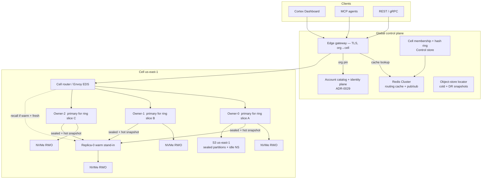
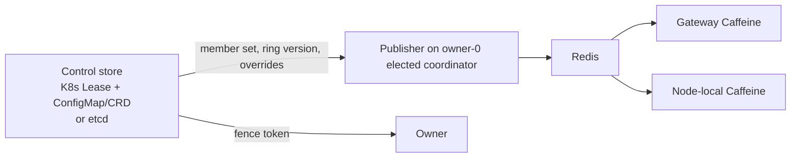
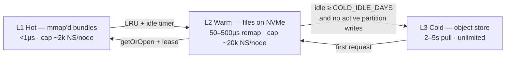
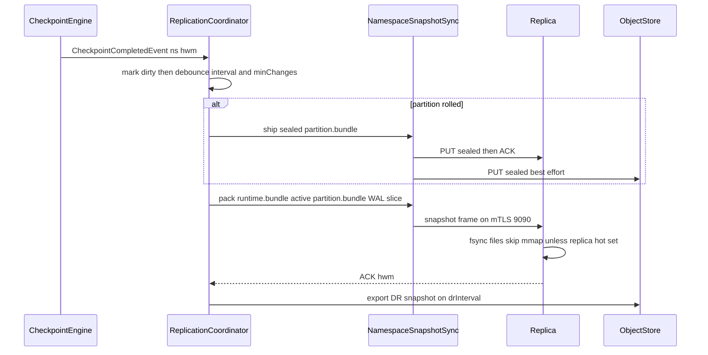
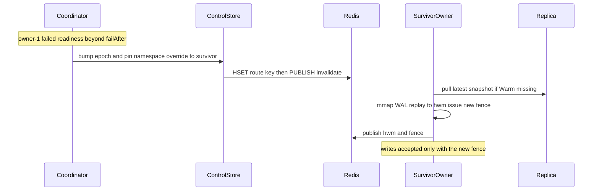
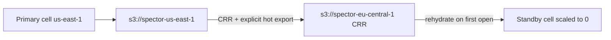
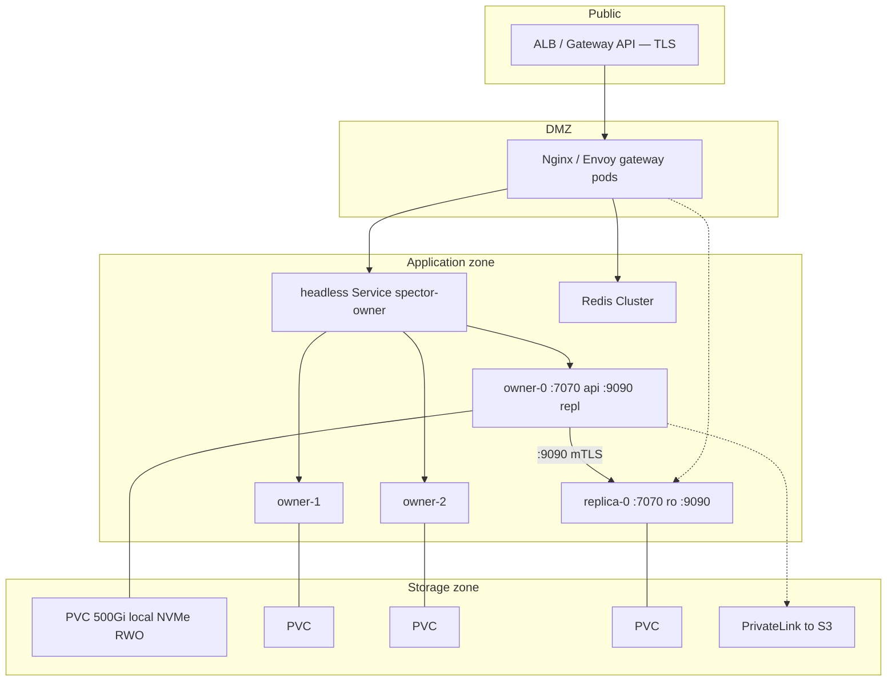
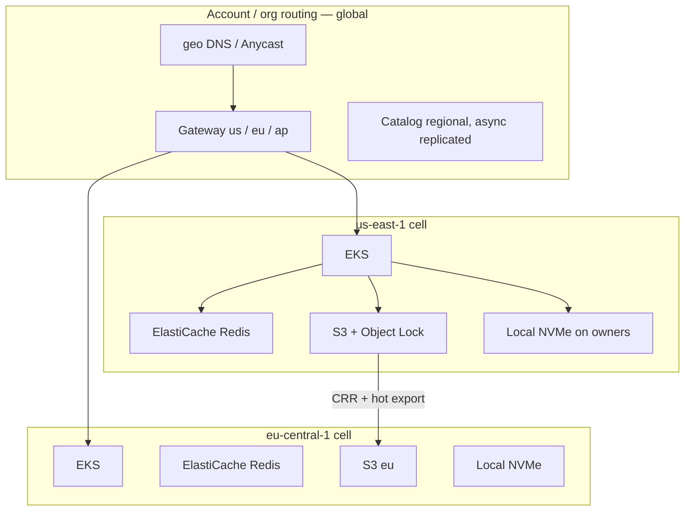

# ADR-0034: Cell Topology, Namespace Ownership, and HA Clustering

| Field | Value |
|:---|:---|
| **Status** | Accepted (Implemented) |
| **Date** | 2026-09-11 |
| **Authors** | Spector Maintainers & Architecture Working Group |
| **Deciders** | Spector Technical Steering Committee (TSC) |
| **Supersedes** | ADR-0034 Draft (HA, Scaling & Data Replication) |
| **Superseded By** | None |
| **Last Verified** | 2026-09-16 (Verified against `main`) |

---

## 1. Context

Spector stores each user/agent namespace as a physically isolated directory of memory-mapped V4 bundles (ADR-0004). Recall is a SIMD scan of off-heap `MemorySegment`s. That design gives:

- zero cross-tenant leakage without a query predicate
- sub-millisecond in-process recall
- predictable FD/mmap cost (2 bundles per active partition + WAL, not ~15 V3 files)

It also forbids the usual vector-DB HA pattern (shared index + `owner_id` filter + stateless replicas behind a round-robin load balancer).

The previous HA draft proposed a cell of several **Read/Write leaders** behind least-conn/round-robin, with checkpoint snapshot shipping to a read replica. That conflicts with local NVMe mmap:

- two writers on two nodes produce two divergent bundle files
- a request that lands on a non-owner either misses data or pays a 2–5s cold pull
- S3 CRR of the *cold* tier does not protect hot namespaces (idle archival default is 30 days)

This ADR replaces that draft with **namespace-primary ownership inside regional cells**, Redis as a **routing cache + invalidation bus** (not the durability plane), and **bundle-aware snapshot replication**.

---

### Constraints Inherited from the Memory Kernel
| Constraint | Source | HA implication |
|---|---|---|
| One directory tree per namespace | Physical isolation / MF-001 NF3 | Routing key is namespace, not request |
| V4 `partition.bundle` + `runtime.bundle` | ADR-0004 | Snapshot and ship bundles, not V3 `*.mem` / `*.graph` |
| Partition regions are fixed-size; overflow rolls a new dir | `PartitionBundle` | Sealed partitions are immutable replica objects |
| `RegionLease` / namespace lease | Kernel pager | Never unmap or change owner mid-query |
| Off-heap mmap + small JVM heap | Panama + k8s StatefulSet | Page cache *is* the working set; RWO local NVMe |
| Identity bundle is not the rememberer | ADR-0029 §23 | Soul/salience live in `identity.bundle`; do not fold them into data-plane snapshots by default |
| Two shard alphabets | `StoragePaths` SHA-256 vs `IdentityPaths` char-prefix | Do not mix resolvers; HA copy must use the path the opener uses |

## 2. Problem Statement

**Accepted (Implemented).** Implementation is phased (see §16). Nothing in this ADR authorizes multi-writer access to a single namespace.

**Cluster work must not start on top of the live path split in §1.1.** Ownership, snapshot roots, cold-tier prefixes, and org delete are all defined by the directory the opener uses. Shipping replication against today's `StoragePaths.namespaceDirSharded` path and later moving to `IdentityPaths.enterpriseNamespaceDir` is a second migration under load. Close the split first (or as Phase 0 of §16).

> **Read §17.1 before implementing any section of this ADR.** Phase specs verified this document's claims
> about existing code, and **six named claims plus one behaviour did not survive**. Each is corrected inline
> in the section that made it, marked "Correction (2026-09-11)". §17.1 is the index. Sections describing
> *reasoning* have held up; sections describing *what is already built* should be treated as unverified
> until checked. All five §17 open questions are now resolved, each by a decision in the phase spec that
> owns it.

## 1.1 Known issues — prerequisites to fix during cluster implementation

These are not theoretical. They are what the Synapse and kernel modules do on `main` today versus what ADR-0029 already specified.

### KI-1 — Catalog and ABAC are tenant/account-aware; the rememberer opener is not

| Layer | What it believes | Live code |
|---|---|---|
| Catalog | `Account` is not a namespace; it **owns** namespaces. `Account.tenantId`, `defaultNamespaceId == accountId` for the autobiographical NS (ADR-0029 §12). `NamespaceRecord.namespaceId` is a global TSID; `ownerAccountId` is a pointer; `slug` is account-scoped. Types: `DEFAULT`, `PROJECT`, `AGENT`, `SHARED`, `ARCHIVE`. | `Account.java`, `NamespaceRecord.java`, `AccountCatalog` |
| ABAC | Grants on `NAMESPACE` (`OWNER > ADMIN > WRITER > READER`) and separately on `IDENTITY_BUNDLE` / `IDENTITY_REGION` (`READ`, `WRITE`, `ADMIN`, `INJECT`). Implicit OWNER grant on create. Cross-account share is `grantNamespace`. `INJECT` on soul does **not** imply `READ` on traces. JWT `tid` / `org` / `ns` / `nsid` only **narrow**. | `Grant.java`, `MemoryRequestBinder`, `JdbcAccountCatalog` / `FileAccountCatalog` |
| Identity plane | Soul and salience live in `identity.bundle`, stacked tenant → org unit → account at bind time. | `IdentityPlane.soulsFor`, `IdentityCache` |
| Data-plane opener | `NamespaceResolver.buildInstance` always does `StoragePaths.namespaceDirSharded(basePath(), namespaceId)` → `{persistence}/namespaces/{sha256[0:2]}/{sha256[2:4]}/{namespaceId}/`. **No tenant segment. No account segment.** | `NamespaceResolver.java` |

Consequence: the catalog can attach Alice to tenant `acme`, give her three `AGENT` namespaces, and grant Bob `READER` on one of them — and every one of those rememberers is still a flat hash folder with no tenant in the path. Cell routing that hashes `tenantId/namespaceId` and DR that deletes `tenants/{tenant}/…` will not see the files the process actually mmap'd.

**Update (2026-09-11).** Phase 0.1 closed the opener side of KI-1: `Account.tenantId` — which was
structurally unreachable, as §9.2 records — is now operational, and the opener resolves tenant-rooted paths.
**One half of this gap remains structural**, and it surfaced during Phase 6's compliance work:
`NamespaceRecord` has no `tenantId` field. Its verified fields are `namespaceId, slug, ownerAccountId, type,
status, displayName, description, bias, createdAt, updatedAt, legalHold`. So a namespace's tenant is only
reachable *through its owning account*, and namespaces that are ownerless — or owned by an account with no
tenant — fall outside every tenant prefix. This bounds what a tenant-scoped operation can claim: DR export
sets, residency enforcement, and above all tenant erasure (§16) are best-effort over that residue until
`NamespaceRecord.tenantId` exists. Recorded as the structural fix in Phase 6.

### KI-2 — Three on-disk layouts, only two wired, none of them “deployment modes”

This is evolutionary layering, **not** “solo vs one-tenant vs multi-tenant products.” Those modes are `AccountProfile` + JDBC catalog + JWT `tid` + auth on/off.

| | Path | Shard | Wired? |
|---|---|---|---|
| **A. Kernel live rememberer** | `namespaces/{sha}/{sha}/{namespaceId}/` | SHA-256 of namespaceId (`StoragePaths`) | **Yes** — `buildInstance` |
| **B. ADR-0029 §4.3 enterprise rememberer** | `tenants/{tt}/{uu}/{tenantId}/namespaces/{nn}/{mm}/{namespaceId}/` | First 4 **characters** of each id (`IdentityPaths`) | **Helper + unit test only** — `IdentityPaths.enterpriseNamespaceDir` is not called by the opener |
| **C. Identity plane** | `identity/accounts/…/identity.bundle` and `identity/tenants/…/accounts/…/identity.bundle` | Character prefix (`IdentityPaths`) | **Yes** — `IdentityCache` |

`StoragePaths.tenantNamespaceDirSharded` (SHA-256 of tenantId, namespace nested under tenant, still under `namespaces/`) is a fourth helper and is also unused by Synapse.

`memory/namespaces/…` appears in the `IdentityPaths` class javadoc, but its presence depends on deployment configuration: shipped `application.yml:76` injects the prefix via `persistence-path` (`${SPECTOR_DATA_DIR}/memory`), so the live **Synapse** tree is `{DATA}/memory/namespaces/…` — while the **framework default** is `.spector/memory/namespaces/…` (`SpectorPropertyConstants.java:176`). Both configurations supply the rememberer root directory, so the tree has a configuration-derived placeholder root rather than an implicit flat literal.

`FileAccountCatalog` is `@Deprecated` “legacy standalone”; production catalog is `JdbcAccountCatalog`. That deprecation is the real solo-vs-enterprise catalog split. It did not change the mmap path.

### KI-3 — Two shard alphabets

- `StoragePaths.sha256Hex(id).substring(0, 4)` → `a3/f7/…` (used for data plane)
- `IdentityPaths.shard1/shard2` → `id.substring(0, 2)` / `substring(2, 4)` (e.g. `ten-hospital-99` → `te/n-`, used for identity plane)

The data plane and identity plane shard differently by design. KI-3's rule is "one resolver per plane, and never cross them", not "one alphabet everywhere". Data plane paths must only be resolved via `NamespacePathResolver`, and identity plane paths must only be resolved via `IdentityPaths`.

### KI-4 — Namespaces must not be moved under accounts as part of the cluster fix

A same-user multi-agent world is already modeled as **many `NamespaceRecord`s one account owns** (`NamespaceType.AGENT` / `PROJECT` / `SHARED`), switched by slug, each a separate mmap directory, plus one `identity.bundle` for the account’s soul.

Putting rememberer dirs at `…/accounts/{alice}/namespaces/{agent}/` would break:

- `SHARED` namespaces (no single parent account)
- `grantNamespace` to another principal (Bob would have to mmap Alice’s account tree)
- account deletion vs live grants
- the identity/data-plane split ADR-0029 already shipped

**Fix direction:** wire the opener to the **tenant-rooted namespace path (B)** for enterprise cells via `NamespacePathResolver`; keep identity under `identity/` (C); keep slugs/grants in the catalog. Do **not** nest rememberers under account directories.

### KI-5 — What “fixed” looks like (Phase 0 exit criteria — COMPLETED in Phase 0.1)

Phase 0.1 (Namespace Path Unification, issue #819) completed all KI-5 exit criteria:

1. `NamespaceResolver.buildInstance` takes `(tenantId, namespaceId)` from the catalog (JWT `tid` / `Account.tenantId`) and opens  
   `NamespacePathResolver.resolve(persistencePath, tenantId, namespaceId)` (`Layout.TENANT_SHA256`) when a tenant is present;  
   falls back to **A** (`Layout.FLAT_SHA256`) when `tenantId == null` (solo default NS).  
   *Note on R2 finding*: `Account.tenantId` was previously structurally unreachable (SELECT omitted column, SQLException swallowed, both catalogs hard-nulled it). Phase 0.1 made `tenantId` fully operational across JDBC, SQL queries, and file catalogs.

2. `TenantNamespaceMigrator` walks catalog-accessible namespaces and relocates into **B** when `Account.tenantId` is set, guarded by active leases and crash-safe `.migrating-*` staging. Dual-read fallback with `spector.namespace.layout.fallback` counter; no dual-write.
3. `namespace.json` sidecar and snapshot manifest record `layout`, `pathHelper`, `tenantId`, and `namespaceId` so a replica never has to guess the shard alphabet.
4. Identity bundles stay on plane **C**. They are not packed into the rememberer snapshot. Failover rebinds soul via `IdentityPlane`.
5. Tests: Alice in tenant `acme` creates `AGENT` slugs `jira` and `docs`; files land under tenant root `tenants/…/acme/namespaces/…/{tsid}/`; Bob with a READER grant opens the same path and shares the same `SpectorMemory` instance; tenant-prefix wipe of `tenants/…/acme/` wipes rememberers while identity plane is untouched (`CellHaNamespaceExitCriteriaIntegrationTest`).

> [!NOTE]
> Phase 0.1 is complete (see `.kiro/specs/namespace-path-unification/`). §9.2 is now true on disk when `spector.namespace.tenant-rooted.enabled=true`.

### Multi-Writer Failure Mode
In off-heap memory-mapped architectures (`spector-kernel`), concurrent process writes to identical slabs cause immediate, unrecoverable data corruption and SIGBUS crashes. Prior to this design, Spector lacked a formal clustering topology, strict single-writer namespace lease fencing, and transparent request routing.

## 3. Decision Drivers

- **Strict Single-Writer Affinity**: Exactly one cell process owns write authority over any given tenant namespace at any given millisecond.
- **Zero-Copy Checkpoint Snapshotting**: Asynchronous background replication utilizing immutable bundle checkpoints rather than distributed consensus log shipping.
- **Fail-Closed Fencing**: Guaranteed lease expiration and split-brain fencing before a standby cell assumes primary status.
- **Transparent Ingress Routing**: Gateways route requests to current namespace owners with zero caller disruption.

## 4. Considered Options

| Option | Why rejected |
|---|---|
| **A. Stateless RR over N R/W leaders** | Split-brain on local bundles. |
| **B. Shared POSIX volume (EFS/NFS) + multi-writer** | mmap coherency, lock latency, and noisy-neighbor I/O destroy the performance claim. |
| **C. Classic WAL streaming as the only replica path** | Multiplexed frames + per-namespace demux at 10k–100k namespaces is operationally worse than shipping sealed bundles + a WAL *tail*. WAL tail is retained; WAL-as-primary-stream is not. |
| **D. Redis Cluster as source of truth for ownership** | Fast, but membership + fencing belong in a lease/epoch object that survives a Redis flush. Redis is the cache and the pub/sub bus. |
| **E. One primary per cell (all namespaces on node-0)** | Simple, not scalable, terrible blast radius. |
| **F. Hash only, no override map** | Failover and drain cannot pin a namespace to a living node without changing the whole ring. |

Chosen: **cells + consistent hash + override leases + Redis cache + bundle snapshots + WAL tail.**

---

## 5. Decision Outcome

## 3. Decision summary

1. Deploy Spector as **regional cells**. An organization is pinned to exactly one cell for data-plane traffic (sovereignty + blast radius).
2. Inside a cell, every namespace has **exactly one primary owner node** at a time. All `remember` / `reinforce` / consolidate / checkpoint writes go to that owner. Recall goes to the owner by default; a replica may serve recall only when the namespace is locally mapped and lag is within SLA.
3. Owner assignment is **consistent hashing of `tenantId/namespaceId` over the live owner-member set**, plus explicit **override leases** for failover and rebalance. Redis caches the resolved `{cell, owner, epoch, hwm}` tuple and publishes invalidations. Redis is not the source of truth for membership.
4. Replication unit is the **V4 namespace tree**: sealed `partition.bundle` files (immutable), the active `partition.bundle` + `runtime.bundle` (mutable hot set), WAL tail from the last snapshot HWM, and `namespace.json`.
5. In-cell HA (node death) is **remap + WAL replay on a replica that already has Warm files**. Cross-cell DR is **object-store rehydrate + routing flip**. Those are different RPOs.
6. Scale-out adds owner nodes and **moves namespaces**. It does not add anonymous R/W backends.

## 4. Goals and non-goals

### Goals

- Preserve physical isolation and mmap locality on the write path.
- Cell-level blast radius and GDPR-style region pinning.
- In-cell RPO measured in seconds (snapshot interval + WAL tail), RTO measured in seconds-to-low-minutes for namespaces that were pre-warmed on a replica.
- Cross-cell RPO ≤ 15 minutes for *all* namespaces that have been snapshotted, not only idle L3 archives.
- Horizontal scale by adding owner nodes without rewriting the kernel shapes.
- Routing lookup p99 ≪ recall p50 (Redis + local Caffeine; hash fallback if Redis is down).

### Non-goals

- Multi-master writes to one namespace.
- Shared HNSW / pooled vector index across tenants.
- Using NFS/EFS as the mmap working set.
- Synchronously replicating every store into every replica (replica L1 is a subset).
- Making Redis the durable catalog of tenants, API keys, or identity bundles (ADR-0029 stays on the catalog/identity plane).
- Surviving working-memory contents across failover (working tier is volatile unless later checkpointed into the runtime bundle).

---

## 7. System architecture



### Component roles

| Component | Writes? | Holds mmap? | Notes |
|---|---|---|---|
| Edge gateway | No | No | Auth, org→cell, namespace→owner from Redis/Caffeine |
| Cell router | No | No | Envoy/ARM cluster pointing at owner pod DNS; no least-conn across owners |
| Owner node | Yes, for owned NS | Yes, L1 of owned + recently used | Source of snapshots |
| Replica node | No user writes | Optional L1 of pre-warmed NS | Applies snapshots, may serve stale-bounded recall |
| Redis | No data plane | No | Cache + pub/sub only |
| Catalog / H2 / PG | Metadata | No | Tenants, keys, audit — not vectors |
| Object storage | Cold + DR | No | Sealed bundles and exported hot snapshots |

---

## 8. Routing model

Two hops, never one.

```
request
  → authenticate (JWT sub, tenant_id)
  → resolve namespaceId  (catalog slug / default NS — ADR-0029)
  → hop 1: org_id → cell_id          (rarely changes)
  → hop 2: (cell_id, tenantId, namespaceId) → owner_id @ epoch
  → send to owner (writes always; reads default)
```

### 8.1 Why Redis

A gateway doing SHA-256 + ring math is cheap, but production routing is not pure hash:

- owner set changes (pod restart, scale, drain)
- failover **pins** a namespace to a survivor via override lease
- read-replica hints (`replicaId`, `hwm`, `mapped=true`)
- cell moves during DR

Those bindings must be read in microseconds and invalidated instantly.

> **Correction (2026-09-11, Phase 2 verification).** An earlier revision of this section claimed "Redis
> already exists in Synapse (Bucket4j / rate-limit)" and treated the cache as a reuse of running
> infrastructure. **That is false.** Synapse depends on `bucket4j-core` only — an in-memory limiter — and
> the rate-limit state store is `CaffeineRateLimitStateStore`. There is no redis or lettuce dependency in
> any module's `pom.xml`. **Redis is net-new infrastructure for this ADR**, with its own provisioning,
> credential, failure-mode, and cost surface. Phase 2 (`cell-routing-cache`) is scoped accordingly, and
> its invariant K1 — losing Redis degrades performance and override visibility, never correctness — exists
> because the dependency is new rather than proven in production here.

This ADR introduces Redis as:

1. **hot cache** of resolved routing tuples
2. **pub/sub invalidation bus** (`spector.route.invalidate`)
3. optional **read-only replica hint index**

It is **not**:

- the membership source of truth
- a lock service for fencing (owners take a fence token from the control store / K8s Lease)
- a place to store vectors, WAL, or bundles

### 8.2 Source of truth vs cache



| Data | Source of truth | Cached in Redis | TTL |
|---|---|---|---|
| Org → cell | Catalog / routing table | `rt:org:{orgId}` | 5–15 min + invalidate |
| Cell member set + ring version | Control store | `rt:cell:{cellId}:ring` | 30s + invalidate |
| Hash default owner | Derived from ring | not stored (computed) | — |
| Override lease (failover pin) | Control store | `rt:ns:{cell}:{nsKey}` | lease TTL |
| Resolved tuple (what gateways read) | derived | `rt:ns:{cell}:{nsKey}` | 30s, refreshed on access |
| Replica freshness hint | Replica heartbeat | `rt:ns:{cell}:{nsKey}:hint` | 5s |

On Redis outage the gateway:

1. uses local Caffeine if present
2. else computes **hash(owner set from last known ring file / env)**
3. **ignores overrides it cannot see** — acceptable only for seconds; the control-plane reconciler must re-publish when Redis returns. *(Cross-phase dependency: this Redis-outage override-blindness window is harmless in Phase 2 because no overrides exist yet, but must be closed with control-plane reconciliation before Phase 4 ships failover — see Phase 2 design §4).*
4. never load-balances writes “somewhere”

### 8.3 Redis key design

Cluster hash-tags keep a namespace’s keys on one slot.

```
rt:org:{orgId}                          HASH  cell, pinned_until, policy
rt:cell:{cellId}:ring                   STRING JSON  {version, owners[], vnodes}
rt:cell:{cellId}:members                HASH   ownerId → {pod, api, repl, gen}
rt:ns:{cellId:tenantId:nsId}            HASH   owner, epoch, fence, hwm, updated_at
rt:ns:{cellId:tenantId:nsId}:hint       HASH   replica, mapped, lag_ms, hwm
```

> **Correction (2026-09-11, Phase 2 verification).** The two `rt:ns:` lines above previously read
> `rt:ns:{cellId}:{tenantId}:{nsId}`, using braces as substitution placeholders. Read literally — which is
> how a Redis Cluster client reads them — that form places **three separate hash tags** on one key, so the
> slot is computed from `cellId` alone and the namespace's own keys scatter. That defeats the co-location
> this section opens by asking for. The authoritative form is the single literal hash tag already used by
> `RoutingKey.redisKey()` in §15.2: **the braces are real characters and wrap the whole
> `cell:tenant:ns` triple**, so a namespace's tuple and its `:hint` land on the same slot. Phase 2 adopts
> the §15.2 form (its decision D2) and pins it with a test.

Resolved HASH fields:

```
owner       = spector-owner-1
epoch       = 17
fence       = 7f3c…          # must appear on write RPC
hwm         = 42019          # last durable WAL seq advertised by owner
cell        = us-east-1
mode        = hash|override
override_ttl_ms = 0
```

Pub/sub channel: `spector.route.{cellId}` payload `{nsKey, epoch, reason}`.

Gateway algorithm:

```
tuple = caffeine.get(nsKey)
if miss:
    tuple = redis.HGETALL(rt:ns:...)
    if miss:
        ring = redis.get(rt:cell:...:ring) or lastRing
        tuple.owner = ketamaRing.ownerOf(nsKey)     # ONE hash impl, shared with the owner
        tuple.epoch = ring.version
        tuple.mode  = hash
        redis.HSET nx + EXPIRE 30s     # fill cache, do not invent overrides
forward(owner, headers: X-Spector-NS, X-Spector-Epoch, X-Spector-Fence)
```

Owner algorithm on receive:

```
if epoch < localEpoch for this ns: reject STALE_ROUTE (307 / gRPC refresh)
if fence != localFence:            reject FENCED
if this node is not owner:         reject NOT_OWNER + correct owner
acquire RegionLease; serve
```

That last check is the safety net that makes Redis lying (or a stale Caffeine entry) a retry, not a split write.

> **Correction (2026-09-11, Phase 2 verification).** The gateway pseudocode above previously called
> `jumpConsistentHash(nsKey, ring)`. §17 question 4 has since been resolved as **Ketama over virtual
> nodes** (§15.2, Phase 1 decision D1), so the snippet named a hash family the implementation does not use.
> The hazard is specific, not cosmetic: the gateway and the owner must agree on ownership exactly. Two hash
> implementations — jump on the routing side, Ketama on the owning side — disagree for most keys, so every
> request would route to a node that then answers `NOT_OWNER` with a different correct owner. That is a
> routing storm, not a degraded mode. Phase 2 invariant K4 is therefore "exactly one hash implementation
> exists in the codebase", enforced by test rather than convention.

---

## 9. Filesystem architecture

This section is the correction to the old HA draft **and** to the first cut of this ADR. The on-disk model is **three planes**, not a single tree of `namespaces/{tenant}/{user}`. Namespaces do **not** live inside account directories. Accounts do **not** contain rememberer bundles. Soul/salience do **not** live in `runtime.bundle`.

### 9.0 Logical model (ADR-0029 catalog)

```
Tenant  (org / cell pin / GDPR boundary)
  ├── Tenant identity.bundle     soul + salience + policy of the org
  ├── Account  (human or agent principal; JWT sub)
  │     ├── Account identity.bundle    soul + salience of that principal
  │     └── defaultNamespaceId ────────┐
  └── Namespace  (rememberer / mmap data plane)  ←┘
        runtime.bundle + partition.bundle + WAL
```

Catalog facts already in code:

- `Account.tenantId` + `Account.defaultNamespaceId` (`Account.java`, `FileAccountCatalog`: default NS id **equals** account id, ADR-0029 §12).
- Resolution is `accountId → catalog → namespaceId → SpectorMemory` (`NamespaceResolver`, ADR-0029 §6.1).
- Two principals may hold grants on the **same** namespace and share one mmap instance (cache keyed by `namespaceId`, not `accountId`).
- `IdentityPlane` binds soul/salience at request bind time from the identity bundle. INSULA Region 24 is fallback only (`NamespaceResolver` comment, ADR-0029 §23.6).

So: **tenant owns accounts and namespaces**. An account **points at** a namespace. A namespace is not a subdirectory of an account.

### 9.1 Three physical layouts that exist today

Do not collapse these. Replication has to copy the path the opener will use.

**A. Live data-plane path (what `NamespaceResolver.buildInstance` actually opens today)**

```java
Path dir = StoragePaths.namespaceDirSharded(basePath(), namespaceId);
builder.persistence(dir);
```

`StoragePaths.namespaceDirSharded` shards by **SHA-256(namespaceId)** hex, two levels (`SHARD_HEX_DIGITS=2`):

```
{persistence-path}/
  namespaces/
    {sha[0:2]}/{sha[2:4]}/{namespaceId}/
      namespace.json
      runtime/runtime.bundle
      partitions/{seq}_{epoch}/partition.bundle
      wal/wal-NNNNNN.bin
```

Kernel also has `tenantNamespaceDirSharded(base, tenantId, namespaceId)` →
`namespaces/{sha(tenant)[0:2]}/{sha(tenant)[2:4]}/{tenantId}/{namespaceId}/`.
That helper is **not** what Synapse calls on the hot path today.

**B. ADR-0029 §4.3 enterprise data-plane path (IdentityPaths, tested, not yet wired into `buildInstance`)**

```java
IdentityPaths.enterpriseNamespaceDir(dataDir, tenantId, namespaceId)
// → {dataDir}/tenants/{t0}{t1}/{t2}{t3}/{tenantId}/namespaces/{n0}{n1}/{n2}{n3}/{namespaceId}
```

Character-prefix shards (first 4 chars of the id, **not** SHA-256). Confirmed by `IdentityPathsTest.enterpriseNamespaceDirSharded`:

```
/data/spector/tenants/te/n-/ten-hospital-99/namespaces/01/23/0123456789abc
```

Namespaces sit **under the tenant**, sibling to that tenant’s accounts — **not** under the account.

**C. Identity plane (soul / salience / policy) — always separate**

Class javadoc on `IdentityPaths`:

```
${SPECTOR_DATA_DIR}/
  db/synapse.mv.db
  identity/
    accounts/{aa}/{bb}/{accountId}/identity.bundle
    tenants/{tt}/{uu}/{tenantId}/identity.bundle
  memory/
    namespaces/{xx}/{yy}/{namespaceId}/     # documented target for solo / OSS
```

Tenant-scoped account soul (ADR-0029 §4.3), tested:

```
identity/tenants/{tt}/{uu}/{tenantId}/accounts/{aa}/{bb}/{accountId}/identity.bundle
```

`StoragePaths.accountIdentityBundle` / `tenantIdentityBundle` are **deprecated** (0.13.0): they used SHA-256 under `accounts/` and `tenants/` at the persistence root. Live identity cache uses `IdentityPaths`.

### 9.2 Layout this ADR standardizes for cells

Enterprise cells adopt **B + C** via `NamespacePathResolver` (Layout `TENANT_SHA256`). Solo/OSS keeps **A + C (flat account identity)** via `NamespacePathResolver` (Layout `FLAT_SHA256`).

Note that `{REMEMBERER_ROOT}` is a **configuration-derived placeholder** (e.g. `spector.memory.persistence-path` or `${SPECTOR_DATA_DIR}/memory` in Synapse, or `.spector/memory` default in embedded kernel), not a hardcoded sibling of `identity/`:

```
{SPECTOR_DATA_DIR}/                          # synapse dataDir
├── db/
│   └── synapse.mv.db                        # catalog: accounts, grants, slugs
├── identity/                                # soul + salience + policy (ADR-0029 §23, character-prefix sharded)
│   ├── accounts/{aa}/{bb}/{accountId}/
│   │   └── identity.bundle                  # solo / no-tenant principals
│   └── tenants/{tt}/{uu}/{tenantId}/
│       ├── identity.bundle                  # tenant soul / org salience
│       └── accounts/{aa}/{bb}/{accountId}/
│           └── identity.bundle              # principal soul inside the tenant
└── {REMEMBERER_ROOT}/                       # persistence-path (e.g. {SPECTOR_DATA_DIR}/memory)
    ├── tenants/{s0}/{s1}/{tenantId}/        # enterprise data plane (SHA-256 2-level sharded)
    │   └── namespaces/{n0}/{n1}/{nsId}/
    │       ├── namespace.json               # layout marker & sidecar
    │       ├── runtime/
    │       │   └── runtime.bundle           # graphs, index, BM25, coact, ckpt
    │       ├── partitions/
    │       │   ├── 000_{epoch}/partition.bundle # SEALED — immutable
    │       │   └── 001_{epoch}/partition.bundle # ACTIVE — mutable
    │       └── wal/
    │           └── wal-000042.bin
    └── namespaces/{n0}/{n1}/{nsId}/         # OSS / untenanted legacy layout (Layout A)
```

By design, the data plane and identity plane shard differently:

- **Data plane**: 2-level SHA-256 hex sharding (`StoragePaths.shard2`) under `{REMEMBERER_ROOT}/tenants/.../namespaces/...`
- **Identity plane**: 2-level character-prefix sharding (`IdentityPaths.shard2`) under `{SPECTOR_DATA_DIR}/identity/...`

Per KI-3, the architectural rule is **one resolver per plane, never crossing helpers**, rather than forcing identical alphabets across two completely decoupled planes.

### 9.3 What is inside a namespace vs an identity bundle

| Plane | Path | Contents | HA unit |
|---|---|---|---|
| Catalog | `db/synapse.mv.db` (or JDBC) | Account, tenantId, defaultNamespaceId, grants, slugs, quotas | Replicate the DB; not mmap |
| Tenant identity | `identity/tenants/…/identity.bundle` | Org soul, salience, policy | Optional snapshot; or rebuild from catalog |
| Account identity | `identity/…/accounts/…/identity.bundle` | Principal soul + salience | Same — **not** inside the namespace dir |
| Namespace (rememberer) | `tenants/…/namespaces/…/` or flat `namespaces/…/` | V4 bundles + WAL | **Primary replication unit** |

A namespace directory never contains `identity.bundle`. An account directory never contains `partition.bundle`. Putting rememberer files under `identity/tenants/.../accounts/.../namespaces/` would break both resolvers.

### 9.4 Bundle internals (replication-relevant)

| `partition.bundle` |
|:---|
| 64B `RegionPreamble` shape=BUNDLE |
| 64B `BundleSubHeader` magic=SPTB |
| `RegionEntry` [SEMANTIC, EPISODIC, PROCEDURAL, TEXT, STRENGTH] |
| page-aligned regions |

- One `Arena.ofShared()`, one FD (`PartitionBundle`, ADR-0004).
- Regions do not grow. Roll → new partition directory → old bundle becomes immutable.
- `runtime.bundle` is the other mutable file in the **namespace** dir (Hebbian / temporal / entity / index / checkpoint meta).
- Shard alphabet reminder: `IdentityPaths` = first 4 **characters** of the id; `StoragePaths` = first 4 hex chars of **SHA-256(id)**. Copying with the wrong helper looks like a missing namespace.

### 9.5 Implications for routing and replication

- Hash key remains `tenantId + "/" + namespaceId` (cell-local). Account id is **not** the ownership key: two accounts can share one namespace.
- Snapshot the namespace directory (sealed partitions + hot bundles + WAL).
- Identity bundles ride a **separate** snapshot channel (or are rebuilt by `IdentityPlane` after failover). Mixing them into the rememberer tarball couples two planes ADR-0029 split on purpose.
- Org → cell pin is on `tenantId`. Account → namespace pin is catalog. Namespace → owner node is the ring.

### 9.6 Temperature tiers (capacity, not isolation)



Replication policy per temperature:

| Tier | What is stored | Replica action | DR action |
|---|---|---|---|
| L1 | Mapped hot set of *owned* NS | Replica may map a **subset** (heat + failover candidates) | Export hot snapshot on cadence |
| L2 | Unmapped local files | Replica keeps Warm copy of owned-by-others NS it is responsible for | Included in nightly volume snapshot optional |
| L3 | `tar.zst` or raw sealed bundles | Not required in-cell | CRR + Object Lock |

> **Correction (2026-09-11, Phase 6 verification).** L3 as drawn above does not exist in any form. There is
> no `ColdTier`, `ObjectStore`, `S3*`, or `Archive*` class; no `coldTier` / `COLD_TIER` string in any Java
> source or YAML; and **no object-store SDK in any module's `pom.xml`** — not AWS, not `software.amazon`,
> not MinIO, not Azure Storage, not GCS. The same applies to §14's regional buckets and to the `coldTier.*`
> Helm values in §13.4. Everything object-store-shaped in this ADR is net-new.
>
> Consequences for sequencing: L1 and L2 are real today; the `L2 → L3` and `L3 → L2` edges in the diagram
> are design intent. Phase 6 (`cell-disaster-recovery`) builds the object-store abstraction plus one
> S3-compatible provider **scoped to the DR export target only** (its decision D1), and **L3 as a serving
> tier is deferred to its own spec**. The two share an abstraction but not their risk: a DR export is a
> background copy of data that also exists locally, whereas L3 is a retrieval path whose correctness
> changes recall results. Bundling them would make the DR drill wait on a retrieval feature.

A replica does **not** mmap every namespace every owner holds. That would multiply RAM by `owners`. Replica L1 budget is explicit (`replicaHotCap`).

### 9.7 Snapshot object

A namespace snapshot is a manifest plus bytes, not a directory walk of V3 names. Path is the enterprise or live resolver path, never `identity/`.

```json
{
  "plane": "namespace",
  "tenantId": "ten-hospital-99",
  "namespaceId": "0123456789abc",
  "pathHelper": "IdentityPaths.enterpriseNamespaceDir",
  "epoch": 17,
  "hwm": 42019,
  "kind": "incremental",
  "runtime": { "file": "runtime.bundle", "sha256": "...", "gen": 88 },
  "activePartition": { "id": "001_1719849600", "sha256": "..." },
  "sealed": [
    { "id": "000_1717430400", "sha256": "...", "object": "s3://bucket/ten-hospital-99/0123456789abc/000_1717430400/partition.bundle" }
  ],
  "walFrom": 41900,
  "walTo": 42019
}
```

`kind=full` on first sync or FULLRESYNC. `kind=incremental` ships only runtime + active partition + WAL slice when sealed set is unchanged. Partition roll emits an immediate snapshot: the newly sealed bundle is the cheapest consistent point in the system.

---

## 10. Replication architecture



> **Corrections (2026-09-11, Phase 3 verification).** Two names in the diagram above were wrong, and one
> field does not exist:
>
> - The checkpoint participant was drawn as `CheckpointDaemon`. No such class exists; the real one is
>   **`CheckpointEngine`**. (§15.1's module map carried the same wrong name and is corrected there too.)
>
> - The event was drawn as `CheckpointCompleted(ns, hwm, epoch)`. The real `CheckpointCompletedEvent`
>   **carries no epoch.** It does carry a context map with `TENANT` and `NAMESPACE` keys plus
>   `walHighWaterMark`, `indexSize`, `elapsedMs`, and `timestamp` — everything the coordinator needs except
>   the epoch. Phase 3 therefore takes the epoch from the ownership layer that mints it (its decision D6)
>   rather than adding it to a kernel event, which keeps the kernel unaware of clustering.
>
> The useful discovery behind these corrections: `CheckpointCompletedEvent` **already exists and already
> fires**, so the replication coordinator subscribes to it rather than polling for changed namespaces.
> `PartitionBundle`, `RuntimeBundle`, `RegionPreamble`, `WalReplayer`, `MemoryWal`, `WalEvent`,
> `PartitionHandle.freeze()`, `wal.highWaterMark()`, and `RegionRef.writeCheckpointHwm` are all real as
> described elsewhere in §9 and §10.

### 10.1 Why not primary WAL streaming

WAL streaming remains useful as a **tail** after the last snapshot. It is not the topology:

- multiplexing tens of thousands of namespaces over one TCP stream is a large amount of connection, ordering, and backpressure machinery to own for a benefit the snapshot path already delivers
- sealed partition bundles are large, immutable, checksummable, and identical to the cold-tier object
- runtime + active partition change often; shipping them on a Redis-style `save 60 100` schedule is enough if the WAL tail is also on the replica

> **Correction (2026-09-11, Phase 3 verification).** The first bullet previously argued that WAL-stream
> multiplexing "repeats the complexity already marked deprecated (`WalReplicationLeader` / `Follower`)".
> **Neither class exists anywhere in the repository**, deprecated or otherwise. The argument against WAL
> streaming as a topology stands on its own merits — the three bullets above are independent of any prior
> attempt — but it was resting on a citation to code that was never written, which made a design preference
> look like a lesson already learned. It is a preference, and this is the reasoning for it.

Parameters (cell-local):

| Knob | Default | Meaning |
|---|---|---|
| `snapshotInterval` | 60s | Min time between mutable-set shipments |
| `snapshotMinChanges` | 100 | WAL events to trigger early |
| `walTailAlways` | true | After ACK, stream WAL records until next snapshot |
| `fullResyncLagThreshold` | 5 min or N snapshots missed | Rebuild sealed set from owner or L3 |
| `drExportInterval` | 15 min | Push latest mutable snapshot to the DR bucket |

### 10.2 Security and integrity

- `:9090` mTLS, TLS 1.3, per-cell SPIFFE or PKCS12 (`ReplicationTlsFactory` pattern).
- Replica rejects snapshots for tenants not in its allow-list (`frames.rejected`).
- Verify `RegionPreamble` magic, bundle layout id `BUND`, and SHA-256 against the manifest before publishing a new HWM.
- Fence token from the control store is included in the snapshot header so a partitioned old primary cannot poison a replica after failover.

### 10.3 Backpressure

Per-follower bounded queue (keep the 10k frame idea, but frames are snapshot chunks + WAL tail records). If the queue fills: stop WAL tail, count `frames.dropped`, mark lag, trigger FULLRESYNC when the follower catches the next snapshot rather than trying to catch a firehose.

---

## 11. Failover, fencing, and DR

### 11.1 In-cell node death (HA)



Rules:

- Old owner, if it flaps back, sees fence mismatch and refuses writes.
- In-flight requests holding `RegionLease` on the dead node die with the process; clients retry.
- RTO is dominated by (a) whether the survivor already has Warm files and (b) WAL replay. Pre-warm the hottest N namespaces of each owner onto the replica (`replicaFollowList` or heat-based).
- Do **not** wait for Helm to add replicas. Ownership moves onto nodes that already exist.

Target: RPO = last WAL record that reached a replica (typically < snapshotInterval if `walTailAlways`). RTO = 5–30s for pre-warmed NS, longer if a cold pull is required.

### 11.2 Cell death (DR)



| Phase | Time budget | Action |
|---|---|---|
| Detect | 0–5 min | Cell health + synthetic recall probes |
| Activate | 5–10 min | Scale owners in standby cell |
| Rehydrate | 10–20 min | First-touch pull from DR bucket; hottest NS pre-listed |
| Route | 20–25 min | Flip `rt:org:{org}` → new cell; bump epoch |
| Verify | 25–30 min | DR suite |

**Critical correction vs the old draft:** CRR of L3 idle archives is not DR for active tenants. The owner must export **mutable snapshots** to the DR bucket on `drExportInterval` (default 15 min). That is the number we are allowed to print as RPO.

### 11.3 Recovery objectives

| Scope | RPO | RTO | Mechanism |
|---|---|---|---|
| In-cell, pre-warmed NS | WAL tail (seconds) | seconds–~1 min | remap + replay |
| In-cell, cold NS | last snapshot (≤60s) + last DR export if replica had nothing | 2–5s pull + replay | L3 / replica Warm |
| Cross-cell | `drExportInterval` (15 min) | ~30 min | bucket + routing flip |
| Working memory | not covered | — | volatile |

---

## 12. Network architecture



### Port matrix

| Port | Protocol | Audience | Purpose |
|---|---|---|---|
| 443 | HTTPS | public | ALB |
| 3000 | HTTP | in-cluster | dashboard / nginx |
| 7070 | HTTP/2, gRPC | in-cluster | Armeria API + MCP + `/health` `/metrics` |
| 9090 | TCP mTLS | owners → replicas only | snapshot + WAL tail |
| 6379 / 6379+bus | Redis | gateway + owners | routing cache; NetworkPolicy tight |
| 7700 | HTTP | compose only | host map to dashboard |

NetworkPolicies:

- ingress 7070 from gateway ns only
- ingress 9090 from owner pods to replica pods only
- Redis from gateway + owner + replica coordinator only
- egress S3 via endpoint / PrivateLink
- no 9090 on the public ALB

---

## 13. Kubernetes architecture

Public `deploy/k8s-statefulset.yaml` is a single 3-pod set. This ADR splits roles.

```
Namespace spector-us-east-1
├── StatefulSet spector-owner     replicas=3  anti-affinity hostname
├── StatefulSet spector-replica   replicas=1..N
├── Deployment  spector-gateway
├── Deployment  redis-cluster     or ElastiCache endpoint
├── Service     spector-owner     headless
├── Service     spector-replica   headless
├── Lease       spector-cell-coordinator
├── ConfigMap   spector-ring      (mirror of control store)
├── ServiceMonitor
└── NetworkPolicy
```

### 13.1 Owner pod

- volumeClaimTemplate `spector-offheap-store`, StorageClass local NVMe, RWO, 500Gi
- required podAntiAffinity on `kubernetes.io/hostname`
- cgroup memory: request=limit (e.g. 16Gi) so page cache is not the first thing reclaimed
- JVM: **small heap**, rest is page cache (align with current StatefulSet, not a large `-XX:MaxDirectMemorySize` story)

```
JAVA_OPTS:
  -Xms2g -Xmx2g
  -XX:+UseG1GC -XX:MaxGCPauseMillis=20
  --add-modules=jdk.incubator.vector
  --enable-preview --enable-native-access=ALL-UNNAMED
SPECTOR_CELL_ID=us-east-1
SPECTOR_NODE_ROLE=owner
SPECTOR_NODE_ID=spector-owner-0
SPECTOR_DATA_DIR=/data
```

Probes stay on `/actuator/health` (or `/health`) on 7070. Readiness must fail when the node cannot take ownership (disk, map_count, ring not loaded).

### 13.2 Replica pod

Same disk class. `SPECTOR_NODE_ROLE=replica`. Readiness = “can apply snapshots”, not “can serve every NS”.

### 13.3 Coordinator

One owner holds `coordination.k8s.io/v1` Lease `spector-cell-coordinator` (15s, renew 10s). Responsibilities:

- watch member set, bump ring version
- write overrides on failure
- publish Redis
- optionally decide replica follow lists

This is **not** “the only writer in the cell”. It is the only writer of the *ring*.

### 13.4 Helm surface

```
cell.id / cell.region
owners.replicas
replicas.replicas
routing.redis.url
coldTier.enabled / provider / bucket
dr.bucket / dr.exportInterval
pager.hotCap / pager.warmCap / replica.hotCap
```

Scale-out:

```
helm upgrade … --set owners.replicas=5
```

Coordinator rebuilds the ring; a mover copies Warm files for keys whose owner changed; overrides expire after the copy. Gateways see pub/sub and stop sending to the old owner when epoch bumps.

### 13.5 Kernel / node settings (DaemonSet or documented host)

| Param | Value | Why |
|---|---|---|
| `vm.max_map_count` | ≥ 262144 (1M preferred) | bundles + WAL + libc; V4 is cheaper than V3 but not free |
| `vm.swappiness` | 1 | do not swap mmap |
| `ulimit -n` | 262144 | sockets + files |
| `memlock` | unlimited | optional mlock of hot preambles |
| FS | XFS or ext4 | mmap working-set behaviour is only validated on these; **checked at startup — see correction below** |

> **Correction (2026-09-11, Phase 5 verification).** The FS row previously read "already in
> `FilesystemHealthCheck`", and this section then instructed: "Recompute health-check text: V4 is ~2 maps
> per open namespace, not 15." **`FilesystemHealthCheck` does not exist anywhere in the repository**, so
> there was no text to recompute — the instruction presumed code that was never written. The only health
> component is `SpectorHealthIndicator`
> (`synapse/spector-spring/.../autoconfigure/SpectorHealthIndicator.java`).
>
> The arithmetic point behind the instruction is correct and worth implementing, so Phase 5
> (`cell-kubernetes-topology`, decision D6) **extends `SpectorHealthIndicator`** rather than creating the
> class this ADR named. The check it adds:
>
> ```
> V3 layout:  ~15 maps per open namespace   (semantic.mem, episodic.mem, procedural.mem, text.dat,
>                                            hebbian.graph, index.midx, bm25.bidx, … + WAL)
> V4 layout:  ~2  maps per open namespace   (runtime.bundle + active partition.bundle)   ← ADR-0004
>
> required ≈ (pager.hotCap × 2) + WAL segments + libc/JVM overhead + headroom
> ```
>
> At `pager.hotCap = 2000` (§14's per-owner L1 figure) V4 needs roughly 4k maps plus overhead, against V3's
> ~30k. The 262144 floor above is therefore comfortable — but for a different reason than V3-era guidance
> gave, and sizing reasoning carried over from V3 over-provisions by nearly an order of magnitude. The
> warning must name both numbers: the configured `hotCap` with the map count it implies, and the host's
> actual `vm.max_map_count`. A check that reports "insufficient" without the arithmetic is not actionable.
>
> Also verified, and already correct in `deploy/k8s-statefulset.yaml`: `vm.max_map_count=262144` is set by an
> init container (`:69`), the heap is `-Xms2G -Xmx2G` with `--add-modules=jdk.incubator.vector
> --enable-preview` (`:89`), `requests.memory == limits.memory == 16Gi` with the cgroups-v2 page-cache
> reasoning documented inline (`:112-122`), and a local-NVMe StorageClass `spector-nvme-local` exists. Four
> of §13's requirements are already met; Phase 5 extends these manifests rather than re-authoring them. One
> real divergence: the existing PVC is **100Gi**, not §13.1's 500Gi — Phase 5 keeps 100Gi as the chart
> default (installability on a test cluster) and publishes 500Gi–2TiB as the production range.

---

## 14. Cloud architecture



> **Correction (2026-09-11, Phase 6 verification).** The S3 nodes and the `CRR + hot export` edge above are
> target-state, not current-state: **no object storage exists in any module** (see §9.6's correction). Phase
> 6 builds the abstraction and one S3-compatible provider — MinIO-testable, so drills need no cloud account.
>
> One clarification the diagram invites and §11.2 already states explicitly, worth repeating because the
> wrong reading is the comfortable one: **the `CRR` edge between the two buckets is not a DR plan for active
> tenants.** Bucket cross-region replication applies to L3, the *idle* tier. It is one checkbox, costs
> almost nothing, and produces a replication-lag metric that reads like an RPO — while recovering only the
> namespaces that had already gone idle, which by construction are the ones whose loss nobody notices.
> Everything with traffic is in L1/L2 on local NVMe, which is exactly what a cell death takes with it and
> which is not in that bucket at all. The `hot export` half of the edge is the part that constitutes DR: the
> owner exporting **mutable** snapshots on `drExportInterval`. **That measured interval is the only number
> that may be published as an RPO.**

Placement rules:

- Org pinned to one cell. GDPR orgs are created in-region; they do not fail over to a non-EU cell without a documented legal exception.
- Redis is **per cell**. Do not share one global Redis for routing of every region (latency + blast radius). Org→cell can live in the catalog with a long TTL at the edge.
- Object buckets are regional. DR bucket is the paired region.
- Prefer ElastiCache / Memorystore / Azure Cache over a sidecar Redis for production cells; compose Redis is fine for local HA tests.
- Local NVMe (instance store or local PV) is mandatory for L1/L2. EBS gp3 is acceptable only for Warm-only replica experiments, not for owner L1.

Cell sizing (starting point, same order of magnitude as the draft, adjusted for V4 FDs):

| | Per owner | Cell 3+1 |
|---|---|---|
| L1 namespaces | 2 000 | 6 000 owned (replica L1 is a subset) |
| L2 namespaces | 20 000 | 60 000 |
| RAM | 16 GiB cgroup / 2 GiB heap | 64 GiB |
| NVMe | 500 GiB–2 TiB | 2–8 TiB |
| Redis | — | cache-only, small (routing tuples, not payloads) |

---

## 15. Detailed implementation design

### 15.1 Module map

Keep kernel unaware of cells. Put topology in Synapse / a new `spector-cluster` module so OSS embedded mode stays single-node.

```
nucleus / spector-kernel          # bundles, StoragePaths, leases — no Redis
memory / spector-memory           # SpectorMemory, CheckpointEngine + CheckpointCompletedEvent
synapse / spector-synapse         # gateway, auth, NamespaceResolver (ADR-0029)
cluster / spector-cluster         # NEW
    routing/
      RoutingKey.java
      ConsistentHashRing.java
      RoutingCache.java           # Caffeine
      RedisRoutingCache.java
      RouteTable.java             # org→cell
    membership/
      CellMembership.java
      OwnerLease.java
      FenceToken.java
      Coordinator.java
    replication/
      ReplicationCoordinator.java
      NamespaceSnapshotSync.java
      SnapshotManifest.java
      WalTailShipper.java
      ReplicaApplier.java
    pager/
      TenantMemoryRegistry.java   # if not already in connector-engine
    metrics/
      ClusterMetrics.java
```

OSS single-node: `SPECTOR_NODE_ROLE=standalone` short-circuits the ring to “this process owns every NS” and does not require Redis.

### 15.2 Core types

```java
public record RoutingKey(String cellId, String tenantId, String namespaceId) {
    public String redisHashKey() {
        return "rt:ns:{" + cellId + ":" + tenantId + ":" + namespaceId + "}";
    }
}

public record RouteBinding(
        RoutingKey key,
        String ownerId,
        long epoch,
        String fence,
        long hwm,
        RouteMode mode,          // HASH or OVERRIDE
        Instant updatedAt
) {}

public record SnapshotManifest(
        RoutingKey key,
        long epoch,
        long hwm,
        SnapshotKind kind,       // FULL, INCREMENTAL, SEALED_ONLY
        FileRef runtime,
        FileRef activePartition,
        List<FileRef> sealed,
        long walFrom,
        long walTo
) {}
```

Hash: **Ketama over virtual nodes** (§17 question 4, resolved in Phase 1 as decision D1 — jump consistent
hash rejected because it cannot express "member 1 of 3 is gone" without renumbering the rest, which would
force routine Kubernetes drains through the failover exception path). Key material:
`sha256(tenantId + "/" + namespaceId)` (same digest family as directory sharding, different use). Exactly
**one** implementation of this hash may exist in the codebase — gateway and owner must agree on ownership or
every request routes to a node that refuses it. Changing the hash function is a ring-version bump +
controlled move.

### 15.3 Request path (Synapse)

`NamespaceResolver` today: auth → catalog → `cache.getOrOpen(namespaceId)`. Extend:

```
SecurityUtils.userId
  → AccountCatalog.resolve namespaceId
  → ClusterRouter.resolve(RoutingKey)        // NEW, Redis + Caffeine
  → if local owner: existing MemoryRegistry.getOrOpen
    else if role=gateway: HTTP/gRPC proxy to owner
    else if role=owner and NOT_OWNER: 307 / Status.FAILED_PRECONDITION
```

Headers / gRPC metadata:

- `x-spector-cell`
- `x-spector-namespace`
- `x-spector-epoch`
- `x-spector-fence`
- `x-spector-allow-replica: 1` on recall only

Idempotency: `remember` already has client ids; retries after `STALE_ROUTE` must reuse them.

### 15.4 Owner write path

```
handleRemember:
  binding = localOwnership.get(ns)
  reject if fence/epoch mismatch
  lease = registry.acquireLease(ns)          // blocks eviction
  try {
      memory.remember(...)
      wal.append(...)
      coordinator.markDirty(ns)
  } finally { lease.close(); }
```

On partition roll: `coordinator.sealed(ns, partitionId)` immediately, do not wait for `snapshotInterval`.

### 15.5 Replica apply path

```
onSnapshot(manifest, bytes):
  verify magic + sha256 + epoch >= localEpoch
  write to tmp, fsync, rename into namespace dir
  bump localHwm
  if ns in replicaHotSet: remap runtime + active partition
  else: leave Warm
  ack
```

Recall on replica: allowed only if `mapped && now - snapshotTime <= maxReplicaLag && request.allowReplica`. Default off at the gateway.

### 15.6 Redis client

- Lettuce, clustered mode, timeout 50–100ms, fail-fast to hash fallback.
- Pipeline HGETALL on the ns key + GET ring version.
- Caffeine L1 in gateway: max 200k entries, expire 5s, invalidate on pub/sub.
- Do not store manifests or bundles in Redis.

### 15.7 Metrics (extend EnterpriseMetrics)

| Metric | Type | Notes |
|---|---|---|
| `spector.route.lookup` | timer | cache vs redis vs hash fallback |
| `spector.route.stale` | counter | epoch mismatch |
| `spector.route.fenced` | counter | old primary rejected |
| `spector.cluster.owners` | gauge | live members |
| `spector.ns.owner` | gauge | namespaces per owner (imbalance) |
| `spector.replication.hwm.lag` | gauge | per follower per ns histogram |
| `spector.replication.snapshot.bytes` | counter | sealed vs mutable |
| `spector.pager.hot` / `.warm` / `.cold_pulls` | gauge/counter | already sketched |
| `spector.failover.count` | counter | |

Alerts: owner imbalance > 2×, replica lag > 2× snapshotInterval, Redis fallback rate > 1%, cold_pulls spike, fence rejects from a node that should be dead.

### 15.8 Tests

- Unit: ring stability on add/remove node; override beats hash; fence mismatch.
- Property: no two owners accept writes for the same `(ns, epoch)`.
- Integration: 3 owners + 1 replica in compose; kill owner-1; traffic flips; WAL after last snapshot is visible.
- Chaos: Redis pause 30s — writes still hashed, no dual writers; Redis resume — overrides republished.
- Layout: snapshot of a V4 namespace applies on a clean node and `SpectorMemory` opens.
- Isolation: tenant A snapshot rejected on a replica whose allow-list is B.

### 15.9 Rollout phases

| Phase | Deliverable | Exit |
|---|---|---|
| 0 | ADR accepted; V3 paths removed from HA docs | docs no longer show `semantic.mem` / `text.dat` as the live tree |
| 0.1 | **KI-1–KI-5:** wire opener to tenant-rooted path; migrator A→B; snapshot manifest carries `pathHelper` | **COMPLETE** (#819, `.kiro/specs/namespace-path-unification/`). Opens §9.2 layout when tenant is set; KI-5 exit tests pass. Phases 1–6 unblocked. |
| 1 | **Phase 1: Cell Ownership Ring** (#824): Ketama `ConsistentHashRing` + local ownership in standalone + choke point enforcement + 3-node compose without Redis | **COMPLETE** (#824, `.kiro/specs/cell-ownership-ring/`). Pure computation in `cluster/spector-cluster` (Apache-2.0), single-writer invariants (J1–J6) enforced at `MemoryRequestBinder`, 3-node compose harness, all 57 tasks and test suite green. |
| 2 | **Phase 2: Redis Routing Cache** (#825): Redis cache + pub/sub + `STALE_ROUTE` + MCP affinity + degraded fallback | **COMPLETE** (#825, `.kiro/specs/cell-routing-cache/`). Three-tier waterfall (L1 Caffeine ~5s, L2 Redis 50–100ms, L3 Ketama fallback), Lettuce client in `spector-cluster`, pub/sub invalidation with best-effort eviction, gateway forwarding with HTTP 421 `STALE_ROUTE` and bounded retry preserving client idempotency keys, MCP session affinity, compose harness with Redis 7 measuring cache-hit ratio **99.50%** (exceeding >99% exit criterion). Phase 3 unblocked. *(Note: Phase 4 cross-phase dependency recorded for Redis-outage override-blindness window).* |
| 3 | **Phase 3: Cell Snapshot Replication** (#826): Snapshot packaging + sealed-once deduplication + WAL streaming + replica opening + bounded recall | **COMPLETE** (#826, PR #832, `.kiro/specs/cell-snapshot-replication/`). Dedicated mTLS listener (:9090), sealed-once partition shipping from cold tier/owner, sub-5ms debounced WAL tail streaming, atomic staging replica apply engine, bounded-staleness replica recall guard (HTTP 412 / 405), exit criterion verified end-to-end. Phase 4 unblocked. |
| 4 | **Phase 4: Failover, Fencing & Coordination** (#827): Lease Coordinator + Monotonic Fence Tokens + Monitored Failover + Dynamic Reload | **COMPLETE** (#827, PR #833, `.kiro/specs/cell-failover-fencing/`). ControlStore SPI (K8s Lease/ConfigMap, File, In-Memory), 15s coordinator renewable lease, monotonic namespace write fence tokens (X-Spector-Fence, HTTP 409 FENCED), coordinator override leases superseding consistent hash, failover orchestrator (observe-only / active, verify-before-promote, flapping cooldown), atomic dynamic ring reload, planned mover drain, bounded replica pre-warm, kill-owner-under-load benchmark verifying RTO and RPO = 0. Phase 5 unblocked. |
| 5 | Helm split owner/replica + NetworkPolicy + ServiceMonitor | cell installable |
| 6 | DR export + playbook | RPO 15 min demonstrated on a live NS, not only L3 |

Do not ship RR multi-writer as an interim. Phase 1 is already single-writer.

### 15.10 Config sketch

```yaml
spector:
  cell:
    id: us-east-1
    role: owner                    # owner | replica | gateway | standalone
    node-id: ${HOSTNAME}
  routing:
    redis:
      uri: redis://spector-redis:6379
      lookup-timeout: 80ms
    caffeine-ttl: 5s
    hash: jump
  replication:
    enabled: true
    listen: 0.0.0.0:9090
    snapshot-interval: 60s
    snapshot-min-changes: 100
    wal-tail: true
    dr-export-interval: 15m
  pager:
    hot-cap: 2000
    warm-cap: 20000
    idle-evict: 30m
    cold-idle-days: 30
  replica:
    hot-cap: 500
    max-recall-lag: 5s
```

---

---

## 17. Open questions — all resolved (2026-09-11)

Each question is answered by a decision in the phase spec that owns it. Specs live in
`spectrayan/.kiro/specs/`; the index is `cell-ha-roadmap.md`.

| # | Question | Resolved in | Decision |
|:--|:--|:--|:--|
| 1 | Control store for membership: K8s Lease + ConfigMap vs etcd vs Redis with AOF and *manual* fencing | **Phase 4 D1** | **K8s-native** (Lease + ConfigMap); file/static for compose. **Redis rejected**: Phase 2's invariant K1 requires the cell to survive a Redis outage, and a control store that dies with the cache cannot fence at the moment fencing matters. **etcd rejected**: the cluster already provides Lease, so etcd adds an operational dependency for a primitive already available |
| 2 | Is `identity.bundle` (ADR-0029) snapshotted with the data plane, or rebuilt from the catalog on failover? | **Phase 3 D1** | **Catalog-rebuild** — as recommended. Keeps the planes decoupled and makes "identity leaked into a data snapshot" structurally impossible rather than guarded by review. Phase 6 R3.8 re-confirms the choice holds cross-cell, where the source catalog may be *gone* rather than merely stale |
| 3 | Encryption: per-tenant DEK in snapshot headers vs node-level LUKS | **Phase 6 D6** | **Per-tenant DEK as the design of record, LUKS as defence in depth**, implementation sequenced after Phase 6's filesystem erase lands. DEK is what makes "erase every copy" tractable: you cannot enumerate every object-store copy with confidence, but you can destroy one key. Until it exists, erasure must not claim crypto-erase semantics |
| 4 | Consistent-hash family (jump vs ketama) and virtual-node count | **Phase 1 D1** | **Ketama over virtual nodes**, frozen behind `ring.version` as this ADR asked. **Jump rejected**: it cannot express "member 1 of 3 is gone" without renumbering the remaining members, so a routine Kubernetes drain would be forced through Phase 4's failover exception path. See §15.2 and §8.3's correction |
| 5 | Must MCP streamable-HTTP sessions stick to an owner for the session lifetime? | **Phase 1 D5** + **Phase 2** | **RESOLVED (Phase 1 + Phase 2)**: Refuse-at-bind landed in Phase 1 (a session cannot bind to a namespace this node does not own). Phase 1 Task 3.9 confirmed MCP sessions hold volatile working-memory state (`SESSION_WORKING_SETS`) across requests. Phase 2 implemented MCP session affinity routing in `McpSessionContext` and enforced mid-session owner divergence termination with a typed error (Task 5.2 / Req R10.2) |

### 17.1 Verification record

Every phase spec checked this ADR's factual claims against the code before designing around them. **Six
named claims and one behaviour did not survive.** Each is corrected inline in the section that made it:

| Claim | Section | Reality |
|:--|:--|:--|
| `Account.tenantId` usable for tenant-rooted paths | §1.1 KI-1 / §9.2 | was structurally unreachable; Phase 0.1 made it operational |
| "Redis already exists in Synapse (Bucket4j / rate-limit)" | §8.1 | only `bucket4j-core` + `CaffeineRateLimitStateStore`; no redis/lettuce in any pom |
| `CheckpointDaemon` | §10, §15.1 | real class is `CheckpointEngine` |
| `WalReplicationLeader` / `Follower` "already marked deprecated" | §10.1 | neither exists |
| FS check "already in `FilesystemHealthCheck`" | §13.5 | does not exist; only `SpectorHealthIndicator` |
| L3 cold tier, regional buckets, `coldTier.*` | §9.6, §13.4, §14 | no object storage in any module — no class, no config, no SDK |
| Tenant deletion = tree `rm` + prefix delete + DEK destroy | §16 | none implemented; `deleteNamespace` tombstones and nothing collects |

Three internal inconsistencies were also fixed: `CheckpointCompletedEvent` has no `epoch` (§10),
`jumpConsistentHash` in the §8.3 pseudocode contradicted question 4's resolution, and §8.3's
`rt:ns:{cellId}:{tenantId}:{nsId}` contradicted §15.2's literal hash-tag form.

**The pattern is worth naming**: this ADR's *reasoning* has held up under verification — the alternatives
analysis, the single-writer decision, the snapshot-over-WAL-streaming argument, the fencing model — while its
*inventory* of existing code has not. Claims about what is already built should be treated as unverified
until checked. The same applies to §11.3's RPO/RTO numbers, which remain **unmeasured projections** until
Phase 4 and Phase 6 measure them; where measurement disagrees, this document is what changes.

---

## 6. Pros and Cons of the Options

| Architecture | Pros | Cons |
|:---|:---|:---|
| **Multi-Writer Shared-Disk** | Symmetric nodes | SIGBUS corruption under Panama FFM, StampedLock failure |
| **Raft Log Shipping per Op** | Microsecond sync | Extreme I/O serialization, incompatible with off-heap bundle slabs |
| **Cell Topology + Lease Fencing (Selected)** | 100% crash-safe, zero mmap corruption, scale-out partitioning | Failover takes lease heartbeat timeout (~3-5s) |

## 7. Implementation Plan

1. **Phase 0**: Directory layout unification (`StoragePaths` vs `IdentityPaths`).
2. **Phase 1**: Gateway reverse-proxy and namespace-sticky sharding router.
3. **Phase 2**: Heartbeat leasing and split-brain fencing coordinator.
4. **Phase 3**: Asynchronous checkpoint snapshot replicator.
5. **Phase 4**: Automated standby promotion and disaster recovery drill.

## 8. Code Reference & Verification

## 16. Consequences

### Positive

- Isolation invariant holds under HA: one writer, one directory, one fence.
- Sealed partition bundles give a cheap, checksummed replication object that is also the cold-tier object.
- Gateways stay out of the mmap path; Redis stays out of the durability path.
- Scale-out and failover are the same mechanism (epoch + override + move).
- OSS standalone does not take a Redis or K8s dependency.

### Negative / operational

- A new control plane (ring, fences, Redis) to run per cell.
- Redis unavailability degrades to pure hash and temporarily drops overrides — must be short.
- Namespace moves copy Warm files; large active partitions are not free.
- Replica recall is a special case, not the default, or clients will see lag.
- Working memory still dies on failover.
- Docs, Helm, and the old “3 R/W leaders + RR” diagrams become wrong and must be deleted, not footnoted.

### Compliance

- Org→cell pin is the GDPR control. Cross-region CRR of a cell’s bucket is a legal setting, not a default for EU cells.
- Tenant deletion is intended to be `rm` of the sharded namespace tree plus object-store prefix delete (and DEK destroy if envelope encryption is on). Replicas and buckets must honor the same prefix. **None of this exists yet — see the correction below.**

> **Correction (2026-09-11, Phase 6 verification).** The deletion sentence above said tenant deletion
> "remains" those three operations, implying an existing implementation. **None of the three is
> implemented**, and what runs today is materially different:
>
> - `NamespaceController.deleteNamespace` (`:127-132`) calls `catalog.tombstone(...)`.
> - `FileAccountCatalog.tombstone` (`:844+`) sets `NamespaceStatus.TOMBSTONED` and removes the slug
>   mapping. **The data bytes remain on disk.**
>
> - `NamespaceStatus`'s own javadoc describes TOMBSTONED as "marked for asynchronous garbage collection and
>   cleanup" — but **nothing performs that collection.** Every other reference to the status is a *reader*
>   refusing access: `MemoryRequestBinder:119`, `NamespaceResolver:257`, `FederatedRecallService:118,142`,
>   `JdbcAccountCatalog:333,348`, `CatalogSnapshot:159`.
>
> - There is no object storage to delete a prefix from (see §9.6's correction), and **no encryption, DEK, or
>   envelope-encryption code exists anywhere**, so "DEK destroy" has nothing to invoke.
>
> So deletion currently *hides* data from queries rather than removing it. That is a defensible design if
> documented; it is not what the API implies, and it is not what this section described. Unlike the other
> corrections in this ADR, this one is a live exposure rather than a naming error, which is why Phase 6
> documents the real behaviour in its first task group, before any infrastructure is built on the
> assumption.
>
> Phase 6 (`cell-disaster-recovery`, decision D5) implements the reachable part — namespace-tree erase,
> propagation to replica disks, and object-store prefix delete — and defers crypto-erase to its decision D6.
> Three honesty constraints ride along:
>
> 1. **Erasure may not claim completeness it cannot prove.** `NamespaceRecord`'s fields are
>    `namespaceId, slug, ownerAccountId, type, status, displayName, description, bias, createdAt, updatedAt,
>    legalHold` — **there is no `tenantId`.** A tenant-scoped erase that walks tenant prefixes therefore
>    cannot see ownerless namespaces or namespaces owned by accounts with no tenant, so its report must name
>    the classes of data it did not inspect. `NamespaceRecord.tenantId` is recorded as the structural fix,
>    the same shape of gap as the `Account.tenantId` finding in §1.1 KI-1.
>
> 2. **A DR export left in place is not an erasure.** Deleting only the fast copy erases nothing;
>    §11.2's export target is in scope for every tenant erase.
>
> 3. **No crypto-erase language without a key.** Until DEKs exist, saying "crypto-erased" when the key never
>    existed would be the worst version of this class of error.
>
> `legalHold` is the one part of this area that works as documented: `NamespaceRecord.legalHold()` exists and
> `tombstone` throws `NamespaceLegalHoldException` when it is set. Legal hold must keep beating deletion on
> the new erase path, and Phase 6 tests that rather than assuming it carries over.

---

---

## 18. References

- `memory/spector-kernel/.../storage/StoragePaths.java` — V4 paths, sharding
- `memory/spector-kernel/.../bundle/PartitionBundle.java` — on-disk bundle
- `memory/spector-kernel/.../bundle/compat/LegacyV3BundleFormat.java` — what we are leaving
- `deploy/k8s-statefulset.yaml` — anti-affinity, small heap, local NVMe, `:9090`
- Previous draft: `ha-scaling-replication.md` (V3 tree, RR multi-writer) — superseded by this ADR for topology and routing

---

### Code Reference & Verification Gate

- **Primary Module(s)**: `synapse/spector-synapse`, `cluster/spector-cluster` (roadmapped)
- **Key Packages**: `com.spectrayan.spector.synapse.cluster.failover`, `com.spectrayan.spector.synapse.dr`
- **Classes**: `FailoverAuditRecord.java`, `ErasureAuditReport.java`
- **Verification Tests**: `ClusterFailoverIntegrationTest.java`
