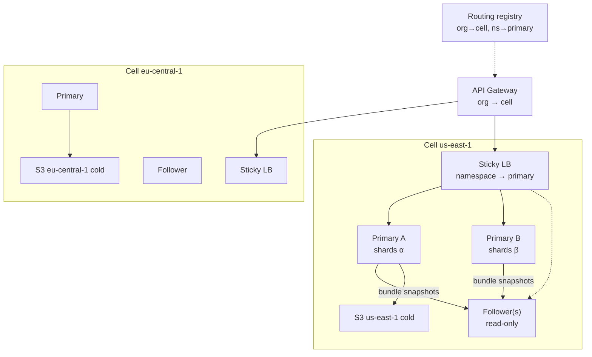
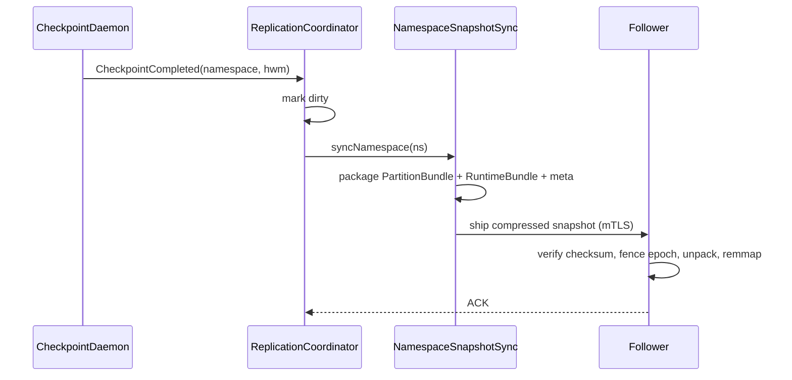

# ADR-0034-DRAFT: Cell-Based HA & Namespace-Sticky Sharding (Summary Draft)

| Field | Value |
|:---|:---|
| **Status** | Superseded by ADR-0034 (Cell HA Namespace Ownership) |
| **Date** | 2026-09-11 |
| **Authors** | Spector Maintainers & Architecture Working Group |
| **Deciders** | Spector Technical Steering Committee (TSC) |
| **Supersedes** | None |
| **Superseded By** | ADR-0034 (Cell HA Namespace Ownership) |
| **Last Verified** | 2026-09-16 (Verified against `main`) |

---

**Document ID**: `ADR-0034`  
**Status**: Proposed  
**Date**: 2026-09-11  
**Authors**: Technical Lead  
**Approved by**: _pending Bharat_  
**Related Documents**:
- ADR-0004 (V4 Bundle Architecture — PartitionBundle / RuntimeBundle)
- Prior enterprise HA draft (cell topology; superseded by this decision)
- `StorageLayout` / `DataLayoutVersion` / `LayoutMigrator` (spector)

**Target Repositories**: `spectrayan/spector` (runtime), `spectrayan/spectrayan` (this ADR)

---

## Context

Spector stores cognitive memory with **physical per-namespace isolation**: each user/agent gets its own on-disk tree of mmap'd binary stores (SIMD hot path). That design:

- Eliminates the **truncation trap** of shared HNSW + `user_id` filters
- Makes **provable tenant isolation** and cheap hard-delete (`rm -rf` + DEK shred) possible
- Forces a different HA model than “shared DB + replicas”

An initial enterprise draft proposed multi-region **cells**, L1/L2/L3 (hot mmap / warm NVMe / cold object storage), and checkpoint-driven snapshot replication. Review found the draft correct on isolation and cells, but **unsafe on write ownership**: multiple R/W leaders behind round-robin / least-conn load balancing with **local RWO NVMe** would send writes for the same namespace to different nodes and diverge trees.

The draft also described **pre-bundle** on-disk files (`semantic.mem`, `episodic.mem`, separate `.graph` files). Current target layout is **ADR-0004 V4 bundles** (one master mmap segment with region slices).

### Goals

1. **High performance** — keep local NVMe mmap + SIMD; avoid shared remote FS for hot path
2. **Data isolation** — physical namespace directories; no cross-tenant index mixing
3. **Replication & HA** — survive node loss without silent split-brain
4. **Honest durability** — state async snapshot RPO explicitly (not sync commit)

### Non-goals

- Synchronous multi-master writes to one namespace
- Shared NFS/EFS as primary hot store
- Replacing NWB/electrophysiology lakes or claiming medical HA classes

---

## Decision

### 1. Deploy as regional **cells**

Each cell is an independently deployable unit (leaders + followers + same-region cold bucket).

- **Blast radius** limited to that cell’s orgs
- **Data sovereignty** by pinning orgs to a region (e.g. GDPR → EU cell)
- **Scale** by growing a busy cell or adding cells — not by one global shared mmap pool

Global control plane holds only **org → cell** routing (and optional capacity signals). Cognitive payloads do not cross cells except via explicit, consented migration.



### 2. **Namespace-sticky write ownership** (mandatory)

**Exactly one primary writer per namespace** at a time.

| Rule | Detail |
|------|--------|
| Routing key | `tenant_id` + `namespace_id` (user/agent) |
| Assignment | Consistent hash ring **or** registry lease (`ns → node`) |
| Cell LB | Sticky by namespace — **not** round-robin / least-conn for writes |
| Writes | Only the primary for that namespace (`remember` / mutate) |
| Reads | Primary, or follower within lag SLO |
| Failover | Lease loss → new primary; fence old writer; remount / reject stale epochs |

**Rejected:** multi-leader R/W + round-robin with local disks (split-brain).

**Accepted alternatives (ops trade-off):**
- Single primary per cell + N read replicas (simpler; less write scale)
- Per-shard follower sets (better isolation; more pods)

### 3. On-disk unit of replication = **V4 bundles**

Supersede legacy multi-file snapshot lists. Snapshot packaging ships:

- **PartitionBundle**(s) under `partitions/NNN_epoch/` (cognitive region slabs)
- **RuntimeBundle** (graphs, indexes, coactivation, BM25, checkpoint region, …)
- Namespace metadata (`namespace.json`, layout version, WAL/checkpoint high-water if present)
- Integrity: bundle directory checksum (e.g. xxHash64) + optional outer CRC

Directory discovery uses **2-level hash sharding** (`StorageLayout` / equivalent) + `DataLayoutVersion` + atomic `LayoutMigrator` — not only flat `data/namespaces/<tenant>/<ns>`.

Illustrative layout (names may evolve; **bundle files** are the contract):

```text
data/namespaces/
  a3/f7/<tenant>/
    tenant.json
    <namespace>/
      namespace.json
      layout.version
      partitions/
        000_<epoch>/
          partition.bundle          # PartitionBundle master mmap
      runtime/
        runtime.bundle              # RuntimeBundle master mmap
      global/                       # checkpoint meta / trackers as required
```

`NamespaceSnapshotSync` packages **live bundle files** (and required sidecars), not a hardcoded V3 `semantic.mem` + `text.dat` + `*.graph` checklist.

### 4. Hot / warm / cold (JIT memory pager)

Physical isolation implies not every namespace can stay mmap’d.

| Tier | State | Typical access | Capacity (guideline / node) |
|------|--------|----------------|-----------------------------|
| **L1 Hot** | mmap’d (`Arena` / master segment) | &lt;1µs path | ~2K namespaces (RAM-bound) |
| **L2 Warm** | on local NVMe, unmapped | 50–500µs remmap | ~20K (disk-bound) |
| **L3 Cold** | compressed archive in **same-region** object storage | seconds (async warm) | unlimited |

Evict L1→L2 on pressure/idle; archive L2→L3 after idle policy. **Cold rehydrate must not block** MCP/API without a deadline — return warming / queue, then promote.

### 5. Replication = **checkpoint-driven bundle snapshots**

Prefer snapshot shipping over multiplexed per-event WAL fan-out across thousands of namespaces.



**Durability class (honest):** async snapshots ⇒ **RPO ≈ snapshot interval / min-changes window** (e.g. tens of seconds to minutes), **not** zero RPO. Product/docs must not imply sync commit HA unless a future sync path ships.

**Follower lag:** if lag exceeds threshold → **FULLRESYNC** of that namespace with **epoch fencing** so a late snapshot cannot clobber a newer primary open.

**Deprecated for new work:** multiplexed `WalReplicationLeader` / frame demux as the primary HA path (may remain for legacy; docs must not present it as current).

Leader election: Kubernetes Lease and/or static role for lab; election must align with **namespace (or shard) ownership**, not “all nodes are writers.”

### 6. DR & sovereignty

- Cold tier and CRR stay **inside the sovereignty boundary** (EU primary cold ↔ EU standby). Do **not** use US→EU CRR as the GDPR story.
- Org→cell mapping is sticky; DR failover updates routing to the standby cell in the **same** legal region unless the customer opts into multi-region.
- Illustrative targets (tunable): RPO driven by cold/snapshot lag; RTO by cell scale-up + JIT rehydrate.

### 7. Analytics stays CQRS/CDC

Org-level analytics must **not** scan every namespace bundle. Stream **metadata only** (counts, types, tokens, tags) via CDC; never raw text/vectors/graph edges to the OLAP path by default.

### 8. Target vs Implemented

This ADR is the **architecture contract**. Implementations may lag.

| Area | Contract | Notes |
|------|----------|-------|
| Physical namespace isolation | Required | Core Spector property |
| V4 bundles as storage unit | Required | ADR-0004 |
| Cell + org→cell routing | Target | Enterprise overlay |
| Namespace→primary sticky LB | **Required for multi-node R/W** | Blocks round-robin multi-writer |
| Checkpoint bundle snapshot replication | Target / partial | Prefer over WAL fan-out |
| L1/L2/L3 pager + cold SPI | Target / partial | |
| Sync cross-node commit | Out of scope v1 | |

Docs and sales materials must label **Target vs Implemented** explicitly — no blanket “all HA components shipped.”

---

## Consequences

### Positive

- Preserves mmap/SIMD performance and isolation guarantees under horizontal scale
- Eliminates split-brain from naïve multi-leader LB
- Aligns replication with V4 bundle reality (fewer FDs, coherent CRC, simpler ship unit)
- Clear sovereignty and durability narrative

### Negative / trade-offs

- Sticky routing + rebalancing is operationally harder than round-robin
- Async RPO may be insufficient for some enterprise RFPs (call out; offer higher-frequency snapshots or single-node sync disk as premium later)
- Follower remmap after snapshot has cost; read-your-writes should prefer primary
- Bundle growth/remap (ADR-0004) must coordinate with snapshot fencing

### Follow-ups

1. Spec `NamespaceOwnership` API (hash ring vs lease registry) + gateway sticky key
2. Update `NamespaceSnapshotSync` contract to V4 bundle manifest
3. Rewrite enterprise HA runbooks; remove WAL-primary language from port matrices
4. Property tests: single-writer invariant; snapshot epoch monotonicity; cold warm non-blocking deadline
5. Load test: shard rebalance while serving remember/recall

---

## Alternatives Considered

| Alternative | Pros | Cons | Verdict |
|-------------|------|------|---------|
| **A. Round-robin multi-leader R/W + local NVMe** (prior draft) | Simple LB | Split-brain, divergent namespaces | ❌ Rejected |
| **B. Shared remote FS (EFS/NFS) for all nodes** | Shared view | Latency, flock hell, weak isolation story | ❌ Rejected for hot path |
| **C. Single primary per cell + read replicas** | Simple fencing | Write ceiling = one node | ✅ Allowed (small cells) |
| **D. Namespace-sticky primaries + snapshot followers** | Scales writes with isolation | Needs ownership registry/hash | ✅ **Selected** |
| **E. Sync WAL streaming as primary HA** | Lower RPO possible | Multiplex complexity at namespace scale | ❌ Not primary; optional later research |
| **F. Shared HNSW + tenant filter** | Ops familiar | Truncation trap; weak isolation | ❌ Rejected (core Spector) |

---

## One-line summary

**Cells for blast radius and sovereignty; one sticky primary per namespace for writes; V4 bundles as the snapshot unit; async checkpoint replication with honest RPO — never round-robin multi-writer on local mmap disks.**
