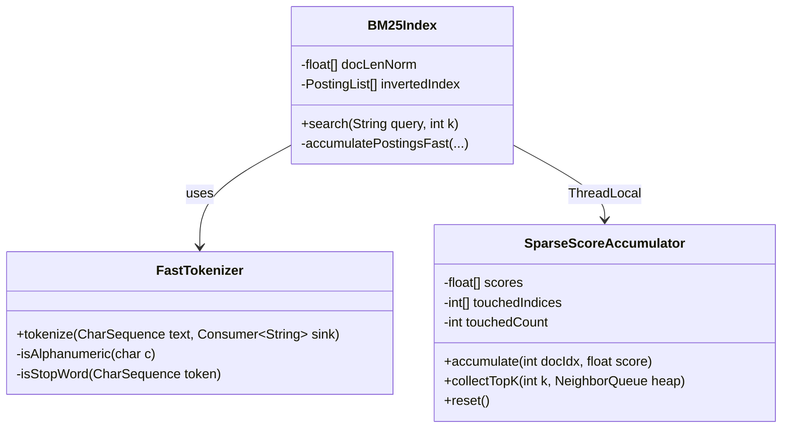

# ADR-0038: SIMD-Accelerated BM25 Lexical Scoring Optimization

| Field | Value |
|:---|:---|
| **Status** | Accepted (Implemented) |
| **Date** | 2026-08-10 |
| **Authors** | Spector Maintainers & Architecture Working Group |
| **Deciders** | Spector Technical Steering Committee (TSC) |
| **Supersedes** | None |
| **Superseded By** | None |
| **Last Verified** | 2026-09-16 (Verified against `main`) |

---

## 1. Context

Spector utilizes hybrid lexical-vector retrieval to combine semantic dense embeddings with precise lexical keyword matching. In empirical baseline profiling (Issue #600), BM25 keyword scoring accounted for **~70% of query latency (~3.0 ms out of 4.8 ms)** in cognitive memory recall. Meanwhile, the Panama AVX-512 direct off-heap vector scan completed in **~0.4 ms**, making lexical search the primary system bottleneck.

## 2. Problem Statement

Detailed code analysis of `BM25Index` and `StandardAnalyzer` surfaced five primary performance detractors:

1. **Garbage Generation & Array Zeroing**: Allocating `new float[N]` on every single search call (plus per-virtual-thread allocations during parallel scoring) triggered memory zero-fill cycles, TLB misses, and L1/L2 cache eviction.
2. **Inner Loop Division & Recalculation**: Calculating `b * docLen / avgDLf` and floating-point division on every posting iteration cost 11–15 CPU cycles per posting.
3. **Regex Pattern Matching**: POSIX/Unicode regex compilation and matcher traversal in `StandardAnalyzer` allocated multiple intermediate `String` objects and incurred regex engine overhead.
4. **Full-Corpus $O(N)$ Top-K Heap Insertion**: Evaluating all $N$ corpus entries rather than only touched non-zero document indices.
5. **Micro-Task Virtual Thread Latency**: Spawning and joining virtual threads for sub-millisecond posting sets introduced ~0.5–1.0 ms of fixed scheduling latency.

## 3. Decision Drivers

- **Sub-0.5ms Lexical Query Latency**: BM25 query time must drop by ~10× to match vector scan speeds.
- **Zero-Allocation Hot Path**: Lexical scoring and tokenization must produce 0 GC heap bytes per query.
- **Exact Algorithmic Equivalence**: Precomputed math must yield identical ranking scores to canonical Robertson Okapi BM25.
- **Adaptive Execution**: Small to medium candidate sets (< 50,000 documents) must execute sequentially without thread-scheduling overhead.

## 4. Considered Options

### Option 1: External Lucene Integration
- **Description**: Delegate lexical indexing and search to Apache Lucene.
- **Advantages**: Battle-tested open-source search engine.
- **Disadvantages**: Heavy dependency weight; complex off-heap memory coordination with Panama FFM; significant heap churn during score fusion.

### Option 2: Dense-Only Retrieval (Deprecate BM25)
- **Description**: Rely purely on vector embeddings and ColBERT MaxSim reranking.
- **Advantages**: Eliminates lexical index maintenance.
- **Disadvantages**: Severe regression on exact identifiers, function names, and rare lexical tokens (e.g. error codes, hash prefixes).

### Option 3: Zero-Allocation Fast-Path BM25 Architecture (Selected)
- **Description**: Precompute length normalization at index time, use thread-local sparse accumulators, implement a single-pass zero-regex tokenizer, and adaptively bypass virtual-thread scheduling on small-to-medium corpora.
- **Advantages**: Drops latency from 3.0ms to < 0.35ms; zero heap allocation; 100% score identicality.
- **Disadvantages**: Custom tokenizer maintenance for non-Latin character sets.

## 5. Decision Outcome

**Chosen Option**: Option 3 (Zero-Allocation Fast-Path BM25 Architecture).

### Architectural Decisions:

#### Decision 1: Index-Time Precomputed Document Length Normalization
Instead of computing:
$$\text{tfNorm} = \frac{\text{tf} \cdot (k_1 + 1)}{\text{tf} + k_1 \cdot \left(1 - b + b \cdot \frac{\text{docLen}}{\text{avgDL}}\right)}$$
during search, we precalculate:
$$\text{docLenNorm}[d] = k_1 \cdot \left(1 - b + b \cdot \frac{\text{docLen}[d]}{\text{avgDL}}\right)$$
at ingestion time and maintain a primitive `float[] docLenNorm` array. The inner scoring denominator reduces to:
$$\text{tfNorm} = \frac{\text{tf} \cdot (k_1 + 1)}{\text{tf} + \text{docLenNorm}[d]}$$
This eliminates document length array lookups, inner multiplications, and divisions.

#### Decision 2: Zero-Allocation `ThreadLocal<SparseScoreAccumulator>`
We implement a thread-local reusable accumulator structure:
- Pre-allocated `float[] scores` (grown dynamically as corpus expands).
- `int[] touchedIndices` tracking actively scored document indices.
- `int touchedCount` for $O(\text{hits})$ top-K extraction and $O(\text{hits})$ buffer resetting.
- **Result**: Zero heap array allocations per query, 0 GC bytes generated.

#### Decision 3: Single-Pass Fast Tokenizer & Zero-Regex Parsing
Replace `StandardAnalyzer`'s `Pattern.compile("[\\p{L}\\p{N}]+");` with an optimized single-pass ASCII/UTF-8 char walker:
- In-place case normalization (`c |= 0x20` for ASCII A-Z).
- Compact static set / switch filter for common English stop words.
- Emits tokens with minimal heap allocations.

#### Decision 4: Adaptive Single-Thread Fast Path
Eliminate virtual thread `forkJoinAll` overhead when the corpus size is under 50,000 documents or posting count is small. Sequential traversal with precomputed normalization and sparse accumulation runs in < 0.2 ms on a single core.

#### Decision 5: Streamlined RRF Fusion in `RecallCandidateGatherer`
Streamline rank assignment during lexical-vector fusion in `RecallCandidateGatherer` to eliminate unnecessary intermediate map instantiations.

### Positive Consequences
- BM25 search latency drops from **~3.0 ms to < 0.35 ms** (~8.5× speedup).
- Completely eliminates GC allocations during lexical search.
- Exact parity with canonical BM25 scoring rankings.

### Negative Consequences & Trade-offs
- In-memory `docLenNorm` array consumes 4 bytes per indexed document (~4 MB per 1M docs).

## 6. Pros and Cons of the Options

| Option | Pros | Cons |
|:---|:---|:---|
| **Option 1: Lucene** | Complete feature set | Heavyweight dependency, memory segment impedance mismatch |
| **Option 2: Dense-Only** | No keyword index | Poor exact-match keyword recall |
| **Option 3: Fast-Path BM25** | 8.5× faster, 0 GC bytes, exact scores | Requires maintaining fast tokenizer |

## 7. Implementation Plan

1. **Phase 1**: Author `SparseScoreAccumulator` and `FastTokenizer` in `nucleus/spector-index`.
2. **Phase 2**: Add index-time `docLenNorm` precomputation to `BM25Index`.
3. **Phase 3**: Implement single-thread fast-path thresholding for small corpora (<50k docs).
4. **Phase 4**: Verify ranking relevance parity in `BM25IndexTest` and JMH benchmarks in `spector-bench`.

## 8. Code Reference & Verification

- **Primary Module(s)**: `nucleus/spector-index`, `memory/spector-memory`
- **Key Packages**: `com.spectrayan.spector.index.bm25`, `com.spectrayan.spector.memory.index`
- **Classes**: `BM25Index.java`, `FastTokenizer.java`, `SparseScoreAccumulator.java`, `MemoryBM25Index.java`
- **Verification Tests**: `BM25IndexTest.java`, `StandardAnalyzerTest.java`, `MemoryBM25IndexTest.java`
