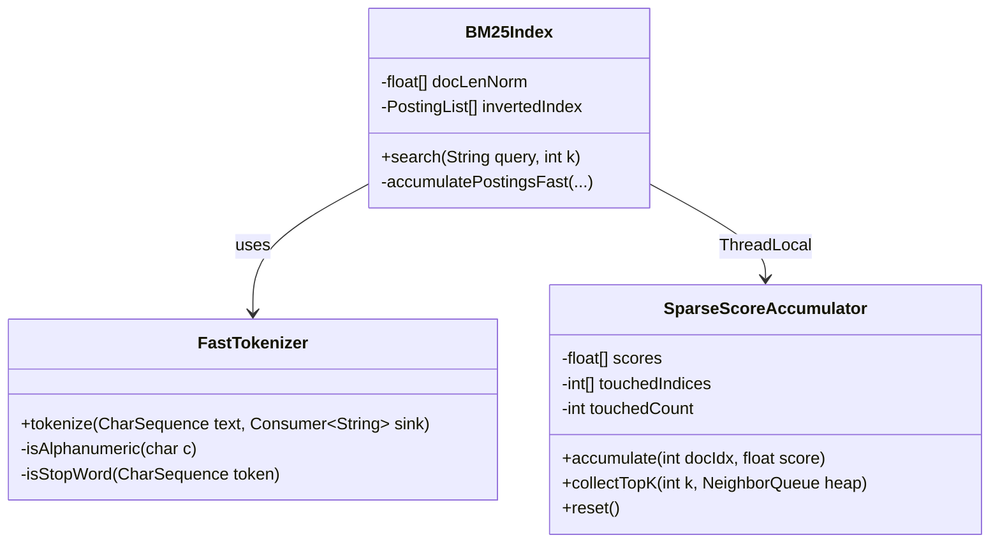

# ADR-0038: SIMD-Accelerated BM25 Lexical Scoring Optimization

| Field | Value |
|:---|:---|
| **Status** | Accepted (Implemented) |
| **Date** | 2026-08-10 |
| **Authors** | Spector Maintainers & Architecture Working Group |
| **Deciders** | Spector Technical Steering Committee (TSC) |
| **Supersedes** | None |
| **Superseded By** | None |
| **Last Verified** | 2026-09-16 (Verified against `main`) |

---

## 🏛️ ADR: Zero-Allocation Fast-Path BM25 Inverted Index Architecture

**Status**: Accepted  
**Author**: Architecture Working Group (Systems Architecture)  
**Target Subsystem**: `spector-index`, `spector-memory`  
**Issue**: #603  

---

### 1. Context & Architectural Challenge
In empirical baseline profiling (#600), BM25 keyword scoring accounts for **~70% of query latency (~3.0 ms out of 4.8 ms)** in Spector cognitive memory recall. Meanwhile, our Panama AVX-512 direct off-heap vector scan completes in **~0.4 ms**.

Detailed code analysis of `BM25Index` and `StandardAnalyzer` revealed 5 primary performance detractors:
1. **Garbage Generation & Array Zeroing**: Allocating `new float[N]` on every single search call (plus per-virtual-thread allocations during parallel scoring) triggers memory zero-fill cycles, TLB misses, and cache eviction.
2. **Inner Loop Division & Recalculation**: Calculating `b * docLen / avgDLf` and floating-point division on every posting iteration costs 11–15 CPU cycles per posting.
3. **Regex Pattern Matching**: POSIX/Unicode regex compilation and matcher traversal in `StandardAnalyzer` allocates multiple intermediate `String` objects and incurs regex engine overhead.
4. **Full-Corpus O(N) Top-K Heap Insertion**: Evaluating all $N$ corpus entries rather than only touched non-zero document indices.
5. **Micro-Task Virtual Thread Latency**: Spawning and joining virtual threads for sub-millisecond posting sets introduces ~0.5–1.0 ms of fixed scheduling latency.

---

### 2. Architectural Decisions & Design Choices

#### Decision 1: Index-Time Precomputed Document Length Normalization
Instead of computing:
$$\text{tfNorm} = \frac{\text{tf} \cdot (k_1 + 1)}{\text{tf} + k_1 \cdot \left(1 - b + b \cdot \frac{\text{docLen}}{\text{avgDL}}\right)}$$
during search, we precalculate:
$$\text{docLenNorm}[d] = k_1 \cdot \left(1 - b + b \cdot \frac{\text{docLen}[d]}{\text{avgDL}}\right)$$
at ingestion time and maintain a primitive `float[] docLenNorm` array. The inner scoring denominator reduces to:
$$\text{tfNorm} = \frac{\text{tf} \cdot (k_1 + 1)}{\text{tf} + \text{docLenNorm}[d]}$$
This eliminates document length array lookups, inner multiplications, and divisions.

#### Decision 2: Zero-Allocation `ThreadLocal<SparseScoreAccumulator>`
We implement a thread-local reusable accumulator structure:
- Pre-allocated `float[] scores` (grown dynamically as corpus expands).
- `int[] touchedIndices` tracking actively scored document indices.
- `int touchedCount` for $O(\text{hits})$ top-K extraction and $O(\text{hits})$ buffer resetting.
- **Result**: Zero heap array allocations per query, 0 GC bytes generated.

#### Decision 3: Single-Pass Fast Tokenizer & Zero-Regex Parsing
Replace `StandardAnalyzer`'s `Pattern.compile("[\\p{L}\\p{N}]+");` with an optimized single-pass ASCII/UTF-8 char walker:
- In-place case normalization (`c |= 0x20` for ASCII A-Z).
- Compact static set / switch filter for common English stop words.
- Emits tokens with minimal heap allocations.

#### Decision 4: Adaptive Single-Thread Fast Path
Eliminate virtual thread `forkJoinAll` overhead when the corpus size is under 50,000 documents or posting count is small. Sequential traversal with precomputed normalization and sparse accumulation runs in < 0.2 ms on a single core.

#### Decision 5: Streamlined RRF Fusion in `RecallCandidateGatherer`
Streamline rank assignment during lexical-vector fusion in `RecallCandidateGatherer` to eliminate unnecessary intermediate map instantiations.

---

### 3. Verification & Acceptance Criteria
- 100% test compatibility in `BM25IndexTest`, `StandardAnalyzerTest`, and `MemoryBM25IndexTest`.
- Benchmark verification in `spector-bench` demonstrating BM25 execution dropping from **~3.0 ms to < 0.35 ms**.
- Zero regression in search ranking relevance or scores.
