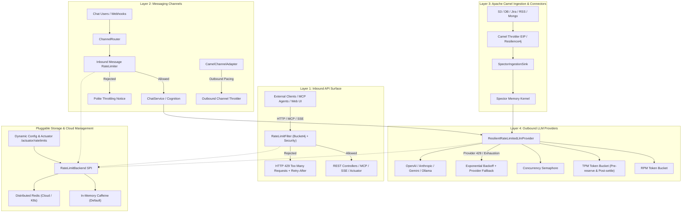
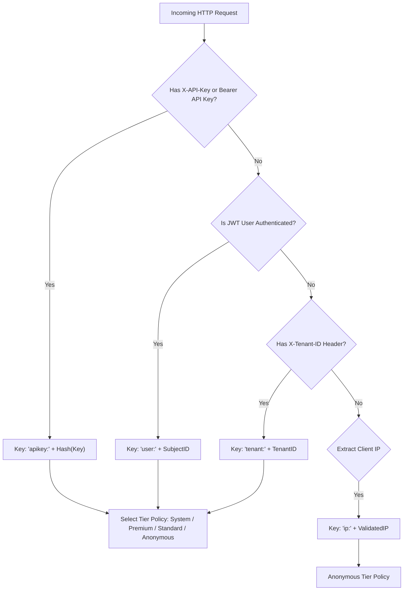

# ADR-0039: Robust Unified Rate Limiting Architecture

| Field | Value |
|:---|:---|
| **Status** | Accepted (Implemented) |
| **Date** | 2026-08-16 |
| **Authors** | Spector Maintainers & Architecture Working Group |
| **Deciders** | Spector Technical Steering Committee (TSC) |
| **Supersedes** | None |
| **Superseded By** | None |
| **Last Verified** | 2026-09-16 (Verified against `main`) |

---

## 1. Context

Spector has evolved into an enterprise-grade cognitive memory and autonomous agent runtime. As Spector exposes public and internal surfaces (REST APIs, Model Context Protocol endpoints, Server-Sent Events, 20+ Camel connectors, 10 messaging channel adapters, and outbound LLM generation/embedding pipelines), it faces severe stability, cost, and availability risks without comprehensive traffic shaping and rate limiting:

## 2. Problem Statement

1. **Inbound API Overload & DoS**: Unauthenticated or rogue clients can flood `/api/**` or `/mcp` endpoints, consuming CPU/memory and starving legitimate users.
2. **LLM Cost & Quota Exhaustion**: Outbound calls to cloud LLMs (OpenAI, Anthropic, Gemini, Groq) have strict Requests-Per-Minute (RPM) and Tokens-Per-Minute (TPM) limits. Unthrottled agent loops cause HTTP 429 bans, budget blowouts, and cascading failure across cognitive pipelines.
3. **Connector & Third-Party API Banning**: Unregulated polling or webhooks in Apache Camel connectors risk hitting rate limits on external SaaS providers (Salesforce, GitHub, Jira, Confluence, Slack, Google Drive) or overwhelming downstream ingestion pipelines.
4. **Messaging Flood**: Chat channel webhooks (Discord, Telegram, WhatsApp, Slack) can be flooded by spam bots or multi-user chatter, overloading cognition threads.
5. **Cloud Deployment Scalability**: Standalone in-memory rate limiting is insufficient for multi-replica Kubernetes clusters unless backed by a pluggable distributed state store (e.g., Redis).

GitHub Issue #120 originally proposed basic API rate limiting with Bucket4j. This ADR establishes a **Unified 4-Pillar Rate Limiting & Resilience Architecture** covering all layers of Spector, designed for zero-downtime dynamic configuration and seamless transition from standalone to distributed cloud environments.

---

## 3. Decision Drivers

- **Comprehensive Traffic Shaping**: Protect inbound APIs, outbound LLM tokens, Camel connectors, and chat webhooks from saturation.
- **Bucket4j & Resilience4j Core**: Standardize on high-throughput token-bucket algorithms with atomic concurrency.
- **Hierarchical Key Resolution**: Isolate limits per API key, tenant, IP address, and model provider.
- **Pluggable Distributed Storage**: In-memory Caffeine storage for standalone deployments with zero-code switch to Redis for multi-replica clusters.

## 4. Considered Options

### Option 1: Ad-Hoc In-Memory Guava Rate Limiters
- **Description**: Add `RateLimiter.create()` directly inside individual controllers and provider clients.
- **Advantages**: Fast to prototype.
- **Disadvantages**: Fragile, unconfigurable, no cluster synchronization, missing token/RPM differentiation.

### Option 2: Infrastructure / API Gateway Exclusively (Kong / Envoy)
- **Description**: Delegate rate limiting entirely to external ingress proxies.
- **Advantages**: Offloads JVM compute.
- **Disadvantages**: Fails to protect outbound LLM API budgets, Camel ingestion polling, or internal agent execution loops.

### Option 3: Unified 5-Pillar Architecture with Bucket4j & Resilience4j (Selected)
- **Description**: Standardize on a cohesive 5-pillar architecture covering inbound HTTP/SSE/MCP, outbound LLMs (RPM + TPM), Camel connectors, messaging webhooks, and pluggable Redis/Caffeine storage.
- **Advantages**: Complete protection across all surfaces; configurable via YAML; cluster-ready; Actuator metrics integration.
- **Disadvantages**: Requires maintaining multi-surface filter infrastructure.

## 5. Decision Outcome



---

## 3. Pillar 1: Inbound API Rate Limiting

### 3.1 Key Resolution Hierarchy
A polymorphic key resolution strategy identifies callers with fallback tiers:



### 3.2 Endpoint Categorization & Custom Policies
Different routes require different rate-limiting envelopes:
1. **Public / Static / Probes**: `/actuator/health`, `/actuator/info`, `/index.html`, `/assets/**` &rarr; **Bypassed / Excluded**.
2. **Auth Endpoints**: `/api/v1/auth/login`, `/api/v1/auth/token` &rarr; **Strict (10 req/min, burst 20)** to prevent credential brute forcing.
3. **Standard REST & MCP**: `/api/v1/memories/**`, `/mcp`, `/api/v1/query` &rarr; **Standard Tier (100 req/s, burst 200)**.
4. **Heavy Operations**: `/api/v1/admin/consolidate`, batch embeddings &rarr; **Throttled (5 req/min, burst 10)**.

### 3.3 HTTP 429 Response Protocol
When a limit is violated:
- **HTTP Status**: `429 Too Many Requests`
- **Response Headers**:
  - `Retry-After: <seconds>` (calculated from `ConsumptionProbe.getNanosToWaitForRefill()`)
  - `X-RateLimit-Limit: <capacity>`
  - `X-RateLimit-Remaining: 0`
  - `X-RateLimit-Reset: <epoch-seconds>`
- **Response Body**: RFC 7807 Problem Details
  ```json
  {
    "type": "urn:spector:error:rate-limit-exceeded",
    "title": "Too Many Requests",
    "status": 429,
    "detail": "Rate limit exceeded. Refill available in 3 seconds.",
    "instance": "/api/v1/query",
    "retryAfterSeconds": 3
  }
  ```

---

## 4. Pillar 2: Outbound LLM Provider Rate Limiting & Resilience

### 4.1 Dual-Dimension Token Bucket (RPM + TPM)
Cloud LLMs enforce both Request rates and Token consumption rates:
- **RPM Bucket**: Consumes 1 unit per request.
- **TPM Bucket (Tokens Per Minute)**:
  1. **Pre-flight Estimation**: Heuristic tokenizer calculates `estimatedTokens = (prompt.length() / 4) + options.maxTokens()`.
  2. **Token Reservation**: Probe bucket for `estimatedTokens`. If insufficient tokens remain, queue request up to `queueTimeoutMs` (e.g. 5000ms).
  3. **Post-call Reconciliation**: Upon receiving `LlmResponse`, extract actual `promptTokens + completionTokens`. Credit over-reserved tokens or debit under-reserved tokens against the bucket.

### 4.2 Concurrency Bulkhead & Backoff Failover
- **Bulkhead**: `Semaphore` per provider limiting concurrent in-flight HTTP connections (e.g., max 10 concurrent requests to Claude 3.5 Sonnet).
- **Retry with Jitter**: On upstream HTTP 429 or transient 503, parse upstream `Retry-After` header and execute full-jitter exponential backoff (up to 3 retries).
- **Dynamic Provider Failover**: If primary provider quota is exhausted, fail over to registered secondary provider (e.g., `openai` &rarr; `anthropic` &rarr; local `ollama`).

---

## 5. Pillar 3: Apache Camel Connector & Ingestion Throttling

### 5.1 Route Template Parameters
All Camel route templates in `synapse/spector-connector` are upgraded with declarative throttling parameters:
```yaml
- routeTemplate:
    id: "rest-api-poll"
    parameters:
      - name: throttleRequests
        defaultValue: "60"
      - name: throttlePeriodMs
        defaultValue: "60000"
      - name: throttleAsyncDelayed
        defaultValue: "true"
    from:
      uri: "timer:{{routeId}}?period={{pollIntervalMs}}"
      steps:
        - throttle:
            expression:
              simple: "{{throttleRequests}}"
            timePeriodMillis: "{{throttlePeriodMs}}"
            asyncDelayed: "{{throttleAsyncDelayed}}"
        - to: "{{url}}"
        - process:
            ref: "spectorIngestionSink"
```

### 5.2 Ingestion Backpressure & Circuit Breakers
- Camel `Resilience4jConfiguration` applied to routes with error thresholds.
- When `SpectorIngestionSink` detects kernel indexing queue pressure, it signals route controllers to temporarily suspend polling rather than risking out-of-memory errors.

---

## 6. Pillar 4: Multi-Channel Messaging Throttling

### 6.1 Inbound User Anti-Flood
- Implemented in `ChannelRouter`:
  - Token bucket keyed by `(channelId + ":" + senderId)` (e.g., `slack:U123456`).
  - Limits message processing to 30 msgs/min per user with burst of 5.
  - Exceeding limit triggers an in-channel notice: *"You are sending messages faster than I can process. Please wait a moment."* without invoking LLM cognition.

### 6.2 Outbound Platform Pacing
- Platform rate limits enforced in `CamelChannelAdapter`:
  - **Telegram**: 30 msgs/s global, 1 msg/s per specific chat.
  - **Slack**: 1 msg/s per webhook / bot token.
  - **Discord**: 50 msgs/s global, 5 msgs/s per channel.

---

## 7. Pillar 5: Cloud-Readiness & Pluggable Storage

### 7.1 Multi-Backend Storage SPI
```java
public interface RateLimitStateStore {
    Bucket resolveBucket(String key, RateLimitPolicy policy);
    void resetBucket(String key);
    Map<String, BucketStats> activeBuckets();
}
```

Implementations:
1. **`CaffeineRateLimitStateStore` (In-Memory Default)**:
   - Uses `Bucket4j` with local `Caffeine` cache with TTL eviction (e.g. expire buckets after 10 minutes of inactivity).
   - Zero external dependency, sub-microsecond latency, ideal for single-node deployments.
2. **`RedisRateLimitStateStore` (Distributed Cloud)**:
   - Uses `bucket4j-redis` (Lettuce / Redisson) with atomic Redis EVAL scripts.
   - Enables multiple Spector Synapse nodes behind AWS ALB / Kubernetes Ingress to share atomic rate limits.

---

## 8. Configuration Specification

```yaml
spector:
  resilience:
    rate-limiting:
      enabled: true
      backend: in-memory # [in-memory, redis, hazelcast]
      redis:
        uri: redis://localhost:6379/0
      default-tier: standard
      tiers:
        anonymous:
          requests-per-second: 10
          burst-capacity: 20
        standard:
          requests-per-second: 100
          burst-capacity: 200
        premium:
          requests-per-second: 500
          burst-capacity: 1000
        system:
          requests-per-second: 2000
          burst-capacity: 5000
      endpoints:
        - path-pattern: "/api/v1/auth/**"
          requests-per-minute: 30
          burst-capacity: 10
        - path-pattern: "/api/v1/memory/consolidate"
          requests-per-minute: 20
          burst-capacity: 5
      llm:
        enabled: true
        queue-timeout-ms: 5000
        max-retries: 3
        default-policy:
          requests-per-minute: 60
          tokens-per-minute: 100000
          max-concurrent-calls: 10
        providers:
          openai:
            requests-per-minute: 500
            tokens-per-minute: 200000
            max-concurrent-calls: 20
          anthropic:
            requests-per-minute: 300
            tokens-per-minute: 150000
            max-concurrent-calls: 15
          ollama:
            requests-per-minute: 60
            tokens-per-minute: 50000
            max-concurrent-calls: 2
      channels:
        inbound-user-rpm: 30
        inbound-user-burst: 5
      connectors:
        default-throttle-requests: 100
        default-throttle-period-ms: 60000
```

---

---

### Consequences
- **Positive**: Complete defense against DoS, LLM quota exhaustion, upstream SaaS banning, and webhook floods; transparent Actuator metrics.
- **Negative / Trade-offs**: Minor latency overhead (~10–20µs per HTTP request) for atomic token bucket deduction.

## 6. Pros and Cons of the Options

| Alternative | Pros | Cons |
|:---|:---|:---|
| **Option 1: Ad-hoc Guava** | Quick prototype | Uncoordinated, non-clusterable, lacks TPM limits |
| **Option 2: Gateway-Only** | Offloads JVM | Blind to outbound LLM costs, connector polling, internal loops |
| **Option 3: Unified 5-Pillars (Selected)** | Complete 360-degree protection, cloud-ready, Actuator metrics | Small filter overhead on inbound requests |

## 7. Implementation Plan

| Phase | Description | Key Deliverables |
|:---|:---|:---|
| **Phase 1** | Core API Rate Limiting & Bucket4j | `RateLimitFilter`, `RateLimitProperties`, Caffeine bucket store, 429 handler, SecurityConfig wiring |
| **Phase 2** | Outbound LLM Dual-Dimension Rate Limiting | `ResilientRateLimitedLlmProvider`, RPM/TPM token reservation, concurrency bulkhead, backoff |
| **Phase 3** | Camel Connector & Messaging Channel Throttling | Route template throttling EIPs, `ChannelRouter` anti-flood, outbound pacing |
| **Phase 4** | Cloud-Ready Redis Store & Actuator Management | Redis state store adapter, `/actuator/ratelimits` endpoint, Micrometer metrics |

---

## 8. Code Reference & Verification

### 9.1 Micrometer Metrics
- `spector.ratelimit.requests.total{tier="...", key_type="...", status="allowed|rejected"}`
- `spector.ratelimit.tokens.remaining{tier="..."}`
- `spector.ratelimit.llm.tpm.usage{provider="..."}`
- `spector.ratelimit.llm.rpm.usage{provider="..."}`
- `spector.ratelimit.wait_time.seconds`

### 9.2 Management Endpoints
- `GET /actuator/ratelimits`: Returns status of all rate limiting policies, backend type, and summary statistics.
- `POST /actuator/ratelimits/reset?key=<key>`: Allows admins to clear a throttled IP, user, or API key immediately.

---

---

### Code Reference & Verification Gate
- **Primary Module(s)**: `synapse/spector-synapse`, `synapse/spector-connector`, `memory/spector-providers`
- **Key Packages**: `com.spectrayan.spector.synapse.ratelimit`, `com.spectrayan.spector.connector.core`
- **Classes**: `RateLimitFilter.java`, `RateLimitProperties.java`, `ConnectorExecutionAuditNotifier.java`
- **Verification Tests**: `RateLimitFilterTest.java`, `ConnectorExecutionAuditNotifierTest.java`
