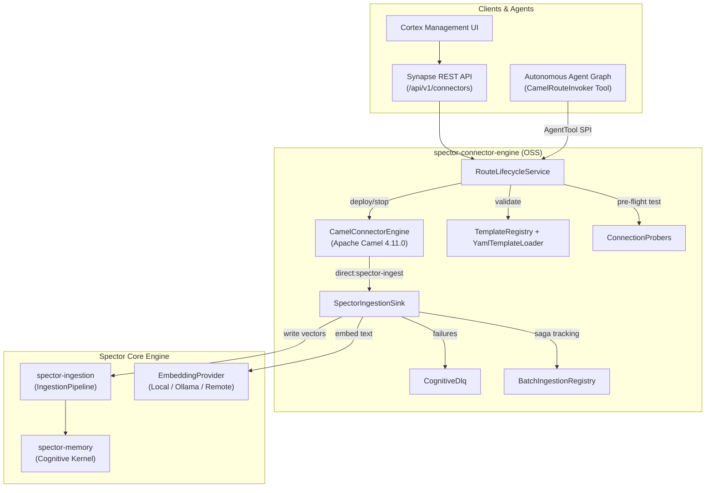

# ADR-0041: Unified Connector Architecture for Ingestion

| Field | Value |
|:---|:---|
| **Status** | Accepted (Implemented) |
| **Date** | 2026-08-15 |
| **Authors** | Spector Maintainers & Architecture Working Group |
| **Deciders** | Spector Technical Steering Committee (TSC) |
| **Supersedes** | None |
| **Superseded By** | None |
| **Last Verified** | 2026-09-16 (Verified against `main`) |

---

## 1. Context

Data ingestion is the lifeblood of Spector's cognitive memory engine. Users need automated, event-driven pipelines that extract knowledge from enterprise document repositories, cloud object stores, ticketing systems, databases, and APIs.

## 2. Problem Statement

Currently, Spector's connector ecosystem is in an inconsistent state:

1. In the open-source repository (`spectrayan/spector`), `ConnectorController` in `spector-synapse` is a mock in-memory controller that does not execute real ingestion pipelines. Apache Camel is missing from the Maven reactor, and no connector engine module exists.
2. In `spectrayan/spector-enterprise`, a full `spector-connector-engine` was developed with Apache Camel 4.11.0, YAML route templates, pre-flight connection probers, and ingestion sinks. However, it has not been ported to the OSS repository, leaving OSS users without data connectors and creating divergence.
3. Neither repository provides an agent tool (`CamelRouteInvoker`) to allow autonomous agents in Spector to trigger connector ingestion on demand.
4. Several high-value connector integrations requested in issues #218 (Confluence), #219 (Google Drive), #241 (SharePoint/OneDrive), #242 (Jira), #243 (Web Scraper), #244 (RSS/Atom), and #266 (Salesforce) require standardized YAML templates and extractor pipelines.

---

## 3. Decision Drivers

- **Automated Knowledge Ingestion**: Event-driven pipelines to ingest documents from enterprise repositories, object stores, databases, and APIs.
- **Declarative YAML Route Templates**: Easy authoring of new connectors without Java compilation.
- **High-Throughput Ingestion Sink**: Direct integration with Spector's `IngestionTarget` and `EmbeddingProvider`, with PII scrubbing and chunk change detection.
- **Autonomous Agent Tooling**: Enable AI agents to discover, trigger, and parameterize connector ingestion on demand via `CamelRouteInvoker`.

## 4. Considered Options

### Option 1: Custom Standalone Java Connectors
- **Description**: Implement custom network clients and polling loops for each external SaaS service.
- **Advantages**: Tailored to each protocol.
- **Disadvantages**: Massive maintenance burden; bespoke retry and connection pooling; no unified lifecycle.

### Option 2: External Ingestion Service (Airbyte / Singer)
- **Description**: Require users to deploy an external ingestion tool to write into Spector.
- **Advantages**: Large catalog of existing community connectors.
- **Disadvantages**: Heavy operational dependencies; no in-process embedded execution; cannot be triggered synchronously by LLM agents.

### Option 3: Unified Apache Camel 4 Connector Engine with YAML Templates (Selected)
- **Description**: Port and embed `spector-connector-engine` with Apache Camel 4.11 into the open-source reactor, driven by declarative YAML route templates and exposed to agents via `CamelRouteInvoker`.
- **Advantages**: Battle-tested 300+ Camel components; zero external services; dynamic route lifecycle; agent callable.
- **Disadvantages**: Camel dependency surface in connector module.

## 5. Decision Outcome

We establish a unified, two-tiered connector architecture:

### 2.1 Core OSS Tier (`spector` -> `connectors/spector-connector-engine`)
The open-source core will include:
- **`CamelConnectorEngine`**: Standalone, non-Spring `DefaultCamelContext` manager capable of dynamically deploying, updating, starting, stopping, and removing route templates.
- **`RouteLifecycleService`**: Orchestrates template validation, parameter resolution, connectivity probing, and engine deployment.
- **`TemplateRegistry` & `YamlTemplateLoader`**: Loads route template definitions and descriptors from YAML specifications (`src/main/resources/templates/connectors/*.yaml`) with runtime validation via `TemplateDescriptorValidator`.
- **`SpectorIngestionSink`**: High-throughput Camel `Processor` bridging incoming exchange payloads directly into Spector's `IngestionTarget` and `EmbeddingProvider`, with PII scrubbing, chunk change detection, and Cognitive DLQ error handling.
- **`ConnectionProbers`**: Pre-flight connectivity testing for all supported connector protocols (Local Filesystem, HTTP REST, S3, JDBC, Kafka, MongoDB).
- **Standard Connector Catalog**:
  - `file-watch`: Local directory watcher with recursive glob filters.
  - `rest-api-poll`: Periodic REST HTTP polling with JSONPath extraction.
  - `github-ingest`: Git repository clone and markdown/code ingestion.
  - `s3-poll`: AWS S3 bucket polling with prefix filtering.
  - `webhook-receiver`: Generic HTTP webhook ingestion endpoint.
  - `db-query`: JDBC polling with incremental timestamp/ID tracking.
  - `notion-pages`: Notion API page and block ingestion.
  - `slack-ingest` & `slack-notify`: Inbound Slack events and outbound alert dispatching.
  - `kafka-consumer`: Streaming Apache Kafka event ingestion.
  - `mongodb-poll`: MongoDB query and change stream ingestion.
  - `email-notify`: SMTP notification dispatch.
  - `rss`: RSS/Atom feed polling with GUID deduplication.
  - `web-scraper`: Recursive web crawler with Jsoup HTML-to-Markdown extraction.
  - `confluence`, `jira`, `google-drive`, `sharepoint`, `salesforce`: Extended enterprise templates.

### 2.2 Enterprise Tier (`spector-enterprise` -> `connectors/spector-connector-engine`)
The enterprise tier extends OSS `spector-connector-engine` by layering enterprise-only capabilities:
- **`TenantMemoryRegistry`**: Per-tenant workspace routing, JIT paging of memory instances, and LRU memory cache eviction under memory constraints.
- **Tenant Resource Quotas**: Hard rate-limits, chunk quotas, and tenant isolation policies.
- **Enterprise Credential Providers**: HashiCorp Vault, AWS Secrets Manager, and Azure Key Vault resolvers.
- **Cross-Cluster Replication**: Streaming change data capture (CDC) to secondary Spector clusters.

### 2.3 Synapse & Agent Tooling (`spector-synapse`)
- **`ConnectorController`**: Refactored to delegate directly to `RouteLifecycleService` and `TemplateRegistry`.
- **`CamelRouteInvoker`**: Registered as an `AgentTool` (`@Component`) allowing LLM agents in Spector to discover running routes and invoke connector jobs on demand with parameters.

---

---

## 3. Component Interaction Diagram

---

## 6. Pros and Cons of the Options

| Alternative | Pros | Cons |
|:---|:---|:---|
| **Option 1: Custom Java** | Exact fit | Unmaintainable protocol sprawl, bespoke polling loops |
| **Option 2: External Service** | Existing catalog | Heavy external infrastructure, cannot trigger from agent loops |
| **Option 3: Embedded Camel (Selected)** | Lightweight, YAML templates, 300+ protocols, agent-tool ready | Requires Camel route normalizers |

## 7. Implementation Plan

1. **Phase 1**: Port `spector-connector-engine` into `synapse/spector-connector` with Apache Camel 4.
2. **Phase 2**: Add standard connector YAML templates (`file-watch`, `rest-api-poll`, `github-ingest`, `s3-poll`).
3. **Phase 3**: Implement `SpectorIngestionSink` bridging exchanges into `IngestionTarget`.
4. **Phase 4**: Author `CamelRouteInvoker` tool and wire into `spector-synapse` agent graph.

## 8. Code Reference & Verification

## 4. Consequences & Benefits

- **Unified Codebase**: Resolves divergence between OSS and Enterprise repos; eliminates mock controllers in OSS.
- **Zero Lock-in**: Connectors are declared in declarative YAML route templates utilizing Apache Camel's mature ecosystem of 300+ components.
- **Agentic Integration**: Autonomous agents can now act as active data ingestion managers via `CamelRouteInvoker`.
- **Fault-Tolerant Ingestion**: Cognitive DLQ and batch Saga rollback ensure no corrupted or orphaned memories persist on ingestion errors.

---

### Code Reference & Verification Gate
- **Primary Module(s)**: `synapse/spector-connector`, `synapse/spector-synapse`
- **Key Packages**: `com.spectrayan.spector.connector.core`, `com.spectrayan.spector.synapse.tools`
- **Classes**: `CamelConnectorEngine.java`, `RouteLifecycleService.java`, `TemplateRegistry.java`, `SpectorIngestionSink.java`, `CamelRouteInvoker.java`
- **Verification Tests**: `ConnectorExecutionAuditNotifierTest.java`, `RouteLifecycleServiceTest.java`
