# ADR-0043: Single-VMA Bundle Layout Specification

| Field | Value |
|:---|:---|
| **Status** | Superseded by ADR-0004 |
| **Date** | 2026-08-04 |
| **Authors** | Spector Maintainers & Architecture Working Group |
| **Deciders** | Spector Technical Steering Committee (TSC) |
| **Supersedes** | None |
| **Superseded By** | ADR-0004 |
| **Last Verified** | 2026-09-16 (Verified against `main`) |

---

## 1. Context

In Spector Memory Kernel V3, off-heap storage was organized around individual `.smd` segment files per memory store. The class hierarchy was structured as follows:

## 1. Kernel Class Hierarchy — Current State (V3)

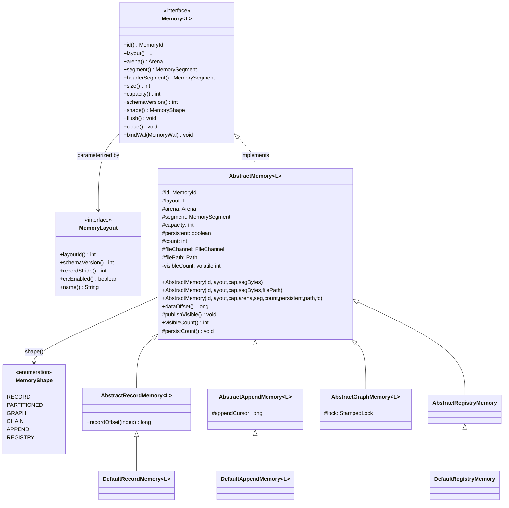

---

## 2. Concrete Store Hierarchy — Current State (V3)

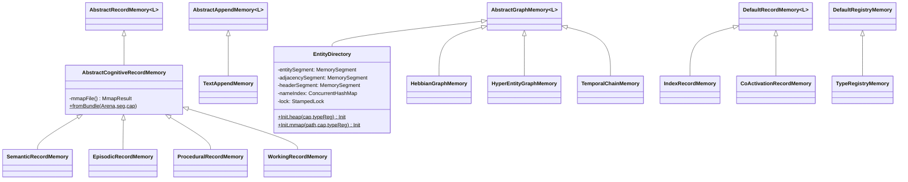

---

## 2. Problem Statement

Under V3 storage architecture, every cognitive partition and store opened dedicated file descriptors and distinct `MemorySegment` mappings:

- 10+ open file descriptors per active namespace.
- Inability to share a single contiguous Virtual Memory Area (VMA) across related stores.
- High TLB overhead and memory fragmentation when scaling to thousands of concurrent tenants.
- Independent segment growth triggered uncoordinated unmaps and memory reallocations.

## 3. Decision Drivers

- **Single-VMA Consolidation**: Consolidate multiple distinct store regions into a single file descriptor and memory mapping (`RuntimeBundle` and `PartitionBundle`).
- **Zero-Copy Region Slicing**: Slices within the bundle must match `AbstractRecordMemory` and `AbstractAppendMemory` contracts without pointer translation overhead.
- **Coordinated Region Growth**: Controlled virtual memory reservation (`Arena.allocate()`) with automatic remap on exhaustion.
- **Deterministic Lifecycle**: Hard unmap and flush synchronization owned by bundle managers rather than individual store instances.

## 4. Considered Options

### Option 1: Status Quo (Individual `.smd` files per store)

- **Description**: Maintain independent files for Working, Episodic, Semantic, Procedural, and Hebbian stores.
- **Advantages**: Simple isolated file format.
- **Disadvantages**: Severe file descriptor proliferation; TLB miss amplification; uncoordinated I/O flushing.

### Option 2: Archive Container (Tar/Zip)

- **Description**: Package `.smd` files inside an uncompressed container archive.
- **Advantages**: Single file on disk.
- **Disadvantages**: Lacks random-access zero-copy Panama FFM slicing; requires unpacking or custom seekable I/O.

### Option 3: Single-VMA Binary Bundle Layout with Sub-Region Index (Selected)

- **Description**: Multiplex multiple named regions (`RegionId`) within a single contiguous off-heap file mapping governed by a 4KB bundle header and dynamic region allocation table.
- **Advantages**: Exactly 1 file descriptor per bundle; zero-copy sub-segment slicing; unified flush and close lifecycle.
- **Disadvantages**: Requires region resizing protocol and internal alignment padding.

## 5. Decision Outcome

## 3. V4 Bundle Classes — How They Fit the Kernel

> [!IMPORTANT]
> The bundle is **NOT** a `Memory<L>` subclass. It is a **container** that owns a shared `Arena` + master `MemorySegment` and provides region slices to stores. Stores are constructed via the existing **wrapping constructor** pattern (same as `EntityDirectory.Init`).

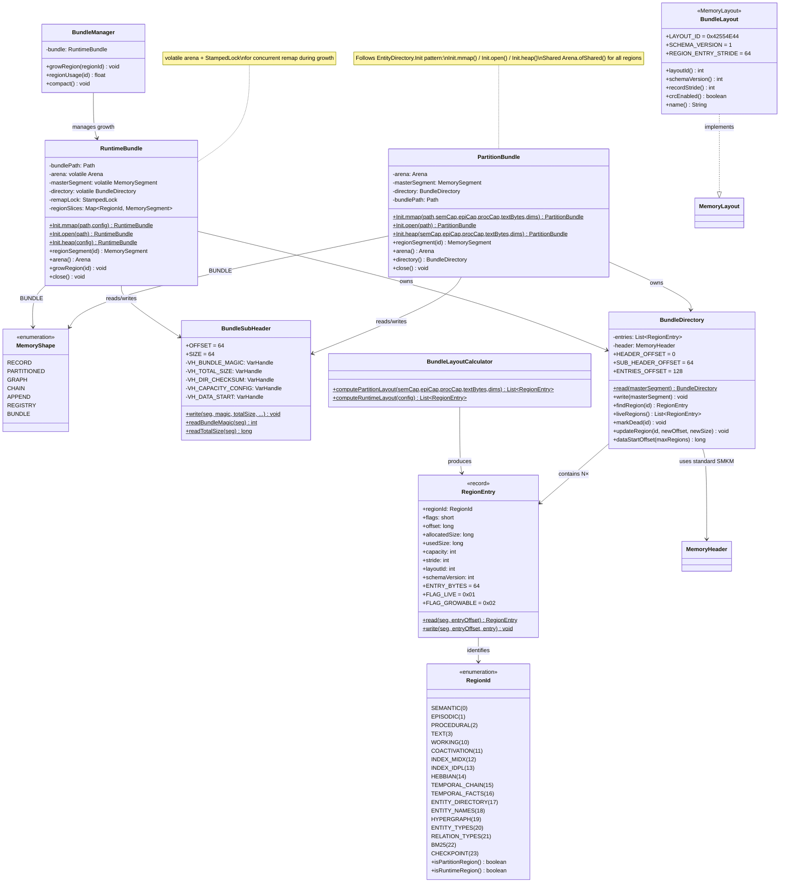

---

## 4. Bundle ↔ Store Wiring (How Stores Get Their Segments)

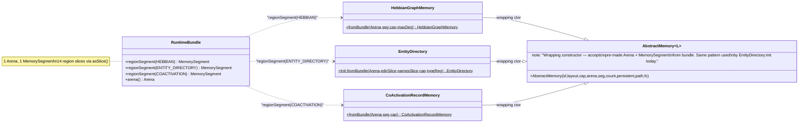

---

## 5. On-Disk Format — Bundle File Layout

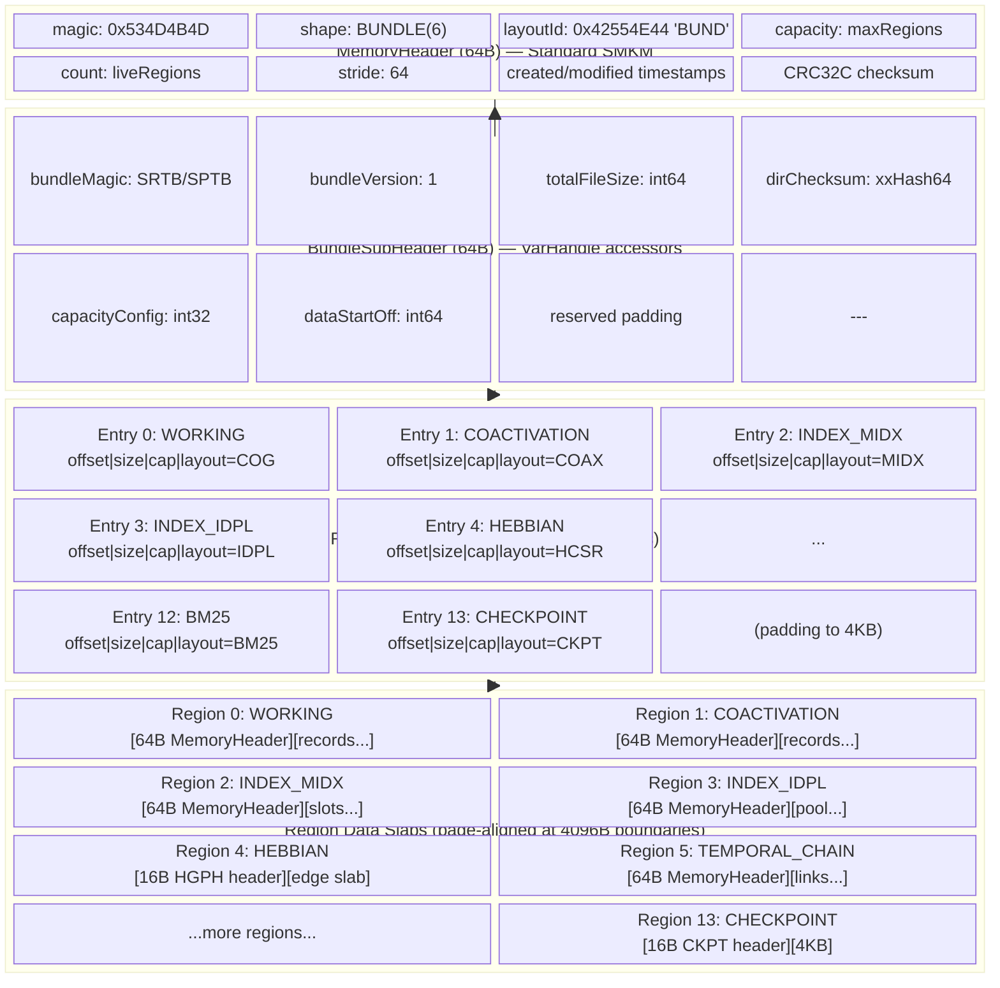

> [!NOTE]
> Each region's internal format is **unchanged** from V3. The region data starts with the same header the store expects (SMKM 64-byte for most, 16-byte HGPH for HebbianGraph, 80-byte EDIR for EntityDirectory). The bundle simply concatenates them into one file.

---

## 6. Sequence: Bundle Creation (`Init.mmap()`)

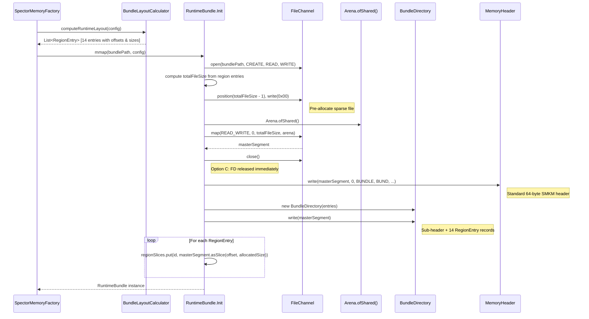

---

## 7. Sequence: Store Construction from Bundle

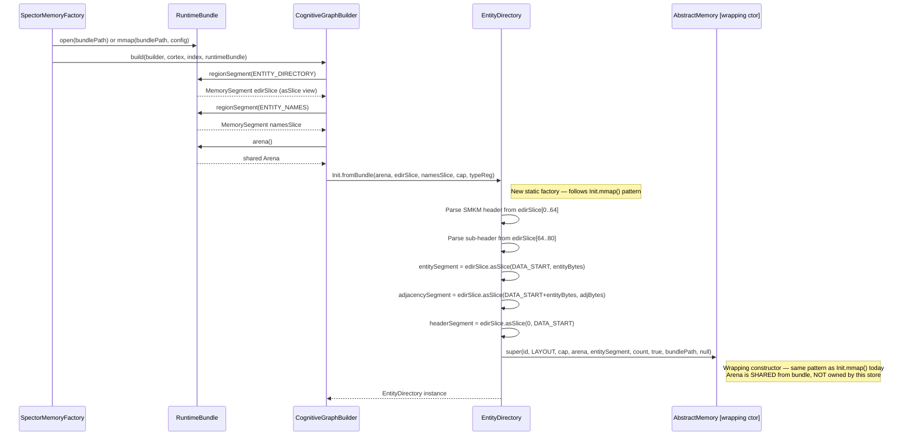

---

## 8. Sequence: Region Growth Protocol

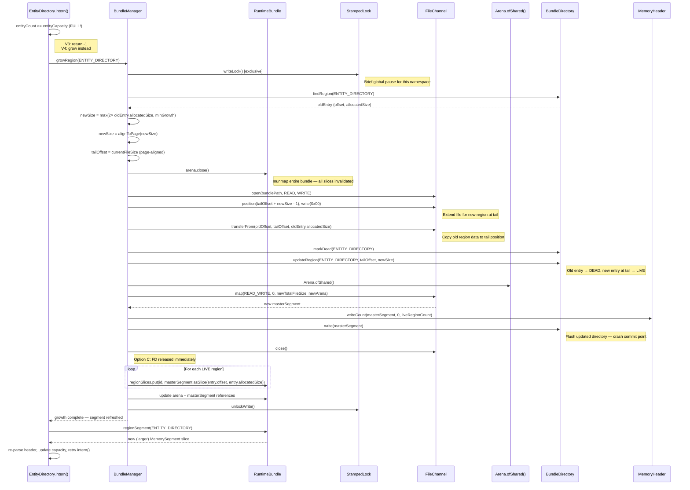

---

## 9. Sequence: Full Lifecycle — Create → Use → Flush → Close

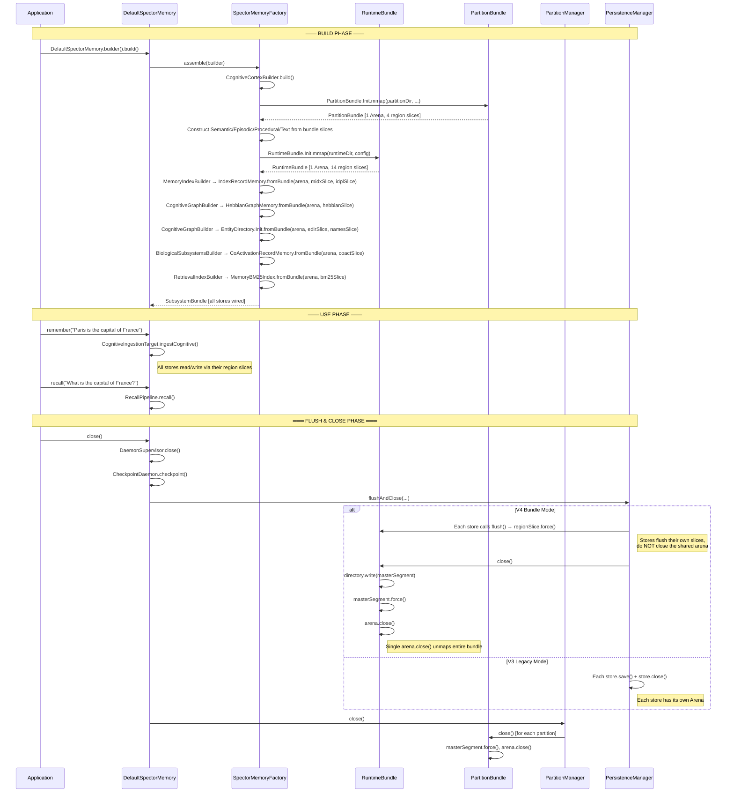

---

## 10. AbstractMemory — Bundle-Managed Close Behavior

The wrapping constructor today **transfers ownership** of the Arena to the store. In V4, bundle-backed stores must **NOT** close the shared arena — only flush their slice:

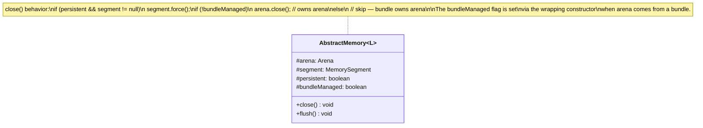

**Wrapping constructor signature** (updated):

```java
protected AbstractMemory(MemoryId id, L layout, int capacity,
                         Arena arena, MemorySegment segment, int count,
                         boolean persistent, Path filePath,
                         FileChannel fileChannel,
                         boolean bundleManaged)  // NEW parameter
```

> [!NOTE]
> Existing callers (EntityDirectory.Init, AbstractCognitiveRecordMemory) pass `bundleManaged=false` — zero behavioral change. Only `fromBundle()` factories pass `bundleManaged=true`.

---

## 11. PersistenceManager — V4 Integration

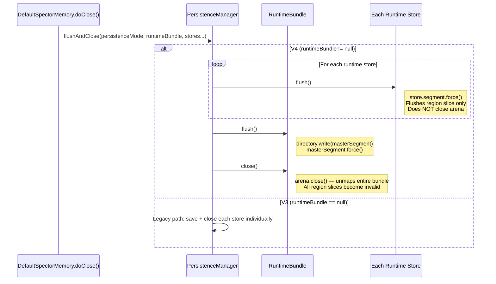

---

---

## 12. Full V4 Package Structure

```mermaid
graph TB
    subgraph "com.spectrayan.spector.memory.kernel"
        Memory["Memory&lt;L&gt;"]
        AbstractMemory["AbstractMemory&lt;L&gt;"]
        MemoryHeader["MemoryHeader"]
        MemoryShape["MemoryShape + BUNDLE"]
        MemoryLayout_IF["MemoryLayout"]
    end

    subgraph "com.spectrayan.spector.memory.kernel.shape"
        AbstractRecordMemory
        AbstractAppendMemory
        AbstractGraphMemory
        AbstractRegistryMemory
    end

    subgraph "com.spectrayan.spector.memory.kernel.layout"
        CognitiveRecordLayout
        EntityDirectoryLayout
        HebbianLayout
        HyperEntityLayout
        TemporalLayout
        IndexEntryLayout
        BundleLayout["BundleLayout ← NEW"]
    end

    subgraph "com.spectrayan.spector.memory.bundle ← NEW PACKAGE"
        BundleLayout2["BundleLayout"]
        RegionId["RegionId"]
        RegionEntry["RegionEntry"]
        BundleSubHeader["BundleSubHeader"]
        BundleDirectory["BundleDirectory"]
        BundleLayoutCalculator["BundleLayoutCalculator"]
        PartitionBundle["PartitionBundle"]
        RuntimeBundle["RuntimeBundle"]
        BundleManager["BundleManager"]
        BundleInspector["BundleInspector"]
    end

    subgraph "com.spectrayan.spector.memory.cortex"
        AbstractCognitiveRecordMemory
        SemanticRecordMemory
        EpisodicRecordMemory
        WorkingRecordMemory
        TextAppendMemory
        MemoryBM25Index
    end

    subgraph "com.spectrayan.spector.memory.graph"
        EntityDirectory
        HyperEntityGraphMemory
    end

    subgraph "com.spectrayan.spector.memory.hebbian"
        HebbianGraphMemory
        CoActivationRecordMemory
    end

    subgraph "Builders (modified)"
        SpectorMemoryFactory
        CognitiveCortexBuilder
        CognitiveGraphBuilder
        BiologicalSubsystemsBuilder
        PartitionManager
        PersistenceManager
    end

    BundleLayout2 -.->|implements| MemoryLayout_IF
    PartitionBundle -->|uses| MemoryHeader
    RuntimeBundle -->|uses| MemoryHeader
    PartitionBundle -->|provides Arena + slices| AbstractCognitiveRecordMemory
    RuntimeBundle -->|provides Arena + slices| EntityDirectory
    RuntimeBundle -->|provides Arena + slices| HebbianGraphMemory
    BundleManager -->|orchestrates growth| RuntimeBundle
    SpectorMemoryFactory -->|creates| RuntimeBundle
    SpectorMemoryFactory -->|creates| PartitionBundle
```

---

## 6. Pros and Cons of the Options

| Alternative | Pros | Cons |
|:---|:---|:---|
| **Option 1: Individual Files (V3)** | Simple isolation | FD explosion, high TLB overhead, uncoordinated I/O |
| **Option 2: Container Archive** | Single file | No zero-copy random access memory mapping |
| **Option 3: Single-VMA Bundle (Selected)** | 1 FD, zero-copy slicing, unified flush/close | Requires internal region allocation table |

## 7. Implementation Plan

1. **Phase 1**: Define `RegionId`, `BundleHeader`, and `RegionAllocationTable` in `memory/spector-kernel/bundle`.
2. **Phase 2**: Implement `RuntimeBundle` and `PartitionBundle` memory segment slicers.
3. **Phase 3**: Refactor `AbstractRecordMemory` and `AbstractAppendMemory` to accept bundle slices.
4. **Phase 4**: Wire into `PersistenceManager` and validate with migration benchmarks.
5. **Phase 5**: Superseded by canonical `ADR-0004` (V4 Mmap Bundle Architecture and FD Scaling).

## 8. Code Reference & Verification

## Summary: Kernel Alignment Checklist

| Kernel Pattern | Bundle Alignment | Where |
|:---------------|:-----------------|:------|
| `MemoryHeader` (64B SMKM, magic `0x534D4B4D`) | ✅ Bundle file starts with standard SMKM header | `BundleDirectory.write()` calls `MemoryHeader.write()` |
| `MemoryHeader.isValid()` validation | ✅ `Init.open()` validates header on load | `RuntimeBundle.Init.open()`, `PartitionBundle.Init.open()` |
| `MemoryLayout` interface (`layoutId`, `stride`, `schemaVersion`) | ✅ `BundleLayout` implements it, `layoutId=0x42554E44` | `com.spectrayan.spector.memory.bundle.BundleLayout` |
| `MemoryShape` enum | ✅ `BUNDLE(6)` appended (ordinal-safe) | `com.spectrayan.spector.memory.kernel.MemoryShape` |
| Sub-header after 64B header | ✅ `BundleSubHeader` at offset 64 (like EntityDirectory's 16B sub-header) | `BundleSubHeader` at offset 64, 64 bytes |
| `VarHandle`-based field accessors | ✅ Sub-header and RegionEntry use VarHandles | `BundleSubHeader.VH_*`, `RegionEntry.read/write()` |
| `Init.heap()` / `Init.mmap()` factory pattern | ✅ Both bundles follow this pattern exactly | `PartitionBundle.Init`, `RuntimeBundle.Init` |
| Wrapping constructor `(Arena, MemorySegment, count, ...)` | ✅ `fromBundle()` factories delegate to wrapping constructor | Each store's `fromBundle()` static factory |
| `Arena.ofShared()` lifecycle | ✅ One shared arena per bundle; `bundleManaged` flag prevents stores from closing it | `AbstractMemory.close()` checks `bundleManaged` |
| `segment.force()` for flush | ✅ Stores flush their region slice; bundle flushes master | `AbstractMemory.flush()`, `RuntimeBundle.close()` |
| SWMR `VarHandle` visibility | ✅ Stores continue using `publishVisible()`; bundle directory uses VarHandle | Unchanged from V3 for store-level visibility |
| `StampedLock` for concurrent access | ✅ `RuntimeBundle.remapLock` for growth; stores keep their own locks | `RuntimeBundle`, `EntityDirectory`, etc. |
| Each region has its own store header | ✅ Region data starts with the store's own header (SMKM, HGPH, EDIR sub-header) | Region slices contain complete store data |
| `RegionEntry.layoutId` stores the store's layout | ✅ Enables `BundleInspector` to decode regions independently | `RegionEntry` record field |
| `PersistenceManager` flush/close ordering | ✅ V4 path: flush stores → flush bundle directory → close bundle | `PersistenceManager.flushAndClose()` V4 branch |
| CRC32C integrity | ✅ Bundle header has CRC32C; directory has xxHash64 | `MemoryHeader.write()`, `BundleSubHeader.dirChecksum` |

---

### Code Reference & Verification Gate

- **Primary Module(s)**: `memory/spector-kernel`
- **Key Packages**: `com.spectrayan.spector.kernel.bundle`, `com.spectrayan.spector.kernel.layout`
- **Classes**: `RuntimeBundle.java`, `PartitionBundle.java`, `RegionId.java`, `PersistenceManager.java`
- **Verification Tests**: `RuntimeBundleTest.java`, `PartitionBundleTest.java`
