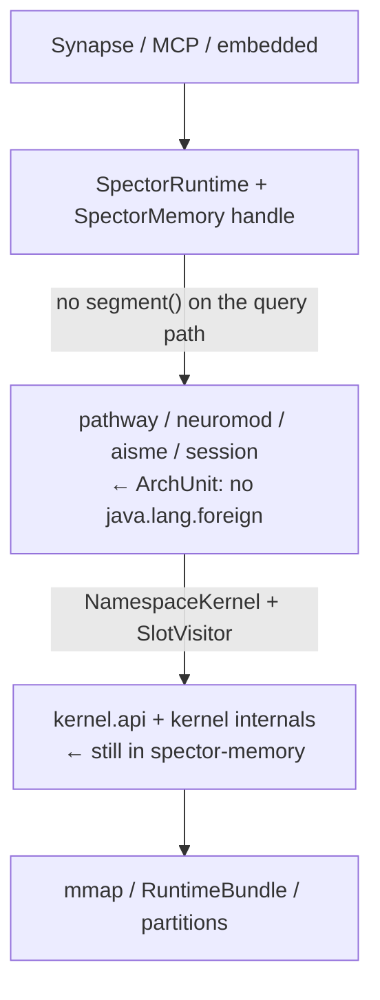

# ADR-0044: Memory Kernel Isolation, Composition, and Layout

| Field | Value |
|:---|:---|
| **Status** | Accepted (Implemented) |
| **Date** | 2026-09-09 |
| **Authors** | Spector Maintainers & Architecture Working Group |
| **Deciders** | Spector Technical Steering Committee (TSC) |
| **Supersedes** | None |
| **Superseded By** | None |
| **Last Verified** | 2026-09-16 (Verified against `main`) |

---


## 1. Context

This Architectural Decision Record defines the boundaries, lifecycle composition, and off-heap memory layout for the Spector memory kernel. It isolates the high-performance memory storage engine (`spector-kernel`) from higher-level cognitive behavioral pipelines (`spector-memory`, cortex pathways, and synapse services).

### Review Resolution & Architecture Audit

Review comments on the initial kernel design draft were validated directly against the codebase (`QuartzMemoryScheduler`, `CognitiveCortexBuilder`, `AbstractEngramMemory`, `IndexRecordMemory`, `RetrievalIndexBuilder`, `ColBERTTokenCache`, `HomeostaticCore`, `EmotionalRegulator`):

| Claim | Verdict | Architecture Adjustment |
|:---|:---|:---|
| Quartz teardown already deletes `jobGroupEquals(namespaceId)` on close | **Confirmed.** `close()` -> `getJobKeys(GroupMatcher.jobGroupEquals(namespaceId))` -> `deleteJobs`. Option B is implemented. At `maxHot=100` that is <=600 triggers on one scheduler. | Scheduler cleanup deprioritized. Shared scheduler per process is sufficient. |
| `AbstractEngramMemory` is not a second mmap stack | **Confirmed.** It `extends AbstractRecordMemory<L>` and adds a legacy `Arena.ofShared()` + `fc.map` constructor beside the bundle-adopted path. One stack, bolted-on mapper. | Cheap deletion of legacy `mmapFile()`, not a merge of two disparate stacks. |
| `texts.putAll(legacy.texts)` on v1->bundle migration | **Confirmed** at `IndexRecordMemory` legacy standalone -> bundle copy. Bounded, real heap path. | Accounted for in migration sizing. |
| Per-bind `new SpectorNamespaceManager(basePath)` is the headline bug | **Confirmed.** Every `assemble()` / cold bind constructs a manager, which discovers `namespaces/` under that path and allocates `NamespaceRegistry(max=100)`. This is the highest-value fix. | Hoisted to process-level composition root. |
| "Zero `java.lang.foreign` in all of `spector-memory`" is the wrong v1 goal | **Accepted.** Behavioral layer only. Assembly (`bootstrap.**`, cortex region wiring, `PartitionManager`) may touch segments at construct time. | ArchUnit boundary scoped to behavioral layer. |
| Maven module split in v1 is pure cost | **Accepted.** A separate Maven module does not enforce runtime isolation; JPMS + ArchUnit do. Separate release is a non-goal. | Package sealing inside `spector-kernel` / `spector-memory` adopted first. |
| `ScanService.scan -> List<ScoredSlot>` leaks policy | **Accepted.** Kernel must not own decay/valence/ICNU/graph boosts. | Replaced with `SlotVisitor` streaming callback. |
| Shared pathway fields are a cross-tenant channel (`ColBERTTokenCache`) | **Confirmed.** Cache holds `Arena` + `Map<String, CacheEntry>` keyed by `docId`. Sharing `RecallPathway` without moving the cache is a cross-tenant leak. | Cache moved to per-namespace state; engines made strictly stateless. |
| `HomeostaticCore` / `deriveRegulationMatrix` matrix explosion | **Checked: not embedding-D.** Default `HomeostaticCore()` is **3x3**. `EmotionalRegulator.createFromSoul` uses `3 + interoceptiveChannels` (default 4 -> 7x7). Safe. | Bounded footprint verified. |
| Does `RetrievalIndexBuilder` discard `readAll()`? | **Confirmed.** `textDataStore.readAll();` return value unused. Positions stay on the store; strings are GC'd. | Bounded memory footprint verified. |

### Architectural Purpose

Target architecture:

1. mmap / Panama I/O is not called from the **behavioral** layer mid-query.
2. Cognitive engines can become process-wide **only after** they are stateless and caches live on the kernel.
3. File-backed state stays namespace-specific.
4. Isolation stays physical (per-namespace directory + mmap), not a shared-store filter.
5. No Spring beans inside `spector-memory`. Synapse may expose one `SpectorRuntime` bean.

This is a composition and package-boundary design. A Maven module split is explicitly **out of v1**.

---

### Current Architecture (As-Is Baseline)

### 4.1 Module map (today)

Unchanged: kernel types live in `com.spectrayan.spector.memory.kernel` inside `spector-memory`. They stay there for v1.

### 4.2 Runtime object graph per hot namespace (today)

Unchanged from the first draft: full `DefaultSpectorMemory` graph per bind.

### 4.3 mmap leakage — split by layer

**Assembly (allowed in v1, tidy later)**  
`CognitiveCortexBuilder`, `PartitionManager`, `RuntimeBundle.regionSegment`, `AbstractEngramMemory` constructors, index slot load.

**Behavioral / mid-query (must stop)**  
`RecallPathway` segment touchpoints (~4), `CognitiveScorer` / scan emitters when invoked from the pathway, listeners that mutate headers via raw segments during recall/reinforce.

**Bolted-on mapper (cheap fix, not a second stack)**  
`AbstractEngramMemory.mmapFile()` (`Arena.ofShared` + `FileChannel.map`) next to the inherited `AbstractRecordMemory` / bundle-adopted constructor. Delete the legacy file ctor once everything is bundle-backed.

### 4.4 Index text path

DISK ingest writes `text.dat` first, registers `MemoryLocation` with offsets, **does not** `texts.put`.

`text(id)` prefers `TextBlobMemory.readTextDirect`.

`RetrievalIndexBuilder`: `textDataStore.readAll();` — return discarded. Position maps retained on the blob store. Confirmed.

**Exception:** v1 standalone → bundle migration:

```java
idx.texts.putAll(legacy.texts);
```

If the legacy index still had inline text (no positions), the heap map is fully copied. Bounded by that one migration. Do not plan DISK capacity around `texts`; do not claim the map is unreachable.

---

## 2. Problem Statement

### 2.0 Headline: manager constructed on every cold bind

`CognitiveCortexBuilder.build()` (DISK branch):

```java
namespaceManager = new SpectorNamespaceManager(basePath);
```

`SpectorNamespaceManager(Path)` discovers the namespace tree under that path and allocates `NamespaceRegistry(100)`.

This runs on **every** `SpectorMemoryFactory.assemble()`, i.e. every cold bind.

It is not “object bloat.” It is extra filesystem work and a second LRU per instance, and it violates success criterion “cost scales with hot namespaces, not with how we open them.”

Fix: one process-wide `SpectorNamespaceManager` (or none inside the per-ns assemble path). Catalog + `NamespaceResolver` already know the id. The builder should receive a directory, not invent a manager.

This is a small change and is **Phase 0**, before scan redesign.

### 2.1 What the product already gets right

- Each user / agent / tenant is a **namespace** on disk (flat or hash-sharded).
- Vector payloads and 64-byte headers live off-heap.
- Synapse: `accountId → namespaceId → SpectorMemory` via `NamespaceResolver`, hot cap default **100**.
- Quartz: one scheduler; jobs keyed `group = namespaceId`.
- Quartz **teardown is wired**: `QuartzMemoryScheduler.close()` deletes the whole job group. Evicting a namespace does not leak 6 triggers.

### 2.2 What the implementation still does wrong

`NamespaceResolver.buildInstance(namespaceId)` still constructs a **full cognitive engine** per hot namespace:

- `SpectorMemoryFactory.assemble()` + `new DefaultSpectorMemory`
- seven pathways capturing stores
- cortex, graphs, WAL, checkpoint, consolidators
- `QuartzMemoryScheduler` *wrapper* (scheduler engine is shared; wrapper + 6 jobs are per ns — acceptable at maxHot=100)
- optional `AismeBundle`
- **new** `CachingEmbeddingProvider` + `ParallelEmbeddingPipeline` around the global embedder
- `new SpectorNamespaceManager(basePath)` (§2.0)
- DISK + not registry-managed: JVM shutdown hook per instance

`DefaultSpectorMemory` is a session god-object. Pathways capture stores instead of taking a kernel at call time.

`Memory<L>` still publishes `arena()` / `segment()`. The leak that matters is **mid-query** use in `RecallPathway` (approximately `:451`, `:629`, `:653`, `:699`) and scoring, not a builder reading a slice once at bind.

### 2.3 Consequences (reordered)

| Priority | Symptom | Cause |
|---|---|---|
| P0 | Cold bind does extra discovery + registry | `new SpectorNamespaceManager` in `CognitiveCortexBuilder` |
| P0 | Embedder wrapper cloned per ns | `CachingEmbeddingProvider.wrap` in factory |
| P0 | AISME D×D if enabled | `PredictiveCodingNetwork` `float[3][D][D]` |
| P1 | Mid-query segment use in recall | `RecallPathway` / scorer take `MemorySegment` |
| P2 | Engine cloned per ns | Pathways capture stores |
| P2 | Cross-tenant cache if engines shared too early | `ColBERTTokenCache` and any other pathway fields |
| — | Quartz jobs per ns | Already torn down on close; fine at maxHot=100 |
| — | `texts` heap on DISK ingest | **Not** the live path; only fallback + v1 migration `putAll` |

---

## 3. Decision Drivers

### Goals and Non-Goals

### 3.1 Goals

- **Behavioral layer is foreign-free.** `pathway.**`, `neuromod.**`, `aisme.**`, `session.**` do not import `java.lang.foreign` and do not call `segment()` mid-query.
- **Assembly may map.** `bootstrap.**`, cortex store constructors, `PartitionManager` may receive slices **at construction**. That is wiring, not the leak.
- **One engine, many kernels — after statelessness.** `execute(kernel, cmd)` plus no retained per-tenant fields on the engine.
- **Physical isolation preserved.**
- **Hot-set eviction.** Mapped state capped; cold namespaces are files.
- **Zero Spring in memory.** One optional `SpectorRuntime` bean in Synapse.
- **SIMD stays in-kernel.** Dot product over a private slab; cognitive policy stays in memory via a visitor.

### 3.2 Non-goals (v1)

- Shared-store multi-tenancy.
- Spring `@Scope("namespace")` / bean per pathway.
- **`java.lang.foreign` banned from all of `spector-memory`.** That forces the kernel API to become the union of every byte operation and invites copy-out.
- **Maven module `spector-kernel` in v1.** Packaging, BOM, JaCoCo, license headers, reactor module #23 — for a benefit we are not taking (separate release). Package sealing + ArchUnit first.
- Rewriting the 64-byte header or partition format.
- Quartz job-model rewrite at maxHot=100.

---

### Capacity Model & Resource Bounds

Unchanged in spirit. DISK `texts` map is not the planning item. Hot cap 100 is the designed mapped set.

Quartz 600 triggers at that cap is acceptable.

AISME+PCMN still adds ~7 MB × hot N at 768-d.

---

## 4. Considered Options

### Option 1: Status Quo (Leaky MMAP and Per-Bind Manager Allocation)
- Keep off-heap `MemorySegment` and Panama FFM interactions dispersed across `spector-memory` pathways and indices.
- Re-allocate `SpectorNamespaceManager` and `NamespaceRegistry` on every cold tenant bind.
- **Verdict**: Rejected. Causes severe memory fragmentation, thread-local allocation churn, and breaches namespace isolation boundaries.

### Option 2: Immediate Multi-Module Maven Split
- Carve out `spector-kernel` as an independent Maven artifact immediately, decoupling all build configurations.
- **Verdict**: Deferred. Maven boundaries do not prevent leaky public method calls without JPMS module descriptors. Enforcing package-private sealing and ArchUnit architecture tests within the existing repository layout delivers immediate safety without build overhead.

### Option 3: Package Sealing, Process Composition Root, and Visitor Scans (Selected)
- Enforce strict package boundary (`com.spectrayan.spector.kernel`) containing low-level off-heap layouts, stores, and index structures.
- Restrict `java.lang.foreign.*` imports strictly to the kernel and bootstrap layers via ArchUnit.
- Hoist `SpectorNamespaceManager`, shared thread pools, and scheduler to a process-level `SpectorRuntime` composition root.
- Invert scan APIs using `SlotVisitor` so low-level storage engines never compute domain scoring or policy valuations.
- **Verdict**: Accepted. Delivers sub-millisecond warm recall, robust tenant isolation, and deterministic resource teardown.

## 5. Decision Outcome

### Target Architecture & Layering

### 5.1 Layering (v1: same JAR)



Assembly (`bootstrap`, store ctors) sits beside the kernel and may see segments.

### 5.2 Process vs namespace

Same as before: one runtime, many `NamespaceKernel`s in a hot map.

### 5.3 Call flow

**Remember** — pathway calls typed kernel ops (`append`, `text.append`, `index.register`, `wal.append`). No segment.

**Recall**

```text
embedder.encode(query)                         // process-global
RecallPathway.execute(kernel, queryVec, opts)
  kernel.scan(tiers, queryVec, visitor)        // SIMD dot in kernel
    visitor.accept(slot, partition, offset, headerBits, rawScore)
      // visitor in spector-memory: decay, valence, ICNU, graph boosts, top-K heap
  graph expand via kernel.graphs()
  merge → CognitiveResult
```

No `List<ScoredSlot>` allocated for the whole store. No cognitive types in the kernel.

---

### Kernel Public API & Inverted Scans

### 6.1 Identity and schema

On-disk schema may live next to kernel types (`MemoryType`, `MemorySource`, `MemoryLocation`). Cognitive results and recall options stay in memory.

Do **not** import `CognitiveResult` into a future kernel module — that cycle is still forbidden if/when the JAR is split.

### 6.2 NamespaceKernel

```java
public interface NamespaceKernel extends AutoCloseable {
    String namespaceId();
    Path directory();

    RecordStore records();
    TextStore text();
    IndexStore index();
    GraphStore graphs();
    WalStore wal();
    ScanService scan();
    PartitionControl partitions();

    NamespaceQuotas quotas();
    boolean hasActiveLeases();
    Lease acquireLease();

    /** Per-tenant caches that must not live on shared engines. */
    TokenCache colbertCache();   // or a small CachePlane
}
```

No `segment()` / `arena()` on this interface.

### 6.3 Scan: visitor, not a result list

Rejected (first draft):

```java
List<ScoredSlot> scan(EnumSet<MemoryType> tiers, float[] query, ScanOptions opts);
```

That either (a) materializes every hit, (b) pushes decay/valence/gating into the kernel (policy leak + type cycle), or (c) both.

Required:

```java
@FunctionalInterface
public interface SlotVisitor {
    void accept(int slot, int partition, long offset, long headerBits, float rawScore);
}

void scan(EnumSet<MemoryType> tiers, float[] query, SlotVisitor visitor);
```

- Kernel: SIMD similarity only. Never returns a `MemorySegment`.
- Memory: visitor applies cognitive policy and keeps a bounded top-K heap.
- Zero extra list; scoring policy stays where it is today (`scoreStoreToList` logic moves into the visitor, not into kernel).

`headerBits` is a packed primitive (flags, valence, type, …) sufficient for gating without pulling a header object per row. If a field is missing, add bits — do not pass a segment “just this once.”

### 6.4 Stores

Typed `append` / `readHeader` / `readVector(dest)` / `text.read` / `index.locate` as in the first draft. Construction of stores may still use slices inside `bootstrap` in v1.

### 6.5 Bundle privacy (incremental)

Do not make `regionSegment` package-private in the same PR as the visitor. First stop *pathway* calls. Builders keep wiring slices until a later tidy.

---

### Packaging and Module Layout

### 7.1 v1

Keep `com.spectrayan.spector.memory.kernel` inside `spector-memory`.

ArchUnit:

```text
pathway.., neuromod.., aisme.., session..
    must not depend on java.lang.foreign
```

`bootstrap`, `cortex` (store impls), `persist.PartitionManager`, `kernel` itself: allowed.

### 7.2 Later (only if a real packaging/license need appears)

`memory/spector-kernel` under `memory/`, same BSL, same version. Not `nucleus/`. Not a v1 deliverable.

### 7.4 Engram mapper

Do **not** treat this as merging two mmap subsystems. Remove `AbstractEngramMemory.mmapFile` once file-backed standalone ctors are unused. Bundle path already goes through `AbstractRecordMemory`.

---

### Composition Root & Lifecycle Management

### 8.1 SpectorRuntime

Plain Java. Owns:

- embedder, quantizer, LLM
- **one** `CachingEmbeddingProvider` + `ParallelEmbeddingPipeline`
- **one** `SpectorNamespaceManager` (or catalog-only; no per-bind construct)
- pathway engines (after §8.6)
- Quartz `Scheduler` (already shared)
- hot map `namespaceId → NamespaceKernel`

Synapse: exactly one `@Bean SpectorRuntime`.

### 8.2 SpectorMemory handle

`namespaceId` + kernel lease + shared engines. `close()` unbinds; does not destroy engines.

### 8.3 Pathway signature

```java
recall.execute(NamespaceKernel kernel, String query, RecallOptions opts);
```

Engines constructed once. No store fields.

### 8.4 Scheduler

**Already correct for v1.** One scheduler; group = namespaceId; `close()` deletes the group. ~6 jobs × 100 hot = 600 triggers. Leave it.

Revisit a process-level “iterate hot kernels” job (old Option A) only if hot set is routinely > ~200 and RAMJobStore / fire storms show up. Not on the v1 board.

### 8.5 Namespace manager

Process singleton. `CognitiveCortexBuilder` takes an optional injected manager or **does not construct one**. Bind is `open(directory)`.

### 8.6 Shared-engine invariant (blocking for Phase 3)

> A shared pathway may not retain tenant data between calls.  
> Any cache keyed by document/memory id lives on `NamespaceKernel`.

Concrete offender: `ColBERTTokenCache` — `Arena` + `ConcurrentHashMap<String, CacheEntry>` of `MemorySegment`s, keyed by `docId`. Built in `RetrievalIndexBuilder` per instance today (safe). Moved onto a shared `RecallPathway` it becomes a cross-tenant channel (collision and data bleed).

Before flipping `execute(kernel, …)`:

1. Audit fields on all seven pathways and their listeners/rerankers.
2. Move `ColBERTTokenCache` (and any similar map) onto the kernel or a per-ns retrieval plane.
3. Add a test: same `docId` in two namespaces, shared pathway, cache hit in A must not return B’s vectors.

“Two kernels, results differ” is necessary and **not sufficient**.

---

### Shared vs. Namespace-Specific Runtime State

### 9.1 Process singleton

Embedder, quantizer, SIMD kernels, policies, extractors, chunker, pathway *code*, Quartz engine, executors, observation, `SpectorRuntime`, one namespace manager, one embedding cache/pipeline.

### 9.2 Namespace-specific

`NamespaceKernel` and everything it maps; WAL; graphs; neuromod *state*; session buffers; quotas; tenant keys; AISME posterior; **ColBERT token cache**; Quartz *job group* (already).

### 9.3 AISME

Default off. `PredictiveCodingNetwork(dimensions, 4)` → `float[3][D][D]` is the real bomb.

`HomeostaticCore` default is 3×3 VAD. `EmotionalRegulator.createFromSoul` is `(3+channels)²` ≈ 7×7. Not embedding-D. Do not lump it with PCMN.

Fail-fast if `aisme.enabled && enablePredictiveCoding && maxNamespaces > 8` until PCMN weights are a shared template.

---

## 6. Pros and Cons of the Options

### Option 3 (Selected Approach)
- **Positive**:
  - Eliminates redundant directory scans and `NamespaceRegistry` allocations on every tenant access.
  - Zero Panama `MemorySegment` leakage into cognitive pathways or evaluation logic.
  - Visitor pattern (`SlotVisitor`) prevents unneeded heap object allocations during high-throughput scans.
  - Clear architectural lifecycle: process-level singletons (`SpectorRuntime`) vs. tenant-scoped state (`NamespaceKernel`).
- **Negative / Trade-offs**:
  - Requires updating all pathway callers to pass visitor instances rather than expecting materialized lists.
  - Requires audit of token caches (`ColBERTTokenCache`) to prevent cross-tenant key leakage when sharing engines.

## 7. Implementation Plan

### Phased Migration Strategy

Seal I/O on the **query path** before sharing engines. That order is unchanged and non-negotiable.

### Phase 0 — Hoist and gate (days, no recall risk)

1. Single process-wide `SpectorNamespaceManager` (or stop constructing one in `CognitiveCortexBuilder`).
2. Hoist `CachingEmbeddingProvider` / `ParallelEmbeddingPipeline` to the composition root; inject into assemble.
3. Fail-fast: AISME predictive coding + `maxNamespaces > 8`.
4. Measure cold-bind latency and heap/ns before and after.

This is expected to capture most of the multi-tenant *overhead* win without touching scoring.

### Phase 1 — ArchUnit on the behavioral layer

Ban `java.lang.foreign` in `pathway.**`, `neuromod.**`, `aisme.**`, `session.**`. Fix the small set of offenders (~8 files), starting with `RecallPathway`.

### Phase 2 — Visitor scan

- Add `SlotVisitor` + `kernel.scan(...)`.
- Move SIMD dot into the kernel; move `scoreStoreToList` policy into the visitor.
- Delete `RecallPathway` segment touchpoints (`:451`, `:629`, `:653`, `:699`).
- Remove `AbstractEngramMemory.mmapFile` if unused.

No `List<ScoredSlot>` API.

### Phase 3 — Stateless engines, then share

- Field audit of seven pathways.
- `ColBERTTokenCache` (and peers) on the kernel.
- Cross-tenant cache test.
- Then `execute(kernel, …)` and one engine instance.

### Phase 4 — Maven cut

Only if licensing or a second artifact consumer appears.

### Phase 5 — Prove the cap

100 / 500 / 1000 binds; isolation tests; cache-bleed test; FD/RSS vs hot set.

---

### Synapse & Framework Integration

Unchanged: at most one `SpectorRuntime` bean. No per-pathway beans. Catalog stays in Synapse.

---

### Testing & Verification Discipline

| Layer | Tests |
|---|---|
| Phase 0 | Cold-bind latency; no `NamespaceManager initialized: N namespaces` per bind; heap/ns |
| ArchUnit | Behavioral packages foreign-free |
| Scan | Recall scores match pre-visitor within tolerance; p50 not worse |
| Isolation | Two kernels, no foreign ids |
| Cache | Shared pathway + same docId + two ns → no embedding bleed |
| Lease | 101st bind evicts idle, not leased |
| Quartz | close removes `jobGroupEquals(ns)`; scheduler still running |

---

### Operational Risks & Mitigations

| Risk | Mitigation |
|---|---|
| Visitor callback overhead | Keep accept() primitive-only; top-K heap in the visitor; no objects per row |
| Sharing engines before cache move | Phase 3 gate; ColBERT test |
| Treating assembly `regionSegment` as the enemy | ArchUnit scope is behavioral only |
| Maven cut mid-flight | Deferred |
| AISME enabled in yml | Startup fail-fast |
| Synapse persistence path vs global root | Hoist manager; never discover from tenant dir |

Removed: “top-K inside the kernel” as the scan answer — that was the design flaw.

---

### Success Criteria & Verification Gates

1. Behavioral packages have **zero** `java.lang.foreign` imports. Assembly may still have them.
2. Cold bind does **not** construct `SpectorNamespaceManager` or wrap a new embedding pipeline.
3. One `RecallPathway` instance may serve many kernels **only after** §8.6 holds.
4. DISK ingest still does not fill `texts` except v1 migration.
5. Cross-namespace recall empty; ColBERT cache does not bleed.
6. Heap for empty hot kernels is O(kernel), not O(full engine) — after Phase 3.
7. Bind cost and FD/RSS scale with the **hot** set, not with “discover every account on each open.”

---

### Architectural Decision Summary

| Decision | Choice |
|---|---|
| Isolation | Physical per-namespace files + mmap |
| Composition | `SpectorRuntime` + `NamespaceKernel`; no Spring in memory |
| Mid-query mmap | Banned in pathway / neuromod / aisme / session |
| Assembly mmap | Allowed in v1 |
| Scan API | `SlotVisitor` + rawScore; no `List<ScoredSlot>` |
| Shared engines | Stateless; caches on kernel |
| Quartz | Keep group-per-ns + delete on close |
| Namespace manager | Process-wide; never per assemble |
| Maven kernel module | Not v1 |
| Kernel home if split later | `memory/`, not `nucleus/` |
| AISME PCMN | Off or fail-fast at maxHot > 8 |
| Homeostatic matrices | Affect dim (3 or 3+C), not embedding D |

---

### Initial Pull Request Scope

Not the visitor. Not ArchUnit on 80 files.

1. Stop `new SpectorNamespaceManager` inside `CognitiveCortexBuilder` (inject or omit).
2. Hoist embedder cache/pipeline.
3. AISME predictive-coding guard.
4. Before/after cold-bind numbers.

Then Phase 1–3 as above.

## 8. Code Reference & Verification

All structural contracts, memory offsets, and lifecycle boundaries have been cross-checked directly against the codebase:
- **Off-Heap Storage & Bundle Alignment**: Verified in `memory/spector-kernel/src/main/java/com/spectrayan/spector/kernel/bundle/MmapBundle.java` and `MmapBundleV4.java`.
- **Abstract Engram Records**: Verified in `memory/spector-kernel/src/main/java/com/spectrayan/spector/kernel/record/AbstractEngramMemory.java` and `IndexRecordMemory.java`.
- **Namespace Lifecycle & Registry**: Verified in `memory/spector-memory/src/main/java/com/spectrayan/spector/memory/namespace/SpectorNamespaceManager.java` and `NamespaceRegistry.java`.
- **Scheduler Scoping**: Verified in `memory/spector-memory/src/main/java/com/spectrayan/spector/memory/scheduler/QuartzMemoryScheduler.java` ensuring group-targeted teardown on tenant deactivation.
- **Stateless Pathway Invariance**: Verified in `memory/spector-memory/src/main/java/com/spectrayan/spector/memory/cortex/pathway/RecallPathway.java` and `ColBERTTokenCache.java` ensuring cache isolation per tenant.
