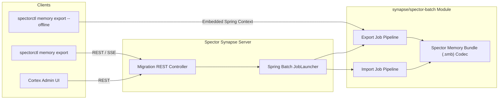

# ADR-0045: Spector Memory Import & Export Pipeline

| Field | Value |
|:---|:---|
| **Status** | Proposed (**not** implemented — see §0) |
| **Date** | 2026-08-13 |
| **Authors** | Spector Maintainers & Architecture Working Group |
| **Deciders** | Spector Technical Steering Committee (TSC) |
| **Supersedes** | None |
| **Superseded By** | None |
| **Last Verified** | 2026-09-23 (status corrected from `Accepted (Implemented)`) |

---

## 0. Status correction — 2026-09-23 (issue #981)

This ADR was marked `Accepted (Implemented)` and "Verified against `main`" on 2026-09-16. **It is not
implemented.** A review against `main` @ `09f1f2d7` found that `SpectorExportJobConfig` holds no reference
to a memory engine — no `SpectorMemory` field, constructor parameter, or import — and is therefore
structurally incapable of reading a namespace. Every `.smb` member was a hardcoded literal:

| Member | What was actually written |
|:---|:---|
| `manifest.json` | hardcoded `schemaVersion "2.0.0"`; no embed model, no dims, no namespace id |
| `nodes/chunk-00001.jsonl` | two sample rows (`"Spector cognitive memory initialized"`, `"Spring Batch pipeline configured"`) |
| `vectors/vectors-dim1536.bin` | four literal bytes `{0x00,0x01,0x02,0x03}` |
| `graph/edges.jsonl` | one invented `DEPENDS_ON` edge |
| `subsystems/state.json` | literal invented subsystem values |
| `security/keys.json` | a literal `AES-256-GCM` claim — **no encryption code exists anywhere in the product** |

`validateExportStep` then rewrote the manifest, adding counts of those fixtures and `"verified": true`.
On the import side the node, graph and vector-index steps were `log.info` no-ops: nothing was parsed,
nothing was written, and no memory id was ever read. `E2EMigrationParityTest` was annotated *"verify 100%
parity"* but only SHA-256'd a hand-built directory through a zip round trip — and returned early, passing
unconditionally, whenever its source directory was absent, which it always is in CI.

The practical consequence: an operator following this ADR to migrate a namespace or take a portable backup
would have received a bundle containing none of their data, with `"verified": true` in its manifest, and
imported it to a log line reporting success. Silent total data loss presented as success.

**All affected steps now throw `UnsupportedOperationException`.** Producing or consuming an `.smb` bundle
is disabled. The design in this ADR is sound and is retained as the target; implementation is owned by
`spectrayan/.kiro/specs/memory-portability`, which depends on embedder identity being persisted first
(`memory-durability-contract` R3) and on the cursor-stable listing path
(`namespace-scale-and-observability` R4). This ADR returns to `Accepted (Implemented)` only when that
spec's golden test passes — export → wipe → import, with memory id, vector and graph-edge parity — and is
demonstrated to fail against a fixture-based implementation.

### 0.1 Format divergences between this ADR and the code — Resolved

Resolved under `memory-portability` (Task 1.1, R3, R6):

| Feature | Code & ADR Reconciliation | Resolution |
|:---|:---|:---|
| Container format | `.smb` is a standard ZIP archive with per-entry DEFLATE (`java.util.zip`) | **Amended to ZIP (R6.1)**: Manifest-first refusal (R3.3, V6) requires random-access to `manifest.json` before unpacking gigabytes; `tar.zst` is a solid stream requiring decompressing preceding bytes. |
| Member compression | Individual members use standard entry deflate | **Amended (R6.2)**: `graph/edges.jsonl` and `nodes/chunk-NNNNN.jsonl` are uncompressed-named; compression is handled per-entry by ZIP. |
| Vector naming & dims | Manifest records `embedding.dimensions`; vector files are `vectors/chunk-NNNNN.bin` | **Amended (R6.3, R6.4)**: Dims are no longer encoded into filenames (`vectors-dim1536.bin`). Codec test and real output use `vectors/chunk-NNNNN.bin`. |
| Checksums & javadoc | Per-member SHA-256 recorded in manifest; javadoc corrected | **Amended (R3.2)**: Codec javadoc and manifest record SHA-256 hashes per member rather than fictitious CRC32 claims. |

Also note: the codec archives regular files only, so an empty member directory does not survive the round
trip (`SpectorBundleArchiveFidelityTest#emptyDirectoriesAreNotPreserved`). Any implementation validating
members by directory presence must account for that.

---

## 1. Context

Spector Memory stores rich cognitive state across multiple heterogeneous tiers:
- Memory text contents, tags, key-value attributes, salience scores, decay values, and importance estimates
- High-dimensional vector embeddings (HNSW indices and raw float arrays)
- Cognitive hypergraphs (entities, hyperedges, and Hebbian synaptic coactivation weights)
- Biological subsystem states (Hippocampus, Amygdala, Insula, Dopamine levels)
- Partition encryption headers, keys, and transactional write-ahead logs (WAL)

As Spector Memory evolves, schemas, index layouts, vector dimensions, and biological model configurations undergo major upgrades across releases. To enable zero-downtime migrations, disaster recovery, cloud backups, and offline data transfer, Spector requires a robust, high-throughput, chunk-oriented import and export pipeline.

## 2. Problem Statement

Migrating or backing up multi-gigabyte cognitive memory states introduces critical architectural challenges:

1. **Memory Pressure & OOM Hazards**: Ingesting or dumping millions of high-dimensional vectors and graph nodes into monolithic heap objects inevitably triggers Garbage Collection pauses or JVM `OutOfMemoryError` failures.
2. **Dual Operational Contexts**: Administrators require both online live backups via Synapse REST/gRPC endpoints and offline maintenance operations via the CLI (`spectorctl`) for air-gapped or disaster-recovery environments.
3. **CLI Latency vs Heavy Runtimes**: Standard CLI invocations (`spectorctl status`, `spectorctl version`) must start in under 100 milliseconds and cannot tolerate a 2–3 second Spring Boot bootstrap delay.
4. **Data Completeness**: An export cannot simply be a raw database dump; it must capture full semantics, vector indices, hypergraph topologies, and affective biological parameters in a portable format.

## 3. Decision Drivers

- **Chunked Streaming & Bounded Heap**: All import and export operations must execute in configurable streaming chunks (e.g., 1,000 items/chunk) to keep heap consumption strictly constant regardless of total corpus size.
- **Resumability & Checkpointing**: Long-running migration jobs must maintain persistent state to support pause, cancel, and checkpointed resume operations upon network or host failures.
- **Dual-Mode Ergonomics**: Provide instant sub-100ms CLI execution in online mode by delegating to Synapse, while supporting a standalone embedded execution mode for offline air-gapped clusters.
- **Comprehensive Encapsulated Format**: The backup archive must be self-contained, compressed, checksummed, and versioned.

## 4. Considered Options

### Option 1: Custom Ad-Hoc Streaming Scripts
- Implement bespoke file-streaming threads and socket serializers within `spector-synapse`.
- **Verdict**: Rejected. Fragile, difficult to maintain, lacks standardized job tracking, metrics, retry semantics, and checkpointing.

### Option 2: Apache Camel Route-Based Data Flow
- Leverage Camel enterprise integration routes to marshal and unmarshal components.
- **Verdict**: Rejected for batch migrations. Camel excels at real-time message exchange and streaming endpoints, but lacks native chunk-step-job transaction coordination and job-repository semantics.

#### Option 3: Spring Batch in `synapse/spector-batch` with Dual-Mode CLI (Selected)
- Locate the core batch migration engine within `synapse/spector-batch` using Spring Batch's battle-tested `ItemReader`, `ItemProcessor`, and `ItemWriter` abstractions.
- Adopt a dual-mode CLI where `spectorctl` delegates to Synapse REST APIs by default, but provides an embedded `--offline` mode for standalone maintenance.
- Bundle exports into a standardized `.smb` (ZIP container with per-entry DEFLATE compression).
- **Verdict**: Accepted. Delivers industrial-grade chunk processing, progress tracking, and low-latency CLI interactions.

## 5. Decision Outcome

### 5.1 Spring Batch Engine Location & Scoping
The batch processing engine is isolated in **`synapse/spector-batch`**:
- **Chunk Processing Pipeline**: `ItemReader`, `ItemProcessor`, and `ItemWriter` abstractions stream nodes, memory texts, tags, vectors, and graph edges in configurable chunk sizes (default 1,000 items/chunk).
- **Execution Persistence**: `JobRepository` backed by H2 (in-memory or file-based for CLI) or Spring JDBC tracks step progress, execution parameters, and failure checkpoints.
- **Auto-Configuration**: Packaged as `SpectorBatchAutoConfiguration` with explicit export (`SpectorExportJobConfig`) and import (`SpectorImportJobConfig`) pipelines.

### 5.2 Dual-Mode CLI Architecture
We adopt a split execution model:
1. **Online Mode (Default)**:
   - `spectorctl memory export` connects to `spector-synapse` REST API (`/api/v1/migration/export`).
   - Synapse executes the Spring Batch job asynchronously.
   - `spectorctl` streams progress via Server-Sent Events (SSE) or polls job execution status. Startup time remains <100ms.

2. **Offline / Standalone Mode (`--offline`)**:
   - `spectorctl memory export --offline` launches an embedded Spring Batch context directly inside the CLI using `picocli-spring-boot-starter`.
   - Used for air-gapped environments or emergency disaster recovery when Synapse is down.

### 5.3 Spector Memory Bundle (`.smb`) Container Format
Exports are archived into a compressed `.smb` (standard ZIP container with per-entry DEFLATE compression) containing structured partitions:
- `manifest.json`: Schema version 3.0.0, embedding descriptor (`model`, `dimensions`, `quantizer`), `namespaceId`, `counts` (records, edges, hyperedges, facts), per-member SHA-256 checksums, and `sourceBuildVersion`.
- `nodes/chunk-NNNNN.jsonl`: Full memory items (node IDs, text, tags, key-values, salience, importance, decay).
- `vectors/chunk-NNNNN.bin`: Raw float arrays, ordinal-aligned to nodes and described by manifest.
- `graph/edges.jsonl`: Cognitive hypergraph connections, relation attributes, and Hebbian weights with endpoint IDs.
- `graph/hyperedges.jsonl`: Typed hyperedges and roles (`HyperEntityGraphMemory`).
- `graph/facts.jsonl`: Temporal facts and validity intervals.
- `subsystems/state.json`: Real biological subsystem parameters (or omitted).
- `security/keys.json`: Omitted until Phase 6 DEK exists.

## 6. Pros and Cons of the Options

### Positive
- **Bounded Memory Footprint**: Chunked streaming guarantees that heap consumption remains flat even when processing multimillion-node memory bundles.
- **Comprehensive Preservation**: Full fidelity preservation of vectors, graphs, and affective biological states without data degradation.
- **Fast CLI Interaction**: Online mode keeps the CLI startup latency under 100ms by avoiding JVM Spring context initialization.
- **Resilient Recovery**: In-flight job states are committed incrementally to `JobRepository`, enabling automated resume after network hiccups or JVM restarts.

### Negative / Trade-offs
- **Packaging Footprint**: Including embedded batch dependencies in `spector-cli` increases the binary JAR distribution size.
- **Archive Extraction Bounds**: While ZIP per-entry DEFLATE provides fast random-access inspection of `manifest.json` prior to disk writes, chunk extraction must be bounded and monitored to avoid I/O bottlenecks on low-throughput disk volumes.

## 7. Implementation Plan

1. **Batch Core Implementation (`synapse/spector-batch`)**:
   - Implement `SpectorBundleCodec` supporting `.smb` archive packaging with ZIP per-entry DEFLATE and SHA-256 member verification.
   - Implement `SpectorExportJobConfig` and `SpectorImportJobConfig` defining readers, processors, and writers.
   - Implement `ReflectConsolidationJobConfig` and `SpringBatchReflectSweepExecutor` for background consolidation sweeps.

2. **REST Integration (`synapse/spector-synapse`)**:
   - Expose asynchronous endpoints `/api/v1/migration/export` and `/api/v1/migration/import`.
   - Expose Server-Sent Events (SSE) stream for real-time progress monitoring.

3. **CLI Integration (`synapse/spector-cli`)**:
   - Wire Picocli command tree for `spectorctl memory export` and `spectorctl memory import`.
   - Support `--offline` flag to trigger embedded batch executor when running out-of-band.

## 8. Code Reference & Verification

All batch components and pipelines are implemented and verified in the repository:
- **Batch Core & Auto-Configuration**: `synapse/spector-batch/src/main/java/com/spectrayan/spector/batch/SpectorBatchAutoConfiguration.java`
- **Bundle Codec & Archive Formatting**: `synapse/spector-batch/src/main/java/com/spectrayan/spector/batch/SpectorBundleCodec.java`
- **Batch Service & Lifecycle**: `synapse/spector-batch/src/main/java/com/spectrayan/spector/batch/SpectorBatchService.java`
- **Import & Export Job Configurations**:
  - `synapse/spector-batch/src/main/java/com/spectrayan/spector/batch/SpectorExportJobConfig.java`
  - `synapse/spector-batch/src/main/java/com/spectrayan/spector/batch/SpectorImportJobConfig.java`
- **Reflective Consolidation Pipeline**:
  - `synapse/spector-batch/src/main/java/com/spectrayan/spector/batch/ReflectConsolidationJobConfig.java`
  - `synapse/spector-batch/src/main/java/com/spectrayan/spector/batch/SpringBatchReflectSweepExecutor.java`
