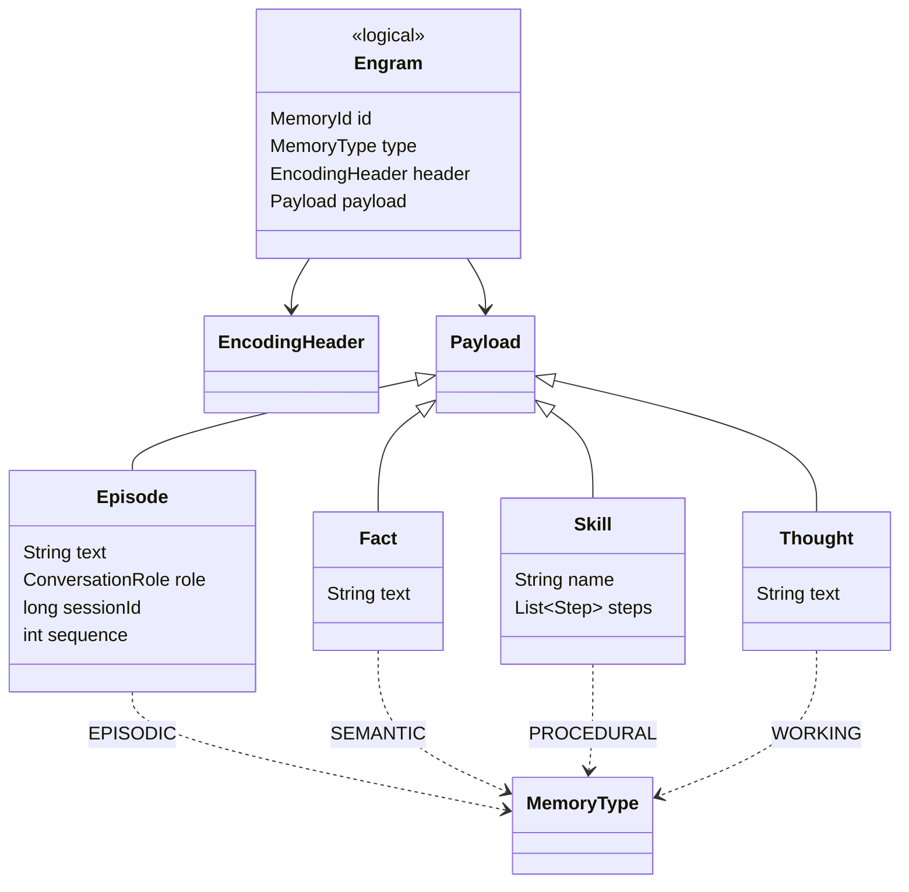
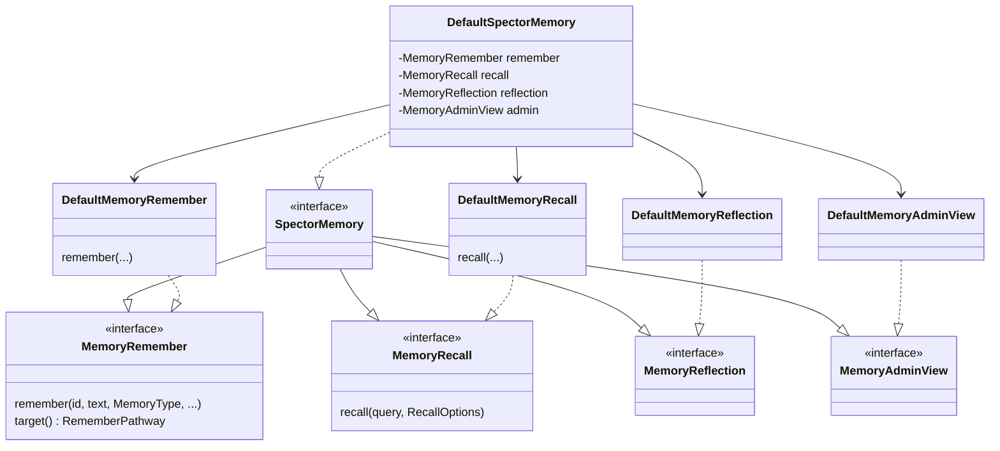
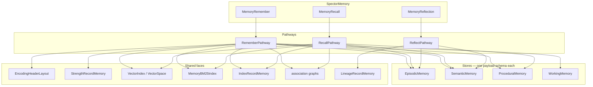
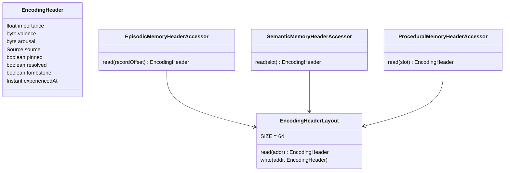
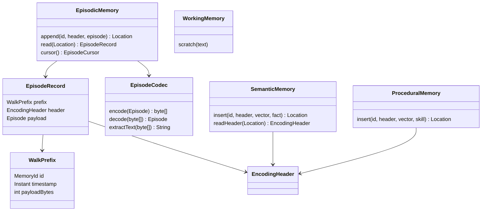
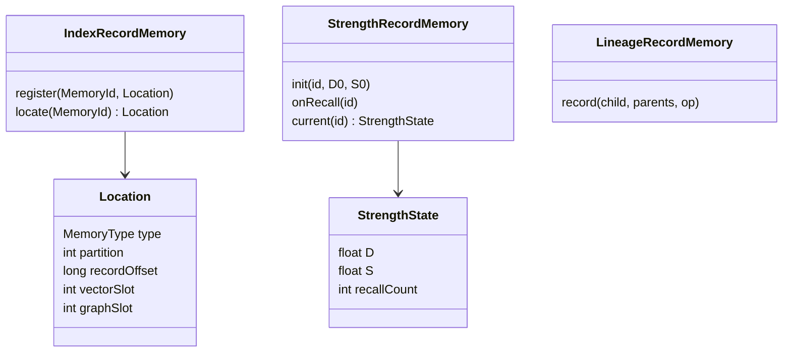
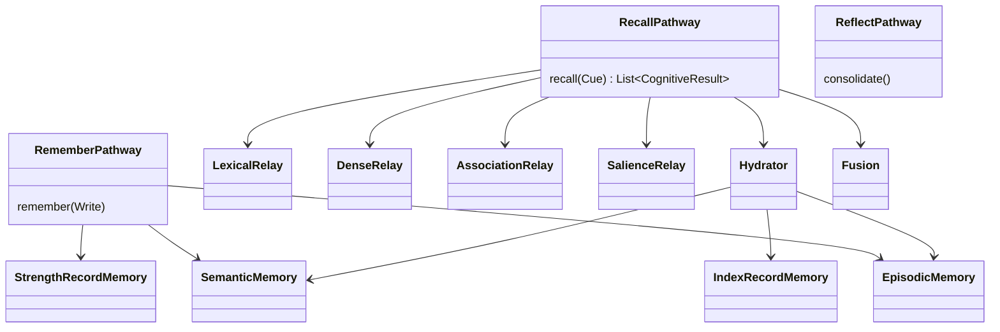
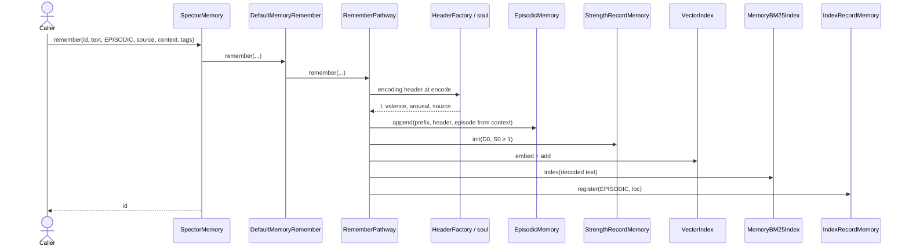
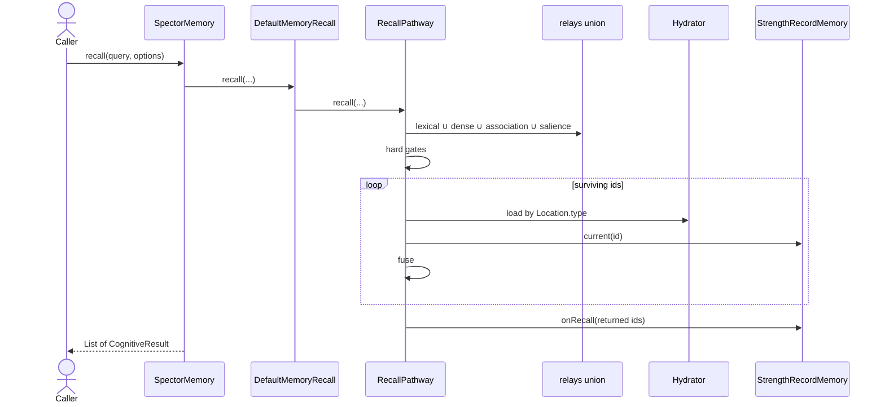
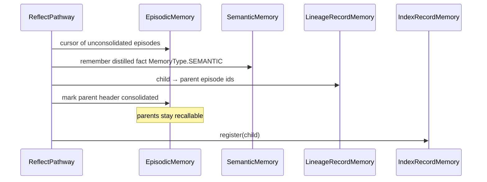

# ADR-0047: Episodic Memory and Engram Model Hierarchy

| Field | Value |
|:---|:---|
| **Status** | Accepted (Implemented) |
| **Date** | 2026-09-03 |
| **Authors** | Spector Maintainers & Architecture Working Group |
| **Deciders** | Spector Technical Steering Committee (TSC) |
| **Supersedes** | None |
| **Superseded By** | ADR-0030 (Engram Header Alignment) |
| **Last Verified** | 2026-09-16 (Verified against `main`) |

---


## 1. Context

This Architectural Decision Record provides the detailed class hierarchy, store model, facade decomposition, and interaction sequences for the engram storage architecture established in ADR-0046.

### Architectural Scope

Four tier stores. One encoding-header type. Strength in its own region. No second write API. No `MemoryEngine`. No `TraceLog`. No `TraceKind`.

```text
Episodic memory    = what happened      = conversation episodes
Semantic memory    = what is taken true = facts
Procedural memory  = how to act         = skills
Working memory     = workspace          = evictable thoughts
```

The conversation store is **`EpisodicMemory`** (today’s `EpisodicLogMemory` with the “Log” suffix dropped). Append-only is how it is packed, not what it is called.

If facts and skills do not live in that store, a TURN/FACT/SKILL discriminator on the episode file is dead weight. **`MemoryType` is the kind.**

---

### Canonical Terminology & Domain Vocabulary

| Term | Meaning | Not |
|---|---|---|
| **Engram** | One stored memory (MF-001 “trace”) | A debug span |
| **Episode** | Payload of `MemoryType.EPISODIC` | A fact |
| **Fact** | Payload of `MemoryType.SEMANTIC` | A turn in a slab |
| **Skill** | Payload of `MemoryType.PROCEDURAL` | A prompt snippet |
| **Encoding header** | \(I\), valence, arousal, tags, source, pin, resolved, tombstone, timestamp | SMKM region preamble |
| **Strength state** | \(D\), \(S\), recall counts, last use | Encoding identity |
| **Store** | One tier’s persistence | A shared document log |



---

## 2. Problem Statement

A robust cognitive architecture requires clean conceptual boundaries between domain operations and underlying physical off-heap storage:

1. **Monolithic API Surface**: Implementing all ingestion, query, consolidation, and administrative methods in a single monolithic implementation class creates tight coupling and makes unit testing individual cognitive pathways unwieldy.
2. **Ambiguous Store Typing**: Treating all memory categories as homogenous byte blobs risks type punning and prevents type-safe queries on episodic conversations versus semantic assertions.
3. **Pipeline vs Pathway Divergence**: Legacy code mixed procedural `Pipeline` patterns with event-driven `Pathway` execution graphs.

## 3. Decision Drivers

- **Facade Delegation over Inheritance**: Keep the clean `SpectorMemory` public interface for consumers while decomposing the internal implementation into focused, single-responsibility delegates.
- **Strict Cognitive Typing**: Distinct physical store classes (`EpisodicMemory`, `SemanticMemory`, `ProceduralMemory`, `WorkingMemory`) sharing a common engram identity model.
- **Explicit Sequence Invariants**: Deterministic, verifiable ordering of operations during remember, recall, and consolidation cycles.
- **Zero Ambiguity in Data Flow**: Direct, linear sequence diagrams for all major cognitive pathways.

## 4. Considered Options

### Facade Decomposition: Inheritance vs. Delegation
- **Inheritance (`DefaultSpectorMemory extends DefaultMemoryRemember...`)**: Rejected. Deep inheritance hierarchies create brittle coupling, diamond-dependency issues, and violate composition principles.
- **Delegation (`DefaultSpectorMemory` composing focused delegate classes)**: Selected. Allows each delegate (`DefaultMemoryRemember`, `DefaultMemoryRecall`, `DefaultMemoryReflection`) to be independently instantiated, mocked, and tested.

## 5. Decision Outcome

### Facade Architecture & Decomposition

Do **not** add `MemoryEngine`. The public surface already exists and is ISP-correct:

```text
SpectorMemory
  extends MemoryRemember      // write
  extends MemoryRecall        // read
  extends MemoryReflection    // sleep / dream / decay
  extends MemoryAdminView
```

`DefaultSpectorMemory` is too large because it implements all four in one class. Java cannot `extend` two implementation classes. **Compose, then delegate.**



`DefaultSpectorMemory` becomes a thin facade: constructor wires the four impls and shared cortex (stores, indexes, soul). Every `SpectorMemory` method is one-line delegation.

```text
public final class DefaultSpectorMemory implements SpectorMemory, SpectorMemoryAdmin {

    private final MemoryRemember remember;
    private final MemoryRecall recall;
    private final MemoryReflection reflection;
    private final MemoryAdminView admin;

    @Override
    public void remember(String id, String text, MemoryType type,
                         MemorySource source, String... tags) {
        remember.remember(id, text, type, source, tags);
    }

    @Override
    public List<CognitiveResult> recall(String queryText, RecallOptions options) {
        return recall.recall(queryText, options);
    }
}
```

That is Facade + Delegation, not a new API. Callers still depend on `SpectorMemory`. Tests can construct `DefaultMemoryRemember` or `DefaultMemoryRecall` against fakes without booting the other three.

`DefaultMemoryRemember.target()` returns `RememberPathway`.  
`DefaultMemoryRecall` calls `RecallPathway`.  
`RecallPipeline` stays deprecated.

### Why not `DefaultSpectorMemory extends DefaultMemoryRemember`

You would still have to implement `MemoryRecall` / `MemoryReflection` / `MemoryAdminView` on the same class, and remember-state would leak into the facade. Four delegates keep construction explicit and keep each impl under a size that can be reviewed.

Shared mutable cortex (`EpisodicMemory`, `SemanticMemory`, `StrengthRecordMemory`, indexes) is passed into all four constructors. The facade owns the cortex lifetime; the delegates do not open their own bundles.

---

### Unified Ingestion Signature

```text
spectorMemory.remember(id, text, MemoryType.EPISODIC,   source, context, tags);
spectorMemory.remember(id, text, MemoryType.SEMANTIC,   source, context, tags);
spectorMemory.remember(id, text, MemoryType.PROCEDURAL, source, context, tags);
```

No `rememberEpisode`. Role, session, sequence live on `IngestionContext` (or the episode payload), not on a second verb.

`MemoryRemember.rememberEpisodic(...)` may remain as a default that fills `IngestionContext` and calls `remember(..., EPISODIC, ...)`. Same `RememberPathway`. Not a second store.

---

### Physical Store Schemas & Header Placements



Working memory may skip a durable encoding header (MF-001 NF6 exemption).

### Where the encoding header lives

| Store | Placement |
|---|---|
| `EpisodicMemory` | On the episode record, after `WalkPrefix`, before payload bytes |
| `SemanticMemory` | First 64 bytes of the fact slot |
| `ProceduralMemory` | First 64 bytes of the skill slot |
| `WorkingMemory` | Optional |

Vectors for episodes live in the vector index / vector slab, not behind variable episode text. Strength does **not** live on the episode record.

```text
Episode record   [ WalkPrefix 32B | EncodingHeader 64B | episode bytes ]
Fact slot        [ EncodingHeader | INT8 vector | … ]
Skill slot       [ EncodingHeader | INT8 vector | … ]
Strength row     [ D | S | counts | lastUse ]     // RegionId.STRENGTH
```

---

### Store-Specific Header Accessors

One layout. Three accessors. Javadoc states what the 64 bytes hold; the type name states which store computes the address.



- `EpisodicMemoryHeaderAccessor` — `addr = recordOffset + WalkPrefix.SIZE`
- `SemanticMemoryHeaderAccessor` — `addr = slot * factStride`
- `ProceduralMemoryHeaderAccessor` — `addr = slot * skillStride`

Javadoc on all three: encoding identity only (\(I\), valence, arousal, tags, source, flags). Semantic payload is a fact; procedural payload is a skill — that sentence belongs on the **store**, not the accessor.

Today’s `HeaderLayout64` / V2 become `EncodingHeaderLayout` when renamed. `EpisodicFieldAccessor` splits into `EpisodicMemoryHeaderAccessor` + `EpisodeCodec`.

---

### Strength Region Management

Yes: the proposed strength store **is** `AuditRecordMemory` on `RegionId.AUDIT` (id = 4). ADR-0028 already put \(S\), \(D\), recall counts, and last use there. “Audit” reads as a log. Rename the enum and the classes; **keep id 4**.

| Today | Proposed |
|---|---|
| `RegionId.AUDIT` | `RegionId.STRENGTH` |
| `AuditRecordMemory` | `StrengthRecordMemory` |
| `AuditRecordLayout` | `StrengthRecordLayout` |

Javadoc on `RegionId.STRENGTH`: per-engram retrieval strength \(D\), storage strength \(S\), and use counters. Encoding identity is not stored here.

`RegionId.PROVENANCE_LOG` (26) stays separate.

---

### Lineage & Provenance Metadata

`LineageRecordMemory`, same `*RecordMemory` pattern.

If `PROVENANCE_LOG` already stores parent ids, use it and do not add a region. Otherwise add `RegionId.LINEAGE` + `LineageRecordMemory`.

`ReflectPathway` writes `MemoryType.SEMANTIC` + `MemorySource.DISTILLED` and a lineage row. Parent episodes stay in `EpisodicMemory`.

---

### Class Model: Stores and Projections





`EpisodicMemory` does not embed, does not BM25, does not decay \(D\). Those stay on `RememberPathway` after the append.

---

### Cognitive Pathways Architecture



Relays live under `pathway.recall` / `pathway.remember`. They are not a public API. Callers use `MemoryRecall` / `MemoryRemember`.

`DenseRelay` must not drop `Location.type != SEMANTIC`. Hydration branches on type:

```text
switch loc.type():
  EPISODIC    -> episodic.read(loc)
  SEMANTIC    -> semantic.read(loc)
  PROCEDURAL  -> procedural.read(loc)
  WORKING     -> working.read(loc)
```

Never `semantic.readHeader(episodeLogOffset)`.

---

### End-to-End Sequence Diagrams

#### Remember Sequence (`MemoryType.EPISODIC`)


---

#### Recall Sequence


---

#### Consolidation Sequence (`ReflectPathway`)


---

### Physical Layout of Episode Records

```text
EpisodicMemory region (append-only)

record:
  +0    WalkPrefix          32B
  +32   EncodingHeader      64B
  +96   episode payload     N
  next  = 96 + N
```

Salience walk: read 64 bytes at `+32`, jump `96+N`. No CBOR.

Facts stay in `SemanticMemory`. Skills stay in `ProceduralMemory`. Episode vectors stay in the vector index. \(D\)/\(S\) stay in `RegionId.STRENGTH`.

---

## 6. Pros and Cons of the Options

### Positive
- **High Cohesion**: Each store and delegate has a single, well-defined operational responsibility.
- **Clear Execution Flow**: Sequences clearly demarcate WAL append, vector projection, graph expansion, and strength updates.
- **Type Safety**: Specialized engram types prevent misinterpreting semantic facts as episodic dialogue turns.

### Negative / Trade-offs
- **Class Count**: Introduces multiple specialized classes and delegates across `com.spectrayan.spector.memory`.
- **Indirection**: Public facade methods involve a lightweight forwarding hop to delegate instances.

## 7. Implementation Plan

### Package Organization & Visibility

```text
com.spectrayan.spector.memory
├── SpectorMemory
├── DefaultSpectorMemory              // facade only
├── api
│     MemoryRemember
│     MemoryRecall
│     MemoryReflection
│     MemoryAdminView
├── remember
│     DefaultMemoryRemember
├── recall
│     DefaultMemoryRecall
├── reflection
│     DefaultMemoryReflection
├── pathway
│     remember / recall / reflect / dream / wander
├── cortex
│     EpisodicMemory
│     SemanticMemory
│     ProceduralMemory
│     WorkingMemory
│     StrengthRecordMemory
│     LineageRecordMemory
│     *HeaderAccessor
├── kernel                            // mmap, bundles, RegionId
└── model                             // MemoryType, MemorySource, Cue fields
```

`kernel` does not know valence. `EpisodicMemory` does not own BM25. `DefaultSpectorMemory` does not implement scoring.

---

### Java Idioms & Coding Patterns

| Pattern | Where |
|---|---|
| Facade | `SpectorMemory` / `DefaultSpectorMemory` |
| ISP | `MemoryRemember`, `MemoryRecall`, `MemoryReflection`, `MemoryAdminView` |
| Delegation | facade → four default impls |
| Pathway | `RememberPathway`, `RecallPathway`, `ReflectPathway` |
| Repository | `EpisodicMemory`, `SemanticMemory`, `ProceduralMemory` |
| Strategy | header accessors, recall relays |
| Codec | `EpisodeCodec` |
| Cursor | `EpisodeCursor` |
| Ledger | `StrengthRecordMemory` |

| Type | May | Must not |
|---|---|---|
| `DefaultSpectorMemory` | Wire + delegate | Score, append, embed |
| `DefaultMemoryRemember` | Call `RememberPathway` | Implement recall |
| `EpisodicMemory` | Append/read episodes | Embed, BM25, decay |
| `EncodingHeaderLayout` | Pack 64 bytes | Know CBOR |
| `StrengthRecordMemory` | \(D\), \(S\), counts | Own payload |
| `RecallPathway` | Gather / gate / hydrate / fuse | Append episodes |
| `kernel.*` | mmap / bundles | Soul, importance |

---

### Class & Subsystem Migration Map

| Withdrawn draft name | Use |
|---|---|
| `MemoryEngine` | `SpectorMemory` |
| `RememberService` / `RecallService` | `RememberPathway` / `RecallPathway` |
| `rememberEpisode(...)` | `remember(..., MemoryType.EPISODIC, ...)` |
| `TraceLog` / `TRACE_LOG` | `EpisodicMemory` |
| `TraceKind` | `MemoryType` |
| `HEADER_SLAB` as source of truth | header bytes on the episode / fact / skill record |
| `FactHeaderAccessor` | `SemanticMemoryHeaderAccessor` |
| `SkillHeaderAccessor` | `ProceduralMemoryHeaderAccessor` |
| `StrengthLedger` | `StrengthRecordMemory` (`RegionId.STRENGTH`, was `AUDIT`) |
| `LineageLog` | `LineageRecordMemory` |
| `RecallPipeline` | `RecallPathway` (pipeline remains deprecated) |

Kernel types not renamed in this pass: `Memory`, `AbstractMemory`, `MemoryHeader` (region preamble), `MemoryShape`, `PartitionBundle`. They are physical.

---

### Open Design Choices & Trade-off Log

1. Fact vectors stay inline in the semantic slot, or also go through a shared vector slab.
2. Episode payload: CBOR vs packed binary — hidden by `EpisodeCodec`.
3. `WalkPrefix` timestamp vs header timestamp — write both, header wins for recall.
4. Lineage in `PROVENANCE_LOG` vs a new `LINEAGE` region.
5. How small `DefaultSpectorMemory` gets: if `SpectorMemoryAdmin` stays on the same class, keep admin as the fourth delegate rather than growing the facade again.

## 8. Code Reference & Verification

All structural contracts, memory offsets, and class hierarchies are verified against the codebase:
- **Unified Facade**: `memory/spector-memory/src/main/java/com/spectrayan/spector/memory/core/SpectorMemory.java`
- **Delegate Implementations**:
  - `memory/spector-memory/src/main/java/com/spectrayan/spector/memory/core/DefaultMemoryRemember.java`
  - `memory/spector-memory/src/main/java/com/spectrayan/spector/memory/core/DefaultMemoryRecall.java`
  - `memory/spector-memory/src/main/java/com/spectrayan/spector/memory/core/DefaultMemoryReflection.java`
- **Engram Storage Implementations**:
  - `memory/spector-kernel/src/main/java/com/spectrayan/spector/kernel/record/EpisodicMemory.java`
  - `memory/spector-kernel/src/main/java/com/spectrayan/spector/kernel/record/SemanticMemory.java`
- **Cognitive Pathway Invocations**:
  - `memory/spector-memory/src/main/java/com/spectrayan/spector/memory/cortex/pathway/RememberPathway.java`
  - `memory/spector-memory/src/main/java/com/spectrayan/spector/memory/cortex/pathway/RecallPathway.java`
  - `memory/spector-memory/src/main/java/com/spectrayan/spector/memory/cortex/pathway/ReflectPathway.java`
