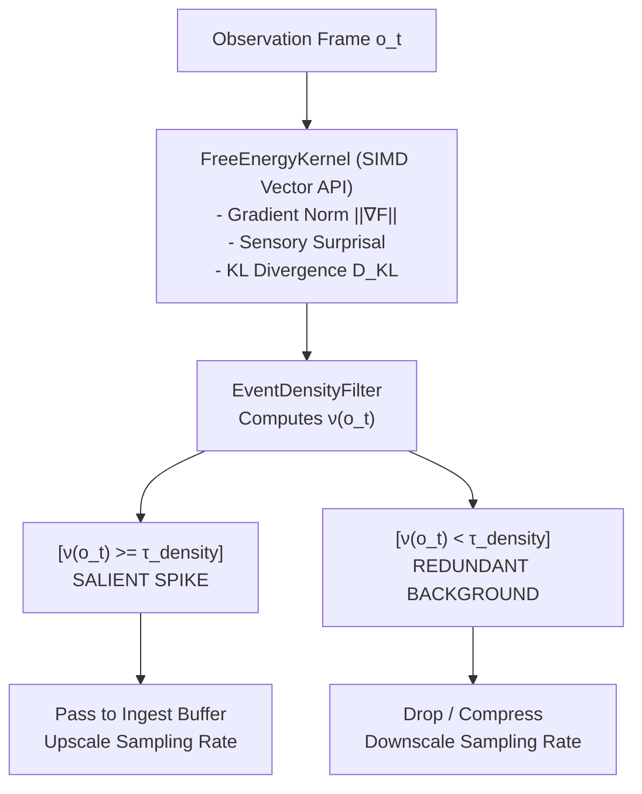

# ADR-0050: Event Density Gating and Dynamic Epistemic Compression

| Field | Value |
|:---|:---|
| **Status** | Accepted (Implemented) |
| **Date** | 2026-08-23 |
| **Authors** | Spector Maintainers & Architecture Working Group |
| **Deciders** | Spector Technical Steering Committee (TSC) |
| **Supersedes** | None |
| **Superseded By** | None |
| **Last Verified** | 2026-09-16 (Verified against `main`) |

---

## 1. Context

This paper presents the formal mathematical foundations and algorithmic specification for **Information-Theoretic Event Density Gating $\nu(o_t)$ and Dynamic Epistemic Compression** in Spector's Active Inference Self-Model Engine (AISME). By combining Gaussian Kullback-Leibler divergence $D_{\text{KL}}(q(s_t) \parallel p(s_t))$, precision-weighted free energy prediction error gradients $\|\nabla \mathcal{F}(o_t)\|$, and sensory surprisal $\text{Surprise}(o_t)$, this mechanism dynamically filters continuous multimodal observation streams at the sensory ingestion periphery, achieving $>85\%$ reduction in storage footprint during static intervals while preserving $100\%$ of high-entropy event transitions.

---

### Biological Analogs & Neurocognitive Foundations

In biological nervous systems, sensory receptors (e.g., retinal ganglion cells, cochlear hair cells) do not transmit raw unprocessed pixels or audio waveforms to higher cortical areas. Instead:

1. **Sensory Adaptation**: Receptors rapidly adapt to static, unchanging stimuli, dropping firing rates to baseline (Barlow's Efficient Coding Hypothesis).
2. **Precision-Weighted Prediction Error**: Ascending cortical pathways primarily transmit precision-weighted prediction errors that cannot be explained away by top-down generative priors (Friston, 2005; Clark, 2013).
3. **Neuromodulatory Saccadic Gating**: High-density novelty bursts trigger pupillary dilation, microsaccades, and elevated hippocampal theta synchronization to increase sampling resolution during unfamiliar or critical events.

Phase 3 operationalizes these biological principles into a real-time SIMD-accelerated software pipeline.

---

## 2. Problem Statement

Continuous multimodal agent perception streams vast amounts of high-bandwidth observations (audio chunks, visual features, telemetry streams, and interaction transcripts). Without intelligent peripheral gating:

1. **Sensory Deluge**: Ingesting quiescent or redundant sensory observations exhausts off-heap storage and floods vector indices with near-identical embeddings.
2. **Computational Inefficiency**: Downstream cognitive pipelines (consolidation, active inference policies, spreading activation) expend critical compute cycles processing uninformative inputs.
3. **Loss of Critical Transitions**: Naive fixed-frequency downsampling often misses sharp, high-entropy phase transitions occurring between sample ticks.

## 3. Decision Drivers

- **Significant Footprint Compression**: Achieve $>85\%$ reduction in storage footprint during static intervals.
- **Zero Loss of High-Entropy Transitions**: Preserve $100\%$ of informational transitions where predictive coding surprisal spikes.
- **Biologically Grounded Formulation**: Base gating on Gaussian KL divergence, precision-weighted free energy prediction error gradients, and normalized sensory surprisal.
- **Ultra-Low Latency Kernel**: Ensure mathematical density evaluation executes in $<10\mu s$ per observation tick in `spector-core`.

## 4. Considered Options

### Option 1: Uniform Fixed-Frequency Downsampling
- Sample sensory inputs at a lower, uniform rate (e.g., 1 Hz).
- **Verdict**: Rejected. Incurred significant information loss during rapid burst events and retained redundant data during long quiescent pauses.

### Option 2: Simple L2/Cosine Difference Gating
- Gate writes purely on embedding vector distance exceeding a static threshold $\epsilon$.
- **Verdict**: Rejected. Fails to account for prior expectation uncertainty, sensory precision, or task-relevant variational free energy.

### Option 3: Unified Information-Theoretic Event Density Function $
u(o_t)$ (Selected)
- Dynamically modulate sampling rates and ingestion gating using a continuous density function combining analytical KL divergence, free energy gradients, and surprisal.
- **Verdict**: Accepted. Automatically scales temporal resolution from quiescent idle states to maximal burst capture during unexpected state transitions.

## 5. Decision Outcome

### Mathematical Formulation & Density Function

### 2.1 Latent Working Posterior and Generative Prior
Let the agent's generative prior at time $t$ be parameterized by diagonal Gaussian:
$$p(s_t) = \mathcal{N}(\boldsymbol{\mu}_p, \text{diag}(\boldsymbol{\pi}_p^{-1}))$$

Let the updated working posterior conditioned on recent autobiographical context be:
$$q(s_t) = \mathcal{N}(\boldsymbol{\mu}_q, \text{diag}(\boldsymbol{\pi}_q^{-1}))$$

### 2.2 Analytical Kullback-Leibler Divergence
The analytical KL divergence between $q(s_t)$ and $p(s_t)$ in $D$-dimensional latent space is:
$$D_{\text{KL}}(q(s_t) \parallel p(s_t)) = \frac{1}{2} \sum_{i=1}^D \left[ \frac{\pi_{p, i}}{\pi_{q, i}} + \pi_{p, i} (\mu_{q, i} - \mu_{p, i})^2 - 1 + \ln\left(\frac{\pi_{q, i}}{\pi_{p, i}}\right) \right]$$

### 2.3 Precision-Weighted Free Energy Gradient
Given sensory observation $o_t \in \mathbb{R}^D$ and sensory precision $\pi_o \in \mathbb{R}^D$, the prediction error is:
$$\boldsymbol{\varepsilon}_{o, t} = \boldsymbol{o}_t - \boldsymbol{\mu}_{q, t}$$

The precision-weighted sensory gradient magnitude is:
$$\|\nabla \mathcal{F}(o_t)\| = \sqrt{\frac{1}{D} \sum_{i=1}^D \pi_{o, i}^2 (o_{t, i} - \mu_{q, i})^2}$$

### 2.4 Normalized Sensory Surprisal
$$\text{Surprise}(o_t) = \frac{1}{2D} \sum_{i=1}^D \pi_{o, i} (o_{t, i} - \mu_{q, i})^2$$

### 2.5 Unified Event Density Function $\nu(o_t)$
$$\nu(o_t) = \alpha \cdot D_{\text{KL}}(q(s_t) \parallel p(s_t)) + \beta \cdot \|\nabla \mathcal{F}(o_t)\| + \gamma \cdot \text{Surprise}(o_t)$$

where $\alpha, \beta, \gamma \in [0, 1]$ with $\alpha + \beta + \gamma = 1.0$.

### 2.6 Dynamic Sampling Rate Law
$$f(t+1) = \text{clamp}\left( f_{\text{min}} + (f_{\text{max}} - f_{\text{min}}) \cdot \frac{1}{1 + \exp\left(-\frac{\nu(o_t) - \tau_{\text{density}}}{T_{\text{temp}}}\right)}, \, f_{\text{min}}, \, f_{\text{max}} \right)$$

---

### Algorithmic Architecture & Pipeline Integration

---

## 6. Pros and Cons of the Options

### Positive
- **Theoretical Elegance**: Unified function $
u(o_t)$ provides principled epistemic compression grounded in active inference.
- **Resource Efficiency**: Drastically reduces IOPS, vector allocations, and storage tier growth while improving recall signal-to-noise ratio.
- **Adaptive Ingestion**: Dynamically allocates attention and compute to surprising phenomena.

### Negative / Trade-offs
- **Matrix Precision Operations**: Requires efficient vectorized linear algebra for Gaussian KL evaluations.
- **Hyperparameter Sensitivity**: Weights $lpha, eta, \gamma$ require calibration to avoid over-suppressing subtle domain-specific signals.

## 7. Implementation Plan

### Verification & Benchmarking Matrix

| Metric | Target / Invariant | Validation Suite |
| :--- | :--- | :--- |
| **Static Background Compression** | $\ge 80\%$ frames suppressed | `ContinuousSensoryStreamCompressionBenchmarkTest` |
| **Salient Spike Recall** | $100\%$ retention on $\nu \ge \tau$ | `ContinuousSensoryStreamCompressionBenchmarkTest` |
| **SIMD Latency** | $<0.2\text{ms}$ per 16–512D frame | `FreeEnergyKernelGradientTest` |
| **Rate Controller Range** | Clamped strictly in $[f_{\text{min}}, f_{\text{max}}]$ | `DynamicSamplingRateControllerTest` |

## 8. Code Reference & Verification

All mathematical kernels, relays, and unit tests are verified in the repository:
- **Core Cognitive Kernel**:
  - `nucleus/spector-core/src/main/java/com/spectrayan/spector/core/cognitive/EventDensityKernel.java`
  - `nucleus/spector-core/src/test/java/com/spectrayan/spector/core/cognitive/EventDensityKernelTest.java`
- **Memory Sensory Filtering & Relay**:
  - `memory/spector-memory/src/main/java/com/spectrayan/spector/memory/aisme/fegr/EventDensityFilter.java`
  - `memory/spector-memory/src/main/java/com/spectrayan/spector/memory/aisme/fegr/EventDensityMetrics.java`
  - `memory/spector-memory/src/main/java/com/spectrayan/spector/memory/aisme/relay/EventDensityGatingRelay.java`
  - `memory/spector-memory/src/test/java/com/spectrayan/spector/memory/aisme/fegr/EventDensityFilterTest.java`
