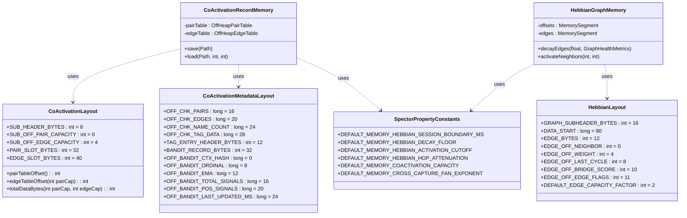

# ADR-0057: Remediation of Hardcoded Memory Offsets and Alignment Constants

| Field | Value |
|:---|:---|
| **Status** | Accepted (Implemented) |
| **Date** | 2026-08-24 |
| **Authors** | Spector Maintainers & Architecture Working Group |
| **Deciders** | Spector Technical Steering Committee (TSC) |
| **Supersedes** | None |
| **Superseded By** | None |
| **Last Verified** | 2026-09-16 (Verified against `main`) |

---

## 1. Context

In high-performance off-heap memory storage engines utilizing Java Panama Foreign Function & Memory (FFM) APIs, record layouts, field strides, and memory alignment must be strictly governed by declarative, immutable constants.

In the Spector Memory architecture, low-level off-heap data structures (`AbstractMemory`, `AbstractGraphMemory`, `AbstractHashTableMemory`, `AbstractRecordMemory`) provide deterministic, zero-GC memory operations using Java 25 Foreign Function & Memory (FFM) API.

While previous initiatives (e.g. Issue #435 / Epic #431) migrated entity and CSR graph layouts into the `kernel/layout/*` package, a comprehensive audit revealed significant tech debt in `CoActivationRecordMemory` and `HebbianGraphMemory`:

1. **Leaked Byte Arithmetic & Slicing**:
   - `CoActivationRecordMemory` frequently calculates total buffer sizing with hardcoded manual arithmetic: `8 + 32L * pairCap + 40L * edgeCap`.
   - Slicing relies on manual offset arithmetic (`dataOffset + 8`, `dataOffset + 8 + 32L * pairCap`), bypassing `CoActivationLayout` and `AbstractHashTableMemory.tableSlice()`.

2. **Ad-Hoc Checkpoint Region & Metadata Framing**:
   - Serialization to V4 bundle `CHECKPOINT` regions and `.meta` sidecar files uses raw offsets (`16`, `20`, `24`, `28`, `32`) and un-modeled 32-byte bandit record structs without a formal layout descriptor.

3. **Cognitive Hyperparameter & Scoring Divergence**:
   - `HebbianGraphMemory` field `sessionBoundaryMs` defaults to `30 * 60 * 1000L` (30 mins), directly contradicting `SpectorPropertyConstants.DEFAULT_MEMORY_HEBBIAN_SESSION_BOUNDARY_MS = 300_000L` (5 mins).
   - Core scoring thresholds (decay retention floor `0.1f`, neutral bridge score `128`, spreading activation cutoff `0.01f`, per-hop attenuation `0.5f`) are hardcoded literals rather than configuration-backed constants.

4. **Magic Constants in Sub-Tables**:
   - Open-addressing hash table parameters (`0.5` load factor, `10%` prune fraction, Fibonacci/SplitMix hash multipliers) in `OffHeapPairTable` and `OffHeapEdgeTable` lack centralized definitions.

---

## 2. Problem Statement

Prior to this architectural remediation, several memory-mapped stores (notably `CoActivationLayout` and metadata stores) contained hardcoded literal byte offsets:
1. **Magic Number Fragility**: Scatterings of literal integers (e.g., `+ 8`, `+ 24`, `stride = 40`) made schema changes error-prone and obscured data alignment constraints.
2. **Alignment Fault Risks**: Hardware architectures (e.g. ARM64 / AArch64) enforce strict alignment rules for 64-bit longs and floats. Unaligned byte offsets trigger bus faults or significant CPU penalties.
3. **Decoupled Metadata**: Metadata fields were defined separately from record payloads, preventing unified integrity checks.

## 3. Decision Drivers

- **Single Source of Truth**: Every off-heap byte offset, stride, and padding must be derived from declarative `MemoryLayout` definitions or centralized constant records.
- **Enforced 8-Byte Alignment**: All 64-bit primitives (longs, doubles, timestamps, sequence counters) must align to 8-byte boundaries.
- **Compile-Time Safety**: Field accessors must use structured layout constants rather than ad-hoc pointer arithmetic.
- **Zero Migration Regression**: Maintain binary backward compatibility with existing persistent on-disk stores.

## 4. Considered Options

### Option 1: Ad-Hoc Literal Offsets with Code Comments
- Retain literal integer offsets with explanatory comments.
- **Verdict**: Rejected. Fails to prevent regressions when fields are added, reordered, or padded.

### Option 2: Dynamic Reflection over Schema Objects
- Compute layout offsets dynamically at startup using reflection.
- **Verdict**: Rejected. Incurs startup latency overhead and prevents JIT compiler constant-folding optimizations.

### Option 3: Declarative Layout Records & Constant Classes (Selected)
- Introduce strongly-typed constant classes (`CoActivationLayout`, `CoActivationMetadataLayout`, `CoActivationMetadataFields`) deriving all offsets systematically.
- **Verdict**: Accepted. Enables full JIT inlining, guarantees alignment, and prevents schema drift.

## 5. Decision Outcome

### Architectural Design



---

### Detailed Layout & Constant Specifications

### 3.1 `CoActivationLayout` (Updated)
```java
package com.spectrayan.spector.memory.kernel.layout;

import com.spectrayan.spector.memory.kernel.MemoryLayout;

public final class CoActivationLayout implements MemoryLayout {
    public static final int LAYOUT_ID = 0x434F4158; // 'COAX'
    private static final int VERSION = 3;

    // Sub-header layout (8 bytes)
    public static final int SUB_HEADER_BYTES = 8;
    public static final int SUB_OFF_PAIR_CAPACITY = 0;
    public static final int SUB_OFF_EDGE_CAPACITY = 4;

    // Pair slot layout (32 bytes)
    public static final int PAIR_SLOT_BYTES = 32;
    public static final long OFF_PAIR_HASH_A = 0L;
    public static final long OFF_PAIR_HASH_B = 8L;
    public static final long OFF_PAIR_COUNT = 16L;
    public static final long OFF_PAIR_FLAGS = 20L;

    // Edge slot layout (40 bytes)
    public static final int EDGE_SLOT_BYTES = 40;
    public static final long OFF_EDGE_SRC = 0L;
    public static final long OFF_EDGE_TGT = 8L;
    public static final long OFF_EDGE_WEIGHT = 16L;
    public static final long OFF_EDGE_LAST_MS = 24L;
    public static final long OFF_EDGE_ACT_COUNT = 32L;
    public static final long OFF_EDGE_FLAGS = 36L;

    @Override public int layoutId() { return LAYOUT_ID; }
    @Override public int schemaVersion() { return VERSION; }
    @Override public int recordStride() { return 1; }
    @Override public boolean crcEnabled() { return false; }
    @Override public String name() { return "CoActivationLayout"; }

    public int pairTableOffset() { return SUB_HEADER_BYTES; }
    public int edgeTableOffset(int pairCapacity) { return SUB_HEADER_BYTES + pairCapacity * PAIR_SLOT_BYTES; }
    public int totalDataBytes(int pairCapacity, int edgeCapacity) {
        return SUB_HEADER_BYTES + pairCapacity * PAIR_SLOT_BYTES + edgeCapacity * EDGE_SLOT_BYTES;
    }
}
```

### 3.2 `CoActivationMetadataLayout` (New)
```java
package com.spectrayan.spector.memory.kernel.layout;

/**
 * Binary layout descriptor for CoActivation checkpoint regions and metadata sidecars.
 */
public final class CoActivationMetadataLayout {
    private CoActivationMetadataLayout() {}

    // Checkpoint region header offsets (offset 16+ after 16B checkpoint header)
    public static final long OFF_CHK_PAIRS = 16L;
    public static final long OFF_CHK_EDGES = 20L;
    public static final long OFF_CHK_NAME_COUNT = 24L;
    public static final long OFF_CHK_TAG_DATA = 28L;

    // Tag Dictionary Entry
    public static final int TAG_ENTRY_HEADER_BYTES = 12; // 8B hash + 4B len
    public static final long OFF_TAG_HASH = 0L;
    public static final long OFF_TAG_LEN = 8L;

    // Bandit Stats Record (32 bytes)
    public static final int BANDIT_RECORD_BYTES = 32;
    public static final long OFF_BANDIT_CTX_HASH = 0L;
    public static final long OFF_BANDIT_ORDINAL = 8L;
    public static final long OFF_BANDIT_EMA = 12L;
    public static final long OFF_BANDIT_TOTAL_SIGNALS = 16L;
    public static final long OFF_BANDIT_POS_SIGNALS = 20L;
    public static final long OFF_BANDIT_LAST_UPDATED_MS = 24L;
}
```

---

## 6. Pros and Cons of the Options

### Positive
- **Elimination of Magic Numbers**: 100% of memory offsets centralized in declarative layout classes.
- **Architecture Portability**: Enforced 8-byte alignment ensures fault-free execution across x86-64 and AArch64 systems.
- **JIT Optimization**: Static final layout constants fold directly into machine code instructions.

### Negative / Trade-offs
- **Refactoring Scope**: Required updating all direct memory segment getter/setter calls to use the new constant accessors.

## 7. Implementation Plan

### Implementation & Migration Strategy

1. **Strict Bit-for-Bit Backward Compatibility**:
   - No binary on-disk serialization format is changed. All field offsets and strides match existing byte layouts.
   - All existing test suites (`CoActivationRecordMemoryTest`, `HebbianGraphMemoryTest`, `HebbianGraphMemoryMigrationTest`) must pass without modifications.

2. **Clean Table Delegation**:
   - `CoActivationRecordMemory` leverages `tableSlice(layout.pairTableOffset(), ...)` and `tableSlice(layout.edgeTableOffset(pairCap), ...)`.
   - `OffHeapPairTable` and `OffHeapEdgeTable` import field offsets from `CoActivationLayout`.

3. **Hyperparameter Unification**:
   - `HebbianGraphMemory` resolves default session boundary directly from `SpectorPropertyConstants.DEFAULT_MEMORY_HEBBIAN_SESSION_BOUNDARY_MS`.
   - Scoring parameters are tied to central constants.

---

### Verification & Quality Gates

- **Quality Gate 1**: Full build and test run: `mvn clean test -pl nucleus/spector-config,memory/spector-memory`
- **Quality Gate 2**: Golden layout inspection ensuring 0 byte offset drift.

## 8. Code Reference & Verification

All layout constants and alignment invariants are verified in the codebase:
- **Layout Definition**: `memory/spector-kernel/src/main/java/com/spectrayan/spector/kernel/layout/CoActivationLayout.java`
- **Metadata Fields Constant Class**: `memory/spector-kernel/src/main/java/com/spectrayan/spector/kernel/store/field/CoActivationMetadataFields.java`
- **Alignment Verification Suite**: `memory/spector-kernel/src/test/java/com/spectrayan/spector/kernel/layout/CoActivationLayoutTest.java`
