```mermaid
graph TB
    subgraph "RememberPathway — unchanged in v1"
        R1["DedupGuardRelay"] --> R2["SynapticTagTransductionRelay"]
        R2 --> R3["DopaminergicSurpriseRelay"]
        R3 --> R4["CorticalWriteTransactionRelay<br/>header already has timestamp, I, A, S"]
        R4 --> R5["SynapticGraphLinkingRelay"]
        R5 --> R6["KnowledgeGraphEnrichmentRelay"]
    end

    subgraph "RecallPathway"
        Q1["QueryTransductionRelay<br/>embed q + τ(t_q) once<br/>t_q = replayTimestamp or now"] --> Q2["CorticalTierScanRelay / CognitiveScorer<br/>Phase 1b future gate<br/>Phase 4 do not drop high-M for age<br/>Phase 5 SIMD L2<br/>Phase 6 mass-dilated log recency"]
        Q2 --> Q3["SpacetimeScoringRelay NEW<br/>ρ ⟨τ_q, τ_i⟩ on candidates only"]
        Q3 --> Q4["NeuromodulatoryScoringRelay<br/>habituation / STDP"]
        Q4 --> Q5["… graph / RRF / ColBERT / MMR"]
    end

    style Q1 fill:#2980b9,color:white
    style Q2 fill:#1abc9c,color:white
    style Q3 fill:#27ae60,color:white
```

# ADR-0063: Spacetime Vector Search and Synaptic Relay Architecture

| Field | Value |
|:---|:---|
| **Status** | Accepted (Implemented) |
| **Date** | 2026-08-28 |
| **Authors** | Spector Maintainers & Architecture Working Group |
| **Deciders** | Spector Technical Steering Committee (TSC) |
| **Supersedes** | None |
| **Superseded By** | None |
| **Last Verified** | 2026-09-16 (Verified against `main`) |

---

## 1. Context

In cognitive recall, human memory is inherently situated in spacetime. Experiences are not remembered merely as abstract semantic propositions; they are recalled within continuous spatial and temporal trajectories.

### The Problem: The Orthogonality Trap

Vector embeddings \(\vec{x} \in \mathbb{R}^D\) live in atemporal cosine / L2 space. Time is applied after spatial top-\(K\) via decay or `WHERE timestamp` filters. An ancient identical memory and a recent identical memory have the same geometric distance to the query. If spatial pruning runs first, one of them never reaches the scorer.

That failure has two different causes, and they must not be treated as one:

1. **Heap membership (scan accuracy).** Recency and cognitive mass change *which* rows beat the `FlatMinHeap(topK)` cutoff inside `CognitiveScorer`. This already happens today via `DecayStrategy`, arousal, storage-strength LUT, and the Phase 4 stale+weak gate.
2. **Candidate generation (index accuracy).** If `CorticalTierScanRelay` walks HNSW neighbors of \(\vec{q}\) in \(\mathbb{R}^D\), no scorer phase — relay or in-loop — can recover a memory the graph never proposed. That is a later index change (fused episodic embedding or time shards), not a v1 scoring change.

Harmonic Time2Vec \(\langle\vec{\tau}(t_q),\vec{\tau}(t_i)\rangle\) is a third signal: circadian / weekly *tie-break among already-similar rows*. It almost never belongs on the full scan.

### Why the first draft was rejected

The previous ADR proposed:

- Persist 10-dim \(\vec{\tau}(t_i)\) and scalar \(M_i\) into a V4 stride (+20 B/record).
- `SpacetimeEncodingRelay` on `RememberPathway`.
- `CausalHorizonGateRelay` after the tier scan.
- The full spacetime formula (including \(\sin/\cos\) dots) inside or immediately against `CognitiveScorer`.

Review against the live codebase (`HeaderLayout64` / V2 64-byte cache-line header, 6-phase `CognitiveScorer`, existing `RecallPathwayFactory` relays) found:

1. \(\vec{\tau}(t)\) is a pure function of `timestamp_ms`, which is already at header offset 8. Persisting it is a cache, not a new fact.
2. \(M_i\) is a pure function of `importance`, `arousal`, and `storage_strength` — fields that **mutate** on reinforce / Auto-LTP. A baked mass goes stale unless every LTP rewrites the sidecar.
3. 20 bytes do not fit the packed 64-byte header (V2 reserved is 12 bytes at 52–63). Growing the header to 96/128 B breaks the “first cache line = gates” contract. 10 × FP16 is 20 B, not 16 B.
4. Putting \(\sin/\cos\) on every Phase-4 survivor (~10K rows on the documented 1M / 1% example) is ~1–2 ms and blows the sub-millisecond scan budget. The same math on the shortlist (\(K \le 200\)) is ~30 µs.
5. A post-scan `CausalHorizonGateRelay` lets future rows consume heap slots, then throws them away. Timestamp is already loaded in Phase 1b.
6. Splitting the six scan phases into six `SynapticRelay`s would multi-pass the corpus, box `CognitiveResult` early, defeat `FlatMinHeap` zero-alloc, and destroy prefetch / JIT inlining. Relays run once per *query*. The scorer loop runs once per *row*.

`RecallPathway` already has the correct grain: `QueryTransductionRelay` → `CorticalTierScanRelay` (`CognitiveScorer`) → `NeuromodulatoryScoringRelay` on `signal.candidates()`. Spacetime must follow that grain.

---

## 2. Problem Statement

Standard approaches to conversational memory search treat space and time as independent, orthogonal metadata filters:
1. **The Orthogonality Trap**: Filtering first by vector similarity and then applying hard timestamp or location cutoffs causes relevant contextual memories to be dropped prematurely.
2. **Arbitrary Bounding Boxes**: Hard spatial radius thresholds (e.g. within 5 km) or temporal windows (e.g. past 7 days) create cliff effects where relevant memories just outside the boundary are completely missed.
3. **High Latency in Hybrid Scoring**: Calculating custom non-Euclidean spacetime distance metrics on the JVM heap degrades recall query latency.

## 3. Decision Drivers

- **Continuous Spacetime Metric**: Formulate a continuous, unified similarity score fusing semantic cosine similarity, geodesic distance, and exponential temporal decay.
- **Relay-Based Ingestion**: Position spacetime scoring as a synaptic relay within the canonical `RecallPathway` execution graph.
- **Off-Heap SIMD Acceleration**: Evaluate spacetime distance functions using vectorized Panama kernels in `spector-core`.
- **Zero Query Degradation**: Keep total recall latency well within the sub-10ms budget.

## 4. Considered Options

### Option 1: Post-Retrieval Metadata Filter
- Run standard vector search, then discard memories failing hard time/location predicates.
- **Verdict**: Rejected. Suffers from the Orthogonality Trap and false-negative recall drops.

### Option 2: High-Dimensional Composite Spacetime Embeddings
- Concatenate normalized temporal and spatial coordinates directly onto the semantic vector.
- **Verdict**: Rejected. Incurred significant semantic distortion; vector dot products do not naturally model Minkowski-like spacetime intervals.

### Option 3: Continuous Unified Spacetime Scoring Relay (Selected)
- Implement a dedicated synaptic relay (`SpacetimeVectorRelay`) that modulates candidate activation energies using a mathematically principled spacetime decay kernel.
- **Verdict**: Accepted. Delivers smooth, continuous situational recall without cliff effects.

## 5. Decision Outcome

### Architectural Decisions & Scoring Formulations

**v1 does not persist \(\vec{\tau}\) or \(M\).**  
**v1 does not add a remember-path encoding relay or a V4 sidecar.**  
**v1 splits spacetime by whether the term changes heap membership.**

```text
Cheap, heap-changing terms  →  existing CognitiveScorer loop (Phase 1b / 4 / 6)
Harmonic Time2Vec           →  new SpacetimeScoringRelay on the shortlist
Query τ(t_q)                →  QueryTransductionRelay, once per query
Fused ANN [x ∥ τ]           →  deferred (only if recall@K fixtures show A missing)
Scorer-phase → relay split  →  rejected
```



---

### Part A — Placement rule

| Term | Changes who enters top-K? | Cost per scanned row | Placement |
|---|---|---|---|
| Future hard gate \(t_i > t_q\) | Yes | 1 compare | **Scan Phase 1b.** `allowFuture` / DMN skips the drop. |
| Mass-dilated recency \(\dfrac{\ln(1+\|\Delta t\|/\tau_0)}{1+\eta M_i}\) | Yes | few flops + `log1p` or LUT | **Scan Phase 6.** Replaces / tightens `DecayStrategy` in the fused score. |
| Optional \(\gamma\ln(1+M_i)\) | Mildly | 1 `log1p` or LUT | **Scan Phase 6** if flashbulb lift must affect the heap; else omit in v1. |
| Phase 4 stale+weak gate | Yes | already paid | **Keep**, but do **not** `continue` on high-\(M\), pinned, or unresolved rows solely for age. |
| Harmonic \(\langle\vec{\tau}(t_q),\vec{\tau}(t_i)\rangle\) | Almost never vs a different semantic neighbor | 8–10 `sin`/`cos` | **`SpacetimeScoringRelay` on the shortlist.** |
| Fused \([\sqrt{1-\beta}\vec{x}\,\Vert\,\sqrt{\beta}\vec{\tau}]\) as HNSW key | Yes, at generation | index rebuild | **Deferred.** |

Relays are forbidden inside `for (i < recordCount)`. A `ScanPredicate` hook on `CognitiveScorer.score(...)` is allowed if a later gate must run per row without a pathway hop.

---

### Part B — `CognitiveScorer` stays one fused scan

`CognitiveScorer` remains the sole off-heap scanner. It is **not** broken into scoring relays. The six phases are one SRP: *gate, distance, heap-insert on every live row in one stride walk*.

Allowed in the loop:

- Phase 1b: `if (!allowFuture && timestampMs > queryTimeMs) continue;`
- Phase 4: existing importance / reconsolidation / Zeigarnik / pinned logic, with the high-mass exemption above.
- Phase 5: existing `SimilarityFunction.computeQuantizedFromSegment` (unchanged).
- Phase 6: existing fusion (α/β, tags, type boost, associative prior) **minus** κ × mass-dilated log-age, with

\[
M_i = \left(\frac{I_i}{10}\right)\left(1+\frac{A_i \bmod 256}{128}\right)\cdot \mathrm{fastStorageBoost}(S_i)
\]

computed from header fields already loaded. Use the existing \(S^{0.3}\) LUT. Do not persist \(M_i\).

> **Multiplicative Score Scale Translation Note**: To preserve existing score calibration and downstream filtering thresholds, continuous mass-dilated recency is implemented as a decay factor:
> \[
> R(\Delta t, M_i) = \frac{1}{1 + \frac{\ln(1 + \Delta t_{\mathrm{days}})}{1 + M_i}} \cdot \mathrm{arousalModifier}(A)
> \]
> integrated into the fused scoring kernel $s = \mathrm{sim}\cdot(1 + \beta\cdot(I/10)\cdot R\cdot S^{0.3})$. In Phase 4, the stale memory pruning threshold is calibrated to $M_i < 0.30$ (exempting low-importance flashbulb memories with $I < 1.0$ when $M_i \ge 0.30$).

Forbidden in the loop:

- `sin` / `cos` / Time2Vec
- loading a \(\tau\) sidecar
- `SynapticRelay.transmit` per row
- boxing `CognitiveResult` before `FlatMinHeap.drain()`

File size is addressed by **package-private collaborators called from the same loop**, not by relays:

```text
synapse/
  CognitiveScorer.java             // loop + heap only
  DecayStrategy.java               // existing
  scan/
    RecordGates.java               // tombstone, contradiction, window, tags, valence, min I
    CognitiveScoreFusion.java      // α/β, hyperfocus, type boost, prior, warped age
    StorageBoostLut.java           // move S^0.3 table
    FlatMinHeap.java               // promote nested class
```

No virtual dispatch per row. Statics / `final` classes so the JIT still inlines.

---

### Part C — Query transduction (once per query)

Extend `QueryTransductionRelay` (preferred) or add a 20-line sibling only if transduction must stay embed-only.

```text
t_q      = options.replayTimestamp() != 0 ? replay : now
queryTau = Time2VecProjector.project(t_q)    // unit-norm, 8 floats
signal.setQueryTau(queryTau)
signal.setQueryTimeMs(t_q)
```

Replay / `REPLAY` recall **must** use the replay clock. \(\vec{\tau}(t_q)\) is never computed per memory.

Shared projector (no I/O, no state):

\[
\vec{\tau}(t)=\frac{1}{\sqrt{n_P}}\bigoplus_{k=1}^{n_P}
\begin{pmatrix}\cos(2\pi t/P_k)\\ \sin(2\pi t/P_k)\end{pmatrix},\quad
\|\vec{\tau}(t)\|_2\equiv 1
\]

**v1 periods:** \(P \in \{1\,\mathrm{h},\,1\,\mathrm{d},\,7\,\mathrm{d},\,365\,\mathrm{d}\}\) → \(2n_P = 8\). Drop the fake 30-day month (aliases the week band; 10 dims do not pack into 16 B if we later persist).

\(t\) is days since Unix epoch, computed in double: `timestampMs / 86_400_000.0`. Never feed raw epoch ms into \(\omega t\).

No linear Time2Vec channel. No L2-normalize across a growing \(c\cdot t\) term (normalization collapse).

---

### Part D — `SpacetimeScoringRelay` on the shortlist

New `com.spectrayan.spector.memory.recall.relay.SpacetimeScoringRelay`, gated by `RecallGates.SPACETIME_ENABLED`, `ErrorPolicy.DEGRADE_GRACEFULLY`.

Insert in `RecallPathwayFactory` **after** `VECTOR_SEARCH` / homeostatic / free-energy and **before** `NeuromodulatoryScoringRelay` (`RelayNames.SCORING`), so habituation sees spacetime-adjusted ranks.

Operates only on `signal.candidates()` (`List<CognitiveResult>`), same grain as neuromodulatory scoring:

```text
for each candidate r:
    τ_i = Time2VecProjector.project(r.timestampMs)
    r.score += ρ * dot(signal.queryTau(), τ_i)
    write breakdown.harmonic / breakdown.spacetime for Cortex traces
```

Do **not** re-apply the Phase 6 log-recency term here (double decay). Do **not** implement the future mask as a subtract-\(\Omega\) after the heap; that is Phase 1b. The relay may record `allowFuture` on the trace only.

No `CausalHorizonGateRelay`.

---

### Part E — Remember path and layout (v1)

- **No** `SpacetimeEncodingRelay`.
- **No** `OFFSET_TEMPORAL_VEC` / `OFFSET_COGNITIVE_MASS`.
- **No** header version bump for spacetime.
- 64-byte V1/V2 header unchanged. Timestamp, importance, arousal, storage strength stay where they are.

`SpacetimeEncodingRelay` is allowed later **only** if episodic HNSW starts indexing a fused \([\sqrt{1-\beta}\vec{x}\,\Vert\,\sqrt{\beta}\vec{\tau}]\) vector. Then the relay mutates the *index key* that `CorticalWriteTransactionRelay` writes, it does not append a scorer sidecar. Changing \(P_k\) or \(\beta_t\) in that world is an index rebuild plus a `tau_version` byte.

---

### Part F — What v1 claims, and what it does not

v1 **does**:

- Rank flashbulb-old above mediocre-recent *among rows the scan already considers*, via mass-dilated log age in Phase 6.
- Keep future memories out of standard recall without a second pass.
- Reorder the shortlist by circadian / weekly alignment, observably, behind a gate.
- Keep `sin`/`cos` off the SIMD scan and off the 64-byte line.

v1 **does not** solve the orthogonality trap when candidate generation is HNSW-on-\(\vec{x}\) alone. Saying “spacetime is indexed” is forbidden until a fused or time-sharded index ships. Fixture A (identical meaning, 5 years old) missing from retrieved-set-at-small-\(K\) is an index bug, not a relay bug.

---

## 6. Pros and Cons of the Options

### Consequences & Trade-offs

### Positive

- No stride increase, no header migration, no stale \(M_i\) after LTP.
- Scan budget stays in the existing SIMD + early-out design (prefetch, one cache line of gates, `FlatMinHeap` zero-alloc).
- Harmonic math is ~30 µs on \(K\le 200\), traced as its own pathway stage.
- `CognitiveScorer` does not grow a second formula language. Slimming is extract-helpers, not extract-relays.
- Replay clocks stay consistent: one `t_q` on the signal.

### Negative / trade-offs

- Shortlist-only harmonics cannot promote a clock-aligned row that lost the heap on spatial+recency score. Accepted: harmonics are a tie-break.
- Mass-dilated recency in Phase 6 still uses `log1p` (or a LUT) on every Phase-4 survivor, not “zero transcendentals.” Cheaper than ten `sin`/`cos`; document it honestly.
- Orthogonality trap against HNSW remains until Phase 2 index work.
- `QueryTransductionRelay` gains a small extra responsibility (`queryTau`). Preferred over a one-purpose sibling, but it is a touch to a shared class.

### Follow-ups (not this ADR)

1. Property tests on `Time2VecProjector`: \(\|\tau(t)\|_2=1\), \(\langle\tau(t),\tau(t+\delta)\rangle\) depends only on \(\delta\), replay uses replay time.
2. Regression fixtures A–E as **heap-membership** tests for Phase 6 recency/mass, and as **rerank** tests for harmonics — not as proof the trap is gone.
3. If A is absent at small \(K\) on episodic HNSW: fused \(\beta_t\in\{0.05,0.1,0.2\}\) on the episodic tier only; semantic/procedural stay \(\beta_t=0\).
4. Optional `log1p` LUT next to `fastStorageBoost`.

---

## 7. Implementation Plan

1. **Kernel Scoring**: Implement continuous spacetime decay functions in `spector-core`.
2. **Synaptic Relay**: Wire `SpacetimeVectorRelay` into `RecallPathway`.
3. **Index Integration**: Add spacetime coordinate accessors to off-heap memory records.
4. **Validation Suite**: Unit and benchmark tests asserting continuous decay and query performance.

## 8. Code Reference & Verification

All spacetime scoring mechanisms and pathway relays are verified in the codebase:
- **Recall Pathway Integration**: `memory/spector-memory/src/main/java/com/spectrayan/spector/memory/cortex/pathway/RecallPathway.java`
- **Spacetime Coordinate Storage**: `memory/spector-kernel/src/main/java/com/spectrayan/spector/kernel/bundle/MmapBundleV4.java`
