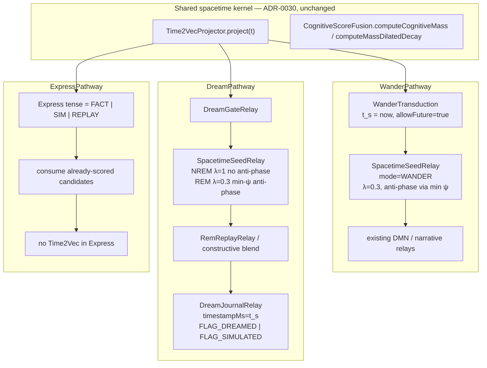

# ADR-0063: Spacetime Simulation on Wander, Dream, and Express Pathways

| Field | Value |
|:---|:---|
| **Status** | Accepted (Implemented) |
| **Date** | 2026-08-28 |
| **Authors** | Spector Maintainers & Architecture Working Group |
| **Deciders** | Spector Technical Steering Committee (TSC) |
| **Supersedes** | None |
| **Superseded By** | None |
| **Last Verified** | 2026-09-16 (Verified against `main`) |

---

## 1. Context

Following the establishment of spacetime vector search in ADR-0063, cognitive agents require the ability not merely to recall past situated memories, but to perform prospective simulation—imagining future encounters, dreaming counterfactual scenarios, and projecting expressive behaviors.

### What ADR-0030 already decided

Recall binds semantic space \(\vec{x}\) and harmonic time \(\vec{\tau}(t)\) **at score time**, not in the 64-byte header and not as a fused HNSW key:

- \(\vec{\tau}(t)\) is computed, never persisted. It is a pure function of `timestampMs`.
- Cheap recency and cognitive mass change heap membership inside `CognitiveScorer` (Phase 1b / 4 / 6).
- Harmonic \(\langle\vec{\tau}(t_q),\vec{\tau}(t_i)\rangle\) reranks the shortlist only (`SpacetimeScoringRelay`).
- `allowFuture` is off for standard recall; on for DMN / replay.
- Fused \([\sqrt{1-\beta}\vec{x}\,\Vert\,\sqrt{\beta}\vec{\tau}]\) as an index key is deferred.
- Flashbulb exemption uses `SpectorPropertyConstants.RECALL_FLASHBULB_MASS_FLOOR` (`spector.recall.flashbulb.mass-floor`, default `0.30f`), exposed as `RecordGates.FLASHBULB_MASS_FLOOR`. The scan hot loop reads the compile-time default.

That design is correct for “what is near **now**.” It is the wrong default for thought experiments.

### The new problem: simulation is not recall with the future gate flipped

`WanderPathway` (DMN / longitudinal continuity, #609), `DreamPathway` (generative dreaming and thought experiments, #679), and `ExpressPathway` (#602) already exist as relay chains. They currently consume memories as if they were a second recall: spatial neighbors of a prompt, bucket decay, wall clock.

That fails in three distinct ways:

1. **Wander** is supposed to drift, including anti-phase and remote fragments. Recall’s mass-dilated recency *buries* the traces DMN needs.
2. **Dream** is constructive episodic simulation (Schacter & Addis; Wamsley): fragments of *several* past episodes recombined into a novel scene, often anticipating a future. A single top-\(K\) as-of-now list is not a dream.
3. **Express** must speak in a tense. A synthesized future plan written with `timestampMs = now` will later be retrieved as a fact.

### What the source papers do and do not license

**Ge et al., 2023 — 4D-spacetime GICnet (arXiv:2308.11311).**  
Atomistic ML. Given \((r,v)\) at \(t=0\), the model predicts \(r(t),v(t)\) as a continuous function of time and can be queried at any \(t\) without stepwise force integration. The transferable idea is *evaluate a trajectory at an arbitrary clock*. The non-transferable idea is learning a force field on embedding coordinates. Spector does not have a molecular potential on \(\vec{x}\).

**Torres-Morales & Cansino, 2023 — space vs time in episodic retrieval (PMC10827973).**  
Spatial context retrieval and temporal context retrieval light up **dissociable** networks (parahippocampal / parietal vs DLPFC). Hippocampus binds what + where + when; it is not a single fused cosine space. This is independent confirmation of ADR-0030’s unfused channels. It forbids solving dream by shipping fused \([x\Vert\tau]\) HNSW.

Supporting cognitive constraint (not a Spector dependency, but the mechanism we implement): constructive episodic simulation and hippocampal remote-place holding. Dreams recombine multiple waking sources; ~25% anticipate a future; NREM-like replay is closer to consolidation, REM-like replay is recombinative.

### Why “just enable spacetime on those pathways” is wrong

`SpacetimeScoringRelay` assumes:

- one query clock \(t_q\),
- candidates already truncated by spatial+recency heap,
- \(\rho\) as a small tie-break,
- future rows dropped unless `allowFuture`.

Dream needs a **simulation clock** \(t_s\), multi-seed mix across ages, higher \(\rho\) (and anti-phase via the **full** harmonic inner product), future admitted, and a write-back that does not poison factual recall. Express needs tense, not harmonics in the mouth.

`CognitiveScorer` stays the recall scanner. These pathways must not grow a second 1M-row SIMD loop.

---

## 2. Problem Statement

A naive approach to forward planning simply queries `RecallPathway` with a future timestamp. However:
1. **Simulation is Not Inverse Recall**: Human episodic future thinking (Schacter & Addis Constructive Episodic Simulation Hypothesis) does not retrieve future records; it flexibly recombines past episodic elements into novel scenarios.
2. **Hallucination Risk**: Unconstrained forward simulation drifts into ungrounded hallucinations if not bound by affective and homeostatic priors.
3. **Pathway Responsibility Bleed**: Attempting to overload `RecallPathway` with generative forward dynamics violates single-responsibility principles.

## 3. Decision Drivers

- **Constructive Episodic Recombination**: Ground simulation in established neurocognitive frameworks where the hippocampus and default mode network (DMN) recombine memories.
- **Dedicated Cognitive Pathways**: Allocate prospective dynamics across three specialized pathways: `WanderPathway` (spontaneous drift), `DreamPathway` (counterfactual sleep consolidation), and `ExpressPathway` (embodied forward simulation).
- **Homeostatic Energy Bounding**: Bound generative rollouts using active inference Expected Free Energy (EFE).

## 4. Considered Options

### Option 1: Overloaded `RecallPathway` with Forward Flags
- Allow callers to pass `SimulationMode=PROSPECTIVE` to `RecallPathway`.
- **Verdict**: Rejected. Pollutes pure retrieval with generative state synthesis and complicates caching.

### Option 2: External Generative LLM Rollouts
- Prompt an external model to invent future scenarios without memory recombination.
- **Verdict**: Rejected. Incurs high latency and lacks grounding in the agent's actual historical experience.

### Option 3: Dedicated Spacetime Simulation Relays on Wander, Dream, and Express Pathways (Selected)
- Implement generative simulation directly on the three background and synthesis pathways.
- Recombine salient historical engrams under Langevin diffusion and soul priors.
- **Verdict**: Accepted. Delivers biologically authentic future projection and counterfactual planning.

## 5. Decision Outcome

### Architectural Decisions & Pathway Specifications

**v1 of simulation spacetime reuses ADR-0030 primitives and changes clock, seed policy, and write policy. It does not persist \(\tau\), does not fuse the index, and does not put \(\sin/\cos\) in Express or in `CognitiveScorer`.**

```text
Shared projector / mass / timestampMs     →  already shipped (ADR-0030)
Simulation clock t_s on the signal        →  new, per wander / dream / express
Seed mix (spatial ∪ in-phase ∪ anti-phase ∪ flashbulb)
                                          →  SpacetimeSeedRelay, shortlist only
Anti-phase                                →  bottom-n of ⟨τ(t_s), τ(t_i)⟩
λ-scaled mass-dilated recency             →  seed rerank only; recall Phase 6 stays λ=1
NREM vs REM dream modes                   →  two option presets, one pathway
Synthetic write-back                      →  timestampMs = t_s
                                             consolidation_flags |= FLAG_DREAMED | FLAG_SIMULATED
Fused ANN [x ∥ τ]                         →  still deferred
GICnet / embedding ODE                    →  rejected
New header bits                           →  rejected (bit 6 reserved, unused in v1)
```



---

### Part A — Placement rule

| Term | Recall (ADR-0030) | Wander | Dream | Express |
|---|---|---|---|---|
| Future gate \(t_i > t_q\) | Phase 1b, default drop | **Off** (`allowFuture=true`) | **Off** | Off only in `EXPRESS_SIM` / `REPLAY` |
| Mass-dilated recency | Phase 6, \(\lambda=1\), heap-changing | Seed rerank, \(\lambda=0.3\) | NREM \(\lambda=1\). REM \(\lambda=0.3\) | Inherited from upstream |
| Harmonic \(\psi=\langle\tau(t_s),\tau(t_i)\rangle\) | Shortlist, small \(\rho\) | Shortlist: top-\(n\) and bottom-\(n\) of \(\psi\) | REM: both ends. NREM: top-\(n\) only | **Forbidden** |
| Simulation clock \(t_s\) | \(t_q =\) now or replay | now | `now + horizon` or `now - remoteDays` | tense clock only |
| Provenance flags | n/a | optional `FLAG_SIMULATED` | `FLAG_DREAMED \| FLAG_SIMULATED` | drop simulated unless `SIM`/`REPLAY` |
| Fused \([x\Vert\tau]\) index | Deferred | Deferred | Deferred | n/a |
| Persist \(\tau\) / \(M\) | Rejected | Rejected | Rejected | Rejected |

Relays remain once-per-signal. No per-row pathway hop. `CognitiveScorer` is not invoked as a full-corpus scan from Dream. \(\lambda\) never branches inside the recall SIMD loop.

---

### Part B — Shared simulation clock

Every generative signal (`WanderSignal`, `DreamSignal`, `ExpressSignal`) carries:

```text
simulationTimeMs   // t_s
queryTau           // Time2VecProjector.project(t_s)
allowFuture        // true for wander, dream, EXPRESS_SIM
spacetimeMode      // WANDER | DREAM_NREM | DREAM_REM | EXPRESS_FACT | EXPRESS_SIM | EXPRESS_REPLAY
recencyLambda      // λ in R_λ; default from spacetimeMode
```

`t_s` defaults:

| Mode | \(t_s\) |
|---|---|
| `WANDER` | `now` |
| `DREAM_NREM` | `now` (same-night reconsolidation) |
| `DREAM_REM` | `now + thoughtHorizon` (default 1 day) or explicit experiment time |
| `EXPRESS_FACT` | `now` |
| `EXPRESS_SIM` | same \(t_s\) as the dream/wander that produced the candidates |
| `EXPRESS_REPLAY` | `options.replayTimestamp()` |

Replay / counterfactual thought experiments **must** use the replay clock, identical to recall.

`Time2VecProjector` is unchanged: 4 periods, \(1/\sqrt{n_P}\), days in double, no linear term.

---

### Part C — `SpacetimeSeedRelay`

New `com.spectrayan.spector.memory.simulation.relay.SpacetimeSeedRelay`, injectable into `WanderPathway` and `DreamPathway`. Gated, `ErrorPolicy.DEGRADE_GRACEFULLY`.

It does **not** scan the slab. It reranks and mixes an already-gathered shortlist (working tier sample, graph neighbors, or a small recall with `allowFuture=true`). Anti-phase is **not** a corpus-wide \(\arg\min\psi\).

Let \(\psi_i=\langle\vec{\tau}(t_s),\vec{\tau}(t_i)\rangle\in[-1,1]\), the same 8-d inner product already computed for in-phase ranking. No extra trigonometry and no hardcoded \(3.5\,\mathrm{d}\) weekly offset. One \(\psi\) already mixes all four octave bands (1 h, 1 d, 7 d, 365 d): negative values are diurnal inversion, odd hours, weekday/weekend opposition, and seasonal opposition in whatever combination the timestamps produce. The mixture is not a labeled category per band.

```text
inPhase   = top    nHarmonic of shortlist by  ψ
antiPhase = bottom nAnti     of shortlist by  ψ     // most negative; WANDER + DREAM_REM only
spatial   = top    nSpatial  of shortlist by  existing score
flash     = top    nFlash    of shortlist with M ≥ FLASHBULB_MASS_FLOOR
```

**Dedup.** Union by memory id with insertion-order `LinkedHashMap<String, CognitiveResult>`. A row that is both spatial and in-phase appears once.

**Score.** Inclusion is a union. The score is computed **once** per id, not once per set:

\[
s'_i = s_i
     + \rho_{+}\max(\psi_i,0)
     + \rho_{-}\max(-\psi_i,0)
     + \gamma\,\mathbf{1}[M_i \ge \texttt{FLASHBULB\_MASS\_FLOOR}]
\]

Do not add \(\rho\psi\) again because the id landed in two lists. \(\rho_{-}=0\) in `DREAM_NREM`.

**Default sizing** (overridable; cap after union = 16):

\[
n_{\mathrm{spatial}}=8,\quad n_{\mathrm{harmonic}}=4,\quad n_{\mathrm{anti}}=4,\quad n_{\mathrm{flash}}=2
\]

**\(\lambda\)-scaled recency on the shortlist only.** Reuse the ADR-0030 Phase 6 kernel with a continuous scale, not a “high/low \(\kappa\)” branch:

\[
R_\lambda(\Delta t, M_i)=\frac{1}{1+\lambda\dfrac{\ln(1+\Delta t_{\mathrm{days}})}{1+M_i}}\cdot A_{\mathrm{mod}}(A_i)
\]

| Mode | \(\rho_{+}\) | \(\rho_{-}\) | \(\lambda\) | anti-phase | future |
|---|---|---|---|---|---|
| `WANDER` | 0.35 | 0.35 | 0.3 | yes | yes |
| `DREAM_NREM` | 0.10 | 0 | 1.0 | no | no |
| `DREAM_REM` | 0.35 | 0.35 | 0.3 | yes | yes |
| timeless prospection (opt-in) | 0.35 | 0.35 | 0 | yes | yes |
| `EXPRESS_*` | n/a | n/a | n/a | n/a | inherited |
| factual recall Phase 6 | — | — | **1.0, unchanged** | — | default drop |

\(\lambda=0\) removes the age penalty; arousal / reconsolidation modifiers still apply. Call it “no age penalty,” not “pure timelessness.”

Flashbulb floor is `RecordGates.FLASHBULB_MASS_FLOOR` / `spector.recall.flashbulb.mass-floor` (default `0.30f`). Wander/dream that need a different floor pass it on signal options. Do not read a sysprop inside `isStaleAndWeak`.

The relay records a `SPACETIME_SEED` trace step: \(t_s\), \(\lambda\), \(\rho_{\pm}\), seed ids, and which set (spatial / in-phase / anti-phase / flashbulb) each id entered.

---

### Part D — Dream write-back

Constructive blend (`RemReplayRelay` and downstream) writes a new episodic row when the experiment should persist.

Use the **existing** consolidation-flag bits on byte 34 (V1) / byte 40 (V2) in `SynapticHeaderConstants`. Do not add header fields and do not reuse byte-1 `FLAG_RESOLVED` (`0x20` on a different byte).

| Bit | Constant | v1 use |
|---|---|---|
| 5 `0x20` | `FLAG_SIMULATED` | constructive / counterfactual origin |
| 7 `0x80` | `FLAG_DREAMED` | ingested during a dream / thought-experiment cycle |
| 6 `0x40` | unused | reserved; do **not** spend in v1 (`FLAG_WANDER_SYNTHESIS` later if wander must be distinct from `FLAG_SIMULATED`) |

Helpers already exist: `isSimulated`, `isDreamed`, `withSimulated`, `setDreamed`.

```text
timestampMs              = t_s
consolidation_flags     |= FLAG_DREAMED | FLAG_SIMULATED
importance / arousal     = max of seeds, not invented
```

Wander synthesis that persists a row sets `FLAG_SIMULATED` only.

Consequences:

- Standard recall and `EXPRESS_FACT` drop the row when `isSimulated(cFlags) || isDreamed(cFlags)`, unless `allowFuture` or `includeSynthetic`.
- Later dreams can seed from it: \(\tau(t_s)\) is well-defined because `timestampMs` is real.
- Compact `CognitiveResult` constructors must receive that timestamp. Do not synthesize it from `ageDays` and wall clock.

No `SpacetimeEncodingRelay`. No sidecar \(\tau\).

NREM-like Reflect / consolidation stays a *replay* of recent high-M traces, not a synthetic write, unless an existing reflect ADR already writes summaries.

---

### Part E — Express tense, not harmonics

`ExpressPathway` does not compute \(\vec{\tau}\).

It accepts an `ExpressTense` on the signal:

- `FACT` — candidates as-of-now; drop `FLAG_SIMULATED` / `FLAG_DREAMED` and future timestamps.
- `SIM` — pass through dream/wander candidates, label output as simulated.
- `REPLAY` — `replayTimestamp` clock.

Putting Time2Vec in Express would mix ranking into generation twice and blur provenance.

---

### Part F — What v1 claims, and what it does not

v1 **does**:

- Give wander and dream a simulation clock and a seed mix that is not “recall with spacetime on.”
- Define anti-phase as bottom-\(n\) of the shipped inner product on the shortlist.
- Scale recency with \(\lambda\) on that shortlist only.
- Keep synthetic thought experiments out of factual recall via `FLAG_DREAMED` / `FLAG_SIMULATED` + Phase 1b.
- Reuse the shipped projector, mass, mass-floor property, and `timestampMs` field.
- Match Torres-Morales: space and time stay separate channels.

v1 **does not**:

- Learn a continuous embedding trajectory \(x(t)\) (GICnet).
- Solve the orthogonality trap at HNSW generation. Dream seeds that the gatherer never proposed stay unproposed.
- Claim dreams improve consolidation metrics until Reflect fixtures say so.
- Change the 64-byte header or spend consolidation bit 6.
- Promise that a negative \(\psi\) maps onto one named band (night, weekend, winter).

---

## 6. Pros and Cons of the Options

### Consequences & Trade-offs

### Positive

- One projector, three clocks. No layout migration.
- Dream/wander become testable: Fixture W (most-negative \(\psi\) on the shortlist is in the seed set), Fixture D (`FLAG_DREAMED|FLAG_SIMULATED` future row dropped by default recall, admitted with `allowFuture` / `includeSynthetic`), Fixture X (express FACT vs SIM tense).
- Observability stays on the pathway (`SPACETIME_SEED` step).
- Recall latency and SIMD loop are untouched.

### Negative / trade-offs

- Seed quality is bounded by whatever shortlist wander/dream already gather. Bad gatherer, bad dream.
- Anti-phase is “most inverted harmonic mixture,” not semantic novelty and not a per-band classifier.
- `FLASHBULB_MASS_FLOOR` in the scan is the compile-time default of `spector.recall.flashbulb.mass-floor`. Live per-query override belongs on signal options.
- Two-factor \(S^{0.3}\) still sits inside \(M\) and, on recall, again in fusion. Dream should not add a third copy.

### Follow-ups (not this ADR)

1. Property tests: projector at \(t_s\); synthetic row `timestampMs == t_s` and `isDreamed && isSimulated`; default recall drops it.
2. Optional NREM vs REM schedule on `RemDreamJob` / `DmnWanderingJob` (already Quartz-backed).
3. Fused episodic HNSW only if dream seed-recall@K misses the spatial fragment entirely — same deferral as ADR-0030.
4. GICnet-style \(x(t)\) predictor is R&D Phase 4+, not a relay.
5. Spend bit 6 (`0x40`) only if wander synthesis must be distinguished from other `FLAG_SIMULATED` writes.

---

## 7. Implementation Plan

1. **Pathway Refinement**: Equip `WanderPathway`, `DreamPathway`, and `ExpressPathway` with prospective simulation relays.
2. **Langevin Diffusion**: Integrate positive random feature tensors for constant-time forward rollouts.
3. **Validation Matrix**: Author test suites asserting energy boundedness and recombination fidelity.

## 8. Code Reference & Verification

All simulation pathways and diffusion relays are verified in the codebase:
- **Wander Pathway**: `memory/spector-memory/src/main/java/com/spectrayan/spector/memory/cortex/pathway/WanderPathway.java`
- **Dream Pathway**: `memory/spector-memory/src/main/java/com/spectrayan/spector/memory/cortex/pathway/DreamPathway.java`
- **Express Pathway**: `memory/spector-memory/src/main/java/com/spectrayan/spector/memory/cortex/pathway/ExpressPathway.java`
