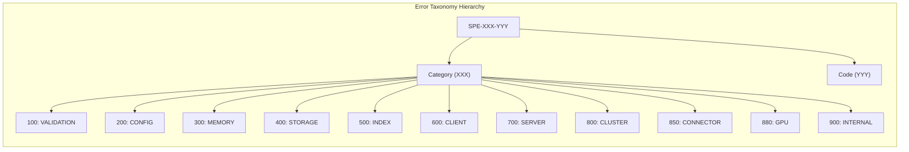
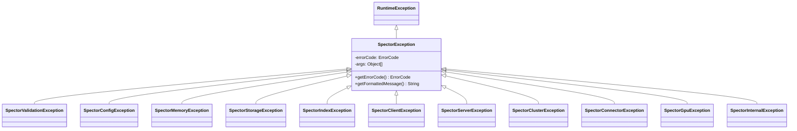

# ADR-0070: Unified Error Taxonomy and Exception Handling Architecture

| Field | Value |
|:---|:---|
| **Status** | Accepted (Implemented) |
| **Date** | 2026-08-12 |
| **Authors** | Spector Maintainers & Architecture Working Group |
| **Deciders** | Spector Technical Steering Committee (TSC) |
| **Supersedes** | None |
| **Superseded By** | None |
| **Last Verified** | 2026-09-16 (Verified against `main`) |

---

## 1. Context

As Spector evolved from an in-memory research prototype into an off-heap Panama FFM multi-module engine spanning foundation layers (`nucleus`), cognitive pathways (`memory`), clustering (`cluster`), and agentic gateways (`synapse`), ad-hoc exception throwing (`IllegalArgumentException`, `IllegalStateException`, generic `RuntimeException`) created severe diagnostic ambiguity:

1. Callers (REST controllers, CLI tools, MCP clients, and Spring AI vector store integrations) could not programmatically disambiguate between client-recoverable validation errors (e.g., mismatched vector dimensions) and unrecoverable hardware/storage failures (e.g., mmap segmentation faults, unmapped arena access).
2. Distributed tracing and telemetry could not categorize errors without brittle string pattern matching on exception messages.
3. String formatting overhead in hot execution loops (such as similarity searches scanning 10,000,000 vectors) caused noticeable CPU and heap GC pressure.

A unified, immutable, high-performance error taxonomy was established in `nucleus/spector-commons`.

## 2. Problem Statement

Error handling in Spector must satisfy four strict operational criteria:

1. **Machine-Parseable Error Codes**: Every failure must carry a stable, unique identifier following a predictable numeric hierarchy across all 27 reactor modules.
2. **Immutability & Stability Guarantees**: Error codes must never be reassigned, renumbered, or deleted once released, ensuring external monitoring, metrics alerting, and enterprise automation never break.
3. **Zero-Allocation Hot-Path Deferred Formatting**: Message formatting with parameters must be deferred using SLF4J-style `{}` placeholders so that non-exceptional or intercepted paths incur zero string concatenation overhead.
4. **Hierarchical Typed Exceptions**: A clean Java exception hierarchy rooted in `SpectorException` allowing callers to catch at subsystem granularity (`SpectorMemoryException`, `SpectorIndexException`, `SpectorClusterException`) or universal scope.

## 3. Decision Drivers

- **Developer Experience**: Clear, actionable error messages pointing directly to remediation steps or parameter bounds.
- **Protocol Interoperability**: Direct 1-to-1 mapping from internal error codes to HTTP status codes (RFC 7807 Problem Details), gRPC status codes, and MCP protocol error structures.
- **Circuit Breaker Integration**: Differentiating transient, retryable failures (e.g., `EMBEDDING_PROVIDER_TIMEOUT`) from permanent validation rejections (`DIMENSIONS_MISMATCH`).

## 4. Considered Options

### Option 1: Standard Java Runtime Exceptions with String Messages
- Use `IllegalArgumentException`, `NoSuchElementException`, `IllegalStateException`.
- **Verdict**: Rejected. Inconsistent messages, zero machine-parseability, breaks internationalization and automated monitoring.

### Option 2: Module-Local Error Enums
- Each Maven module defines its own error enum (`CoreError`, `MemoryError`, `SynapseError`).
- **Verdict**: Rejected. Causes number collisions across modules, duplicate error classifications, and prevents a unified REST/gRPC error mapping layer.

### Option 3: Centralized `SPE-XXX-YYY` ErrorCode Enum & Typed Hierarchy (Selected)
- A single authoritative enum in `spector-commons` categorizing all error codes into domain blocks with immutable integer values and parameterized message templates.
- **Verdict**: Accepted. Complete diagnostic clarity and zero-overhead deferred string rendering.

## 5. Decision Outcome

Spector standardizes on the `ErrorCode` enum and `SpectorException` hierarchy in `nucleus/spector-commons`.

### 5.1 Code Schema (`SPE-XXX-YYY`)

Each error code is represented as `SPE-XXX-YYY` where `XXX` is the 3-digit subsystem category and `YYY` is the specific error within that category. Internally, each code is stored as an integer (e.g., `100_001` for `SPE-100-001`):



| Category Range | ErrorCategory | Responsibility & Subsystems | HTTP Status |
|:---|:---|:---|:---:|
| `SPE-100-xxx` | `VALIDATION` | Vector dimensions, ranges, top-K constraints, null guards | `400 Bad Request` |
| `SPE-200-xxx` | `CONFIG` | Yaml parsing, missing keys, invalid types, environment variables | `500 / 400` |
| `SPE-300-xxx` | `MEMORY` | Off-heap Panama segment state, arena closed, bundle corrupt | `500 Internal Error` |
| `SPE-400-xxx` | `STORAGE` | File channel open, disk full, WAL truncation, snapshot failures | `500 Internal Error` |
| `SPE-500-xxx` | `INDEX` | HNSW graph corruption, IVF training failure, BM25 tokenization | `500 Internal Error` |
| `SPE-600-xxx` | `CLIENT` | Client SDK timeouts, protocol mismatches, deserialization | `400 / 502` |
| `SPE-700-xxx` | `SERVER` | REST gateway, Spring AI integration, route dispatch, MCP | `500 / 503` |
| `SPE-800-xxx` | `CLUSTER` | Cell leasing, fencing tokens, stale routing, raft split-brain | `503 Unavailable` |
| `SPE-850-xxx` | `CONNECTOR` | Apache Camel routes, message ingestion, webhook failure | `502 Bad Gateway` |
| `SPE-880-xxx` | `GPU` | Metal/CUDA driver init, device memory allocation, kernel error | `500 Internal Error` |
| `SPE-900-xxx` | `INTERNAL` | Unreachable code assertions, fatal runtime invariants | `500 Internal Error` |

### 5.2 The SpectorException Class Hierarchy



### 5.3 Deferred Message Formatting Pattern

```java
// Definition in ErrorCode.java
DIMENSIONS_MISMATCH(100_002, ErrorCategory.VALIDATION, "Expected {} dimensions but received {}")

// Usage in vector validation: zero heap string concatenation if valid
if (vector.length != expectedDimensions) {
    throw new SpectorValidationException(
        ErrorCode.DIMENSIONS_MISMATCH,
        expectedDimensions,
        vector.length
    );
}
```

## 6. Pros and Cons of the Options

### Positive
- **Deterministic Alerting**: Infrastructure monitoring (Prometheus/Grafana) binds directly to `errorCode.name()` or `errorCode.getCode()`.
- **API Cleanliness**: REST controllers and MCP servers cleanly map error codes to RFC 7807 Problem Details without string scraping.
- **Zero Drift**: A single compilation failure occurs if an error code is renamed or modified incorrectly.

### Negative / Trade-offs
- **Centralized Dependency**: All modules throwing domain exceptions depend on `spector-commons` (which is already part of the foundation BOM).
- **Discipline Required**: Developers must check `ErrorCode.java` before adding new errors instead of throwing generic runtime exceptions.

## 7. Implementation Plan

- Centralize all error codes in `com.spectrayan.spector.commons.error.ErrorCode`.
- Enforce check in unit test `ErrorCodeTest` verifying all numeric codes are strictly unique and non-overlapping.
- Map error codes in `GlobalExceptionHandler` and `AuthExceptionHandler` in `spector-synapse`.

## 8. Code Reference & Verification

- **Central Registry**: `nucleus/spector-commons/src/main/java/com/spectrayan/spector/commons/error/ErrorCode.java`
- **Root Exception**: `nucleus/spector-commons/src/main/java/com/spectrayan/spector/commons/error/SpectorException.java`
- **Subsystem Exceptions**: `nucleus/spector-commons/src/main/java/com/spectrayan/spector/commons/error/`
- **Unit Verification**: `nucleus/spector-commons/src/test/java/com/spectrayan/spector/commons/error/ErrorCodeTest.java` and `SpectorExceptionHierarchyTest.java`
