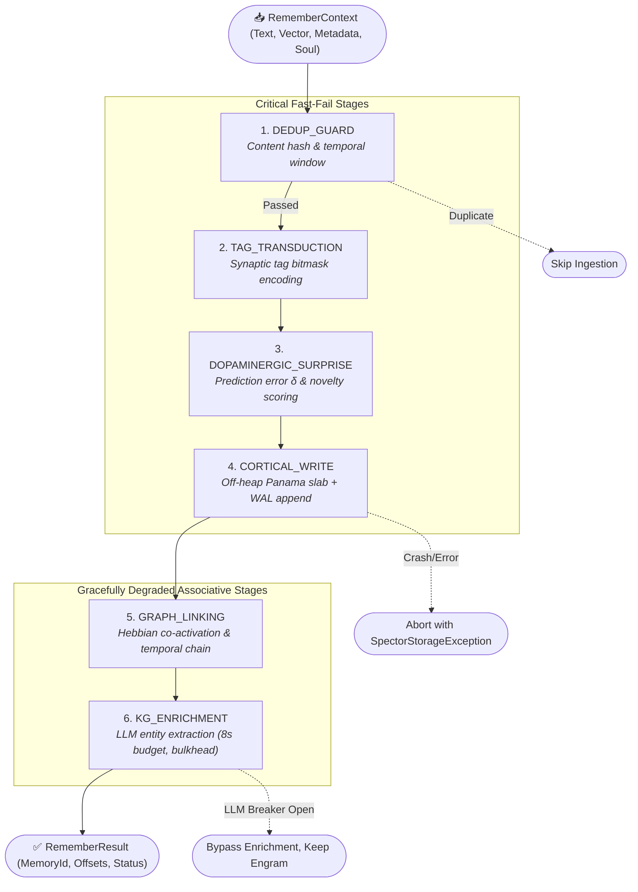

# ADR-0071: Remember Cognitive Pathway Architecture

| Field | Value |
|:---|:---|
| **Status** | Accepted (Implemented) |
| **Date** | 2026-08-14 |
| **Authors** | Spector Maintainers & Architecture Working Group |
| **Deciders** | Spector Technical Steering Committee (TSC) |
| **Supersedes** | None |
| **Superseded By** | None |
| **Last Verified** | 2026-09-16 (Verified against `main`) |

---

## 1. Context

In cognitive architectures and biological neuroscience, memory encoding (the hippocampal formation converting sensory perceptions into stable engrams) requires strict sequencing:
1. Novelty and surprise detection must precede synaptic consolidation.
2. Direct cortical storage into persistent media (off-heap memory and write-ahead logs) must be atomic and non-interruptible.
3. Auxiliary associative indexing (Hebbian co-activation graphs and knowledge graph extraction) must be decoupled so that high-latency operations or external model outages cannot cause data loss.

Earlier iterations of Spector embedded memory ingestion directly inside ad-hoc service classes (`DefaultSpectorMemory.remember()`), coupling off-heap memory writes, LLM entity extraction, and Hebbian graph updates into monolithic methods. This led to partial write states, thread pool deadlocks, and missed writes when external LLM providers experienced transient timeouts.

## 2. Problem Statement

The Remember pipeline must satisfy three core architectural requirements:
1. **Deterministic Execution Sequence**: Encode incoming sensory perceptions through a normative sequence of synaptic relays (`DEDUP_GUARD` &rarr; `TAG_TRANSDUCTION` &rarr; `DOPAMINERGIC_SURPRISE` &rarr; `CORTICAL_WRITE` &rarr; `GRAPH_LINKING` &rarr; `KG_ENRICHMENT`).
2. **Strict Non-Interruptible Write Guarantee**: Writing to off-heap Panama `MemorySegment` buffers and the disk-backed Write-Ahead Log (`MemoryWal`) cannot observe thread interruptions or arbitrary timeouts. An aborted write thread would leave memory segments corrupted and out-of-sync with the WAL.
3. **Resilient Asynchronous Enrichment**: Knowledge Graph (KG) enrichment that calls external LLMs for entity extraction must execute within a bounded bulkhead and circuit-breaker envelope with graceful degradation if the provider is unavailable.

## 3. Decision Drivers

- **Zero Data Loss**: Once sensory inputs pass deduplication and validation, persistent storage must be guaranteed before auxiliary enrichment begins.
- **Cognitive Neuroscience Fidelity**: Mirror the biological sequence of sensory gating, dopaminergic modulation, hippocampal sharp-wave ripples, and neocortical trace distribution.
- **Fail-Fast vs. Degrade-Gracefully Isolation**: Critical write relays must fail immediately on invariant breach, while associative indexing must degrade gracefully without aborting the remember operation.

## 4. Considered Options

### Option 1: Monolithic Ingestion Service
- A single synchronous Java service executing deduplication, vector embedding, disk append, and entity extraction sequentially.
- **Verdict**: Rejected. Fragile, untestable in isolation, and fails completely if LLM entity extraction times out.

### Option 2: Event-Driven SEDA (Staged Event-Driven Architecture)
- Place every ingestion step behind independent message queues.
- **Verdict**: Rejected. Incurs excessive serialization overhead, complicates synchronous caller feedback (`MemoryRemember.remember()` returning the newly assigned `MemoryId`), and introduces race conditions on fast recall.

### Option 3: Declarative Synaptic Relay Pathway with Strict Resilience Contracts (Selected)
- Implement the Remember pathway using the `PathwayRecipe<RememberSignal>` pattern (`RememberRecipe.java`).
- Enforce strict error policies per relay: `FAIL_FAST` for validation and cortical writes, and `DEGRADE_GRACEFULLY` with bulkheads and circuit breakers for external enrichment.
- **Verdict**: Accepted. Provides optimal low-latency throughput with rock-solid storage invariants.

## 5. Decision Outcome

Spector establishes the **Remember Cognitive Pathway** composed via `RememberRecipe` and orchestrated by `RememberPathway`.

### 5.1 Canonical 6-Relay Architecture

### 5.2 The Six Constituent Relays

1. **`DEDUP_GUARD` (Deduplication Guard Relay)**:
   - Evaluates content hashes and sliding temporal windows to detect redundant inputs.
   - Error Policy: `FAIL_FAST` / `BYPASS`.
2. **`TAG_TRANSDUCTION` (Synaptic Tag Transduction Relay)**:
   - Encodes string tags into 64-bit Bloom filter bitmasks and stores them directly into the 64-byte `EncodingHeader`.
   - Error Policy: `FAIL_FAST`.
3. **`DOPAMINERGIC_SURPRISE` (Dopaminergic Surprise & Novelty Relay)**:
   - Computes temporal difference prediction error $\delta = |r - V(s)|$ and novelty salience.
   - Adjusts initial memory importance and emotional valence before persistence.
   - Error Policy: `FAIL_FAST`.
4. **`CORTICAL_WRITE` (Transactional Cortical Write Relay)**:
   - Allocates memory offsets in the active partition slab, appends to `MemoryWal`, and writes to `MemorySegment`.
   - **Resilience Contract**: Deliberately carries **NO timeout** and **NO retry**. It writes directly to mmap memory and the WAL. Neither can observe an interrupt without risking partial unmapped writes.
   - Error Policy: `FAIL_FAST`.
5. **`GRAPH_LINKING` (Associative Graph & Temporal Chain Linking Relay)**:
   - Updates Hebbian co-activation weights (`CoActivationMemory`) and links preceding episode IDs in temporal chains.
   - Error Policy: `DEGRADE_GRACEFULLY`.
6. **`KG_ENRICHMENT` (Knowledge Graph & Entity Extraction Relay)**:
   - Submits task to virtual worker pool for asynchronous NER (Named Entity Recognition).
   - Enveloped by an **8-second timeout**, the shared `llm-provider` circuit breaker, and a **2-permit bulkhead** to prevent LLM saturation.
   - Error Policy: `DEGRADE_GRACEFULLY`.

## 6. Pros and Cons of the Options

### Positive
- **Guaranteed Durability**: Memories are safely committed to off-heap storage and the WAL before any non-deterministic external LLM calls occur.
- **Resource Protection**: The 2-permit bulkhead prevents a burst of remember requests from exhausting LLM API limits or worker memory.
- **Traceability**: Every relay records its execution time, status (`COMPLETED`, `SKIPPED`, `DEGRADED`), and diagnostic telemetry in `RememberResult`.

### Negative / Trade-offs
- **Entity Extraction Lag**: Because KG enrichment is decoupled and bounded, deep entity graph links may appear a few hundred milliseconds after the raw memory is queryable via vector search.

## 7. Implementation Plan

- Implement `RememberRecipe` implementing `PathwayRecipe<RememberSignal>`.
- Wire `RememberPathwayFactory` to instantiate standard and headless test configurations.
- Verify through direct unit suites: `RememberPathwayDirectTest` and `RememberContextMetadataTest`.

## 8. Code Reference & Verification

- **Recipe Definition**: `memory/spector-memory/src/main/java/com/spectrayan/spector/memory/pathway/remember/relay/RememberRecipe.java`
- **Pathway Orchestrator**: `memory/spector-memory/src/main/java/com/spectrayan/spector/memory/pathway/remember/RememberPathway.java`
- **Signal Context**: `memory/spector-memory/src/main/java/com/spectrayan/spector/memory/pathway/remember/relay/RememberSignal.java`
- **Gates & Constants**: `memory/spector-memory/src/main/java/com/spectrayan/spector/memory/pathway/remember/relay/RememberGates.java`
- **Unit Verification**: `memory/spector-memory/src/test/java/com/spectrayan/spector/memory/pathway/RememberPathwayDirectTest.java`
