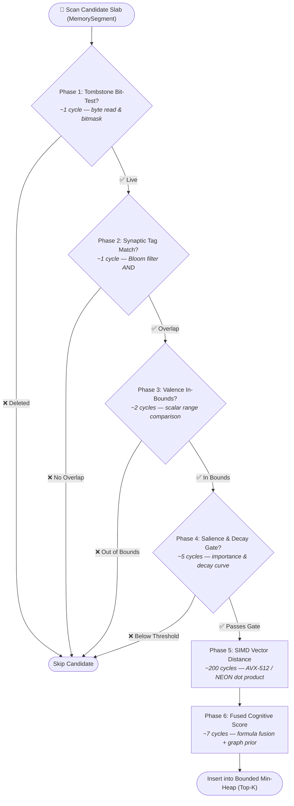

# ADR-0072: Six-Phase Fused Cognitive Scoring Pipeline

| Field | Value |
|:---|:---|
| **Status** | Accepted (Implemented) |
| **Date** | 2026-08-16 |
| **Authors** | Spector Maintainers & Architecture Working Group |
| **Deciders** | Spector Technical Steering Committee (TSC) |
| **Supersedes** | None |
| **Superseded By** | None |
| **Last Verified** | 2026-09-16 (Verified against `main`) |

---

## 1. Context

Conventional vector databases (e.g., Pinecone, Milvus, Qdrant, pgvector) decouple semantic retrieval from metadata filtering into a two-step process: retrieve the top-\$K\$ nearest vector neighbors by cosine or Euclidean distance, and then apply metadata filters, importance thresholds, or temporal decay in the application layer.

In autonomous cognitive systems, this two-step approach suffers from a catastrophic failure mode known as the **Truncation Trap**:
- If an agent recalls memories relevant to *"database connection pooling"*, a mission-critical configuration memory recorded six months ago might have a slightly lower cosine similarity (e.g., 0.78) than a trivial conversational exchange from five minutes ago (e.g., 0.81).
- If the vector index truncates to the top-100 nearest vectors before evaluating importance or decay, the vital historical memory is dropped at step 1 and can never be recovered by application-layer rerankers.

To solve this, Spector integrates all retrieval signals directly into the off-heap scoring scan.

## 2. Problem Statement

Cognitive recall requires evaluating five distinct signal dimensions simultaneously across millions of candidate records:

1. **Semantic Similarity**: Dense vector proximity (L2, Cosine, Dot Product) computed via SIMD instructions.
2. **Temporal Decay**: Ebbinghaus power-law or exponential forgetting curves attenuating older, non-reinforced memories.
3. **Emotional Valence & Somatic Markers**: Filtering by emotional polarity (positive, neutral, negative) and arousal levels.
4. **Epistemic Importance**: Baseline significance established during encoding and reinforced through recall cycles.
5. **Exact Metadata / Synaptic Tags**: Deterministic tag intersections represented as compact bitmasks.

This multi-dimensional evaluation must execute in sub-millisecond latencies over off-heap memory without allocating Java heap objects or suffering CPU cache misses.

## 3. Decision Drivers

- **Zero Allocation in the Hot Loop**: Scanning millions of records per second must produce zero garbage collection pressure.
- **Cache-Line Co-Design**: All metadata required for preliminary gating must fit within a single 64-byte CPU cache line alongside the memory record header.
- **Cascading Early Exits**: Expensive SIMD vector distance calculations (~200 CPU cycles) must only execute for candidates that pass ultra-fast bitwise and scalar checks (1–5 CPU cycles).

## 4. Considered Options

### Option 1: Standard Vector Retrieval + Post-Filtering Reranker
- Query an external or decoupled ANN vector index, then apply a scoring formula in application code.
- **Verdict**: Rejected due to the Truncation Trap and severe deserialization latency.

### Option 2: Pre-Filtering via B-Tree / Inverted Index + Vector Intersection
- Filter candidates by tags or timestamps first, then scan vectors for the surviving IDs.
- **Verdict**: Rejected for cognitive queries with open-ended or implicit contexts where exact metadata tags are unknown or sparse.

### Option 3: Six-Phase Fused Cognitive Scoring Loop (Selected)
- Implement `CognitiveScorer` as a fused SIMD scan directly over Panama `MemorySegment` buffers.
- Cascade six sequential evaluation phases from cheapest to most expensive, inserting qualifying candidates into a bounded min-heap.
- **Verdict**: Accepted. Delivers maximum recall accuracy while preserving sub-millisecond execution speeds.

## 5. Decision Outcome

Spector standardizes on the **Six-Phase Fused Cognitive Scoring Pipeline** in `CognitiveScorer.java`.

### 5.1 Pipeline Execution Architecture

### 5.2 The Six Sequential Phases

1. **Phase 1: Tombstone Bit-Test (~1 CPU cycle)**:
   - Reads the record allocation flags. If the tombstone bit is set, the slot is immediately skipped.

2. **Phase 2: Synaptic Tag Bloom Filter AND-Mask (~1 CPU cycle)**:
   - Performs a 64-bit bitwise AND between the query tag mask and the candidate engram tag mask. If required tags are absent, the candidate is discarded.

3. **Phase 3: Emotional Valence Range Check (~2 CPU cycles)**:
   - Verifies whether the candidate valence byte falls within $[V_{\\min}, V_{\\max}]$ (e.g., filtering for negative memories during debugging modes).

4. **Phase 4: Importance & Temporal Decay Threshold (~5 CPU cycles)**:
   - Computes temporal decay factor:
     $$\\text{DecayFactor} = (1.0 + \\lambda \\cdot \\Delta t)^{-\\gamma}$$
   - If $\\text{Importance} \\cdot \\text{DecayFactor} < \\text{Threshold}$, the memory is too decayed to compete and is pruned before SIMD execution.

5. **Phase 5: SIMD Quantized Vector Distance (~200 CPU cycles)**:
   - Executes SIMD-accelerated distance computation (dot product, cosine similarity, or Euclidean distance) using Java Panama Vector API or native kernels.

6. **Phase 6: Fused Cognitive Score Formulation (~7 CPU cycles)**:
   - Computes the final composite ranking score incorporating semantic similarity, decay, valence modulation, and Hebbian graph priors.

### 5.3 Mathematical Scoring Regimes

#### MULTIPLICATIVE Mode (Default)
$$\\text{FinalScore} = \\text{BaseScore} \\cdot (1.0 + \\text{TagOverlap} \\cdot \\text{TagBoost})$$
where:
$$\\text{BaseScore} = \\text{Similarity} \\cdot (1.0 + \\text{Importance} \\cdot \\text{DecayFactor}) \\cdot \\text{ValenceMultiplier}$$

#### ADDITIVE Mode
$$\\text{BaseSimilarity} = \\alpha \\cdot \\text{Similarity} + (1.0 - \\alpha) \\cdot \\text{TagOverlap}$$
$$\\text{FinalScore} = \\text{BaseSimilarity} \\cdot (1.0 + \\text{Importance} \\cdot \\text{DecayFactor}) \\cdot \\text{ValenceMultiplier}$$
where $\\alpha \\in [0.0, 1.0]$ balances vector semantics with exact tag metadata matches.

## 6. Pros and Cons of the Options

### Positive
- **Immune to Truncation Trap**: High-importance historical memories compete fairly with recent low-importance memories.
- **Hardware Efficiency**: 90%+ of non-matching candidates are eliminated in Phases 1–4, saving billions of vector math cycles.
- **Zero GC Footprint**: All checks operate directly on off-heap Panama memory segments using value layouts.

### Negative / Trade-offs
- **Linear Partition Scan**: Scanning entire partition slabs incurs linear memory bandwidth overhead, necessitating partition pruning for massive corpora.

## 7. Implementation Plan

- Implement `CognitiveScorer` using Java 25 Foreign Function & Memory (FFM) `MemorySegment`.
- Provide configurable regimes via `ScoringMode`, `ScoreFusionMode`, and `ScoringOptions`.
- Validate recall accuracy and benchmark latency against multi-million vector datasets in `spector-bench`.

## 8. Code Reference & Verification

- **Scorer Implementation**: `memory/spector-memory/src/main/java/com/spectrayan/spector/memory/synapse/CognitiveScorer.java`
- **Score Fusion Utilities**: `memory/spector-memory/src/main/java/com/spectrayan/spector/memory/synapse/scan/CognitiveScoreFusion.java`
- **Model Enums**: `memory/spector-memory/src/main/java/com/spectrayan/spector/memory/model/ScoringMode.java` and `ScoringRegime.java`
- **Unit Verification**: `memory/spector-memory/src/test/java/com/spectrayan/spector/memory/e2e/ScoringPipelineE2ETest.java` and `bench/spector-bench/src/test/java/com/spectrayan/spector/bench/cognitive/ScoringPipelineValidationTest.java`
