# ADR-0073: Recall Cognitive Pathway and Multi-Phase Retrieval Architecture

| Field | Value |
|:---|:---|
| **Status** | Accepted (Implemented) |
| **Date** | 2026-08-18 |
| **Authors** | Spector Maintainers & Architecture Working Group |
| **Deciders** | Spector Technical Steering Committee (TSC) |
| **Supersedes** | None |
| **Superseded By** | None |
| **Last Verified** | 2026-09-16 (Verified against `main`) |

---

## 1. Context

In cognitive memory retrieval, biological memory access is neither a pure vector distance calculation nor a simple keyword match. Human recall is an active inference process:

1. Retrieval is modulated by current emotional state and homeostatic balance (hypothalamic/amygdala bias).
2. Semantic concepts trigger associative spreading activation across associative neural networks (Hebbian graphs).
3. Prospective reminders and temporal event boundaries shape candidate filtering.
4. Final recalled memories are subject to lateral inhibition, maximal marginal relevance (MMR) diversification, and closed-loop epistemic belief updating.

Earlier versions of Spector used fragmented recall pipelines where HNSW search, graph traversal, and lexical BM25 were scattered across disparate service calls. Spector unifies retrieval under a declarative, observable 22-relay recipe: `RecallRecipe` and `RecallPathway`.

## 2. Problem Statement

Cognitive recall requires solving several interdependent challenges:

1. **Remote Dependency Isolation**: The only stage leaving the local JVM process on the retrieval hot path is query transduction (generating an embedding vector from the search text). It must be protected with strict timeouts, transient retries, and circuit-breaker trip states.
2. **Hybrid Multi-Modal Fusion**: Merging dense vector search (HNSW / Panama SIMD scan), exact lexical search (SIMD BM25), associative graph traversal, and spacetime vector projections into a normalized ranking.
3. **Adaptive Cognitive Modulation**: Dynamically activating Active Inference Self-Model Engine (AISME) stages (homeostatic bias, free-energy guidance, manifold reranking) without degrading performance for non-AISME queries.
4. **Epistemic Learning Loop Closure**: Updating agent beliefs, habituation counts, and homeostatic drives based on the memories recalled.

## 3. Decision Drivers

- **Sub-Millisecond P99 In-Process Latency**: After query transduction, all graph walks, fused scoring scans, and reranking must execute off-heap without garbage collection pauses.
- **Fail-Fast Hot Path vs. Degraded Association**: Transduction and vector scanning must fail fast if broken, while associative expansion, BM25 fusion, and prospective reminders must degrade gracefully.
- **Diversity & Anti-Repetition**: Preventing memory collapse by enforcing Maximal Marginal Relevance (MMR) and habituation penalties.

## 4. Considered Options

### Option 1: Monolithic Multi-Index Query Handler

- A single God-class querying vector indexes, graph databases, and BM25 tables sequentially.
- **Verdict**: Rejected. Impossible to benchmark individual stages, unobservable, and tightly couples unrelated retrieval algorithms.

### Option 2: Microservice Reranking Mesh

- Separate vector retrieval, graph expansion, and lexical scoring into independent HTTP/gRPC microservices.
- **Verdict**: Rejected. Incurs multi-millisecond network hop penalties and JSON serialization overhead, destroying real-time agent responsiveness.

### Option 3: Declarative 22-Relay Synaptic Pathway Recipe (Selected)

- Composed via `RecallRecipe` implementing `PathwayRecipe<RecallSignal>`.
- Gated relays dynamically execute based on query specifications (`RecallGates`).
- Integrated resilience boundaries (circuit breakers, bulkheads, timeouts).
- **Verdict**: Accepted. Provides modularity, observability, and sub-millisecond execution.

## 5. Decision Outcome

Spector standardizes on the **Recall Cognitive Pathway** defined by `RecallRecipe.java` and executed by `RecallPathway.java`.

### 5.1 The 22-Relay Execution Pipeline

```mermaid
flowchart TD
    Q(["📥 RecallContext (Query Text, Tags, SoulContext)"]) --> R1

    subgraph PhaseTransduction ["Phase 1: Transduction & Gating"]
        R1["1. TRANSDUCTION<br/><i>Remote embedding (2s budget, retry, breaker)</i>"] --> R2["2. PROSPECTIVE<br/><i>Time-triggered task reminders</i>"]
        R2 --> R3["3. GOVERNED_RELEASE_GATE<br/><i>Access control & compliance boundary</i>"]
    end

    subgraph PhaseCandidateGathering ["Phase 2: Candidate Gathering & Scoring"]
        R3 --> R4["4. VECTOR_SEARCH<br/><i>SIMD slab scan & HNSW recall</i>"]
        R4 --> R5["5. HOMEOSTATIC_BIAS<br/><i>Affective valence modulation</i>"]
        R5 --> R6["6. FREE_ENERGY_GUIDED<br/><i>Friston active inference recall</i>"]
        R6 --> R7["7. SPACETIME_SCORING<br/><i>Causal light-cone & velocity weighting</i>"]
        R7 --> R8["8. SCORING<br/><i>6-phase fused cognitive score</i>"]
    end

    subgraph PhaseAssociative ["Phase 3: Hybrid & Associative Expansion"]
        R8 --> R9["9. GRAPH_EXPANSION<br/><i>Hebbian 1-to-N associative walk</i>"]
        R9 --> R10["10. HOPFIELD_ASSOCIATIVE<br/><i>Dense energy-based pattern completion</i>"]
        R10 --> R11["11. EVIDENCE_FUSION<br/><i>Bayesian evidence weighting</i>"]
        R11 --> R12["12. LATERAL_INHIBITION<br/><i>Suppresses mutually exclusive traces</i>"]
        R12 --> R13["13. BM25_SEARCH<br/><i>SIMD lexical keyword scoring</i>"]
        R13 --> R14["14. RRF_RESCORE<br/><i>Reciprocal Rank Fusion</i>"]
    end

    subgraph PhaseReranking ["Phase 4: Reranking & Diversity"]
        R14 --> R15["15. MANIFOLD_RERANK<br/><i>Riemannian personal metric distance</i>"]
        R15 --> R16["16. CONSTRUCTIVE_SIMULATION<br/><i>Counterfactual trace reconstruction</i>"]
        R16 --> R17["17. CONSCIOUSNESS_CONTINUITY<br/><i>Φ_CC narrative alignment</i>"]
        R17 --> R18["18. COGNITIVE_RERANK<br/><i>Composite importance & habituation</i>"]
        R18 --> R19["19. MMR_DIVERSITY<br/><i>Maximal Marginal Relevance penalty</i>"]
        R19 --> R20["20. TEMPERATURE_SOFTMAX<br/><i>Boltzmann probabilistic exploration</i>"]
    end

    subgraph PhaseLoopClosure ["Phase 5: Output & Epistemic Feedback"]
        R20 --> R21["21. CONSCIOUS_ACCESS<br/><i>Global Workspace broadcast</i>"]
        R21 --> R22["22. EPISTEMIC_LEARNING<br/><i>Updates posterior beliefs & habituation</i>"]
    end

    R22 --> OUT(["✅ CognitiveResult (Ranked Memories, Scores, Telemetry)"])
```



### 5.2 Key Resilience Envelopes

- **Query Transduction**:
  ```java
  // 2s budget, 2 transient retries, shared fail-fast breaker
  composer.stage(RelayNames.TRANSDUCTION)
          .relay(transductionRelay)
          .policy(ErrorPolicy.FAIL_FAST)
          .timeoutIfInterruptible(PathwayResilience.EMBED_TIMEOUT)
          .retryIfIdempotent(PathwayResilience.transientTwice())
          .breaker(PathwayResilience.embedProviderFailFast())
          .add();
  ```

- **Conditional AISME Gating**:
    - `HOMEOSTATIC_BIAS` only conducts if `RecallGates.HOMEOSTASIS_ENABLED` is true.
    - `FREE_ENERGY_GUIDED` only conducts if `RecallGates.FREE_ENERGY_ENABLED` is true.
    - `BM25_SEARCH` and `RRF_RESCORE` only conduct when hybrid search is requested.

## 6. Pros and Cons of the Options

### Positive

- **Deep Cognitive Plausibility**: Accurately reproduces the multi-stage associative retrieval dynamics of mammalian memory.
- **Bulletproof Resilience**: Remote embedding failures are isolated with circuit breakers, while in-memory stages execute deterministically off-heap.
- **Extensible Relay Hooks**: New neural rerankers or neurodivergent filters plug in via `RecallRecipe.Builder` without altering existing stages.

### Negative / Trade-offs

- **High Configuration Surface**: Fine-tuning 22 relays requires curated defaults, provided via standard `CognitiveProfile` presets.

## 7. Implementation Plan

- Centralize recall orchestration in `com.spectrayan.spector.memory.pathway.recall.relay.RecallRecipe`.
- Enforce strict unit test coverage across direct execution (`RecallPathwayDirectTest`) and AISME wiring (`RecallPathwayAismeWiringTest`).

## 8. Code Reference & Verification

- **Pathway Recipe**: `memory/spector-memory/src/main/java/com/spectrayan/spector/memory/pathway/recall/relay/RecallRecipe.java`
- **Orchestrator**: `memory/spector-memory/src/main/java/com/spectrayan/spector/memory/pathway/recall/RecallPathway.java`
- **Gates & Signals**: `memory/spector-memory/src/main/java/com/spectrayan/spector/memory/pathway/recall/relay/RecallGates.java` and `RecallSignal.java`
- **Unit Verification**: `memory/spector-memory/src/test/java/com/spectrayan/spector/memory/pathway/RecallPathwayDirectTest.java`
