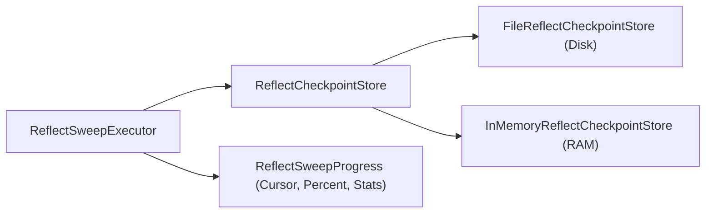

# ADR-0074: Reflect Cognitive Pathway and Sleep Consolidation Architecture

| Field | Value |
|:---|:---|
| **Status** | Accepted (Implemented) |
| **Date** | 2026-08-19 |
| **Authors** | Spector Maintainers & Architecture Working Group |
| **Deciders** | Spector Technical Steering Committee (TSC) |
| **Supersedes** | ADR-0007 |
| **Superseded By** | None |
| **Last Verified** | 2026-09-16 (Verified against `main`) |

---

## 1. Context

In biological neuroscience, memory does not remain static once encoded. During rest and slow-wave / REM sleep cycles, mammalian brains perform two critical restorative functions:
1. **Systems Memory Consolidation**: The hippocampus replays episodic experiences at accelerated speeds (sharp-wave ripples), transferring compressed gists and relational patterns to the neocortex where they crystallize into permanent semantic knowledge.
2. **Synaptic Homeostasis Hypothesis (SHY)**: Synaptic weights that grew during waking learning are systematically downscaled and pruned to restore baseline metabolic energy and prevent neural network saturation.

ADR-0007 established the initial concept of sleep consolidation. This ADR formalizes the concrete production implementation: the declarative `ReflectRecipe`, companion relay specifications, nested pathway admission controls, and the `ReflectSweepExecutor` SPI.

## 2. Problem Statement

Automating long-term consolidation in a high-throughput memory engine introduces difficult architectural challenges:
1. **Ingestion Throttling & Lock Contention**: Replay and abstraction consume significant CPU and LLM resources. Consolidation must never block live user queries or starve foreground `RememberPathway` writes.
2. **Cascading Failure Protection**: When episodic memories are abstracted into semantic gists, the reflection engine calls `RememberPathway` internally. If the write pathway is degraded or full, reflection must throttle itself rather than exacerbating the failure.
3. **Resumable State & Checkpointing**: In production deployments subject to container restarts or Kubernetes pod evictions, deep reflection sweeps across millions of memories must record durable checkpoints (`ReflectCheckpointStore`) to avoid repeating expensive LLM operations.

## 3. Decision Drivers

- **Continuous Cognitive Hygiene**: Automatically compress episodic logs, prune dead graph edges, and bound long-term storage footprint.
- **Nested Pathway Admission Control**: Bound nested calls to the Remember pathway via shared circuit breakers and bulkheads.
- **Pluggable Execution SPI**: Support both in-process background sweeps (`InProcessReflectSweepExecutor`) and external distributed workers via `ReflectSweepExecutor`.

## 4. Considered Options

### Option 1: Unregulated Background Daemon
- A simple background thread running an endless loop calling summarization APIs.
- **Verdict**: Rejected. Starves system resources, risks out-of-memory errors on large partitions, and lacks crash recovery.

### Option 2: External Cron / Spark Job
- Run memory consolidation outside the Spector process via daily batch scripts.
- **Verdict**: Rejected. Destroys real-time episodic-to-semantic lineage tracking, fails to adapt to agent idle cycles, and cannot coordinate with off-heap Panama memory locks.

### Option 3: Declarative 14-Relay ReflectRecipe with Sweep SPI & Checkpoint Store (Selected)
- Implement `ReflectRecipe` with observable gate specifications (`COMPANION_RELAYS_ENABLED`).
- Protect nested `RememberPathway` writes with shared circuit breakers.
- Implement `ReflectSweepExecutor` SPI with persistent checkpointing.
- **Verdict**: Accepted. Provides biological sleep fidelity with bulletproof enterprise operational safety.

## 5. Decision Outcome

Spector standardizes on the **Reflect Cognitive Pathway** composed via `ReflectRecipe.java` and orchestrated by `ReflectPathway.java`.

### 5.1 The 14-Relay Consolidation Pipeline

```mermaid
flowchart TD
    SWEEP(["🌙 Trigger Reflect Sweep (ReflectSweepSpec)"]) --> R1

    subgraph SynapticHomeostasis ["Phase 1: Synaptic Pruning & Gist Extraction"]
        R1["1. SYNAPTIC_PRUNING<br/><i>Downscales weak Hebbian edges (SHY)</i>"] --> R2["2. EPISODIC_CONSOLIDATION<br/><i>Gist extraction via nested Remember</i>"]
        R2 --> R3["3. SOUL_DRIFT_REFUSION<br/><i>Adapts generative prior mean</i>"]
        R3 --> R4["4. PROCEDURAL_CRYSTALLIZATION<br/><i>Automates repeated action sequences</i>"]
    end

    subgraph ConflictAndNormalization ["Phase 2: Conflict Resolution & Normalization"]
        R4 --> R5["5. PROACTIVE_INTERFERENCE<br/><i>Resolves contradictory memory claims</i>"]
        R5 --> R6["6. HEBBIAN_HOMEOSTASIS<br/><i>Normalizes node weight vectors</i>"]
        R6 --> R7["7. TEMPORAL_PRUNING<br/><i>Purges expired ephemeral records</i>"]
    end

    subgraph TopologicalMaintenance ["Phase 3: Topological & Identity Maintenance"]
        R7 --> R8["8. CROSS_LAYER_PROMOTION<br/><i>Promotes working to long-term memory</i>"]
        R8 --> R9["9. ENTITY_MAINTENANCE<br/><i>Compacts entity directory & aliases</i>"]
        R9 --> R10["10. SPECTRAL_SPARSIFICATION<br/><i>Laplacian effective resistance pruning</i>"]
        R10 --> R11["11. MANIFOLD_CONSOLIDATION<br/><i>Riemannian metric tensor updates</i>"]
        R11 --> R12["12. SOFT_IDENTITY_ANCHOR<br/><i>Lyapunov identity stability bounds</i>"]
        R12 --> R13["13. IDIOLECT_LEARNING<br/><i>Attunes linguistic vocabulary style</i>"]
    end

    subgraph DurabilityCommit ["Phase 4: WAL Checkpoint"]
        R13 --> R14["14. WAL_JOURNAL<br/><i>Flushes segments & truncates WAL</i>"]
    end

    R14 --> OUT(["✅ ReflectReport (Consolidated Count, Pruned Edges, Status)"])
```



### 5.2 Nested Pathway Admission Control

When `EpisodicLogConsolidationRelay` and `ProceduralCrystallizationRelay` ingest newly abstracted concepts, they invoke the `RememberPathway` internally. To prevent cascading failures:
```java
// Shared breaker and bulkhead with DreamPathway:
composer.stage(RelayNames.EPISODIC_CONSOLIDATION)
        .relay(logConsolidationRelay)
        .policy(ErrorPolicy.DEGRADE_GRACEFULLY)
        .breaker(PathwayResilience.nestedRemember())
        .bulkhead(PathwayResilience.PATHWAY_REMEMBER,
                PathwayResilience.nestedRememberBulkhead())
        .add();
```
If foreground ingestion saturates the system, the `nestedRemember` breaker trips and reflection gracefully yields without failing or crashing.

### 5.3 Resumable Checkpoints (`ReflectSweepExecutor` SPI)

Reflection sweeps across large partitions run in chunks governed by `ReflectSweepSpec`. The `ReflectCheckpointStore` persists progress:
- `FileReflectCheckpointStore`: Durable JSON checkpoints on disk.
- `InMemoryReflectCheckpointStore`: Lightweight in-process state for testing.



## 6. Pros and Cons of the Options

### Positive
- **Bounded Footprint**: Exponential memory growth is prevented by continuous synaptic downscaling and temporal pruning.
- **Emergent Semantics**: Higher-order knowledge graphs and procedural skills emerge organically from raw conversation history.
- **Crash-Resilient**: Sweeps resume exactly from their last persisted cursor after a restart.

### Negative / Trade-offs
- **Token Costs**: High-volume episodic reflection invokes LLM summarization prompts, requiring configuration of sweep frequencies and token budgets.

## 7. Implementation Plan

- Author `ReflectRecipe` replacing legacy positional constructors.
- Provide `ReflectSweepExecutors` SPI registry.
- Enforce thorough unit testing in `ReflectPathwayTest`, `ReflectCheckpointTest`, and `ReflectSweepExecutorsTest`.

## 8. Code Reference & Verification

- **Recipe Definition**: `memory/spector-memory/src/main/java/com/spectrayan/spector/memory/pathway/reflect/relay/ReflectRecipe.java`
- **Pathway Orchestrator**: `memory/spector-memory/src/main/java/com/spectrayan/spector/memory/pathway/reflect/ReflectPathway.java`
- **Sweep SPI**: `memory/spector-memory/src/main/java/com/spectrayan/spector/memory/pathway/reflect/spi/ReflectSweepExecutor.java`
- **Checkpointing**: `memory/spector-memory/src/main/java/com/spectrayan/spector/memory/pathway/reflect/ReflectCheckpoint.java`
- **Unit Verification**: `memory/spector-memory/src/test/java/com/spectrayan/spector/memory/pathway/reflect/ReflectPathwayTest.java` and `ReflectCheckpointTest.java`
