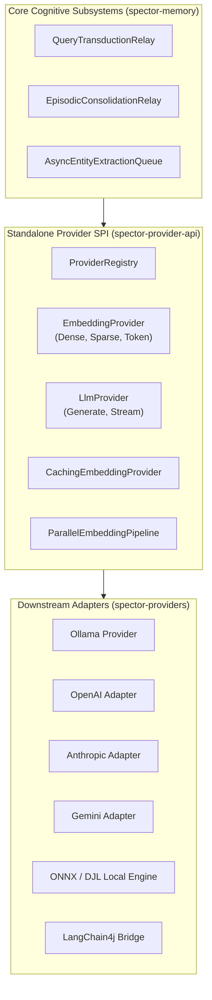

# ADR-0075: Extensible LLM and Multimodal Embedding Provider SPI

| Field | Value |
|:---|:---|
| **Status** | Accepted (Implemented) |
| **Date** | 2026-08-20 |
| **Authors** | Spector Maintainers & Architecture Working Group |
| **Deciders** | Spector Technical Steering Committee (TSC) |
| **Supersedes** | None |
| **Superseded By** | None |
| **Last Verified** | 2026-09-16 (Verified against `main`) |

---

## 1. Context

Spector requires high-throughput neural representations and generative models for cognitive operations:

- Query and document vectorization (dense embeddings)
- Lexical learned sparse representations (SPLADE / BM25-hybrid sparse vectors)
- Multi-vector late interaction representations (ColBERT token-level embeddings)
- Knowledge graph entity extraction and sleep reflection summarization (LLM text generation)
- Phenomenological and speech prosody synthesis (multimodal audio and vision blocks)

Directly coupling the memory kernel to specific cloud vendor SDKs (such as OpenAI, Anthropic, Google Gemini) or specific runtime frameworks introduces heavy dependency bloat, security vulnerability exposure, and breaks standalone in-process deployments.

## 2. Problem Statement

The provider integration layer must fulfill several strict architectural criteria:

1. **Complete Vendor Decoupling**: Core modules (`spector-core`, `spector-kernel`, `spector-memory`) must depend exclusively on a clean, minimal SPI with zero external HTTP client or vendor library dependencies.
2. **Multimodal Content Representation**: Seamless support for structured multimodal content blocks (`TextContent`, `ImageContent`, `AudioContent`, `DocumentContent`) across chat and completion requests.
3. **High-Throughput Parallel Batch Pipelines**: Batch embedding generation must support non-blocking asynchronous pipelining (`ParallelEmbeddingPipeline`) and client-side LRU caching (`CachingEmbeddingProvider`) to saturate GPU/accelerator inference throughput.
4. **Health Checking & Circuit Breakers**: Live probing of provider availability (`ProviderHealth`), automatic degradation, and fallback routing.

## 3. Decision Drivers

- **Zero Core Dependency Bloat**: Keep `spector-provider-api` pure Java SE without external transitive dependencies.
- **Support for Local & Cloud Backends**: Seamless operation whether running against in-process local models (ONNX Runtime, Deep Java Library, llama.cpp) or cloud endpoints (OpenAI, Vertex AI, Anthropic, Bedrock).
- **Extensible Factory Registry**: Dynamic provider discovery using Java `ServiceLoader` SPI or manual registration in `ProviderRegistry`.

## 4. Considered Options

### Option 1: Direct Framework Binding (Spring AI / LangChain4j Direct)

- Standardize all embedding and LLM calls on Spring AI or LangChain4j core classes.
- **Verdict**: Rejected for core modules. Introduces massive transitive dependency graphs, Jackson version conflicts, and prevents lightweight embedded use cases.

### Option 2: Hardcoded HTTP REST Clients per Vendor

- Implement custom HTTP clients inside `spector-memory` for each vendor.
- **Verdict**: Rejected. Inflexible, causes code duplication, and breaks whenever vendor APIs evolve.

### Option 3: Lightweight Extensible SPI (`spector-provider-api`) (Selected)

- Introduce a dedicated, standalone reactor module `memory/spector-provider-api`.
- Provide abstract contracts for dense, sparse, and token embeddings, along with multimodal LLM generation.
- Implement vendor bridges in downstream extension modules (`memory/spector-providers`).
- **Verdict**: Accepted. Complete isolation, maximum testability, and pluggable architecture.

## 5. Decision Outcome

Spector standardizes on the **Extensible Provider SPI** housed in `memory/spector-provider-api`.

### 5.1 Architecture Overview



### 5.2 Key Contract Interfaces

1. **`EmbeddingProvider` Hierarchy**:
    - `EmbeddingProvider`: Computes fixed-dimension dense vector embeddings for input text.
    - `SparseEmbeddingProvider`: Generates sparse lexical weight vectors (SPLADE style) for hybrid inverted indexes.
    - `TokenEmbeddingProvider`: Produces multi-vector token embeddings for ColBERT late-interaction reranking.
    - `ParallelEmbeddingPipeline`: Manages asynchronous queue dispatch, batching inputs up to `batchSize` before issuing vectorized network/SIMD calls.
    - `CachingEmbeddingProvider`: Thread-safe caching wrapper eliminating redundant embedding calls for identical text gists.

2. **`LlmProvider` Hierarchy**:
    - `LlmProvider`: Handles synchronous and streaming completions with `LlmRequest` containing structured `ChatMessage` records.
    - `GenerationOptions`: Parameterizes temperature, top-P, frequency penalty, presence penalty, and max output tokens.

3. **Multimodal Data Model**:
    - Content blocks encapsulate polymorphic modalities: `TextContent`, `ImageContent` (MIME type + base64/URL), `AudioContent`, and `DocumentContent`.

### 5.3 Provider Registry & Health Lifecycle

```java
// Registration via SPI or programmatic setup
ProviderRegistry registry = ProviderRegistry.getInstance();
registry.registerEmbeddingProvider("default", myEmbeddingProvider);
registry.registerLlmProvider("default", myLlmProvider);

// Periodic health evaluation
ProviderHealth health = provider.checkHealth();
if (!health.isAvailable()) {
    log.warn("Provider unavailable: {}", health.getErrorMessage());
}
```

## 6. Pros and Cons of the Options

### Positive

- **Modular Purity**: Foundation modules build fast and remain free from third-party client dependency churn.
- **Pluggability**: End users can swap from cloud models (Claude/GPT-4) to entirely local, air-gapped models (Ollama/Llama 3/vLLM) with a single configuration flag.
- **Resilience**: Client-side caching and parallel pipelining significantly reduce external API costs and latency.

### Negative / Trade-offs

- **Adapter Maintenance**: Requires maintaining adapter bridges in `spector-providers` to translate between `spector-provider-api` models and vendor-specific wire formats.

## 7. Implementation Plan

- Maintain `memory/spector-provider-api` as a standalone Maven module with zero compile dependencies beyond Java SE.
- Implement downstream providers in `memory/spector-providers` (including LangChain4j and Ollama integrations).
- Verify in test suites using `FakeEmbeddingProvider` and mock generation harnesses.

## 8. Code Reference & Verification

- **Registry & Config**: `memory/spector-provider-api/src/main/java/com/spectrayan/spector/provider/ProviderRegistry.java` and `ProviderConfig.java`
- **Embedding SPI**: `memory/spector-provider-api/src/main/java/com/spectrayan/spector/provider/embedding/`
- **Generation SPI**: `memory/spector-provider-api/src/main/java/com/spectrayan/spector/provider/generation/`
- **Multimodal Models**: `memory/spector-provider-api/src/main/java/com/spectrayan/spector/provider/model/`
- **Provider Implementations**: `memory/spector-providers/`
