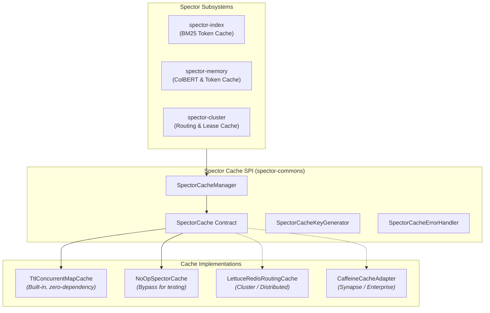

# ADR-0076: Zero-Dependency Pluggable Cache Abstraction

| Field | Value |
|:---|:---|
| **Status** | Accepted (Implemented) |
| **Date** | 2026-08-21 |
| **Authors** | Spector Maintainers & Architecture Working Group |
| **Deciders** | Spector Technical Steering Committee (TSC) |
| **Supersedes** | None |
| **Superseded By** | None |
| **Last Verified** | 2026-09-16 (Verified against `main`) |

---

## 1. Context

Across Spector subsystems, caching is essential for microsecond latency:
- In `spector-index`, tokenized BM25 query terms and HNSW entry points require fast lookups.
- In `spector-memory`, ColBERT multi-vector token embeddings and episodic deduplication hashes must avoid repeated computation.
- In `spector-cluster`, namespace lease ownership and routing tables require sub-millisecond resolution with TTL invalidation.

However, binding low-level foundation modules (`spector-commons`, `spector-core`, `spector-kernel`) directly to enterprise caching frameworks (such as Spring Cache, Caffeine, or Jedis/Lettuce Redis) introduces massive dependency bloat and makes running Spector in lightweight embedded environments (CLI tools, unit tests, mobile/edge SDKs) impossible.

## 2. Problem Statement

Spector requires a caching architecture that meets three strict criteria:

1. **Zero Framework Dependencies**: The core caching abstraction must reside in `nucleus/spector-commons` and depend only on the Java Standard Edition runtime.
2. **High-Performance In-Process Default**: Provide an out-of-the-box in-memory implementation supporting non-blocking concurrent reads, lock-amortized writes, and configurable Time-To-Live (TTL) expiration.
3. **Enterprise Pluggability**: Allow enterprise host environments (such as Spring Boot `spector-synapse` or distributed Kubernetes clusters) to seamlessly substitute distributed cache backends (e.g., Redis) without changing a single line of memory kernel code.

## 3. Decision Drivers

- **Purity of Foundation Layer**: Foundation modules must remain lightweight and standalone.
- **Type-Safe Generic Contracts**: Pluggable operations must support strongly-typed getters (`Optional<T> get(String key, Class<T> targetClass)`) and atomic compute-if-absent loaders (`get(key, class, valueLoader)`).
- **Graceful Error Handling**: Cache failures must be isolatable via `SpectorCacheErrorHandler` to prevent transient cache network errors from crashing core memory pipelines.

## 4. Considered Options

### Option 1: Direct Dependency on Caffeine
- Add `com.github.ben-manes.caffeine:caffeine` to `spector-commons`.
- **Verdict**: Rejected for the foundation module. While Caffeine is exceptionally fast, adding third-party bytecode to `spector-commons` violates zero-dependency architectural rules and complicates Panama FFM integration on non-standard JVM builds.

### Option 2: Java Standard Map (`ConcurrentHashMap`) Directly
- Use raw `ConcurrentHashMap` instances wherever caching is needed.
- **Verdict**: Rejected. Lacks TTL expiration, has no eviction policies, creates memory leaks in long-running daemons, and cannot be monitored or swapped for Redis.

### Option 3: Zero-Dependency `SpectorCache` SPI with Built-in TTL Concurrent Engine (Selected)
- Define a lightweight SPI (`SpectorCache`, `SpectorCacheManager`).
- Ship a native, zero-dependency `TtlConcurrentMapCache` in `spector-commons`.
- Allow downstream enterprise modules (`spector-cluster`, `spector-synapse`) to provide Redis or Caffeine implementations.
- **Verdict**: Accepted. Delivers maximum performance in standalone setups while enabling enterprise distribution.

## 5. Decision Outcome

Spector standardizes on the **SpectorCache Architecture** in `nucleus/spector-commons/src/main/java/com/spectrayan/spector/commons/cache/`.

### 5.1 Architecture Diagram



### 5.2 The Built-in `TtlConcurrentMapCache`

The default implementation (`TtlConcurrentMapCache.java`) delivers thread-safe TTL caching using pure Java SE:
- Backed by `ConcurrentHashMap<String, CacheEntry>`.
- Entries record a creation timestamp and monotonic millisecond expiration point ($t_{\\text{expire}} = t_{\\text{now}} + \\text{TTL}$).
- Reads verify expiration non-blockingly; expired entries are lazily removed upon access.
- An asynchronous background cleaner daemon sweeps expired entries at intervals, preventing memory leaks when keys are written but never subsequently queried.

### 5.3 Type-Safe Atomic Ingestion

```java
// Atomic compute-if-absent eliminates cache stampedes on expensive embedding calculations:
List<float[]> tokenVectors = cache.get(
    "token:" + term,
    (Class<List<float[]>>) (Class<?>) List.class,
    () -> model.computeTokenEmbeddings(term)
);
```

## 6. Pros and Cons of the Options

### Positive
- **Zero Transitive Baggage**: Applications embedding `spector-core` or `spector-commons` bring zero third-party JARs.
- **Predictable Garbage Collection**: Standalone caches avoid complex background eviction threads unless explicitly configured.
- **Uniform Key Generation**: `SpectorCacheKeyGenerator` provides consistent hashing across parameters, arrays, and complex records.

### Negative / Trade-offs
- **Simpler Eviction**: The default `TtlConcurrentMapCache` implements TTL expiration but not W-TinyLFU eviction. High-churn working sets requiring advanced frequency eviction use the Caffeine adapter in `spector-synapse`.

## 7. Implementation Plan

- Implement `SpectorCache` and `TtlConcurrentMapCache` in `spector-commons`.
- Validate TTL expiration and thread safety in `TtlConcurrentMapCacheTest` and `SpectorCacheKeyGeneratorTest`.
- Integrate into `spector-index` and `spector-memory` retrieval pipelines.

## 8. Code Reference & Verification

- **Contract Interface**: `nucleus/spector-commons/src/main/java/com/spectrayan/spector/commons/cache/SpectorCache.java`
- **Cache Manager**: `nucleus/spector-commons/src/main/java/com/spectrayan/spector/commons/cache/SpectorCacheManager.java`
- **TTL Implementation**: `nucleus/spector-commons/src/main/java/com/spectrayan/spector/commons/cache/TtlConcurrentMapCache.java`
- **Key Generator**: `nucleus/spector-commons/src/main/java/com/spectrayan/spector/commons/cache/SpectorCacheKeyGenerator.java`
- **Unit Verification**: `nucleus/spector-commons/src/test/java/com/spectrayan/spector/commons/cache/TtlConcurrentMapCacheTest.java` and `SpectorCacheKeyGeneratorTest.java`
