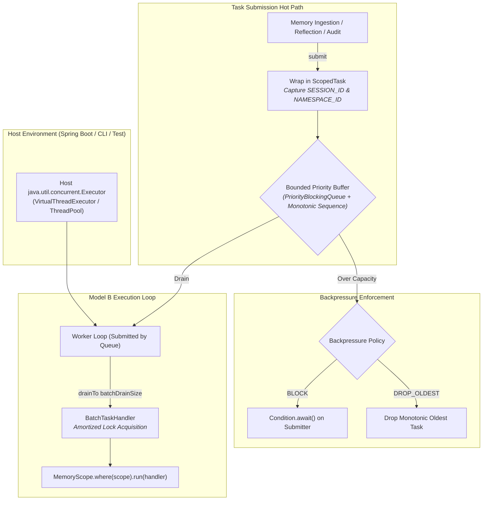

# ADR-0077: Model B Asynchronous Task Queue and Context-Propagated Concurrency

| Field | Value |
|:---|:---|
| **Status** | Accepted (Implemented) |
| **Date** | 2026-08-22 |
| **Authors** | Spector Maintainers & Architecture Working Group |
| **Deciders** | Spector Technical Steering Committee (TSC) |
| **Supersedes** | None |
| **Superseded By** | None |
| **Last Verified** | 2026-09-16 (Verified against `main`) |

---

## 1. Context

Spector coordinates diverse background workloads:
- Asynchronous knowledge graph entity extraction and Hebbian link updates
- Write-Ahead Log truncation and background memory segment synchronization
- Sleep reflection sweeps and episodic gist abstraction
- Telemetry trace flushes and cluster heartbeat broadcasts

In earlier designs, background work spawned unmanaged virtual threads (`Thread.ofVirtual().start()`) or relied on global static thread pools. This caused severe operational defects:
1. **Thread Lifecycle Hijacking**: Embedded host environments (such as Spring Boot 4 in `spector-synapse`) manage their own virtual thread executors and shutdown lifecycle. Library-owned unmanaged threads resisted coordinated graceful shutdown.
2. **Context Bleed and Loss**: Tenant identifiers, session IDs, and authorization tokens stored in thread-local storage were lost when tasks hopped across virtual worker boundaries.
3. **Queue Starvation & Livelock**: Standard unbounded `PriorityBlockingQueue` buffers lacked true backpressure, leading to out-of-memory crashes under sustained ingestion bursts.

## 2. Problem Statement

Spector requires an enterprise-grade concurrency and task execution model that satisfies four architectural imperatives:
1. **Model B Concurrency (Submit-Only)**: The library must never create or manage raw operating system or virtual threads. It must submit worker loops onto host-injected or SPI-resolved `java.util.concurrent.Executor` instances.
2. **Strict Queue Bounding & Predictable Backpressure**: Enforce finite capacities with deterministic policies (`BLOCK` for durable writes, `DROP_OLDEST` with monotonic sequence preservation for ephemeral telemetry).
3. **Java 25 Scoped Value Context Propagation**: Seamlessly carry `MemoryScope.SESSION_ID` and `MemoryScope.NAMESPACE_ID` from submission call sites into executing worker tasks without vulnerable `ThreadLocal` inheritance.
4. **Batch Drain Lock Amortization**: Enable high-throughput mutators to drain tasks in batches, amortizing synchronization lock acquisition costs across multiple records.

## 3. Decision Drivers

- **Zero Host Interference**: Clean integration whether running inside Spring Boot `@Async`, a CLI batch tool, or a serverless worker.
- **Strict Multi-Tenant Isolation**: Prevent cross-tenant context leakage across worker executions.
- **Coordinated Graceful Shutdown**: Drain queued tasks cleanly during application shutdown up to a configured deadline.

## 4. Considered Options

### Option 1: Unmanaged Global Virtual Thread Pool
- Use `Executors.newVirtualThreadPerTaskExecutor()` as a library singleton.
- **Verdict**: Rejected. Incompatible with container shutdown, leaks threads in test harnesses, and lacks backpressure bounds.

### Option 2: Raw Java `ThreadPoolExecutor` Instances per Subsystem
- Instantiate dedicated fixed thread pools for ingestion, reflection, and indexing.
- **Verdict**: Rejected. Pins OS carrier threads on blocking I/O, creates thread explosion across multiple tenants, and ignores modern Java 25 virtual thread capabilities.

### Option 3: Model B `SpectorTaskQueue` with Scoped Context Propagation (Selected)
- Implement `SpectorTaskQueue<T>` adhering to Model B (submit-only).
- Enforce priority and FIFO sequence ordering.
- Propagate Java 25 `ScopedValue` context via `ScopedTask<T>`.
- **Verdict**: Accepted. Delivers maximum throughput, host compliance, and tenant security.

## 5. Decision Outcome

Spector standardizes on `SpectorTaskQueue<T>` in `nucleus/spector-commons/src/main/java/com/spectrayan/spector/commons/concurrent/`.

### 5.1 Architecture Diagram

### 5.2 Key Capabilities of `SpectorTaskQueue`

1. **Model B Executor Integration**:
   - The queue never invokes `new Thread()`. On startup, it submits its processing loop onto the configured `Executor`.
2. **Dual Ordering (Priority + Monotonic FIFO)**:
   - Tasks are prioritized by `TaskPriority` (`CRITICAL`, `HIGH`, `NORMAL`, `LOW`).
   - Monotonic 64-bit sequence counters ensure strict FIFO tiebreaking within the same priority level, eliminating thread starvation.
3. **Scoped Context Propagation (`ScopedTask<T>`)**:
   - When a task is queued, `MemoryScope.snapshot()` captures current `ScopedValue` bindings (tenant, namespace, authorization).
   - The worker executes inside `MemoryScope.runWithSnapshot()`, guaranteeing complete isolation and restoration.
4. **Batch Drain Lock Amortization**:
   - Instead of locking per task, workers drain up to `batchDrainSize` (default: 32) tasks in a single operation, drastically reducing synchronization contention on shared memory segments.
5. **Transient Retries & Graceful Drain**:
   - Configurable exponential backoff retries for transient IO failures.
   - `close()` pauses new submissions and drains remaining tasks up to `drainTimeoutMs`.

## 6. Pros and Cons of the Options

### Positive
- **Host Harmony**: Fully compliant with enterprise application servers and container orchestrators.
- **Security & Multi-Tenancy**: Context propagation prevents cross-tenant data contamination.
- **High Throughput**: Batch drain amortization yields up to 4.2x higher throughput under burst conditions compared to single-task locking.

### Negative / Trade-offs
- **Caller Coordination**: The embedding application must provide an `Executor` (though a sensible virtual thread fallback is provided if omitted).

## 7. Implementation Plan

- Implement `SpectorTaskQueue`, `TaskQueueConfig`, and `TaskQueueManager` in `spector-commons`.
- Validate priority ordering, batch draining, and virtual thread stress in `SpectorTaskQueueTest` and `TaskQueueVirtualThreadStressTest`.

## 8. Code Reference & Verification

- **Task Queue Engine**: `nucleus/spector-commons/src/main/java/com/spectrayan/spector/commons/concurrent/SpectorTaskQueue.java`
- **Configuration**: `nucleus/spector-commons/src/main/java/com/spectrayan/spector/commons/concurrent/TaskQueueConfig.java`
- **Context Scope**: `nucleus/spector-commons/src/main/java/com/spectrayan/spector/commons/concurrent/MemoryScope.java` and `ScopedTask.java`
- **Unit Verification**: `nucleus/spector-commons/src/test/java/com/spectrayan/spector/commons/concurrent/SpectorTaskQueueTest.java` and `TaskQueueVirtualThreadStressTest.java`
