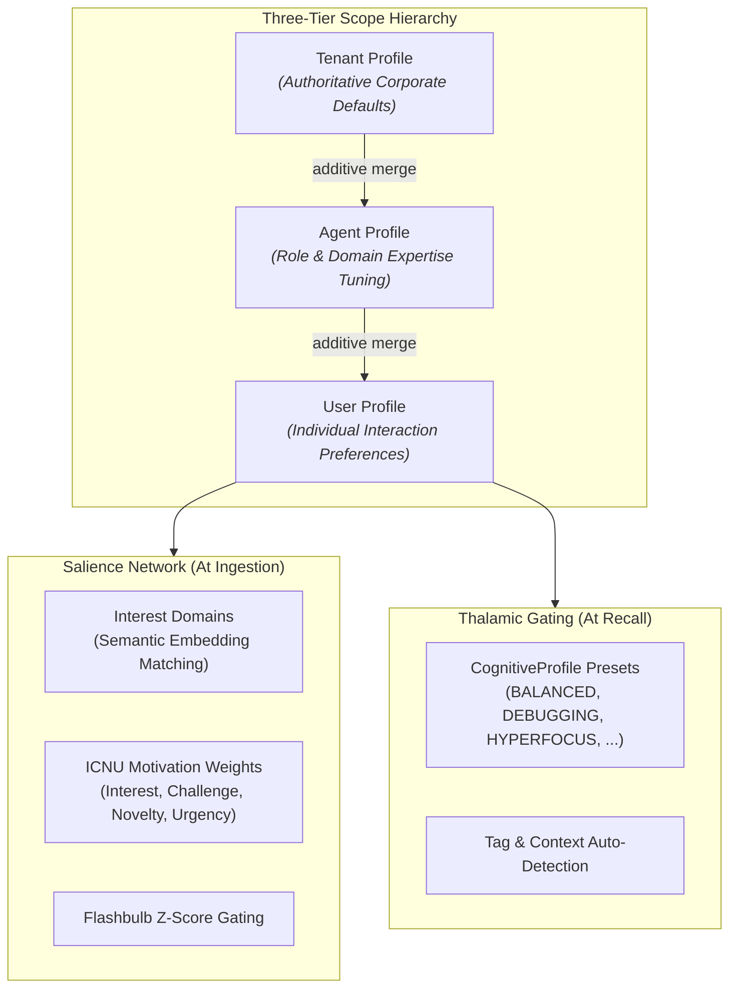

# ADR-0078: Salience Network and Thalamic Cognitive Profiles Architecture

| Field | Value |
|:---|:---|
| **Status** | Accepted (Implemented) |
| **Date** | 2026-08-23 |
| **Authors** | Spector Maintainers & Architecture Working Group |
| **Deciders** | Spector Technical Steering Committee (TSC) |
| **Supersedes** | None |
| **Superseded By** | None |
| **Last Verified** | 2026-09-16 (Verified against `main`) |

---

## 1. Context

In mammalian cognitive neurobiology, the brain does not allocate equal computational resources to all incoming stimuli:
1. **The Salience Network** (anchored in the anterior insula and dorsal anterior cingulate cortex) acts as an executive sensory filter, continuously evaluating perceptions against internal goals and emotional drives. A firefighter instantly flags the faint smell of smoke as critical while ignoring background conversations.
2. **Thalamic Gating**: The thalamus modulates which signals reach the cerebral cortex based on current cognitive state. During focused bug fixing, error signals are amplified while unrelated memories are suppressed; during creative brainstorming, filters broaden to allow distant associative analogies.

Earlier memory systems lacked structured attention modeling, forcing AI agents to treat every ingested and recalled memory with flat, static weights. Spector introduces computational salience and thalamic gating through `SalienceProfile` and `CognitiveProfile`.

## 2. Problem Statement

Modeling cognitive attention in AI agents introduces three concrete engineering problems:
1. **Multi-Tier Scope Governance**: An enterprise deployment must enforce organizational memory guidelines (`Tenant`), while allowing specialized agents (`Agent`, e.g., Senior Architect vs. Support Bot) and individual human users (`User`) to customize attention priorities.
2. **Natural Language Interest Matching**: Users express interests in natural language (e.g., *"Kubernetes network policies"*), not rigid database tags. Matching must be semantic, vector-based, and pre-computed to avoid runtime latency.
3. **Neurodivergent & Task-Specific Cognitive Profiles**: Different cognitive tasks require radically different retrieval regimes (e.g., debugging needs recent errors, deep research needs zero time decay, creative exploration needs lateral jumps).

## 3. Decision Drivers

- **Zero Ingestion Latency Penalty**: Interest vectors must be pre-embedded when profiles are configured so runtime salience checks require only fast dot products.
- **Strict Scope Inheritance**: Profile settings must merge additively from Tenant &rarr; Agent &rarr; User, with tenant policies maintaining ultimate veto authority.
- **Biologically Plausible Presets**: Ship battle-tested cognitive profiles out-of-the-box so developers do not need to manually calibrate alpha/beta weights.

## 4. Considered Options

### Option 1: Rule-Based Keyword Scoring
- Use regex rules and string matching to boost memory importance.
- **Verdict**: Rejected. Fragile, misses synonyms and paraphrases, and fails across multilingual or technical contexts.

### Option 2: Monolithic LLM Gating Call
- Prompt an LLM on every write and recall to evaluate relevance and attention.
- **Verdict**: Rejected. Prohibitively slow (adding 500–1,500ms per operation) and incurs massive token costs.

### Option 3: Two-Tier Salience & Thalamic Profile Architecture (Selected)
- Implement `SalienceProfile` for entity-level interest vectors, ICNU motivation weights, and flashbulb thresholds.
- Implement `CognitiveProfile` for thalamic gating parameters ($\\alpha$ similarity, $\\beta$ decay/importance, valence windows, decay damping).
- **Verdict**: Accepted. Delivers microsecond semantic attention modulation directly inside off-heap memory scans.

## 5. Decision Outcome

Spector standardizes on the **Salience Network and Cognitive Profile Architecture** in `memory/spector-memory/src/main/java/com/spectrayan/spector/memory/model/`.

### 5.1 Architecture Overview



### 5.2 SalienceProfile: Semantic Interest Matching

Interests and disinterests are defined in natural language and resolved into dense vector embeddings:
- `InterestLevel.CRITICAL`: 2.0x boost
- `InterestLevel.HIGH`: 1.5x boost
- `InterestLevel.MEDIUM`: 1.2x boost
- `InterestLevel.LOW`: 0.8x suppression
- `InterestLevel.IGNORE`: 0.0x total suppression

At ingestion:
$$\\text{Boost} = \\text{Multiplier} \\cdot \\cos(\\vec{v}_{\\text{memory}}, \\vec{v}_{\\text{interest}})$$
If the similarity exceeds `similarityThreshold` (default: 0.5), importance is dynamically scaled:
$$\\text{Importance}_{\\text{final}} = \\text{Importance}_{\\text{base}} \\cdot \\text{Boost}$$

### 5.3 CognitiveProfile Presets & Thalamic Modulation

| Profile | $\\alpha$ (Similarity) | $\\beta$ (Importance) | Decay Damping | Valence Range | Description |
|:---|:---:|:---:|:---:|:---:|:---|
| `BALANCED` | 0.6 | 0.4 | 0.3 | Full Range | General-purpose recall balancing relevance and significance |
| `EXPLORING` | 0.8 | 0.2 | 0.1 | Full Range | High semantic associativity for brainstorming and analogies |
| `DEBUGGING` | 0.3 | 0.7 | 0.5 | $[-128, -10]$ | Prioritizes recent errors, bugs, and negative valence events |
| `RECALLING` | 0.4 | 0.6 | 0.3 | $[+10, +127]$ | Prioritizes proven patterns, templates, and past successes |
| `CRITICAL` | 0.2 | 0.8 | 0.4 | Full Range | High-stakes recall where importance outweighs proximity |
| `HYPERFOCUS` | 1.0 | 0.0 | 0.0 | Full Range | **Monotropism**: pure similarity, zero time decay across all eras |
| `SYSTEMATIZER`| 0.3 | 0.7 | 0.3 | Full Range | **Bottom-up processing**: lossless detail retention and pinning |
| `DIVERGENT` | 0.7 | 0.3 | 0.2 | Full Range | Lateral/orthogonal retrieval across conceptual clusters |
| `ICNU` | Adaptive | Adaptive | 0.3 | Full Range | ADHD motivation model: Interest, Challenge, Novelty, Urgency |

### 5.4 Automatic Profile Detection

Profiles can be explicitly requested or automatically detected from query tags:
```java
// Automatic detection via tag heuristics
CognitiveProfile detected = CognitiveProfile.detect("bug", "exception", "database");
// -> CognitiveProfile.DEBUGGING
```

## 6. Pros and Cons of the Options

### Positive
- **Human-Like Focus**: Enables agents to emulate human selective attention, focusing deeply on mission tasks without memory pollution.
- **Fast Execution**: Pre-computed embeddings ensure salience scoring adds negligible overhead (< 2 microseconds) to off-heap scans.
- **Neurodiversity Representation**: First-class computational models of monotropic hyperfocus and bottom-up systematizing.

### Negative / Trade-offs
- **Profile Tuning**: Advanced custom profiles require understanding the interaction between $\\alpha$, $\\beta$, and temporal decay parameters.

## 7. Implementation Plan

- Maintain `SalienceProfile` and `CognitiveProfile` records in `spector-memory`.
- Verify profile property bounds in `CognitiveProfilePropertyTest` and `CognitiveProfileTest`.
- Benchmark retrieval accuracy across profiles in `LongMemEvalSingleProfileBenchmarkTest`.

## 8. Code Reference & Verification

- **Salience Profile**: `memory/spector-memory/src/main/java/com/spectrayan/spector/memory/model/SalienceProfile.java`
- **Cognitive Profile**: `memory/spector-memory/src/main/java/com/spectrayan/spector/memory/model/CognitiveProfile.java`
- **Interest Domains**: `memory/spector-memory/src/main/java/com/spectrayan/spector/memory/model/InterestDomain.java`
- **ICNU Weights**: `memory/spector-memory/src/main/java/com/spectrayan/spector/memory/neuromod/neurodivergent/IcnuWeights.java`
- **Unit Verification**: `memory/spector-memory/src/test/java/com/spectrayan/spector/memory/CognitiveProfileTest.java` and `CognitiveProfileConfigTest.java`
