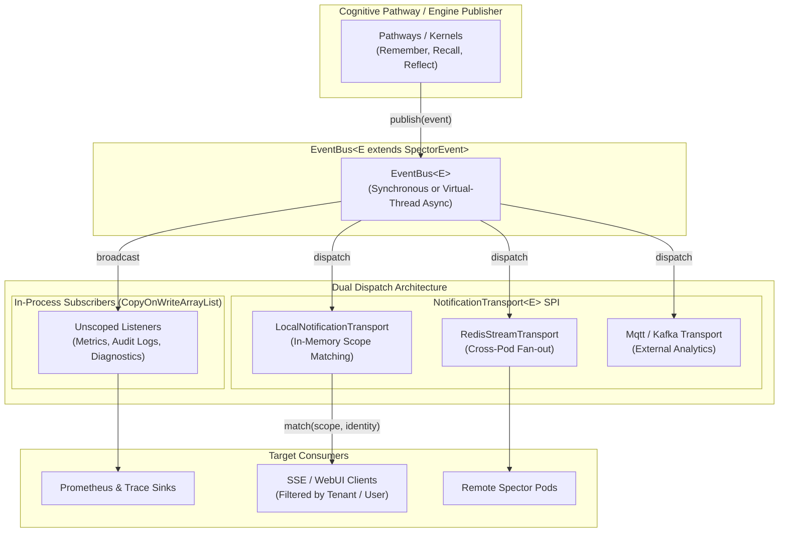
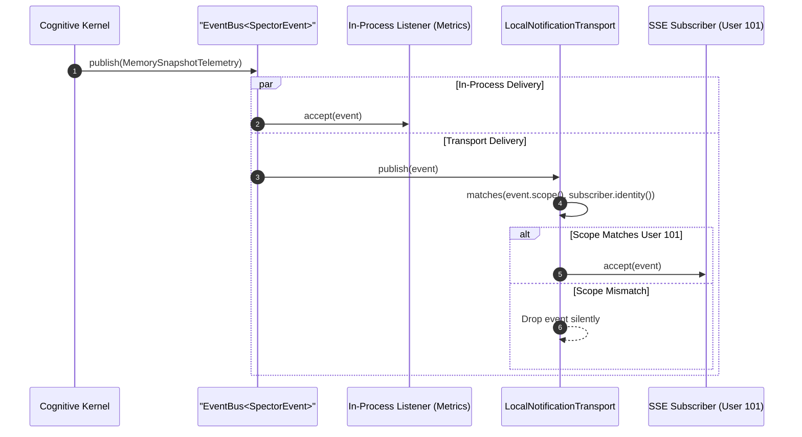

# ADR-0079: Asynchronous Memory Event and Telemetry Notification Bus

| Field | Value |
|:---|:---|
| **Status** | Accepted (Implemented) |
| **Date** | 2026-08-25 |
| **Authors** | Spector Maintainers & Architecture Working Group |
| **Deciders** | Spector Technical Steering Committee (TSC) |
| **Supersedes** | None |
| **Superseded By** | None |
| **Last Verified** | 2026-09-16 (Verified against `main`) |

---

## 1. Context

In an autonomous cognitive memory engine, memory operations generate continuous state transitions, telemetry signals, and diagnostic events:
1. **Lifecycle & Topology Events**: Node startup, cell failover, snapshot persistence, and cluster topology rebalancing.
2. **Cognitive Operations**: Memory consolidation checkpoints, engram pruning, episodic session boundaries, and graph pulse activations.
3. **Execution Telemetry**: Vector SIMD acceleration metrics, GPU offload timings, embedding projection latencies, and query trace trees.

External consumers—ranging from Server-Sent Events (SSE) web UI clients, Prometheus metrics bridges, distributed tracing sinks, and Kafka streaming pipelines—require immediate notification of these events. However, coupling cognitive storage kernels directly to network transports or UI consumers introduces blocking latency, memory leaks, and severe architectural entanglement.

## 2. Problem Statement

Designing an event notification bus for Spector presents several hard constraints:
1. **Zero Impact on Hot Path**: Memory operations (remember, recall, reflect) execute on high-frequency threads. Event dispatch must never stall the engine, block on slow HTTP/SSE subscribers, or propagate unhandled consumer exceptions back into the memory pipeline.
2. **Multi-Tenant Scope Isolation**: Spector operates in multi-tenant enterprise environments. Events contain sensitive metadata (e.g., query traces, memory keys, session transcripts). Delivery must enforce strict scope-based authorization (`NotificationScope` vs. `SubscriberIdentity`) to prevent data leakage across tenant or user boundaries.
3. **Topology Agnosticism**: Spector deploys in two distinct operational topologies:
   - **Single-pod / Embedded**: Running inside an agent microservice where in-memory dispatch is sufficient.
   - **Distributed Clustered**: Running across multiple pods where events published on Pod A must reach subscribers connected to Pod B via distributed brokers (Redis Streams, NATS, Kafka).
4. **Deprecation of Fragmented Legacy Busses**: Prior releases maintained separate static or singleton busses (such as `TelemetryBus`), which lacked generic type safety, scope filtering, and multi-transport capabilities.

## 3. Decision Drivers

- **Clean Decoupling**: Cognitive pathways publish events using pure domain objects (`SpectorEvent`) without knowledge of who listens or how events are delivered.
- **Fail-Safe Subscriber Isolation**: A malfunctioning, slow, or exception-throwing subscriber must never crash or disrupt core memory mutations.
- **Zero Mandatory External Dependencies**: Embedded deployments must function out-of-the-box with pure Java in-memory transports, with no mandatory broker dependencies.
- **Extensible SPI Architecture**: Transport mechanisms must implement a clean SPI (`NotificationTransport<E>`) to allow pluggable distributed brokers (Redis, Kafka, MQTT, Camel).
- **Virtual Thread Concurrency**: Asynchronous dispatch must leverage Java 25 virtual threads via `ConcurrentTasks` to achieve high throughput without thread starvation.

## 4. Considered Options

### Option 1: Third-Party Messaging Frameworks (Guava EventBus / Spring ApplicationEvents)
- **Description**: Adopt off-the-shelf in-memory event busses like Guava or Spring Events.
- **Advantages**: Pre-built library code, widely known APIs.
- **Disadvantages**: Heavy reflection, lacks multi-tenant scope filtering, introduces unnecessary third-party dependencies into the core `nucleus` module, and does not support multi-pod transport fan-out.

### Option 2: Mandatory External Distributed Broker (Kafka / Redis Streams)
- **Description**: Route all events directly through an external distributed broker.
- **Advantages**: Native multi-pod clustering, durable message persistence.
- **Disadvantages**: Prohibitive infrastructure overhead for embedded, edge, or local developer testing; unacceptable network round-trip overhead on high-frequency internal telemetry.

### Option 3: Pluggable Dual-Dispatch EventBus with NotificationTransport SPI (Selected)
- **Description**: Implement a lightweight, zero-dependency generic `EventBus<E extends SpectorEvent>` supporting both in-process broadcast consumers and scope-aware `NotificationTransport` plugins, with optional virtual-thread asynchronous dispatch.
- **Advantages**: Zero third-party dependencies, single-pod and multi-pod compatibility, strict multi-tenant scope gating, fail-safe exception isolation, and seamless migration from legacy `TelemetryBus`.

## 5. Decision Outcome

Spector standardizes on the **Generic EventBus and NotificationTransport Architecture** located in `nucleus/spector-events/src/main/java/com/spectrayan/spector/events/`.

### 5.1 Architecture Overview

### 5.2 Core Components & Contracts

1. **`SpectorEvent` & `SpectorTelemetryEvent`**:
   - Base domain interfaces for all event signals.
   - Requires `Instant timestamp()` and `NotificationScope scope()`.
   - Concrete implementations include `GraphPulseTelemetry`, `MemorySnapshotTelemetry`, `QueryTraceTelemetry`, `ReflectCycleTelemetry`, `SimdKernelTelemetry`, and `ClusterTopologyTelemetry`.

2. **`EventBus<E extends SpectorEvent>`**:
   - Central generic hub managing two consumer registries:
     - `subscribers`: List of `Consumer<E>` receiving all events without scope filtering (used for metrics, diagnostics, and audit logs).
     - `transports`: List of `NotificationTransport<E>` instances handling scope-filtered delivery.
   - Configurable dispatch modes:
     - **Synchronous** (default): Delivered on publisher thread for low-latency in-memory scenarios.
     - **Asynchronous** (opt-in via `-Dspector.events.async=true`): Dispatched on virtual threads via `ConcurrentTasks.fireAndForget()` to guarantee zero latency on the publishing thread.
   - Strict error isolation: Consumer exceptions are caught and logged at `DEBUG` level, preventing external failures from affecting the engine.

3. **`NotificationScope` & `SubscriberIdentity`**:
   - Granular multi-tenant authorization matrix:
     - `NotificationScope.global()`: System-wide broadcast (node lifecycle, health).
     - `NotificationScope.tenant(tenantId)`: Tenant-wide operational telemetry.
     - `NotificationScope.user(tenantId, userId)`: User-specific recall or session events.
     - `NotificationScope.topic(topic)`: Domain-specific event categories.
   - `SubscriberIdentity.matches(NotificationScope)` validates permissions prior to event dispatch.

4. **`NotificationTransport<E>` SPI**:
   - Standard interface for pluggable delivery mechanics:
     - `LocalNotificationTransport`: Pure Java in-memory delivery with scope matching.
     - `RedisStreamTransport` / `KafkaTransport`: Distributed multi-pod publication and consumption.
     - `AutoCloseable` lifecycle for clean resource reclamation during node shutdown.

5. **Deprecation of `TelemetryBus`**:
   - `TelemetryBus` is formally deprecated (since version 2.0.0).
   - All telemetry and event streams unify under `EventBus<SpectorTelemetryEvent>`.

### 5.3 Sequence Flow

## 6. Pros and Cons of the Options

| Option | Pros | Cons |
|:---|:---|:---|
| **Option 1: Guava / Spring Events** | Pre-built library, common syntax | Heavy reflection, no tenant isolation, bloats core dependencies, in-memory only |
| **Option 2: Mandatory External Broker (Kafka/Redis)** | Native multi-pod clustering, persistence | Massive operational overhead, fails embedded use cases, network latency on hot paths |
| **Option 3: Pluggable EventBus + Transport SPI** | Zero runtime dependencies, single and multi-pod support, multi-tenant security, virtual-thread async | Requires managing transport lifecycle and scope matching logic in engine |

## 7. Implementation Plan

1. **Phase 1: Core Contracts**: Define `SpectorEvent`, `NotificationScope`, `SubscriberIdentity`, and `NotificationTransport` in `nucleus/spector-events`.
2. **Phase 2: Generic EventBus & Local Transport**: Implement `EventBus<E>` with dual-dispatch architecture and `LocalNotificationTransport` for in-memory scope routing.
3. **Phase 3: Telemetry Stream Consolidation**: Migrate engine and pathway telemetry events (`GraphPulseTelemetry`, `SimdKernelTelemetry`, etc.) to `SpectorTelemetryEvent`.
4. **Phase 4: Backward Compatibility & Deprecation**: Deprecate legacy `TelemetryBus` while maintaining non-breaking delegation for existing callers.
5. **Phase 5: Distributed Transports**: Implement external transport adapters (Redis Streams, SSE bridge) in integration modules.

## 8. Code Reference & Verification

- **Primary Module**: `nucleus/spector-events`
- **Key Packages**:
  - `com.spectrayan.spector.events`
- **Key Classes**:
  - `EventBus.java`
  - `NotificationTransport.java`
  - `LocalNotificationTransport.java`
  - `NotificationScope.java`
  - `SubscriberIdentity.java`
  - `SpectorEvent.java`
  - `SpectorTelemetryEvent.java`
  - `TelemetryBus.java` (deprecated)
- **Verification Test Suites**:
  - `TelemetryBusTest.java`
  - `TelemetryEventTest.java`
  - `TelemetryScopeTest.java`
