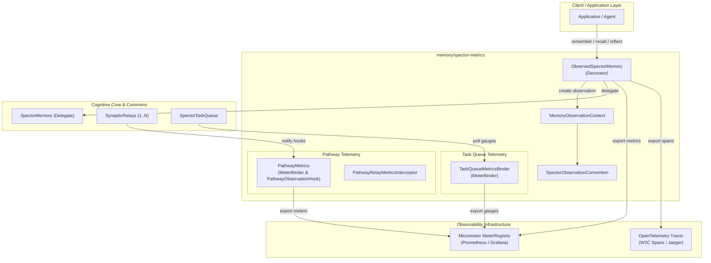
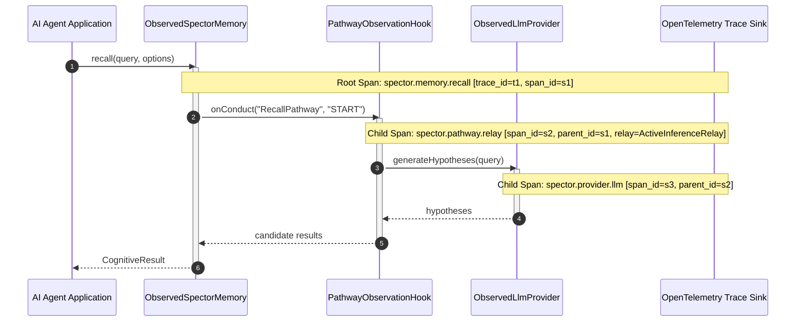

# ADR-0080: Observed Memory and Pathway Metrics Telemetry Architecture

| Field | Value |
|:---|:---|
| **Status** | Accepted (Implemented) |
| **Date** | 2026-08-28 |
| **Authors** | Spector Maintainers & Architecture Working Group |
| **Deciders** | Spector Technical Steering Committee (TSC) |
| **Supersedes** | None |
| **Superseded By** | None |
| **Last Verified** | 2026-09-16 (Verified against `main`) |

---

## 1. Context

Spector's cognitive architecture executes multi-stage, high-concurrency workflows across off-heap Panama FFM storage, vector similarity kernels, and external multimodal LLM/embedding endpoints:

1. **Multi-Stage Cognitive Pathways**: `RememberRecipe`, `RecallRecipe`, and `ReflectRecipe` chain up to 22 sequential and parallel relays (biological encoding, episodic consolidation, active inference retrieval, sleep synthesis).
2. **Asynchronous Background Processing**: Model B `SpectorTaskQueue` manages background consolidation, engram decay, and reflection sweeps on virtual threads.
3. **External Model Inference**: Remote LLM and embedding providers introduce variable network latencies, rate limits, and transient failures.

Operating this cognitive engine in production requires end-to-end observability. Operators and AI system architects must be able to inspect real-time throughput, pinpoint latency regressions to specific pathway relays, monitor circuit breaker and bulkhead states, and trace cross-service operations via distributed tracing spans.

## 2. Problem Statement

Instrumenting a cognitive memory engine introduces three major architectural challenges:

1. **Instrumentation Proliferation & Core Pollution**: Injecting telemetry calls directly into domain kernels and math algorithms creates invasive boilerplate, couples engine logic to monitoring vendors, and increases cognitive debt.
2. **Metrics vs. Tracing Divergence**: Maintaining separate metrics collectors (e.g., Prometheus counters) and distributed tracing instrumentations (e.g., OpenTelemetry spans) causes tag drift, duplicate latency measurements, and code duplication.
3. **Zero Overhead Hot-Path Requirement**: Observability hooks must execute with negligible overhead when enabled and zero allocation cost when disabled, without stalling off-heap SIMD vector pipelines.

## 3. Decision Drivers

- **Decorator & Interceptor Decoupling**: Core interfaces (`SpectorMemory`, `SynapticRelay`, `SpectorTaskQueue`) must remain pure; observability must be layered externally via decorators, interceptors, and hooks.
- **Unified Metrics & Tracing**: A single instrumentation event must simultaneously produce Prometheus/Micrometer dimensional metrics and OpenTelemetry/W3C distributed trace spans.
- **Granular Pathway & Relay Diagnostics**: Telemetry must record latency, status, degradation, circuit tripping, timeouts, and retries per individual pathway relay.
- **Standardized Observation Conventions**: Metric names, tags, and span attributes must follow strict naming conventions adhering to Micrometer Observation standards.

## 4. Considered Options

### Option 1: Ad-Hoc Logging and Atomic Counters
- **Description**: Add SLF4J debug logs and `AtomicLong` counters directly within pathway classes.
- **Advantages**: Simple to write initially, no additional library dependencies.
- **Disadvantages**: Unstructured, difficult to scrape, lacks histogram percentiles, and provides no distributed tracing correlation across services.

### Option 2: Direct OpenTelemetry SDK and Prometheus Client Binding
- **Description**: Hard-code OpenTelemetry tracer and Prometheus meter calls throughout all memory classes.
- **Advantages**: Direct access to vendor-specific APIs.
- **Disadvantages**: Pollutes core cognitive packages with third-party SDK dependencies, creates divergent metric tag schemas, and duplicates instrumentation across metrics and spans.

### Option 3: Micrometer Observation API Decorators and MeterBinders (Selected)
- **Description**: Implement an isolated observability module (`memory/spector-metrics`) utilizing the Micrometer Observation API. Wrap `SpectorMemory` in `ObservedSpectorMemory`, intercept pathway relays via `PathwayMetrics`, and bind task queues via `TaskQueueMetricsBinder`.
- **Advantages**: Complete architectural decoupling, single-call duality (one observation produces both metrics and OpenTelemetry trace spans), zero dependencies added to core kernel, and full compatibility with Prometheus, Grafana, OpenTelemetry Collector, and Datadog.

## 5. Decision Outcome

Spector standardizes on the **Micrometer Observation and Telemetry Architecture** in `memory/spector-metrics/src/main/java/com/spectrayan/spector/metrics/`.

### 5.1 Architecture Overview

### 5.2 Core Telemetry Components

1. **`ObservedSpectorMemory` (Decorator)**:
   - Implements `SpectorMemory`, wrapping the underlying memory instance.
   - Encloses every cognitive operation (`remember`, `recall`, `reflect`, `forget`, `reinforce`, `sync`) inside a Micrometer `Observation`.
   - Uses `DefaultSpectorObservationConvention` to attach standardized contextual tags: `operation`, `tier`, `status`, `user`, and `tenant`.
   - Emits both timing histograms to the `MeterRegistry` and distributed trace spans with parent-child hierarchy to the OpenTelemetry bridge.

2. **`PathwayMetrics` (Relay Telemetry)**:
   - Implements `MeterBinder` and `PathwayObservationHook`.
   - Exports 8 standardized cognitive meters:
     - `spector.pathway.conduct` (Timer) — Total latency per pathway execution (tags: `pathway`, `finish`).
     - `spector.pathway.relay` (Timer) — Execution latency per individual synaptic relay (tags: `pathway`, `relay`, `status`).
     - `spector.pathway.degraded` (Counter) — Count of graceful degradation events (tags: `pathway`, `relay`, `kind`).
     - `spector.pathway.circuit` (Counter) — Circuit breaker state changes (tags: `breaker`, `event=trip|probe|close|reject`).
     - `spector.pathway.bulkhead.reject` (Counter) — Bulkhead concurrency rejections (tags: `bulkhead`).
     - `spector.pathway.timeout` (Counter) — Relay timeouts (tags: `pathway`, `relay`).
     - `spector.pathway.retry` (Counter) — Transient fault retries (tags: `pathway`, `relay`).
     - `spector.pathway.nested` (Timer) — Latency of nested child pathways (tags: `from`, `to`).

3. **`TaskQueueMetricsBinder` (Concurrency Telemetry)**:
   - Implements `MeterBinder`, observing an active `SpectorTaskQueue<?>`.
   - Exports real-time queue health gauges and counters:
     - `spector.taskqueue.size`: Current backlog depth.
     - `spector.taskqueue.capacity`: Configured maximum queue capacity.
     - `spector.taskqueue.parallelism`: Active virtual worker thread count.
     - `spector.taskqueue.submitted`: Monotonic counter of submitted tasks.
     - `spector.taskqueue.processed`: Monotonic counter of completed tasks.
     - `spector.taskqueue.failed`: Monotonic counter of rejected/failed tasks.
     - `spector.taskqueue.retried`: Retry attempts.
     - `spector.taskqueue.latency.avg.ms`: Rolling average task execution duration.
     - `spector.taskqueue.running`: Operational status gauge (1 = running, 0 = closed).

4. **`ObservableRelay` & `PathwayRelayMetricsInterceptor`**:
   - Functional interceptor (`Function<SynapticRelay<S>, SynapticRelay<S>>`) decorating relays transparently without modifying their algorithmic code.

### 5.3 Distributed Tracing & Span Hierarchy

## 6. Pros and Cons of the Options

| Option | Pros | Cons |
|:---|:---|:---|
| **Option 1: Ad-Hoc Logs & Atomic Counters** | Quick to write, zero external libraries | No distributed tracing, high log noise, lacks percentile histograms |
| **Option 2: Direct OTel SDK & Prometheus APIs** | Direct access to native client features | Violates separation of concerns, pollutes engine code with vendor imports |
| **Option 3: Micrometer Observation API Decorators** | 100% decoupled decorator pattern, unified metrics + traces, zero engine pollution | Adds `spector-metrics` module layer; requires binding hooks during startup |

## 7. Implementation Plan

1. **Phase 1: Architecture & Contracts**: Create `memory/spector-metrics` and define observation conventions, documentation enums, and observation contexts.
2. **Phase 2: Core Decorator**: Implement `ObservedSpectorMemory` decorating all primary cognitive operations with Micrometer Observation scopes.
3. **Phase 3: Pathway Interceptors**: Implement `PathwayMetrics` and `PathwayRelayMetricsInterceptor` adhering to `PathwayObservationHook`.
4. **Phase 4: Concurrency & System Binders**: Implement `TaskQueueMetricsBinder` and `SpectorJvmMetrics` for runtime monitoring.
5. **Phase 5: Provider Observation**: Implement `ObservedLlmProvider` and `ObservedEmbeddingProvider` for upstream API latency tracking.

## 8. Code Reference & Verification

- **Primary Module**: `memory/spector-metrics`
- **Key Packages**:
  - `com.spectrayan.spector.metrics`
  - `com.spectrayan.spector.metrics.observation`
- **Key Classes**:
  - `ObservedSpectorMemory.java`
  - `PathwayMetrics.java`
  - `TaskQueueMetricsBinder.java`
  - `SpectorJvmMetrics.java`
  - `DefaultSpectorObservationConvention.java`
  - `MemoryObservationContext.java`
  - `PathwayRelayMetricsInterceptor.java`
  - `ObservableRelay.java`
- **Verification Test Suites**:
  - `ObservedSpectorMemoryTest.java`
  - `PathwayMetricsTest.java`
  - `TaskQueueMetricsBinderTest.java`
  - `SpectorMetricsTest.java`
  - `ObservableRelayTest.java`
