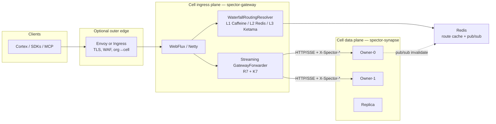

# ADR-0081: Dedicated Reactive Cell Ingress Router (`spector-gateway`)

| Field | Value |
|:---|:---|
| **Status** | Proposed |
| **Date** | 2026-09-17 |
| **Authors** | Spector Maintainers & Architecture Working Group |
| **Deciders** | Spector Technical Steering Committee (TSC) |
| **Supersedes** | None |
| **Superseded By** | None |
| **Amends** | [ADR-0034](0034-cell-ha-namespace-ownership.md) §7 (edge gateway / cell router), §8 (gateway forwarding) |
| **Related** | [ADR-0026](0026-dual-plane-concurrency-and-backpressure.md) (T4 plane separation, backpressure), [ADR-0029](0029-episodic-semantic-lineage-provenance-region.md) (tenant/namespace identity), [ADR-0031](0031-unified-configuration-architecture.md), [ADR-0039](0039-robust-unified-rate-limiting-architecture.md), [ADR-0070](0070-unified-error-taxonomy-and-exception-handling.md), [ADR-0079](0079-memory-event-and-telemetry-notification-bus.md) |
| **Issue** | [#876](https://github.com/spectrayan/spector/issues/876) |
| **Last Verified** | 2026-09-17 (Implemented on `main` — all phases complete, 112+ tests passing) |

---

## 1. Context

ADR-0034 deploys a Spector cell as distinct roles: **gateway** (stateless ingress), **owner** (single-writer mmap primary), **replica** (snapshot/WAL standby), and **standalone** (single-node embedded). After PR #868 the Helm chart already renders a separate gateway Deployment (`deploy/helm/spector/templates/deployment-gateway.yaml`) with `SPECTOR_CELL_ROLE=gateway`.

The process behind that Deployment is still `synapse/spector-synapse`: one Spring Boot 4 + Tomcat fat JAR that also boots owners and replicas. Role is enforced at request time inside `GatewayForwardingFilter.shouldNotFilter()`, not at the classpath or auto-configuration boundary.

Live hop on `main`:

| Layer | Class | Behaviour today |
|:---|:---|:---|
| Servlet adapter | `synapse/.../gateway/GatewayForwardingFilter` | `OncePerRequestFilter`; buffers up to `MAX_BUFFERED_BODY_BYTES` (10 MiB) via `readNBytes`; skips `/api/v1/auth`, `/api/v1/events`, `*/health` |
| Policy + retry | `synapse/.../gateway/GatewayForwarder` | Waterfall resolve; stamps `X-Spector-Namespace\|Tenant\|Epoch\|Fence`; bounded 421 retry; retarget via `X-Spector-Owner`; fail-closed on `HASH_FALLBACK` (R7.6); reuses `Idempotency-Key` (K7) |
| Transport | `synapse/.../gateway/GatewayHttpTransport` | Blocking JDK `HttpClient.send` + `BodyHandlers.ofByteArray()` |
| Ring / cache | `cluster/.../WaterfallRoutingResolver` | L1 Caffeine → L2 Redis → L3 Ketama; already a lean JAR |
| Wiring | `synapse/.../ClusterRoutingConfiguration` | Gated on `spector.cell.role != standalone` only. Owners and replicas also construct the forwarder and filter |

`cluster/spector-cluster` is already the correct policy library: `spector-commons`, SLF4J, Caffeine, Jackson, optional Lettuce. It does not depend on H2, Flyway, Camel, the memory kernel, ONNX, or Tomcat.

Helm still sizes the “stateless” gateway as a mini-monolith: image identical to owners, `/data` emptyDir, embedding/generation env, Panama `--add-modules=jdk.incubator.vector`, default resources `1Gi` request / `2Gi` limit, JVM `-Xms256m -Xmx512m`.

ADR-0034 §7 already draws two boxes that are not yet separate processes:

- **Edge gateway** — TLS, org→cell, auth.
- **Cell router** — namespace→owner using the waterfall, not least-conn.

This ADR makes that diagram true in process topology without rewriting the routing algorithm in WASM or introducing Spring Cloud Gateway.

Issue #876 proposed numbering this decision ADR-0035. That number is taken by the cognitive pathway rearchitecture. This record is **ADR-0081**.

---

## 2. Problem Statement

The cell ingress router is a **role flag on the Synapse monolith**, not a router.

That creates four architectural defects:

1. **Plane violation (Invariant T4).** A gateway pod loads the data plane (Panama mmap cortex, H2/Flyway catalog, Camel ingestion, Quartz, ONNX/embeddings) in order to copy HTTP bytes and evaluate a consistent-hash ring.
2. **Blocking, fully-buffered I/O.** Every forwarded request materializes the body and the owner response as `byte[]`. SSE (`/api/v1/events`) is excluded from forwarding because the hop cannot stream. Large recall and ingest payloads pin tens of megabytes on the ingress heap.
3. **Coupled blast radius.** A Flyway migration, Camel route, or kernel init failure on a gateway replica is an ingress outage. Startup is an 8–12s full Spring context.
4. **The hop is not reusable.** `WaterfallRoutingResolver` lives in `spector-cluster`. `GatewayForwarder` and the buffered DTOs live in `spector-synapse`. A second binary cannot “depend only on cluster” today without copying the 421/idempotency protocol.

Constraints that any fix must preserve:

- Req **R7.1–R7.6** (gateway forwarding, bounded 421 retry, degraded-path fail-closed).
- Invariant **K7** (client `Idempotency-Key` reused across retries).
- Invariant **T4** (control/ingress plane must not load the memory kernel).
- Single-writer ownership from ADR-0034 (gateway never mmaps, never writes bundles).
- Standalone mode remains a single process with **zero** cluster infrastructure (existing `NonStandaloneCondition` / G43).

Non-goals:

- Multi-master writes.
- Replacing `WaterfallRoutingResolver` or the Ketama ring.
- Moving auth catalog durability into Redis.
- Compiling routing policy to Envoy WASM in this ADR.
- Serving Cortex UI or running embeddings on the gateway.

---

## 3. Decision Drivers

- **T4 plane separation.** Ingress RSS and failure domain must be independent of the mmap kernel.
- **Protocol fidelity.** The hop is a Spector control protocol (waterfall + 421 + fence/epoch + K7), not generic L7 load balancing.
- **Streaming and backpressure.** Request and response bodies, including SSE, must flow with bounded buffers (ADR-0026).
- **One implementation of the ring.** Java `spector-cluster` remains the sole hash and cache implementation (existing `SingleHashImplementationGuardTest`).
- **Operational honesty.** Two images are acceptable; two *divergent* routing implementations are not. Image tags share a Git SHA.
- **No new runtime culture.** The repo is Spring Boot 4. Armeria is disabled on `main` (Jackson 3 / `MalformedParameterizedTypeException`). WebFlux is already a Synapse dependency.
- **v0.1-alpha can cut the new process directly.** A shipped “role-gated monolith” milestone is not required if the extract lands streaming and the shared forwarder in the same change.

---

## 4. Considered Options

### Option A: Role-gated Synapse monolith (status-quo optimization)

- **Description**: Keep one fat JAR. Annotate DataSource, Flyway, Camel, Quartz, memory, and GPU auto-configurations with `@ConditionalOnProperty(name = "spector.cell.role", havingValue = "owner")`. Leave `GatewayForwardingFilter` on Tomcat.
- **Advantages**: Zero new artifact; no Helm image split; fastest diff.
- **Disadvantages**: Still servlet + `byte[]` hop; memory floor remains hundreds of MiB; T4 still violated by classpath even if beans are skipped; work is discarded the moment a second binary exists.

### Option B: Dedicated reactive JVM router (`spector-gateway`) — chosen

- **Description**: New module `synapse/spector-gateway` on Spring Boot WebFlux + Reactor Netty. Shared policy and streaming forwarder live in `cluster/spector-cluster` (or a tiny `cluster/spector-gateway-core` if cluster must stay Spring-free). Synapse keeps a compatibility adapter only for mixed-version rollouts, then deletes the servlet filter.
- **Advantages**: Same Java ring and 421 contract; streaming I/O; ~tens of MiB RSS; startup &lt; 1s; blast radius limited to Netty + Lettuce + Caffeine; Helm already has a gateway Deployment.
- **Disadvantages**: Second Docker image and CI target; auth/SSE ownership must be decided explicitly; two-process local compose.

### Option C: Spring Cloud Gateway wrapper

- **Description**: Option B but the server is `spring-cloud-starter-gateway` with a custom `RoutePredicate` / `GatewayFilter` calling the waterfall.
- **Advantages**: Familiar gateway vocabulary; built-in retry/rate-limit filters.
- **Disadvantages**: Extra Spring Cloud BOM on Boot 4; does not implement 421-retarget, fence headers, or Redis hash-mode eviction; duplicates ADR-0039 rate limiting; heavier than raw WebFlux for a single custom filter chain.

### Option D: Envoy / Ingress WASM Ketama filter

- **Description**: Compile consistent hashing to WASM and deploy beside or instead of the Java gateway.
- **Advantages**: Line-rate C++; standard cloud ingress.
- **Disadvantages**: Reimplements L3 only. Cannot express L1/L2 waterfall, 421 retarget, fence/epoch, K7, or JWT claim fallback without a second control channel. Divorces the only guarded hash implementation from Java. High debug cost across clouds.

### Option E: Envoy data plane + Java ext_proc sidecar

- **Description**: Envoy streams bytes; a tiny Java process answers “which owner?” over ext_proc.
- **Advantages**: Keeps policy in Java; C++ byte pump.
- **Disadvantages**: Two new components; ext_proc buffering and trailer semantics for 421 retries are subtle; unjustified before the WebFlux hop is saturated.

---

## 5. Decision Outcome

**Chosen option: B — dedicated `spector-gateway` on WebFlux / Reactor Netty, sharing `spector-cluster`.**

Option A may be used as a *checklist inside the extract PR* (forbidden gateway classpath, no Panama flags, no `/data`) but is **not** a released cell mode. Option C is rejected as an unnecessary product on top of WebFlux. Option D is rejected as the namespace router; Envoy may sit *in front of* gateway replicas for TLS and org→cell only. Option E is deferred until measured RPS requires it.

### Positive consequences

- Ingress pods no longer load H2, Flyway, Camel, mmap, or ONNX.
- One Java implementation of R7.1–R7.6 and K7 continues to run in-process with the ring.
- Streaming hop unblocks forwarding `/api/v1/events` and large recall bodies.
- Helm gateway HPA becomes meaningful (CPU on Netty event loops, not kernel warmup).

### Negative consequences and trade-offs

- Two images (`spector-synapse` and `spector-gateway`) must be released from the same commit.
- Auth is an explicit edge concern (see §9). A “40–60 MiB routing-only” RSS target holds only if JWT validation stays minimal and Cortex UI is not served from the gateway.
- Local `docker-compose` and kind fixtures gain a second service.
- Mixed-version cells (new gateway, old owner) must tolerate the existing header contract; body streaming is additive.

---

## 6. Pros and Cons of the Options

| Option | Pros | Cons |
|:---|:---|:---|
| **A. Role-gated monolith** | Single image; small diff | Buffered I/O remains; T4 violated by classpath; discarded after extract |
| **B. WebFlux `spector-gateway`** | Shared `spector-cluster`; streaming; small RSS; existing Helm role | Second image; auth/SSE must be specified |
| **C. Spring Cloud Gateway** | Stock filters | Extra BOM; still must write custom 421/fence filter |
| **D. Envoy + WASM Ketama** | Line-rate L7 | Reimplements ring; cannot do waterfall/421/K7 |
| **E. Envoy + ext_proc** | Java policy + C++ proxy | Two new components; premature |

---

## 7. Target architecture



Standalone deployments do not start `spector-gateway`. `spector.cell.role=standalone` (or unset) keeps today’s single-process Synapse with cluster beans absent.

---

## 8. Implementation plan (everything required to land Option B)

Work is one milestone. Do not merge a new empty module that still calls the servlet `byte[]` hop.

### Phase 1 — Extract a streaming, Spring-free forwarder

Move the hop out of `spector-synapse` **and change its I/O model in the same commit**.

**New / relocated types** (preferred package: `com.spectrayan.spector.cluster.gateway`):

| Type | Responsibility |
|:---|:---|
| `ForwardRequest` | `method`, `uriPath`, headers, **streaming body** (`Flow.Publisher<ByteBuffer>` or `InputStream` + known/unknown length), `idempotencyKey` |
| `ForwardResponse` | `statusCode`, headers, **streaming body**, `ownerId`, `attempts` |
| `GatewayHttpTransport` | SPI. Default: JDK `HttpClient.sendAsync` + `BodyHandlers.ofInputStream()` or Reactor Netty `HttpClient` |
| `GatewayForwarder` | Unchanged control flow: resolve → stamp headers → send → on 421 invalidate L1 / `invalidateIfHash` → retarget or fail-closed |
| `RoutingKeyExtractor` | Header `X-Spector-Namespace` / `X-Spector-Tenant`, query `namespace`/`tenant`, path `/api/v1/namespaces/{id}`, JWT `sub` + `tenant_id`/`tenantId` fallback, default namespace `default` |

**Hard rules for Phase 1:**

- `ForwardRequest.body` must not be `byte[]`. The 10 MiB cap remains a **policy limit** (`Content-Length` reject + counted streaming abort → `413 PAYLOAD_TOO_LARGE`), not a mandatory pre-read.
- Transport must not use `BodyHandlers.ofByteArray()` for owner responses.
- Hop-by-hop headers stay filtered: `Host`, `Content-Length`, `Connection`, `Transfer-Encoding`.
- Routing headers remain: `X-Spector-Namespace`, `X-Spector-Tenant`, `X-Spector-Epoch`, `X-Spector-Fence`.
- `Idempotency-Key` / `X-Idempotency-Key` is copied on every attempt (K7).
- 421 handling stays exactly as `GatewayForwarder` on `main` (R7.4–R7.6, G45 reported-owner retarget).
- `spector-cluster` stays free of Spring. If WebFlux types leak, split `cluster/spector-gateway-core` with dependencies `{ spector-cluster, reactor-core, reactor-netty-http }` only.

**Compatibility shim (temporary):** `spector-synapse` may keep `GatewayForwardingFilter` as a blocking adapter over the new streaming forwarder (`InputStream` → counted read with the same 10 MiB cap) so mixed local runs keep working. The shim is deleted once Helm and compose use `spector-gateway` exclusively in `topology.mode=split`.

### Phase 2 — Module `synapse/spector-gateway`

Maven module added to the reactor POM.

**Allowed dependencies:**

- `spector-cluster`, `spector-commons`
- `spring-boot-starter-webflux`
- `spring-boot-starter-actuator` + Prometheus registry
- `lettuce-core` (optional; same Redis URI as today)
- `spring-boot-starter-security` + `spring-boot-starter-oauth2-resource-server` **only if** §9 keeps JWT verification at the edge
- Micrometer

**Forbidden dependencies (CI ArchUnit / Enforcer):**

- `spector-memory`, `spector-kernel`, `spector-gpu`, `spector-index`
- `spector-connector`, `spector-batch`, `spector-ingestion`, `spector-mcp`
- `spring-boot-starter-web` (Tomcat), `spring-boot-starter-jdbc`, `h2`, `flyway-core`
- LangChain4j, Spring AI, Tika, Tabula, Phileas, Quartz, Camel
- `jdk.incubator.vector` JVM flags

**Application responsibilities:**

1. Health: `/actuator/health`, `/actuator/prometheus` (Helm probes already point at `:7070`).
2. WebFlux `WebFilter` (order equivalent to current `LOWEST_PRECEDENCE - 20`):
   - skip when path is `/actuator/**` or `/api/v1/health/**`
   - extract `RoutingKey` via `RoutingKeyExtractor`
   - subscribe the request body as a stream into `GatewayForwarder`
   - copy status + allowed headers + body to the client with backpressure
3. Bind `WaterfallRoutingResolver` the same way `ClusterRoutingConfiguration` does: `OwnershipResolver` ring supplier, optional `LettuceRedisRoutingCache`, `RoutingInvalidationSubscriber`.
4. Node URL resolver: existing `GatewayForwarder.defaultNodeUrlResolver(7070)` plus Helm headless DNS members already injected as `SPECTOR_CELL_RING_MEMBERS`.
5. Structured errors use ADR-0070 codes already emitted by the filter: `PAYLOAD_TOO_LARGE`, `GATEWAY_ROUTING_FAILURE`.

**Configuration keys** (ADR-0031; reuse existing names, do not invent a parallel tree):

```yaml
spector:
  cell:
    id: ${SPECTOR_CELL_ID:default}
    role: gateway
    node-id: ${SPECTOR_CELL_NODE_ID}
    ring-members: ${SPECTOR_CELL_RING_MEMBERS}
  routing:
    caffeine:
      ttl-seconds: 60
      max-size: 1000
    redis:
      enabled: ${SPECTOR_ROUTING_REDIS_ENABLED:true}
      uri: ${SPECTOR_ROUTING_REDIS_URI:redis://localhost:6379}
      ttl-seconds: 30
      timeout-ms: 200
    gateway:
      retry-max: 2
      max-buffered-body-bytes: 10485760
      owner-timeout: 10s
```

Gateway process **must** refuse to start if `spector.cell.role` is not `gateway`.

### Phase 3 — Auth, SSE, and Cortex (contract decisions)

These are part of this ADR so the new binary’s classpath is not an accident.

#### 3.1 Authentication

**Decision: gateway is a JWT resource server for data-plane `/api/v1/**`. Token *issuance* (`/api/v1/auth/**`) is forwarded to a designated owner (or the ring primary for the `default` namespace) rather than implemented inside `spector-gateway`.**

Rationale: today’s filter excludes `/api/v1/auth` and runs issuance inside the monolith on the gateway pod. That forces H2/JDBC onto ingress. Forwarding auth keeps catalog and keystores on owners.

Implications:

- Gateway validates bearer tokens with the same JWT settings Synapse uses (`spring-boot-starter-oauth2-resource-server` is allowed).
- Gateway does **not** open the account catalog, keystore, or identity bundle.
- `/api/v1/auth/**` is no longer “local-only.” It is forwarded with the same routing key rules; if no tenant/namespace is present, use `RoutingKey.ofUntenanted(cellId, "default")`.
- CORS preflight and `401/403` remain edge responses.

If a later ADR introduces a dedicated auth process, this section is amended. It is not in scope now.

#### 3.2 SSE and events (ADR-0079)

**Decision: `/api/v1/events` is forwarded as a streamed response. The skip list in `shouldNotFilter` is deleted for events.**

Requirements:

- Transport must preserve `Content-Type: text/event-stream` and disable response buffering (`Cache-Control: no-cache`, no `Content-Length` rewrite).
- 421 on an SSE handshake retries the *handshake* only (R7.4 bound). An established stream that later dies is not silently replayed (K7 does not apply to infinite streams).
- Gateway idle timeout for SSE ≥ owner write timeout.

#### 3.3 Cortex UI

**Decision: gateway does not serve `:8080` Cortex/nginx assets.** Dashboard traffic goes to a Synapse owner (or a future static asset Deployment). Helm gateway template drops the `dashboard` container port from the *router* container. Existing `service.ports.dashboard` may keep targeting owner pods.

### Phase 4 — Packaging, Helm, compose

**Images.** One repo, two Dockerfile targets, same Git SHA:

```text
ghcr.io/spectrayan/spector-synapse:${GIT_SHA}
ghcr.io/spectrayan/spector-gateway:${GIT_SHA}
```

`deploy/docker/Dockerfile` grows a `gateway` stage that copies only the `spector-gateway` layered JAR. No `jdk.incubator.vector`, no `--enable-native-access` unless a remaining dependency truly needs it (it should not).

**Helm `deployment-gateway.yaml` changes:**

- `image`: `spector-gateway` repository/tag, not the Synapse image.
- Delete env: `SPECTOR_EMBEDDING_*`, `SPECTOR_GENERATION_*`, `SPECTOR_DATA_DIR`.
- Delete `/data` volume and Panama `JAVA_OPTS`.
- Default `JAVA_OPTS`: `-Xms64m -Xmx256m -XX:+UseG1GC`.
- Default resources after soak: requests `250m / 128Mi`, limits `1000m / 256Mi` (replace today’s `1Gi/2Gi`).
- Keep `SPECTOR_CELL_ROLE=gateway`, ring members, Redis URI, probes on `/actuator/health:7070`.
- NetworkPolicy `ingressFromGatewayOnly` is unchanged: owners still only accept 7070 from gateway pods.

**Compose.** `deploy/compose/cell-3node/docker-compose.yml` and `docker-compose.synapse.yml` start `spector-gateway` as the published `7070` service. Owners are not published externally in split topology.

**Standalone / `topology.mode=single-role`.** Chart does not deploy `spector-gateway`. Behaviour matches pre-#876 Synapse.

### Phase 5 — Verification (merge gate)

Must pass before status can move to `Accepted (Implemented)`:

| Gate | What |
|:---|:---|
| Unit | Relocate and keep green: `GatewayForwardingTest`, `BoundedRetryGuardTest`, `GatewayForwardingFilterTest` (adapter), `WaterfallRoutingResolverTest`, `SingleHashImplementationGuardTest` |
| Property | 421 retry never exceeds `retry-max`; `HASH_FALLBACK` + no reported owner does not loop; K7 header identical on every attempt |
| Streaming | Request of size `max-buffered-body-bytes + 1` → 413 without holding the extra bytes; SSE proxy test forwards at least two `data:` frames without buffering the whole stream |
| ArchUnit | `spector-gateway` must not depend on forbidden artifacts listed in Phase 2 |
| Parity | `StandaloneParityRegressionTest` still asserts zero cluster beans when role is standalone |
| Helm | `deploy/helm/tests/test-manifests.sh` asserts gateway Deployment image ≠ owner image and has no `/data` mount |
| E2E | Existing 4-pod split cell + `verify_auth_sharding.py`: Alice/Bob land on distinct owners through the **new** binary; auth register/login still works via forwarded `/api/v1/auth` |

### Phase 6 — Docs and deprecation

- This file; catalog row ADR-0081; `mkdocs.yml` nav entry under “Platform, Synapse & Clustering”.
- Amend ADR-0034 §7 note: the cell router is `spector-gateway`, not Envoy EDS. Envoy remains an optional outer edge.
- `PROJECT_CONTEXT.md` / `docs/architecture/distributed-mode.md`: gateway is a distinct artifact.
- Deprecate `SPECTOR_CELL_ROLE=gateway` on the Synapse fat JAR after one minor release. Synapse may log an error and refuse that role once Helm has switched.

---

## 9. Wire contract (normative)

The gateway is transparent except for the headers below. Clients keep calling the same REST/SSE surface.

| Header | Set by | Meaning |
|:---|:---|:---|
| `X-Spector-Namespace` | Client or gateway extractor | Routing namespace |
| `X-Spector-Tenant` | Client or gateway extractor | Tenant segment of `RoutingKey` |
| `X-Spector-Epoch` | Gateway from `ResolvedRoute` | Ownership epoch |
| `X-Spector-Fence` | Gateway from `RouteBinding` | Fence token |
| `X-Spector-Owner` | Owner on 421 | Authoritative owner id for retarget (G45) |
| `Idempotency-Key` | Client | Reused on every retry (K7) |

Status codes the gateway may originate (not merely proxy):

| Status | Code | When |
|:---|:---|:---|
| 413 | `PAYLOAD_TOO_LARGE` | `Content-Length` or counted stream exceeds cap |
| 502 | `GATEWAY_ROUTING_FAILURE` | Transport failure after retries exhausted |
| 421 | proxied | Owner refused; retries exhausted or R7.6 fail-closed |

Path skip list (not forwarded):

- `/actuator/**`
- `**/health` and `/api/v1/health/**`

Everything else under `/api/v1/**`, including `/api/v1/auth/**` and `/api/v1/events/**`, is forwarded.

---

## 10. Module and class map (target)

```text
cluster/spector-cluster/          # existing + relocated hop
  .../routing/cache/WaterfallRoutingResolver.java
  .../gateway/ForwardRequest.java
  .../gateway/ForwardResponse.java
  .../gateway/GatewayForwarder.java
  .../gateway/GatewayHttpTransport.java
  .../gateway/RoutingKeyExtractor.java

synapse/spector-gateway/          # NEW process
  pom.xml
  src/main/java/.../gateway/
    SpectorGatewayApplication.java
    GatewayWebFilter.java
    GatewayConfiguration.java
  src/test/java/...                 # relocated + streaming tests

synapse/spector-synapse/          # owners, replicas, standalone
  .../gateway/GatewayForwardingFilter.java   # temporary shim, then delete
  .../config/routing/ClusterRoutingConfiguration.java
      # gateway beans removed; owner-side 421/fence endpoints stay
```

`ClusterRoutingConfiguration.NonStandaloneCondition` remains for owner/replica ring, Redis cache, and invalidation subscriber. It must **stop** creating `GatewayForwardingFilter` on owner/replica nodes (today it does).

---

## 11. Code reference and verification

- **Primary modules**: `cluster/spector-cluster`, `synapse/spector-gateway` (new), `synapse/spector-synapse` (shim then delete), `deploy/helm/spector`, `deploy/docker`
- **Key packages**: `com.spectrayan.spector.cluster.gateway`, `com.spectrayan.spector.cluster.routing`, `com.spectrayan.spector.gateway`
- **Classes on `main` being replaced**: `GatewayForwardingFilter.java`, `GatewayForwarder.java`, `GatewayHttpTransport.java`, `ForwardRequest.java`, `ClusterRoutingConfiguration.java`
- **Verification tests**: see Phase 5
- **Requirements preserved**: ADR-0034 R7.1–R7.6, Invariant K7, Invariant T4
- **RFC / issue**: [#876](https://github.com/spectrayan/spector/issues/876)

---

## 12. Open questions (resolved by this ADR unless TSC amends)

| # | Question | Resolution |
|:---|:---|:---|
| Q1 | Spring Cloud Gateway vs WebFlux vs Vert.x vs Armeria? | WebFlux + Reactor Netty. Armeria blocked on Jackson 3. Vert.x is a second runtime. SCG is unused product surface. |
| Q2 | One image or two? | Two targets, one Git SHA. |
| Q3 | Must Option A ship first? | No. Option A work is the extract checklist, not a release. |
| Q4 | Does the gateway serve Cortex? | No. |
| Q5 | Does the gateway issue JWTs? | No. It validates JWTs and forwards `/api/v1/auth/**`. |
| Q6 | Are events forwarded? | Yes, as a streamed proxy. |
| Q7 | Envoy WASM in v0.2? | No. Envoy may terminate TLS in front of gateway pods only. |
