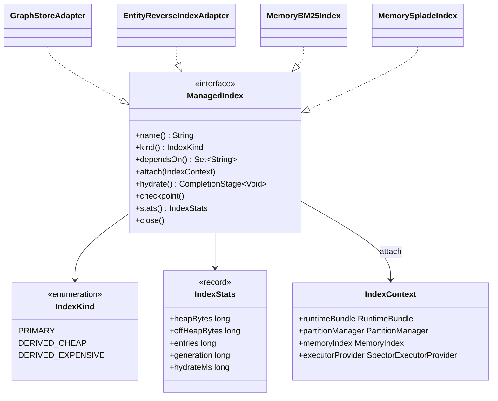
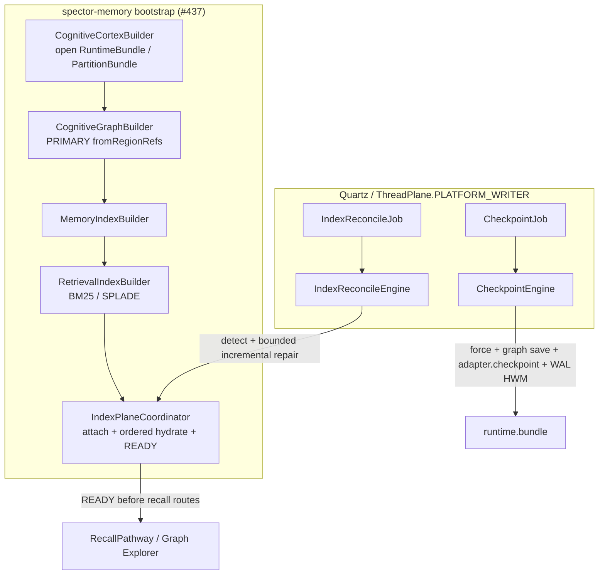
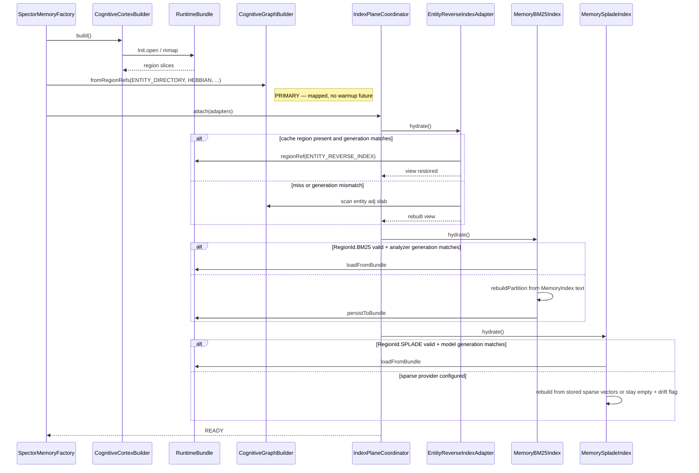
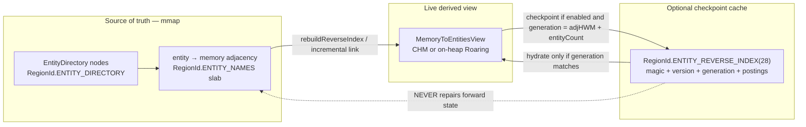
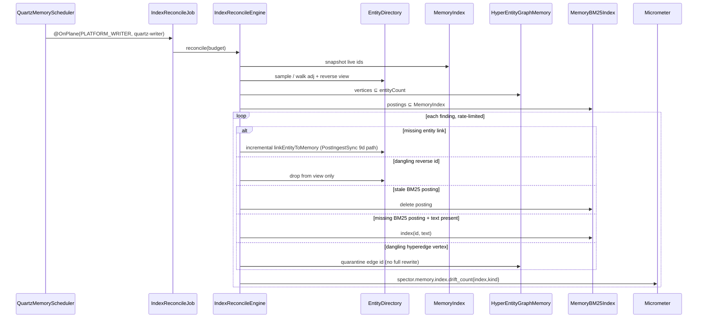

# ADR-0082: Index Plane Lifecycle, Derived Views, and Reconciliation

| Field | Value |
|:---|:---|
| **Status** | Proposed |
| **Date** | 2026-09-17 |
| **Authors** | Spector Maintainers & Architecture Working Group |
| **Deciders** | Spector Technical Steering Committee (TSC) |
| **Supersedes** | None |
| **Superseded By** | None |
| **Amends** | [ADR-0004](0004-mmap-bundle-architecture-and-fd-scaling.md) / [ADR-0043](0043-single-vma-bundle-layout-specification.md) (runtime region catalog), [ADR-0038](0038-bm25-optimization.md) (lexical persist path) |
| **Related** | [ADR-0003](0003-hypergraph-entity-graph-graduation.md), [ADR-0026](0026-dual-plane-concurrency-and-backpressure.md), [ADR-0042](0042-graph-recall-architecture-and-cognitive-traversals.md), [ADR-0048](0048-cross-capture-graph-coactivation-kernel.md), [ADR-0061](0061-in-memory-multi-tenant-quartz-scheduler.md), [ADR-0080](0080-observed-memory-and-pathway-metrics-telemetry.md) |
| **Issue** | [#811](https://github.com/spectrayan/spector/issues/811), [#428](https://github.com/spectrayan/spector/issues/428) |
| **Last Verified** | 2026-09-17 (verified against `main` @ `03ac056e`) |

---

## 1. Context

Spector's cognitive retrieval, associative recall, and Graph Explorer pipelines are backed by a mix of **mmap-primary graph stores** and **derived in-memory indexes**:

| Structure | Module | Persistence today |
|:---|:---|:---|
| `HebbianGraphMemory` | `spector-kernel` | `RegionId.HEBBIAN` (14) |
| `TemporalChainMemory` | `spector-kernel` | `RegionId.TEMPORAL_CHAIN` (15) |
| `EntityDirectory` (name↔id, type, entity→memory adj) | `spector-kernel` | `RegionId.ENTITY_DIRECTORY` (17) + `ENTITY_NAMES` (18) |
| `HyperEntityGraphMemory` | `spector-kernel` | `RegionId.HYPERGRAPH` (19) |
| `MemoryIndex` / text blobs | `spector-memory` + kernel | `INDEX_MIDX` / `INDEX_IDPL` / `TEXT` |
| `MemoryBM25Index` | `spector-memory` over `spector-index` | `RegionId.BM25` (22) — load/persist already exist |
| `MemorySpladeIndex` | `spector-memory` over `spector-index` | **none** — constructed empty when a sparse provider is configured |
| `EntityDirectory.memoryToEntities` | on-heap `ConcurrentHashMap` | **none** — rebuilt by `rebuildReverseIndex()` on open |

Issue #811 correctly observes that lifecycle across these structures is fragmented. The live wiring is already split across four places rather than missing entirely:

1. **Open / slice** — `CognitiveCortexBuilder` opens `RuntimeBundle` / `PartitionBundle` (ADR-0043).
2. **Attach primary stores** — `CognitiveGraphBuilder` constructs graph memories via `fromBundle` / `fromRegionRefs`.
3. **Hydrate lexical indexes** — `RetrievalIndexBuilder` loads BM25 from `RegionId.BM25` or rebuilds from `MemoryIndex` text; SPLADE is created empty.
4. **Checkpoint** — `CheckpointEngine` + `CheckpointJob` (`@OnPlane(PLATFORM_WRITER)`) force-msyncs stores, saves MemoryIndex and the graph set, then writes the WAL HWM into `RegionId.CHECKPOINT`. It does **not** persist BM25/SPLADE and does **not** verify reverse-index parity.

`GraphStructureHealthSnapshot` (MR-08) reports compaction telemetry (fragmentation, CSR overflow, bytes reclaimed). It is not a referential-integrity check.

`MemoryBM25Index` and `MemorySpladeIndex` already carry `// TODO(#428): Extract common index infrastructure to AbstractMemoryIndex`.

`RegionId.LOOKUP` is a fixed array of length 27 (ids 0–26). The next free runtime id is **27**. Any new region must grow that table.

---

## 2. Problem Statement

Three distinct failure modes are being treated as one "index lifecycle" problem.

### 2.1 Derived views are ephemeral

`EntityDirectory` owns identity and **entity→memory** adjacency in mmap. The **memory→entity** reverse map used by `entitiesForMemory()` and `CognitiveGraphFacade` lives only on-heap and is reconstructed by a full adjacency scan on every open. If that scan is skipped, incomplete, or races a later link, Graph Explorer projects zero entities after cold start, bundle restore, or offline ingest.

### 2.2 Expensive derived indexes do not share a persist contract

BM25 already snapshots into `RegionId.BM25`. SPLADE does not. A restart with a configured `SparseEmbeddingProvider` yields an empty sparse index until something re-embeds the corpus. That is the real "no full-text re-extraction" SLO in #811 — not the entity reverse scan, which is O(entities × mean degree) and already cheap at the 50k-memory target.

### 2.3 Cross-structure drift has no owner

Orphan MemoryIndex slots, dangling hyperedge vertices, stale BM25 doc ids, and unindexed text live *between* stores. No single method on `HebbianGraphMemory` or `EntityDirectory` can see that set. `CheckpointEngine` persists whatever each store believes is true; it does not reconcile.

### Constraints

- Kernel stores remain `AbstractGraphMemory` slices of a single-VMA bundle (ADR-0004 / ADR-0043). They must not grow a second lifecycle SPI.
- Long-running work is classified onto a `ThreadPlane` and submitted by the host (ADR-0026). The library does not start threads.
- Quartz already owns periodic memory work (`CheckpointJob`, `GraphEnrichmentJob`, decay, dream). A new loop must be another job, not a hidden daemon.
- Forward adjacency in `ENTITY_DIRECTORY` / `ENTITY_NAMES` is the source of truth for entity↔memory links (ADR-0003). A reverse region must not become a third copy that can disagree with the adj slab.
- Recall must stay available during repair. Reconcile must not take a process-wide write lock.

### Non-goals

- Replacing Panama FFM with an on-heap document store.
- Making Hebbian / temporal / hypergraph "warm up" asynchronously — they are mapped when the bundle opens.
- Treating RoaringBitmap / FFM posting lists as the live mutable reverse structure in v1.
- A new readiness protocol outside the existing factory / admin surface.

---

## 3. Decision Drivers

- **One control plane.** Hydrate, checkpoint, and reconcile extend the #437 builder split and `CheckpointEngine`; they do not add a parallel coordinator process.
- **Kinded indexes.** PRIMARY mmap stores, cheap derived views, and expensive derived indexes have different hydrate and persist costs. The contract must encode that.
- **Generation-stamped caches only.** A persisted reverse index or lexical snapshot is valid iff its generation matches the source. For lexical/sparse indexes: `hash(MemoryIndex.HWM, Model/Tokenizer ID, SchemaVersion)`. For the reverse index: `(adjHighWaterMark << 32) | (entityCount & 0xFFFFFFFFL)`. Mismatch ⇒ discard and rebuild.
- **Cross-structure repair is a job.** Drift detection spans MemoryIndex, EntityDirectory, HyperEntityGraph, TemporalKnowledgeGraph, BM25, and SPLADE.
- **Plane discipline.** Checkpoint and reconcile run on `ThreadPlane.PLATFORM_WRITER`. Hydrate of expensive indexes may use `VIRTUAL` for partition fan-out (existing `ConcurrentTasks` in BM25/SPLADE).
- **Reconcile throttling & rate-limiting.** Background repair operates within a strict cooperative time-slice (<= 50ms or <= 500 repairs per cycle) on `ThreadPlane.PLATFORM_WRITER` (`quartz-writer`), preventing background repair from starving checkpointing or active writes.
- **Measure before adding regions.** `RegionId.ENTITY_REVERSE_INDEX` is optional and gated on a rebuild-time budget. `RegionId.SPLADE` is required because rebuild means model inference.
- **Telemetry is first-class.** Footprint, hydrate time, and drift counts belong in `spector-metrics` (ADR-0080), not ad-hoc logs.

---

## 4. Considered Options

### Option 1: Universal `IndexLifecycle` on every store (as drafted in #811)

- **Description**: Kernel and memory indexes implement `initialize` / `warmup` / `checkpoint` / `reconcile` / heap+off-heap bytes. An `IndexLifecycleCoordinator` in `spector-memory` hydrates in dependency order.
- **Advantages**: One interface to point at; matches the issue sketch; easy to list in a readiness probe.
- **Disadvantages**: Forces `warmup()` onto mmap primaries that are already open; puts a memory-module SPI on kernel types; `reconcile()` on a single store cannot see cross-structure drift; invites a second checkpoint path beside `CheckpointEngine`.

### Option 2: Persist every derived structure as a new authoritative `RegionId`

- **Description**: Add `ENTITY_REVERSE_INDEX`, persist SPLADE, treat both as sources of truth alongside the adj slab and text blobs.
- **Advantages**: Sub-millisecond reopen if the bytes are valid; no scan.
- **Disadvantages**: Three copies of entity↔memory (nodes, adj, reverse). Crash between adj mutation and reverse flush creates silent desync — the original bug, moved onto disk. Bundle growth + `LOOKUP` resize for a structure that is cheap to rebuild.

### Option 3: Kinded `ManagedIndex` adapters + existing engines (selected)

- **Description**: Memory-layer adapters classify each structure. PRIMARY stores no-op hydrate. Cheap derived views rebuild on open (optional generation-stamped cache later). Expensive derived indexes persist like BM25 already does. `CheckpointEngine` gains an adapter pass. A new `IndexReconcileJob` owns cross-structure drift. `#428` `AbstractMemoryIndex` is the lexical half of the same contract.
- **Advantages**: Fits bundle/builder/Quartz reality; keeps kernel free of a second lifecycle; persist budget spent where rebuild is expensive; reconcile can see all stores.
- **Disadvantages**: Two types (`ManagedIndex` vs kernel `Memory<L>`); optional reverse region is deferred until measured.

---

## 5. Decision Outcome

**Chosen option: 3 — kinded `ManagedIndex` adapters over the existing builder / checkpoint / Quartz plane.**

Issue #811's *goals* (deterministic hydrate, persist of expensive postings, drift repair, budgets, COW rebuild) are accepted. The *shape* (kernel-wide `IndexLifecycle` + authoritative reverse region on day one) is rejected.

### 5.1 Index kinds



| Kind | Members | `hydrate()` | `checkpoint()` |
|:---|:---|:---|:---|
| **PRIMARY** | Hebbian, TemporalChain, HyperEntityGraph, EntityDirectory forward, MemoryIndex, TextBlob | no-op (already mapped) | existing `save()` / mmap dirty + `force` |
| **DERIVED_CHEAP** | `memoryToEntities` view | scan adj slab (default); optional cache region if generation matches | snapshot only if cache region enabled |
| **DERIVED_EXPENSIVE** | BM25, SPLADE | load region if generation matches, else rebuild + persist | `persistToBundle` |

Kernel types do **not** implement `ManagedIndex`. `GraphStoreAdapter` wraps the already-constructed `fromRegionRefs` instance.

### 5.2 Control plane — extend, do not replace



`IndexPlaneCoordinator` is a method-sized object owned by `SpectorMemoryFactory`. It is not a service with its own thread. Phases:

1. `OPEN` — cortex has mapped the bundle.
2. `ATTACH` — adapters registered with explicit `dependsOn()`.
3. `HYDRATE` — Kahn / hardcoded order below; PRIMARY skipped.
4. `READY` — recall and graph facades may run.
5. `CHECKPOINT` / `RECONCILE` — Quartz.
6. `CLOSE` — existing AutoCloseable chain.

Deterministic hydrate order:

```text
TypeRegistry
  → EntityDirectory (forward)
  → HyperEntityGraphMemory
  → TemporalChain / TemporalKnowledgeGraph
  → HebbianGraphMemory
  → MemoryIndex + TextBlob
  → EntityReverseIndexAdapter
  → MemoryBM25Index
  → MemorySpladeIndex
```

This is the order `CognitiveGraphBuilder` + `RetrievalIndexBuilder` already approximate. The coordinator makes it explicit and testable.

### 5.3 Sequence: cold start



The #811 "cold start &lt; 5 ms for 50k memories without full-text re-extraction" SLO applies to the **BM25 + reverse-view** path when generations match. SPLADE load is the same shape once persisted; a miss is allowed to be slow because it is model work, not a scan.

### 5.4 Reverse view is a cache, never a source of truth



Live mutation stays on the existing `StampedLock` write side of `linkEntityToMemory` / unlink. The optional region is a snapshot. Format if Phase 3 lands:

```text
magic u32 | version u16 | flags u16
generation u64          // adjHighWaterMark << 32 | entityCount
slotCount u32
repeating:
  slotId varint
  entityCount varint
  delta-encoded entityIds  |  roaring blob
```

Roaring is the preferred posting codec; delta-encoded ints are acceptable at the 50k target. Do not use a live FFM `MemorySegment` set for v1 mutation.

`RegionId` reservations in Phase 1:

- add `SPLADE(27)` (ships in Phase 1 to eliminate sparse model re-inference on restart);
- add `ENTITY_REVERSE_INDEX(28)` (reserved catalog slot for Phase 3 optional reverse cache);
- expand `LOOKUP` fixed array from 27 to 32;
- declare both as growable runtime regions in `CognitiveCortexBuilder.getRuntimeBundleSpecs`.

### 5.5 Reconciliation is a job



Rules:

- Default mode is incremental and cooperatively budgeted (`spector.memory.indexes.reconcile.max-repairs-per-cycle` default 500, `spector.memory.indexes.reconcile.max-cycle-duration-ms` default 50ms). Full rebuild is an explicit admin flag.
- Reads use existing optimistic `StampedLock` reads or shared read locks; never hold an entity write lock for the whole cross-store scan. Repairs are batched and localized.
- Recall stays up. Drift above threshold sets a degraded gauge, not a process halt.
- `GraphStructureHealthSnapshot` remains compaction telemetry. Referential findings are a separate `IndexReconcileReport`.

### 5.6 Checkpoint extension

`CheckpointEngine.checkpoint()` keeps one fsync/HWM owner. After the existing graph saves:

```text
force persistent segments
save MemoryIndex
save Hebbian / Temporal / EntityDirectory / Hypergraph / CoActivation
adapter.checkpoint() for DERIVED_EXPENSIVE (BM25, SPLADE)
adapter.checkpoint() for DERIVED_CHEAP only if reverse cache enabled
write CHECKPOINT HWM, truncate WAL
```

Individual adapters must not `force()` the bundle themselves.

### 5.7 COW rebuild

Lexical indexes already swap partitions via `CopyOnWriteArrayList` (`rebuildPartition` / `setPartition`). That is the rebuild protocol. Triggers: analyzer/model generation mismatch, reconcile threshold, admin rebuild. Graph stores keep `StampedLock` SWMR over live mmap — they are not COW-swapped.

### 5.8 Budgets and metrics

PRIMARY off-heap is the region size already declared in the bundle spec. DERIVED heap is measured after hydrate; exceeding `spector.memory.indexes.<name>.max-memory-mb` fails READY or forces a spill (`RegionRef.ensureCapacity`, already used by BM25).

Metrics (ADR-0080 / `spector-metrics`):

| Metric | Labels |
|:---|:---|
| `spector.memory.index.bytes` | `index`, `space=heap\|offheap` |
| `spector.memory.index.entries` | `index` |
| `spector.memory.index.hydrate_ms` | `index` |
| `spector.memory.index.generation` | `index` |
| `spector.memory.index.drift_count` | `index`, `kind` |

---

## 6. Pros and Cons of the Options

| Option | Pros | Cons |
|:---|:---|:---|
| **1. Universal `IndexLifecycle`** | Single SPI; matches #811 sketch | Kernel/module inversion; fake `warmup()` on mmap; reconcile cannot see cross-store drift; second checkpoint path |
| **2. Authoritative new regions for every derived view** | Fastest reopen when bytes are valid | Third copy of adjacency; disk desync; `LOOKUP`/bundle growth for a cheap scan |
| **3. Kinded adapters + existing engines** | Fits builders, bundles, Quartz, #428; persist spent on SPLADE; reconcile has a real owner | Two types to learn; reverse cache deferred until measured |

### Positive consequences

- Cold-start desync of Graph Explorer is owned by one hydrate path.
- SPLADE gains the persist contract BM25 already has — the actual "no re-extraction" win.
- Kernel remains bundle-shaped (ADR-0043). Memory module remains the orchestrator (#437).
- Drift becomes an operable Quartz job with metrics, not an untested `index.reconcile()`.

### Negative consequences and trade-offs

- `ManagedIndex` is an adapter layer, not "everything is an index." Callers must not look for `warmup()` on `HebbianGraphMemory`.
- Until Phase 3, reverse-view reopen still scans adjacency. That is accepted until a benchmark shows it misses the budget.
- `RegionId.LOOKUP` and runtime bundle specs must change when SPLADE / reverse cache regions land; old bundles without those entries stay valid (absent region ⇒ rebuild).
- Incremental repair can lag ingest. Operators watch `drift_count`, not a promise of instant global consistency.

---

## 7. Implementation Plan

1. **Phase 0 — contract without new regions**
    - Introduce `ManagedIndex`, `IndexKind`, `IndexStats`, `IndexPlaneCoordinator` in `memory/spector-memory`.
    - Wrap existing graph instances with `GraphStoreAdapter`.
    - Move `rebuildReverseIndex()` behind `EntityReverseIndexAdapter`; keep the CHM and incremental link updates.
    - Restart-parity tests: ingest N → checkpoint → new process → `entitiesForMemory` and BM25 `totalDocuments()` match.
    - Register zeroed drift gauges.

2. **Phase 1 — expensive derived persist & #428 abstraction**
    - Introduce `AbstractMemoryIndex` in `spector-memory` resolving `#428`, extracting shared partition management, COW partition swapping, generation validation, and bundle region serialization across BM25 and SPLADE.
    - Add `RegionId.SPLADE(27)` and reserve `RegionId.ENTITY_REVERSE_INDEX(28)` (grow `LOOKUP` to 32).
    - Implement `SpladeIndex.saveToRegion` / `loadFromRegion`, `MemorySpladeIndex.persistToBundle` / `loadFromBundle`.
    - Stamp BM25 and SPLADE snapshots with composite generation token: `hash(MemoryIndex.HWM, Model/Tokenizer ID, SchemaVersion)`.
    - Hook both into `CheckpointEngine` after graph saves.

3. **Phase 2 — reconcile job**
    - `IndexReconcileEngine` + `IndexReconcileJob` (`@OnPlane(PLATFORM_WRITER)`, `@DisallowConcurrentExecution`), registered from `QuartzMemoryScheduler`.
    - Implement cooperative time-slicing (`max-repairs-per-cycle = 500`, `max-cycle-duration-ms = 50ms`).
    - Ship detect+metrics first; then enable incremental repair for reverse-view dangling ids and BM25 orphans only.

4. **Phase 3 — optional reverse cache**
    - Implement `RegionId.ENTITY_REVERSE_INDEX(28)` backing only if Phase 0 tests show `rebuildReverseIndex` exceeds the cold-start budget (e.g. > 5 ms) at target scale.
    - Generation must equal `(adjHighWaterMark << 32) | (entityCount & 0xFFFFFFFFL)`. Mismatch discards the region.

5. **Phase 4 — budgets and admin COW rebuild**
    - Config keys under `spector.memory.indexes.<name>.*`.
    - Admin "rebuild index X" uses existing partition swap.
    - Docs: this ADR, kernel region catalog, memory architecture page.

---

## 8. Code Reference & Verification

- **Primary Module(s)**: `memory/spector-kernel`, `memory/spector-memory`, `memory/spector-metrics`, `nucleus/spector-index`
- **Key Packages**: `com.spectrayan.spector.kernel.region`, `com.spectrayan.spector.kernel.graph`, `com.spectrayan.spector.memory.bootstrap`, `com.spectrayan.spector.memory.sync`, `com.spectrayan.spector.memory.cortex`, `com.spectrayan.spector.memory.scheduler.jobs`
- **Classes (today)**: `RegionId.java`, `EntityDirectory.java`, `HebbianGraphMemory.java`, `HyperEntityGraphMemory.java`, `TemporalChainMemory.java`, `MemoryBM25Index.java`, `MemorySpladeIndex.java`, `RetrievalIndexBuilder.java`, `CognitiveGraphBuilder.java`, `CheckpointEngine.java`, `CheckpointJob.java`, `GraphStructureHealthSnapshot.java`, `CognitiveGraphFacade.java`
- **Classes (this ADR)**: `ManagedIndex`, `IndexKind`, `IndexStats`, `IndexContext`, `IndexPlaneCoordinator`, `GraphStoreAdapter`, `EntityReverseIndexAdapter`, `IndexReconcileEngine`, `IndexReconcileJob`
- **Verification Tests**:
    - `EntityDirectoryTest` / `EntityDirectoryAdjacencyTest` — reverse view after reopen
    - new `IndexPlaneCoordinatorTest` — hydrate order, PRIMARY no-op, generation mismatch rebuilds
    - new `IndexRestartParityTest` — checkpoint → new process → entity projection + BM25 + SPLADE sizes
    - new `IndexReconcileEngineTest` — dangling reverse id, stale BM25 posting, missing posting with text
    - `RuntimeBundleTest` — unknown/absent optional regions do not fail open
